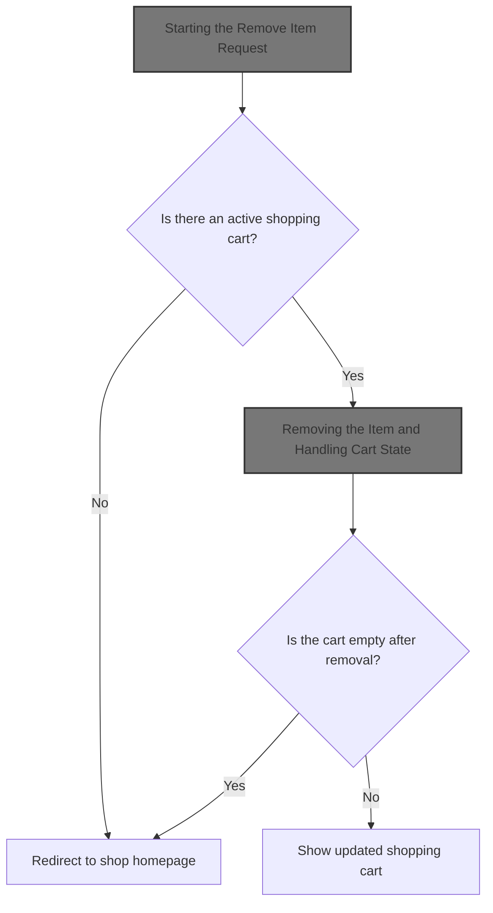
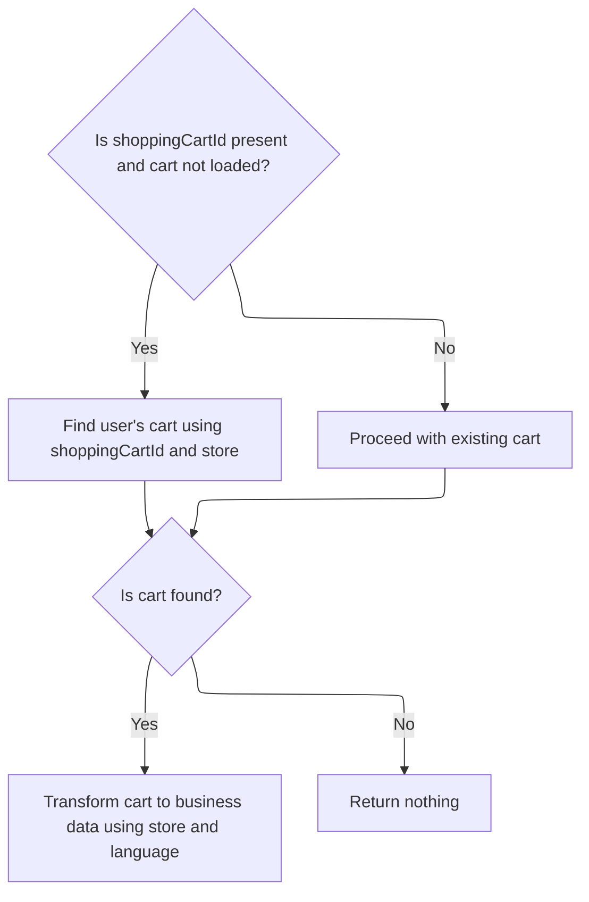
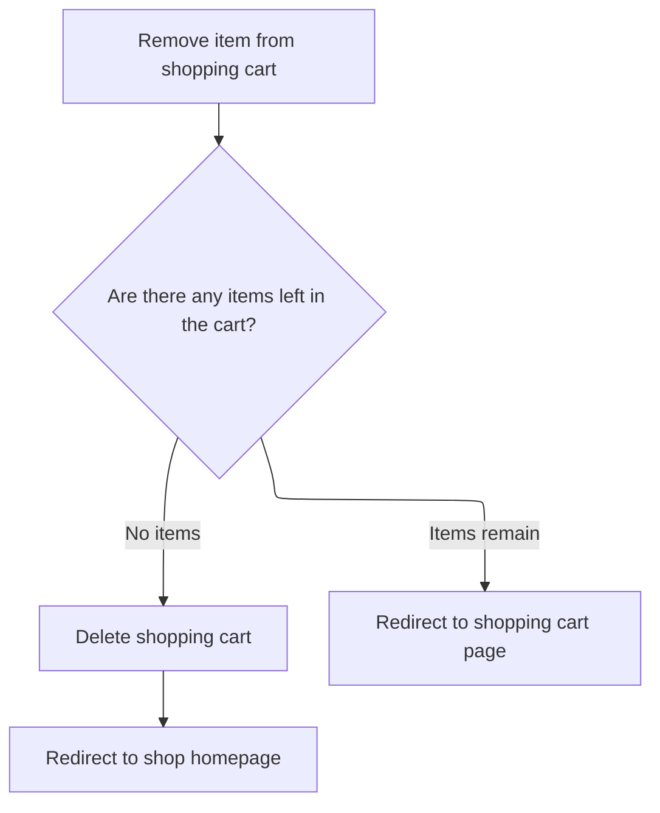

This document describes the process for removing an item from a user's shopping cart. When a user requests to remove an item, the system checks for an active cart, updates the cart by removing the item, and determines whether to show the updated cart or redirect the user if the cart is empty.



# Starting the Remove Item Request

This section ensures that all necessary context and data are present before attempting to remove an item from the shopping cart. It validates the user's session, checks for a valid cart, and retrieves the current cart data to support subsequent removal operations.

| Category        | Rule Name               | Description                                                                                                                                                                          |
| --------------- | ----------------------- | ------------------------------------------------------------------------------------------------------------------------------------------------------------------------------------ |
| Data validation | Cart Existence Required | If there is no shopping cart code present in the user's session, the remove item request must be aborted and the user redirected to the shop homepage.                               |
| Data validation | Context Data Required   | The store, language, and customer information must be retrieved from the session and request to ensure the remove item operation is performed in the correct business context.       |
| Business logic  | Fetch Current Cart Data | Before attempting to remove an item, the current shopping cart data for the user and cart code must be retrieved to ensure the operation is performed on the correct cart and items. |

<SwmSnippet path="/shopizer/sm-shop/src/main/java/com/salesmanager/web/shop/controller/shoppingCart/ShoppingCartController.java" line="309">

---

In <SwmToken path="shopizer/sm-shop/src/main/java/com/salesmanager/web/shop/controller/shoppingCart/ShoppingCartController.java" pos="309:3:3" line-data="	String removeShoppingCartItem(final Long lineItemId, final HttpServletRequest request, final HttpServletResponse response) throws Exception {">`removeShoppingCartItem`</SwmToken>, we start by pulling the store, language, and customer from the session and request. Then, we check if there's a cart code in the session—if not, we bail out early. Next, we call the facade to fetch the current cart data for this user and cart code, so we know what we're working with before trying to remove anything.

```java
	String removeShoppingCartItem(final Long lineItemId, final HttpServletRequest request, final HttpServletResponse response) throws Exception {


		//Looks in the HttpSession to see if a customer is logged in

		//get any shopping cart for this user

		//** need to check if the item has property, similar items may exist but with different properties
		//String attributes = request.getParameter("attribute");//attributes id are sent as 1|2|5|
		//this will help with hte removal of the appropriate item

		//remove the item shoppingCartService.create

		//create JSON representation of the shopping cart

		//return the JSON structure in AjaxResponse

		//store the shopping cart in the http session

	    MerchantStore store = getSessionAttribute(Constants.MERCHANT_STORE, request);
	    Language language = (Language)request.getAttribute(Constants.LANGUAGE);
	    Customer customer = getSessionAttribute(  Constants.CUSTOMER, request );
        
        /** there must be a cart in the session **/
        String cartCode = (String)request.getSession().getAttribute(Constants.SHOPPING_CART);
        
        if(StringUtils.isBlank(cartCode)) {
        	return "redirect:/shop";
        }
                
        ShoppingCartData shoppingCart = shoppingCartFacade.getShoppingCartData(customer, store, cartCode);
                
```

---

</SwmSnippet>

## Fetching Cart Data for the User

This section is responsible for retrieving the shopping cart data for a user, ensuring that the cart is fetched using the most relevant identifier (customer or cart code) to provide an accurate and up-to-date shopping cart experience.

| Category        | Rule Name               | Description                                                                                                      |
| --------------- | ----------------------- | ---------------------------------------------------------------------------------------------------------------- |
| Data validation | Accurate Cart State     | The shopping cart data returned must accurately reflect the current contents and state of the cart for the user. |
| Business logic  | Customer Cart Retrieval | If a customer is provided, the shopping cart must be retrieved using the customer's identity.                    |
| Business logic  | Cart Code Fallback      | If no customer is provided, the shopping cart must be retrieved using the shopping cart code and merchant store. |

<SwmSnippet path="/shopizer/sm-shop/src/main/java/com/salesmanager/web/shop/controller/shoppingCart/facade/ShoppingCartFacadeImpl.java" line="260">

---

In <SwmToken path="shopizer/sm-shop/src/main/java/com/salesmanager/web/shop/controller/shoppingCart/facade/ShoppingCartFacadeImpl.java" pos="260:5:5" line-data="    public ShoppingCartData getShoppingCartData( final Customer customer, final MerchantStore store,">`getShoppingCartData`</SwmToken>, we try to get the cart for the customer, and if that fails, we use the cart code and store via the service.

```java
    public ShoppingCartData getShoppingCartData( final Customer customer, final MerchantStore store,
                                                 final String shoppingCartId )
        throws Exception
    {

        ShoppingCart cart = null;
        try
        {
            if ( customer != null )
            {
                LOG.info( "Reteriving customer shopping cart..." );

                cart = shoppingCartService.getShoppingCart( customer );

            }

            else
            {
```

---

</SwmSnippet>

### Resolving the Cart Instance

This section governs how the system identifies and manages the current shopping cart instance for a user. It ensures that each user session is associated with the correct cart, whether the user is a guest or logged in, and that cart data is consistent throughout the shopping experience.

| Category       | Rule Name                       | Description                                                                                                                                               |
| -------------- | ------------------------------- | --------------------------------------------------------------------------------------------------------------------------------------------------------- |
| Business logic | Unique Cart Per Session         | Each user session must be associated with a unique cart instance. If a cart does not exist for the session, a new cart must be created.                   |
| Business logic | Cart Merge on Login             | If a user logs in and already has an existing cart from a previous session, the system must merge the current session cart with the user's existing cart. |
| Business logic | Cart Invalidation on Completion | A cart instance must be invalidated and cleared when the user completes a purchase or explicitly empties the cart.                                        |

See <SwmLink doc-title="Retrieving and Validating the Customer&#39;s Shopping Cart">[Retrieving and Validating the Customer's Shopping Cart](.swm%5Cretrieving-and-validating-the-customers-shopping-cart.daargwxo.sw.md)</SwmLink>

### Preparing Cart Data for the Controller



<SwmSnippet path="/shopizer/sm-shop/src/main/java/com/salesmanager/web/shop/controller/shoppingCart/facade/ShoppingCartFacadeImpl.java" line="278">

---

Back in <SwmToken path="shopizer/sm-shop/src/main/java/com/salesmanager/web/shop/controller/shoppingCart/ShoppingCartController.java" pos="340:9:9" line-data="        ShoppingCartData shoppingCart = shoppingCartFacade.getShoppingCartData(customer, store, cartCode);">`getShoppingCartData`</SwmToken>, after trying both ways to fetch the cart, if we still don't have one, we return null. If we do have a cart, we use a populator to convert it into a data object for the controller, including calculated prices and language-specific info.

```java
                if ( StringUtils.isNotBlank( shoppingCartId ) && cart == null )
                {
                    cart = shoppingCartService.getByCode( shoppingCartId, store );
                }

            }
        }
        catch ( ServiceException ex )
        {
            LOG.error( "Error while retriving cart from customer", ex );
        }
        catch( NoResultException nre) {
        	//nothing
        }

        if ( cart == null )
        {
            return null;
        }

        LOG.info( "Cart model found." );

        ShoppingCartDataPopulator shoppingCartDataPopulator = new ShoppingCartDataPopulator();
        shoppingCartDataPopulator.setShoppingCartCalculationService( shoppingCartCalculationService );
        shoppingCartDataPopulator.setPricingService( pricingService );

        Language language = (Language) getKeyValue( Constants.LANGUAGE );
        MerchantStore merchantStore = (MerchantStore) getKeyValue( Constants.MERCHANT_STORE );
        return shoppingCartDataPopulator.populate( cart, merchantStore, language );

    }
```

---

</SwmSnippet>

## Removing the Item and Handling Cart State



<SwmSnippet path="/shopizer/sm-shop/src/main/java/com/salesmanager/web/shop/controller/shoppingCart/ShoppingCartController.java" line="342">

---

Back in <SwmToken path="shopizer/sm-shop/src/main/java/com/salesmanager/web/shop/controller/shoppingCart/ShoppingCartController.java" pos="309:3:3" line-data="	String removeShoppingCartItem(final Long lineItemId, final HttpServletRequest request, final HttpServletResponse response) throws Exception {">`removeShoppingCartItem`</SwmToken>, after removing the item via the facade, we check if the cart is now empty. If so, we delete the cart and send the user back to the shop. If not, we just show the updated cart page. This keeps the cart state consistent for the user.

```java
		ShoppingCartData shoppingCartData=shoppingCartFacade.removeCartItem(lineItemId, shoppingCart.getCode(),store,language);

		
		if(CollectionUtils.isEmpty(shoppingCartData.getShoppingCartItems())) {
			shoppingCartFacade.deleteShoppingCart(shoppingCartData.getId(), store);
			return "redirect:/shop";
		}
		
		
		
		return Constants.REDIRECT_PREFIX + "/shop/shoppingCart.html";


	}
```

---

</SwmSnippet>

&nbsp;

*This is an auto-generated document by Swimm 🌊 and has not yet been verified by a human*

<SwmMeta version="3.0.0" repo-id="Z2l0aHViJTNBJTNBU2hvcGl6ZXIlM0ElM0F1bWFsaW5nYXN3YW1p" repo-name="Shopizer"><sup>Powered by [Swimm](https://app.swimm.io/)</sup></SwmMeta>
