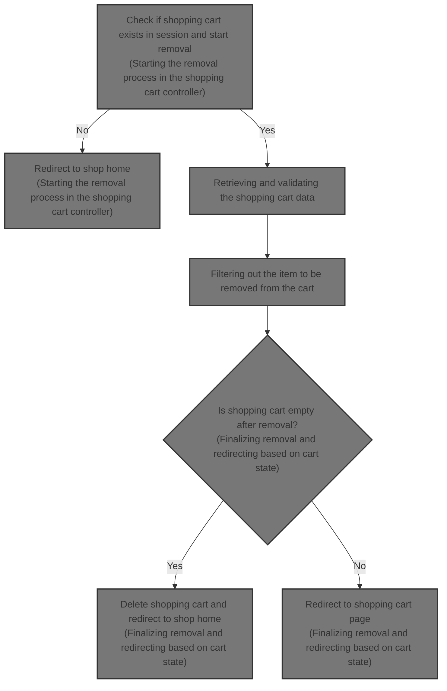
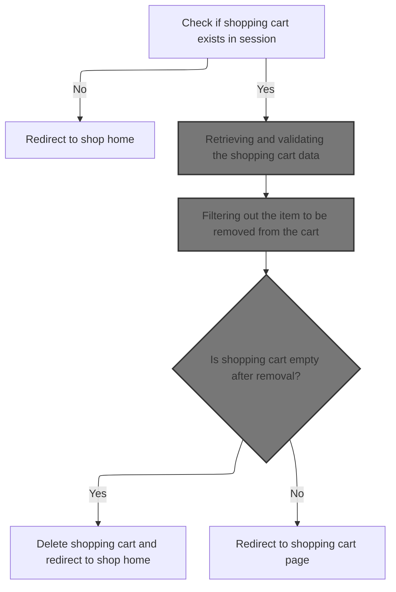
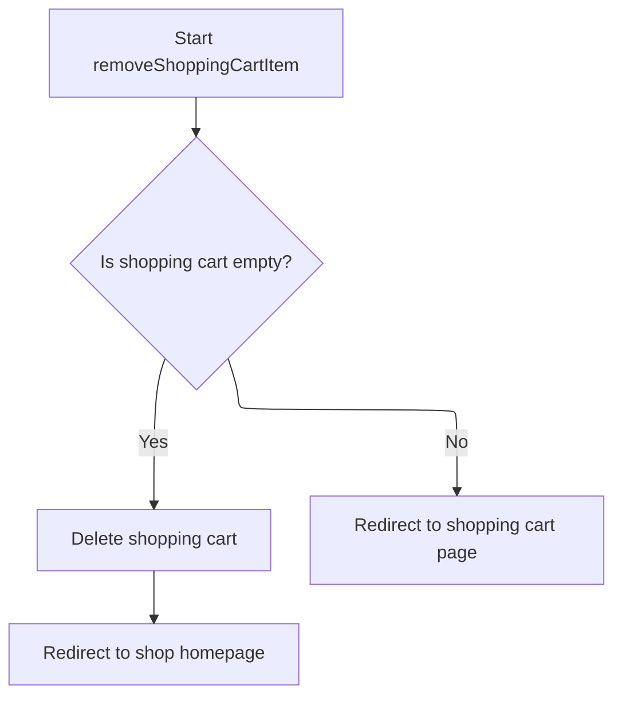

This document describes the flow of removing an item from the shopping cart in an e-commerce platform. It ensures the cart is retrieved and validated before removing the specified item. After removal, it checks if the cart is empty and either deletes the cart and redirects to the shop homepage or redirects to the updated shopping cart page.



# Starting the removal process in the shopping cart controller



This section handles the removal of an item from the shopping cart in the e-commerce platform.

| Category       | Rule Name                  | Description                                                                                                                                     |
| -------------- | -------------------------- | ----------------------------------------------------------------------------------------------------------------------------------------------- |
| Business logic | Remove specified item      | The item identified by the given line item ID must be removed from the shopping cart, considering item properties to distinguish similar items. |
| Business logic | Empty cart handling        | If the shopping cart is empty after item removal, the cart must be deleted and the user redirected to the shop home page.                       |
| Business logic | Non-empty cart redirection | If the shopping cart still contains items after removal, the user must be redirected to the shopping cart page to review the updated cart.      |

<SwmSnippet path="/shopizer/sm-shop/src/main/java/com/salesmanager/web/shop/controller/shoppingCart/ShoppingCartController.java" line="309">

---

In <SwmToken path="shopizer/sm-shop/src/main/java/com/salesmanager/web/shop/controller/shoppingCart/ShoppingCartController.java" pos="309:3:3" line-data="	String removeShoppingCartItem(final Long lineItemId, final HttpServletRequest request, final HttpServletResponse response) throws Exception {">`removeShoppingCartItem`</SwmToken>, we get session info and the cart code, then call <SwmToken path="shopizer/sm-shop/src/main/java/com/salesmanager/web/shop/controller/shoppingCart/ShoppingCartController.java" pos="340:7:9" line-data="        ShoppingCartData shoppingCart = shoppingCartFacade.getShoppingCartData(customer, store, cartCode);">`shoppingCartFacade.getShoppingCartData`</SwmToken> to fetch the detailed cart data for the current user or session. This sets us up to remove the item correctly.

```java
	String removeShoppingCartItem(final Long lineItemId, final HttpServletRequest request, final HttpServletResponse response) throws Exception {


		//Looks in the HttpSession to see if a customer is logged in

		//get any shopping cart for this user

		//** need to check if the item has property, similar items may exist but with different properties
		//String attributes = request.getParameter("attribute");//attributes id are sent as 1|2|5|
		//this will help with hte removal of the appropriate item

		//remove the item shoppingCartService.create

		//create JSON representation of the shopping cart

		//return the JSON structure in AjaxResponse

		//store the shopping cart in the http session

	    MerchantStore store = getSessionAttribute(Constants.MERCHANT_STORE, request);
	    Language language = (Language)request.getAttribute(Constants.LANGUAGE);
	    Customer customer = getSessionAttribute(  Constants.CUSTOMER, request );
        
        /** there must be a cart in the session **/
        String cartCode = (String)request.getSession().getAttribute(Constants.SHOPPING_CART);
        
        if(StringUtils.isBlank(cartCode)) {
        	return "redirect:/shop";
        }
                
        ShoppingCartData shoppingCart = shoppingCartFacade.getShoppingCartData(customer, store, cartCode);
                
```

---

</SwmSnippet>

## Retrieving and validating the shopping cart data

```mermaid
%%{init: {"flowchart": {"defaultRenderer": "elk"}} }%%
flowchart TD
    node1{"Is customer provided?"}
    click node1 openCode "shopizer/sm-shop/src/main/java/com/salesmanager/web/shop/controller/shoppingCart/facade/ShoppingCartFacadeImpl.java:268:270"
    node1 -->|"Yes"| node2["Retrieve cart for customer"]
    click node2 openCode "shopizer/sm-core/src/main/java/com/salesmanager/core/business/shoppingcart/service/ShoppingCartServiceImpl.java:68:86"
    node1 -->|"No"| node3{"Is shoppingCartId provided?"}
    click node3 openCode "shopizer/sm-shop/src/main/java/com/salesmanager/web/shop/controller/shoppingCart/facade/ShoppingCartFacadeImpl.java:278:280"
    node2 --> node4{"Is cart found?"}
    click node4 openCode "shopizer/sm-shop/src/main/java/com/salesmanager/web/shop/controller/shoppingCart/facade/ShoppingCartFacadeImpl.java:293:295"
    node4 -->|"Yes"| node6["Populate and return shopping cart data with localization and pricing"]
    click node6 openCode "shopizer/sm-shop/src/main/java/com/salesmanager/web/shop/controller/shoppingCart/facade/ShoppingCartFacadeImpl.java:300:307"
    node4 -->|"No"| node3
    node3 -->|"Yes"| node5["Retrieve cart by shoppingCartId"]
    click node5 openCode "shopizer/sm-shop/src/main/java/com/salesmanager/web/shop/controller/shoppingCart/facade/ShoppingCartFacadeImpl.java:278:280"
    node5 -->|"Cart found"| node6
    node5 -->|"Cart not found"| node7["Return null (no cart)"]
    click node7 openCode "shopizer/sm-shop/src/main/java/com/salesmanager/web/shop/controller/shoppingCart/facade/ShoppingCartFacadeImpl.java:293:295"
    node3 -->|"No"| node7

classDef HeadingStyle fill:#777777,stroke:#333,stroke-width:2px;

%% Swimm:
%% %%{init: {"flowchart": {"defaultRenderer": "elk"}} }%%
%% flowchart TD
%%     node1{"Is customer provided?"}
%%     click node1 openCode "<SwmPath>[shopizer/…/facade/ShoppingCartFacadeImpl.java](shopizer/sm-shop/src/main/java/com/salesmanager/web/shop/controller/shoppingCart/facade/ShoppingCartFacadeImpl.java)</SwmPath>:268:270"
%%     node1 -->|"Yes"| node2["Retrieve cart for customer"]
%%     click node2 openCode "<SwmPath>[shopizer/…/service/ShoppingCartServiceImpl.java](shopizer/sm-core/src/main/java/com/salesmanager/core/business/shoppingcart/service/ShoppingCartServiceImpl.java)</SwmPath>:68:86"
%%     node1 -->|"No"| node3{"Is <SwmToken path="shopizer/sm-shop/src/main/java/com/salesmanager/web/shop/controller/shoppingCart/facade/ShoppingCartFacadeImpl.java" pos="261:5:5" line-data="                                                 final String shoppingCartId )">`shoppingCartId`</SwmToken> provided?"}
%%     click node3 openCode "<SwmPath>[shopizer/…/facade/ShoppingCartFacadeImpl.java](shopizer/sm-shop/src/main/java/com/salesmanager/web/shop/controller/shoppingCart/facade/ShoppingCartFacadeImpl.java)</SwmPath>:278:280"
%%     node2 --> node4{"Is cart found?"}
%%     click node4 openCode "<SwmPath>[shopizer/…/facade/ShoppingCartFacadeImpl.java](shopizer/sm-shop/src/main/java/com/salesmanager/web/shop/controller/shoppingCart/facade/ShoppingCartFacadeImpl.java)</SwmPath>:293:295"
%%     node4 -->|"Yes"| node6["Populate and return shopping cart data with localization and pricing"]
%%     click node6 openCode "<SwmPath>[shopizer/…/facade/ShoppingCartFacadeImpl.java](shopizer/sm-shop/src/main/java/com/salesmanager/web/shop/controller/shoppingCart/facade/ShoppingCartFacadeImpl.java)</SwmPath>:300:307"
%%     node4 -->|"No"| node3
%%     node3 -->|"Yes"| node5["Retrieve cart by <SwmToken path="shopizer/sm-shop/src/main/java/com/salesmanager/web/shop/controller/shoppingCart/facade/ShoppingCartFacadeImpl.java" pos="261:5:5" line-data="                                                 final String shoppingCartId )">`shoppingCartId`</SwmToken>"]
%%     click node5 openCode "<SwmPath>[shopizer/…/facade/ShoppingCartFacadeImpl.java](shopizer/sm-shop/src/main/java/com/salesmanager/web/shop/controller/shoppingCart/facade/ShoppingCartFacadeImpl.java)</SwmPath>:278:280"
%%     node5 -->|"Cart found"| node6
%%     node5 -->|"Cart not found"| node7["Return null (no cart)"]
%%     click node7 openCode "<SwmPath>[shopizer/…/facade/ShoppingCartFacadeImpl.java](shopizer/sm-shop/src/main/java/com/salesmanager/web/shop/controller/shoppingCart/facade/ShoppingCartFacadeImpl.java)</SwmPath>:293:295"
%%     node3 -->|"No"| node7
%% 
%% classDef HeadingStyle fill:#777777,stroke:#333,stroke-width:2px;
```



This section handles retrieving and validating the shopping cart data for a customer or by shopping cart ID, ensuring the cart is current and populated with localized pricing details.

| Category       | Rule Name               | Description                                                                                |
| -------------- | ----------------------- | ------------------------------------------------------------------------------------------ |
| Business logic | Customer cart retrieval | If a customer is provided, retrieve the shopping cart associated with that customer.       |
| Business logic | Obsolete cart handling  | If the retrieved cart is obsolete, it must be deleted and treated as if no cart exists.    |
| Business logic | Cart retrieval by ID    | If no customer is provided but a shopping cart ID is given, retrieve the cart by that ID.  |
| Business logic | Null cart return        | If no cart is found by customer or ID, return null indicating no cart is available.        |
| Business logic | Cart data population    | Populate the shopping cart data with localization and pricing details before returning it. |

<SwmSnippet path="/shopizer/sm-shop/src/main/java/com/salesmanager/web/shop/controller/shoppingCart/facade/ShoppingCartFacadeImpl.java" line="260">

---

In <SwmToken path="shopizer/sm-shop/src/main/java/com/salesmanager/web/shop/controller/shoppingCart/facade/ShoppingCartFacadeImpl.java" pos="260:5:5" line-data="    public ShoppingCartData getShoppingCartData( final Customer customer, final MerchantStore store,">`getShoppingCartData`</SwmToken>, we try to get the cart model for the logged-in customer by calling <SwmToken path="shopizer/sm-shop/src/main/java/com/salesmanager/web/shop/controller/shoppingCart/facade/ShoppingCartFacadeImpl.java" pos="272:5:7" line-data="                cart = shoppingCartService.getShoppingCart( customer );">`shoppingCartService.getShoppingCart`</SwmToken>. This fetches the cart entity we need to build the detailed cart data.

```java
    public ShoppingCartData getShoppingCartData( final Customer customer, final MerchantStore store,
                                                 final String shoppingCartId )
        throws Exception
    {

        ShoppingCart cart = null;
        try
        {
            if ( customer != null )
            {
                LOG.info( "Reteriving customer shopping cart..." );

                cart = shoppingCartService.getShoppingCart( customer );

            }

            else
            {
```

---

</SwmSnippet>

<SwmSnippet path="/shopizer/sm-core/src/main/java/com/salesmanager/core/business/shoppingcart/service/ShoppingCartServiceImpl.java" line="68">

---

<SwmToken path="shopizer/sm-core/src/main/java/com/salesmanager/core/business/shoppingcart/service/ShoppingCartServiceImpl.java" pos="68:5:5" line-data="	public ShoppingCart getShoppingCart(final Customer customer) throws ServiceException {">`getShoppingCart`</SwmToken> loads the cart for the customer, checks if it's obsolete, deletes it if so, and returns null or the valid cart.

```java
	public ShoppingCart getShoppingCart(final Customer customer) throws ServiceException {

		try {

			ShoppingCart shoppingCart = shoppingCartDao.getByCustomer(customer);
			populateShoppingCart(shoppingCart);
			if(shoppingCart!=null && shoppingCart.isObsolete()) {
				delete(shoppingCart);
				return null;
			} else {
				return shoppingCart;
			}


		} catch (Exception e) {
			throw new ServiceException(e);
		}

	}
```

---

</SwmSnippet>

<SwmSnippet path="/shopizer/sm-shop/src/main/java/com/salesmanager/web/shop/controller/shoppingCart/facade/ShoppingCartFacadeImpl.java" line="278">

---

After getting the cart model, <SwmToken path="shopizer/sm-shop/src/main/java/com/salesmanager/web/shop/controller/shoppingCart/ShoppingCartController.java" pos="340:9:9" line-data="        ShoppingCartData shoppingCart = shoppingCartFacade.getShoppingCartData(customer, store, cartCode);">`getShoppingCartData`</SwmToken> uses `ShoppingCartDataPopulator.populate` to convert it into detailed cart data with pricing and language applied.

```java
                if ( StringUtils.isNotBlank( shoppingCartId ) && cart == null )
                {
                    cart = shoppingCartService.getByCode( shoppingCartId, store );
                }

            }
        }
        catch ( ServiceException ex )
        {
            LOG.error( "Error while retriving cart from customer", ex );
        }
        catch( NoResultException nre) {
        	//nothing
        }

        if ( cart == null )
        {
            return null;
        }

        LOG.info( "Cart model found." );

        ShoppingCartDataPopulator shoppingCartDataPopulator = new ShoppingCartDataPopulator();
        shoppingCartDataPopulator.setShoppingCartCalculationService( shoppingCartCalculationService );
        shoppingCartDataPopulator.setPricingService( pricingService );

        Language language = (Language) getKeyValue( Constants.LANGUAGE );
        MerchantStore merchantStore = (MerchantStore) getKeyValue( Constants.MERCHANT_STORE );
        return shoppingCartDataPopulator.populate( cart, merchantStore, language );

    }
```

---

</SwmSnippet>

## Building detailed cart data with item and attribute mapping

```mermaid
%%{init: {"flowchart": {"defaultRenderer": "elk"}} }%%
flowchart TD
    node1["Set cart code from shopping cart"]
    click node1 openCode "shopizer/sm-shop/src/main/java/com/salesmanager/web/populator/shoppingCart/ShoppingCartDataPopulator.java:77:78"
    node1 --> node2{"Are there shopping cart items?"}
    click node2 openCode "shopizer/sm-shop/src/main/java/com/salesmanager/web/populator/shoppingCart/ShoppingCartDataPopulator.java:81:82"
    node2 -->|"No"| node3["Calculate order totals"]
    click node3 openCode "shopizer/sm-core/src/main/java/com/salesmanager/core/business/shoppingcart/service/ShoppingCartCalculationServiceImpl.java:95:106"
    node2 -->|"Yes"| loop1

    subgraph loop1["For each item in shopping cart"]
        node4["Transform item to display format with product details, price, quantity"]
        click node4 openCode "shopizer/sm-shop/src/main/java/com/salesmanager/web/populator/shoppingCart/ShoppingCartDataPopulator.java:83:126"
        node4 --> node5{"Does product have image?"}
        click node5 openCode "shopizer/sm-shop/src/main/java/com/salesmanager/web/populator/shoppingCart/ShoppingCartDataPopulator.java:102:106"
        node5 -->|"Yes"| node6["Set product image path"]
        click node6 openCode "shopizer/sm-shop/src/main/java/com/salesmanager/web/populator/shoppingCart/ShoppingCartDataPopulator.java:104:105"
        node5 -->|"No"| node7["Continue without image"]
        click node7 openCode "shopizer/sm-shop/src/main/java/com/salesmanager/web/populator/shoppingCart/ShoppingCartDataPopulator.java:106:106"
        node6 --> node8{"Does item have attributes?"}
        node7 --> node8
        node8 -->|"Yes"| node9["Transform attributes to display format"]
        click node9 openCode "shopizer/sm-shop/src/main/java/com/salesmanager/web/populator/shoppingCart/ShoppingCartDataPopulator.java:107:124"
        node8 -->|"No"| node10["Continue"]
        click node10 openCode "shopizer/sm-shop/src/main/java/com/salesmanager/web/populator/shoppingCart/ShoppingCartDataPopulator.java:125:126"
        node9 --> node10
        node10 --> node11["Add item to cart items list"]
        click node11 openCode "shopizer/sm-shop/src/main/java/com/salesmanager/web/populator/shoppingCart/ShoppingCartDataPopulator.java:126:126"
        node11 --> node4
    end

    node3 --> node12{"Are there order totals?"}
    click node12 openCode "shopizer/sm-shop/src/main/java/com/salesmanager/web/populator/shoppingCart/ShoppingCartDataPopulator.java:139:140"
    node12 -->|"No"| node13["Continue without totals"]
    click node13 openCode "shopizer/sm-shop/src/main/java/com/salesmanager/web/populator/shoppingCart/ShoppingCartDataPopulator.java:148:148"
    node12 -->|"Yes"| loop2

    subgraph loop2["For each order total"]
        node14["Transform order total to display format"]
        click node14 openCode "shopizer/sm-shop/src/main/java/com/salesmanager/web/populator/shoppingCart/ShoppingCartDataPopulator.java:141:146"
        node14 --> node15["Add order total to totals list"]
        click node15 openCode "shopizer/sm-shop/src/main/java/com/salesmanager/web/populator/shoppingCart/ShoppingCartDataPopulator.java:146:146"
        node15 --> node12
    end

    node13 --> node16["Set cart subtotal, total, quantity, and id"]
    click node16 openCode "shopizer/sm-shop/src/main/java/com/salesmanager/web/populator/shoppingCart/ShoppingCartDataPopulator.java:150:153"
    node16 --> node17["Return populated cart data"]
    click node17 openCode "shopizer/sm-shop/src/main/java/com/salesmanager/web/populator/shoppingCart/ShoppingCartDataPopulator.java:159:159"
classDef HeadingStyle fill:#777777,stroke:#333,stroke-width:2px;

%% Swimm:
%% %%{init: {"flowchart": {"defaultRenderer": "elk"}} }%%
%% flowchart TD
%%     node1["Set cart code from shopping cart"]
%%     click node1 openCode "<SwmPath>[shopizer/…/shoppingCart/ShoppingCartDataPopulator.java](shopizer/sm-shop/src/main/java/com/salesmanager/web/populator/shoppingCart/ShoppingCartDataPopulator.java)</SwmPath>:77:78"
%%     node1 --> node2{"Are there shopping cart items?"}
%%     click node2 openCode "<SwmPath>[shopizer/…/shoppingCart/ShoppingCartDataPopulator.java](shopizer/sm-shop/src/main/java/com/salesmanager/web/populator/shoppingCart/ShoppingCartDataPopulator.java)</SwmPath>:81:82"
%%     node2 -->|"No"| node3["Calculate order totals"]
%%     click node3 openCode "<SwmPath>[shopizer/…/service/ShoppingCartCalculationServiceImpl.java](shopizer/sm-core/src/main/java/com/salesmanager/core/business/shoppingcart/service/ShoppingCartCalculationServiceImpl.java)</SwmPath>:95:106"
%%     node2 -->|"Yes"| loop1
%% 
%%     subgraph loop1["For each item in shopping cart"]
%%         node4["Transform item to display format with product details, price, quantity"]
%%         click node4 openCode "<SwmPath>[shopizer/…/shoppingCart/ShoppingCartDataPopulator.java](shopizer/sm-shop/src/main/java/com/salesmanager/web/populator/shoppingCart/ShoppingCartDataPopulator.java)</SwmPath>:83:126"
%%         node4 --> node5{"Does product have image?"}
%%         click node5 openCode "<SwmPath>[shopizer/…/shoppingCart/ShoppingCartDataPopulator.java](shopizer/sm-shop/src/main/java/com/salesmanager/web/populator/shoppingCart/ShoppingCartDataPopulator.java)</SwmPath>:102:106"
%%         node5 -->|"Yes"| node6["Set product image path"]
%%         click node6 openCode "<SwmPath>[shopizer/…/shoppingCart/ShoppingCartDataPopulator.java](shopizer/sm-shop/src/main/java/com/salesmanager/web/populator/shoppingCart/ShoppingCartDataPopulator.java)</SwmPath>:104:105"
%%         node5 -->|"No"| node7["Continue without image"]
%%         click node7 openCode "<SwmPath>[shopizer/…/shoppingCart/ShoppingCartDataPopulator.java](shopizer/sm-shop/src/main/java/com/salesmanager/web/populator/shoppingCart/ShoppingCartDataPopulator.java)</SwmPath>:106:106"
%%         node6 --> node8{"Does item have attributes?"}
%%         node7 --> node8
%%         node8 -->|"Yes"| node9["Transform attributes to display format"]
%%         click node9 openCode "<SwmPath>[shopizer/…/shoppingCart/ShoppingCartDataPopulator.java](shopizer/sm-shop/src/main/java/com/salesmanager/web/populator/shoppingCart/ShoppingCartDataPopulator.java)</SwmPath>:107:124"
%%         node8 -->|"No"| node10["Continue"]
%%         click node10 openCode "<SwmPath>[shopizer/…/shoppingCart/ShoppingCartDataPopulator.java](shopizer/sm-shop/src/main/java/com/salesmanager/web/populator/shoppingCart/ShoppingCartDataPopulator.java)</SwmPath>:125:126"
%%         node9 --> node10
%%         node10 --> node11["Add item to cart items list"]
%%         click node11 openCode "<SwmPath>[shopizer/…/shoppingCart/ShoppingCartDataPopulator.java](shopizer/sm-shop/src/main/java/com/salesmanager/web/populator/shoppingCart/ShoppingCartDataPopulator.java)</SwmPath>:126:126"
%%         node11 --> node4
%%     end
%% 
%%     node3 --> node12{"Are there order totals?"}
%%     click node12 openCode "<SwmPath>[shopizer/…/shoppingCart/ShoppingCartDataPopulator.java](shopizer/sm-shop/src/main/java/com/salesmanager/web/populator/shoppingCart/ShoppingCartDataPopulator.java)</SwmPath>:139:140"
%%     node12 -->|"No"| node13["Continue without totals"]
%%     click node13 openCode "<SwmPath>[shopizer/…/shoppingCart/ShoppingCartDataPopulator.java](shopizer/sm-shop/src/main/java/com/salesmanager/web/populator/shoppingCart/ShoppingCartDataPopulator.java)</SwmPath>:148:148"
%%     node12 -->|"Yes"| loop2
%% 
%%     subgraph loop2["For each order total"]
%%         node14["Transform order total to display format"]
%%         click node14 openCode "<SwmPath>[shopizer/…/shoppingCart/ShoppingCartDataPopulator.java](shopizer/sm-shop/src/main/java/com/salesmanager/web/populator/shoppingCart/ShoppingCartDataPopulator.java)</SwmPath>:141:146"
%%         node14 --> node15["Add order total to totals list"]
%%         click node15 openCode "<SwmPath>[shopizer/…/shoppingCart/ShoppingCartDataPopulator.java](shopizer/sm-shop/src/main/java/com/salesmanager/web/populator/shoppingCart/ShoppingCartDataPopulator.java)</SwmPath>:146:146"
%%         node15 --> node12
%%     end
%% 
%%     node13 --> node16["Set cart subtotal, total, quantity, and id"]
%%     click node16 openCode "<SwmPath>[shopizer/…/shoppingCart/ShoppingCartDataPopulator.java](shopizer/sm-shop/src/main/java/com/salesmanager/web/populator/shoppingCart/ShoppingCartDataPopulator.java)</SwmPath>:150:153"
%%     node16 --> node17["Return populated cart data"]
%%     click node17 openCode "<SwmPath>[shopizer/…/shoppingCart/ShoppingCartDataPopulator.java](shopizer/sm-shop/src/main/java/com/salesmanager/web/populator/shoppingCart/ShoppingCartDataPopulator.java)</SwmPath>:159:159"
%% classDef HeadingStyle fill:#777777,stroke:#333,stroke-width:2px;
```



This section describes the process of building detailed shopping cart data by mapping each item and its attributes, calculating order totals, and preparing the cart data for frontend display.

| Category       | Rule Name               | Description                                                                                                                                              |
| -------------- | ----------------------- | -------------------------------------------------------------------------------------------------------------------------------------------------------- |
| Business logic | Cart code assignment    | The cart data must include a unique cart code derived from the shopping cart to identify the cart instance.                                              |
| Business logic | Item presence check     | If the shopping cart contains no items, the system should calculate order totals without item details and continue processing.                           |
| Business logic | Item detail mapping     | Each shopping cart item must be transformed into a display format including product code, name, price, quantity, and subtotal for frontend presentation. |
| Business logic | Product image inclusion | If a product has an associated image, the image path must be included in the cart item data to enhance the user interface.                               |
| Business logic | Attribute mapping       | Item attributes such as options and values must be mapped into structured attribute data with identifiers and descriptive names for display.             |
| Business logic | Order total calculation | The system must calculate order totals including taxes, discounts, and other adjustments to provide an accurate summary of charges.                      |
| Business logic | Totals mapping          | Calculated order totals must be transformed into frontend-friendly total objects with codes and values for display in the cart summary.                  |
| Business logic | Cart summary update     | The cart data must include updated subtotal, total, quantity, and cart ID reflecting the current state of the shopping cart after calculations.          |

<SwmSnippet path="/shopizer/sm-shop/src/main/java/com/salesmanager/web/populator/shoppingCart/ShoppingCartDataPopulator.java" line="73">

---

In <SwmToken path="shopizer/sm-shop/src/main/java/com/salesmanager/web/populator/shoppingCart/ShoppingCartDataPopulator.java" pos="73:5:5" line-data="    public ShoppingCartData populate(final ShoppingCart shoppingCart,">`populate`</SwmToken>, we start by setting the cart code and iterating over each shopping cart item. For each item, we create a data object, set product details, price, quantity, and map product images. We also map item attributes like options and values to structured attribute data. This builds the detailed item list for the cart data.

```java
    public ShoppingCartData populate(final ShoppingCart shoppingCart,
                                     final ShoppingCartData cart, final MerchantStore store, final Language language) {

    	int cartQuantity = 0;
        cart.setCode(shoppingCart.getShoppingCartCode());
        Set<com.salesmanager.core.business.shoppingcart.model.ShoppingCartItem> items = shoppingCart.getLineItems();
        List<ShoppingCartItem> shoppingCartItemsList=Collections.emptyList();
        try{
            if(items!=null) {
                shoppingCartItemsList=new ArrayList<ShoppingCartItem>();
                for(com.salesmanager.core.business.shoppingcart.model.ShoppingCartItem item : items) {

                    ShoppingCartItem shoppingCartItem = new ShoppingCartItem();
                    shoppingCartItem.setCode(cart.getCode());
                    shoppingCartItem.setProductCode(item.getProduct().getSku());
                    shoppingCartItem.setProductVirtual(item.isProductVirtual());

                    shoppingCartItem.setProductId(item.getProductId());
                    shoppingCartItem.setId(item.getId());
                    shoppingCartItem.setName(item.getProduct().getProductDescription().getName());

                    shoppingCartItem.setPrice(pricingService.getDisplayAmount(item.getItemPrice(),store));
                    shoppingCartItem.setQuantity(item.getQuantity());
                    
                    
                    cartQuantity = cartQuantity + item.getQuantity();
                    
                    shoppingCartItem.setProductPrice(item.getItemPrice());
                    shoppingCartItem.setSubTotal(pricingService.getDisplayAmount(item.getSubTotal(), store));
                    ProductImage image = item.getProduct().getProductImage();
                    if(image!=null) {
                        String imagePath = ImageFilePathUtils.buildProductImageFilePath(store, item.getProduct().getSku(), image.getProductImage());
                        shoppingCartItem.setImage(imagePath);
                    }
                    Set<com.salesmanager.core.business.shoppingcart.model.ShoppingCartAttributeItem> attributes = item.getAttributes();
                    if(attributes!=null) {
                        List<ShoppingCartAttribute> cartAttributes = new ArrayList<ShoppingCartAttribute>();
                        for(com.salesmanager.core.business.shoppingcart.model.ShoppingCartAttributeItem attribute : attributes) {
                            ShoppingCartAttribute cartAttribute = new ShoppingCartAttribute();
                            cartAttribute.setId(attribute.getId());
                            cartAttribute.setAttributeId(attribute.getProductAttributeId());
                            cartAttribute.setOptionId(attribute.getProductAttribute().getProductOption().getId());
                            cartAttribute.setOptionValueId(attribute.getProductAttribute().getProductOptionValue().getId());
                            List<ProductOptionDescription> optionDescriptions = attribute.getProductAttribute().getProductOption().getDescriptionsSettoList();
                            List<ProductOptionValueDescription> optionValueDescriptions = attribute.getProductAttribute().getProductOptionValue().getDescriptionsSettoList();
                            if(!CollectionUtils.isEmpty(optionDescriptions) && !CollectionUtils.isEmpty(optionValueDescriptions)) {
                            	cartAttribute.setOptionName(optionDescriptions.get(0).getName());
                            	cartAttribute.setOptionValue(optionValueDescriptions.get(0).getName());
                            	cartAttributes.add(cartAttribute);
                            }
                        }
                        shoppingCartItem.setShoppingCartAttributes(cartAttributes);
                    }
                    shoppingCartItemsList.add(shoppingCartItem);
                }
```

---

</SwmSnippet>

<SwmSnippet path="/shopizer/sm-shop/src/main/java/com/salesmanager/web/populator/shoppingCart/ShoppingCartDataPopulator.java" line="129">

---

Here in <SwmToken path="shopizer/sm-shop/src/main/java/com/salesmanager/web/shop/controller/shoppingCart/facade/ShoppingCartFacadeImpl.java" pos="306:5:5" line-data="        return shoppingCartDataPopulator.populate( cart, merchantStore, language );">`populate`</SwmToken>, we build an order summary and call <SwmToken path="shopizer/sm-shop/src/main/java/com/salesmanager/web/populator/shoppingCart/ShoppingCartDataPopulator.java" pos="137:9:9" line-data="            OrderTotalSummary orderSummary = shoppingCartCalculationService.calculate(shoppingCart,store, language );">`calculate`</SwmToken> to get updated totals and pricing info for the cart.

```java
            if(CollectionUtils.isNotEmpty(shoppingCartItemsList)){
                cart.setShoppingCartItems(shoppingCartItemsList);
            }

            OrderSummary summary = new OrderSummary();
            List<com.salesmanager.core.business.shoppingcart.model.ShoppingCartItem> productsList = new ArrayList<com.salesmanager.core.business.shoppingcart.model.ShoppingCartItem>();
            productsList.addAll(shoppingCart.getLineItems());
            summary.setProducts(productsList);
            OrderTotalSummary orderSummary = shoppingCartCalculationService.calculate(shoppingCart,store, language );

```

---

</SwmSnippet>

<SwmSnippet path="/shopizer/sm-core/src/main/java/com/salesmanager/core/business/shoppingcart/service/ShoppingCartCalculationServiceImpl.java" line="95">

---

<SwmToken path="shopizer/sm-core/src/main/java/com/salesmanager/core/business/shoppingcart/service/ShoppingCartCalculationServiceImpl.java" pos="95:5:5" line-data="    public OrderTotalSummary calculate( final ShoppingCart cartModel , final MerchantStore store, final Language language ) throws ServiceException">`calculate`</SwmToken> computes the cart totals including taxes and discounts, then updates the cart model to keep it consistent.

```java
    public OrderTotalSummary calculate( final ShoppingCart cartModel , final MerchantStore store, final Language language ) throws ServiceException
    {

        Validate.notNull(cartModel,"cart cannot be null");
        Validate.notNull(cartModel.getLineItems(),"Cart should have line items.");
        Validate.notNull(store,"MerchantStore cannot be null");
        OrderTotalSummary orderTotalSummary=orderService.calculateShoppingCartTotal( cartModel, store, language );
        updateCartModel(cartModel);
        return orderTotalSummary;


    }
```

---

</SwmSnippet>

<SwmSnippet path="/shopizer/sm-shop/src/main/java/com/salesmanager/web/populator/shoppingCart/ShoppingCartDataPopulator.java" line="139">

---

After <SwmToken path="shopizer/sm-shop/src/main/java/com/salesmanager/web/populator/shoppingCart/ShoppingCartDataPopulator.java" pos="137:9:9" line-data="            OrderTotalSummary orderSummary = shoppingCartCalculationService.calculate(shoppingCart,store, language );">`calculate`</SwmToken> returns, <SwmToken path="shopizer/sm-shop/src/main/java/com/salesmanager/web/shop/controller/shoppingCart/facade/ShoppingCartFacadeImpl.java" pos="306:5:5" line-data="        return shoppingCartDataPopulator.populate( cart, merchantStore, language );">`populate`</SwmToken> takes the order summary totals and converts them into frontend-friendly total objects. It sets these totals, along with subtotal, total, quantity, and cart ID, on the cart data object. This finalizes the cart data for use in the UI.

```java
            if(CollectionUtils.isNotEmpty(orderSummary.getTotals())) {
            	List<OrderTotal> totals = new ArrayList<OrderTotal>();
            	for(com.salesmanager.core.business.order.model.OrderTotal t : orderSummary.getTotals()) {
            		OrderTotal total = new OrderTotal();
            		total.setCode(t.getOrderTotalCode());
            		total.setValue(t.getValue());
            		totals.add(total);
            	}
```

---

</SwmSnippet>

<SwmSnippet path="/shopizer/sm-shop/src/main/java/com/salesmanager/web/populator/shoppingCart/ShoppingCartDataPopulator.java" line="147">

---

<SwmToken path="shopizer/sm-shop/src/main/java/com/salesmanager/web/shop/controller/shoppingCart/facade/ShoppingCartFacadeImpl.java" pos="306:5:5" line-data="        return shoppingCartDataPopulator.populate( cart, merchantStore, language );">`populate`</SwmToken> returns the fully built <SwmToken path="shopizer/sm-shop/src/main/java/com/salesmanager/web/shop/controller/shoppingCart/ShoppingCartController.java" pos="340:1:1" line-data="        ShoppingCartData shoppingCart = shoppingCartFacade.getShoppingCartData(customer, store, cartCode);">`ShoppingCartData`</SwmToken> object containing all items, attributes, totals, and pricing info. This object is what the frontend or controller uses to display or manipulate the cart state.

```java
            	cart.setTotals(totals);
            }
            
            cart.setSubTotal(pricingService.getDisplayAmount(orderSummary.getSubTotal(), store));
            cart.setTotal(pricingService.getDisplayAmount(orderSummary.getTotal(), store));
            cart.setQuantity(cartQuantity);
            cart.setId(shoppingCart.getId());
        }
        catch(ServiceException ex){
            LOG.error( "Error while converting cart Model to cart Data.."+ex );
            throw new ConversionException( "Unable to create cart data", ex );
        }
        return cart;


    };
```

---

</SwmSnippet>

## Proceeding with item removal after cart retrieval

<SwmSnippet path="/shopizer/sm-shop/src/main/java/com/salesmanager/web/shop/controller/shoppingCart/ShoppingCartController.java" line="342">

---

After getting the cart data, <SwmToken path="shopizer/sm-shop/src/main/java/com/salesmanager/web/shop/controller/shoppingCart/ShoppingCartController.java" pos="309:3:3" line-data="	String removeShoppingCartItem(final Long lineItemId, final HttpServletRequest request, final HttpServletResponse response) throws Exception {">`removeShoppingCartItem`</SwmToken> calls <SwmToken path="shopizer/sm-shop/src/main/java/com/salesmanager/web/shop/controller/shoppingCart/ShoppingCartController.java" pos="342:5:7" line-data="		ShoppingCartData shoppingCartData=shoppingCartFacade.removeCartItem(lineItemId, shoppingCart.getCode(),store,language);">`shoppingCartFacade.removeCartItem`</SwmToken> with the item ID and cart code. This call handles the actual removal of the item from the cart model and returns updated cart data, letting the controller continue with the updated state.

```java
		ShoppingCartData shoppingCartData=shoppingCartFacade.removeCartItem(lineItemId, shoppingCart.getCode(),store,language);

		
```

---

</SwmSnippet>

## Filtering out the item to be removed from the cart

```mermaid
%%{init: {"flowchart": {"defaultRenderer": "elk"}} }%%
flowchart TD
    node1{"Is cartId provided and not blank?"}
    click node1 openCode "shopizer/sm-shop/src/main/java/com/salesmanager/web/shop/controller/shoppingCart/facade/ShoppingCartFacadeImpl.java:327:328"
    node1 -->|"No"| node2["Return null"]
    click node2 openCode "shopizer/sm-shop/src/main/java/com/salesmanager/web/shop/controller/shoppingCart/facade/ShoppingCartFacadeImpl.java:357:358"
    node1 -->|"Yes"| node3["Retrieve cart model for cartId and store"]
    click node3 openCode "shopizer/sm-shop/src/main/java/com/salesmanager/web/shop/controller/shoppingCart/facade/ShoppingCartFacadeImpl.java:330:331"
    node3 --> node4{"Does cart model exist?"}
    click node4 openCode "shopizer/sm-shop/src/main/java/com/salesmanager/web/shop/controller/shoppingCart/facade/ShoppingCartFacadeImpl.java:331:332"
    node4 -->|"No"| node2
    node4 -->|"Yes"| node5{"Does cart have items?"}
    click node5 openCode "shopizer/sm-shop/src/main/java/com/salesmanager/web/shop/controller/shoppingCart/facade/ShoppingCartFacadeImpl.java:333:334"
    node5 -->|"No"| node2
    node5 -->|"Yes"| loop1["For each item in cart"]

    subgraph loop1["For each item in cart"]
        node6{"Is item the one to remove?"}
        click node6 openCode "shopizer/sm-shop/src/main/java/com/salesmanager/web/shop/controller/shoppingCart/facade/ShoppingCartFacadeImpl.java:337:343"
        node6 -->|"Yes"| node7["Exclude item from cart"]
        node6 -->|"No"| node8["Keep item in cart"]
    end

    loop1 --> node9["Update cart with remaining items"]
    click node9 openCode "shopizer/sm-shop/src/main/java/com/salesmanager/web/shop/controller/shoppingCart/facade/ShoppingCartFacadeImpl.java:344:345"
    node9 --> node10["Save updated cart"]
    click node10 openCode "shopizer/sm-shop/src/main/java/com/salesmanager/web/shop/controller/shoppingCart/facade/ShoppingCartFacadeImpl.java:345:346"
    node10 --> node11["Return updated cart data"]
    click node11 openCode "shopizer/sm-shop/src/main/java/com/salesmanager/web/shop/controller/shoppingCart/facade/ShoppingCartFacadeImpl.java:350:354"

classDef HeadingStyle fill:#777777,stroke:#333,stroke-width:2px;

%% Swimm:
%% %%{init: {"flowchart": {"defaultRenderer": "elk"}} }%%
%% flowchart TD
%%     node1{"Is <SwmToken path="shopizer/sm-shop/src/main/java/com/salesmanager/web/shop/controller/shoppingCart/facade/ShoppingCartFacadeImpl.java" pos="324:19:19" line-data="    public ShoppingCartData removeCartItem( final Long itemID, final String cartId ,final MerchantStore store,final Language language )">`cartId`</SwmToken> provided and not blank?"}
%%     click node1 openCode "<SwmPath>[shopizer/…/facade/ShoppingCartFacadeImpl.java](shopizer/sm-shop/src/main/java/com/salesmanager/web/shop/controller/shoppingCart/facade/ShoppingCartFacadeImpl.java)</SwmPath>:327:328"
%%     node1 -->|"No"| node2["Return null"]
%%     click node2 openCode "<SwmPath>[shopizer/…/facade/ShoppingCartFacadeImpl.java](shopizer/sm-shop/src/main/java/com/salesmanager/web/shop/controller/shoppingCart/facade/ShoppingCartFacadeImpl.java)</SwmPath>:357:358"
%%     node1 -->|"Yes"| node3["Retrieve cart model for <SwmToken path="shopizer/sm-shop/src/main/java/com/salesmanager/web/shop/controller/shoppingCart/facade/ShoppingCartFacadeImpl.java" pos="324:19:19" line-data="    public ShoppingCartData removeCartItem( final Long itemID, final String cartId ,final MerchantStore store,final Language language )">`cartId`</SwmToken> and store"]
%%     click node3 openCode "<SwmPath>[shopizer/…/facade/ShoppingCartFacadeImpl.java](shopizer/sm-shop/src/main/java/com/salesmanager/web/shop/controller/shoppingCart/facade/ShoppingCartFacadeImpl.java)</SwmPath>:330:331"
%%     node3 --> node4{"Does cart model exist?"}
%%     click node4 openCode "<SwmPath>[shopizer/…/facade/ShoppingCartFacadeImpl.java](shopizer/sm-shop/src/main/java/com/salesmanager/web/shop/controller/shoppingCart/facade/ShoppingCartFacadeImpl.java)</SwmPath>:331:332"
%%     node4 -->|"No"| node2
%%     node4 -->|"Yes"| node5{"Does cart have items?"}
%%     click node5 openCode "<SwmPath>[shopizer/…/facade/ShoppingCartFacadeImpl.java](shopizer/sm-shop/src/main/java/com/salesmanager/web/shop/controller/shoppingCart/facade/ShoppingCartFacadeImpl.java)</SwmPath>:333:334"
%%     node5 -->|"No"| node2
%%     node5 -->|"Yes"| loop1["For each item in cart"]
%% 
%%     subgraph loop1["For each item in cart"]
%%         node6{"Is item the one to remove?"}
%%         click node6 openCode "<SwmPath>[shopizer/…/facade/ShoppingCartFacadeImpl.java](shopizer/sm-shop/src/main/java/com/salesmanager/web/shop/controller/shoppingCart/facade/ShoppingCartFacadeImpl.java)</SwmPath>:337:343"
%%         node6 -->|"Yes"| node7["Exclude item from cart"]
%%         node6 -->|"No"| node8["Keep item in cart"]
%%     end
%% 
%%     loop1 --> node9["Update cart with remaining items"]
%%     click node9 openCode "<SwmPath>[shopizer/…/facade/ShoppingCartFacadeImpl.java](shopizer/sm-shop/src/main/java/com/salesmanager/web/shop/controller/shoppingCart/facade/ShoppingCartFacadeImpl.java)</SwmPath>:344:345"
%%     node9 --> node10["Save updated cart"]
%%     click node10 openCode "<SwmPath>[shopizer/…/facade/ShoppingCartFacadeImpl.java](shopizer/sm-shop/src/main/java/com/salesmanager/web/shop/controller/shoppingCart/facade/ShoppingCartFacadeImpl.java)</SwmPath>:345:346"
%%     node10 --> node11["Return updated cart data"]
%%     click node11 openCode "<SwmPath>[shopizer/…/facade/ShoppingCartFacadeImpl.java](shopizer/sm-shop/src/main/java/com/salesmanager/web/shop/controller/shoppingCart/facade/ShoppingCartFacadeImpl.java)</SwmPath>:350:354"
%% 
%% classDef HeadingStyle fill:#777777,stroke:#333,stroke-width:2px;
```



This section handles the removal of an item from a shopping cart by filtering out the specified item and updating the cart accordingly.

| Category       | Rule Name                           | Description                                                                                                                   |
| -------------- | ----------------------------------- | ----------------------------------------------------------------------------------------------------------------------------- |
| Business logic | Item exclusion by ID                | Only items whose ID does not match the specified item ID are retained in the cart after removal.                              |
| Business logic | Update cart items                   | After filtering, the cart's line items are updated to the new set excluding the removed item.                                 |
| Business logic | Recalculate and return updated cart | The updated cart data returned includes recalculated pricing and cart details appropriate for the store and language context. |

<SwmSnippet path="/shopizer/sm-shop/src/main/java/com/salesmanager/web/shop/controller/shoppingCart/facade/ShoppingCartFacadeImpl.java" line="324">

---

In <SwmToken path="shopizer/sm-shop/src/main/java/com/salesmanager/web/shop/controller/shoppingCart/facade/ShoppingCartFacadeImpl.java" pos="324:5:5" line-data="    public ShoppingCartData removeCartItem( final Long itemID, final String cartId ,final MerchantStore store,final Language language )">`removeCartItem`</SwmToken>, we get the cart model by cart ID, then iterate over its line items. We build a new set excluding the item with the matching ID, effectively removing it from the cart's line items.

```java
    public ShoppingCartData removeCartItem( final Long itemID, final String cartId ,final MerchantStore store,final Language language )
        throws Exception
    {
        if ( StringUtils.isNotBlank( cartId ) )
        {

            ShoppingCart cartModel = getCartModel( cartId,store );
            if ( cartModel != null )
            {
                if ( CollectionUtils.isNotEmpty( cartModel.getLineItems() ) )
                {
                    Set<com.salesmanager.core.business.shoppingcart.model.ShoppingCartItem> shoppingCartItemSet =
                        new HashSet<com.salesmanager.core.business.shoppingcart.model.ShoppingCartItem>();
                    for ( com.salesmanager.core.business.shoppingcart.model.ShoppingCartItem shoppingCartItem : cartModel.getLineItems() )
                    {
                        if ( shoppingCartItem.getId().longValue() != itemID.longValue() )
                        {
                            shoppingCartItemSet.add( shoppingCartItem );
                        }
                    }
```

---

</SwmSnippet>

<SwmSnippet path="/shopizer/sm-shop/src/main/java/com/salesmanager/web/shop/controller/shoppingCart/facade/ShoppingCartFacadeImpl.java" line="344">

---

After filtering out the item, we update the cart's line items and save the cart model. Then we create a <SwmToken path="shopizer/sm-shop/src/main/java/com/salesmanager/web/shop/controller/shoppingCart/facade/ShoppingCartFacadeImpl.java" pos="350:1:1" line-data="                    ShoppingCartDataPopulator shoppingCartDataPopulator = new ShoppingCartDataPopulator();">`ShoppingCartDataPopulator`</SwmToken> to convert the updated cart model back into detailed cart data with pricing and calculations applied, preparing it for the frontend or controller use.

```java
                    cartModel.setLineItems( shoppingCartItemSet );
                    shoppingCartService.saveOrUpdate( cartModel );


                    ShoppingCartDataPopulator shoppingCartDataPopulator = new ShoppingCartDataPopulator();
                    shoppingCartDataPopulator.setShoppingCartCalculationService( shoppingCartCalculationService );
                    shoppingCartDataPopulator.setPricingService( pricingService );
                    return shoppingCartDataPopulator.populate( cartModel, store, language );
                }
            }
        }
        return null;
    }
```

---

</SwmSnippet>

## Finalizing removal and redirecting based on cart state



<SwmSnippet path="/shopizer/sm-shop/src/main/java/com/salesmanager/web/shop/controller/shoppingCart/ShoppingCartController.java" line="345">

---

After <SwmToken path="shopizer/sm-shop/src/main/java/com/salesmanager/web/shop/controller/shoppingCart/ShoppingCartController.java" pos="342:7:7" line-data="		ShoppingCartData shoppingCartData=shoppingCartFacade.removeCartItem(lineItemId, shoppingCart.getCode(),store,language);">`removeCartItem`</SwmToken> returns updated cart data, <SwmToken path="shopizer/sm-shop/src/main/java/com/salesmanager/web/shop/controller/shoppingCart/ShoppingCartController.java" pos="309:3:3" line-data="	String removeShoppingCartItem(final Long lineItemId, final HttpServletRequest request, final HttpServletResponse response) throws Exception {">`removeShoppingCartItem`</SwmToken> checks if the cart is empty. If empty, it deletes the cart and redirects to the shop. Otherwise, it redirects to the shopping cart page. This controls the user flow based on cart contents after removal.

```java
		if(CollectionUtils.isEmpty(shoppingCartData.getShoppingCartItems())) {
			shoppingCartFacade.deleteShoppingCart(shoppingCartData.getId(), store);
			return "redirect:/shop";
		}
		
		
		
		return Constants.REDIRECT_PREFIX + "/shop/shoppingCart.html";


	}
```

---

</SwmSnippet>

&nbsp;

*This is an auto-generated document by Swimm 🌊 and has not yet been verified by a human*

<SwmMeta version="3.0.0" repo-id="Z2l0aHViJTNBJTNBU2hvcGl6ZXIlM0ElM0F1bWFsaW5nYXN3YW1p" repo-name="Shopizer"><sup>Powered by [Swimm](https://app.swimm.io/)</sup></SwmMeta>
