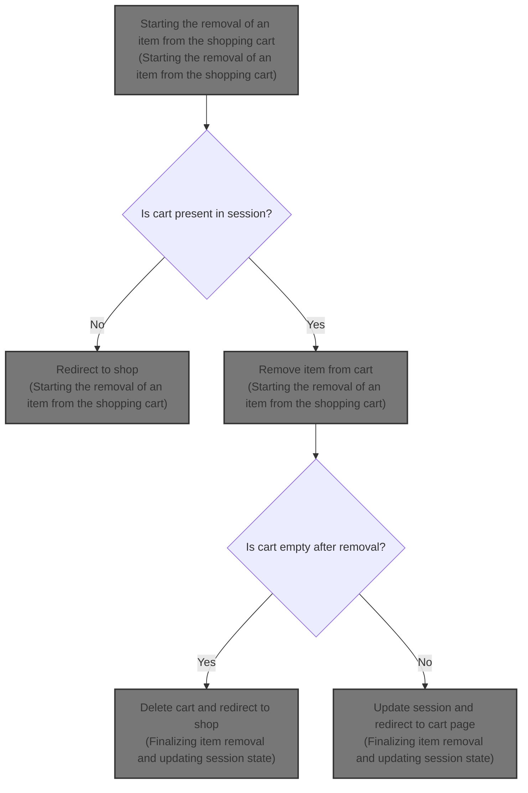
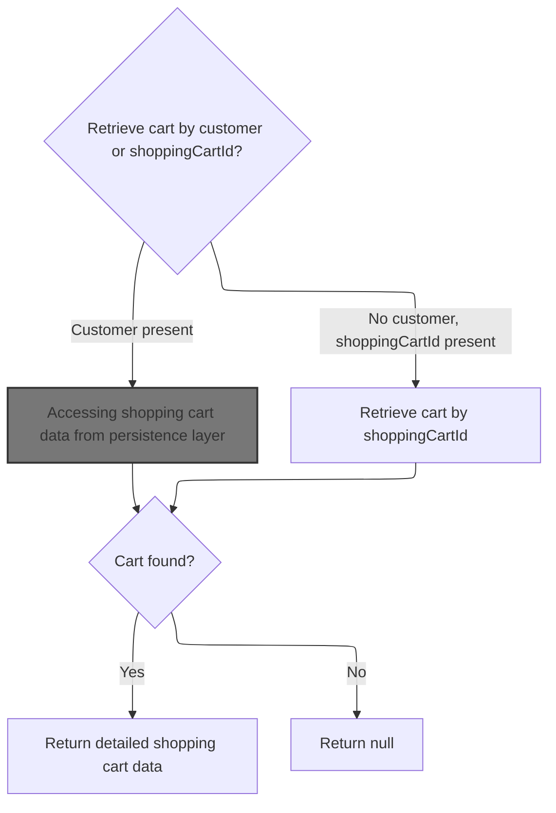
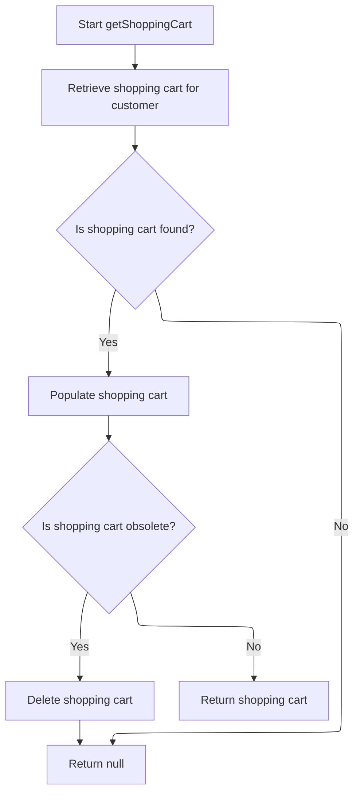
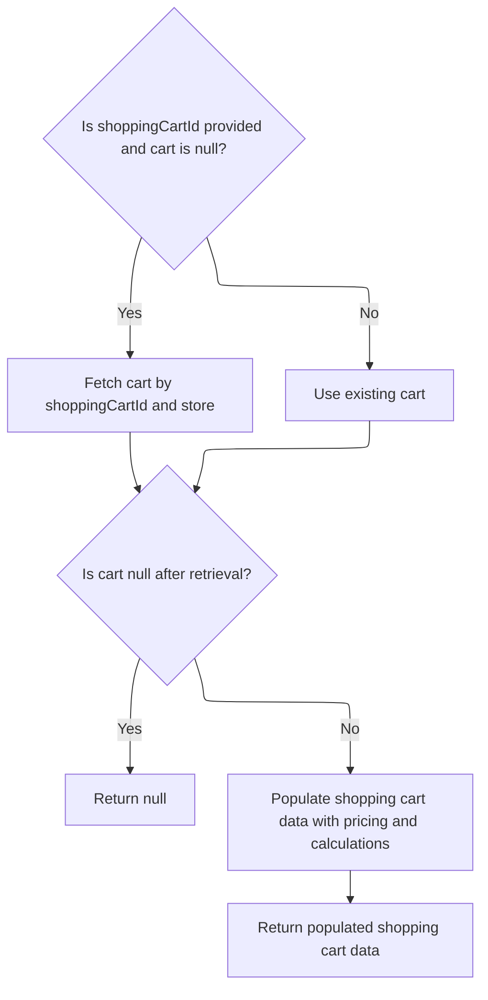

This document describes the process of removing an item from the shopping cart. It involves verifying the cart exists in the user session, retrieving detailed cart data, removing the specified item while considering item properties, and updating the cart state. If the cart becomes empty, it is deleted and the user is redirected to the shop page; otherwise, the updated cart is shown.



# Starting the removal of an item from the shopping cart

This section handles the removal of an item from the shopping cart by verifying the cart's existence in the session and fetching its data through the facade.

| Category       | Rule Name                   | Description                                                                                                |
| -------------- | --------------------------- | ---------------------------------------------------------------------------------------------------------- |
| Business logic | Item property consideration | Item removal must consider item properties to distinguish between similar items with different attributes. |

<SwmSnippet path="/shopizer/sm-shop/src/main/java/com/salesmanager/web/shop/controller/shoppingCart/ShoppingCartController.java" line="309">

---

We verify the cart exists in the session and then fetch its data through the facade to prepare for item removal.

```java
	String removeShoppingCartItem(final Long lineItemId, final HttpServletRequest request, final HttpServletResponse response) throws Exception {


		//Looks in the HttpSession to see if a customer is logged in

		//get any shopping cart for this user

		//** need to check if the item has property, similar items may exist but with different properties
		//String attributes = request.getParameter("attribute");//attributes id are sent as 1|2|5|
		//this will help with hte removal of the appropriate item

		//remove the item shoppingCartService.create

		//create JSON representation of the shopping cart

		//return the JSON structure in AjaxResponse

		//store the shopping cart in the http session

	    MerchantStore store = getSessionAttribute(Constants.MERCHANT_STORE, request);
	    Language language = (Language)request.getAttribute(Constants.LANGUAGE);
	    Customer customer = getSessionAttribute(  Constants.CUSTOMER, request );
        
        /** there must be a cart in the session **/
        String cartCode = (String)request.getSession().getAttribute(Constants.SHOPPING_CART);
        
        if(StringUtils.isBlank(cartCode)) {
        	return "redirect:/shop";
        }
                
        ShoppingCartData shoppingCart = shoppingCartFacade.getShoppingCartData(customer, store, cartCode);
                
```

---

</SwmSnippet>

## Fetching shopping cart data for the user



This section handles fetching shopping cart data for users, distinguishing between logged-in customers and guests by using either customer information or a shopping cart ID.

| Category        | Rule Name                 | Description                                                                                                                    |
| --------------- | ------------------------- | ------------------------------------------------------------------------------------------------------------------------------ |
| Data validation | Cart existence validation | If a shopping cart is found for the given customer or cart ID, return the detailed shopping cart data; otherwise, return null. |
| Business logic  | Customer cart retrieval   | If a logged-in customer is present, retrieve the shopping cart associated with that customer.                                  |
| Business logic  | Guest cart retrieval      | If no customer is logged in but a shopping cart ID is provided, retrieve the shopping cart using the shopping cart ID.         |

<SwmSnippet path="/shopizer/sm-shop/src/main/java/com/salesmanager/web/shop/controller/shoppingCart/facade/ShoppingCartFacadeImpl.java" line="260">

---

In this snippet, we check if there's a logged-in customer. If yes, we get their cart directly via the service. If not, we plan to fetch the cart by its code later. This distinction helps us handle both logged-in and guest users properly.

```java
    public ShoppingCartData getShoppingCartData( final Customer customer, final MerchantStore store,
                                                 final String shoppingCartId )
        throws Exception
    {

        ShoppingCart cart = null;
        try
        {
            if ( customer != null )
            {
                LOG.info( "Reteriving customer shopping cart..." );

                cart = shoppingCartService.getShoppingCart( customer );

            }

            else
            {
```

---

</SwmSnippet>

### Accessing shopping cart data from persistence layer



This section describes the process of accessing shopping cart data from the persistence layer, including retrieval, validation, and handling of obsolete carts.

| Category       | Rule Name                  | Description                                                                                                              |
| -------------- | -------------------------- | ------------------------------------------------------------------------------------------------------------------------ |
| Business logic | Cart retrieval by customer | The system must retrieve the shopping cart associated with the given customer from the persistence layer.                |
| Business logic | Return null if no cart     | If no shopping cart exists for the customer, the system must return null to clearly indicate absence of a cart.          |
| Business logic | Populate shopping cart     | After retrieval, the shopping cart must be enriched with additional data before being used or returned.                  |
| Business logic | Obsolete cart deletion     | If the retrieved shopping cart is marked as obsolete, it must be deleted and null returned to avoid using outdated data. |

<SwmSnippet path="/shopizer/sm-core/src/main/java/com/salesmanager/core/business/shoppingcart/service/ShoppingCartServiceImpl.java" line="68">

---

Here <SwmToken path="shopizer/sm-core/src/main/java/com/salesmanager/core/business/shoppingcart/service/ShoppingCartServiceImpl.java" pos="68:5:5" line-data="	public ShoppingCart getShoppingCart(final Customer customer) throws ServiceException {">`getShoppingCart`</SwmToken> just calls <SwmToken path="shopizer/sm-core/src/main/java/com/salesmanager/core/business/shoppingcart/service/ShoppingCartServiceImpl.java" pos="72:9:9" line-data="			ShoppingCart shoppingCart = shoppingCartDao.getByCustomer(customer);">`getByCustomer`</SwmToken> to fetch the cart from the DAO. This keeps the retrieval logic centralized and lets <SwmToken path="shopizer/sm-core/src/main/java/com/salesmanager/core/business/shoppingcart/service/ShoppingCartServiceImpl.java" pos="72:9:9" line-data="			ShoppingCart shoppingCart = shoppingCartDao.getByCustomer(customer);">`getByCustomer`</SwmToken> handle the details of fetching and enriching the cart.

```java
	public ShoppingCart getShoppingCart(final Customer customer) throws ServiceException {

		try {

			ShoppingCart shoppingCart = shoppingCartDao.getByCustomer(customer);
```

---

</SwmSnippet>

<SwmSnippet path="/shopizer/sm-core/src/main/java/com/salesmanager/core/business/shoppingcart/service/ShoppingCartServiceImpl.java" line="209">

---

GetByCustomer fetches the cart from the DAO and then enriches it with <SwmToken path="shopizer/sm-core/src/main/java/com/salesmanager/core/business/shoppingcart/service/ShoppingCartServiceImpl.java" pos="216:3:3" line-data="			return populateShoppingCart(shoppingCart);">`populateShoppingCart`</SwmToken>. If no cart exists, it returns null to indicate absence clearly.

```java
	public ShoppingCart getByCustomer(final Customer customer) throws ServiceException {

		try {
			ShoppingCart shoppingCart = shoppingCartDao.getByCustomer(customer);
			if(shoppingCart==null) {
				return null;
			}
			return populateShoppingCart(shoppingCart);


		} catch (Exception e) {
			throw new ServiceException(e);
		}
	}
```

---

</SwmSnippet>

<SwmSnippet path="/shopizer/sm-core/src/main/java/com/salesmanager/core/business/shoppingcart/service/ShoppingCartServiceImpl.java" line="73">

---

After getting the cart, we check if it's obsolete. If yes, we delete it and return null to avoid using outdated data. Otherwise, we return the valid cart.

```java
			populateShoppingCart(shoppingCart);
			if(shoppingCart!=null && shoppingCart.isObsolete()) {
				delete(shoppingCart);
				return null;
			} else {
				return shoppingCart;
			}


		} catch (Exception e) {
			throw new ServiceException(e);
		}

	}
```

---

</SwmSnippet>

### Populating and returning detailed shopping cart data



<SwmSnippet path="/shopizer/sm-shop/src/main/java/com/salesmanager/web/shop/controller/shoppingCart/facade/ShoppingCartFacadeImpl.java" line="278">

---

If we didn't get a cart from the customer, we try to get it by cart code. Then we use <SwmToken path="shopizer/sm-shop/src/main/java/com/salesmanager/web/shop/controller/shoppingCart/facade/ShoppingCartFacadeImpl.java" pos="300:1:1" line-data="        ShoppingCartDataPopulator shoppingCartDataPopulator = new ShoppingCartDataPopulator();">`ShoppingCartDataPopulator`</SwmToken> to add pricing and localization details before returning the data.

```java
                if ( StringUtils.isNotBlank( shoppingCartId ) && cart == null )
                {
                    cart = shoppingCartService.getByCode( shoppingCartId, store );
                }

            }
        }
        catch ( ServiceException ex )
        {
            LOG.error( "Error while retriving cart from customer", ex );
        }
        catch( NoResultException nre) {
        	//nothing
        }

        if ( cart == null )
        {
            return null;
        }

        LOG.info( "Cart model found." );

        ShoppingCartDataPopulator shoppingCartDataPopulator = new ShoppingCartDataPopulator();
        shoppingCartDataPopulator.setShoppingCartCalculationService( shoppingCartCalculationService );
        shoppingCartDataPopulator.setPricingService( pricingService );

        Language language = (Language) getKeyValue( Constants.LANGUAGE );
        MerchantStore merchantStore = (MerchantStore) getKeyValue( Constants.MERCHANT_STORE );
        return shoppingCartDataPopulator.populate( cart, merchantStore, language );

    }
```

---

</SwmSnippet>

## Finalizing item removal and updating session state

<SwmSnippet path="/shopizer/sm-shop/src/main/java/com/salesmanager/web/shop/controller/shoppingCart/ShoppingCartController.java" line="342">

---

After removing the item, we check if the cart is empty. If yes, we delete the cart and redirect to the shop. Otherwise, we redirect to the cart page to show the updated contents.

```java
		ShoppingCartData shoppingCartData=shoppingCartFacade.removeCartItem(lineItemId, shoppingCart.getCode(),store,language);

		
		if(CollectionUtils.isEmpty(shoppingCartData.getShoppingCartItems())) {
			shoppingCartFacade.deleteShoppingCart(shoppingCartData.getId(), store);
			return "redirect:/shop";
		}
		
		
		
		return Constants.REDIRECT_PREFIX + "/shop/shoppingCart.html";


	}
```

---

</SwmSnippet>

&nbsp;

*This is an auto-generated document by Swimm 🌊 and has not yet been verified by a human*

<SwmMeta version="3.0.0" repo-id="Z2l0aHViJTNBJTNBU2hvcGl6ZXIlM0ElM0F1bWFsaW5nYXN3YW1p" repo-name="Shopizer"><sup>Powered by [Swimm](https://app.swimm.io/)</sup></SwmMeta>
