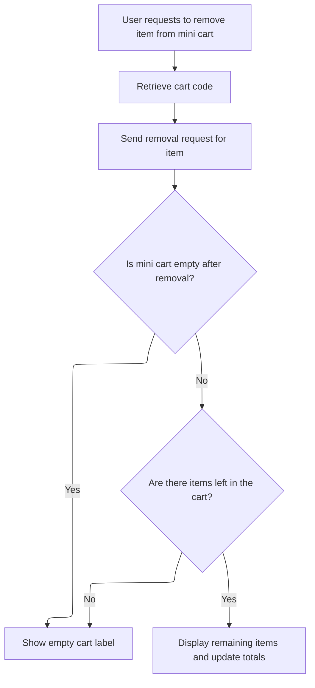

This document explains how users can remove items from their mini cart, ensuring the cart display is updated to reflect the current contents. When a user requests to remove an item, the system verifies the correct cart, processes the removal, and updates the mini cart UI to show either the updated list of items and totals or an empty cart label if no items remain.

# Removing an item from the minicart



This section governs the rules for removing an item from the mini cart, ensuring the correct cart is identified, the item is removed, and the mini cart UI reflects the current state of the cart after removal.

| Category        | Rule Name                      | Description                                                                                                                                                      |
| --------------- | ------------------------------ | ---------------------------------------------------------------------------------------------------------------------------------------------------------------- |
| Data validation | Store-specific cart validation | Only the cart associated with the current store is eligible for item removal. If the cart code does not match the current store, no removal action is performed. |
| Business logic  | Empty cart notification        | If the mini cart is empty after an item is removed, the UI must display an empty cart label to inform the user.                                                  |
| Business logic  | Update cart display and totals | If there are items remaining in the mini cart after removal, the UI must display the updated list of items and recalculate the cart totals.                      |

<SwmSnippet path="/shopizer/sm-shop/src/main/webapp/resources/js/shopping-cart.js" line="275">

---

In <SwmToken path="shopizer/sm-shop/src/main/webapp/resources/js/shopping-cart.js" pos="275:2:2" line-data="function removeItemFromMinicart(lineItemId){">`removeItemFromMinicart`</SwmToken>, we kick off the removal by grabbing the cart code using <SwmToken path="shopizer/sm-shop/src/main/webapp/resources/js/shopping-cart.js" pos="277:5:5" line-data="	shoppingCartCode = getCartCode();">`getCartCode`</SwmToken>. This is needed so we can tell the backend exactly which cart to update when we send the remove request next.

```javascript
function removeItemFromMinicart(lineItemId){
	
	shoppingCartCode = getCartCode();
```

---

</SwmSnippet>

<SwmSnippet path="/shopizer/sm-shop/src/main/webapp/resources/js/shopping-cart.js" line="367">

---

<SwmToken path="shopizer/sm-shop/src/main/webapp/resources/js/shopping-cart.js" pos="367:2:2" line-data="function getCartCode() {">`getCartCode`</SwmToken> reads the cart cookie, splits it into store code and cart ID, and only returns the cart ID if the store code matches the current store. This makes sure we're working with the right cart in multi-store setups. If anything doesn't match, it just returns undefined.

```javascript
function getCartCode() {
	
	var cart = $.cookie('cart'); //should be [storecode_cartid]
	var code = new Array();
	
	if(cart!=null) {
		code = cart.split('_');
		if(code[0]==getMerchantStoreCode()) {
			return code[1];
		}
	}
}
```

---

</SwmSnippet>

<SwmSnippet path="/shopizer/sm-shop/src/main/webapp/resources/js/shopping-cart.js" line="278">

---

Back in <SwmToken path="shopizer/sm-shop/src/main/webapp/resources/js/shopping-cart.js" pos="275:2:2" line-data="function removeItemFromMinicart(lineItemId){">`removeItemFromMinicart`</SwmToken>, after getting the cart code, we send an AJAX request to remove the item. The response updates the minicart UI, either showing the updated items or an empty cart label. This is where we call into <SwmToken path="shopizer/sm-shop/src/main/webapp/resources/js/bootstrap/jquery.js" pos="7210:5:5" line-data="			s = jQuery.ajaxSetup( {}, options ),">`jQuery`</SwmToken>'s AJAX logic next.

```javascript
	$.ajax({  
		 type: 'GET',
		 cache:false,
		 url: getContextPath() + '/shop/cart/removeMiniShoppingCartItem.html?lineItemId='+lineItemId + '&shoppingCartCode=' + shoppingCartCode,  
		 error: function(e) { 
			 console.log('error ' + e);
			 
		 },
		 success: function(miniCart) {
			 if(miniCart==null) {
				 emptyCartLabel();
			 } else {
				 if(miniCart.shoppingCartItems!=null) {
					 displayShoppigCartItems(miniCart,'#shoppingcartProducts');
					 displayTotals(miniCart);
				 } else {
					 emptyCartLabel();
				 }
			 }
		} 
	});
}
```

---

</SwmSnippet>

# Handling the AJAX request lifecycle

```mermaid
%%{init: {"flowchart": {"defaultRenderer": "elk"}} }%%
flowchart TD
    node1["Start AJAX request"] --> node2{"Is input a URL or options object?"}
    click node1 openCode "shopizer/sm-shop/src/main/webapp/resources/js/bootstrap/jquery.js:7198:7204"
    node2 -->|"Options object"| node3["Normalize input"]
    click node2 openCode "shopizer/sm-shop/src/main/webapp/resources/js/bootstrap/jquery.js:7201:7204"
    node2 -->|"URL"| node4["Use URL and options"]
    click node4 openCode "shopizer/sm-shop/src/main/webapp/resources/js/bootstrap/jquery.js:7205:7207"
    node3 --> node5["Configure request from options"]
    click node3 openCode "shopizer/sm-shop/src/main/webapp/resources/js/bootstrap/jquery.js:7207:7210"
    node4 --> node5
    node5 --> node6["Set headers and event callbacks"]
    click node5 openCode "shopizer/sm-shop/src/main/webapp/resources/js/bootstrap/jquery.js:7527:7543"
    subgraph loop1["For each header/event callback"]
        node6 --> node7["Set on request"]
        click node7 openCode "shopizer/sm-shop/src/main/webapp/resources/js/bootstrap/jquery.js:7527:7543"
        node7 --> node6
    end
    node6 --> node8{"Should abort before sending?"}
    click node6 openCode "shopizer/sm-shop/src/main/webapp/resources/js/bootstrap/jquery.js:7533:7538"
    node8 -->|"Yes"| node9["Abort request"]
    click node9 openCode "shopizer/sm-shop/src/main/webapp/resources/js/bootstrap/jquery.js:7533:7536"
    node8 -->|"No"| node10{"Is there a valid transport?"}
    click node10 openCode "shopizer/sm-shop/src/main/webapp/resources/js/bootstrap/jquery.js:7545:7549"
    node10 -->|"No"| node11["Fail with 'No Transport'"]
    click node11 openCode "shopizer/sm-shop/src/main/webapp/resources/js/bootstrap/jquery.js:7549:7551"
    node10 -->|"Yes"| node12["Send request with timeout and options"]
    click node12 openCode "shopizer/sm-shop/src/main/webapp/resources/js/bootstrap/jquery.js:7552:7562"
    node12 --> node13{"Did request succeed?"}
    click node13 openCode "shopizer/sm-shop/src/main/webapp/resources/js/bootstrap/jquery.js:7334:7367"
    node13 -->|"Yes"| node14["Trigger success callbacks and events"]
    click node14 openCode "shopizer/sm-shop/src/main/webapp/resources/js/bootstrap/jquery.js:7384:7386"
    node13 -->|"No"| node15["Trigger error callbacks and events"]
    click node15 openCode "shopizer/sm-shop/src/main/webapp/resources/js/bootstrap/jquery.js:7387:7388"
    node14 --> node16["Trigger complete callbacks"]
    click node16 openCode "shopizer/sm-shop/src/main/webapp/resources/js/bootstrap/jquery.js:7400:7401"
    node15 --> node16
    node16 --> node17["Return request result"]
    click node17 openCode "shopizer/sm-shop/src/main/webapp/resources/js/bootstrap/jquery.js:7578:7579"

classDef HeadingStyle fill:#777777,stroke:#333,stroke-width:2px;

%% Swimm:
%% %%{init: {"flowchart": {"defaultRenderer": "elk"}} }%%
%% flowchart TD
%%     node1["Start AJAX request"] --> node2{"Is input a URL or options object?"}
%%     click node1 openCode "<SwmPath>[shopizer/…/bootstrap/jquery.js](shopizer/sm-shop/src/main/webapp/resources/js/bootstrap/jquery.js)</SwmPath>:7198:7204"
%%     node2 -->|"Options object"| node3["Normalize input"]
%%     click node2 openCode "<SwmPath>[shopizer/…/bootstrap/jquery.js](shopizer/sm-shop/src/main/webapp/resources/js/bootstrap/jquery.js)</SwmPath>:7201:7204"
%%     node2 -->|"URL"| node4["Use URL and options"]
%%     click node4 openCode "<SwmPath>[shopizer/…/bootstrap/jquery.js](shopizer/sm-shop/src/main/webapp/resources/js/bootstrap/jquery.js)</SwmPath>:7205:7207"
%%     node3 --> node5["Configure request from options"]
%%     click node3 openCode "<SwmPath>[shopizer/…/bootstrap/jquery.js](shopizer/sm-shop/src/main/webapp/resources/js/bootstrap/jquery.js)</SwmPath>:7207:7210"
%%     node4 --> node5
%%     node5 --> node6["Set headers and event callbacks"]
%%     click node5 openCode "<SwmPath>[shopizer/…/bootstrap/jquery.js](shopizer/sm-shop/src/main/webapp/resources/js/bootstrap/jquery.js)</SwmPath>:7527:7543"
%%     subgraph loop1["For each header/event callback"]
%%         node6 --> node7["Set on request"]
%%         click node7 openCode "<SwmPath>[shopizer/…/bootstrap/jquery.js](shopizer/sm-shop/src/main/webapp/resources/js/bootstrap/jquery.js)</SwmPath>:7527:7543"
%%         node7 --> node6
%%     end
%%     node6 --> node8{"Should abort before sending?"}
%%     click node6 openCode "<SwmPath>[shopizer/…/bootstrap/jquery.js](shopizer/sm-shop/src/main/webapp/resources/js/bootstrap/jquery.js)</SwmPath>:7533:7538"
%%     node8 -->|"Yes"| node9["Abort request"]
%%     click node9 openCode "<SwmPath>[shopizer/…/bootstrap/jquery.js](shopizer/sm-shop/src/main/webapp/resources/js/bootstrap/jquery.js)</SwmPath>:7533:7536"
%%     node8 -->|"No"| node10{"Is there a valid transport?"}
%%     click node10 openCode "<SwmPath>[shopizer/…/bootstrap/jquery.js](shopizer/sm-shop/src/main/webapp/resources/js/bootstrap/jquery.js)</SwmPath>:7545:7549"
%%     node10 -->|"No"| node11["Fail with 'No Transport'"]
%%     click node11 openCode "<SwmPath>[shopizer/…/bootstrap/jquery.js](shopizer/sm-shop/src/main/webapp/resources/js/bootstrap/jquery.js)</SwmPath>:7549:7551"
%%     node10 -->|"Yes"| node12["Send request with timeout and options"]
%%     click node12 openCode "<SwmPath>[shopizer/…/bootstrap/jquery.js](shopizer/sm-shop/src/main/webapp/resources/js/bootstrap/jquery.js)</SwmPath>:7552:7562"
%%     node12 --> node13{"Did request succeed?"}
%%     click node13 openCode "<SwmPath>[shopizer/…/bootstrap/jquery.js](shopizer/sm-shop/src/main/webapp/resources/js/bootstrap/jquery.js)</SwmPath>:7334:7367"
%%     node13 -->|"Yes"| node14["Trigger success callbacks and events"]
%%     click node14 openCode "<SwmPath>[shopizer/…/bootstrap/jquery.js](shopizer/sm-shop/src/main/webapp/resources/js/bootstrap/jquery.js)</SwmPath>:7384:7386"
%%     node13 -->|"No"| node15["Trigger error callbacks and events"]
%%     click node15 openCode "<SwmPath>[shopizer/…/bootstrap/jquery.js](shopizer/sm-shop/src/main/webapp/resources/js/bootstrap/jquery.js)</SwmPath>:7387:7388"
%%     node14 --> node16["Trigger complete callbacks"]
%%     click node16 openCode "<SwmPath>[shopizer/…/bootstrap/jquery.js](shopizer/sm-shop/src/main/webapp/resources/js/bootstrap/jquery.js)</SwmPath>:7400:7401"
%%     node15 --> node16
%%     node16 --> node17["Return request result"]
%%     click node17 openCode "<SwmPath>[shopizer/…/bootstrap/jquery.js](shopizer/sm-shop/src/main/webapp/resources/js/bootstrap/jquery.js)</SwmPath>:7578:7579"
%% 
%% classDef HeadingStyle fill:#777777,stroke:#333,stroke-width:<SwmToken path="shopizer/sm-shop/src/main/webapp/resources/js/bootstrap/jquery.js" pos="1470:10:10" line-data="		div.style.width = &quot;2px&quot;;">`2px`</SwmToken>;
```



This section governs the lifecycle of AJAX requests, ensuring requests are properly configured, validated, and handled, including error and success scenarios. It supports both legacy and modern signatures, and manages headers, callbacks, and global events for each request.

| Category        | Rule Name                                                                                                                                                                                                                                                           | Description                                                                                                                                                                                                                                                                                                                                                                                                                                                                                                                                                                                                                                                                                                                                                                                                                                                                                                                                                                                                                                                                                                                                                                                                                                                                                                                                                                                                                               |
| --------------- | ------------------------------------------------------------------------------------------------------------------------------------------------------------------------------------------------------------------------------------------------------------------- | ----------------------------------------------------------------------------------------------------------------------------------------------------------------------------------------------------------------------------------------------------------------------------------------------------------------------------------------------------------------------------------------------------------------------------------------------------------------------------------------------------------------------------------------------------------------------------------------------------------------------------------------------------------------------------------------------------------------------------------------------------------------------------------------------------------------------------------------------------------------------------------------------------------------------------------------------------------------------------------------------------------------------------------------------------------------------------------------------------------------------------------------------------------------------------------------------------------------------------------------------------------------------------------------------------------------------------------------------------------------------------------------------------------------------------------------- |
| Data validation | Request normalization                                                                                                                                                                                                                                               | All AJAX requests must be normalized to ensure options are always an object, regardless of input format.                                                                                                                                                                                                                                                                                                                                                                                                                                                                                                                                                                                                                                                                                                                                                                                                                                                                                                                                                                                                                                                                                                                                                                                                                                                                                                                                  |
| Business logic  | Legacy signature support                                                                                                                                                                                                                                            | If the input is an object, treat it as the options object and ignore the URL parameter, supporting legacy AJAX signatures.                                                                                                                                                                                                                                                                                                                                                                                                                                                                                                                                                                                                                                                                                                                                                                                                                                                                                                                                                                                                                                                                                                                                                                                                                                                                                                                |
| Business logic  | Header and callback configuration                                                                                                                                                                                                                                   | Headers and event callbacks specified in the options must be set on the request before it is sent.                                                                                                                                                                                                                                                                                                                                                                                                                                                                                                                                                                                                                                                                                                                                                                                                                                                                                                                                                                                                                                                                                                                                                                                                                                                                                                                                        |
| Business logic  | Early abort on <SwmToken path="shopizer/sm-shop/src/main/webapp/resources/js/bootstrap/jquery.js" pos="7533:7:7" line-data="		if ( s.beforeSend &amp;&amp; ( s.beforeSend.call( callbackContext, jqXHR, s ) === false \|\| state === 2 ) ) {">`beforeSend`</SwmToken> | If the <SwmToken path="shopizer/sm-shop/src/main/webapp/resources/js/bootstrap/jquery.js" pos="7533:7:7" line-data="		if ( s.beforeSend &amp;&amp; ( s.beforeSend.call( callbackContext, jqXHR, s ) === false \|\| state === 2 ) ) {">`beforeSend`</SwmToken> callback returns false, the AJAX request must be aborted and no further processing occurs.                                                                                                                                                                                                                                                                                                                                                                                                                                                                                                                                                                                                                                                                                                                                                                                                                                                                                                                                                                                                                                                                                    |
| Business logic  | Success handling                                                                                                                                                                                                                                                    | On successful completion (HTTP status 200-299 or 304), success callbacks and events must be triggered, and the result made available to the caller.                                                                                                                                                                                                                                                                                                                                                                                                                                                                                                                                                                                                                                                                                                                                                                                                                                                                                                                                                                                                                                                                                                                                                                                                                                                                                       |
| Business logic  | Completion notification                                                                                                                                                                                                                                             | Complete callbacks must be triggered after either success or error, allowing for cleanup or finalization logic.                                                                                                                                                                                                                                                                                                                                                                                                                                                                                                                                                                                                                                                                                                                                                                                                                                                                                                                                                                                                                                                                                                                                                                                                                                                                                                                           |
| Business logic  | Global event triggering                                                                                                                                                                                                                                             | Global AJAX events (<SwmToken path="shopizer/sm-shop/src/main/webapp/resources/js/bootstrap/jquery.js" pos="7475:9:9" line-data="			jQuery.event.trigger( &quot;ajaxStart&quot; );">`ajaxStart`</SwmToken>, <SwmToken path="shopizer/sm-shop/src/main/webapp/resources/js/bootstrap/jquery.js" pos="7555:7:7" line-data="				globalEventContext.trigger( &quot;ajaxSend&quot;, [ jqXHR, s ] );">`ajaxSend`</SwmToken>, <SwmToken path="shopizer/sm-shop/src/main/webapp/resources/js/bootstrap/jquery.js" pos="7077:14:14" line-data="jQuery.each( &quot;ajaxStart ajaxStop ajaxComplete ajaxError ajaxSuccess ajaxSend&quot;.split( &quot; &quot; ), function( i, o ){">`ajaxSuccess`</SwmToken>, <SwmToken path="shopizer/sm-shop/src/main/webapp/resources/js/bootstrap/jquery.js" pos="7077:12:12" line-data="jQuery.each( &quot;ajaxStart ajaxStop ajaxComplete ajaxError ajaxSuccess ajaxSend&quot;.split( &quot; &quot; ), function( i, o ){">`ajaxError`</SwmToken>, <SwmToken path="shopizer/sm-shop/src/main/webapp/resources/js/bootstrap/jquery.js" pos="7403:7:7" line-data="				globalEventContext.trigger( &quot;ajaxComplete&quot;, [ jqXHR, s ] );">`ajaxComplete`</SwmToken>, <SwmToken path="shopizer/sm-shop/src/main/webapp/resources/js/bootstrap/jquery.js" pos="7406:9:9" line-data="					jQuery.event.trigger( &quot;ajaxStop&quot; );">`ajaxStop`</SwmToken>) must be triggered at appropriate points in the request lifecycle. |

<SwmSnippet path="/shopizer/sm-shop/src/main/webapp/resources/js/bootstrap/jquery.js" line="7198">

---

In <SwmToken path="shopizer/sm-shop/src/main/webapp/resources/js/bootstrap/jquery.js" pos="7198:1:1" line-data="	ajax: function( url, options ) {">`ajax`</SwmToken>, we handle both legacy and modern signatures by swapping arguments if needed. This keeps older code working and lets us use either calling style for AJAX requests.

```javascript
	ajax: function( url, options ) {

		// If url is an object, simulate pre-1.5 signature
		if ( typeof url === "object" ) {
			options = url;
			url = undefined;
		}

		// Force options to be an object
		options = options || {};

		var // Create the final options object
			s = jQuery.ajaxSetup( {}, options ),
			// Callbacks context
			callbackContext = s.context || s,
			// Context for global events
			// It's the callbackContext if one was provided in the options
			// and if it's a DOM node or a jQuery collection
			globalEventContext = callbackContext !== s &&
				( callbackContext.nodeType || callbackContext instanceof jQuery ) ?
						jQuery( callbackContext ) : jQuery.event,
			// Deferreds
			deferred = jQuery.Deferred(),
			completeDeferred = jQuery.Callbacks( "once memory" ),
			// Status-dependent callbacks
			statusCode = s.statusCode || {},
			// ifModified key
			ifModifiedKey,
			// Headers (they are sent all at once)
			requestHeaders = {},
			requestHeadersNames = {},
			// Response headers
			responseHeadersString,
			responseHeaders,
			// transport
			transport,
			// timeout handle
			timeoutTimer,
			// Cross-domain detection vars
			parts,
			// The jqXHR state
			state = 0,
			// To know if global events are to be dispatched
			fireGlobals,
			// Loop variable
			i,
			// Fake xhr
			jqXHR = {

				readyState: 0,

				// Caches the header
				setRequestHeader: function( name, value ) {
					if ( !state ) {
						var lname = name.toLowerCase();
						name = requestHeadersNames[ lname ] = requestHeadersNames[ lname ] || name;
						requestHeaders[ name ] = value;
					}
					return this;
				},

				// Raw string
				getAllResponseHeaders: function() {
					return state === 2 ? responseHeadersString : null;
				},

				// Builds headers hashtable if needed
				getResponseHeader: function( key ) {
					var match;
					if ( state === 2 ) {
						if ( !responseHeaders ) {
							responseHeaders = {};
							while( ( match = rheaders.exec( responseHeadersString ) ) ) {
								responseHeaders[ match[1].toLowerCase() ] = match[ 2 ];
							}
```

---

</SwmSnippet>

<SwmSnippet path="/shopizer/sm-shop/src/main/webapp/resources/js/bootstrap/jquery.js" line="7274">

---

Here the AJAX logic sets up a promise-based <SwmToken path="shopizer/sm-shop/src/main/webapp/resources/js/bootstrap/jquery.js" pos="7317:14:14" line-data="			// (no matter how long the jqXHR object will be used)">`jqXHR`</SwmToken> object, so we can chain .done, .fail, and .complete handlers for the request. This makes it easy to handle the result of the removal request back in the minicart flow.

```javascript
						match = responseHeaders[ key.toLowerCase() ];
					}
					return match === undefined ? null : match;
				},

				// Overrides response content-type header
				overrideMimeType: function( type ) {
					if ( !state ) {
						s.mimeType = type;
					}
					return this;
				},

				// Cancel the request
				abort: function( statusText ) {
					statusText = statusText || "abort";
					if ( transport ) {
						transport.abort( statusText );
					}
					done( 0, statusText );
					return this;
				}
			};

		// Callback for when everything is done
		// It is defined here because jslint complains if it is declared
		// at the end of the function (which would be more logical and readable)
		function done( status, nativeStatusText, responses, headers ) {

			// Called once
			if ( state === 2 ) {
				return;
			}

			// State is "done" now
			state = 2;

			// Clear timeout if it exists
			if ( timeoutTimer ) {
				clearTimeout( timeoutTimer );
			}

			// Dereference transport for early garbage collection
			// (no matter how long the jqXHR object will be used)
			transport = undefined;

			// Cache response headers
			responseHeadersString = headers || "";

			// Set readyState
			jqXHR.readyState = status > 0 ? 4 : 0;

			var isSuccess,
				success,
				error,
				statusText = nativeStatusText,
				response = responses ? ajaxHandleResponses( s, jqXHR, responses ) : undefined,
				lastModified,
				etag;

			// If successful, handle type chaining
			if ( status >= 200 && status < 300 || status === 304 ) {

				// Set the If-Modified-Since and/or If-None-Match header, if in ifModified mode.
				if ( s.ifModified ) {

					if ( ( lastModified = jqXHR.getResponseHeader( "Last-Modified" ) ) ) {
						jQuery.lastModified[ ifModifiedKey ] = lastModified;
					}
					if ( ( etag = jqXHR.getResponseHeader( "Etag" ) ) ) {
						jQuery.etag[ ifModifiedKey ] = etag;
					}
				}

				// If not modified
				if ( status === 304 ) {

					statusText = "notmodified";
					isSuccess = true;

				// If we have data
				} else {

					try {
						success = ajaxConvert( s, response );
						statusText = "success";
						isSuccess = true;
					} catch(e) {
						// We have a parsererror
						statusText = "parsererror";
						error = e;
					}
				}
			} else {
				// We extract error from statusText
				// then normalize statusText and status for non-aborts
				error = statusText;
				if ( !statusText || status ) {
					statusText = "error";
					if ( status < 0 ) {
						status = 0;
					}
				}
			}

			// Set data for the fake xhr object
			jqXHR.status = status;
			jqXHR.statusText = "" + ( nativeStatusText || statusText );

			// Success/Error
			if ( isSuccess ) {
				deferred.resolveWith( callbackContext, [ success, statusText, jqXHR ] );
			} else {
				deferred.rejectWith( callbackContext, [ jqXHR, statusText, error ] );
			}

			// Status-dependent callbacks
			jqXHR.statusCode( statusCode );
			statusCode = undefined;

			if ( fireGlobals ) {
				globalEventContext.trigger( "ajax" + ( isSuccess ? "Success" : "Error" ),
						[ jqXHR, s, isSuccess ? success : error ] );
			}

			// Complete
			completeDeferred.fireWith( callbackContext, [ jqXHR, statusText ] );

			if ( fireGlobals ) {
				globalEventContext.trigger( "ajaxComplete", [ jqXHR, s ] );
				// Handle the global AJAX counter
				if ( !( --jQuery.active ) ) {
					jQuery.event.trigger( "ajaxStop" );
				}
			}
		}

		// Attach deferreds
		deferred.promise( jqXHR );
		jqXHR.success = jqXHR.done;
		jqXHR.error = jqXHR.fail;
		jqXHR.complete = completeDeferred.add;

		// Status-dependent callbacks
		jqXHR.statusCode = function( map ) {
			if ( map ) {
				var tmp;
				if ( state < 2 ) {
					for ( tmp in map ) {
						statusCode[ tmp ] = [ statusCode[tmp], map[tmp] ];
					}
```

---

</SwmSnippet>

<SwmSnippet path="/shopizer/sm-shop/src/main/webapp/resources/js/bootstrap/jquery.js" line="7426">

---

Here the AJAX function sets up global event triggers, applies prefilters, checks for <SwmToken path="shopizer/sm-shop/src/main/webapp/resources/js/bootstrap/jquery.js" pos="7441:9:11" line-data="		// Determine if a cross-domain request is in order">`cross-domain`</SwmToken> requests, and manages headers. This makes sure the request is handled correctly and lets other parts of the app react to AJAX events, like showing loading spinners.

```javascript
					tmp = map[ jqXHR.status ];
					jqXHR.then( tmp, tmp );
				}
			}
			return this;
		};

		// Remove hash character (#7531: and string promotion)
		// Add protocol if not provided (#5866: IE7 issue with protocol-less urls)
		// We also use the url parameter if available
		s.url = ( ( url || s.url ) + "" ).replace( rhash, "" ).replace( rprotocol, ajaxLocParts[ 1 ] + "//" );

		// Extract dataTypes list
		s.dataTypes = jQuery.trim( s.dataType || "*" ).toLowerCase().split( rspacesAjax );

		// Determine if a cross-domain request is in order
		if ( s.crossDomain == null ) {
			parts = rurl.exec( s.url.toLowerCase() );
			s.crossDomain = !!( parts &&
				( parts[ 1 ] != ajaxLocParts[ 1 ] || parts[ 2 ] != ajaxLocParts[ 2 ] ||
					( parts[ 3 ] || ( parts[ 1 ] === "http:" ? 80 : 443 ) ) !=
						( ajaxLocParts[ 3 ] || ( ajaxLocParts[ 1 ] === "http:" ? 80 : 443 ) ) )
			);
		}

		// Convert data if not already a string
		if ( s.data && s.processData && typeof s.data !== "string" ) {
			s.data = jQuery.param( s.data, s.traditional );
		}

		// Apply prefilters
		inspectPrefiltersOrTransports( prefilters, s, options, jqXHR );

		// If request was aborted inside a prefiler, stop there
		if ( state === 2 ) {
			return false;
		}

		// We can fire global events as of now if asked to
		fireGlobals = s.global;

		// Uppercase the type
		s.type = s.type.toUpperCase();

		// Determine if request has content
		s.hasContent = !rnoContent.test( s.type );

		// Watch for a new set of requests
		if ( fireGlobals && jQuery.active++ === 0 ) {
			jQuery.event.trigger( "ajaxStart" );
		}

		// More options handling for requests with no content
		if ( !s.hasContent ) {

			// If data is available, append data to url
			if ( s.data ) {
				s.url += ( rquery.test( s.url ) ? "&" : "?" ) + s.data;
				// #9682: remove data so that it's not used in an eventual retry
				delete s.data;
			}

			// Get ifModifiedKey before adding the anti-cache parameter
			ifModifiedKey = s.url;

			// Add anti-cache in url if needed
			if ( s.cache === false ) {

				var ts = jQuery.now(),
					// try replacing _= if it is there
					ret = s.url.replace( rts, "$1_=" + ts );

				// if nothing was replaced, add timestamp to the end
				s.url = ret + ( ( ret === s.url ) ? ( rquery.test( s.url ) ? "&" : "?" ) + "_=" + ts : "" );
			}
		}

		// Set the correct header, if data is being sent
		if ( s.data && s.hasContent && s.contentType !== false || options.contentType ) {
			jqXHR.setRequestHeader( "Content-Type", s.contentType );
		}

		// Set the If-Modified-Since and/or If-None-Match header, if in ifModified mode.
		if ( s.ifModified ) {
			ifModifiedKey = ifModifiedKey || s.url;
			if ( jQuery.lastModified[ ifModifiedKey ] ) {
				jqXHR.setRequestHeader( "If-Modified-Since", jQuery.lastModified[ ifModifiedKey ] );
			}
			if ( jQuery.etag[ ifModifiedKey ] ) {
				jqXHR.setRequestHeader( "If-None-Match", jQuery.etag[ ifModifiedKey ] );
			}
		}

		// Set the Accepts header for the server, depending on the dataType
		jqXHR.setRequestHeader(
			"Accept",
			s.dataTypes[ 0 ] && s.accepts[ s.dataTypes[0] ] ?
				s.accepts[ s.dataTypes[0] ] + ( s.dataTypes[ 0 ] !== "*" ? ", " + allTypes + "; q=0.01" : "" ) :
				s.accepts[ "*" ]
		);

		// Check for headers option
		for ( i in s.headers ) {
			jqXHR.setRequestHeader( i, s.headers[ i ] );
		}
```

---

</SwmSnippet>

<SwmSnippet path="/shopizer/sm-shop/src/main/webapp/resources/js/bootstrap/jquery.js" line="7532">

---

Before sending the request, we run the <SwmToken path="shopizer/sm-shop/src/main/webapp/resources/js/bootstrap/jquery.js" pos="7533:7:7" line-data="		if ( s.beforeSend &amp;&amp; ( s.beforeSend.call( callbackContext, jqXHR, s ) === false || state === 2 ) ) {">`beforeSend`</SwmToken> hook and install the success, error, and complete callbacks. If <SwmToken path="shopizer/sm-shop/src/main/webapp/resources/js/bootstrap/jquery.js" pos="7533:7:7" line-data="		if ( s.beforeSend &amp;&amp; ( s.beforeSend.call( callbackContext, jqXHR, s ) === false || state === 2 ) ) {">`beforeSend`</SwmToken> returns false, the request is aborted early.

```javascript
		// Allow custom headers/mimetypes and early abort
		if ( s.beforeSend && ( s.beforeSend.call( callbackContext, jqXHR, s ) === false || state === 2 ) ) {
				// Abort if not done already
				jqXHR.abort();
				return false;

		}

		// Install callbacks on deferreds
		for ( i in { success: 1, error: 1, complete: 1 } ) {
			jqXHR[ i ]( s[ i ] );
		}
```

---

</SwmSnippet>

<SwmSnippet path="/shopizer/sm-shop/src/main/webapp/resources/js/bootstrap/jquery.js" line="7545">

---

After picking the transport, the AJAX function either sends the request or aborts if no transport is available. The <SwmToken path="shopizer/sm-shop/src/main/webapp/resources/js/bootstrap/jquery.js" pos="7546:17:17" line-data="		transport = inspectPrefiltersOrTransports( transports, s, options, jqXHR );">`jqXHR`</SwmToken> object is returned so the caller can handle the result asynchronously.

```javascript
		// Get transport
		transport = inspectPrefiltersOrTransports( transports, s, options, jqXHR );

		// If no transport, we auto-abort
		if ( !transport ) {
			done( -1, "No Transport" );
		} else {
			jqXHR.readyState = 1;
			// Send global event
			if ( fireGlobals ) {
				globalEventContext.trigger( "ajaxSend", [ jqXHR, s ] );
			}
			// Timeout
			if ( s.async && s.timeout > 0 ) {
				timeoutTimer = setTimeout( function(){
					jqXHR.abort( "timeout" );
				}, s.timeout );
			}

			try {
				state = 1;
				transport.send( requestHeaders, done );
			} catch (e) {
				// Propagate exception as error if not done
				if ( state < 2 ) {
					done( -1, e );
				// Simply rethrow otherwise
				} else {
					throw e;
				}
			}
		}

		return jqXHR;
	},
```

---

</SwmSnippet>

&nbsp;

*This is an auto-generated document by Swimm 🌊 and has not yet been verified by a human*

<SwmMeta version="3.0.0" repo-id="Z2l0aHViJTNBJTNBU2hvcGl6ZXIlM0ElM0F1bWFsaW5nYXN3YW1p" repo-name="Shopizer"><sup>Powered by [Swimm](https://app.swimm.io/)</sup></SwmMeta>
