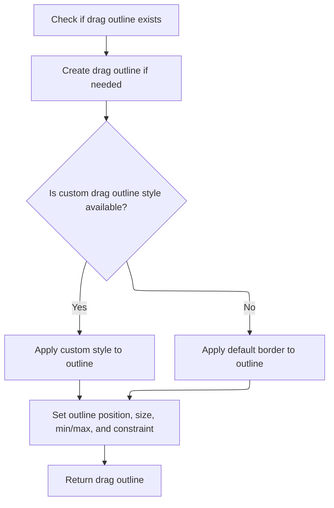

This document describes how the drag-and-drop interface visually represents the area being dragged. When a user starts dragging an element, an outline is overlaid to match the element's size and style, and is constrained to stay within parent boundaries. This ensures clear visual feedback during drag-and-drop operations.

# Where is this flow used?

This flow is used multiple times in the codebase as represented in the following diagram:

(Note - these are only some of the entry points of this flow)

```mermaid
graph TD;
      ebcb3f7dc8c6b6833964c6a7e000f9a6f80835b10d1983c29c4d168152000b37(shopizer/…/modules/ISC_PluginBridges.js::handleSVGEvent) --> 3efc3b25db282fde0fd59beab64c9e00a05988819f6b60b8786f76fb51774047(shopizer/…/modules/ISC_Core.js::handleSyntheticEvent)

3efc3b25db282fde0fd59beab64c9e00a05988819f6b60b8786f76fb51774047(shopizer/…/modules/ISC_Core.js::handleSyntheticEvent) --> 09678b1eb616c34bb08acebe53cc722c1511a0f502b749fd8d4d682edb94a151(shopizer/…/modules/ISC_Core.js::handleMouseMove)

09678b1eb616c34bb08acebe53cc722c1511a0f502b749fd8d4d682edb94a151(shopizer/…/modules/ISC_Core.js::handleMouseMove) --> 84655bfb5968d1af80b23a460f55cbbfbef319e5be6149d05842e5279a541a18(shopizer/…/modules/ISC_Core.js::$kx)

84655bfb5968d1af80b23a460f55cbbfbef319e5be6149d05842e5279a541a18(shopizer/…/modules/ISC_Core.js::$kx) --> fb6720d0c6cd79883a010c0e32c92bedc7780d7c92de39d0cd9d73531c4c5f6d(shopizer/…/modules/ISC_Core.js::$kz)

fb6720d0c6cd79883a010c0e32c92bedc7780d7c92de39d0cd9d73531c4c5f6d(shopizer/…/modules/ISC_Core.js::$kz) --> 6c11e6e683d1d338597ec5a348df10ee4aa2c855388b00086b738ca963a5924f(shopizer/…/modules/ISC_Core.js::handleDragStart)

6c11e6e683d1d338597ec5a348df10ee4aa2c855388b00086b738ca963a5924f(shopizer/…/modules/ISC_Core.js::handleDragStart) --> b78c299d49bb0baf743de4303a84b049646f22cad9c5b1a5e96adacbc77bb8bb(shopizer/…/modules/ISC_Core.js::getDragOutline):::mainFlowStyle

ab3566a9f85dd1552d9dec0a6c59fbeee7043c1e7539960ea7bc6484c54b7840(shopizer/…/modules/ISC_PluginBridges.js::isc_SVG_handleSVGEvent) --> 3efc3b25db282fde0fd59beab64c9e00a05988819f6b60b8786f76fb51774047(shopizer/…/modules/ISC_Core.js::handleSyntheticEvent)

16883fc0d60e95917ccffa8feaaf47db2b007a43e119364418fbdd3b19e0f522(shopizer/…/modules/ISC_Core.js::isc_c_EventHandler_handleSyntheticEvent) --> 09678b1eb616c34bb08acebe53cc722c1511a0f502b749fd8d4d682edb94a151(shopizer/…/modules/ISC_Core.js::handleMouseMove)

7382f49c25ef8129d8e5d04f8b76acb1d4dfebb454a143af2ae753274efa4344(shopizer/…/modules/ISC_Core.js::scrollTo) --> 9ebe701bc96eb02107d3c11b4154efaad3fb3366f2e94c33a170cd4f764758dc(shopizer/…/modules/ISC_Core.js::$u6)

9ebe701bc96eb02107d3c11b4154efaad3fb3366f2e94c33a170cd4f764758dc(shopizer/…/modules/ISC_Core.js::$u6) --> 84655bfb5968d1af80b23a460f55cbbfbef319e5be6149d05842e5279a541a18(shopizer/…/modules/ISC_Core.js::$kx)

9ae1a036b51ce6faad15f8d8d70865ae3996726fd5ed75efede4be6550d54d00(shopizer/…/modules/ISC_Core.js::isc_Canvas__scrolled) --> 84655bfb5968d1af80b23a460f55cbbfbef319e5be6149d05842e5279a541a18(shopizer/…/modules/ISC_Core.js::$kx)


classDef mainFlowStyle color:#000000,fill:#7CB9F4
classDef rootsStyle color:#000000,fill:#00FFF4
classDef Style1 color:#000000,fill:#00FFAA
classDef Style2 color:#000000,fill:#FFFF00
classDef Style3 color:#000000,fill:#AA7CB9

%% Swimm:
%% graph TD;
%%       ebcb3f7dc8c6b6833964c6a7e000f9a6f80835b10d1983c29c4d168152000b37(<SwmPath>[shopizer/…/modules/ISC_PluginBridges.js](shopizer/sm-shop/src/main/webapp/resources/smart-client/system/modules/ISC_PluginBridges.js)</SwmPath>::handleSVGEvent) --> 3efc3b25db282fde0fd59beab64c9e00a05988819f6b60b8786f76fb51774047(<SwmPath>[shopizer/…/modules/ISC_Core.js](shopizer/sm-shop/src/main/webapp/resources/smart-client/system/modules/ISC_Core.js)</SwmPath>::<SwmToken path="shopizer/sm-shop/src/main/webapp/resources/smart-client/system/modules/ISC_Core.js" pos="1322:141:141" line-data="_2.shiftKey=(_1.shiftKey==true);_2.ctrlKey=(_1.ctrlKey==true);_2.altKey=(_1.altKey==true);_2.metaKey=(_1.metaKey==true);return _2});isc.A.$688=&quot;f1&quot;;isc.A.$689=&quot;help&quot;;isc.A.HARD=&quot;hard&quot;;isc.A.SOFT=&quot;soft&quot;;isc.A.SOFT_CANCEL=&quot;softCancel&quot;;isc.A.$j7=0;isc.A.clickMaskRegistry=[];isc.A.$cp=&#39;ID&#39;;isc.B.push(isc.A.handleSyntheticEvent=function isc_c_EventHandler_handleSyntheticEvent(_1){var _2=_1.target;_1.$49s=true;if(_2){_1.clientX+=_2.getPageLeft();_1.clientY+=_2.getPageTop();if(isc.Browser.isIE){_1.clientX+=_2.getLeftMargin()+_2.getLeftBorderSize()+_2.getLeftPadding()+2;_1.clientY+=_2.getTopMargin()+_2.getRightBorderSize()+_2.getTopPadding()+2}">`handleSyntheticEvent`</SwmToken>)
%% 
%% 3efc3b25db282fde0fd59beab64c9e00a05988819f6b60b8786f76fb51774047(<SwmPath>[shopizer/…/modules/ISC_Core.js](shopizer/sm-shop/src/main/webapp/resources/smart-client/system/modules/ISC_Core.js)</SwmPath>::<SwmToken path="shopizer/sm-shop/src/main/webapp/resources/smart-client/system/modules/ISC_Core.js" pos="1322:141:141" line-data="_2.shiftKey=(_1.shiftKey==true);_2.ctrlKey=(_1.ctrlKey==true);_2.altKey=(_1.altKey==true);_2.metaKey=(_1.metaKey==true);return _2});isc.A.$688=&quot;f1&quot;;isc.A.$689=&quot;help&quot;;isc.A.HARD=&quot;hard&quot;;isc.A.SOFT=&quot;soft&quot;;isc.A.SOFT_CANCEL=&quot;softCancel&quot;;isc.A.$j7=0;isc.A.clickMaskRegistry=[];isc.A.$cp=&#39;ID&#39;;isc.B.push(isc.A.handleSyntheticEvent=function isc_c_EventHandler_handleSyntheticEvent(_1){var _2=_1.target;_1.$49s=true;if(_2){_1.clientX+=_2.getPageLeft();_1.clientY+=_2.getPageTop();if(isc.Browser.isIE){_1.clientX+=_2.getLeftMargin()+_2.getLeftBorderSize()+_2.getLeftPadding()+2;_1.clientY+=_2.getTopMargin()+_2.getRightBorderSize()+_2.getTopPadding()+2}">`handleSyntheticEvent`</SwmToken>) --> 09678b1eb616c34bb08acebe53cc722c1511a0f502b749fd8d4d682edb94a151(<SwmPath>[shopizer/…/modules/ISC_Core.js](shopizer/sm-shop/src/main/webapp/resources/smart-client/system/modules/ISC_Core.js)</SwmPath>::<SwmToken path="shopizer/sm-shop/src/main/webapp/resources/smart-client/system/modules/ISC_Core.js" pos="1323:42:42" line-data="switch(_1.type){case&quot;mouseup&quot;:this.handleMouseUp(_1);break;case&quot;mousedown&quot;:this.handleMouseDown(_1);break;case&quot;mousemove&quot;:this.handleMouseMove(_1);break}}}">`handleMouseMove`</SwmToken>)
%% 
%% 09678b1eb616c34bb08acebe53cc722c1511a0f502b749fd8d4d682edb94a151(<SwmPath>[shopizer/…/modules/ISC_Core.js](shopizer/sm-shop/src/main/webapp/resources/smart-client/system/modules/ISC_Core.js)</SwmPath>::<SwmToken path="shopizer/sm-shop/src/main/webapp/resources/smart-client/system/modules/ISC_Core.js" pos="1323:42:42" line-data="switch(_1.type){case&quot;mouseup&quot;:this.handleMouseUp(_1);break;case&quot;mousedown&quot;:this.handleMouseDown(_1);break;case&quot;mousemove&quot;:this.handleMouseMove(_1);break}}}">`handleMouseMove`</SwmToken>) --> 84655bfb5968d1af80b23a460f55cbbfbef319e5be6149d05842e5279a541a18(<SwmPath>[shopizer/…/modules/ISC_Core.js](shopizer/sm-shop/src/main/webapp/resources/smart-client/system/modules/ISC_Core.js)</SwmPath>::$kx)
%% 
%% 84655bfb5968d1af80b23a460f55cbbfbef319e5be6149d05842e5279a541a18(<SwmPath>[shopizer/…/modules/ISC_Core.js](shopizer/sm-shop/src/main/webapp/resources/smart-client/system/modules/ISC_Core.js)</SwmPath>::$kx) --> fb6720d0c6cd79883a010c0e32c92bedc7780d7c92de39d0cd9d73531c4c5f6d(<SwmPath>[shopizer/…/modules/ISC_Core.js](shopizer/sm-shop/src/main/webapp/resources/smart-client/system/modules/ISC_Core.js)</SwmPath>::$kz)
%% 
%% fb6720d0c6cd79883a010c0e32c92bedc7780d7c92de39d0cd9d73531c4c5f6d(<SwmPath>[shopizer/…/modules/ISC_Core.js](shopizer/sm-shop/src/main/webapp/resources/smart-client/system/modules/ISC_Core.js)</SwmPath>::$kz) --> 6c11e6e683d1d338597ec5a348df10ee4aa2c855388b00086b738ca963a5924f(<SwmPath>[shopizer/…/modules/ISC_Core.js](shopizer/sm-shop/src/main/webapp/resources/smart-client/system/modules/ISC_Core.js)</SwmPath>::<SwmToken path="shopizer/sm-shop/src/main/webapp/resources/smart-client/system/modules/ISC_Core.js" pos="1410:3:3" line-data="{_3.handleDragStart(_2)}">`handleDragStart`</SwmToken>)
%% 
%% 6c11e6e683d1d338597ec5a348df10ee4aa2c855388b00086b738ca963a5924f(<SwmPath>[shopizer/…/modules/ISC_Core.js](shopizer/sm-shop/src/main/webapp/resources/smart-client/system/modules/ISC_Core.js)</SwmPath>::<SwmToken path="shopizer/sm-shop/src/main/webapp/resources/smart-client/system/modules/ISC_Core.js" pos="1410:3:3" line-data="{_3.handleDragStart(_2)}">`handleDragStart`</SwmToken>) --> b78c299d49bb0baf743de4303a84b049646f22cad9c5b1a5e96adacbc77bb8bb(<SwmPath>[shopizer/…/modules/ISC_Core.js](shopizer/sm-shop/src/main/webapp/resources/smart-client/system/modules/ISC_Core.js)</SwmPath>::<SwmToken path="shopizer/sm-shop/src/main/webapp/resources/smart-client/system/modules/ISC_Core.js" pos="1660:5:5" line-data=",isc.A.getDragOutline=function isc_c_EventHandler_getDragOutline(_1,_2,_3){if(!this.dragOutline){this.dragOutline=isc.Canvas.create({autoDraw:false,overflow:isc.Canvas.HIDDEN})">`getDragOutline`</SwmToken>):::mainFlowStyle
%% 
%% ab3566a9f85dd1552d9dec0a6c59fbeee7043c1e7539960ea7bc6484c54b7840(<SwmPath>[shopizer/…/modules/ISC_PluginBridges.js](shopizer/sm-shop/src/main/webapp/resources/smart-client/system/modules/ISC_PluginBridges.js)</SwmPath>::isc_SVG_handleSVGEvent) --> 3efc3b25db282fde0fd59beab64c9e00a05988819f6b60b8786f76fb51774047(<SwmPath>[shopizer/…/modules/ISC_Core.js](shopizer/sm-shop/src/main/webapp/resources/smart-client/system/modules/ISC_Core.js)</SwmPath>::<SwmToken path="shopizer/sm-shop/src/main/webapp/resources/smart-client/system/modules/ISC_Core.js" pos="1322:141:141" line-data="_2.shiftKey=(_1.shiftKey==true);_2.ctrlKey=(_1.ctrlKey==true);_2.altKey=(_1.altKey==true);_2.metaKey=(_1.metaKey==true);return _2});isc.A.$688=&quot;f1&quot;;isc.A.$689=&quot;help&quot;;isc.A.HARD=&quot;hard&quot;;isc.A.SOFT=&quot;soft&quot;;isc.A.SOFT_CANCEL=&quot;softCancel&quot;;isc.A.$j7=0;isc.A.clickMaskRegistry=[];isc.A.$cp=&#39;ID&#39;;isc.B.push(isc.A.handleSyntheticEvent=function isc_c_EventHandler_handleSyntheticEvent(_1){var _2=_1.target;_1.$49s=true;if(_2){_1.clientX+=_2.getPageLeft();_1.clientY+=_2.getPageTop();if(isc.Browser.isIE){_1.clientX+=_2.getLeftMargin()+_2.getLeftBorderSize()+_2.getLeftPadding()+2;_1.clientY+=_2.getTopMargin()+_2.getRightBorderSize()+_2.getTopPadding()+2}">`handleSyntheticEvent`</SwmToken>)
%% 
%% 16883fc0d60e95917ccffa8feaaf47db2b007a43e119364418fbdd3b19e0f522(<SwmPath>[shopizer/…/modules/ISC_Core.js](shopizer/sm-shop/src/main/webapp/resources/smart-client/system/modules/ISC_Core.js)</SwmPath>::<SwmToken path="shopizer/sm-shop/src/main/webapp/resources/smart-client/system/modules/ISC_Core.js" pos="1322:145:145" line-data="_2.shiftKey=(_1.shiftKey==true);_2.ctrlKey=(_1.ctrlKey==true);_2.altKey=(_1.altKey==true);_2.metaKey=(_1.metaKey==true);return _2});isc.A.$688=&quot;f1&quot;;isc.A.$689=&quot;help&quot;;isc.A.HARD=&quot;hard&quot;;isc.A.SOFT=&quot;soft&quot;;isc.A.SOFT_CANCEL=&quot;softCancel&quot;;isc.A.$j7=0;isc.A.clickMaskRegistry=[];isc.A.$cp=&#39;ID&#39;;isc.B.push(isc.A.handleSyntheticEvent=function isc_c_EventHandler_handleSyntheticEvent(_1){var _2=_1.target;_1.$49s=true;if(_2){_1.clientX+=_2.getPageLeft();_1.clientY+=_2.getPageTop();if(isc.Browser.isIE){_1.clientX+=_2.getLeftMargin()+_2.getLeftBorderSize()+_2.getLeftPadding()+2;_1.clientY+=_2.getTopMargin()+_2.getRightBorderSize()+_2.getTopPadding()+2}">`isc_c_EventHandler_handleSyntheticEvent`</SwmToken>) --> 09678b1eb616c34bb08acebe53cc722c1511a0f502b749fd8d4d682edb94a151(<SwmPath>[shopizer/…/modules/ISC_Core.js](shopizer/sm-shop/src/main/webapp/resources/smart-client/system/modules/ISC_Core.js)</SwmPath>::<SwmToken path="shopizer/sm-shop/src/main/webapp/resources/smart-client/system/modules/ISC_Core.js" pos="1323:42:42" line-data="switch(_1.type){case&quot;mouseup&quot;:this.handleMouseUp(_1);break;case&quot;mousedown&quot;:this.handleMouseDown(_1);break;case&quot;mousemove&quot;:this.handleMouseMove(_1);break}}}">`handleMouseMove`</SwmToken>)
%% 
%% 7382f49c25ef8129d8e5d04f8b76acb1d4dfebb454a143af2ae753274efa4344(<SwmPath>[shopizer/…/modules/ISC_Core.js](shopizer/sm-shop/src/main/webapp/resources/smart-client/system/modules/ISC_Core.js)</SwmPath>::<SwmToken path="shopizer/sm-shop/src/main/webapp/resources/smart-client/system/modules/ISC_Core.js" pos="1213:5:5" line-data=",isc.A.scrollTo=function isc_c_Page_scrollTo(_1,_2){window.scroll(_1,_2)}">`scrollTo`</SwmToken>) --> 9ebe701bc96eb02107d3c11b4154efaad3fb3366f2e94c33a170cd4f764758dc(<SwmPath>[shopizer/…/modules/ISC_Core.js](shopizer/sm-shop/src/main/webapp/resources/smart-client/system/modules/ISC_Core.js)</SwmPath>::$u6)
%% 
%% 9ebe701bc96eb02107d3c11b4154efaad3fb3366f2e94c33a170cd4f764758dc(<SwmPath>[shopizer/…/modules/ISC_Core.js](shopizer/sm-shop/src/main/webapp/resources/smart-client/system/modules/ISC_Core.js)</SwmPath>::$u6) --> 84655bfb5968d1af80b23a460f55cbbfbef319e5be6149d05842e5279a541a18(<SwmPath>[shopizer/…/modules/ISC_Core.js](shopizer/sm-shop/src/main/webapp/resources/smart-client/system/modules/ISC_Core.js)</SwmPath>::$kx)
%% 
%% 9ae1a036b51ce6faad15f8d8d70865ae3996726fd5ed75efede4be6550d54d00(<SwmPath>[shopizer/…/modules/ISC_Core.js](shopizer/sm-shop/src/main/webapp/resources/smart-client/system/modules/ISC_Core.js)</SwmPath>::<SwmToken path="shopizer/sm-shop/src/main/webapp/resources/smart-client/system/modules/ISC_Core.js" pos="2939:9:9" line-data=",isc.A.$u6=function isc_Canvas__scrolled(){if(!isc.EH.$ky){var _1=isc.EH.lastEvent,_2=isc.EH.isMouseEvent(_1.eventType),_3=_2?_1.target:isc.EH.lastMoveTarget;if(_3!=null){if(!this.contains(_3,true))_3=null;else if(!_2&amp;&amp;_3!=this){var _4=this.getOffsetX(),_5=this.getOffsetY();if(!_3.visibleAtPoint(isc.EH.getX(),isc.EH.getY(),false,null,this))">`isc_Canvas__scrolled`</SwmToken>) --> 84655bfb5968d1af80b23a460f55cbbfbef319e5be6149d05842e5279a541a18(<SwmPath>[shopizer/…/modules/ISC_Core.js](shopizer/sm-shop/src/main/webapp/resources/smart-client/system/modules/ISC_Core.js)</SwmPath>::$kx)
%% 
%% 
%% classDef mainFlowStyle color:#000000,fill:#7CB9F4
%% classDef rootsStyle color:#000000,fill:#00FFF4
%% classDef Style1 color:#000000,fill:#00FFAA
%% classDef Style2 color:#000000,fill:#FFFF00
%% classDef Style3 color:#000000,fill:#AA7CB9
```



# Rendering and Constraining the Drag Outline



<SwmSnippet path="/shopizer/sm-shop/src/main/webapp/resources/smart-client/system/modules/ISC_Core.js" line="1660">

---

In <SwmToken path="shopizer/sm-shop/src/main/webapp/resources/smart-client/system/modules/ISC_Core.js" pos="1660:5:5" line-data=",isc.A.getDragOutline=function isc_c_EventHandler_getDragOutline(_1,_2,_3){if(!this.dragOutline){this.dragOutline=isc.Canvas.create({autoDraw:false,overflow:isc.Canvas.HIDDEN})">`getDragOutline`</SwmToken>, we lazily create the <SwmToken path="shopizer/sm-shop/src/main/webapp/resources/smart-client/system/modules/ISC_Core.js" pos="1660:23:23" line-data=",isc.A.getDragOutline=function isc_c_EventHandler_getDragOutline(_1,_2,_3){if(!this.dragOutline){this.dragOutline=isc.Canvas.create({autoDraw:false,overflow:isc.Canvas.HIDDEN})">`dragOutline`</SwmToken> Canvas if it doesn't exist, handle IE quirks, and set up the style or border so the outline is visually ready for further layout.

```javascript
,isc.A.getDragOutline=function isc_c_EventHandler_getDragOutline(_1,_2,_3){if(!this.dragOutline){this.dragOutline=isc.Canvas.create({autoDraw:false,overflow:isc.Canvas.HIDDEN})
if(isc.Browser.isIE)this.dragOutline.setContents(isc.Canvas.spacerHTML(3200,2400))}
var _4=this.dragOutline;if(isc.Element.getStyleDeclaration(_1.dragOutlineStyle)){_4.setStyleName(_1.dragOutlineStyle)}else{_4.setBorder((_2||1)+"px solid "+(_3||"black"))}
```

---

</SwmSnippet>

<SwmSnippet path="/shopizer/sm-shop/src/main/webapp/resources/smart-client/system/modules/ISC_Core.js" line="3136">

---

<SwmToken path="shopizer/sm-shop/src/main/webapp/resources/smart-client/system/modules/ISC_Core.js" pos="3136:5:5" line-data=",isc.A.setBorder=function isc_Canvas_setBorder(_1){this.$tk=null;if(_1!=null&amp;&amp;!isc.isA.String(_1)){_1=this.$63e(_1)}">`setBorder`</SwmToken> takes care of normalizing the border input, trims any trailing semicolon, and updates the style handle only if the border actually changed. It then triggers layout and overflow adjustments so the UI reflects the new border thickness right away.

```javascript
,isc.A.setBorder=function isc_Canvas_setBorder(_1){this.$tk=null;if(_1!=null&&!isc.isA.String(_1)){_1=this.$63e(_1)}
if(_1==null)return;if(isc.endsWith(_1,isc.semi))_1=_1.slice(0,_1.length-1);this.border=_1;var _2=this.getStyleHandle();if(!_2)return;if(_2.border!=_1){_2.border=_1}
this.adjustOverflow("setBorder");this.innerSizeChanged("Border thickness changed")}
```

---

</SwmSnippet>

<SwmSnippet path="/shopizer/sm-shop/src/main/webapp/resources/smart-client/system/modules/ISC_Core.js" line="1663">

---

Back in <SwmToken path="shopizer/sm-shop/src/main/webapp/resources/smart-client/system/modules/ISC_Core.js" pos="1660:5:5" line-data=",isc.A.getDragOutline=function isc_c_EventHandler_getDragOutline(_1,_2,_3){if(!this.dragOutline){this.dragOutline=isc.Canvas.create({autoDraw:false,overflow:isc.Canvas.HIDDEN})">`getDragOutline`</SwmToken>, after setting the border, we call <SwmToken path="shopizer/sm-shop/src/main/webapp/resources/smart-client/system/modules/ISC_Core.js" pos="1663:2:2" line-data="_4.setPageRect(_1.getPageLeft(),_1.getPageTop(),_1.getVisibleWidth(),_1.getVisibleHeight());_4.minWidth=_1.minWidth;_4.minHeight=_1.minHeight;_4.maxWidth=_1.maxWidth;_4.maxHeight=_1.maxHeight;if(isc.isAn.Array(_1.keepInParentRect)){_4.keepInParentRect=_1.keepInParentRect}else if(_1.keepInParentRect==true){_4.keepInParentRect=_1.getParentPageRect()}else{_4.keepInParentRect=null}">`setPageRect`</SwmToken> to position and size the <SwmToken path="shopizer/sm-shop/src/main/webapp/resources/smart-client/system/modules/ISC_Core.js" pos="1660:23:23" line-data=",isc.A.getDragOutline=function isc_c_EventHandler_getDragOutline(_1,_2,_3){if(!this.dragOutline){this.dragOutline=isc.Canvas.create({autoDraw:false,overflow:isc.Canvas.HIDDEN})">`dragOutline`</SwmToken> so it overlays the target element. We also copy min/max width and height constraints, and set <SwmToken path="shopizer/sm-shop/src/main/webapp/resources/smart-client/system/modules/ISC_Core.js" pos="1663:71:71" line-data="_4.setPageRect(_1.getPageLeft(),_1.getPageTop(),_1.getVisibleWidth(),_1.getVisibleHeight());_4.minWidth=_1.minWidth;_4.minHeight=_1.minHeight;_4.maxWidth=_1.maxWidth;_4.maxHeight=_1.maxHeight;if(isc.isAn.Array(_1.keepInParentRect)){_4.keepInParentRect=_1.keepInParentRect}else if(_1.keepInParentRect==true){_4.keepInParentRect=_1.getParentPageRect()}else{_4.keepInParentRect=null}">`keepInParentRect`</SwmToken> so the outline respects any parent boundaries during dragging.

```javascript
_4.setPageRect(_1.getPageLeft(),_1.getPageTop(),_1.getVisibleWidth(),_1.getVisibleHeight());_4.minWidth=_1.minWidth;_4.minHeight=_1.minHeight;_4.maxWidth=_1.maxWidth;_4.maxHeight=_1.maxHeight;if(isc.isAn.Array(_1.keepInParentRect)){_4.keepInParentRect=_1.keepInParentRect}else if(_1.keepInParentRect==true){_4.keepInParentRect=_1.getParentPageRect()}else{_4.keepInParentRect=null}
```

---

</SwmSnippet>

<SwmSnippet path="/shopizer/sm-shop/src/main/webapp/resources/smart-client/system/modules/ISC_Core.js" line="2454">

---

<SwmToken path="shopizer/sm-shop/src/main/webapp/resources/smart-client/system/modules/ISC_Core.js" pos="2454:5:5" line-data=",isc.A.setPageRect=function isc_Canvas_setPageRect(_1,_2,_3,_4,_5){if(isc.isAn.Array(_1)){_2=_1[1];_3=_1[2];_4=_1[3];_1=_1[0]}">`setPageRect`</SwmToken> takes x, y, width, and height either as separate values or as an array, then enforces parent boundaries if dragging is active. It adjusts position and size so the element stays inside the allowed rectangle, factoring in scroll offsets and viewport size. If resizing, it compensates for any changes that affect the element's position.

```javascript
,isc.A.setPageRect=function isc_Canvas_setPageRect(_1,_2,_3,_4,_5){if(isc.isAn.Array(_1)){_2=_1[1];_3=_1[2];_4=_1[3];_1=_1[0]}
if(this.keepInParentRect&&this.ns.EH.dragging&&this==this.ns.EH.dragMoveTarget){var _6=(_3==null&&_4==null);if(_3==null)_3=this.getVisibleWidth();if(_4==null)_4=this.getVisibleHeight();var _7=_1+_3,_8=_2+_4,_9;var _10=isc.isAn.Array(this.keepInParentRect);if(_10){_9=this.keepInParentRect}else{_9=this.getParentPageRect()}
var _11=_9[0],_12=_9[1],_13=_9[2],_14=_9[3],_15=_11+_13,_16=_12+_14;var _17=this.ns.EH,_18=_17.getDragTarget(_17.getLastEvent()).parentElement;if(_18){var _19=_18.getScrollLeft(),_20=_18.getScrollWidth()-
_18.getViewportWidth()-_19,_21=_18.getScrollTop(),_22=_18.getScrollHeight()-
_18.getViewportHeight()-_21}else{var _19=isc.Page.getScrollLeft(),_20=isc.Page.getScrollWidth()-
isc.Page.getWidth()-_19,_21=isc.Page.getScrollTop(),_22=isc.Page.getScrollHeight()-
isc.Page.getHeight()-_21}
if(_20<0)_20=0;if(_22<0)_22=0;if(_6){if(_1<_11-_19){_1=_11-_19}
else if(_7>_15+_20){_1=_15+_20-_3}
if(_2<_12-_21){_2=_12-_21}
else if(_8>_16+_22){_2=_16+_22-_4}}else{if(_1<_11){_3=_3-(_11-_1);_1=_11}else if(_7>_15){_3=_3-(_7-_15)}
if(_2<_12){_4=_4-(_12-_2);_2=_12}else if(_8>_16){_4=_4-(_8-_16)}}}
this.moveBy(_1-this.getPageLeft(),_2-this.getPageTop());if(_5){var _23=this.getVisibleWidth(),_24=this.getVisibleHeight(),_25=_23-_3,_26=_24-_4;this.resizeTo(_3,_4);this.redrawIfDirty("setPageRect");var _27=(_23-this.getVisibleWidth()),_28=(_24-this.getVisibleHeight());if(_1>this.getPageLeft())_1-=(_25-_27);if(_2>this.getPageTop())_2-=(_26-_28)}else{this.resizeTo(_3,_4)}}
```

---

</SwmSnippet>

<SwmSnippet path="/shopizer/sm-shop/src/main/webapp/resources/smart-client/system/modules/ISC_Core.js" line="1663">

---

After <SwmToken path="shopizer/sm-shop/src/main/webapp/resources/smart-client/system/modules/ISC_Core.js" pos="1663:2:2" line-data="_4.setPageRect(_1.getPageLeft(),_1.getPageTop(),_1.getVisibleWidth(),_1.getVisibleHeight());_4.minWidth=_1.minWidth;_4.minHeight=_1.minHeight;_4.maxWidth=_1.maxWidth;_4.maxHeight=_1.maxHeight;if(isc.isAn.Array(_1.keepInParentRect)){_4.keepInParentRect=_1.keepInParentRect}else if(_1.keepInParentRect==true){_4.keepInParentRect=_1.getParentPageRect()}else{_4.keepInParentRect=null}">`setPageRect`</SwmToken>, <SwmToken path="shopizer/sm-shop/src/main/webapp/resources/smart-client/system/modules/ISC_Core.js" pos="1660:5:5" line-data=",isc.A.getDragOutline=function isc_c_EventHandler_getDragOutline(_1,_2,_3){if(!this.dragOutline){this.dragOutline=isc.Canvas.create({autoDraw:false,overflow:isc.Canvas.HIDDEN})">`getDragOutline`</SwmToken> finishes by copying sizing constraints and setting <SwmToken path="shopizer/sm-shop/src/main/webapp/resources/smart-client/system/modules/ISC_Core.js" pos="1663:71:71" line-data="_4.setPageRect(_1.getPageLeft(),_1.getPageTop(),_1.getVisibleWidth(),_1.getVisibleHeight());_4.minWidth=_1.minWidth;_4.minHeight=_1.minHeight;_4.maxWidth=_1.maxWidth;_4.maxHeight=_1.maxHeight;if(isc.isAn.Array(_1.keepInParentRect)){_4.keepInParentRect=_1.keepInParentRect}else if(_1.keepInParentRect==true){_4.keepInParentRect=_1.getParentPageRect()}else{_4.keepInParentRect=null}">`keepInParentRect`</SwmToken>. If <SwmToken path="shopizer/sm-shop/src/main/webapp/resources/smart-client/system/modules/ISC_Core.js" pos="1663:71:71" line-data="_4.setPageRect(_1.getPageLeft(),_1.getPageTop(),_1.getVisibleWidth(),_1.getVisibleHeight());_4.minWidth=_1.minWidth;_4.minHeight=_1.minHeight;_4.maxWidth=_1.maxWidth;_4.maxHeight=_1.maxHeight;if(isc.isAn.Array(_1.keepInParentRect)){_4.keepInParentRect=_1.keepInParentRect}else if(_1.keepInParentRect==true){_4.keepInParentRect=_1.getParentPageRect()}else{_4.keepInParentRect=null}">`keepInParentRect`</SwmToken> is true, we call <SwmToken path="shopizer/sm-shop/src/main/webapp/resources/smart-client/system/modules/ISC_Core.js" pos="1663:100:100" line-data="_4.setPageRect(_1.getPageLeft(),_1.getPageTop(),_1.getVisibleWidth(),_1.getVisibleHeight());_4.minWidth=_1.minWidth;_4.minHeight=_1.minHeight;_4.maxWidth=_1.maxWidth;_4.maxHeight=_1.maxHeight;if(isc.isAn.Array(_1.keepInParentRect)){_4.keepInParentRect=_1.keepInParentRect}else if(_1.keepInParentRect==true){_4.keepInParentRect=_1.getParentPageRect()}else{_4.keepInParentRect=null}">`getParentPageRect`</SwmToken> to get the parent bounds, so the drag outline stays inside its container. Otherwise, it's unconstrained or uses a custom array.

```javascript
_4.setPageRect(_1.getPageLeft(),_1.getPageTop(),_1.getVisibleWidth(),_1.getVisibleHeight());_4.minWidth=_1.minWidth;_4.minHeight=_1.minHeight;_4.maxWidth=_1.maxWidth;_4.maxHeight=_1.maxHeight;if(isc.isAn.Array(_1.keepInParentRect)){_4.keepInParentRect=_1.keepInParentRect}else if(_1.keepInParentRect==true){_4.keepInParentRect=_1.getParentPageRect()}else{_4.keepInParentRect=null}
return _4}
```

---

</SwmSnippet>

<SwmSnippet path="/shopizer/sm-shop/src/main/webapp/resources/smart-client/system/modules/ISC_Core.js" line="2451">

---

<SwmToken path="shopizer/sm-shop/src/main/webapp/resources/smart-client/system/modules/ISC_Core.js" pos="2451:5:5" line-data=",isc.A.getParentPageRect=function isc_Canvas_getParentPageRect(){if(this.parentElement){var _1=this.parentElement,_2=_1.getPageRect();var _3=_1.getLeftMargin(),_4=_1.getTopMargin();_2[0]+=_3;_2[1]+=_4;_2[2]-=(_3+_1.getRightMargin());_2[3]-=(_4+_1.getBottomMargin());if(this.peers&amp;&amp;this.peers.length&gt;0){var _5=this.getPeerRect(),_6=this.getPageRect();_2[0]+=(_6[0]-_5[0]);_2[1]+=(_6[1]-_5[1]);_2[2]-=(_5[2]-_6[2]);_2[3]-=(_5[3]-_6[3])}">`getParentPageRect`</SwmToken> calculates the actual usable area inside the parent, factoring in margins, peers, offsets, and scrollbars, so drag constraints are spot on.

```javascript
,isc.A.getParentPageRect=function isc_Canvas_getParentPageRect(){if(this.parentElement){var _1=this.parentElement,_2=_1.getPageRect();var _3=_1.getLeftMargin(),_4=_1.getTopMargin();_2[0]+=_3;_2[1]+=_4;_2[2]-=(_3+_1.getRightMargin());_2[3]-=(_4+_1.getBottomMargin());if(this.peers&&this.peers.length>0){var _5=this.getPeerRect(),_6=this.getPageRect();_2[0]+=(_6[0]-_5[0]);_2[1]+=(_6[1]-_5[1]);_2[2]-=(_5[2]-_6[2]);_2[3]-=(_5[3]-_6[3])}
var _7=_1.$tj();_2[0]+=_7.left;_2[1]+=_7.top;_2[2]-=_7.right+_7.left;_2[3]-=_7.bottom+_7.top;var _8=_1.getScrollbarSize();if(_1.vscrollOn)_2[2]-=_8;if(_1.hscrollOn)_2[3]-=_8;return _2}
else return[0,0,isc.Page.getWidth(),isc.Page.getHeight()]}
```

---

</SwmSnippet>

&nbsp;

*This is an auto-generated document by Swimm 🌊 and has not yet been verified by a human*

<SwmMeta version="3.0.0" repo-id="Z2l0aHViJTNBJTNBU2hvcGl6ZXIlM0ElM0F1bWFsaW5nYXN3YW1p" repo-name="Shopizer"><sup>Powered by [Swimm](https://app.swimm.io/)</sup></SwmMeta>
