This document describes the flow for rendering a product details page. When a user requests a product, the system prepares all necessary data, including product information, localized attributes, selectable options, related products, and reviews. This enables users to view a complete product details page with accurate and localized information.

# Where is this flow used?

This flow is used multiple times in the codebase as represented in the following diagram:

```mermaid
graph TD;
      ac2ab9d4cd2a2be4b11e28cf83badb0c8e7ac483bafc687bfd5f34a8969802d5(shopizer/…/product/ShopProductController.java::ShopProductController.displayProductWithReference) --> f025839795719b2b8f1afc1f63aabc403c9f304dd149865cb97ee131e6fff658(shopizer/…/product/ShopProductController.java::ShopProductController.display)

00e3bc0b543b8d6b927610b3c20f995d0401cd047c31d6208be6f80cc88e186a(shopizer/…/product/ShopProductController.java::ShopProductController.displayProduct) --> f025839795719b2b8f1afc1f63aabc403c9f304dd149865cb97ee131e6fff658(shopizer/…/product/ShopProductController.java::ShopProductController.display)


classDef mainFlowStyle color:#000000,fill:#7CB9F4
classDef rootsStyle color:#000000,fill:#00FFF4
classDef Style1 color:#000000,fill:#00FFAA
classDef Style2 color:#000000,fill:#FFFF00
classDef Style3 color:#000000,fill:#AA7CB9

%% Swimm:
%% graph TD;
%%       ac2ab9d4cd2a2be4b11e28cf83badb0c8e7ac483bafc687bfd5f34a8969802d5(<SwmPath>[shopizer/…/product/ShopProductController.java](shopizer/sm-shop/src/main/java/com/salesmanager/web/shop/controller/product/ShopProductController.java)</SwmPath>::ShopProductController.displayProductWithReference) --> f025839795719b2b8f1afc1f63aabc403c9f304dd149865cb97ee131e6fff658(<SwmPath>[shopizer/…/product/ShopProductController.java](shopizer/sm-shop/src/main/java/com/salesmanager/web/shop/controller/product/ShopProductController.java)</SwmPath>::ShopProductController.display)
%% 
%% 00e3bc0b543b8d6b927610b3c20f995d0401cd047c31d6208be6f80cc88e186a(<SwmPath>[shopizer/…/product/ShopProductController.java](shopizer/sm-shop/src/main/java/com/salesmanager/web/shop/controller/product/ShopProductController.java)</SwmPath>::ShopProductController.displayProduct) --> f025839795719b2b8f1afc1f63aabc403c9f304dd149865cb97ee131e6fff658(<SwmPath>[shopizer/…/product/ShopProductController.java](shopizer/sm-shop/src/main/java/com/salesmanager/web/shop/controller/product/ShopProductController.java)</SwmPath>::ShopProductController.display)
%% 
%% 
%% classDef mainFlowStyle color:#000000,fill:#7CB9F4
%% classDef rootsStyle color:#000000,fill:#00FFF4
%% classDef Style1 color:#000000,fill:#00FFAA
%% classDef Style2 color:#000000,fill:#FFFF00
%% classDef Style3 color:#000000,fill:#AA7CB9
```



# Rendering the Product Details and Preparing Context

This section prepares all necessary data and context for rendering a product details page, ensuring that product information, related products, and attribute options are correctly set up for display to the user.

| Category       | Rule Name                | Description                                                                                                                                                                                      |
| -------------- | ------------------------ | ------------------------------------------------------------------------------------------------------------------------------------------------------------------------------------------------ |
| Business logic | Product Meta Information | The product details page must display meta information (title, description, keywords, and URL) based on the product's data for SEO and user context.                                             |
| Business logic | Breadcrumb Navigation    | Breadcrumb navigation must be set up to reflect the user's path to the product, aiding navigation and context.                                                                                   |
| Business logic | Attribute Grouping       | The product attributes must be split into two groups: read-only attributes (display-only) and selectable options (user-selectable), and both must be prepared for rendering on the product page. |
| Business logic | Attribute Localization   | Each attribute, whether read-only or selectable, must be constructed with the correct language context to ensure localization for the user.                                                      |

<SwmSnippet path="/shopizer/sm-shop/src/main/java/com/salesmanager/web/shop/controller/product/ShopProductController.java" line="136">

---

In <SwmToken path="shopizer/sm-shop/src/main/java/com/salesmanager/web/shop/controller/product/ShopProductController.java" pos="136:5:5" line-data="	public String display(final String reference, final String friendlyUrl, Model model, HttpServletRequest request, HttpServletResponse response, Locale locale) throws Exception {">`display`</SwmToken>, we grab the store and language from the request, fetch the product, and set up meta info and breadcrumbs for the page. We also build cache keys and try to get related products from cache or DB. Next, we split product attributes into read-only and selectable options, which means we need to call <SwmToken path="shopizer/sm-shop/src/main/java/com/salesmanager/web/shop/controller/product/ShopProductController.java" pos="228:5:5" line-data="						attr = createAttribute(attribute, language);">`createAttribute`</SwmToken> to build out the attribute objects for each type. This sets up the data needed for rendering the product page with the right attribute details.

```java
	public String display(final String reference, final String friendlyUrl, Model model, HttpServletRequest request, HttpServletResponse response, Locale locale) throws Exception {
		

		MerchantStore store = (MerchantStore)request.getAttribute(Constants.MERCHANT_STORE);
		Language language = (Language)request.getAttribute("LANGUAGE");
		
		Product product = productService.getBySeUrl(store, friendlyUrl, locale);
				
		if(product==null) {
			return PageBuilderUtils.build404(store);
		}
		
		ReadableProductPopulator populator = new ReadableProductPopulator();
		populator.setPricingService(pricingService);
		
		ReadableProduct productProxy = populator.populate(product, new ReadableProduct(), store, language);

		//meta information
		PageInformation pageInformation = new PageInformation();
		pageInformation.setPageDescription(productProxy.getDescription().getMetaDescription());
		pageInformation.setPageKeywords(productProxy.getDescription().getKeyWords());
		pageInformation.setPageTitle(productProxy.getDescription().getTitle());
		pageInformation.setPageUrl(productProxy.getDescription().getFriendlyUrl());
		
		request.setAttribute(Constants.REQUEST_PAGE_INFORMATION, pageInformation);
		
		Breadcrumb breadCrumb = breadcrumbsUtils.buildProductBreadcrumb(reference, productProxy, store, language, request.getContextPath());
		request.getSession().setAttribute(Constants.BREADCRUMB, breadCrumb);
		request.setAttribute(Constants.BREADCRUMB, breadCrumb);
		

		
		StringBuilder relatedItemsCacheKey = new StringBuilder();
		relatedItemsCacheKey
		.append(store.getId())
		.append("_")
		.append(Constants.RELATEDITEMS_CACHE_KEY)
		.append("-")
		.append(language.getCode());
		
		StringBuilder relatedItemsMissed = new StringBuilder();
		relatedItemsMissed
		.append(relatedItemsCacheKey.toString())
		.append(Constants.MISSED_CACHE_KEY);
		
		Map<Long,List<ReadableProduct>> relatedItemsMap = null;
		List<ReadableProduct> relatedItems = null;
		
		if(store.isUseCache()) {

			//get from the cache
			relatedItemsMap = (Map<Long,List<ReadableProduct>>) cache.getFromCache(relatedItemsCacheKey.toString());
			if(relatedItemsMap==null) {
				//get from missed cache
				//Boolean missedContent = (Boolean)cache.getFromCache(relatedItemsMissed.toString());

				//if(missedContent==null) {
					relatedItems = relatedItems(store, product, language);
					if(relatedItems!=null) {
						relatedItemsMap = new HashMap<Long,List<ReadableProduct>>();
						relatedItemsMap.put(product.getId(), relatedItems);
						cache.putInCache(relatedItemsMap, relatedItemsCacheKey.toString());
					} else {
						//cache.putInCache(new Boolean(true), relatedItemsMissed.toString());
					}
				//}
			} else {
				relatedItems = relatedItemsMap.get(product.getId());
			}
		} else {
			relatedItems = relatedItems(store, product, language);
		}
		
		model.addAttribute("relatedProducts",relatedItems);	
		Set<ProductAttribute> attributes = product.getAttributes();
		
		//split read only and options
		Map<Long,Attribute> readOnlyAttributes = null;
		Map<Long,Attribute> selectableOptions = null;
		
		if(!CollectionUtils.isEmpty(attributes)) {
			for(ProductAttribute attribute : attributes) {
				Attribute attr = null;
				AttributeValue attrValue = new AttributeValue();
				ProductOptionValue optionValue = attribute.getProductOptionValue();
				
				if(attribute.getAttributeDisplayOnly()==true) {//read only attribute
					if(readOnlyAttributes==null) {
						readOnlyAttributes = new TreeMap<Long,Attribute>();
					}
					attr = readOnlyAttributes.get(attribute.getProductOption().getId());
					if(attr==null) {
						attr = createAttribute(attribute, language);
					}
					if(attr!=null) {
						readOnlyAttributes.put(attribute.getProductOption().getId(), attr);
						attr.setReadOnlyValue(attrValue);
					}
				} else {//selectable option
					if(selectableOptions==null) {
						selectableOptions = new TreeMap<Long,Attribute>();
					}
					attr = selectableOptions.get(attribute.getProductOption().getId());
					if(attr==null) {
						attr = createAttribute(attribute, language);
					}
					if(attr!=null) {
						selectableOptions.put(attribute.getProductOption().getId(), attr);
					}
				}
				
				
				
```

---

</SwmSnippet>

## Building Localized Attribute Objects

```mermaid
%%{init: {"flowchart": {"defaultRenderer": "elk"}} }%%
flowchart TD
    node1["Create new attribute object"]
    click node1 openCode "shopizer/sm-shop/src/main/java/com/salesmanager/web/shop/controller/product/ShopProductController.java:351:351"
    node1 --> node2{"Are there any descriptions?"}
    click node2 openCode "shopizer/sm-shop/src/main/java/com/salesmanager/web/shop/controller/product/ShopProductController.java:354:356"
    node2 -->|"No"| node6["Set attribute fields from default description"]
    click node6 openCode "shopizer/sm-shop/src/main/java/com/salesmanager/web/shop/controller/product/ShopProductController.java:372:375"
    node2 -->|"Yes"| node3{"Are there multiple descriptions?"}
    click node3 openCode "shopizer/sm-shop/src/main/java/com/salesmanager/web/shop/controller/product/ShopProductController.java:357:358"
    node3 -->|"No"| node6
    node3 -->|"Yes"| loop1
    subgraph loop1["For each description"]
        node4{"Does description match requested language?"}
        click node4 openCode "shopizer/sm-shop/src/main/java/com/salesmanager/web/shop/controller/product/ShopProductController.java:360:363"
        node4 -->|"Yes"| node5["Select this description and exit loop"]
        click node5 openCode "shopizer/sm-shop/src/main/java/com/salesmanager/web/shop/controller/product/ShopProductController.java:361:362"
        node4 -->|"No"| node8["Continue searching"]
        click node8 openCode "shopizer/sm-shop/src/main/java/com/salesmanager/web/shop/controller/product/ShopProductController.java:359:364"
        node8 --> node4
    end
    node5 --> node6["Set attribute fields from selected description"]
    node6 --> node7["Return attribute"]
    click node7 openCode "shopizer/sm-shop/src/main/java/com/salesmanager/web/shop/controller/product/ShopProductController.java:377:377"

classDef HeadingStyle fill:#777777,stroke:#333,stroke-width:2px;

%% Swimm:
%% %%{init: {"flowchart": {"defaultRenderer": "elk"}} }%%
%% flowchart TD
%%     node1["Create new attribute object"]
%%     click node1 openCode "<SwmPath>[shopizer/…/product/ShopProductController.java](shopizer/sm-shop/src/main/java/com/salesmanager/web/shop/controller/product/ShopProductController.java)</SwmPath>:351:351"
%%     node1 --> node2{"Are there any descriptions?"}
%%     click node2 openCode "<SwmPath>[shopizer/…/product/ShopProductController.java](shopizer/sm-shop/src/main/java/com/salesmanager/web/shop/controller/product/ShopProductController.java)</SwmPath>:354:356"
%%     node2 -->|"No"| node6["Set attribute fields from default description"]
%%     click node6 openCode "<SwmPath>[shopizer/…/product/ShopProductController.java](shopizer/sm-shop/src/main/java/com/salesmanager/web/shop/controller/product/ShopProductController.java)</SwmPath>:372:375"
%%     node2 -->|"Yes"| node3{"Are there multiple descriptions?"}
%%     click node3 openCode "<SwmPath>[shopizer/…/product/ShopProductController.java](shopizer/sm-shop/src/main/java/com/salesmanager/web/shop/controller/product/ShopProductController.java)</SwmPath>:357:358"
%%     node3 -->|"No"| node6
%%     node3 -->|"Yes"| loop1
%%     subgraph loop1["For each description"]
%%         node4{"Does description match requested language?"}
%%         click node4 openCode "<SwmPath>[shopizer/…/product/ShopProductController.java](shopizer/sm-shop/src/main/java/com/salesmanager/web/shop/controller/product/ShopProductController.java)</SwmPath>:360:363"
%%         node4 -->|"Yes"| node5["Select this description and exit loop"]
%%         click node5 openCode "<SwmPath>[shopizer/…/product/ShopProductController.java](shopizer/sm-shop/src/main/java/com/salesmanager/web/shop/controller/product/ShopProductController.java)</SwmPath>:361:362"
%%         node4 -->|"No"| node8["Continue searching"]
%%         click node8 openCode "<SwmPath>[shopizer/…/product/ShopProductController.java](shopizer/sm-shop/src/main/java/com/salesmanager/web/shop/controller/product/ShopProductController.java)</SwmPath>:359:364"
%%         node8 --> node4
%%     end
%%     node5 --> node6["Set attribute fields from selected description"]
%%     node6 --> node7["Return attribute"]
%%     click node7 openCode "<SwmPath>[shopizer/…/product/ShopProductController.java](shopizer/sm-shop/src/main/java/com/salesmanager/web/shop/controller/product/ShopProductController.java)</SwmPath>:377:377"
%% 
%% classDef HeadingStyle fill:#777777,stroke:#333,stroke-width:2px;
```



This section is responsible for building a localized Attribute object for a product option, ensuring that the attribute's name and language match the user's requested language whenever possible. If a matching language description is not found, a default description is used.

| Category        | Rule Name                | Description                                                                                                                      |
| --------------- | ------------------------ | -------------------------------------------------------------------------------------------------------------------------------- |
| Data validation | Attribute Completeness   | The attribute object must always include the id, type, code, language, and name fields for display purposes.                     |
| Business logic  | Language Match Selection | If multiple descriptions are available, the description matching the requested language must be selected for the attribute name. |

<SwmSnippet path="/shopizer/sm-shop/src/main/java/com/salesmanager/web/shop/controller/product/ShopProductController.java" line="349">

---

In <SwmToken path="shopizer/sm-shop/src/main/java/com/salesmanager/web/shop/controller/product/ShopProductController.java" pos="349:5:5" line-data="	private Attribute createAttribute(ProductAttribute productAttribute, Language language) {">`createAttribute`</SwmToken>, we select the best-matching description for the language and build the Attribute object for display.

```java
	private Attribute createAttribute(ProductAttribute productAttribute, Language language) {
		
		Attribute attribute = new Attribute();
		attribute.setId(productAttribute.getProductOption().getId());//attribute of the option
		attribute.setType(productAttribute.getProductOption().getProductOptionType());
		List<ProductOptionDescription> descriptions = productAttribute.getProductOption().getDescriptionsSettoList();
		ProductOptionDescription description = null;
		if(descriptions!=null && descriptions.size()>0) {
			description = descriptions.get(0);
			if(descriptions.size()>1) {
				for(ProductOptionDescription optionDescription : descriptions) {
					if(optionDescription.getLanguage().getId().intValue()==language.getId().intValue()) {
						description = optionDescription;
						break;
					}
				}
```

---

</SwmSnippet>

<SwmSnippet path="/shopizer/sm-shop/src/main/java/com/salesmanager/web/shop/controller/product/ShopProductController.java" line="372">

---

The function returns an Attribute object with id, type, code, language, and the localized name, so the product page can show the right info for each attribute.

```java
		attribute.setType(productAttribute.getProductOption().getProductOptionType());
		attribute.setLanguage(language.getCode());
		attribute.setName(description.getName());
		attribute.setCode(productAttribute.getProductOption().getCode());
		
		return attribute;
		
	}
```

---

</SwmSnippet>

## Populating Attribute Values and Product Reviews

```mermaid
%%{init: {"flowchart": {"defaultRenderer": "elk"}} }%%
flowchart TD
    node1["Prepare product attribute values for display"]
    click node1 openCode "shopizer/sm-shop/src/main/java/com/salesmanager/web/shop/controller/product/ShopProductController.java:249:251"
    node1 --> node2{"Is attribute price present and > 0?"}
    click node2 openCode "shopizer/sm-shop/src/main/java/com/salesmanager/web/shop/controller/product/ShopProductController.java:252:255"
    node2 -->|"Yes"| node3["Format and display price"]
    click node3 openCode "shopizer/sm-shop/src/main/java/com/salesmanager/web/shop/controller/product/ShopProductController.java:253:254"
    node2 -->|"No"| node4["Continue"]
    click node4 openCode "shopizer/sm-shop/src/main/java/com/salesmanager/web/shop/controller/product/ShopProductController.java:255:256"
    node3 --> node5{"Is product option image present?"}
    node4 --> node5
    click node5 openCode "shopizer/sm-shop/src/main/java/com/salesmanager/web/shop/controller/product/ShopProductController.java:257:259"
    node5 -->|"Yes"| node6["Display product option image"]
    click node6 openCode "shopizer/sm-shop/src/main/java/com/salesmanager/web/shop/controller/product/ShopProductController.java:258:259"
    node5 -->|"No"| node7["Continue"]
    click node7 openCode "shopizer/sm-shop/src/main/java/com/salesmanager/web/shop/controller/product/ShopProductController.java:259:260"
    node6 --> node8{"Are there multiple descriptions?"}
    node7 --> node8
    click node8 openCode "shopizer/sm-shop/src/main/java/com/salesmanager/web/shop/controller/product/ShopProductController.java:261:265"
    node8 -->|"Yes"| loop1
    node8 -->|"No"| node10["Use first description"]
    click node10 openCode "shopizer/sm-shop/src/main/java/com/salesmanager/web/shop/controller/product/ShopProductController.java:264:265"
    subgraph loop1["For each description"]
        node9{"Does description match user's language?"}
        click node9 openCode "shopizer/sm-shop/src/main/java/com/salesmanager/web/shop/controller/product/ShopProductController.java:266:270"
        node9 -->|"Yes"| node11["Set name and description"]
        click node11 openCode "shopizer/sm-shop/src/main/java/com/salesmanager/web/shop/controller/product/ShopProductController.java:274:275"
        node9 -->|"No"| node9
    end
    node10 --> node11
    node11 --> node12{"Are there product reviews?"}
    click node12 openCode "shopizer/sm-shop/src/main/java/com/salesmanager/web/shop/controller/product/ShopProductController.java:285:286"
    node12 -->|"Yes"| loop2
    node12 -->|"No"| node14["Continue"]
    click node14 openCode "shopizer/sm-shop/src/main/java/com/salesmanager/web/shop/controller/product/ShopProductController.java:295:296"
    subgraph loop2["For each review"]
        node13["Convert review for display"]
        click node13 openCode "shopizer/sm-shop/src/main/java/com/salesmanager/web/shop/controller/product/ShopProductController.java:289:292"
    end
    loop2 --> node15["Prepare attributes and options for display"]
    node14 --> node15
    click node15 openCode "shopizer/sm-shop/src/main/java/com/salesmanager/web/shop/controller/product/ShopProductController.java:297:310"
    node15 --> node16["Return product page template"]
    click node16 openCode "shopizer/sm-shop/src/main/java/com/salesmanager/web/shop/controller/product/ShopProductController.java:314:316"

classDef HeadingStyle fill:#777777,stroke:#333,stroke-width:2px;

%% Swimm:
%% %%{init: {"flowchart": {"defaultRenderer": "elk"}} }%%
%% flowchart TD
%%     node1["Prepare product attribute values for display"]
%%     click node1 openCode "<SwmPath>[shopizer/…/product/ShopProductController.java](shopizer/sm-shop/src/main/java/com/salesmanager/web/shop/controller/product/ShopProductController.java)</SwmPath>:249:251"
%%     node1 --> node2{"Is attribute price present and > 0?"}
%%     click node2 openCode "<SwmPath>[shopizer/…/product/ShopProductController.java](shopizer/sm-shop/src/main/java/com/salesmanager/web/shop/controller/product/ShopProductController.java)</SwmPath>:252:255"
%%     node2 -->|"Yes"| node3["Format and display price"]
%%     click node3 openCode "<SwmPath>[shopizer/…/product/ShopProductController.java](shopizer/sm-shop/src/main/java/com/salesmanager/web/shop/controller/product/ShopProductController.java)</SwmPath>:253:254"
%%     node2 -->|"No"| node4["Continue"]
%%     click node4 openCode "<SwmPath>[shopizer/…/product/ShopProductController.java](shopizer/sm-shop/src/main/java/com/salesmanager/web/shop/controller/product/ShopProductController.java)</SwmPath>:255:256"
%%     node3 --> node5{"Is product option image present?"}
%%     node4 --> node5
%%     click node5 openCode "<SwmPath>[shopizer/…/product/ShopProductController.java](shopizer/sm-shop/src/main/java/com/salesmanager/web/shop/controller/product/ShopProductController.java)</SwmPath>:257:259"
%%     node5 -->|"Yes"| node6["Display product option image"]
%%     click node6 openCode "<SwmPath>[shopizer/…/product/ShopProductController.java](shopizer/sm-shop/src/main/java/com/salesmanager/web/shop/controller/product/ShopProductController.java)</SwmPath>:258:259"
%%     node5 -->|"No"| node7["Continue"]
%%     click node7 openCode "<SwmPath>[shopizer/…/product/ShopProductController.java](shopizer/sm-shop/src/main/java/com/salesmanager/web/shop/controller/product/ShopProductController.java)</SwmPath>:259:260"
%%     node6 --> node8{"Are there multiple descriptions?"}
%%     node7 --> node8
%%     click node8 openCode "<SwmPath>[shopizer/…/product/ShopProductController.java](shopizer/sm-shop/src/main/java/com/salesmanager/web/shop/controller/product/ShopProductController.java)</SwmPath>:261:265"
%%     node8 -->|"Yes"| loop1
%%     node8 -->|"No"| node10["Use first description"]
%%     click node10 openCode "<SwmPath>[shopizer/…/product/ShopProductController.java](shopizer/sm-shop/src/main/java/com/salesmanager/web/shop/controller/product/ShopProductController.java)</SwmPath>:264:265"
%%     subgraph loop1["For each description"]
%%         node9{"Does description match user's language?"}
%%         click node9 openCode "<SwmPath>[shopizer/…/product/ShopProductController.java](shopizer/sm-shop/src/main/java/com/salesmanager/web/shop/controller/product/ShopProductController.java)</SwmPath>:266:270"
%%         node9 -->|"Yes"| node11["Set name and description"]
%%         click node11 openCode "<SwmPath>[shopizer/…/product/ShopProductController.java](shopizer/sm-shop/src/main/java/com/salesmanager/web/shop/controller/product/ShopProductController.java)</SwmPath>:274:275"
%%         node9 -->|"No"| node9
%%     end
%%     node10 --> node11
%%     node11 --> node12{"Are there product reviews?"}
%%     click node12 openCode "<SwmPath>[shopizer/…/product/ShopProductController.java](shopizer/sm-shop/src/main/java/com/salesmanager/web/shop/controller/product/ShopProductController.java)</SwmPath>:285:286"
%%     node12 -->|"Yes"| loop2
%%     node12 -->|"No"| node14["Continue"]
%%     click node14 openCode "<SwmPath>[shopizer/…/product/ShopProductController.java](shopizer/sm-shop/src/main/java/com/salesmanager/web/shop/controller/product/ShopProductController.java)</SwmPath>:295:296"
%%     subgraph loop2["For each review"]
%%         node13["Convert review for display"]
%%         click node13 openCode "<SwmPath>[shopizer/…/product/ShopProductController.java](shopizer/sm-shop/src/main/java/com/salesmanager/web/shop/controller/product/ShopProductController.java)</SwmPath>:289:292"
%%     end
%%     loop2 --> node15["Prepare attributes and options for display"]
%%     node14 --> node15
%%     click node15 openCode "<SwmPath>[shopizer/…/product/ShopProductController.java](shopizer/sm-shop/src/main/java/com/salesmanager/web/shop/controller/product/ShopProductController.java)</SwmPath>:297:310"
%%     node15 --> node16["Return product page template"]
%%     click node16 openCode "<SwmPath>[shopizer/…/product/ShopProductController.java](shopizer/sm-shop/src/main/java/com/salesmanager/web/shop/controller/product/ShopProductController.java)</SwmPath>:314:316"
%% 
%% classDef HeadingStyle fill:#777777,stroke:#333,stroke-width:2px;
```



<SwmSnippet path="/shopizer/sm-shop/src/main/java/com/salesmanager/web/shop/controller/product/ShopProductController.java" line="249">

---

Back in <SwmToken path="shopizer/sm-shop/src/main/java/com/salesmanager/web/shop/controller/product/ShopProductController.java" pos="136:5:5" line-data="	public String display(final String reference, final String friendlyUrl, Model model, HttpServletRequest request, HttpServletResponse response, Locale locale) throws Exception {">`display`</SwmToken>, after getting the Attribute from <SwmToken path="shopizer/sm-shop/src/main/java/com/salesmanager/web/shop/controller/product/ShopProductController.java" pos="228:5:5" line-data="						attr = createAttribute(attribute, language);">`createAttribute`</SwmToken>, we fill in each attribute value with price, image, and localized descriptions. This sets up the data so the view can show all the details for each product option.

```java
				attrValue.setDefaultAttribute(attribute.getAttributeDefault());
				attrValue.setId(attribute.getId());//id of the attribute
				attrValue.setLanguage(language.getCode());
				if(attribute.getProductAttributePrice()!=null && attribute.getProductAttributePrice().doubleValue()>0) {
					String formatedPrice = pricingService.getDisplayAmount(attribute.getProductAttributePrice(), store);
					attrValue.setPrice(formatedPrice);
				}
				
				if(!StringUtils.isBlank(attribute.getProductOptionValue().getProductOptionValueImage())) {
					attrValue.setImage(ImageFilePathUtils.buildProductPropertyImageFilePath(store, attribute.getProductOptionValue().getProductOptionValueImage()));
				}
				
				List<ProductOptionValueDescription> descriptions = optionValue.getDescriptionsSettoList();
				ProductOptionValueDescription description = null;
				if(descriptions!=null && descriptions.size()>0) {
					description = descriptions.get(0);
					if(descriptions.size()>1) {
						for(ProductOptionValueDescription optionValueDescription : descriptions) {
							if(optionValueDescription.getLanguage().getId().intValue()==language.getId().intValue()) {
								description = optionValueDescription;
								break;
							}
						}
```

---

</SwmSnippet>

<SwmSnippet path="/shopizer/sm-shop/src/main/java/com/salesmanager/web/shop/controller/product/ShopProductController.java" line="274">

---

Here we finish populating attribute values and then fetch product reviews, converting them to a readable format for the view. This ties together the attribute data and reviews so the product page has all the info needed for display.

```java
				attrValue.setName(description.getName());
				attrValue.setDescription(description.getDescription());
				List<AttributeValue> attrs = attr.getValues();
				if(attrs==null) {
					attrs = new ArrayList<AttributeValue>();
					attr.setValues(attrs);
				}
				attrs.add(attrValue);
			}
		}

		List<ProductReview> reviews = productReviewService.getByProduct(product, language);
		if(!CollectionUtils.isEmpty(reviews)) {
			List<ReadableProductReview> revs = new ArrayList<ReadableProductReview>();
			ReadableProductReviewPopulator reviewPopulator = new ReadableProductReviewPopulator();
			for(ProductReview review : reviews) {
				ReadableProductReview rev = new ReadableProductReview();
				reviewPopulator.populate(review, rev, store, language);
				revs.add(rev);
			}
```

---

</SwmSnippet>

<SwmSnippet path="/shopizer/sm-shop/src/main/java/com/salesmanager/web/shop/controller/product/ShopProductController.java" line="294">

---

Finally, <SwmToken path="shopizer/sm-shop/src/main/java/com/salesmanager/web/shop/controller/product/ShopProductController.java" pos="136:5:5" line-data="	public String display(final String reference, final String friendlyUrl, Model model, HttpServletRequest request, HttpServletResponse response, Locale locale) throws Exception {">`display`</SwmToken> returns the template string for the product page, with attributes, options, product info, and reviews all set in the model for the view to use.

```java
			model.addAttribute("reviews", revs);
		}
		
		List<Attribute> attributesList = null;
		if(readOnlyAttributes!=null) {
			attributesList = new ArrayList<Attribute>(readOnlyAttributes.values());
		}
		
		List<Attribute> optionsList = null;
		if(selectableOptions!=null) {
			optionsList = new ArrayList<Attribute>(selectableOptions.values());
		}
		
		model.addAttribute("attributes", attributesList);
		model.addAttribute("options", optionsList);
			
		model.addAttribute("product", productProxy);

		
		/** template **/
		StringBuilder template = new StringBuilder().append(ControllerConstants.Tiles.Product.product).append(".").append(store.getStoreTemplate());

		return template.toString();
	}
```

---

</SwmSnippet>

&nbsp;

*This is an auto-generated document by Swimm 🌊 and has not yet been verified by a human*

<SwmMeta version="3.0.0" repo-id="Z2l0aHViJTNBJTNBU2hvcGl6ZXIlM0ElM0F1bWFsaW5nYXN3YW1p" repo-name="Shopizer"><sup>Powered by [Swimm](https://app.swimm.io/)</sup></SwmMeta>
