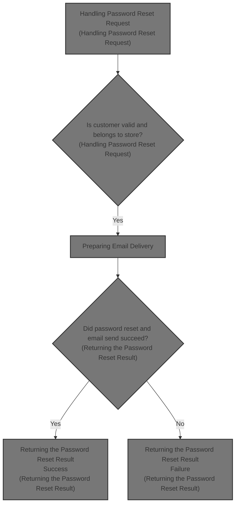
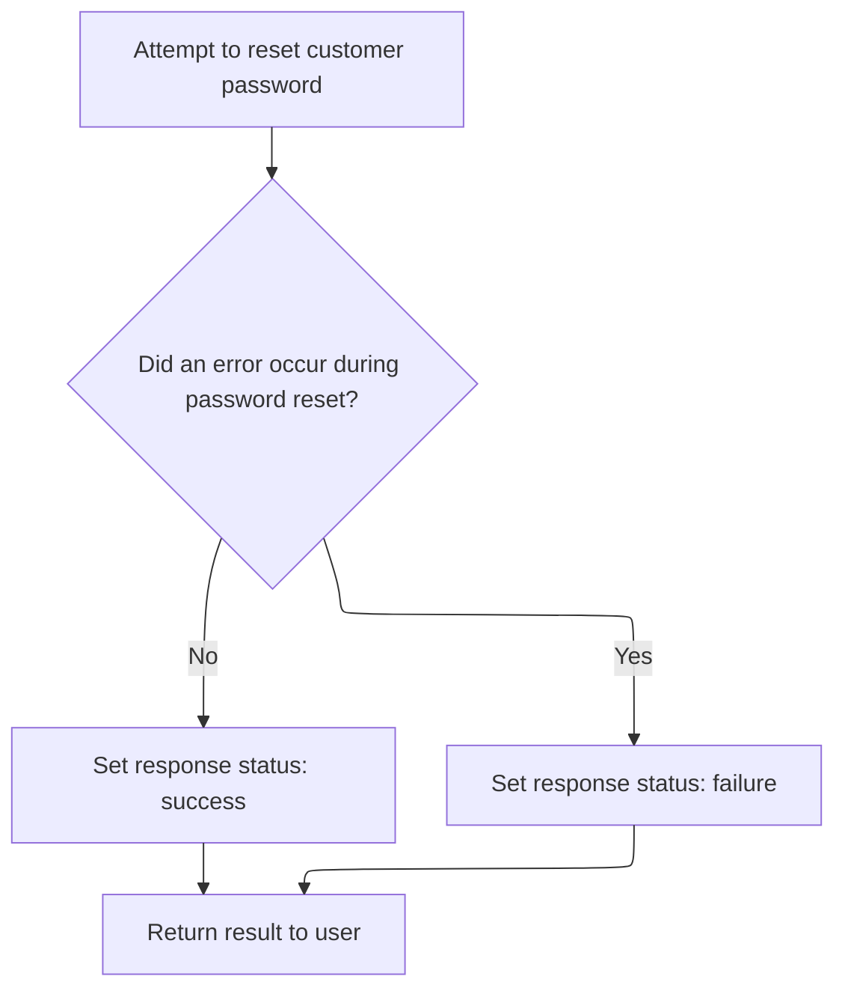

This document describes how an administrator can reset a customer's password and notify them by email. The flow starts with a password reset request, verifies the customer and store, generates and updates the password, prepares and sends an email notification, and returns the result of the operation.



# Handling Password Reset Request

<SwmSnippet path="/shopizer/sm-shop/src/main/java/com/salesmanager/web/admin/controller/customers/CustomerController.java" line="617">

---

In <SwmToken path="shopizer/sm-shop/src/main/java/com/salesmanager/web/admin/controller/customers/CustomerController.java" pos="617:3:3" line-data="	String resetPassword(HttpServletRequest request,HttpServletResponse response) {">`resetPassword`</SwmToken>, we grab the <SwmToken path="shopizer/sm-shop/src/main/java/com/salesmanager/web/admin/controller/customers/CustomerController.java" pos="619:3:3" line-data="		String customerId = request.getParameter(&quot;customerId&quot;);">`customerId`</SwmToken> from the request, assume it's valid, and fetch the store context from the request attributes. We then look up the customer, check if they belong to the current store, generate a new password, encode it, update the customer, and prep the email with the new password. The next step is to call <SwmToken path="shopizer/sm-core/src/main/java/com/salesmanager/core/business/system/service/EmailServiceImpl.java" pos="16:4:4" line-data="public class EmailServiceImpl implements EmailService {">`EmailServiceImpl`</SwmToken> to actually send the email notification to the customer, since that's the only way the user will get their new password. The function assumes both the <SwmToken path="shopizer/sm-shop/src/main/java/com/salesmanager/web/admin/controller/customers/CustomerController.java" pos="619:3:3" line-data="		String customerId = request.getParameter(&quot;customerId&quot;);">`customerId`</SwmToken> and store context are valid, which isn't obvious from the method signature.

```java
	String resetPassword(HttpServletRequest request,HttpServletResponse response) {
		
		String customerId = request.getParameter("customerId");
		
		MerchantStore store = (MerchantStore)request.getAttribute(Constants.ADMIN_STORE);
		AjaxResponse resp = new AjaxResponse();
		
		
		
		try {
			
			Long id = Long.parseLong(customerId);
			
			Customer customer = customerService.getById(id);
			
			if(customer==null) {
				resp.setErrorString("Customer does not exist");
				resp.setStatus(AjaxResponse.RESPONSE_STATUS_FAIURE);
				return resp.toJSONString();
			}
			
			if(customer.getMerchantStore().getId().intValue()!=store.getId().intValue()) {
				resp.setErrorString("Invalid customer id");
				resp.setStatus(AjaxResponse.RESPONSE_STATUS_FAIURE);
				return resp.toJSONString();
			}
			
			Language userLanguage = customer.getDefaultLanguage();
			
			Locale customerLocale = LocaleUtils.getLocale(userLanguage);
			
			String password = UserReset.generateRandomString();
			String encodedPassword = passwordEncoder.encodePassword(password, null);
			
			customer.setPassword(encodedPassword);
			
			customerService.saveOrUpdate(customer);
			
			//send email
			
			try {

				//creation of a user, send an email
				String[] storeEmail = {store.getStoreEmailAddress()};
				
				
				Map<String, String> templateTokens = EmailUtils.createEmailObjectsMap(request.getContextPath(), store, messages, customerLocale);
				templateTokens.put(EmailConstants.LABEL_HI, messages.getMessage("label.generic.hi", customerLocale));
		        templateTokens.put(EmailConstants.EMAIL_CUSTOMER_FIRSTNAME, customer.getBilling().getFirstName());
		        templateTokens.put(EmailConstants.EMAIL_CUSTOMER_LASTNAME, customer.getBilling().getLastName());
				templateTokens.put(EmailConstants.EMAIL_RESET_PASSWORD_TXT, messages.getMessage("email.customer.resetpassword.text", customerLocale));
				templateTokens.put(EmailConstants.EMAIL_CONTACT_OWNER, messages.getMessage("email.contactowner", storeEmail, customerLocale));
				templateTokens.put(EmailConstants.EMAIL_PASSWORD_LABEL, messages.getMessage("label.generic.password",customerLocale));
				templateTokens.put(EmailConstants.EMAIL_CUSTOMER_PASSWORD, password);


				Email email = new Email();
				email.setFrom(store.getStorename());
				email.setFromEmail(store.getStoreEmailAddress());
				email.setSubject(messages.getMessage("label.generic.changepassword",customerLocale));
				email.setTo(customer.getEmailAddress());
				email.setTemplateName(RESET_PASSWORD_TPL);
				email.setTemplateTokens(templateTokens);
	
	
				
				emailService.sendHtmlEmail(store, email);
				resp.setStatus(AjaxResponse.RESPONSE_STATUS_SUCCESS);
			
			} catch (Exception e) {
				LOGGER.error("Cannot send email to user",e);
				resp.setStatus(AjaxResponse.RESPONSE_STATUS_FAIURE);
			}
			
			
			
			
```

---

</SwmSnippet>

## Preparing Email Delivery

<SwmSnippet path="/shopizer/sm-core/src/main/java/com/salesmanager/core/business/system/service/EmailServiceImpl.java" line="25">

---

<SwmToken path="shopizer/sm-core/src/main/java/com/salesmanager/core/business/system/service/EmailServiceImpl.java" pos="25:5:5" line-data="	public void sendHtmlEmail(MerchantStore store, Email email) throws ServiceException, Exception {">`sendHtmlEmail`</SwmToken> loads the store's email config and sets it on the sender, then hands off the actual email sending to <SwmToken path="shopizer/sm-core/src/main/java/com/salesmanager/core/modules/email/HtmlEmailSenderImpl.java" pos="83:5:5" line-data="				freemarkerMailConfiguration.setClassForTemplateLoading(HtmlEmailSenderImpl.class, &quot;/&quot;);">`HtmlEmailSenderImpl`</SwmToken>. We need to call that next because that's where the email is actually built and sent out using the right SMTP settings.

```java
	public void sendHtmlEmail(MerchantStore store, Email email) throws ServiceException, Exception {

		EmailConfig emailConfig = getEmailConfiguration(store);
		
		sender.setEmailConfig(emailConfig);
		sender.send(email);
	}
```

---

</SwmSnippet>

## Building and Sending the Email

<SwmSnippet path="/shopizer/sm-core/src/main/java/com/salesmanager/core/modules/email/HtmlEmailSenderImpl.java" line="40">

---

In <SwmToken path="shopizer/sm-core/src/main/java/com/salesmanager/core/modules/email/HtmlEmailSenderImpl.java" pos="40:5:5" line-data="	public void send(Email email)">`send`</SwmToken>, we override the mail sender settings if there's a custom <SwmToken path="shopizer/sm-core/src/main/java/com/salesmanager/core/modules/email/HtmlEmailSenderImpl.java" pos="56:3:3" line-data="				if(emailConfig != null) {">`emailConfig`</SwmToken>, then load and process the email templates (plain text and HTML) using Freemarker. We build a multipart message with both versions. The next step is to call OrderServiceImpl, which is likely needed for some order-related context or hooks before finalizing the email send.

```java
	public void send(Email email)
			throws Exception {
		
		final String eml = email.getFrom();
		final String from = email.getFromEmail();
		final String to = email.getTo();
		final String subject = email.getSubject();
		final String tmpl = email.getTemplateName();
		final Map<String,String> templateTokens = email.getTemplateTokens();

		MimeMessagePreparator preparator = new MimeMessagePreparator() {
			public void prepare(MimeMessage mimeMessage)
					throws MessagingException, IOException {
				
				JavaMailSenderImpl impl = (JavaMailSenderImpl)mailSender;
				// if email configuration is present in Database, use the same
				if(emailConfig != null) {
					impl.setProtocol(emailConfig.getProtocol());
					impl.setHost(emailConfig.getHost());
					impl.setPort(Integer.parseInt(emailConfig.getPort()));
					impl.setUsername(emailConfig.getUsername());
					impl.setPassword(emailConfig.getPassword());
					
					Properties prop = new Properties();
					prop.put("mail.smtp.auth", emailConfig.isSmtpAuth());
					prop.put("mail.smtp.starttls.enable", emailConfig.isStarttls());
					impl.setJavaMailProperties(prop);
				}
				
				mimeMessage.setRecipient(Message.RecipientType.TO, new InternetAddress(to));

				InternetAddress inetAddress = new InternetAddress();

				inetAddress.setPersonal(eml);
				inetAddress.setAddress(from);

				mimeMessage.setFrom(inetAddress);
				mimeMessage.setSubject(subject);

				Multipart mp = new MimeMultipart("alternative");

				// Create a "text" Multipart message
				BodyPart textPart = new MimeBodyPart();
				freemarkerMailConfiguration.setClassForTemplateLoading(HtmlEmailSenderImpl.class, "/");
				Template textTemplate = freemarkerMailConfiguration.getTemplate(new StringBuilder(TEMPLATE_PATH).append("").append("/").append(tmpl).toString());
				final StringWriter textWriter = new StringWriter();
				try {
					textTemplate.process(templateTokens, textWriter);
				} catch (TemplateException e) {
					throw new MailPreparationException(
							"Can't generate text mail", e);
				}
				textPart.setDataHandler(new javax.activation.DataHandler(
						new javax.activation.DataSource() {
							public InputStream getInputStream()
									throws IOException {
								//return new StringBufferInputStream(textWriter
								//		.toString());
								return new ByteArrayInputStream(textWriter
										.toString().getBytes(CHARSET));
							}

							public OutputStream getOutputStream()
									throws IOException {
								throw new IOException("Read-only data");
							}

							public String getContentType() {
								return "text/plain";
							}

							public String getName() {
								return "main";
							}
						}));
				mp.addBodyPart(textPart);

				// Create a "HTML" Multipart message
				Multipart htmlContent = new MimeMultipart("related");
				BodyPart htmlPage = new MimeBodyPart();
				freemarkerMailConfiguration.setClassForTemplateLoading(HtmlEmailSenderImpl.class, "/");
				Template htmlTemplate = freemarkerMailConfiguration.getTemplate(new StringBuilder(TEMPLATE_PATH).append("").append("/").append(tmpl).toString());
				final StringWriter htmlWriter = new StringWriter();
				try {
					htmlTemplate.process(templateTokens, htmlWriter);
				} catch (TemplateException e) {
					throw new MailPreparationException(
							"Can't generate HTML mail", e);
				}
```

---

</SwmSnippet>

### Order-Related Email Hooks

See <SwmLink doc-title="Order Processing Flow">[Order Processing Flow](.swm%5Corder-processing-flow.qy1gnhau.sw.md)</SwmLink>

### Finalizing and Sending the Email

<SwmSnippet path="/shopizer/sm-core/src/main/java/com/salesmanager/core/modules/email/HtmlEmailSenderImpl.java" line="129">

---

Back in `HtmlEmailSenderImpl.send`, we add the HTML part to the multipart message and send it, so both plain text and HTML go out together.

```java
				htmlPage.setDataHandler(new javax.activation.DataHandler(
						new javax.activation.DataSource() {
							public InputStream getInputStream()
									throws IOException {
								//return new StringBufferInputStream(htmlWriter
								//		.toString());
								return new ByteArrayInputStream(textWriter
										.toString().getBytes(CHARSET));
							}

							public OutputStream getOutputStream()
									throws IOException {
								throw new IOException("Read-only data");
							}

							public String getContentType() {
								return "text/html";
							}

							public String getName() {
								return "main";
							}
						}));
				htmlContent.addBodyPart(htmlPage);
				BodyPart htmlPart = new MimeBodyPart();
				htmlPart.setContent(htmlContent);
				mp.addBodyPart(htmlPart);

				mimeMessage.setContent(mp);

				// if(attachment!=null) {
				// MimeMessageHelper messageHelper = new
				// MimeMessageHelper(mimeMessage, true);
				// messageHelper.addAttachment(attachmentFileName, attachment);
				// }

			}
		};

		mailSender.send(preparator);
	}
```

---

</SwmSnippet>

## Returning the Password Reset Result



<SwmSnippet path="/shopizer/sm-shop/src/main/java/com/salesmanager/web/admin/controller/customers/CustomerController.java" line="694">

---

Back in <SwmToken path="shopizer/sm-shop/src/main/java/com/salesmanager/web/admin/controller/customers/CustomerController.java" pos="617:3:3" line-data="	String resetPassword(HttpServletRequest request,HttpServletResponse response) {">`resetPassword`</SwmToken>, after returning from <SwmToken path="shopizer/sm-core/src/main/java/com/salesmanager/core/business/system/service/EmailServiceImpl.java" pos="16:4:4" line-data="public class EmailServiceImpl implements EmailService {">`EmailServiceImpl`</SwmToken>, we handle any exceptions, set the response status, and return the result as JSON. If the email send failed, the client gets a failure response; otherwise, it's a success.

```java
		} catch (Exception e) {
			LOGGER.error("An exception occured while changing password",e);
			resp.setStatus(AjaxResponse.RESPONSE_STATUS_FAIURE);
		}
		
		
		return resp.toJSONString();
		
		
	}
```

---

</SwmSnippet>

&nbsp;

*This is an auto-generated document by Swimm 🌊 and has not yet been verified by a human*

<SwmMeta version="3.0.0" repo-id="Z2l0aHViJTNBJTNBU2hvcGl6ZXIlM0ElM0F1bWFsaW5nYXN3YW1p" repo-name="Shopizer"><sup>Powered by [Swimm](https://app.swimm.io/)</sup></SwmMeta>
