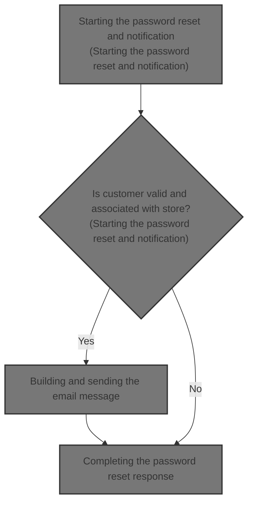
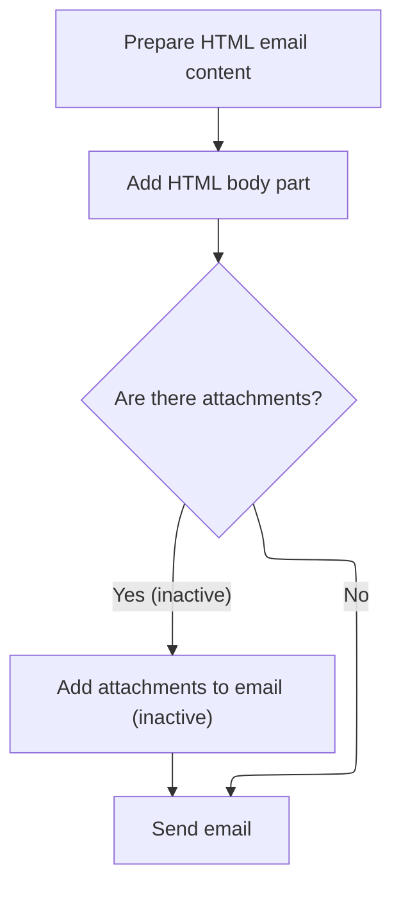
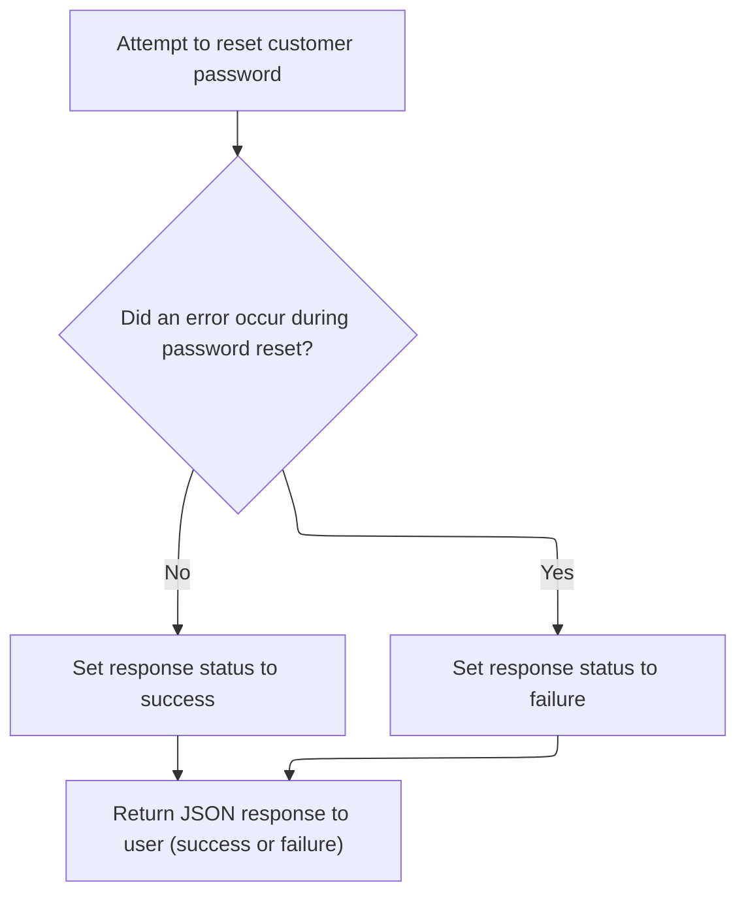

This document describes how administrators can reset a customer's password and automatically notify the customer by email. The flow starts with an administrator's request, verifies the customer's identity and store association, generates and updates the password, and sends an email notification to the customer. The administrator receives a success or failure response.



# Starting the password reset and notification

<SwmSnippet path="/shopizer/sm-shop/src/main/java/com/salesmanager/web/admin/controller/customers/CustomerController.java" line="617">

---

In <SwmToken path="shopizer/sm-shop/src/main/java/com/salesmanager/web/admin/controller/customers/CustomerController.java" pos="617:3:3" line-data="	String resetPassword(HttpServletRequest request,HttpServletResponse response) {">`resetPassword`</SwmToken>, we grab the <SwmToken path="shopizer/sm-shop/src/main/java/com/salesmanager/web/admin/controller/customers/CustomerController.java" pos="619:3:3" line-data="		String customerId = request.getParameter(&quot;customerId&quot;);">`customerId`</SwmToken> from the request, check that the customer exists and belongs to the store, generate and encode a new password, update the customer, and build the email template tokens. We need to call <SwmToken path="shopizer/sm-core/src/main/java/com/salesmanager/core/business/system/service/EmailServiceImpl.java" pos="16:4:4" line-data="public class EmailServiceImpl implements EmailService {">`EmailServiceImpl`</SwmToken> next to actually send the reset password email to the customer using these tokens and the generated password.

```java
	String resetPassword(HttpServletRequest request,HttpServletResponse response) {
		
		String customerId = request.getParameter("customerId");
		
		MerchantStore store = (MerchantStore)request.getAttribute(Constants.ADMIN_STORE);
		AjaxResponse resp = new AjaxResponse();
		
		
		
		try {
			
			Long id = Long.parseLong(customerId);
			
			Customer customer = customerService.getById(id);
			
			if(customer==null) {
				resp.setErrorString("Customer does not exist");
				resp.setStatus(AjaxResponse.RESPONSE_STATUS_FAIURE);
				return resp.toJSONString();
			}
			
			if(customer.getMerchantStore().getId().intValue()!=store.getId().intValue()) {
				resp.setErrorString("Invalid customer id");
				resp.setStatus(AjaxResponse.RESPONSE_STATUS_FAIURE);
				return resp.toJSONString();
			}
			
			Language userLanguage = customer.getDefaultLanguage();
			
			Locale customerLocale = LocaleUtils.getLocale(userLanguage);
			
			String password = UserReset.generateRandomString();
			String encodedPassword = passwordEncoder.encodePassword(password, null);
			
			customer.setPassword(encodedPassword);
			
			customerService.saveOrUpdate(customer);
			
			//send email
			
			try {

				//creation of a user, send an email
				String[] storeEmail = {store.getStoreEmailAddress()};
				
				
				Map<String, String> templateTokens = EmailUtils.createEmailObjectsMap(request.getContextPath(), store, messages, customerLocale);
				templateTokens.put(EmailConstants.LABEL_HI, messages.getMessage("label.generic.hi", customerLocale));
		        templateTokens.put(EmailConstants.EMAIL_CUSTOMER_FIRSTNAME, customer.getBilling().getFirstName());
		        templateTokens.put(EmailConstants.EMAIL_CUSTOMER_LASTNAME, customer.getBilling().getLastName());
				templateTokens.put(EmailConstants.EMAIL_RESET_PASSWORD_TXT, messages.getMessage("email.customer.resetpassword.text", customerLocale));
				templateTokens.put(EmailConstants.EMAIL_CONTACT_OWNER, messages.getMessage("email.contactowner", storeEmail, customerLocale));
				templateTokens.put(EmailConstants.EMAIL_PASSWORD_LABEL, messages.getMessage("label.generic.password",customerLocale));
				templateTokens.put(EmailConstants.EMAIL_CUSTOMER_PASSWORD, password);


				Email email = new Email();
				email.setFrom(store.getStorename());
				email.setFromEmail(store.getStoreEmailAddress());
				email.setSubject(messages.getMessage("label.generic.changepassword",customerLocale));
				email.setTo(customer.getEmailAddress());
				email.setTemplateName(RESET_PASSWORD_TPL);
				email.setTemplateTokens(templateTokens);
	
	
				
				emailService.sendHtmlEmail(store, email);
				resp.setStatus(AjaxResponse.RESPONSE_STATUS_SUCCESS);
			
			} catch (Exception e) {
				LOGGER.error("Cannot send email to user",e);
				resp.setStatus(AjaxResponse.RESPONSE_STATUS_FAIURE);
			}
			
			
			
			
```

---

</SwmSnippet>

## Configuring and dispatching the email

<SwmSnippet path="/shopizer/sm-core/src/main/java/com/salesmanager/core/business/system/service/EmailServiceImpl.java" line="25">

---

<SwmToken path="shopizer/sm-core/src/main/java/com/salesmanager/core/business/system/service/EmailServiceImpl.java" pos="25:5:5" line-data="	public void sendHtmlEmail(MerchantStore store, Email email) throws ServiceException, Exception {">`sendHtmlEmail`</SwmToken> loads the store's email config, sets it on the sender, and hands off the Email object. We call <SwmToken path="shopizer/sm-core/src/main/java/com/salesmanager/core/modules/email/HtmlEmailSenderImpl.java" pos="83:5:5" line-data="				freemarkerMailConfiguration.setClassForTemplateLoading(HtmlEmailSenderImpl.class, &quot;/&quot;);">`HtmlEmailSenderImpl`</SwmToken> next because that's where the actual email formatting and sending happens.

```java
	public void sendHtmlEmail(MerchantStore store, Email email) throws ServiceException, Exception {

		EmailConfig emailConfig = getEmailConfiguration(store);
		
		sender.setEmailConfig(emailConfig);
		sender.send(email);
	}
```

---

</SwmSnippet>

## Building and sending the email message

<SwmSnippet path="/shopizer/sm-core/src/main/java/com/salesmanager/core/modules/email/HtmlEmailSenderImpl.java" line="40">

---

In <SwmToken path="shopizer/sm-core/src/main/java/com/salesmanager/core/modules/email/HtmlEmailSenderImpl.java" pos="40:5:5" line-data="	public void send(Email email)">`send`</SwmToken>, we prep the email addresses, subject, and template tokens, then build both text and HTML versions of the email using Freemarker. We need to call OrderServiceImpl next if the email content or process depends on order data, like for transactional emails.

```java
	public void send(Email email)
			throws Exception {
		
		final String eml = email.getFrom();
		final String from = email.getFromEmail();
		final String to = email.getTo();
		final String subject = email.getSubject();
		final String tmpl = email.getTemplateName();
		final Map<String,String> templateTokens = email.getTemplateTokens();

		MimeMessagePreparator preparator = new MimeMessagePreparator() {
			public void prepare(MimeMessage mimeMessage)
					throws MessagingException, IOException {
				
				JavaMailSenderImpl impl = (JavaMailSenderImpl)mailSender;
				// if email configuration is present in Database, use the same
				if(emailConfig != null) {
					impl.setProtocol(emailConfig.getProtocol());
					impl.setHost(emailConfig.getHost());
					impl.setPort(Integer.parseInt(emailConfig.getPort()));
					impl.setUsername(emailConfig.getUsername());
					impl.setPassword(emailConfig.getPassword());
					
					Properties prop = new Properties();
					prop.put("mail.smtp.auth", emailConfig.isSmtpAuth());
					prop.put("mail.smtp.starttls.enable", emailConfig.isStarttls());
					impl.setJavaMailProperties(prop);
				}
				
				mimeMessage.setRecipient(Message.RecipientType.TO, new InternetAddress(to));

				InternetAddress inetAddress = new InternetAddress();

				inetAddress.setPersonal(eml);
				inetAddress.setAddress(from);

				mimeMessage.setFrom(inetAddress);
				mimeMessage.setSubject(subject);

				Multipart mp = new MimeMultipart("alternative");

				// Create a "text" Multipart message
				BodyPart textPart = new MimeBodyPart();
				freemarkerMailConfiguration.setClassForTemplateLoading(HtmlEmailSenderImpl.class, "/");
				Template textTemplate = freemarkerMailConfiguration.getTemplate(new StringBuilder(TEMPLATE_PATH).append("").append("/").append(tmpl).toString());
				final StringWriter textWriter = new StringWriter();
				try {
					textTemplate.process(templateTokens, textWriter);
				} catch (TemplateException e) {
					throw new MailPreparationException(
							"Can't generate text mail", e);
				}
				textPart.setDataHandler(new javax.activation.DataHandler(
						new javax.activation.DataSource() {
							public InputStream getInputStream()
									throws IOException {
								//return new StringBufferInputStream(textWriter
								//		.toString());
								return new ByteArrayInputStream(textWriter
										.toString().getBytes(CHARSET));
							}

							public OutputStream getOutputStream()
									throws IOException {
								throw new IOException("Read-only data");
							}

							public String getContentType() {
								return "text/plain";
							}

							public String getName() {
								return "main";
							}
						}));
				mp.addBodyPart(textPart);

				// Create a "HTML" Multipart message
				Multipart htmlContent = new MimeMultipart("related");
				BodyPart htmlPage = new MimeBodyPart();
				freemarkerMailConfiguration.setClassForTemplateLoading(HtmlEmailSenderImpl.class, "/");
				Template htmlTemplate = freemarkerMailConfiguration.getTemplate(new StringBuilder(TEMPLATE_PATH).append("").append("/").append(tmpl).toString());
				final StringWriter htmlWriter = new StringWriter();
				try {
					htmlTemplate.process(templateTokens, htmlWriter);
				} catch (TemplateException e) {
					throw new MailPreparationException(
							"Can't generate HTML mail", e);
				}
```

---

</SwmSnippet>

### Processing order-related email logic

See <SwmLink doc-title="Order Processing Flow">[Order Processing Flow](.swm%5Corder-processing-flow.59tn4o99.sw.md)</SwmLink>

### Finalizing and sending the composed email



<SwmSnippet path="/shopizer/sm-core/src/main/java/com/salesmanager/core/modules/email/HtmlEmailSenderImpl.java" line="129">

---

Back in `HtmlEmailSenderImpl.send`, after getting any needed order info, we finish building the HTML part, add it to the multipart message, and send it out with <SwmToken path="shopizer/sm-core/src/main/java/com/salesmanager/core/modules/email/HtmlEmailSenderImpl.java" pos="168:1:1" line-data="		mailSender.send(preparator);">`mailSender`</SwmToken>.

```java
				htmlPage.setDataHandler(new javax.activation.DataHandler(
						new javax.activation.DataSource() {
							public InputStream getInputStream()
									throws IOException {
								//return new StringBufferInputStream(htmlWriter
								//		.toString());
								return new ByteArrayInputStream(textWriter
										.toString().getBytes(CHARSET));
							}

							public OutputStream getOutputStream()
									throws IOException {
								throw new IOException("Read-only data");
							}

							public String getContentType() {
								return "text/html";
							}

							public String getName() {
								return "main";
							}
						}));
				htmlContent.addBodyPart(htmlPage);
				BodyPart htmlPart = new MimeBodyPart();
				htmlPart.setContent(htmlContent);
				mp.addBodyPart(htmlPart);

				mimeMessage.setContent(mp);

				// if(attachment!=null) {
				// MimeMessageHelper messageHelper = new
				// MimeMessageHelper(mimeMessage, true);
				// messageHelper.addAttachment(attachmentFileName, attachment);
				// }

			}
		};

		mailSender.send(preparator);
	}
```

---

</SwmSnippet>

## Completing the password reset response



<SwmSnippet path="/shopizer/sm-shop/src/main/java/com/salesmanager/web/admin/controller/customers/CustomerController.java" line="694">

---

Back in <SwmToken path="shopizer/sm-shop/src/main/java/com/salesmanager/web/admin/controller/customers/CustomerController.java" pos="617:3:3" line-data="	String resetPassword(HttpServletRequest request,HttpServletResponse response) {">`resetPassword`</SwmToken>, after sending the email via <SwmToken path="shopizer/sm-core/src/main/java/com/salesmanager/core/business/system/service/EmailServiceImpl.java" pos="16:4:4" line-data="public class EmailServiceImpl implements EmailService {">`EmailServiceImpl`</SwmToken>, we catch any exceptions, set the <SwmToken path="shopizer/sm-shop/src/main/java/com/salesmanager/web/admin/controller/customers/CustomerController.java" pos="696:5:5" line-data="			resp.setStatus(AjaxResponse.RESPONSE_STATUS_FAIURE);">`AjaxResponse`</SwmToken> status, and return the result as JSON to the client.

```java
		} catch (Exception e) {
			LOGGER.error("An exception occured while changing password",e);
			resp.setStatus(AjaxResponse.RESPONSE_STATUS_FAIURE);
		}
		
		
		return resp.toJSONString();
		
		
	}
```

---

</SwmSnippet>

&nbsp;

*This is an auto-generated document by Swimm 🌊 and has not yet been verified by a human*

<SwmMeta version="3.0.0" repo-id="Z2l0aHViJTNBJTNBU2hvcGl6ZXIlM0ElM0F1bWFsaW5nYXN3YW1p" repo-name="Shopizer"><sup>Powered by [Swimm](https://app.swimm.io/)</sup></SwmMeta>
