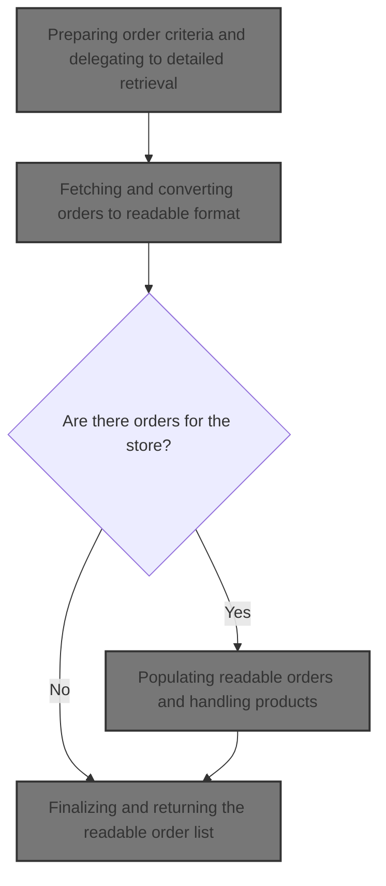
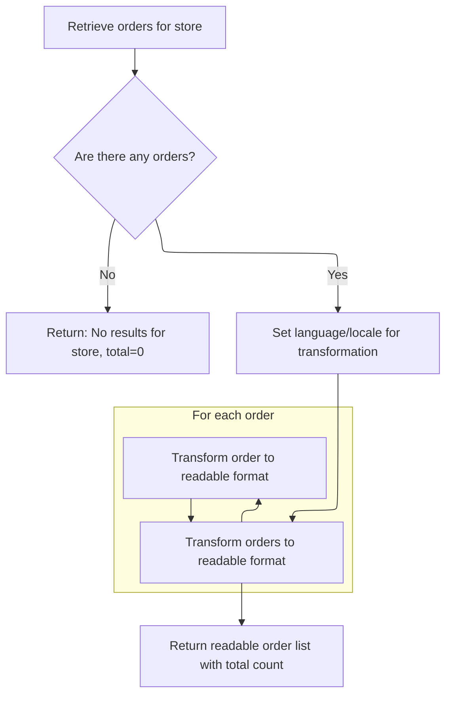

This document describes how a merchant can obtain a paginated and localized list of their orders, each enriched with detailed product information. The process ensures that only relevant orders are included, and that all order and product details are presented in the requested language.



# Preparing order criteria and delegating to detailed retrieval

This section is responsible for preparing the criteria for order retrieval based on input parameters and delegating the actual retrieval to a centralized method, ensuring consistency and simplicity for callers.

| Category        | Rule Name              | Description                                                                                                                                                                                                                                                                                                                                                                    |
| --------------- | ---------------------- | ------------------------------------------------------------------------------------------------------------------------------------------------------------------------------------------------------------------------------------------------------------------------------------------------------------------------------------------------------------------------------ |
| Data validation | Input validation       | If the input parameters are invalid (e.g., negative start index or <SwmToken path="shopizer/sm-shop/src/main/java/com/salesmanager/web/shop/controller/order/facade/OrderFacadeImpl.java" pos="891:8:8" line-data="			int start, int maxCount, Language language) throws Exception {">`maxCount`</SwmToken>), the system must reject the request and not attempt order retrieval. |
| Business logic  | Merchant store scoping | Only orders belonging to the specified merchant store are included in the output list.                                                                                                                                                                                                                                                                                         |
| Business logic  | Pagination enforcement | The output list must start from the index specified by the 'start' parameter and include up to <SwmToken path="shopizer/sm-shop/src/main/java/com/salesmanager/web/shop/controller/order/facade/OrderFacadeImpl.java" pos="891:8:8" line-data="			int start, int maxCount, Language language) throws Exception {">`maxCount`</SwmToken> orders.                                   |
| Business logic  | Order localization     | The language parameter determines the localization of order details in the output list.                                                                                                                                                                                                                                                                                        |

<SwmSnippet path="/shopizer/sm-shop/src/main/java/com/salesmanager/web/shop/controller/order/facade/OrderFacadeImpl.java" line="890">

---

<SwmToken path="shopizer/sm-shop/src/main/java/com/salesmanager/web/shop/controller/order/facade/OrderFacadeImpl.java" pos="890:5:5" line-data="	public ReadableOrderList getReadableOrderList(MerchantStore store,">`getReadableOrderList`</SwmToken> starts the flow by wrapping the input parameters into an <SwmToken path="shopizer/sm-shop/src/main/java/com/salesmanager/web/shop/controller/order/facade/OrderFacadeImpl.java" pos="893:1:1" line-data="		OrderCriteria criteria = new OrderCriteria();">`OrderCriteria`</SwmToken> object and then immediately delegates to the overloaded method that does the actual work. This keeps the interface simple for callers and centralizes the logic for retrieving readable orders.

```java
	public ReadableOrderList getReadableOrderList(MerchantStore store,
			int start, int maxCount, Language language) throws Exception {
		
		OrderCriteria criteria = new OrderCriteria();
		criteria.setStartIndex(start);
		criteria.setMaxCount(maxCount);

		return this.getReadableOrderList(criteria, store, language);
	}
```

---

</SwmSnippet>

# Fetching and converting orders to readable format



This section is responsible for fetching orders for a store, converting them into a user-friendly format, and handling cases where no orders are found. It ensures that the returned data is localized and includes a total count of orders.

| Category        | Rule Name                         | Description                                                                                                                        |
| --------------- | --------------------------------- | ---------------------------------------------------------------------------------------------------------------------------------- |
| Data validation | Accurate order count              | The total count of orders returned must reflect the actual number of orders found for the store and criteria.                      |
| Data validation | Locale enforcement                | The system must always use the language and locale specified in the request to format and present order information.               |
| Business logic  | Order localization and conversion | For each order retrieved, the system must convert the order into a readable format using the store's locale and language settings. |

<SwmSnippet path="/shopizer/sm-shop/src/main/java/com/salesmanager/web/shop/controller/order/facade/OrderFacadeImpl.java" line="858">

---

We grab the orders, convert them, and bail out with null if nothing's found.

```java
    private ReadableOrderList getReadableOrderList(OrderCriteria criteria, MerchantStore store, Language language) throws Exception {
		
		OrderList orderList = orderService.listByStore(store, criteria);
		
		ReadableOrderPopulator orderPopulator = new ReadableOrderPopulator();
		Locale locale = LocaleUtils.getLocale(language);
		orderPopulator.setLocale(locale);
		
		List<Order> orders = orderList.getOrders();
		ReadableOrderList returnList = new ReadableOrderList();
		
		if(CollectionUtils.isEmpty(orders)) {
			returnList.setTotal(0);
			returnList.setMessage("No results for store code " + store);
			return null;
		}

		List<ReadableOrder> readableOrders = new ArrayList<ReadableOrder>();
		for (Order order : orders) {
			ReadableOrder readableOrder = new ReadableOrder();
			orderPopulator.populate(order,readableOrder,store,language);
			readableOrders.add(readableOrder);
			
		}
```

---

</SwmSnippet>

<SwmSnippet path="/shopizer/sm-shop/src/main/java/com/salesmanager/web/shop/controller/order/facade/OrderFacadeImpl.java" line="883">

---

After building up the readable orders and setting the total, we don't actually return the constructed list. Instead, we call <SwmToken path="shopizer/sm-shop/src/main/java/com/salesmanager/web/shop/controller/order/facade/OrderFacadeImpl.java" pos="884:5:5" line-data="		return this.populateOrderList(orderList, store, language);">`populateOrderList`</SwmToken>, which takes over and may add more details or handle extra logic.

```java
		returnList.setTotal(orderList.getTotalCount());
		return this.populateOrderList(orderList, store, language);
    	
    	
	}
```

---

</SwmSnippet>

# Populating readable orders and handling products

This section is responsible for converting internal order representations into user-friendly readable orders, ensuring that each order includes its associated products and relevant metadata for presentation or business logic.

| Category       | Rule Name                       | Description                                                                                                                                |
| -------------- | ------------------------------- | ------------------------------------------------------------------------------------------------------------------------------------------ |
| Business logic | Order conversion and enrichment | Each order in the input list must be converted into a readable order, including all relevant order details and associated products.        |
| Business logic | Locale-based order formatting   | The locale for order conversion must be set based on the provided language to ensure correct formatting and localization of order details. |

<SwmSnippet path="/shopizer/sm-shop/src/main/java/com/salesmanager/web/shop/controller/order/facade/OrderFacadeImpl.java" line="798">

---

We convert orders and then fill in their products.

```java
     private ReadableOrderList populateOrderList(final OrderList orderList,final MerchantStore store, final Language language){
        List<Order> orders = orderList.getOrders();
        ReadableOrderList returnList = new ReadableOrderList();
        if(CollectionUtils.isEmpty( orders)){
            LOGGER.info( "Order list if empty..Returning empty list" );
            returnList.setTotal(0);
            returnList.setMessage("No results for store code " + store);
            return null;
        }
        
        ReadableOrderPopulator orderPopulator = new ReadableOrderPopulator();
        Locale locale = LocaleUtils.getLocale(language);
        orderPopulator.setLocale(locale);
        
        List<ReadableOrder> readableOrders = new ArrayList<ReadableOrder>();
        for (Order order : orders) {
            ReadableOrder readableOrder = new ReadableOrder();
            try
            {
                orderPopulator.populate(order,readableOrder,store,language);
                setOrderProductList(order,locale,store,language,readableOrder);
            }
            catch ( ConversionException ex )
            {
                LOGGER.error( "Error while converting order to order data", ex );
                
            }
            readableOrders.add(readableOrder);
            
        }
        
```

---

</SwmSnippet>

## Populating readable order products

This section is responsible for converting each product in an order into a readable format, ensuring that product details are properly localized and enriched for presentation to end users or API consumers.

| Category        | Rule Name                   | Description                                                                                            |
| --------------- | --------------------------- | ------------------------------------------------------------------------------------------------------ |
| Data validation | Complete product inclusion  | All products in the order must be included in the output list, with no omissions.                      |
| Business logic  | Readable product conversion | Each product in the order must be converted into a readable DTO before being added to the output list. |
| Business logic  | Product localization        | Product details in the readable DTO must be localized according to the provided locale and language.   |

<SwmSnippet path="/shopizer/sm-shop/src/main/java/com/salesmanager/web/shop/controller/order/facade/OrderFacadeImpl.java" line="835">

---

In <SwmToken path="shopizer/sm-shop/src/main/java/com/salesmanager/web/shop/controller/order/facade/OrderFacadeImpl.java" pos="835:5:5" line-data="    private void setOrderProductList(final Order order, final Locale locale,final MerchantStore store, final Language language , final ReadableOrder readableOrder) throws ConversionException{">`setOrderProductList`</SwmToken>, we loop through each product in the order and use <SwmToken path="shopizer/sm-shop/src/main/java/com/salesmanager/web/shop/controller/order/facade/OrderFacadeImpl.java" pos="838:1:1" line-data="            ReadableOrderProductPopulator orderProductPopulator = new ReadableOrderProductPopulator();">`ReadableOrderProductPopulator`</SwmToken> to convert it to a readable DTO, prepping it for display or API output. Next, we call the populator's populate method to handle the actual conversion.

```java
    private void setOrderProductList(final Order order, final Locale locale,final MerchantStore store, final Language language , final ReadableOrder readableOrder) throws ConversionException{
        List<ReadableOrderProduct> orderProducts = new ArrayList<ReadableOrderProduct>();
        for(OrderProduct p : order.getOrderProducts()) {
            ReadableOrderProductPopulator orderProductPopulator = new ReadableOrderProductPopulator();
            orderProductPopulator.setLocale(locale);
            orderProductPopulator.setProductService(productService);
            orderProductPopulator.setPricingService(pricingService);
            ReadableOrderProduct orderProduct = new ReadableOrderProduct();
            orderProductPopulator.populate(p, orderProduct, store, language);
            
            //image
            
            //attributes
            


            orderProducts.add(orderProduct);
        }
        
```

---

</SwmSnippet>

### Converting order products and validating ownership

```mermaid
%%{init: {"flowchart": {"defaultRenderer": "elk"}} }%%
flowchart TD
    node1["Start: Transform cart item to order product"]
    click node1 openCode "shopizer/sm-shop/src/main/java/com/salesmanager/web/populator/order/OrderProductPopulator.java:60:62"
    node1 --> node2{"Is product found?"}
    click node2 openCode "shopizer/sm-shop/src/main/java/com/salesmanager/web/populator/order/OrderProductPopulator.java:69:72"
    node2 -->|"Yes"| node3{"Does product belong to store?"}
    click node3 openCode "shopizer/sm-shop/src/main/java/com/salesmanager/web/populator/order/OrderProductPopulator.java:74:76"
    node2 -->|"No"| nodeEnd["Error: Product not found"]
    click nodeEnd openCode "shopizer/sm-shop/src/main/java/com/salesmanager/web/populator/order/OrderProductPopulator.java:71:72"
    node3 -->|"Yes"| node4{"Is product digital?"}
    click node4 openCode "shopizer/sm-shop/src/main/java/com/salesmanager/web/populator/order/OrderProductPopulator.java:78:80"
    node3 -->|"No"| nodeEnd2["Error: Product not valid for store"]
    click nodeEnd2 openCode "shopizer/sm-shop/src/main/java/com/salesmanager/web/populator/order/OrderProductPopulator.java:75:76"
    node4 -->|"Yes"| node5["Add download to order"]
    click node5 openCode "shopizer/sm-shop/src/main/java/com/salesmanager/web/populator/order/OrderProductPopulator.java:81:87"
    node4 -->|"No"| node7["Set product details and main price"]
    node5 --> node7
    click node7 openCode "shopizer/sm-shop/src/main/java/com/salesmanager/web/populator/order/OrderProductPopulator.java:89:103"
    node7 --> node8{"Are there additional prices?"}
    click node8 openCode "shopizer/sm-shop/src/main/java/com/salesmanager/web/populator/order/OrderProductPopulator.java:106:107"
    node8 -->|"Yes"| loop1
    node8 -->|"No"| node11{"Are there attribute items?"}
    subgraph loop1["For each additional price"]
      node10["Add additional price to order"]
      click node10 openCode "shopizer/sm-shop/src/main/java/com/salesmanager/web/populator/order/OrderProductPopulator.java:108:112"
    end
    loop1 --> node11
    node11 -->|"Yes"| loop2
    node11 -->|"No"| node12["Return order product"]
    click node12 openCode "shopizer/sm-shop/src/main/java/com/salesmanager/web/populator/order/OrderProductPopulator.java:143:152"
    subgraph loop2["For each product attribute"]
      node13{"Is attribute valid and belongs to store?"}
      click node13 openCode "shopizer/sm-shop/src/main/java/com/salesmanager/web/populator/order/OrderProductPopulator.java:125:132"
      node13 -->|"Yes"| node14["Add attribute to order"]
      click node14 openCode "shopizer/sm-shop/src/main/java/com/salesmanager/web/populator/order/OrderProductPopulator.java:134:141"
      node13 -->|"No"| nodeEnd3["Error: Attribute not valid"]
      click nodeEnd3 openCode "shopizer/sm-shop/src/main/java/com/salesmanager/web/populator/order/OrderProductPopulator.java:127:132"
    end
    loop2 --> node12

classDef HeadingStyle fill:#777777,stroke:#333,stroke-width:2px;

%% Swimm:
%% %%{init: {"flowchart": {"defaultRenderer": "elk"}} }%%
%% flowchart TD
%%     node1["Start: Transform cart item to order product"]
%%     click node1 openCode "<SwmPath>[shopizer/…/order/OrderProductPopulator.java](shopizer/sm-shop/src/main/java/com/salesmanager/web/populator/order/OrderProductPopulator.java)</SwmPath>:60:62"
%%     node1 --> node2{"Is product found?"}
%%     click node2 openCode "<SwmPath>[shopizer/…/order/OrderProductPopulator.java](shopizer/sm-shop/src/main/java/com/salesmanager/web/populator/order/OrderProductPopulator.java)</SwmPath>:69:72"
%%     node2 -->|"Yes"| node3{"Does product belong to store?"}
%%     click node3 openCode "<SwmPath>[shopizer/…/order/OrderProductPopulator.java](shopizer/sm-shop/src/main/java/com/salesmanager/web/populator/order/OrderProductPopulator.java)</SwmPath>:74:76"
%%     node2 -->|"No"| nodeEnd["Error: Product not found"]
%%     click nodeEnd openCode "<SwmPath>[shopizer/…/order/OrderProductPopulator.java](shopizer/sm-shop/src/main/java/com/salesmanager/web/populator/order/OrderProductPopulator.java)</SwmPath>:71:72"
%%     node3 -->|"Yes"| node4{"Is product digital?"}
%%     click node4 openCode "<SwmPath>[shopizer/…/order/OrderProductPopulator.java](shopizer/sm-shop/src/main/java/com/salesmanager/web/populator/order/OrderProductPopulator.java)</SwmPath>:78:80"
%%     node3 -->|"No"| nodeEnd2["Error: Product not valid for store"]
%%     click nodeEnd2 openCode "<SwmPath>[shopizer/…/order/OrderProductPopulator.java](shopizer/sm-shop/src/main/java/com/salesmanager/web/populator/order/OrderProductPopulator.java)</SwmPath>:75:76"
%%     node4 -->|"Yes"| node5["Add download to order"]
%%     click node5 openCode "<SwmPath>[shopizer/…/order/OrderProductPopulator.java](shopizer/sm-shop/src/main/java/com/salesmanager/web/populator/order/OrderProductPopulator.java)</SwmPath>:81:87"
%%     node4 -->|"No"| node7["Set product details and main price"]
%%     node5 --> node7
%%     click node7 openCode "<SwmPath>[shopizer/…/order/OrderProductPopulator.java](shopizer/sm-shop/src/main/java/com/salesmanager/web/populator/order/OrderProductPopulator.java)</SwmPath>:89:103"
%%     node7 --> node8{"Are there additional prices?"}
%%     click node8 openCode "<SwmPath>[shopizer/…/order/OrderProductPopulator.java](shopizer/sm-shop/src/main/java/com/salesmanager/web/populator/order/OrderProductPopulator.java)</SwmPath>:106:107"
%%     node8 -->|"Yes"| loop1
%%     node8 -->|"No"| node11{"Are there attribute items?"}
%%     subgraph loop1["For each additional price"]
%%       node10["Add additional price to order"]
%%       click node10 openCode "<SwmPath>[shopizer/…/order/OrderProductPopulator.java](shopizer/sm-shop/src/main/java/com/salesmanager/web/populator/order/OrderProductPopulator.java)</SwmPath>:108:112"
%%     end
%%     loop1 --> node11
%%     node11 -->|"Yes"| loop2
%%     node11 -->|"No"| node12["Return order product"]
%%     click node12 openCode "<SwmPath>[shopizer/…/order/OrderProductPopulator.java](shopizer/sm-shop/src/main/java/com/salesmanager/web/populator/order/OrderProductPopulator.java)</SwmPath>:143:152"
%%     subgraph loop2["For each product attribute"]
%%       node13{"Is attribute valid and belongs to store?"}
%%       click node13 openCode "<SwmPath>[shopizer/…/order/OrderProductPopulator.java](shopizer/sm-shop/src/main/java/com/salesmanager/web/populator/order/OrderProductPopulator.java)</SwmPath>:125:132"
%%       node13 -->|"Yes"| node14["Add attribute to order"]
%%       click node14 openCode "<SwmPath>[shopizer/…/order/OrderProductPopulator.java](shopizer/sm-shop/src/main/java/com/salesmanager/web/populator/order/OrderProductPopulator.java)</SwmPath>:134:141"
%%       node13 -->|"No"| nodeEnd3["Error: Attribute not valid"]
%%       click nodeEnd3 openCode "<SwmPath>[shopizer/…/order/OrderProductPopulator.java](shopizer/sm-shop/src/main/java/com/salesmanager/web/populator/order/OrderProductPopulator.java)</SwmPath>:127:132"
%%     end
%%     loop2 --> node12
%% 
%% classDef HeadingStyle fill:#777777,stroke:#333,stroke-width:2px;
```



This section governs the conversion of a shopping cart item into an order product, ensuring that only valid products and attributes belonging to the current store are included, and that all relevant pricing and digital download information is correctly set up.

| Category        | Rule Name                           | Description                                                                                                                                                                    |
| --------------- | ----------------------------------- | ------------------------------------------------------------------------------------------------------------------------------------------------------------------------------ |
| Data validation | Product existence validation        | If the product referenced by the cart item does not exist, the conversion must fail and an error must be raised.                                                               |
| Data validation | Product ownership validation        | If the product does not belong to the current store, the conversion must fail and an error must be raised.                                                                     |
| Data validation | Attribute existence validation      | If any product attribute referenced by the cart item does not exist, the conversion must fail and an error must be raised.                                                     |
| Data validation | Attribute ownership validation      | If any product attribute does not belong to the current store, the conversion must fail and an error must be raised.                                                           |
| Business logic  | Digital product download setup      | If the product is digital, a download entry must be added to the order product, including the filename, zero initial download count, and a maximum download period of 30 days. |
| Business logic  | Order product pricing aggregation   | The order product must include the main price and any additional prices associated with the cart item.                                                                         |
| Business logic  | Order product attribute aggregation | All valid product attributes must be added to the order product, including their names, values, price, weight, and option IDs.                                                 |

<SwmSnippet path="/shopizer/sm-shop/src/main/java/com/salesmanager/web/populator/order/OrderProductPopulator.java" line="60">

---

In <SwmToken path="shopizer/sm-shop/src/main/java/com/salesmanager/web/populator/order/OrderProductPopulator.java" pos="60:5:5" line-data="	public OrderProduct populate(ShoppingCartItem source, OrderProduct target,">`populate`</SwmToken>, we validate product and attribute ownership, handle digital product downloads, and set up all pricing info for the order product. The function assumes descriptions exist and grabs the first one for names, which could be risky if empty.

```java
	public OrderProduct populate(ShoppingCartItem source, OrderProduct target,
			MerchantStore store, Language language) throws ConversionException {
		
		Validate.notNull(productService,"productService must be set");
		Validate.notNull(digitalProductService,"digitalProductService must be set");
		Validate.notNull(productAttributeService,"productAttributeService must be set");

		
		try {
			Product modelProduct = productService.getById(source.getProductId());
			if(modelProduct==null) {
				throw new ConversionException("Cannot get product with id (productId) " + source.getProductId());
			}
			
			if(modelProduct.getMerchantStore().getId().intValue()!=store.getId().intValue()) {
				throw new ConversionException("Invalid product id " + source.getProductId());
			}

			DigitalProduct digitalProduct = digitalProductService.getByProduct(store, modelProduct);
			
			if(digitalProduct!=null) {
				OrderProductDownload orderProductDownload = new OrderProductDownload();	
				orderProductDownload.setOrderProductFilename(digitalProduct.getProductFileName());
				orderProductDownload.setOrderProduct(target);
				orderProductDownload.setDownloadCount(0);
				orderProductDownload.setMaxdays(ApplicationConstants.MAX_DOWNLOAD_DAYS);
				target.getDownloads().add(orderProductDownload);
			}

			target.setOneTimeCharge(source.getItemPrice());	
			target.setProductName(source.getProduct().getDescriptions().iterator().next().getName());
			target.setProductQuantity(source.getQuantity());
			target.setSku(source.getProduct().getSku());
			
			FinalPrice finalPrice = source.getFinalPrice();
			if(finalPrice==null) {
				throw new ConversionException("Object final price not populated in shoppingCartItem (source)");
			}
			//Default price
			OrderProductPrice orderProductPrice = orderProductPrice(finalPrice);
			orderProductPrice.setOrderProduct(target);
			
			Set<OrderProductPrice> prices = new HashSet<OrderProductPrice>();
			prices.add(orderProductPrice);

			//Other prices
			List<FinalPrice> otherPrices = finalPrice.getAdditionalPrices();
			if(otherPrices!=null) {
				for(FinalPrice otherPrice : otherPrices) {
					OrderProductPrice other = orderProductPrice(otherPrice);
					other.setOrderProduct(target);
					prices.add(other);
				}
```

---

</SwmSnippet>

<SwmSnippet path="/shopizer/sm-shop/src/main/java/com/salesmanager/web/populator/order/OrderProductPopulator.java" line="115">

---

We add all extra prices and attributes to the product.

```java
			target.setPrices(prices);
			
			//OrderProductAttribute
			Set<ShoppingCartAttributeItem> attributeItems = source.getAttributes();
			if(!CollectionUtils.isEmpty(attributeItems)) {
				Set<OrderProductAttribute> attributes = new HashSet<OrderProductAttribute>();
				for(ShoppingCartAttributeItem attribute : attributeItems) {
					OrderProductAttribute orderProductAttribute = new OrderProductAttribute();
					orderProductAttribute.setOrderProduct(target);
					Long id = attribute.getProductAttributeId();
					ProductAttribute attr = productAttributeService.getById(id);
					if(attr==null) {
						throw new ConversionException("Attribute id " + id + " does not exists");
					}
					
					if(attr.getProduct().getMerchantStore().getId().intValue()!=store.getId().intValue()) {
						throw new ConversionException("Attribute id " + id + " invalid for this store");
					}
					
					orderProductAttribute.setProductAttributeIsFree(attr.getProductAttributeIsFree());
					orderProductAttribute.setProductAttributeName(attr.getProductOption().getDescriptionsSettoList().get(0).getName());
					orderProductAttribute.setProductAttributeValueName(attr.getProductOptionValue().getDescriptionsSettoList().get(0).getName());
					orderProductAttribute.setProductAttributePrice(attr.getProductAttributePrice());
					orderProductAttribute.setProductAttributeWeight(attr.getProductAttributeWeight());
					orderProductAttribute.setProductOptionId(attr.getProductOption().getId());
					orderProductAttribute.setProductOptionValueId(attr.getProductOptionValue().getId());
					attributes.add(orderProductAttribute);
				}
```

---

</SwmSnippet>

<SwmSnippet path="/shopizer/sm-shop/src/main/java/com/salesmanager/web/populator/order/OrderProductPopulator.java" line="143">

---

We return the product with all its details filled in.

```java
				target.setOrderAttributes(attributes);
			}

			
		} catch (Exception e) {
			throw new ConversionException(e);
		}
		
		
		return target;
	}
```

---

</SwmSnippet>

### Attaching products to readable order

<SwmSnippet path="/shopizer/sm-shop/src/main/java/com/salesmanager/web/shop/controller/order/facade/OrderFacadeImpl.java" line="854">

---

After returning from <SwmToken path="shopizer/sm-shop/src/main/java/com/salesmanager/web/shop/controller/order/facade/OrderFacadeImpl.java" pos="76:12:12" line-data="import com.salesmanager.web.populator.order.OrderProductPopulator;">`OrderProductPopulator`</SwmToken>, OrderFacadeImpl.setOrderProductList attaches the fully populated products to the readable order, finalizing the product info for this order.

```java
        readableOrder.setProducts(orderProducts);
    }
```

---

</SwmSnippet>

## Finalizing and returning the readable order list

<SwmSnippet path="/shopizer/sm-shop/src/main/java/com/salesmanager/web/shop/controller/order/facade/OrderFacadeImpl.java" line="829">

---

After returning from OrderFacadeImpl.setOrderProductList, OrderFacadeImpl.populateOrderList sets the total count and attaches the list of readable orders, then returns the completed <SwmToken path="shopizer/sm-shop/src/main/java/com/salesmanager/web/shop/controller/order/facade/OrderFacadeImpl.java" pos="798:3:3" line-data="     private ReadableOrderList populateOrderList(final OrderList orderList,final MerchantStore store, final Language language){">`ReadableOrderList`</SwmToken>.

```java
        returnList.setTotal(orderList.getTotalCount());
        returnList.setOrders( readableOrders );
        return returnList;
       
    }
```

---

</SwmSnippet>

&nbsp;

*This is an auto-generated document by Swimm 🌊 and has not yet been verified by a human*

<SwmMeta version="3.0.0" repo-id="Z2l0aHViJTNBJTNBU2hvcGl6ZXIlM0ElM0F1bWFsaW5nYXN3YW1p" repo-name="Shopizer"><sup>Powered by [Swimm](https://app.swimm.io/)</sup></SwmMeta>
