This document describes how category information is retrieved and presented to users. The process validates the merchant store and category, selects the correct language for localization, and converts the category to a readable format. It also synchronizes cart data to ensure the storefront displays accurate cart-related details alongside category information.

# Resolving and Validating Category Context

```mermaid
%%{init: {"flowchart": {"defaultRenderer": "elk"}} }%%
flowchart TD
  node1["Receive request for category (store code, category id, language)"] --> node2{"Is merchant store valid for store code?"}
  click node1 openCode "shopizer/sm-shop/src/main/java/com/salesmanager/web/services/controller/category/ShoppingCategoryRESTController.java:65:137"
  node2 -->|"No"| node3["Return error: Merchant store not found"]
  click node2 openCode "shopizer/sm-shop/src/main/java/com/salesmanager/web/services/controller/category/ShoppingCategoryRESTController.java:72:87"
  node2 -->|"Yes"| node4{"Is language parameter provided and valid?"}
  click node3 openCode "shopizer/sm-shop/src/main/java/com/salesmanager/web/services/controller/category/ShoppingCategoryRESTController.java:83:87"
  node4 -->|"Yes"| node5["Use requested language"]
  node4 -->|"No"| node6["Use store's default language"]
  click node4 openCode "shopizer/sm-shop/src/main/java/com/salesmanager/web/services/controller/category/ShoppingCategoryRESTController.java:94:103"
  node5 --> node7["Retrieve category by id and language"]
  node6 --> node7
  click node5 openCode "shopizer/sm-shop/src/main/java/com/salesmanager/web/services/controller/category/ShoppingCategoryRESTController.java:95:98"
  click node6 openCode "shopizer/sm-shop/src/main/java/com/salesmanager/web/services/controller/category/ShoppingCategoryRESTController.java:102:103"
  node7 --> node8{"Is category found and belongs to merchant store?"}
  click node7 openCode "shopizer/sm-shop/src/main/java/com/salesmanager/web/services/controller/category/ShoppingCategoryRESTController.java:109:119"
  node8 -->|"No"| node9["Return error: Invalid category id"]
  node8 -->|"Yes"| node10["Convert category to readable format"]
  click node8 openCode "shopizer/sm-shop/src/main/java/com/salesmanager/web/services/controller/category/ShoppingCategoryRESTController.java:111:119"
  click node9 openCode "shopizer/sm-shop/src/main/java/com/salesmanager/web/services/controller/category/ShoppingCategoryRESTController.java:112:119"
  node10 --> node11["Return readable category"]
  click node10 openCode "shopizer/sm-shop/src/main/java/com/salesmanager/web/services/controller/category/ShoppingCategoryRESTController.java:122:127"
  click node11 openCode "shopizer/sm-shop/src/main/java/com/salesmanager/web/services/controller/category/ShoppingCategoryRESTController.java:127:127"

classDef HeadingStyle fill:#777777,stroke:#333,stroke-width:2px;

%% Swimm:
%% %%{init: {"flowchart": {"defaultRenderer": "elk"}} }%%
%% flowchart TD
%%   node1["Receive request for category (store code, category id, language)"] --> node2{"Is merchant store valid for store code?"}
%%   click node1 openCode "<SwmPath>[shopizer/…/category/ShoppingCategoryRESTController.java](shopizer/sm-shop/src/main/java/com/salesmanager/web/services/controller/category/ShoppingCategoryRESTController.java)</SwmPath>:65:137"
%%   node2 -->|"No"| node3["Return error: Merchant store not found"]
%%   click node2 openCode "<SwmPath>[shopizer/…/category/ShoppingCategoryRESTController.java](shopizer/sm-shop/src/main/java/com/salesmanager/web/services/controller/category/ShoppingCategoryRESTController.java)</SwmPath>:72:87"
%%   node2 -->|"Yes"| node4{"Is language parameter provided and valid?"}
%%   click node3 openCode "<SwmPath>[shopizer/…/category/ShoppingCategoryRESTController.java](shopizer/sm-shop/src/main/java/com/salesmanager/web/services/controller/category/ShoppingCategoryRESTController.java)</SwmPath>:83:87"
%%   node4 -->|"Yes"| node5["Use requested language"]
%%   node4 -->|"No"| node6["Use store's default language"]
%%   click node4 openCode "<SwmPath>[shopizer/…/category/ShoppingCategoryRESTController.java](shopizer/sm-shop/src/main/java/com/salesmanager/web/services/controller/category/ShoppingCategoryRESTController.java)</SwmPath>:94:103"
%%   node5 --> node7["Retrieve category by id and language"]
%%   node6 --> node7
%%   click node5 openCode "<SwmPath>[shopizer/…/category/ShoppingCategoryRESTController.java](shopizer/sm-shop/src/main/java/com/salesmanager/web/services/controller/category/ShoppingCategoryRESTController.java)</SwmPath>:95:98"
%%   click node6 openCode "<SwmPath>[shopizer/…/category/ShoppingCategoryRESTController.java](shopizer/sm-shop/src/main/java/com/salesmanager/web/services/controller/category/ShoppingCategoryRESTController.java)</SwmPath>:102:103"
%%   node7 --> node8{"Is category found and belongs to merchant store?"}
%%   click node7 openCode "<SwmPath>[shopizer/…/category/ShoppingCategoryRESTController.java](shopizer/sm-shop/src/main/java/com/salesmanager/web/services/controller/category/ShoppingCategoryRESTController.java)</SwmPath>:109:119"
%%   node8 -->|"No"| node9["Return error: Invalid category id"]
%%   node8 -->|"Yes"| node10["Convert category to readable format"]
%%   click node8 openCode "<SwmPath>[shopizer/…/category/ShoppingCategoryRESTController.java](shopizer/sm-shop/src/main/java/com/salesmanager/web/services/controller/category/ShoppingCategoryRESTController.java)</SwmPath>:111:119"
%%   click node9 openCode "<SwmPath>[shopizer/…/category/ShoppingCategoryRESTController.java](shopizer/sm-shop/src/main/java/com/salesmanager/web/services/controller/category/ShoppingCategoryRESTController.java)</SwmPath>:112:119"
%%   node10 --> node11["Return readable category"]
%%   click node10 openCode "<SwmPath>[shopizer/…/category/ShoppingCategoryRESTController.java](shopizer/sm-shop/src/main/java/com/salesmanager/web/services/controller/category/ShoppingCategoryRESTController.java)</SwmPath>:122:127"
%%   click node11 openCode "<SwmPath>[shopizer/…/category/ShoppingCategoryRESTController.java](shopizer/sm-shop/src/main/java/com/salesmanager/web/services/controller/category/ShoppingCategoryRESTController.java)</SwmPath>:127:127"
%% 
%% classDef HeadingStyle fill:#777777,stroke:#333,stroke-width:2px;
```



This section ensures that category data is only returned if the merchant store and category are valid, and that the data is localized to the correct language. It enforces business rules around store and category validation, language selection, and error handling for invalid requests.

| Category        | Rule Name                                   | Description                                                                                                                                                  |
| --------------- | ------------------------------------------- | ------------------------------------------------------------------------------------------------------------------------------------------------------------ |
| Data validation | Merchant store existence validation         | A merchant store must exist for the provided store code. If no store is found, an error is returned and no category data is provided.                        |
| Data validation | Category existence and ownership validation | The category must exist for the given id and language, and must belong to the merchant store. If not, an error is returned and no category data is provided. |
| Business logic  | Language selection for localization         | If a language parameter is provided and valid, the category data must be localized in that language. If not, the store's default language is used.           |
| Business logic  | Readable category output                    | The returned category data must be in a readable, user-facing format suitable for display in the storefront or admin interface.                              |

<SwmSnippet path="/shopizer/sm-shop/src/main/java/com/salesmanager/web/services/controller/category/ShoppingCategoryRESTController.java" line="65">

---

<SwmToken path="shopizer/sm-shop/src/main/java/com/salesmanager/web/services/controller/category/ShoppingCategoryRESTController.java" pos="65:5:5" line-data="	public ReadableCategory getCategory(@PathVariable final String store, @PathVariable Long id, HttpServletRequest request, HttpServletResponse response) {">`getCategory`</SwmToken> kicks off the flow by resolving the merchant store context from the request and path variable, picking the right language for localization, and validating the category against the store. Once the category is validated and converted to a DTO, the next step is to call <SwmToken path="shopizer/sm-shop/src/main/java/com/salesmanager/web/populator/shoppingCart/ShoppingCartModelPopulator.java" pos="37:4:4" line-data="public class ShoppingCartModelPopulator">`ShoppingCartModelPopulator`</SwmToken> to handle cart-related data, which is often needed for category display (like showing product counts or cart actions).

```java
	public ReadableCategory getCategory(@PathVariable final String store, @PathVariable Long id, HttpServletRequest request, HttpServletResponse response) {
		
		
		try {
			
			/** default routine **/
			
			MerchantStore merchantStore = (MerchantStore)request.getAttribute(Constants.MERCHANT_STORE);
			if(merchantStore!=null) {
				if(!merchantStore.getCode().equals(store)) {
					merchantStore = null;
				}
			}
			
			if(merchantStore== null) {
				merchantStore = merchantStoreService.getByCode(store);
			}
			
			if(merchantStore==null) {
				LOGGER.error("Merchant store is null for code " + store);
				response.sendError(503, "Merchant store is null for code " + store);
				return null;
			}
			
			Language language = merchantStore.getDefaultLanguage();
			
			Map<String,Language> langs = languageService.getLanguagesMap();

			
			if(!StringUtils.isBlank(request.getParameter(Constants.LANG))) {
				String lang = request.getParameter(Constants.LANG);
				if(lang!=null) {
					language = langs.get(language);
				}
			}
			
			if(language==null) {
				language = merchantStore.getDefaultLanguage();
			}
			
			
			/** end default routine **/

			
			Category dbCategory = categoryService.getByLanguage(id, language);
			
			if(dbCategory==null) {
				response.sendError(503,  "Invalid category id");
				return null;
			}
			
			if(dbCategory.getMerchantStore().getId().intValue()!=merchantStore.getId().intValue()){
				response.sendError(503, "Invalid category id");
				return null;
			}
			

			ReadableCategoryPopulator populator = new ReadableCategoryPopulator();

			//TODO count products by category
			ReadableCategory category = populator.populate(dbCategory, new ReadableCategory(), merchantStore, merchantStore.getDefaultLanguage());

			return category;
		
		} catch (Exception e) {
			LOGGER.error("Error while saving category",e);
			try {
				response.sendError(503, "Error while saving category " + e.getMessage());
			} catch (Exception ignore) {
			}
			return null;
		}
	}
```

---

</SwmSnippet>

# Synchronizing Cart Model with Incoming Data

```mermaid
%%{init: {"flowchart": {"defaultRenderer": "elk"}} }%%
flowchart TD
    node1["Start cart population"] --> node2{"Has cart ID and code?"}
    click node1 openCode "shopizer/sm-shop/src/main/java/com/salesmanager/web/populator/shoppingCart/ShoppingCartModelPopulator.java:85:86"
    node2 -->|"Yes"| node3["Retrieve cart from database"]
    click node2 openCode "shopizer/sm-shop/src/main/java/com/salesmanager/web/populator/shoppingCart/ShoppingCartModelPopulator.java:91:94"
    node2 -->|"No"| node4["Create new cart"]
    click node4 openCode "shopizer/sm-shop/src/main/java/com/salesmanager/web/populator/shoppingCart/ShoppingCartModelPopulator.java:95:103"
    node3 --> node5{"Cart exists?"}
    click node3 openCode "shopizer/sm-shop/src/main/java/com/salesmanager/web/populator/shoppingCart/ShoppingCartModelPopulator.java:94:103"
    node5 -->|"No"| node4
    node5 -->|"Yes"| node6["Proceed with cart"]
    click node5 openCode "shopizer/sm-shop/src/main/java/com/salesmanager/web/populator/shoppingCart/ShoppingCartModelPopulator.java:93:104"
    node4 --> node6
    node6 --> node7{"Customer present?"}
    click node6 openCode "shopizer/sm-shop/src/main/java/com/salesmanager/web/populator/shoppingCart/ShoppingCartModelPopulator.java:98:101"
    node7 -->|"Yes"| node8["Associate customer with cart"]
    click node8 openCode "shopizer/sm-shop/src/main/java/com/salesmanager/web/populator/shoppingCart/ShoppingCartModelPopulator.java:100:101"
    node7 -->|"No"| node10["Process cart items"]
    node8 --> node10
    click node10 openCode "shopizer/sm-shop/src/main/java/com/salesmanager/web/populator/shoppingCart/ShoppingCartModelPopulator.java:116:176"
    subgraph loop1["For each item in incoming cart"]
        node10 --> node11{"Item exists in cart model?"}
        click node11 openCode "shopizer/sm-shop/src/main/java/com/salesmanager/web/populator/shoppingCart/ShoppingCartModelPopulator.java:124:131"
        node11 -->|"Yes"| node12{"Item has attributes?"}
        click node12 openCode "shopizer/sm-shop/src/main/java/com/salesmanager/web/populator/shoppingCart/ShoppingCartModelPopulator.java:138:155"
        node12 -->|"Yes"| node13["Update quantity and attributes"]
        click node13 openCode "shopizer/sm-shop/src/main/java/com/salesmanager/web/populator/shoppingCart/ShoppingCartModelPopulator.java:132:152"
        node12 -->|"No"| node14["Remove all attributes"]
        click node14 openCode "shopizer/sm-shop/src/main/java/com/salesmanager/web/populator/shoppingCart/ShoppingCartModelPopulator.java:156:157"
        node13 --> node15["Continue"]
        node14 --> node15
        node11 -->|"No"| node16["Create new item in cart"]
        click node16 openCode "shopizer/sm-shop/src/main/java/com/salesmanager/web/populator/shoppingCart/ShoppingCartModelPopulator.java:164:174"
        node15 --> node11
        node16 --> node11
    end
    node10 --> node17["Return updated cart"]
    click node17 openCode "shopizer/sm-shop/src/main/java/com/salesmanager/web/populator/shoppingCart/ShoppingCartModelPopulator.java:187:188"

classDef HeadingStyle fill:#777777,stroke:#333,stroke-width:2px;

%% Swimm:
%% %%{init: {"flowchart": {"defaultRenderer": "elk"}} }%%
%% flowchart TD
%%     node1["Start cart population"] --> node2{"Has cart ID and code?"}
%%     click node1 openCode "<SwmPath>[shopizer/…/shoppingCart/ShoppingCartModelPopulator.java](shopizer/sm-shop/src/main/java/com/salesmanager/web/populator/shoppingCart/ShoppingCartModelPopulator.java)</SwmPath>:85:86"
%%     node2 -->|"Yes"| node3["Retrieve cart from database"]
%%     click node2 openCode "<SwmPath>[shopizer/…/shoppingCart/ShoppingCartModelPopulator.java](shopizer/sm-shop/src/main/java/com/salesmanager/web/populator/shoppingCart/ShoppingCartModelPopulator.java)</SwmPath>:91:94"
%%     node2 -->|"No"| node4["Create new cart"]
%%     click node4 openCode "<SwmPath>[shopizer/…/shoppingCart/ShoppingCartModelPopulator.java](shopizer/sm-shop/src/main/java/com/salesmanager/web/populator/shoppingCart/ShoppingCartModelPopulator.java)</SwmPath>:95:103"
%%     node3 --> node5{"Cart exists?"}
%%     click node3 openCode "<SwmPath>[shopizer/…/shoppingCart/ShoppingCartModelPopulator.java](shopizer/sm-shop/src/main/java/com/salesmanager/web/populator/shoppingCart/ShoppingCartModelPopulator.java)</SwmPath>:94:103"
%%     node5 -->|"No"| node4
%%     node5 -->|"Yes"| node6["Proceed with cart"]
%%     click node5 openCode "<SwmPath>[shopizer/…/shoppingCart/ShoppingCartModelPopulator.java](shopizer/sm-shop/src/main/java/com/salesmanager/web/populator/shoppingCart/ShoppingCartModelPopulator.java)</SwmPath>:93:104"
%%     node4 --> node6
%%     node6 --> node7{"Customer present?"}
%%     click node6 openCode "<SwmPath>[shopizer/…/shoppingCart/ShoppingCartModelPopulator.java](shopizer/sm-shop/src/main/java/com/salesmanager/web/populator/shoppingCart/ShoppingCartModelPopulator.java)</SwmPath>:98:101"
%%     node7 -->|"Yes"| node8["Associate customer with cart"]
%%     click node8 openCode "<SwmPath>[shopizer/…/shoppingCart/ShoppingCartModelPopulator.java](shopizer/sm-shop/src/main/java/com/salesmanager/web/populator/shoppingCart/ShoppingCartModelPopulator.java)</SwmPath>:100:101"
%%     node7 -->|"No"| node10["Process cart items"]
%%     node8 --> node10
%%     click node10 openCode "<SwmPath>[shopizer/…/shoppingCart/ShoppingCartModelPopulator.java](shopizer/sm-shop/src/main/java/com/salesmanager/web/populator/shoppingCart/ShoppingCartModelPopulator.java)</SwmPath>:116:176"
%%     subgraph loop1["For each item in incoming cart"]
%%         node10 --> node11{"Item exists in cart model?"}
%%         click node11 openCode "<SwmPath>[shopizer/…/shoppingCart/ShoppingCartModelPopulator.java](shopizer/sm-shop/src/main/java/com/salesmanager/web/populator/shoppingCart/ShoppingCartModelPopulator.java)</SwmPath>:124:131"
%%         node11 -->|"Yes"| node12{"Item has attributes?"}
%%         click node12 openCode "<SwmPath>[shopizer/…/shoppingCart/ShoppingCartModelPopulator.java](shopizer/sm-shop/src/main/java/com/salesmanager/web/populator/shoppingCart/ShoppingCartModelPopulator.java)</SwmPath>:138:155"
%%         node12 -->|"Yes"| node13["Update quantity and attributes"]
%%         click node13 openCode "<SwmPath>[shopizer/…/shoppingCart/ShoppingCartModelPopulator.java](shopizer/sm-shop/src/main/java/com/salesmanager/web/populator/shoppingCart/ShoppingCartModelPopulator.java)</SwmPath>:132:152"
%%         node12 -->|"No"| node14["Remove all attributes"]
%%         click node14 openCode "<SwmPath>[shopizer/…/shoppingCart/ShoppingCartModelPopulator.java](shopizer/sm-shop/src/main/java/com/salesmanager/web/populator/shoppingCart/ShoppingCartModelPopulator.java)</SwmPath>:156:157"
%%         node13 --> node15["Continue"]
%%         node14 --> node15
%%         node11 -->|"No"| node16["Create new item in cart"]
%%         click node16 openCode "<SwmPath>[shopizer/…/shoppingCart/ShoppingCartModelPopulator.java](shopizer/sm-shop/src/main/java/com/salesmanager/web/populator/shoppingCart/ShoppingCartModelPopulator.java)</SwmPath>:164:174"
%%         node15 --> node11
%%         node16 --> node11
%%     end
%%     node10 --> node17["Return updated cart"]
%%     click node17 openCode "<SwmPath>[shopizer/…/shoppingCart/ShoppingCartModelPopulator.java](shopizer/sm-shop/src/main/java/com/salesmanager/web/populator/shoppingCart/ShoppingCartModelPopulator.java)</SwmPath>:187:188"
%% 
%% classDef HeadingStyle fill:#777777,stroke:#333,stroke-width:2px;
```



This section is responsible for synchronizing the internal <SwmToken path="shopizer/sm-shop/src/main/java/com/salesmanager/web/populator/shoppingCart/ShoppingCartModelPopulator.java" pos="85:3:3" line-data="    public ShoppingCart populate(ShoppingCartData shoppingCart,ShoppingCart cartMdel,final MerchantStore store, Language language)">`ShoppingCart`</SwmToken> model with the incoming <SwmToken path="shopizer/sm-shop/src/main/java/com/salesmanager/web/populator/shoppingCart/ShoppingCartModelPopulator.java" pos="85:7:7" line-data="    public ShoppingCart populate(ShoppingCartData shoppingCart,ShoppingCart cartMdel,final MerchantStore store, Language language)">`ShoppingCartData`</SwmToken>. It ensures that the cart in the system accurately reflects the user's current cart, including items, quantities, attributes, and customer association.

| Category       | Rule Name                  | Description                                                                                                                                                                                                                      |
| -------------- | -------------------------- | -------------------------------------------------------------------------------------------------------------------------------------------------------------------------------------------------------------------------------- |
| Business logic | Cart Retrieval or Creation | If the incoming cart data contains both a valid cart ID and code, attempt to retrieve the corresponding cart from the database. If not found, create a new cart using the provided code and associate it with the current store. |
| Business logic | Customer Association       | If customer information is present in the incoming data, associate the customer with the cart so that the cart is linked to the correct user account.                                                                            |
| Business logic | Item Synchronization       | For each item in the incoming cart data, check if it already exists in the cart model. If it exists, update its quantity and synchronize its attributes. If it does not exist, create a new item in the cart.                    |
| Business logic | Attribute Synchronization  | If an existing cart item has attributes in the incoming data, update the item's attributes to match. If no attributes are present, remove all attributes from the item.                                                          |

<SwmSnippet path="/shopizer/sm-shop/src/main/java/com/salesmanager/web/populator/shoppingCart/ShoppingCartModelPopulator.java" line="85">

---

In <SwmToken path="shopizer/sm-shop/src/main/java/com/salesmanager/web/populator/shoppingCart/ShoppingCartModelPopulator.java" pos="85:5:5" line-data="    public ShoppingCart populate(ShoppingCartData shoppingCart,ShoppingCart cartMdel,final MerchantStore store, Language language)">`populate`</SwmToken>, we sync the cart model with incoming data by matching items and attributes, updating or creating as needed.

```java
    public ShoppingCart populate(ShoppingCartData shoppingCart,ShoppingCart cartMdel,final MerchantStore store, Language language)
    {


        // if id >0 get the original from the database, override products
       try{
        if ( shoppingCart.getId() > 0  && StringUtils.isNotBlank( shoppingCart.getCode()))
        {
            cartMdel = shoppingCartService.getByCode( shoppingCart.getCode(), store );
            if(cartMdel==null){
                cartMdel=new ShoppingCart();
                cartMdel.setShoppingCartCode( shoppingCart.getCode() );
                cartMdel.setMerchantStore( store );
                if ( customer != null )
                {
                    cartMdel.setCustomerId( customer.getId() );
                }
                shoppingCartService.create( cartMdel );
            }
        }
        else
        {
            cartMdel.setShoppingCartCode( shoppingCart.getCode() );
            cartMdel.setMerchantStore( store );
            if ( customer != null )
            {
                cartMdel.setCustomerId( customer.getId() );
            }
            shoppingCartService.create( cartMdel );
        }

        List<ShoppingCartItem> items = shoppingCart.getShoppingCartItems();
        Set<com.salesmanager.core.business.shoppingcart.model.ShoppingCartItem> newItems =
            new HashSet<com.salesmanager.core.business.shoppingcart.model.ShoppingCartItem>();
        if ( items != null && items.size() > 0 )
        {
            for ( ShoppingCartItem item : items )
            {

                Set<com.salesmanager.core.business.shoppingcart.model.ShoppingCartItem> cartItems = cartMdel.getLineItems();
                if ( cartItems != null && cartItems.size() > 0 )
                {

                    for ( com.salesmanager.core.business.shoppingcart.model.ShoppingCartItem dbItem : cartItems )
                    {
                        if ( dbItem.getId().longValue() == item.getId() )
                        {
                            dbItem.setQuantity( item.getQuantity() );
                            // compare attributes
                            Set<com.salesmanager.core.business.shoppingcart.model.ShoppingCartAttributeItem> attributes =
                                dbItem.getAttributes();
                            Set<com.salesmanager.core.business.shoppingcart.model.ShoppingCartAttributeItem> newAttributes =
                                new HashSet<com.salesmanager.core.business.shoppingcart.model.ShoppingCartAttributeItem>();
                            List<ShoppingCartAttribute> cartAttributes = item.getShoppingCartAttributes();
                            if ( !CollectionUtils.isEmpty( cartAttributes ) )
                            {
                                for ( ShoppingCartAttribute attribute : cartAttributes )
                                {
                                    for ( com.salesmanager.core.business.shoppingcart.model.ShoppingCartAttributeItem dbAttribute : attributes )
                                    {
                                        if ( dbAttribute.getId().longValue() == attribute.getId() )
                                        {
                                            newAttributes.add( dbAttribute );
                                        }
                                    }
                                }
                                
                                dbItem.setAttributes( newAttributes );
                            }
                            else
                            {
                                dbItem.removeAllAttributes();
                            }
                            newItems.add( dbItem );
                        }
                    }
                }
                else
                {// create new item
                    com.salesmanager.core.business.shoppingcart.model.ShoppingCartItem cartItem =
                        createCartItem( cartMdel, item, store );
                    Set<com.salesmanager.core.business.shoppingcart.model.ShoppingCartItem> lineItems =
                        cartMdel.getLineItems();
                    if ( lineItems == null )
                    {
                        lineItems = new HashSet<com.salesmanager.core.business.shoppingcart.model.ShoppingCartItem>();
                        cartMdel.setLineItems( lineItems );
                    }
                    lineItems.add( cartItem );
                    shoppingCartService.update( cartMdel );
                }
            }// end for
```

---

</SwmSnippet>

<SwmSnippet path="/shopizer/sm-shop/src/main/java/com/salesmanager/web/populator/shoppingCart/ShoppingCartModelPopulator.java" line="176">

---

After syncing items and attributes, the function returns the updated <SwmToken path="shopizer/sm-shop/src/main/java/com/salesmanager/web/populator/shoppingCart/ShoppingCartModelPopulator.java" pos="85:3:3" line-data="    public ShoppingCart populate(ShoppingCartData shoppingCart,ShoppingCart cartMdel,final MerchantStore store, Language language)">`ShoppingCart`</SwmToken> model, which now reflects all changes from the incoming data and any new or updated items.

```java
            }// end for
        }// end if
       }catch(ServiceException se){
           LOG.error( "Error while converting cart data to cart model.."+se );
           throw new ConversionException( "Unable to create cart model", se ); 
       }
       catch (Exception ex){
           LOG.error( "Error while converting cart data to cart model.."+ex );
           throw new ConversionException( "Unable to create cart model", ex );  
       }

        return cartMdel;
    }
```

---

</SwmSnippet>

&nbsp;

*This is an auto-generated document by Swimm 🌊 and has not yet been verified by a human*

<SwmMeta version="3.0.0" repo-id="Z2l0aHViJTNBJTNBU2hvcGl6ZXIlM0ElM0F1bWFsaW5nYXN3YW1p" repo-name="Shopizer"><sup>Powered by [Swimm](https://app.swimm.io/)</sup></SwmMeta>
