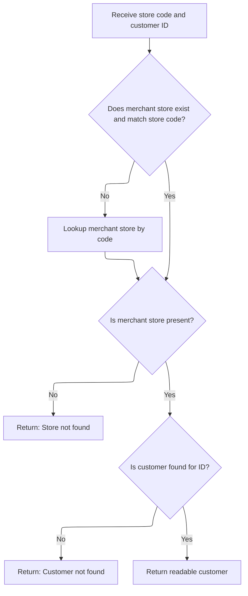

This document outlines how customer data and their shopping cart are retrieved and prepared for use by external systems. The process begins with receiving a store code and customer ID, validating both, and then returning a readable customer object along with a synchronized shopping cart.

# Fetching and Preparing Customer Data



This section governs the retrieval and preparation of customer data for API consumption, ensuring that only valid store and customer combinations are processed and returned in a readable format.

| Category        | Rule Name                     | Description                                                                                                                                                     |
| --------------- | ----------------------------- | --------------------------------------------------------------------------------------------------------------------------------------------------------------- |
| Data validation | Store existence validation    | If the merchant store code provided does not match any existing store, the system must return a 'Store not found' error and halt further processing.            |
| Data validation | Customer existence validation | If the customer ID provided does not correspond to any customer in the system, the system must return a 'Customer not found' error and halt further processing. |
| Business logic  | Readable customer preparation | If both the merchant store and customer are found, the system must prepare and return a readable customer object for API consumption.                           |

<SwmSnippet path="/shopizer/sm-shop/src/main/java/com/salesmanager/web/services/controller/customer/CustomerRESTController.java" line="111">

---

<SwmToken path="shopizer/sm-shop/src/main/java/com/salesmanager/web/services/controller/customer/CustomerRESTController.java" pos="111:5:5" line-data="	public ReadableCustomer getCustomer(@PathVariable final String store, @PathVariable Long id, HttpServletRequest request, HttpServletResponse response) throws Exception {">`getCustomer`</SwmToken> fetches the store and customer, then uses a populator to prepare the customer data for the API. The next step is to use <SwmToken path="shopizer/sm-shop/src/main/java/com/salesmanager/web/populator/shoppingCart/ShoppingCartModelPopulator.java" pos="37:4:4" line-data="public class ShoppingCartModelPopulator">`ShoppingCartModelPopulator`</SwmToken> to handle cart-related data for the customer.

```java
	public ReadableCustomer getCustomer(@PathVariable final String store, @PathVariable Long id, HttpServletRequest request, HttpServletResponse response) throws Exception {
		MerchantStore merchantStore = (MerchantStore)request.getAttribute(Constants.MERCHANT_STORE);
		if(merchantStore!=null) {
			if(!merchantStore.getCode().equals(store)) {
				merchantStore = null;
			}
		}
		
		if(merchantStore== null) {
			merchantStore = merchantStoreService.getByCode(store);
		}
		
		if(merchantStore==null) {
			LOGGER.error("Merchant store is null for code " + store);
			response.sendError(503, "Merchant store is null for code " + store);
			return null;
		}
		
		Customer customer = customerService.getById(id);
		com.salesmanager.web.entity.customer.Customer customerProxy;
		if(customer == null){
			response.sendError(404, "No Customer found with id : " + id);
			return null;
		}
		
		ReadableCustomerPopulator populator = new ReadableCustomerPopulator();
		ReadableCustomer readableCustomer = new ReadableCustomer();
		populator.populate(customer, readableCustomer, merchantStore, merchantStore.getDefaultLanguage());
		
		return readableCustomer;
	}
```

---

</SwmSnippet>

# Building and Syncing the Shopping Cart Model

```mermaid
%%{init: {"flowchart": {"defaultRenderer": "elk"}} }%%
flowchart TD
    node1["Start cart population"] --> node2{"Is cart id > 0 and code present?"}
    click node1 openCode "shopizer/sm-shop/src/main/java/com/salesmanager/web/populator/shoppingCart/ShoppingCartModelPopulator.java:85:86"
    node2 -->|"Yes"| node3["Load cart from database"]
    click node2 openCode "shopizer/sm-shop/src/main/java/com/salesmanager/web/populator/shoppingCart/ShoppingCartModelPopulator.java:91:94"
    node2 -->|"No"| node4["Create new cart"]
    click node4 openCode "shopizer/sm-shop/src/main/java/com/salesmanager/web/populator/shoppingCart/ShoppingCartModelPopulator.java:95:114"
    node3 --> node5
    node4 --> node5

    subgraph loop1["For each item in cart data"]
        node5 --> node6{"Does cart model contain this item?"}
        click node5 openCode "shopizer/sm-shop/src/main/java/com/salesmanager/web/populator/shoppingCart/ShoppingCartModelPopulator.java:116:176"
        node6 -->|"Yes"| node7["Update item quantity"]
        click node6 openCode "shopizer/sm-shop/src/main/java/com/salesmanager/web/populator/shoppingCart/ShoppingCartModelPopulator.java:124:132"
        node7 --> node8{"Does item have attributes?"}
        click node7 openCode "shopizer/sm-shop/src/main/java/com/salesmanager/web/populator/shoppingCart/ShoppingCartModelPopulator.java:133:140"
        node8 -->|"Yes"| node9["For each attribute, match and update"]
        click node8 openCode "shopizer/sm-shop/src/main/java/com/salesmanager/web/populator/shoppingCart/ShoppingCartModelPopulator.java:141:149"
        subgraph loop2["For each attribute in item"]
            node9 --> node10["Update attribute in cart model"]
            click node10 openCode "shopizer/sm-shop/src/main/java/com/salesmanager/web/populator/shoppingCart/ShoppingCartModelPopulator.java:143:148"
        end
        node8 -->|"No"| node11["Remove all attributes"]
        click node11 openCode "shopizer/sm-shop/src/main/java/com/salesmanager/web/populator/shoppingCart/ShoppingCartModelPopulator.java:156:157"
        node9 --> node12["Add item to updated set"]
        node10 --> node12
        node11 --> node12
        node6 -->|"No"| node13["Create new item"]
        click node13 openCode "shopizer/sm-shop/src/main/java/com/salesmanager/web/populator/shoppingCart/ShoppingCartModelPopulator.java:164:173"
        node13 --> node14["Add item to cart"]
        click node14 openCode "shopizer/sm-shop/src/main/java/com/salesmanager/web/populator/shoppingCart/ShoppingCartModelPopulator.java:173:174"
        node12 --> node5
        node14 --> node5
    end
    node5 --> node15["Return updated cart"]
    click node15 openCode "shopizer/sm-shop/src/main/java/com/salesmanager/web/populator/shoppingCart/ShoppingCartModelPopulator.java:187:188"

classDef HeadingStyle fill:#777777,stroke:#333,stroke-width:2px;

%% Swimm:
%% %%{init: {"flowchart": {"defaultRenderer": "elk"}} }%%
%% flowchart TD
%%     node1["Start cart population"] --> node2{"Is cart id > 0 and code present?"}
%%     click node1 openCode "<SwmPath>[shopizer/…/shoppingCart/ShoppingCartModelPopulator.java](shopizer/sm-shop/src/main/java/com/salesmanager/web/populator/shoppingCart/ShoppingCartModelPopulator.java)</SwmPath>:85:86"
%%     node2 -->|"Yes"| node3["Load cart from database"]
%%     click node2 openCode "<SwmPath>[shopizer/…/shoppingCart/ShoppingCartModelPopulator.java](shopizer/sm-shop/src/main/java/com/salesmanager/web/populator/shoppingCart/ShoppingCartModelPopulator.java)</SwmPath>:91:94"
%%     node2 -->|"No"| node4["Create new cart"]
%%     click node4 openCode "<SwmPath>[shopizer/…/shoppingCart/ShoppingCartModelPopulator.java](shopizer/sm-shop/src/main/java/com/salesmanager/web/populator/shoppingCart/ShoppingCartModelPopulator.java)</SwmPath>:95:114"
%%     node3 --> node5
%%     node4 --> node5
%% 
%%     subgraph loop1["For each item in cart data"]
%%         node5 --> node6{"Does cart model contain this item?"}
%%         click node5 openCode "<SwmPath>[shopizer/…/shoppingCart/ShoppingCartModelPopulator.java](shopizer/sm-shop/src/main/java/com/salesmanager/web/populator/shoppingCart/ShoppingCartModelPopulator.java)</SwmPath>:116:176"
%%         node6 -->|"Yes"| node7["Update item quantity"]
%%         click node6 openCode "<SwmPath>[shopizer/…/shoppingCart/ShoppingCartModelPopulator.java](shopizer/sm-shop/src/main/java/com/salesmanager/web/populator/shoppingCart/ShoppingCartModelPopulator.java)</SwmPath>:124:132"
%%         node7 --> node8{"Does item have attributes?"}
%%         click node7 openCode "<SwmPath>[shopizer/…/shoppingCart/ShoppingCartModelPopulator.java](shopizer/sm-shop/src/main/java/com/salesmanager/web/populator/shoppingCart/ShoppingCartModelPopulator.java)</SwmPath>:133:140"
%%         node8 -->|"Yes"| node9["For each attribute, match and update"]
%%         click node8 openCode "<SwmPath>[shopizer/…/shoppingCart/ShoppingCartModelPopulator.java](shopizer/sm-shop/src/main/java/com/salesmanager/web/populator/shoppingCart/ShoppingCartModelPopulator.java)</SwmPath>:141:149"
%%         subgraph loop2["For each attribute in item"]
%%             node9 --> node10["Update attribute in cart model"]
%%             click node10 openCode "<SwmPath>[shopizer/…/shoppingCart/ShoppingCartModelPopulator.java](shopizer/sm-shop/src/main/java/com/salesmanager/web/populator/shoppingCart/ShoppingCartModelPopulator.java)</SwmPath>:143:148"
%%         end
%%         node8 -->|"No"| node11["Remove all attributes"]
%%         click node11 openCode "<SwmPath>[shopizer/…/shoppingCart/ShoppingCartModelPopulator.java](shopizer/sm-shop/src/main/java/com/salesmanager/web/populator/shoppingCart/ShoppingCartModelPopulator.java)</SwmPath>:156:157"
%%         node9 --> node12["Add item to updated set"]
%%         node10 --> node12
%%         node11 --> node12
%%         node6 -->|"No"| node13["Create new item"]
%%         click node13 openCode "<SwmPath>[shopizer/…/shoppingCart/ShoppingCartModelPopulator.java](shopizer/sm-shop/src/main/java/com/salesmanager/web/populator/shoppingCart/ShoppingCartModelPopulator.java)</SwmPath>:164:173"
%%         node13 --> node14["Add item to cart"]
%%         click node14 openCode "<SwmPath>[shopizer/…/shoppingCart/ShoppingCartModelPopulator.java](shopizer/sm-shop/src/main/java/com/salesmanager/web/populator/shoppingCart/ShoppingCartModelPopulator.java)</SwmPath>:173:174"
%%         node12 --> node5
%%         node14 --> node5
%%     end
%%     node5 --> node15["Return updated cart"]
%%     click node15 openCode "<SwmPath>[shopizer/…/shoppingCart/ShoppingCartModelPopulator.java](shopizer/sm-shop/src/main/java/com/salesmanager/web/populator/shoppingCart/ShoppingCartModelPopulator.java)</SwmPath>:187:188"
%% 
%% classDef HeadingStyle fill:#777777,stroke:#333,stroke-width:2px;
```



This section governs how the <SwmToken path="shopizer/sm-shop/src/main/java/com/salesmanager/web/populator/shoppingCart/ShoppingCartModelPopulator.java" pos="85:3:3" line-data="    public ShoppingCart populate(ShoppingCartData shoppingCart,ShoppingCart cartMdel,final MerchantStore store, Language language)">`ShoppingCart`</SwmToken> model is built or updated based on incoming cart data, ensuring the cart in the system matches the client's intended state. It handles cart creation, item synchronization, and error management.

| Category       | Rule Name                      | Description                                                                                                                                                                                                                                                                                    |
| -------------- | ------------------------------ | ---------------------------------------------------------------------------------------------------------------------------------------------------------------------------------------------------------------------------------------------------------------------------------------------- |
| Business logic | Cart Retrieval or Creation     | If the incoming cart data contains a cart id greater than 0 and a non-empty cart code, the system must attempt to load the existing cart from the database using the provided code. If no cart is found, a new cart is created with the given code and associated with the store and customer. |
| Business logic | Store and Customer Association | Each cart must be associated with the correct merchant store and, if available, the customer. The customer association is required for personalized cart management and order processing.                                                                                                      |
| Business logic | Item Quantity Synchronization  | For each item in the incoming cart data, if the item already exists in the cart model (matched by id), its quantity must be updated to match the incoming data.                                                                                                                                |
| Business logic | Item Attribute Synchronization | If an item in the cart has attributes, each attribute must be matched by id and updated in the cart model. If no attributes are present in the incoming data, all attributes must be removed from the item in the cart model.                                                                  |
| Business logic | New Item Addition              | If an item from the incoming cart data does not exist in the cart model, a new item must be created and added to the cart, including any attributes provided.                                                                                                                                  |

<SwmSnippet path="/shopizer/sm-shop/src/main/java/com/salesmanager/web/populator/shoppingCart/ShoppingCartModelPopulator.java" line="85">

---

In <SwmToken path="shopizer/sm-shop/src/main/java/com/salesmanager/web/populator/shoppingCart/ShoppingCartModelPopulator.java" pos="85:5:5" line-data="    public ShoppingCart populate(ShoppingCartData shoppingCart,ShoppingCart cartMdel,final MerchantStore store, Language language)">`populate`</SwmToken>, we either fetch or create the <SwmToken path="shopizer/sm-shop/src/main/java/com/salesmanager/web/populator/shoppingCart/ShoppingCartModelPopulator.java" pos="85:3:3" line-data="    public ShoppingCart populate(ShoppingCartData shoppingCart,ShoppingCart cartMdel,final MerchantStore store, Language language)">`ShoppingCart`</SwmToken> model based on the incoming data's id and code, then associate it with the store and customer if available. The function then loops through each item in the incoming cart data, updating quantities and attributes for existing items or creating new ones if needed. This keeps the cart model in sync with the latest client data, using service calls for persistence.

```java
    public ShoppingCart populate(ShoppingCartData shoppingCart,ShoppingCart cartMdel,final MerchantStore store, Language language)
    {


        // if id >0 get the original from the database, override products
       try{
        if ( shoppingCart.getId() > 0  && StringUtils.isNotBlank( shoppingCart.getCode()))
        {
            cartMdel = shoppingCartService.getByCode( shoppingCart.getCode(), store );
            if(cartMdel==null){
                cartMdel=new ShoppingCart();
                cartMdel.setShoppingCartCode( shoppingCart.getCode() );
                cartMdel.setMerchantStore( store );
                if ( customer != null )
                {
                    cartMdel.setCustomerId( customer.getId() );
                }
                shoppingCartService.create( cartMdel );
            }
        }
        else
        {
            cartMdel.setShoppingCartCode( shoppingCart.getCode() );
            cartMdel.setMerchantStore( store );
            if ( customer != null )
            {
                cartMdel.setCustomerId( customer.getId() );
            }
            shoppingCartService.create( cartMdel );
        }

        List<ShoppingCartItem> items = shoppingCart.getShoppingCartItems();
        Set<com.salesmanager.core.business.shoppingcart.model.ShoppingCartItem> newItems =
            new HashSet<com.salesmanager.core.business.shoppingcart.model.ShoppingCartItem>();
        if ( items != null && items.size() > 0 )
        {
            for ( ShoppingCartItem item : items )
            {

                Set<com.salesmanager.core.business.shoppingcart.model.ShoppingCartItem> cartItems = cartMdel.getLineItems();
                if ( cartItems != null && cartItems.size() > 0 )
                {

                    for ( com.salesmanager.core.business.shoppingcart.model.ShoppingCartItem dbItem : cartItems )
                    {
                        if ( dbItem.getId().longValue() == item.getId() )
                        {
                            dbItem.setQuantity( item.getQuantity() );
                            // compare attributes
                            Set<com.salesmanager.core.business.shoppingcart.model.ShoppingCartAttributeItem> attributes =
                                dbItem.getAttributes();
                            Set<com.salesmanager.core.business.shoppingcart.model.ShoppingCartAttributeItem> newAttributes =
                                new HashSet<com.salesmanager.core.business.shoppingcart.model.ShoppingCartAttributeItem>();
                            List<ShoppingCartAttribute> cartAttributes = item.getShoppingCartAttributes();
                            if ( !CollectionUtils.isEmpty( cartAttributes ) )
                            {
                                for ( ShoppingCartAttribute attribute : cartAttributes )
                                {
                                    for ( com.salesmanager.core.business.shoppingcart.model.ShoppingCartAttributeItem dbAttribute : attributes )
                                    {
                                        if ( dbAttribute.getId().longValue() == attribute.getId() )
                                        {
                                            newAttributes.add( dbAttribute );
                                        }
                                    }
                                }
                                
                                dbItem.setAttributes( newAttributes );
                            }
                            else
                            {
                                dbItem.removeAllAttributes();
                            }
                            newItems.add( dbItem );
                        }
                    }
                }
                else
                {// create new item
                    com.salesmanager.core.business.shoppingcart.model.ShoppingCartItem cartItem =
                        createCartItem( cartMdel, item, store );
                    Set<com.salesmanager.core.business.shoppingcart.model.ShoppingCartItem> lineItems =
                        cartMdel.getLineItems();
                    if ( lineItems == null )
                    {
                        lineItems = new HashSet<com.salesmanager.core.business.shoppingcart.model.ShoppingCartItem>();
                        cartMdel.setLineItems( lineItems );
                    }
                    lineItems.add( cartItem );
                    shoppingCartService.update( cartMdel );
                }
            }// end for
```

---

</SwmSnippet>

<SwmSnippet path="/shopizer/sm-shop/src/main/java/com/salesmanager/web/populator/shoppingCart/ShoppingCartModelPopulator.java" line="176">

---

Finally, the function returns the updated <SwmToken path="shopizer/sm-shop/src/main/java/com/salesmanager/web/populator/shoppingCart/ShoppingCartModelPopulator.java" pos="85:3:3" line-data="    public ShoppingCart populate(ShoppingCartData shoppingCart,ShoppingCart cartMdel,final MerchantStore store, Language language)">`ShoppingCart`</SwmToken> model, which now reflects all changes from the incoming <SwmToken path="shopizer/sm-shop/src/main/java/com/salesmanager/web/populator/shoppingCart/ShoppingCartModelPopulator.java" pos="85:7:7" line-data="    public ShoppingCart populate(ShoppingCartData shoppingCart,ShoppingCart cartMdel,final MerchantStore store, Language language)">`ShoppingCartData`</SwmToken>, unless an error interrupted the process.

```java
            }// end for
        }// end if
       }catch(ServiceException se){
           LOG.error( "Error while converting cart data to cart model.."+se );
           throw new ConversionException( "Unable to create cart model", se ); 
       }
       catch (Exception ex){
           LOG.error( "Error while converting cart data to cart model.."+ex );
           throw new ConversionException( "Unable to create cart model", ex );  
       }

        return cartMdel;
    }
```

---

</SwmSnippet>

&nbsp;

*This is an auto-generated document by Swimm 🌊 and has not yet been verified by a human*

<SwmMeta version="3.0.0" repo-id="Z2l0aHViJTNBJTNBU2hvcGl6ZXIlM0ElM0F1bWFsaW5nYXN3YW1p" repo-name="Shopizer"><sup>Powered by [Swimm](https://app.swimm.io/)</sup></SwmMeta>
