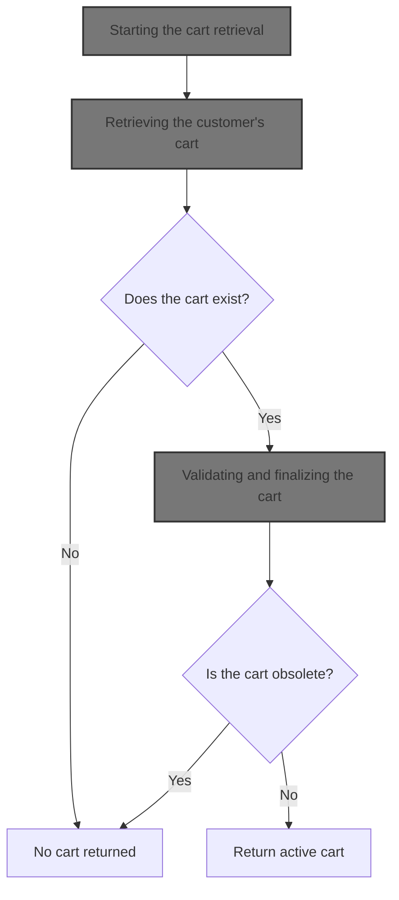
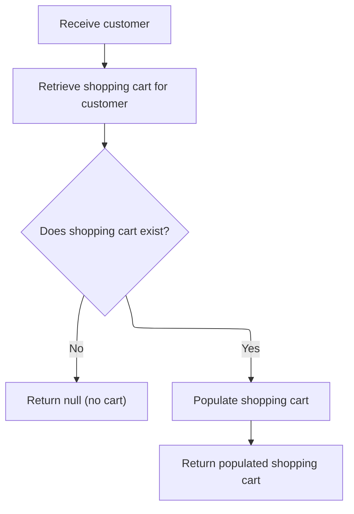
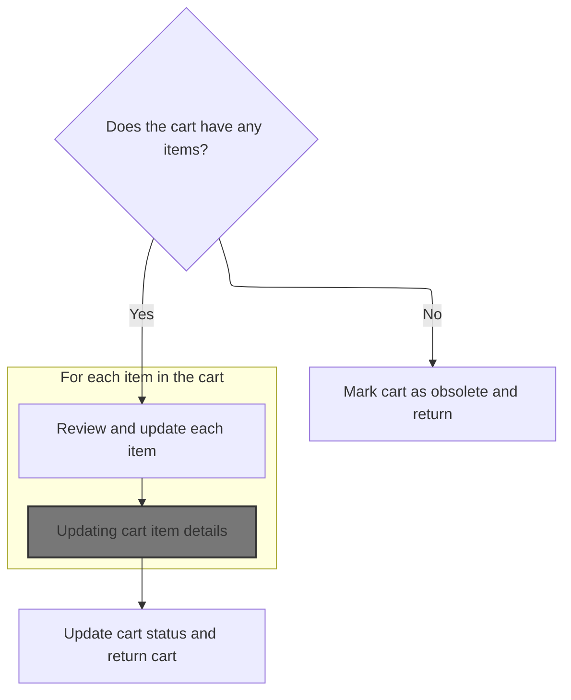
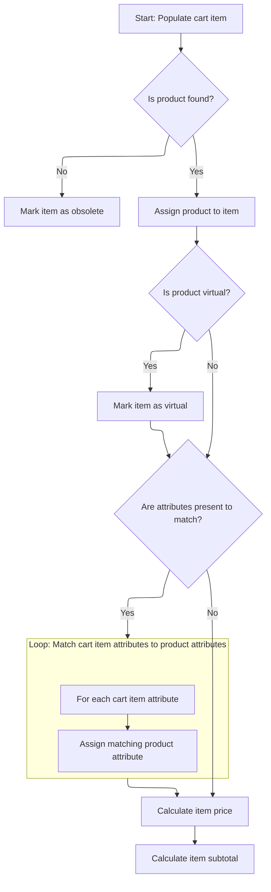
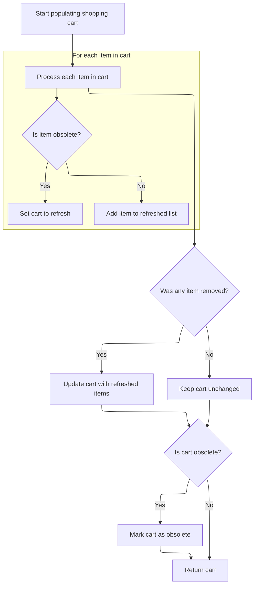
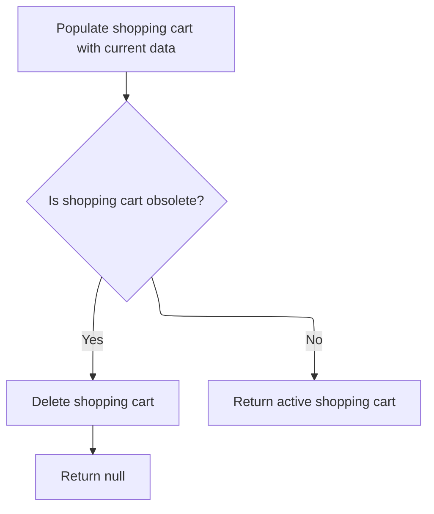

This document describes how a customer's shopping cart is retrieved and validated before being presented. When a customer requests their cart, the system locates it, updates each item to ensure product details and pricing are current, and removes any obsolete items. If the cart is empty or outdated, it is removed. The customer receives either an active, up-to-date cart or no cart if none is valid.



# Starting the cart retrieval

<SwmSnippet path="/shopizer/sm-core/src/main/java/com/salesmanager/core/business/shoppingcart/service/ShoppingCartServiceImpl.java" line="68">

---

In `getShoppingCart`, we kick off by grabbing the cart for the given customer from the DAO. This is the entry point for all cart logic—if there's no cart, we're done; if there is, we need to check and enrich it. That's why we immediately call `getByCustomer` next: it gives us the actual cart instance to work with for all subsequent steps.

```java
	public ShoppingCart getShoppingCart(final Customer customer) throws ServiceException {

		try {

			ShoppingCart shoppingCart = shoppingCartDao.getByCustomer(customer);
```

---

</SwmSnippet>

## Retrieving the customer's cart



<SwmSnippet path="/shopizer/sm-core/src/main/java/com/salesmanager/core/business/shoppingcart/service/ShoppingCartServiceImpl.java" line="209">

---

`getByCustomer` fetches the cart for the customer from the DAO. If there's no cart, it returns null. If there is, it immediately calls `populateShoppingCart` to make sure the cart's items and state are current before returning it.

```java
	public ShoppingCart getByCustomer(final Customer customer) throws ServiceException {

		try {
			ShoppingCart shoppingCart = shoppingCartDao.getByCustomer(customer);
			if(shoppingCart==null) {
				return null;
			}
			return populateShoppingCart(shoppingCart);


		} catch (Exception e) {
			throw new ServiceException(e);
		}
	}
```

---

</SwmSnippet>

## Enriching and validating the cart



<SwmSnippet path="/shopizer/sm-core/src/main/java/com/salesmanager/core/business/shoppingcart/service/ShoppingCartServiceImpl.java" line="225">

---

In `populateShoppingCart`, we check if the cart is empty or null—if so, we mark it obsolete and bail out. Otherwise, we loop through each item and call `populateItem` to update product details, attributes, and pricing for every item.

```java
	private ShoppingCart populateShoppingCart(final ShoppingCart shoppingCart) throws Exception {

		try {

			boolean cartIsObsolete = true;
			if(shoppingCart!=null) {

				Set<ShoppingCartItem> items = shoppingCart.getLineItems();
				if(items==null || items.size()==0) {
					shoppingCart.setObsolete(true);
					return shoppingCart;

				}

				//Set<ShoppingCartItem> shoppingCartItems = new HashSet<ShoppingCartItem>();
				for(ShoppingCartItem item : items) {
					LOGGER.debug("Populate item " + item.getId());
					populateItem(item);
					LOGGER.debug("Obsolete item ? " + item.isObsolete());
					if(item.isObsolete()) {
					} else {
						cartIsObsolete = false;
					}
				}

```

---

</SwmSnippet>

### Updating cart item details



<SwmSnippet path="/shopizer/sm-core/src/main/java/com/salesmanager/core/business/shoppingcart/service/ShoppingCartServiceImpl.java" line="315">

---

In `populateItem`, we look up the product for the cart item. If it's missing, we mark the item obsolete and skip the rest. Otherwise, we update the item with product info, match its attributes to the product's attributes, and prep everything for price calculation.

```java
	private void populateItem(final ShoppingCartItem item) throws Exception {

		Product product = null;

		Long productId = item.getProductId();
		product = productService.getById(productId);

		if(product==null) {
			item.setObsolete(true);
			return;
		}


		item.setProduct(product);
		
		if(product.isProductVirtual()) {
			item.setProductVirtual(true);
		}

		Set<ShoppingCartAttributeItem> attributes = item.getAttributes();
		Set<ProductAttribute> productAttributes = product.getAttributes();
		List<ProductAttribute> attributesList = new ArrayList<ProductAttribute>();
		if(productAttributes!=null && productAttributes.size()>0 && attributes!=null && attributes.size()>0) {
			for(ShoppingCartAttributeItem attribute : attributes) {
				long attributeId = attribute.getProductAttributeId().longValue();
				for(ProductAttribute productAttribute : productAttributes) {

					if(productAttribute.getId().longValue()==attributeId) {
						attribute.setProductAttribute(productAttribute);
						attributesList.add(productAttribute);
						break;
					}

				}

			}
```

---

</SwmSnippet>

<SwmSnippet path="/shopizer/sm-core/src/main/java/com/salesmanager/core/business/shoppingcart/service/ShoppingCartServiceImpl.java" line="353">

---

After matching attributes, we call the pricingService to get the final price for the item, then set both the price and subtotal (price times quantity) on the item. All price logic is handled outside this function.

```java
		//set item price
		FinalPrice price = pricingService.calculateProductPrice(product, attributesList);
		item.setItemPrice(price.getFinalPrice());
		item.setFinalPrice(price);


		BigDecimal subTotal = item.getItemPrice().multiply(new BigDecimal(item.getQuantity().intValue()));
		item.setSubTotal(subTotal);


	}
```

---

</SwmSnippet>

### Filtering and updating cart items



<SwmSnippet path="/shopizer/sm-core/src/main/java/com/salesmanager/core/business/shoppingcart/service/ShoppingCartServiceImpl.java" line="250">

---

Finally in `populateShoppingCart`, if any items were obsolete, we update the cart with the refreshed items. If all items are obsolete, we mark the cart itself obsolete. The function returns the updated cart.

```java
				//shoppingCart.setLineItems(shoppingCartItems);
				boolean refreshCart = false;
                Set<ShoppingCartItem> refreshedItems = new HashSet<ShoppingCartItem>();
                for(ShoppingCartItem item : items) {
                	if(!item.isObsolete()) {
                		refreshedItems.add(item);
                	} else {
                		refreshCart = true;
                	}
                }
```

---

</SwmSnippet>

<SwmSnippet path="/shopizer/sm-core/src/main/java/com/salesmanager/core/business/shoppingcart/service/ShoppingCartServiceImpl.java" line="261">

---

Finally in `populateShoppingCart`, if any items were obsolete, we update the cart with the refreshed items. If all items are obsolete, we mark the cart itself obsolete. The function returns the updated cart.

```java
                if(refreshCart) {
                	shoppingCart.setLineItems(refreshedItems);
                	update(shoppingCart);
                }

				if(cartIsObsolete) {
					shoppingCart.setObsolete(true);
				}
				return shoppingCart;
			}

		} catch (Exception e) {
			throw new ServiceException(e);
		}

		return shoppingCart;

	}
```

---

</SwmSnippet>

## Validating and finalizing the cart



<SwmSnippet path="/shopizer/sm-core/src/main/java/com/salesmanager/core/business/shoppingcart/service/ShoppingCartServiceImpl.java" line="73">

---

After returning from `populateShoppingCart` in `getShoppingCart`, we check if the cart is obsolete. If it is, we delete it and return null; otherwise, we return the cart. This keeps users from seeing outdated or empty carts.

```java
			populateShoppingCart(shoppingCart);
```

---

</SwmSnippet>

<SwmSnippet path="/shopizer/sm-core/src/main/java/com/salesmanager/core/business/shoppingcart/service/ShoppingCartServiceImpl.java" line="74">

---

After returning from `populateShoppingCart` in `getShoppingCart`, we check if the cart is obsolete. If it is, we delete it and return null; otherwise, we return the cart. This keeps users from seeing outdated or empty carts.

```java
			if(shoppingCart!=null && shoppingCart.isObsolete()) {
				delete(shoppingCart);
				return null;
			} else {
				return shoppingCart;
			}


		} catch (Exception e) {
			throw new ServiceException(e);
		}

	}
```

---

</SwmSnippet>

&nbsp;

*This is an auto-generated document by Swimm 🌊 and has not yet been verified by a human*

<SwmMeta version="3.0.0" repo-id="Z2l0aHViJTNBJTNBU2hvcGl6ZXIlM0ElM0F1bWFsaW5nYXN3YW1p" repo-name="Shopizer"><sup>Powered by [Swimm](https://app.swimm.io/)</sup></SwmMeta>
