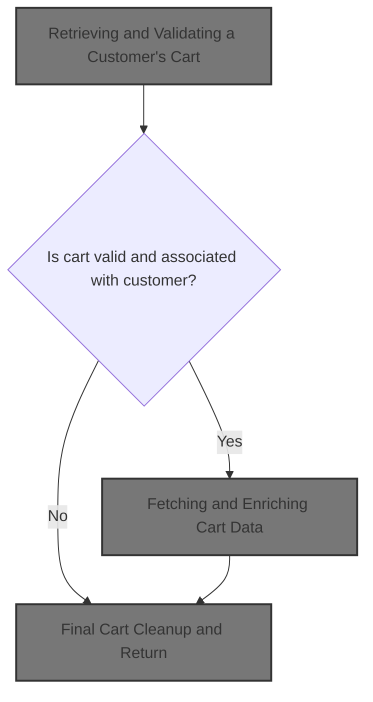
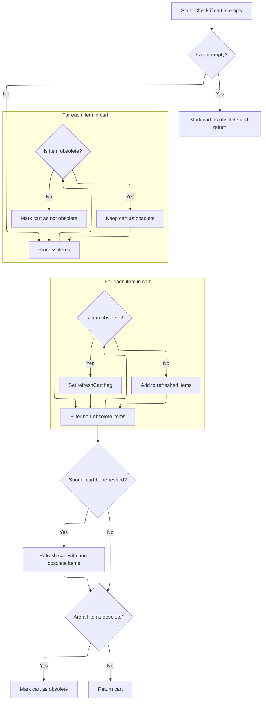
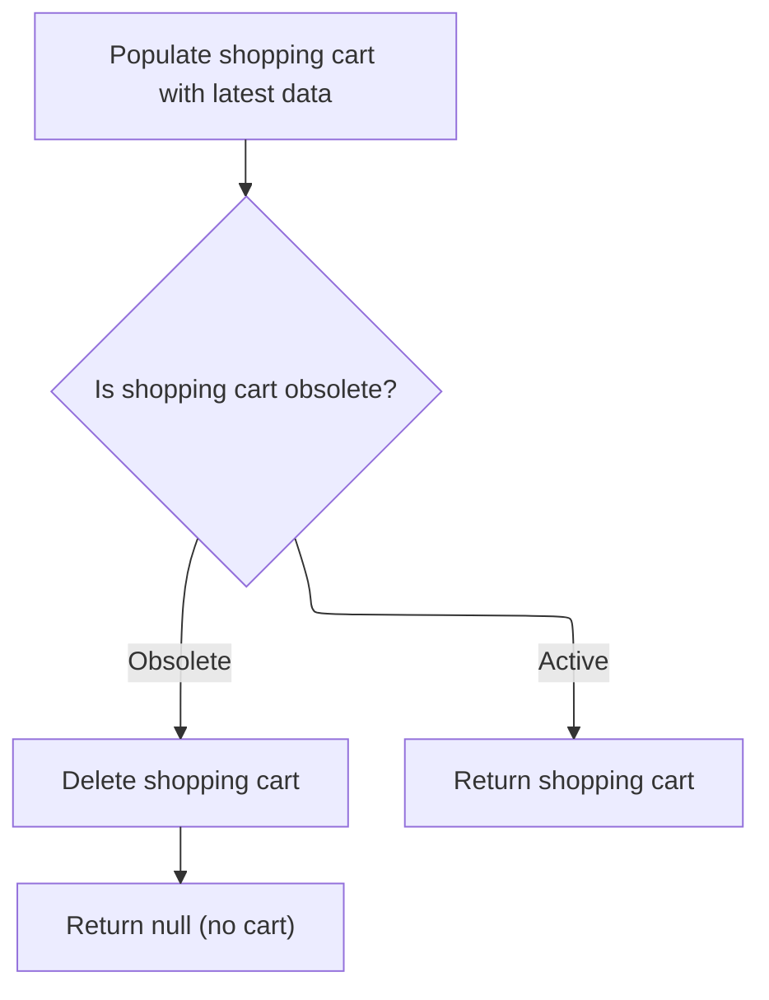

This document describes how a customer's shopping cart is retrieved, validated, and updated to reflect the latest product and pricing information. The input is a customer account, and the output is either a validated, up-to-date cart or null if no valid cart exists.



# Retrieving and Validating a Customer's Cart

This section governs the process of retrieving a customer's shopping cart and ensuring its validity before it is used for further business operations. The rules ensure that only valid and current carts are presented to the customer.

| Category        | Rule Name                       | Description                                                                                                                                                                                                                    |
| --------------- | ------------------------------- | ------------------------------------------------------------------------------------------------------------------------------------------------------------------------------------------------------------------------------ |
| Data validation | Valid customer association      | A shopping cart must be associated with a valid customer account. If the customer does not exist or is inactive, no cart should be retrieved.                                                                                  |
| Data validation | Cart validity check             | If a shopping cart is found for the customer, it must be checked for validity, including ensuring that the cart has not expired or been invalidated by business rules (such as inactivity or changes in product availability). |
| Business logic  | Single active cart per customer | A customer can only have one active shopping cart at a time. If multiple carts are found, the system must resolve which cart is active according to business rules (e.g., most recently updated).                              |
| Business logic  | Cart product data refresh       | The shopping cart must be populated with up-to-date product information, including current prices, stock levels, and any applicable discounts.                                                                                 |

<SwmSnippet path="/shopizer/sm-core/src/main/java/com/salesmanager/core/business/shoppingcart/service/ShoppingCartServiceImpl.java" line="68">

---

In `getShoppingCart`, we kick things off by fetching the cart for the given customer from the DAO. We don't just return it right away—we need to check if the cart is still valid and up-to-date, so the next step is to call `getByCustomer` to handle any business logic around cart retrieval and validation.

```java
	public ShoppingCart getShoppingCart(final Customer customer) throws ServiceException {

		try {

			ShoppingCart shoppingCart = shoppingCartDao.getByCustomer(customer);
```

---

</SwmSnippet>

## Fetching and Enriching Cart Data

This section is responsible for retrieving a customer's shopping cart and ensuring that the cart and its items are up-to-date and valid before presenting it to the user or downstream processes.

| Category       | Rule Name            | Description                                                                                                                                                                                            |
| -------------- | -------------------- | ------------------------------------------------------------------------------------------------------------------------------------------------------------------------------------------------------ |
| Business logic | No Cart for Customer | If a customer does not have an existing shopping cart, the system must return a null value, indicating no cart is available.                                                                           |
| Business logic | Cart Data Enrichment | Whenever a shopping cart is retrieved for a customer, the cart and its items must be validated and updated to reflect the latest product, pricing, and availability information before being returned. |

<SwmSnippet path="/shopizer/sm-core/src/main/java/com/salesmanager/core/business/shoppingcart/service/ShoppingCartServiceImpl.java" line="209">

---

`getByCustomer` grabs the cart for the customer from the DAO. If there's no cart, it returns null. Otherwise, it calls `populateShoppingCart` to make sure the cart and its items are up-to-date and valid before returning it.

```java
	public ShoppingCart getByCustomer(final Customer customer) throws ServiceException {

		try {
			ShoppingCart shoppingCart = shoppingCartDao.getByCustomer(customer);
			if(shoppingCart==null) {
				return null;
			}
			return populateShoppingCart(shoppingCart);


		} catch (Exception e) {
			throw new ServiceException(e);
		}
	}
```

---

</SwmSnippet>

## Refreshing Cart Items and Validity



This section ensures that the shopping cart accurately reflects the current validity of its items. It removes obsolete items, marks the cart as obsolete if necessary, and updates the cart to maintain consistency for the user.

| Category       | Rule Name                      | Description                                                                                                                 |
| -------------- | ------------------------------ | --------------------------------------------------------------------------------------------------------------------------- |
| Business logic | Empty cart obsolescence        | If the shopping cart contains no items, the cart must be marked as obsolete and returned as such.                           |
| Business logic | Obsolete item exclusion        | Any item in the cart that is marked as obsolete must be excluded from the refreshed cart.                                   |
| Business logic | All items obsolete cart status | If all items in the cart are obsolete, the cart itself must be marked as obsolete.                                          |
| Business logic | Cart refresh on item removal   | If any items are removed due to obsolescence, the cart must be flagged for refresh and updated to reflect only valid items. |
| Business logic | Return valid cart              | If the cart contains at least one valid item after filtering, the cart must be returned with only those valid items.        |

<SwmSnippet path="/shopizer/sm-core/src/main/java/com/salesmanager/core/business/shoppingcart/service/ShoppingCartServiceImpl.java" line="225">

---

In `populateShoppingCart`, we check if the cart is null or empty—if so, we mark it obsolete and return. Otherwise, we loop through each item, populate it, and track if any items are still valid. This sets up the next step where we filter out obsolete items.

```java
	private ShoppingCart populateShoppingCart(final ShoppingCart shoppingCart) throws Exception {

		try {

			boolean cartIsObsolete = true;
			if(shoppingCart!=null) {

				Set<ShoppingCartItem> items = shoppingCart.getLineItems();
				if(items==null || items.size()==0) {
					shoppingCart.setObsolete(true);
					return shoppingCart;

				}

				//Set<ShoppingCartItem> shoppingCartItems = new HashSet<ShoppingCartItem>();
				for(ShoppingCartItem item : items) {
					LOGGER.debug("Populate item " + item.getId());
					populateItem(item);
					LOGGER.debug("Obsolete item ? " + item.isObsolete());
					if(item.isObsolete()) {
					} else {
						cartIsObsolete = false;
					}
				}
```

---

</SwmSnippet>

<SwmSnippet path="/shopizer/sm-core/src/main/java/com/salesmanager/core/business/shoppingcart/service/ShoppingCartServiceImpl.java" line="250">

---

After checking each item's validity, we build a new set with only the non-obsolete items. If any items were removed, we flag the cart for refresh. This prepares the cart for a possible update in the next step.

```java
				//shoppingCart.setLineItems(shoppingCartItems);
				boolean refreshCart = false;
                Set<ShoppingCartItem> refreshedItems = new HashSet<ShoppingCartItem>();
                for(ShoppingCartItem item : items) {
                	if(!item.isObsolete()) {
                		refreshedItems.add(item);
                	} else {
                		refreshCart = true;
                	}
                }
```

---

</SwmSnippet>

<SwmSnippet path="/shopizer/sm-core/src/main/java/com/salesmanager/core/business/shoppingcart/service/ShoppingCartServiceImpl.java" line="261">

---

Finally, if any items were removed, we update the cart with the refreshed set. If all items are obsolete, we mark the cart as obsolete. The function returns the cart, now reflecting only valid items or marked obsolete if nothing's left.

```java
                if(refreshCart) {
                	shoppingCart.setLineItems(refreshedItems);
                	update(shoppingCart);
                }

				if(cartIsObsolete) {
					shoppingCart.setObsolete(true);
				}
				return shoppingCart;
			}

		} catch (Exception e) {
			throw new ServiceException(e);
		}

		return shoppingCart;

	}
```

---

</SwmSnippet>

## Final Cart Cleanup and Return



<SwmSnippet path="/shopizer/sm-core/src/main/java/com/salesmanager/core/business/shoppingcart/service/ShoppingCartServiceImpl.java" line="73">

---

Back in `getShoppingCart`, after getting the cart from `getByCustomer`, we run it through `populateShoppingCart` again to make sure all items and the cart itself are still valid before doing anything else.

```java
			populateShoppingCart(shoppingCart);
```

---

</SwmSnippet>

<SwmSnippet path="/shopizer/sm-core/src/main/java/com/salesmanager/core/business/shoppingcart/service/ShoppingCartServiceImpl.java" line="74">

---

After running `populateShoppingCart`, `getShoppingCart` checks if the cart is obsolete. If it is, the cart gets deleted and we return null. Otherwise, we return the valid cart. This keeps the system clean and avoids returning stale carts.

```java
			if(shoppingCart!=null && shoppingCart.isObsolete()) {
				delete(shoppingCart);
				return null;
			} else {
				return shoppingCart;
			}


		} catch (Exception e) {
			throw new ServiceException(e);
		}

	}
```

---

</SwmSnippet>

&nbsp;

*This is an auto-generated document by Swimm 🌊 and has not yet been verified by a human*

<SwmMeta version="3.0.0" repo-id="Z2l0aHViJTNBJTNBU2hvcGl6ZXIlM0ElM0F1bWFsaW5nYXN3YW1p" repo-name="Shopizer"><sup>Powered by [Swimm](https://app.swimm.io/)</sup></SwmMeta>
