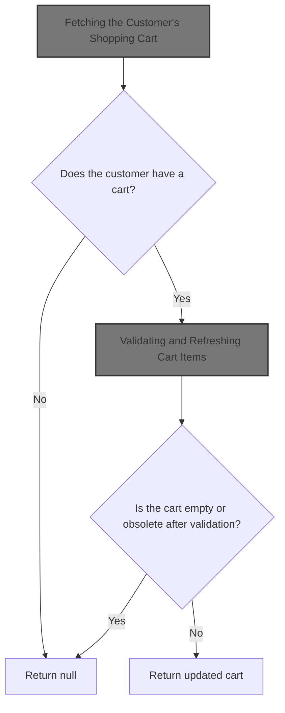
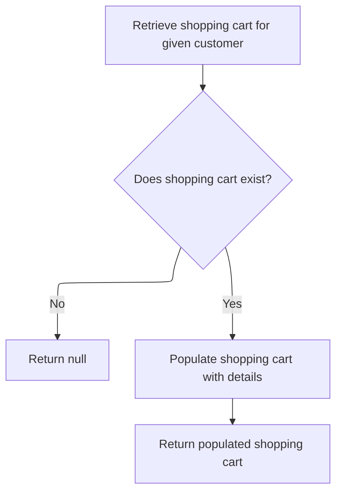
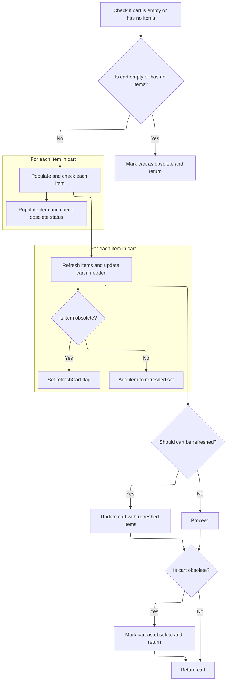
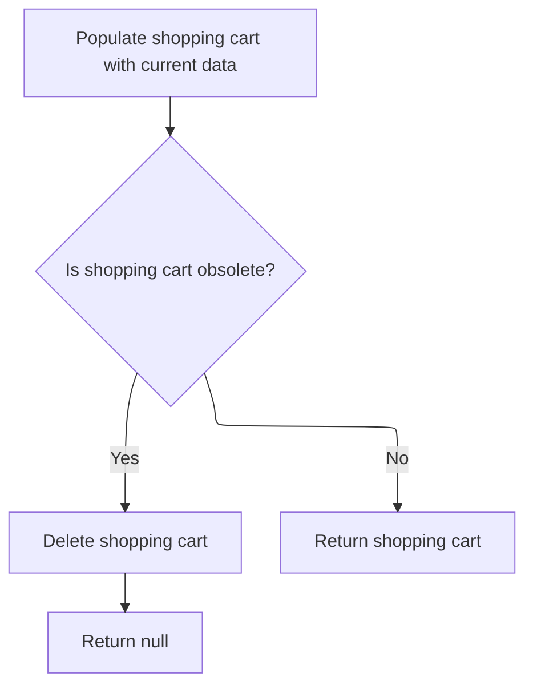

This document outlines how the system retrieves and validates a customer's shopping cart. When a customer interacts with the system, their cart is located and checked for obsolete or invalid items. If the cart is empty or contains only obsolete items, it is removed and not returned. Otherwise, the customer receives an up-to-date cart ready for further actions.



# Fetching the Customer's Shopping Cart

This section ensures that when a customer interacts with the system, their existing shopping cart is accurately retrieved and made available for further actions such as viewing, updating, or checking out.

| Category        | Rule Name                 | Description                                                                                                                          |
| --------------- | ------------------------- | ------------------------------------------------------------------------------------------------------------------------------------ |
| Data validation | Cart ownership validation | The shopping cart returned must only contain items associated with the specific customer and not include items from other customers. |
| Business logic  | Retrieve existing cart    | If a customer exists in the system, their shopping cart must be retrieved from the database using their unique identifier.           |

<SwmSnippet path="/shopizer/sm-core/src/main/java/com/salesmanager/core/business/shoppingcart/service/ShoppingCartServiceImpl.java" line="68">

---

In `getShoppingCart`, we kick things off by loading the shopping cart for the given customer from the database. We need to call `getByCustomer` next because we can't do anything else until we know what (if any) cart the customer already has.

```java
	public ShoppingCart getShoppingCart(final Customer customer) throws ServiceException {

		try {

			ShoppingCart shoppingCart = shoppingCartDao.getByCustomer(customer);
```

---

</SwmSnippet>

## Retrieving the Cart from the Database



This section governs the retrieval of a customer's shopping cart from the database, ensuring that only valid and up-to-date carts are returned, or null if no cart exists.

| Category       | Rule Name             | Description                                                                                                                                          |
| -------------- | --------------------- | ---------------------------------------------------------------------------------------------------------------------------------------------------- |
| Business logic | Null for missing cart | If a shopping cart does not exist for the given customer, the system must return a null value to indicate the absence of a cart.                     |
| Business logic | Populate cart details | If a shopping cart exists for the customer, the system must ensure the cart is populated with up-to-date and valid item details before returning it. |

<SwmSnippet path="/shopizer/sm-core/src/main/java/com/salesmanager/core/business/shoppingcart/service/ShoppingCartServiceImpl.java" line="209">

---

`getByCustomer` loads the cart for the customer from the DB. If there's no cart, it returns null. Otherwise, it calls `populateShoppingCart` to make sure the cart's items are up-to-date and valid before returning it.

```java
	public ShoppingCart getByCustomer(final Customer customer) throws ServiceException {

		try {
			ShoppingCart shoppingCart = shoppingCartDao.getByCustomer(customer);
			if(shoppingCart==null) {
				return null;
			}
			return populateShoppingCart(shoppingCart);


		} catch (Exception e) {
			throw new ServiceException(e);
		}
	}
```

---

</SwmSnippet>

## Validating and Refreshing Cart Items



This section ensures that the shopping cart accurately reflects the current state of its items, removing obsolete items and marking the cart as obsolete if necessary. It guarantees that only valid items remain in the cart and that the cart's status is updated for further processing.

| Category       | Rule Name                          | Description                                                                                                                                   |
| -------------- | ---------------------------------- | --------------------------------------------------------------------------------------------------------------------------------------------- |
| Business logic | Empty cart obsolescence            | If the shopping cart is empty or contains no items, the cart must be marked as obsolete and returned immediately.                             |
| Business logic | Item validation and refresh        | Each item in the cart must be validated and updated to reflect its current status, including whether it is obsolete.                          |
| Business logic | Cart obsolescence after item check | If all items in the cart are obsolete after validation, the cart must be marked as obsolete before returning.                                 |
| Business logic | Cart refresh on item removal       | If any items are removed from the cart due to obsolescence, the cart's line items must be refreshed and the cart flagged for database update. |
| Business logic | Return latest cart state           | The returned cart must always reflect the latest valid state, with obsolete items removed and the obsolete flag set if applicable.            |

<SwmSnippet path="/shopizer/sm-core/src/main/java/com/salesmanager/core/business/shoppingcart/service/ShoppingCartServiceImpl.java" line="225">

---

In `populateShoppingCart`, we first check if the cart or its items are empty—if so, we mark the cart obsolete and bail out. Otherwise, we loop through each item, update it, and check if it's obsolete. If all items are obsolete, the cart gets marked obsolete at the end too.

```java
	private ShoppingCart populateShoppingCart(final ShoppingCart shoppingCart) throws Exception {

		try {

			boolean cartIsObsolete = true;
			if(shoppingCart!=null) {

				Set<ShoppingCartItem> items = shoppingCart.getLineItems();
				if(items==null || items.size()==0) {
					shoppingCart.setObsolete(true);
					return shoppingCart;

				}

				//Set<ShoppingCartItem> shoppingCartItems = new HashSet<ShoppingCartItem>();
				for(ShoppingCartItem item : items) {
					LOGGER.debug("Populate item " + item.getId());
					populateItem(item);
					LOGGER.debug("Obsolete item ? " + item.isObsolete());
					if(item.isObsolete()) {
					} else {
						cartIsObsolete = false;
					}
				}
```

---

</SwmSnippet>

<SwmSnippet path="/shopizer/sm-core/src/main/java/com/salesmanager/core/business/shoppingcart/service/ShoppingCartServiceImpl.java" line="250">

---

After updating and checking each item, we build a new set of non-obsolete items. If any items were removed, we refresh the cart's line items and flag that a DB update is needed.

```java
				//shoppingCart.setLineItems(shoppingCartItems);
				boolean refreshCart = false;
                Set<ShoppingCartItem> refreshedItems = new HashSet<ShoppingCartItem>();
                for(ShoppingCartItem item : items) {
                	if(!item.isObsolete()) {
                		refreshedItems.add(item);
                	} else {
                		refreshCart = true;
                	}
                }
```

---

</SwmSnippet>

<SwmSnippet path="/shopizer/sm-core/src/main/java/com/salesmanager/core/business/shoppingcart/service/ShoppingCartServiceImpl.java" line="261">

---

Finally, if any items were removed, we update the cart in the DB. If the cart is now obsolete (all items gone or obsolete), we flag it as such before returning it. The returned cart reflects the latest state for the next step.

```java
                if(refreshCart) {
                	shoppingCart.setLineItems(refreshedItems);
                	update(shoppingCart);
                }

				if(cartIsObsolete) {
					shoppingCart.setObsolete(true);
				}
				return shoppingCart;
			}

		} catch (Exception e) {
			throw new ServiceException(e);
		}

		return shoppingCart;

	}
```

---

</SwmSnippet>

## Post-Processing the Cart After Validation



<SwmSnippet path="/shopizer/sm-core/src/main/java/com/salesmanager/core/business/shoppingcart/service/ShoppingCartServiceImpl.java" line="73">

---

Back in `getShoppingCart`, after getting the cart from `getByCustomer`, we call `populateShoppingCart` to make sure the cart's items are current and valid before making any decisions based on its state.

```java
			populateShoppingCart(shoppingCart);
```

---

</SwmSnippet>

<SwmSnippet path="/shopizer/sm-core/src/main/java/com/salesmanager/core/business/shoppingcart/service/ShoppingCartServiceImpl.java" line="74">

---

If the cart is obsolete, we delete it and return null; otherwise, we return the cart.

```java
			if(shoppingCart!=null && shoppingCart.isObsolete()) {
				delete(shoppingCart);
				return null;
			} else {
				return shoppingCart;
			}


		} catch (Exception e) {
			throw new ServiceException(e);
		}

	}
```

---

</SwmSnippet>

&nbsp;

*This is an auto-generated document by Swimm 🌊 and has not yet been verified by a human*

<SwmMeta version="3.0.0" repo-id="Z2l0aHViJTNBJTNBU2hvcGl6ZXIlM0ElM0F1bWFsaW5nYXN3YW1p" repo-name="Shopizer"><sup>Powered by [Swimm](https://app.swimm.io/)</sup></SwmMeta>
