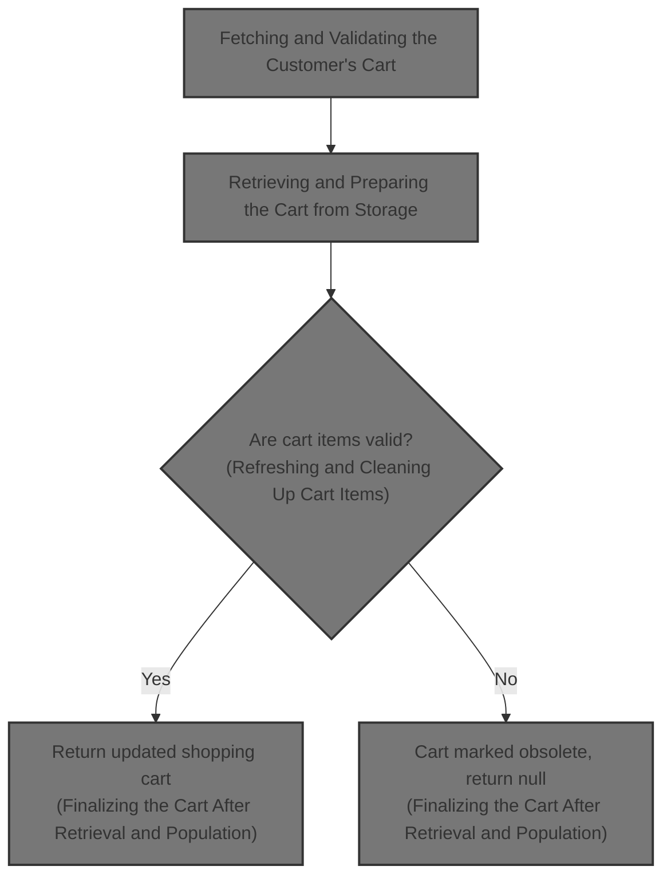
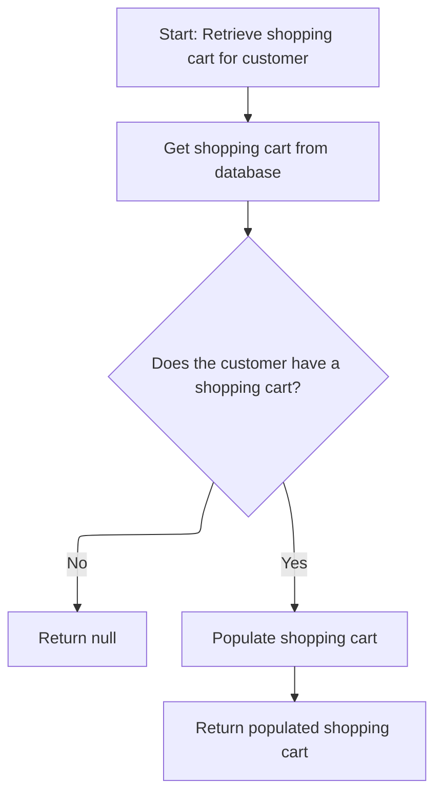
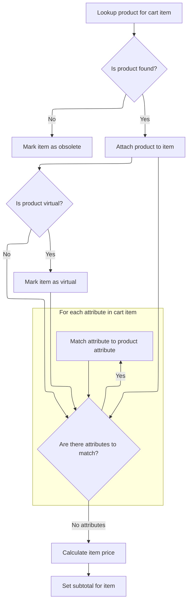
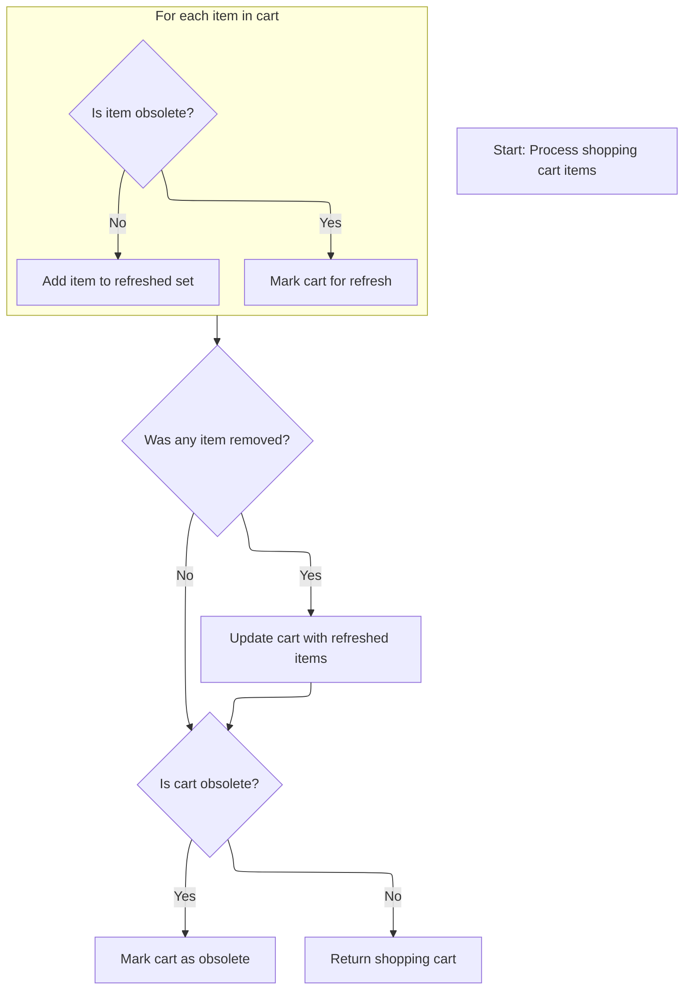

This document describes how a customer's shopping cart is retrieved and validated to ensure it contains only current and valid items. The flow receives a customer request and returns an updated shopping cart or null if the cart is obsolete.



# Fetching and Validating the Customer's Cart

<SwmSnippet path="/shopizer/sm-core/src/main/java/com/salesmanager/core/business/shoppingcart/service/ShoppingCartServiceImpl.java" line="68">

---

In `getShoppingCart`, we start by pulling the cart for the customer using getByCustomer, since everything else depends on having the right cart for this user.

```java
	public ShoppingCart getShoppingCart(final Customer customer) throws ServiceException {

		try {

			ShoppingCart shoppingCart = shoppingCartDao.getByCustomer(customer);
```

---

</SwmSnippet>

## Retrieving and Preparing the Cart from Storage



<SwmSnippet path="/shopizer/sm-core/src/main/java/com/salesmanager/core/business/shoppingcart/service/ShoppingCartServiceImpl.java" line="209">

---

`getByCustomer` fetches the cart for the customer from the database. If there's no cart, it returns null right away. If a cart exists, it calls populateShoppingCart to update and clean up the cart before returning it.

```java
	public ShoppingCart getByCustomer(final Customer customer) throws ServiceException {

		try {
			ShoppingCart shoppingCart = shoppingCartDao.getByCustomer(customer);
			if(shoppingCart==null) {
				return null;
			}
			return populateShoppingCart(shoppingCart);


		} catch (Exception e) {
			throw new ServiceException(e);
		}
	}
```

---

</SwmSnippet>

## Refreshing and Cleaning Up Cart Items

<SwmSnippet path="/shopizer/sm-core/src/main/java/com/salesmanager/core/business/shoppingcart/service/ShoppingCartServiceImpl.java" line="225">

---

In `populateShoppingCart`, we loop through each item in the cart and call populateItem to update its state and pricing. This step also checks if items are obsolete and flags the cart as obsolete if needed. It's not just about filling in data—it's about cleaning up and validating the cart before it's used.

```java
	private ShoppingCart populateShoppingCart(final ShoppingCart shoppingCart) throws Exception {

		try {

			boolean cartIsObsolete = true;
			if(shoppingCart!=null) {

				Set<ShoppingCartItem> items = shoppingCart.getLineItems();
				if(items==null || items.size()==0) {
					shoppingCart.setObsolete(true);
					return shoppingCart;

				}

				//Set<ShoppingCartItem> shoppingCartItems = new HashSet<ShoppingCartItem>();
				for(ShoppingCartItem item : items) {
					LOGGER.debug("Populate item " + item.getId());
					populateItem(item);
					LOGGER.debug("Obsolete item ? " + item.isObsolete());
					if(item.isObsolete()) {
					} else {
						cartIsObsolete = false;
					}
				}

```

---

</SwmSnippet>

### Updating Cart Item Details and Pricing



<SwmSnippet path="/shopizer/sm-core/src/main/java/com/salesmanager/core/business/shoppingcart/service/ShoppingCartServiceImpl.java" line="315">

---

In `populateItem`, we fetch the product for the cart item. If it's missing, we mark the item obsolete and stop. Otherwise, we update the item with the product, match up attributes, recalculate the price, and set the subtotal. This keeps the item in sync with the latest product data.

```java
	private void populateItem(final ShoppingCartItem item) throws Exception {

		Product product = null;

		Long productId = item.getProductId();
		product = productService.getById(productId);

		if(product==null) {
			item.setObsolete(true);
			return;
		}


		item.setProduct(product);
		
		if(product.isProductVirtual()) {
			item.setProductVirtual(true);
		}

		Set<ShoppingCartAttributeItem> attributes = item.getAttributes();
		Set<ProductAttribute> productAttributes = product.getAttributes();
		List<ProductAttribute> attributesList = new ArrayList<ProductAttribute>();
		if(productAttributes!=null && productAttributes.size()>0 && attributes!=null && attributes.size()>0) {
			for(ShoppingCartAttributeItem attribute : attributes) {
				long attributeId = attribute.getProductAttributeId().longValue();
				for(ProductAttribute productAttribute : productAttributes) {

					if(productAttribute.getId().longValue()==attributeId) {
						attribute.setProductAttribute(productAttribute);
						attributesList.add(productAttribute);
						break;
					}

				}

			}
```

---

</SwmSnippet>

<SwmSnippet path="/shopizer/sm-core/src/main/java/com/salesmanager/core/business/shoppingcart/service/ShoppingCartServiceImpl.java" line="353">

---

After `populateItem`, the item has updated pricing and subtotal, or it's marked obsolete if the product is missing.

```java
		//set item price
		FinalPrice price = pricingService.calculateProductPrice(product, attributesList);
		item.setItemPrice(price.getFinalPrice());
		item.setFinalPrice(price);


		BigDecimal subTotal = item.getItemPrice().multiply(new BigDecimal(item.getQuantity().intValue()));
		item.setSubTotal(subTotal);


	}
```

---

</SwmSnippet>

### Filtering and Updating Cart Items After Population



<SwmSnippet path="/shopizer/sm-core/src/main/java/com/salesmanager/core/business/shoppingcart/service/ShoppingCartServiceImpl.java" line="250">

---

Back in `populateShoppingCart`, after running populateItem on each item, we filter out obsolete items and flag if the cart needs to be updated. Only valid items are kept for the next step.

```java
				//shoppingCart.setLineItems(shoppingCartItems);
				boolean refreshCart = false;
                Set<ShoppingCartItem> refreshedItems = new HashSet<ShoppingCartItem>();
                for(ShoppingCartItem item : items) {
                	if(!item.isObsolete()) {
                		refreshedItems.add(item);
                	} else {
                		refreshCart = true;
                	}
                }
```

---

</SwmSnippet>

<SwmSnippet path="/shopizer/sm-core/src/main/java/com/salesmanager/core/business/shoppingcart/service/ShoppingCartServiceImpl.java" line="261">

---

After cleaning up items in `populateShoppingCart`, we update the cart if any items were removed, mark it obsolete if needed, and return the updated cart. If everything's obsolete, the cart is flagged as such.

```java
                if(refreshCart) {
                	shoppingCart.setLineItems(refreshedItems);
                	update(shoppingCart);
                }

				if(cartIsObsolete) {
					shoppingCart.setObsolete(true);
				}
				return shoppingCart;
			}

		} catch (Exception e) {
			throw new ServiceException(e);
		}

		return shoppingCart;

	}
```

---

</SwmSnippet>

## Finalizing the Cart After Retrieval and Population

<SwmSnippet path="/shopizer/sm-core/src/main/java/com/salesmanager/core/business/shoppingcart/service/ShoppingCartServiceImpl.java" line="73">

---

Back in `getShoppingCart`, after getting the cart from getByCustomer, we call populateShoppingCart to make sure all the items are current and the cart is cleaned up before we do anything else with it.

```java
			populateShoppingCart(shoppingCart);
```

---

</SwmSnippet>

<SwmSnippet path="/shopizer/sm-core/src/main/java/com/salesmanager/core/business/shoppingcart/service/ShoppingCartServiceImpl.java" line="74">

---

After `populateShoppingCart` in `getShoppingCart`, we check if the cart is obsolete. If it is, we delete it and return null; otherwise, we just return the cart. This keeps users from seeing or using dead carts.

```java
			if(shoppingCart!=null && shoppingCart.isObsolete()) {
				delete(shoppingCart);
				return null;
			} else {
				return shoppingCart;
			}


		} catch (Exception e) {
			throw new ServiceException(e);
		}

	}
```

---

</SwmSnippet>

&nbsp;

*This is an auto-generated document by Swimm 🌊 and has not yet been verified by a human*

<SwmMeta version="3.0.0" repo-id="Z2l0aHViJTNBJTNBU2hvcGl6ZXIlM0ElM0F1bWFsaW5nYXN3YW1p" repo-name="Shopizer"><sup>Powered by [Swimm](https://app.swimm.io/)</sup></SwmMeta>
