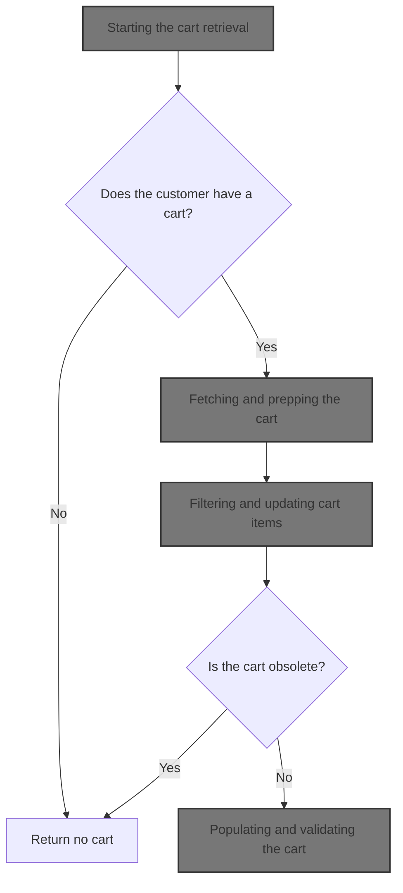
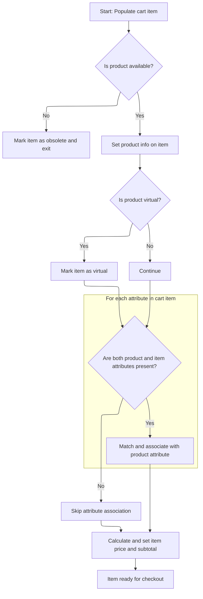
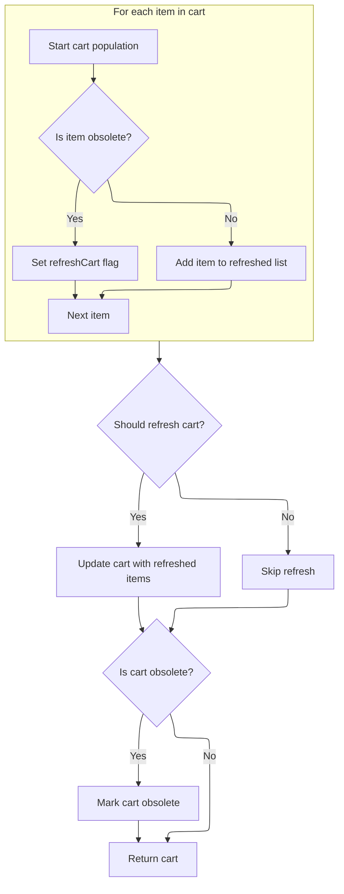

This document describes the process of retrieving and validating a customer's shopping cart. The flow ensures that the cart is up-to-date, with all items checked for product availability and correct pricing. If the cart or its items are obsolete, they are removed or the cart is marked as obsolete, and the customer receives either a refreshed cart or no cart at all. This supports a seamless checkout experience by guaranteeing only valid carts are presented to customers.



# Starting the cart retrieval

<SwmSnippet path="/shopizer/sm-core/src/main/java/com/salesmanager/core/business/shoppingcart/service/ShoppingCartServiceImpl.java" line="68">

---

In `getShoppingCart`, we kick off by grabbing the cart for the given customer using the DAO. This is the entry point for the cart retrieval and validation flow. We need to call `getByCustomer` next because that's where the actual lookup happens, and it handles the case where the customer might not have a cart at all.

```java
	public ShoppingCart getShoppingCart(final Customer customer) throws ServiceException {

		try {

			ShoppingCart shoppingCart = shoppingCartDao.getByCustomer(customer);
```

---

</SwmSnippet>

## Fetching and prepping the cart

<SwmSnippet path="/shopizer/sm-core/src/main/java/com/salesmanager/core/business/shoppingcart/service/ShoppingCartServiceImpl.java" line="209">

---

`getByCustomer` grabs the cart and runs it through population to make sure it's current and not obsolete.

```java
	public ShoppingCart getByCustomer(final Customer customer) throws ServiceException {

		try {
			ShoppingCart shoppingCart = shoppingCartDao.getByCustomer(customer);
			if(shoppingCart==null) {
				return null;
			}
			return populateShoppingCart(shoppingCart);


		} catch (Exception e) {
			throw new ServiceException(e);
		}
	}
```

---

</SwmSnippet>

## Validating and refreshing cart contents

<SwmSnippet path="/shopizer/sm-core/src/main/java/com/salesmanager/core/business/shoppingcart/service/ShoppingCartServiceImpl.java" line="225">

---

In `populateShoppingCart`, we first check if the cart or its items are empty, marking it obsolete if so. Then we loop through each item, calling `populateItem` to refresh product data and check for obsolescence. This sets up the next step where we filter out obsolete items and possibly update the cart.

```java
	private ShoppingCart populateShoppingCart(final ShoppingCart shoppingCart) throws Exception {

		try {

			boolean cartIsObsolete = true;
			if(shoppingCart!=null) {

				Set<ShoppingCartItem> items = shoppingCart.getLineItems();
				if(items==null || items.size()==0) {
					shoppingCart.setObsolete(true);
					return shoppingCart;

				}

				//Set<ShoppingCartItem> shoppingCartItems = new HashSet<ShoppingCartItem>();
				for(ShoppingCartItem item : items) {
					LOGGER.debug("Populate item " + item.getId());
					populateItem(item);
					LOGGER.debug("Obsolete item ? " + item.isObsolete());
					if(item.isObsolete()) {
					} else {
						cartIsObsolete = false;
					}
				}

```

---

</SwmSnippet>

### Populating and validating cart items



<SwmSnippet path="/shopizer/sm-core/src/main/java/com/salesmanager/core/business/shoppingcart/service/ShoppingCartServiceImpl.java" line="315">

---

In `populateItem`, we grab the product for the item, mark the item obsolete if the product doesn't exist, and otherwise set up product details, match attributes, and prep for pricing. This is where we make sure each item is valid and ready for price calculation.

```java
	private void populateItem(final ShoppingCartItem item) throws Exception {

		Product product = null;

		Long productId = item.getProductId();
		product = productService.getById(productId);

		if(product==null) {
			item.setObsolete(true);
			return;
		}


		item.setProduct(product);
		
		if(product.isProductVirtual()) {
			item.setProductVirtual(true);
		}

		Set<ShoppingCartAttributeItem> attributes = item.getAttributes();
		Set<ProductAttribute> productAttributes = product.getAttributes();
		List<ProductAttribute> attributesList = new ArrayList<ProductAttribute>();
		if(productAttributes!=null && productAttributes.size()>0 && attributes!=null && attributes.size()>0) {
			for(ShoppingCartAttributeItem attribute : attributes) {
				long attributeId = attribute.getProductAttributeId().longValue();
				for(ProductAttribute productAttribute : productAttributes) {

					if(productAttribute.getId().longValue()==attributeId) {
						attribute.setProductAttribute(productAttribute);
						attributesList.add(productAttribute);
						break;
					}

				}

			}
```

---

</SwmSnippet>

<SwmSnippet path="/shopizer/sm-core/src/main/java/com/salesmanager/core/business/shoppingcart/service/ShoppingCartServiceImpl.java" line="353">

---

After setting up product and attribute data, we call the pricing service to get the final price, set it on the item, and calculate the subtotal. This wraps up the item population with all pricing info ready for the cart.

```java
		//set item price
		FinalPrice price = pricingService.calculateProductPrice(product, attributesList);
		item.setItemPrice(price.getFinalPrice());
		item.setFinalPrice(price);


		BigDecimal subTotal = item.getItemPrice().multiply(new BigDecimal(item.getQuantity().intValue()));
		item.setSubTotal(subTotal);


	}
```

---

</SwmSnippet>

### Filtering and updating cart items



<SwmSnippet path="/shopizer/sm-core/src/main/java/com/salesmanager/core/business/shoppingcart/service/ShoppingCartServiceImpl.java" line="250">

---

Back in `populateShoppingCart`, after returning from `populateItem`, we loop through the items again to filter out any that were marked obsolete. If any items were removed, we set the refresh flag to update the cart's line items.

```java
				//shoppingCart.setLineItems(shoppingCartItems);
				boolean refreshCart = false;
                Set<ShoppingCartItem> refreshedItems = new HashSet<ShoppingCartItem>();
                for(ShoppingCartItem item : items) {
                	if(!item.isObsolete()) {
                		refreshedItems.add(item);
                	} else {
                		refreshCart = true;
                	}
                }
```

---

</SwmSnippet>

<SwmSnippet path="/shopizer/sm-core/src/main/java/com/salesmanager/core/business/shoppingcart/service/ShoppingCartServiceImpl.java" line="261">

---

After filtering and updating, we check if the cart is now obsolete (all items gone or invalid). If so, we mark it as obsolete. Otherwise, we return the refreshed cart, possibly after updating it in the DB.

```java
                if(refreshCart) {
                	shoppingCart.setLineItems(refreshedItems);
                	update(shoppingCart);
                }

				if(cartIsObsolete) {
					shoppingCart.setObsolete(true);
				}
				return shoppingCart;
			}

		} catch (Exception e) {
			throw new ServiceException(e);
		}

		return shoppingCart;

	}
```

---

</SwmSnippet>

## Populating and validating the cart

<SwmSnippet path="/shopizer/sm-core/src/main/java/com/salesmanager/core/business/shoppingcart/service/ShoppingCartServiceImpl.java" line="73">

---

Back in `getShoppingCart`, after getting the cart from `getByCustomer`, we call `populateShoppingCart` to make sure the cart is fully loaded with all necessary data and checks before returning it.

```java
			populateShoppingCart(shoppingCart);
```

---

</SwmSnippet>

<SwmSnippet path="/shopizer/sm-core/src/main/java/com/salesmanager/core/business/shoppingcart/service/ShoppingCartServiceImpl.java" line="74">

---

After running `populateShoppingCart` in `getShoppingCart`, we check if the cart is obsolete. If it is, we delete it and return null, otherwise we return the valid cart. This keeps users from seeing or using dead carts.

```java
			if(shoppingCart!=null && shoppingCart.isObsolete()) {
				delete(shoppingCart);
				return null;
			} else {
				return shoppingCart;
			}


		} catch (Exception e) {
			throw new ServiceException(e);
		}

	}
```

---

</SwmSnippet>

&nbsp;

*This is an auto-generated document by Swimm 🌊 and has not yet been verified by a human*

<SwmMeta version="3.0.0" repo-id="Z2l0aHViJTNBJTNBU2hvcGl6ZXIlM0ElM0F1bWFsaW5nYXN3YW1p" repo-name="Shopizer"><sup>Powered by [Swimm](https://app.swimm.io/)</sup></SwmMeta>
