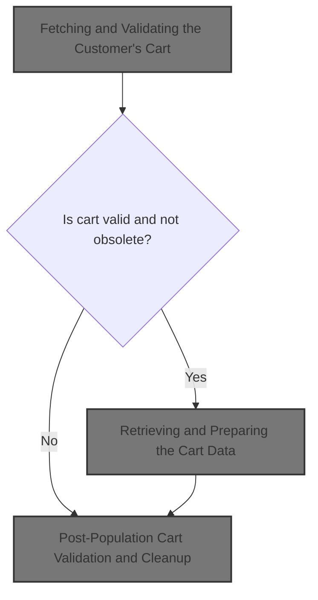
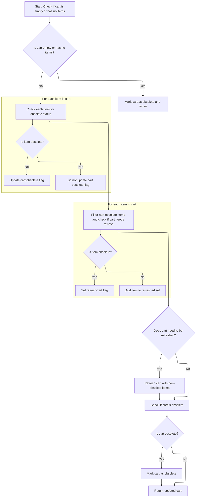
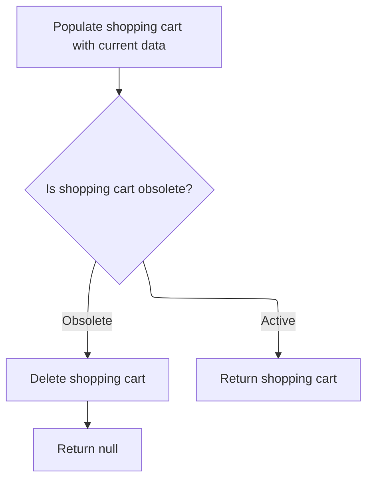

This document explains how a customer's shopping cart is retrieved, validated, and cleaned to ensure it contains only current, valid items. When a customer requests their cart, the system removes obsolete items and returns either the updated cart or a null value if the cart is no longer valid.



# Fetching and Validating the Customer's Cart

This section is responsible for fetching the customer's shopping cart and performing initial validation to ensure the cart exists and is ready for further processing.

| Category        | Rule Name                       | Description                                                                                                                                                  |
| --------------- | ------------------------------- | ------------------------------------------------------------------------------------------------------------------------------------------------------------ |
| Data validation | Customer Association Validation | A shopping cart must be associated with a valid customer; carts without a valid customer reference are considered invalid and must not be processed.         |
| Business logic  | Obsolete Cart Handling          | If a shopping cart is found to be obsolete or expired, it must not be returned for further processing and an error or empty cart should be provided instead. |
| Business logic  | Cart Population Requirement     | Upon successful retrieval, the shopping cart must be populated with all relevant items and details before being returned to the customer.                    |

<SwmSnippet path="/shopizer/sm-core/src/main/java/com/salesmanager/core/business/shoppingcart/service/ShoppingCartServiceImpl.java" line="68">

---

In `getShoppingCart`, we kick off by grabbing the cart for the customer using the DAO. This isn't just a fetch; the next step is to call `getByCustomer`, which handles both retrieval and the first layer of business rules, like checking if the cart even exists. This sets up the rest of the flow to handle cart population and obsolescence checks.

```java
	public ShoppingCart getShoppingCart(final Customer customer) throws ServiceException {

		try {

			ShoppingCart shoppingCart = shoppingCartDao.getByCustomer(customer);
```

---

</SwmSnippet>

## Retrieving and Preparing the Cart Data

This section ensures that when a customer's shopping cart is retrieved, it is not only fetched from the database but also validated and prepared for use, maintaining data integrity and business rules compliance.

| Category        | Rule Name                        | Description                                                                                                                          |
| --------------- | -------------------------------- | ------------------------------------------------------------------------------------------------------------------------------------ |
| Data validation | Cart Data Validation and Cleanup | Any shopping cart retrieved for a customer must be validated and cleaned before use, including removal of obsolete or invalid items. |
| Business logic  | No Cart for Customer             | If no shopping cart exists for the given customer, the system must return a null value to indicate the absence of a cart.            |

<SwmSnippet path="/shopizer/sm-core/src/main/java/com/salesmanager/core/business/shoppingcart/service/ShoppingCartServiceImpl.java" line="209">

---

`getByCustomer` fetches the cart for the customer and immediately passes it to `populateShoppingCart`. This step is needed to make sure the cart isn't just raw data from the DB, but is also cleaned up and checked for obsolete items before it's used anywhere else.

```java
	public ShoppingCart getByCustomer(final Customer customer) throws ServiceException {

		try {
			ShoppingCart shoppingCart = shoppingCartDao.getByCustomer(customer);
			if(shoppingCart==null) {
				return null;
			}
			return populateShoppingCart(shoppingCart);


		} catch (Exception e) {
			throw new ServiceException(e);
		}
	}
```

---

</SwmSnippet>

## Cleaning Up and Enriching Cart Items



This section ensures that the shopping cart only contains valid, non-obsolete items. It also determines whether the cart itself should be marked as obsolete and updates the cart if any obsolete items were removed.

| Category       | Rule Name               | Description                                                                                                       |
| -------------- | ----------------------- | ----------------------------------------------------------------------------------------------------------------- |
| Business logic | Empty cart obsolescence | If the shopping cart is empty or contains no items, the cart must be marked as obsolete and returned immediately. |
| Business logic | Obsolete item cleanup   | Each item in the cart must be checked for obsolescence. Only non-obsolete items are retained in the cart.         |
| Business logic | Cart refresh on cleanup | If any obsolete items are found and removed, the cart must be refreshed and updated in persistent storage.        |
| Business logic | Full cart obsolescence  | If all items in the cart are obsolete, the cart itself must be marked as obsolete.                                |
| Business logic | Return valid cart       | If no obsolete items are found and the cart is not obsolete, the cart is returned as-is.                          |

<SwmSnippet path="/shopizer/sm-core/src/main/java/com/salesmanager/core/business/shoppingcart/service/ShoppingCartServiceImpl.java" line="225">

---

In `populateShoppingCart`, we first check if the cart is empty or null. If so, we mark it obsolete and bail out. Otherwise, we loop through each item, populate it, and check if it's obsolete, setting up for the next step where we clean up obsolete items.

```java
	private ShoppingCart populateShoppingCart(final ShoppingCart shoppingCart) throws Exception {

		try {

			boolean cartIsObsolete = true;
			if(shoppingCart!=null) {

				Set<ShoppingCartItem> items = shoppingCart.getLineItems();
				if(items==null || items.size()==0) {
					shoppingCart.setObsolete(true);
					return shoppingCart;

				}

				//Set<ShoppingCartItem> shoppingCartItems = new HashSet<ShoppingCartItem>();
				for(ShoppingCartItem item : items) {
					LOGGER.debug("Populate item " + item.getId());
					populateItem(item);
					LOGGER.debug("Obsolete item ? " + item.isObsolete());
					if(item.isObsolete()) {
					} else {
						cartIsObsolete = false;
					}
				}
```

---

</SwmSnippet>

<SwmSnippet path="/shopizer/sm-core/src/main/java/com/salesmanager/core/business/shoppingcart/service/ShoppingCartServiceImpl.java" line="250">

---

After checking each item's obsolescence, we build a new set of valid items and flag if any cleanup is needed. This sets up the next step where we might update the cart in storage if obsolete items were found.

```java
				//shoppingCart.setLineItems(shoppingCartItems);
				boolean refreshCart = false;
                Set<ShoppingCartItem> refreshedItems = new HashSet<ShoppingCartItem>();
                for(ShoppingCartItem item : items) {
                	if(!item.isObsolete()) {
                		refreshedItems.add(item);
                	} else {
                		refreshCart = true;
                	}
                }
```

---

</SwmSnippet>

<SwmSnippet path="/shopizer/sm-core/src/main/java/com/salesmanager/core/business/shoppingcart/service/ShoppingCartServiceImpl.java" line="261">

---

We return the cart after cleaning out obsolete items and marking it obsolete if necessary.

```java
                if(refreshCart) {
                	shoppingCart.setLineItems(refreshedItems);
                	update(shoppingCart);
                }

				if(cartIsObsolete) {
					shoppingCart.setObsolete(true);
				}
				return shoppingCart;
			}

		} catch (Exception e) {
			throw new ServiceException(e);
		}

		return shoppingCart;

	}
```

---

</SwmSnippet>

## Post-Population Cart Validation and Cleanup



<SwmSnippet path="/shopizer/sm-core/src/main/java/com/salesmanager/core/business/shoppingcart/service/ShoppingCartServiceImpl.java" line="73">

---

Back in `getShoppingCart`, after getting the cart from `getByCustomer`, we run `populateShoppingCart` to make sure the cart and its items are current and cleaned up before any further checks.

```java
			populateShoppingCart(shoppingCart);
```

---

</SwmSnippet>

<SwmSnippet path="/shopizer/sm-core/src/main/java/com/salesmanager/core/business/shoppingcart/service/ShoppingCartServiceImpl.java" line="74">

---

After `populateShoppingCart` finishes, we check if the cart is obsolete. If it is, we delete it and return null, making sure users never get an outdated cart. Otherwise, we return the cleaned-up cart.

```java
			if(shoppingCart!=null && shoppingCart.isObsolete()) {
				delete(shoppingCart);
				return null;
			} else {
				return shoppingCart;
			}


		} catch (Exception e) {
			throw new ServiceException(e);
		}

	}
```

---

</SwmSnippet>

&nbsp;

*This is an auto-generated document by Swimm 🌊 and has not yet been verified by a human*

<SwmMeta version="3.0.0" repo-id="Z2l0aHViJTNBJTNBU2hvcGl6ZXIlM0ElM0F1bWFsaW5nYXN3YW1p" repo-name="Shopizer"><sup>Powered by [Swimm](https://app.swimm.io/)</sup></SwmMeta>
