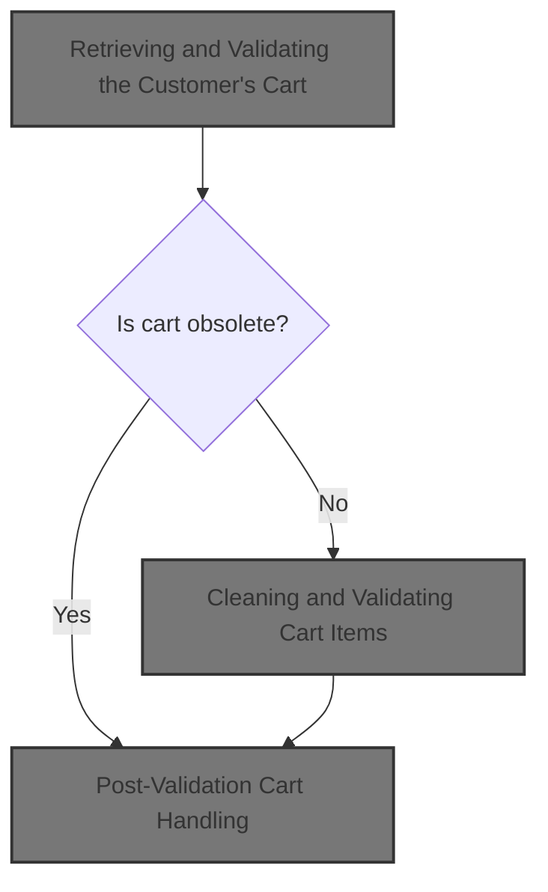
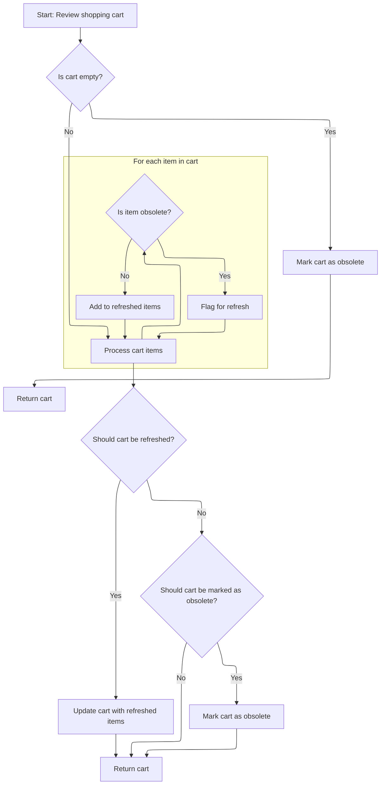

This document describes how the system retrieves and validates a customer's shopping cart to ensure only valid and current items are shown. When a customer requests their cart, the system checks if the cart is obsolete and deletes it if necessary. If the cart exists, it is cleaned by removing obsolete or invalid items and updating each item with the latest product information. If the cart is empty or obsolete after cleanup, it is not returned.



# Retrieving and Validating the Customer's Cart

This section ensures that when a customer requests their shopping cart, only a valid and non-obsolete cart is returned. If the cart is obsolete, it is deleted and not provided to the customer.

| Category       | Rule Name               | Description                                                                                                |
| -------------- | ----------------------- | ---------------------------------------------------------------------------------------------------------- |
| Business logic | Customer cart retrieval | A shopping cart must be retrieved for the customer based on their current session or identity.             |
| Business logic | Obsolete cart removal   | If the retrieved shopping cart is marked as obsolete, it must be deleted and not returned to the customer. |

<SwmSnippet path="/shopizer/sm-core/src/main/java/com/salesmanager/core/business/shoppingcart/service/ShoppingCartServiceImpl.java" line="68">

---

In `getShoppingCart`, we kick off by fetching the cart for the given customer using the DAO. This is necessary because we need the current state of the cart to decide if it's still valid. We call `getByCustomer` next to get the cart and immediately check if it's obsolete, so we can enforce the rule that obsolete carts are deleted and not returned.

```java
	public ShoppingCart getShoppingCart(final Customer customer) throws ServiceException {

		try {

			ShoppingCart shoppingCart = shoppingCartDao.getByCustomer(customer);
```

---

</SwmSnippet>

## Loading and Preparing the Cart Data

This section ensures that when a customer accesses their shopping cart, they receive an up-to-date and accurate representation of their intended purchases, free from obsolete or invalid items.

| Category       | Rule Name                          | Description                                                                                                                                            |
| -------------- | ---------------------------------- | ------------------------------------------------------------------------------------------------------------------------------------------------------ |
| Business logic | No Cart for Customer Without Cart  | If a customer does not have an existing shopping cart, no cart is returned for that customer.                                                          |
| Business logic | Cart Cleanup Before Return         | The shopping cart must be cleaned of any obsolete or invalid items before it is returned to the customer.                                              |
| Business logic | Update Cart Items with Latest Data | All items in the shopping cart must be updated to reflect the latest product information, such as price and availability, before the cart is returned. |

<SwmSnippet path="/shopizer/sm-core/src/main/java/com/salesmanager/core/business/shoppingcart/service/ShoppingCartServiceImpl.java" line="209">

---

`getByCustomer` fetches the cart for the customer and immediately passes it to `populateShoppingCart`. This step is needed to clean up the cart, update its items, and make sure nothing obsolete is left before returning it.

```java
	public ShoppingCart getByCustomer(final Customer customer) throws ServiceException {

		try {
			ShoppingCart shoppingCart = shoppingCartDao.getByCustomer(customer);
			if(shoppingCart==null) {
				return null;
			}
			return populateShoppingCart(shoppingCart);


		} catch (Exception e) {
			throw new ServiceException(e);
		}
	}
```

---

</SwmSnippet>

## Cleaning and Validating Cart Items



This section ensures that the shopping cart is up-to-date by removing obsolete items, marking the cart as obsolete if necessary, and refreshing the cart when items have changed. The goal is to maintain cart integrity and provide users with an accurate view of their shopping cart.

| Category        | Rule Name                    | Description                                                                                                                            |
| --------------- | ---------------------------- | -------------------------------------------------------------------------------------------------------------------------------------- |
| Data validation | Item obsolescence validation | Each item in the cart must be checked for obsolescence. Only items that are not obsolete are retained in the cart.                     |
| Business logic  | Empty cart obsolescence      | If the shopping cart is empty or contains no items, the cart must be marked as obsolete and returned immediately.                      |
| Business logic  | Cart refresh on item removal | If any obsolete items are found and removed, the cart must be refreshed to reflect the current valid items.                            |
| Business logic  | Full cart obsolescence       | If all items in the cart are obsolete, the cart itself must be marked as obsolete.                                                     |
| Business logic  | Return updated cart          | After cleaning and validating, the cart must be returned in its updated state, reflecting any changes to item validity or cart status. |

<SwmSnippet path="/shopizer/sm-core/src/main/java/com/salesmanager/core/business/shoppingcart/service/ShoppingCartServiceImpl.java" line="225">

---

In `populateShoppingCart`, we check if the cart or its items are obsolete. If the cart is empty or null, it's marked obsolete right away. Then we loop through each item, update it, and flag the cart as not obsolete if any item is still valid.

```java
	private ShoppingCart populateShoppingCart(final ShoppingCart shoppingCart) throws Exception {

		try {

			boolean cartIsObsolete = true;
			if(shoppingCart!=null) {

				Set<ShoppingCartItem> items = shoppingCart.getLineItems();
				if(items==null || items.size()==0) {
					shoppingCart.setObsolete(true);
					return shoppingCart;

				}

				//Set<ShoppingCartItem> shoppingCartItems = new HashSet<ShoppingCartItem>();
				for(ShoppingCartItem item : items) {
					LOGGER.debug("Populate item " + item.getId());
					populateItem(item);
					LOGGER.debug("Obsolete item ? " + item.isObsolete());
					if(item.isObsolete()) {
					} else {
						cartIsObsolete = false;
					}
				}
```

---

</SwmSnippet>

<SwmSnippet path="/shopizer/sm-core/src/main/java/com/salesmanager/core/business/shoppingcart/service/ShoppingCartServiceImpl.java" line="250">

---

After checking each item's obsolete status, we build a new set of valid items and flag if any items were removed. This sets up the cart for a refresh if needed.

```java
				//shoppingCart.setLineItems(shoppingCartItems);
				boolean refreshCart = false;
                Set<ShoppingCartItem> refreshedItems = new HashSet<ShoppingCartItem>();
                for(ShoppingCartItem item : items) {
                	if(!item.isObsolete()) {
                		refreshedItems.add(item);
                	} else {
                		refreshCart = true;
                	}
                }
```

---

</SwmSnippet>

<SwmSnippet path="/shopizer/sm-core/src/main/java/com/salesmanager/core/business/shoppingcart/service/ShoppingCartServiceImpl.java" line="261">

---

We return the cart after cleaning it up and marking it obsolete if necessary.

```java
                if(refreshCart) {
                	shoppingCart.setLineItems(refreshedItems);
                	update(shoppingCart);
                }

				if(cartIsObsolete) {
					shoppingCart.setObsolete(true);
				}
				return shoppingCart;
			}

		} catch (Exception e) {
			throw new ServiceException(e);
		}

		return shoppingCart;

	}
```

---

</SwmSnippet>

## Post-Validation Cart Handling

<SwmSnippet path="/shopizer/sm-core/src/main/java/com/salesmanager/core/business/shoppingcart/service/ShoppingCartServiceImpl.java" line="73">

---

Back in `getShoppingCart`, after getting the cart, we run `populateShoppingCart` to make sure the cart is cleaned up and all obsolete items are handled before any further checks.

```java
			populateShoppingCart(shoppingCart);
```

---

</SwmSnippet>

<SwmSnippet path="/shopizer/sm-core/src/main/java/com/salesmanager/core/business/shoppingcart/service/ShoppingCartServiceImpl.java" line="74">

---

After cleaning up the cart, if it's marked obsolete, we delete it and return null. Otherwise, we return the valid cart. This keeps users from seeing or using outdated carts.

```java
			if(shoppingCart!=null && shoppingCart.isObsolete()) {
				delete(shoppingCart);
				return null;
			} else {
				return shoppingCart;
			}


		} catch (Exception e) {
			throw new ServiceException(e);
		}

	}
```

---

</SwmSnippet>

&nbsp;

*This is an auto-generated document by Swimm 🌊 and has not yet been verified by a human*

<SwmMeta version="3.0.0" repo-id="Z2l0aHViJTNBJTNBU2hvcGl6ZXIlM0ElM0F1bWFsaW5nYXN3YW1p" repo-name="Shopizer"><sup>Powered by [Swimm](https://app.swimm.io/)</sup></SwmMeta>
