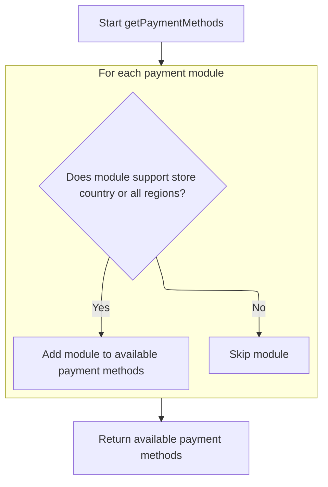

This document describes the flow of retrieving payment methods available for a merchant store by filtering payment modules according to the store's geographical region. The flow receives the merchant store information as input and returns a list of payment methods applicable to that store. It is part of the payment service responsible for presenting valid payment options based on location.

# Filtering Payment Modules by Store Region

This section describes the filtering of payment modules based on the store's region to ensure only applicable payment options are presented.

| Category       | Rule Name                      | Description                                                                                                                                                                |
| -------------- | ------------------------------ | -------------------------------------------------------------------------------------------------------------------------------------------------------------------------- |
| Business logic | Region-based payment filtering | Only payment modules that include the store's country in their region list or have a wildcard '\*' region are considered valid and included in the output list.            |
| Business logic | Empty payment options handling | If no payment modules match the store's region or the wildcard, the output list of payment methods will be empty, indicating no available payment options for that region. |

<SwmSnippet path="/shopizer/sm-core/src/main/java/com/salesmanager/core/business/payments/service/PaymentServiceImpl.java" line="75">

---

In `getPaymentMethods` we start by fetching all payment modules from the module configuration service. This is necessary because we need to filter these modules by the store's region later. The call to `ModuleConfigurationServiceImpl.getIntegrationModules` gives us the full list of payment modules, which we then narrow down based on whether their regions include the store's country or the wildcard '\*'.

```java
	public List<IntegrationModule> getPaymentMethods(MerchantStore store) throws ServiceException {
		
		List<IntegrationModule> modules =  moduleConfigurationService.getIntegrationModules(PAYMENT_MODULES);
```

---

</SwmSnippet>

## Loading and Parsing Payment Module Configurations

```mermaid
%%{init: {"flowchart": {"defaultRenderer": "elk"}} }%%
flowchart TD
    node1["Start: Get integration modules for given module identifier"]
    click node1 openCode "shopizer/sm-core/src/main/java/com/salesmanager/core/business/system/service/ModuleConfigurationServiceImpl.java:50:51"
    node1 --> node2{"Are modules available in cache?"}
    click node2 openCode "shopizer/sm-core/src/main/java/com/salesmanager/core/business/system/service/ModuleConfigurationServiceImpl.java:57:58"
    node2 -->|"Yes"| node3["Return cached modules"]
    click node3 openCode "shopizer/sm-core/src/main/java/com/salesmanager/core/business/system/service/ModuleConfigurationServiceImpl.java:133:134"
    node2 -->|"No"| node4["Fetch modules from database"]
    click node4 openCode "shopizer/sm-core/src/main/java/com/salesmanager/core/business/system/service/ModuleConfigurationServiceImpl.java:59:60"
    node4 --> loop1

    subgraph loop1["For each integration module"]
        node5{"Does module have regions?"}
        click node5 openCode "shopizer/sm-core/src/main/java/com/salesmanager/core/business/system/service/ModuleConfigurationServiceImpl.java:63:66"
        node5 -->|"Yes"| node6["Parse and set regions"]
        click node6 openCode "shopizer/sm-core/src/main/java/com/salesmanager/core/business/system/service/ModuleConfigurationServiceImpl.java:67:70"
        node5 -->|"No"| node8
        node6 --> node8

        node8{"Does module have details?"}
        click node8 openCode "shopizer/sm-core/src/main/java/com/salesmanager/core/business/system/service/ModuleConfigurationServiceImpl.java:74:80"
        node8 -->|"Yes"| node9["Parse and set details"]
        click node9 openCode "shopizer/sm-core/src/main/java/com/salesmanager/core/business/system/service/ModuleConfigurationServiceImpl.java:79:80"
        node8 -->|"No"| node11
        node9 --> node11

        node11{"Does module have configuration?"}
        click node11 openCode "shopizer/sm-core/src/main/java/com/salesmanager/core/business/system/service/ModuleConfigurationServiceImpl.java:86:120"
        node11 -->|"Yes"| node12["Parse and set configuration"]
        click node12 openCode "shopizer/sm-core/src/main/java/com/salesmanager/core/business/system/service/ModuleConfigurationServiceImpl.java:91:120"
        node11 -->|"No"| node14
        node12 --> node14
    end

    loop1 --> node15["Cache enriched modules for future requests"]
    click node15 openCode "shopizer/sm-core/src/main/java/com/salesmanager/core/business/system/service/ModuleConfigurationServiceImpl.java:127:128"
    node15 --> node3

    node3 --> node16["Return list of integration modules"]
    click node16 openCode "shopizer/sm-core/src/main/java/com/salesmanager/core/business/system/service/ModuleConfigurationServiceImpl.java:133:134"
classDef HeadingStyle fill:#777777,stroke:#333,stroke-width:2px;
```



This section handles loading and parsing payment module configurations, including caching and JSON parsing of module details, regions, and configurations.

| Category       | Rule Name                    | Description                                                                                                        |
| -------------- | ---------------------------- | ------------------------------------------------------------------------------------------------------------------ |
| Business logic | Return enriched modules list | Always return the list of integration modules enriched with parsed data, whether retrieved from cache or database. |

<SwmSnippet path="/shopizer/sm-core/src/main/java/com/salesmanager/core/business/system/service/ModuleConfigurationServiceImpl.java" line="50">

---

In `getIntegrationModules` we first try to get the list of modules from cache using a key built from "INTEGRATION_M)" plus the module string. If not cached, we fetch from the DAO. Then, for each module, we parse JSON strings representing regions, details, and configurations into Java collections. This parsing populates sets and maps inside the module, making the data usable for filtering and configuration.

```java
	public List<IntegrationModule> getIntegrationModules(String module) {
		
		
		List<IntegrationModule> modules = null;
		try {
			
			//CacheUtils cacheUtils = CacheUtils.getInstance();
			modules = (List<IntegrationModule>) cache.getFromCache("INTEGRATION_M)" + module);
			if(modules==null) {
				modules = integrationModuleDao.getModulesConfiguration(module);
				//set json objects
				for(IntegrationModule mod : modules) {
					
					String regions = mod.getRegions();
					if(regions!=null) {
						Object objRegions=JSONValue.parse(regions); 
						JSONArray arrayRegions=(JSONArray)objRegions;
						Iterator i = arrayRegions.iterator();
						while(i.hasNext()) {
							mod.getRegionsSet().add((String)i.next());
						}
					}
					
					
					String details = mod.getConfigDetails();
					if(details!=null) {
						
						//Map objects = mapper.readValue(config, Map.class);

						Map<String,String> objDetails= (Map<String, String>) JSONValue.parse(details); 
						mod.setDetails(objDetails);

						
					}
					
					
					String configs = mod.getConfiguration();
					if(configs!=null) {
						
						//Map objects = mapper.readValue(config, Map.class);

						Object objConfigs=JSONValue.parse(configs); 
						JSONArray arrayConfigs=(JSONArray)objConfigs;
						
						Map<String,ModuleConfig> moduleConfigs = new HashMap<String,ModuleConfig>();
						
						Iterator i = arrayConfigs.iterator();
						while(i.hasNext()) {
							
							Map values = (Map)i.next();
							String env = (String)values.get("env");
		            		ModuleConfig config = new ModuleConfig();
		            		config.setScheme((String)values.get("scheme"));
		            		config.setHost((String)values.get("host"));
		            		config.setPort((String)values.get("port"));
		            		config.setUri((String)values.get("uri"));
		            		config.setEnv((String)values.get("env"));
		            		if((String)values.get("config1")!=null) {
		            			config.setConfig1((String)values.get("config1"));
		            		}
		            		if((String)values.get("config2")!=null) {
		            			config.setConfig1((String)values.get("config2"));
		            		}
		            		
		            		moduleConfigs.put(env, config);
		            		
		            		
							
						}
						
						mod.setModuleConfigs(moduleConfigs);
						

					}


				}
```

---

</SwmSnippet>

<SwmSnippet path="/shopizer/sm-core/src/main/java/com/salesmanager/core/business/system/service/ModuleConfigurationServiceImpl.java" line="127">

---

After parsing and populating the modules, the function caches the list using a key with prefix "INTEGRATION_M)" plus the module string, then returns this list. This caching speeds up future retrievals of the same module type.

```java
				cache.putInCache(modules, "INTEGRATION_M)" + module);
			}

		} catch (Exception e) {
			LOGGER.error("getIntegrationModules()", e);
		}
		return modules;
		
		
	}
```

---

</SwmSnippet>

## Filtering Modules by Store Country and Wildcard Regions



<SwmSnippet path="/shopizer/sm-core/src/main/java/com/salesmanager/core/business/payments/service/PaymentServiceImpl.java" line="78">

---

After getting all modules, `getPaymentMethods` filters them by checking if the module's regions set contains the store's country ISO code or the wildcard '\*'. The wildcard means the module is universally available. We assume the store has a valid country and ISO code for this check to work.

```java
		List<IntegrationModule> returnModules = new ArrayList<IntegrationModule>();
		
		for(IntegrationModule module : modules) {
			if(module.getRegionsSet().contains(store.getCountry().getIsoCode())
					|| module.getRegionsSet().contains("*")) {
				
				returnModules.add(module);
			}
		}
```

---

</SwmSnippet>

&nbsp;

*This is an auto-generated document by Swimm 🌊 and has not yet been verified by a human*

<SwmMeta version="3.0.0" repo-id="Z2l0aHViJTNBJTNBU2hvcGl6ZXIlM0ElM0F1bWFsaW5nYXN3YW1p" repo-name="Shopizer"><sup>Powered by [Swimm](https://app.swimm.io/)</sup></SwmMeta>
