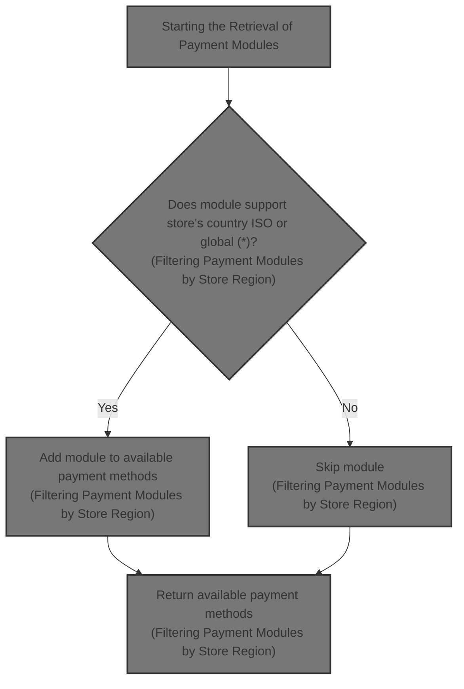
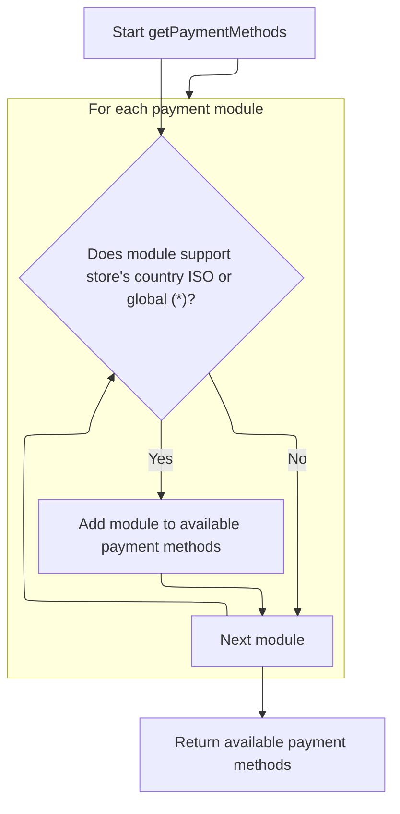

This document describes the flow of retrieving payment methods for a merchant store by fetching all payment modules and filtering them based on the store's country region. The flow receives the merchant store information as input and returns a list of payment methods applicable to the store's location.



# Starting the Retrieval of Payment Modules

This section describes the process of retrieving payment modules relevant to a merchant store by filtering available modules based on the store's country region.

| Category       | Rule Name                                 | Description                                                                                                               |
| -------------- | ----------------------------------------- | ------------------------------------------------------------------------------------------------------------------------- |
| Business logic | Retrieve all payment modules              | The system must retrieve the complete list of payment integration modules before filtering.                               |
| Business logic | Filter modules by store region            | Only payment modules that are applicable to the store's country region should be included in the final list.              |
| Business logic | Use region info from module configuration | The region information used to filter payment modules must come from the module configuration service to ensure accuracy. |

<SwmSnippet path="/shopizer/sm-core/src/main/java/com/salesmanager/core/business/payments/service/PaymentServiceImpl.java" line="75">

---

Here in PaymentServiceImpl.getPaymentMethods, we start by fetching all payment modules using getIntegrationModules. This is necessary because we need the full list of modules to filter them by the store's country region later. The call to ModuleConfigurationServiceImpl.getIntegrationModules gives us these modules with their region info, so we can decide which ones apply to the store.

```java
	public List<IntegrationModule> getPaymentMethods(MerchantStore store) throws ServiceException {
		
		List<IntegrationModule> modules =  moduleConfigurationService.getIntegrationModules(PAYMENT_MODULES);
```

---

</SwmSnippet>

## Fetching and Preparing Integration Modules

```mermaid
%%{init: {"flowchart": {"defaultRenderer": "elk"}} }%%
flowchart TD
    node1["Start: Request integration modules for given module"]
    click node1 openCode "shopizer/sm-core/src/main/java/com/salesmanager/core/business/system/service/ModuleConfigurationServiceImpl.java:50:51"
    node1 --> node2{"Modules found in cache?"}
    click node2 openCode "shopizer/sm-core/src/main/java/com/salesmanager/core/business/system/service/ModuleConfigurationServiceImpl.java:57:58"
    node2 -->|"Yes"| node3["Return cached modules"]
    click node3 openCode "shopizer/sm-core/src/main/java/com/salesmanager/core/business/system/service/ModuleConfigurationServiceImpl.java:133:134"
    node2 -->|"No"| node4["Fetch modules from database"]
    click node4 openCode "shopizer/sm-core/src/main/java/com/salesmanager/core/business/system/service/ModuleConfigurationServiceImpl.java:59:60"
    node4 --> loop1

    subgraph loop1["For each integration module"]
        node5{"Regions defined?"}
        click node5 openCode "shopizer/sm-core/src/main/java/com/salesmanager/core/business/system/service/ModuleConfigurationServiceImpl.java:63:66"
        node5 -->|"Yes"| node6["Parse and add regions to module"]
        click node6 openCode "shopizer/sm-core/src/main/java/com/salesmanager/core/business/system/service/ModuleConfigurationServiceImpl.java:67:70"
        node5 -->|"No"| node7["Skip regions"]
        node6 --> node8
        node7 --> node8

        node8{"Details defined?"}
        click node8 openCode "shopizer/sm-core/src/main/java/com/salesmanager/core/business/system/service/ModuleConfigurationServiceImpl.java:74:80"
        node8 -->|"Yes"| node9["Parse and set module details"]
        click node9 openCode "shopizer/sm-core/src/main/java/com/salesmanager/core/business/system/service/ModuleConfigurationServiceImpl.java:79:80"
        node8 -->|"No"| node10["Skip details"]
        node9 --> node11
        node10 --> node11

        node11{"Configurations defined?"}
        click node11 openCode "shopizer/sm-core/src/main/java/com/salesmanager/core/business/system/service/ModuleConfigurationServiceImpl.java:86:120"
        node11 -->|"Yes"| loop2
        node11 -->|"No"| node12["Skip configurations"]

        subgraph loop2["For each configuration in module"]
            node13["Parse configuration and create ModuleConfig"]
            click node13 openCode "shopizer/sm-core/src/main/java/com/salesmanager/core/business/system/service/ModuleConfigurationServiceImpl.java:97:114"
            node13 --> node14["Add ModuleConfig to moduleConfigs map"]
            click node14 openCode "shopizer/sm-core/src/main/java/com/salesmanager/core/business/system/service/ModuleConfigurationServiceImpl.java:114:114"
            node14 --> node15["Continue configuration iteration"]
        end

        node12 --> node16["Set module configurations"]
        click node16 openCode "shopizer/sm-core/src/main/java/com/salesmanager/core/business/system/service/ModuleConfigurationServiceImpl.java:120:120"
        node15 --> node16
        node16 --> node17["Continue to next module"]
    end

    node17 --> node18["Cache modules"]
    click node18 openCode "shopizer/sm-core/src/main/java/com/salesmanager/core/business/system/service/ModuleConfigurationServiceImpl.java:127:127"
    node18 --> node19["Return modules"]
    click node19 openCode "shopizer/sm-core/src/main/java/com/salesmanager/core/business/system/service/ModuleConfigurationServiceImpl.java:133:134"
classDef HeadingStyle fill:#777777,stroke:#333,stroke-width:2px;
```



This section describes the process of fetching integration modules for a given module name, including caching, database retrieval, and parsing of module configuration data.

<SwmSnippet path="/shopizer/sm-core/src/main/java/com/salesmanager/core/business/system/service/ModuleConfigurationServiceImpl.java" line="50">

---

In getIntegrationModules, we first try to get the modules from cache to avoid hitting the database. If not cached, we fetch from the DAO. Then, we parse JSON strings in each module to fill in regions sets, details maps, and environment-specific configuration maps. This parsing turns raw JSON into usable data structures. There's a bug where config2 overwrites config1, which likely breaks config2 handling.

```java
	public List<IntegrationModule> getIntegrationModules(String module) {
		
		
		List<IntegrationModule> modules = null;
		try {
			
			//CacheUtils cacheUtils = CacheUtils.getInstance();
			modules = (List<IntegrationModule>) cache.getFromCache("INTEGRATION_M)" + module);
			if(modules==null) {
				modules = integrationModuleDao.getModulesConfiguration(module);
				//set json objects
				for(IntegrationModule mod : modules) {
					
					String regions = mod.getRegions();
					if(regions!=null) {
						Object objRegions=JSONValue.parse(regions); 
						JSONArray arrayRegions=(JSONArray)objRegions;
						Iterator i = arrayRegions.iterator();
						while(i.hasNext()) {
							mod.getRegionsSet().add((String)i.next());
						}
					}
					
					
					String details = mod.getConfigDetails();
					if(details!=null) {
						
						//Map objects = mapper.readValue(config, Map.class);

						Map<String,String> objDetails= (Map<String, String>) JSONValue.parse(details); 
						mod.setDetails(objDetails);

						
					}
					
					
					String configs = mod.getConfiguration();
					if(configs!=null) {
						
						//Map objects = mapper.readValue(config, Map.class);

						Object objConfigs=JSONValue.parse(configs); 
						JSONArray arrayConfigs=(JSONArray)objConfigs;
						
						Map<String,ModuleConfig> moduleConfigs = new HashMap<String,ModuleConfig>();
						
						Iterator i = arrayConfigs.iterator();
						while(i.hasNext()) {
							
							Map values = (Map)i.next();
							String env = (String)values.get("env");
		            		ModuleConfig config = new ModuleConfig();
		            		config.setScheme((String)values.get("scheme"));
		            		config.setHost((String)values.get("host"));
		            		config.setPort((String)values.get("port"));
		            		config.setUri((String)values.get("uri"));
		            		config.setEnv((String)values.get("env"));
		            		if((String)values.get("config1")!=null) {
		            			config.setConfig1((String)values.get("config1"));
		            		}
		            		if((String)values.get("config2")!=null) {
		            			config.setConfig1((String)values.get("config2"));
		            		}
		            		
		            		moduleConfigs.put(env, config);
		            		
		            		
							
						}
						
						mod.setModuleConfigs(moduleConfigs);
						

					}


				}
```

---

</SwmSnippet>

<SwmSnippet path="/shopizer/sm-core/src/main/java/com/salesmanager/core/business/system/service/ModuleConfigurationServiceImpl.java" line="127">

---

After parsing, we put the modules list into cache with a key based on the module name. If the list was already cached, we skip the DB call and return the cached list directly. This caching speeds up repeated calls by avoiding database access.

```java
				cache.putInCache(modules, "INTEGRATION_M)" + module);
			}

		} catch (Exception e) {
			LOGGER.error("getIntegrationModules()", e);
		}
		return modules;
		
		
	}
```

---

</SwmSnippet>

## Filtering Payment Modules by Store Region



<SwmSnippet path="/shopizer/sm-core/src/main/java/com/salesmanager/core/business/payments/service/PaymentServiceImpl.java" line="78">

---

After getting all modules, we filter them by checking if their regions set contains the store's country ISO code or the wildcard '\*'. The wildcard means the module is available everywhere. We assume the store's country and ISO code are set, or this check could fail.

```java
		List<IntegrationModule> returnModules = new ArrayList<IntegrationModule>();
		
		for(IntegrationModule module : modules) {
			if(module.getRegionsSet().contains(store.getCountry().getIsoCode())
					|| module.getRegionsSet().contains("*")) {
				
				returnModules.add(module);
			}
		}
```

---

</SwmSnippet>

&nbsp;

*This is an auto-generated document by Swimm 🌊 and has not yet been verified by a human*

<SwmMeta version="3.0.0" repo-id="Z2l0aHViJTNBJTNBU2hvcGl6ZXIlM0ElM0F1bWFsaW5nYXN3YW1p" repo-name="Shopizer"><sup>Powered by [Swimm](https://app.swimm.io/)</sup></SwmMeta>
