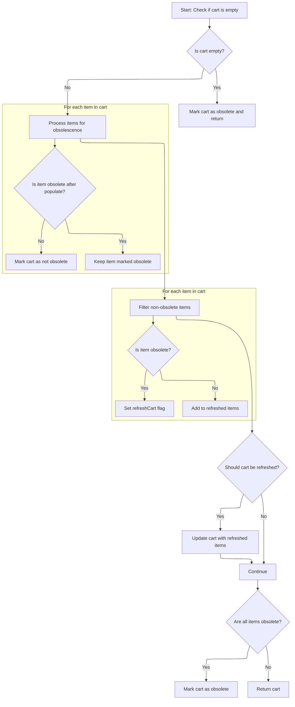
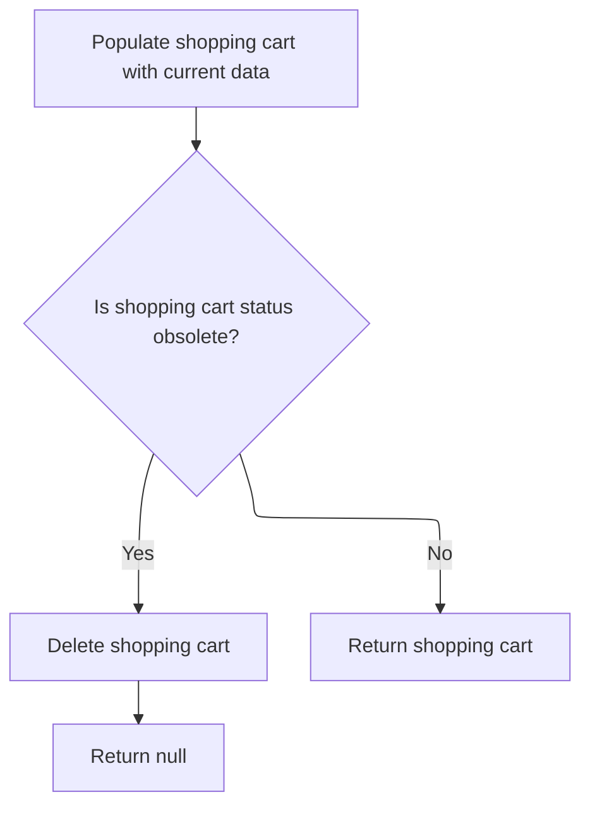

This document describes how the system retrieves a customer's shopping cart, ensuring only the most current and valid cart is available. The process receives a customer as input and returns either a refreshed shopping cart or null if no valid cart exists. This guarantees customers interact with up-to-date cart information.

# Starting the cart retrieval

This section is responsible for obtaining the latest shopping cart for a customer, ensuring that any further actions are based on the most current cart state. If the cart is found to be obsolete, it is removed and no cart is returned.

| Category       | Rule Name                  | Description                                                                                                                      |
| -------------- | -------------------------- | -------------------------------------------------------------------------------------------------------------------------------- |
| Business logic | Retrieve latest cart state | Always retrieve the most recent shopping cart associated with the customer before performing any cart-related operations.        |
| Business logic | Handle obsolete cart       | If the retrieved shopping cart is determined to be obsolete, it must be deleted and no cart should be returned for the customer. |

<SwmSnippet path="/shopizer/sm-core/src/main/java/com/salesmanager/core/business/shoppingcart/service/ShoppingCartServiceImpl.java" line="68">

---

In `getShoppingCart`, we kick off by fetching the cart for a customer using getByCustomer. This is needed because we want the latest cart state, and we need to check if it's obsolete before doing anything else. If it's obsolete, we handle that later by deleting it and returning null.

```java
	public ShoppingCart getShoppingCart(final Customer customer) throws ServiceException {

		try {

			ShoppingCart shoppingCart = shoppingCartDao.getByCustomer(customer);
```

---

</SwmSnippet>

## Fetching the customer's cart

This section is responsible for retrieving a customer's shopping cart and ensuring that the cart is current and free of obsolete items before it is used in further business processes.

| Category       | Rule Name            | Description                                                                                                                   |
| -------------- | -------------------- | ----------------------------------------------------------------------------------------------------------------------------- |
| Business logic | No Cart for Customer | If a customer does not have an existing shopping cart, the system must return a null value to indicate the absence of a cart. |
| Business logic | Cart Cleanup         | Any shopping cart returned for a customer must be cleaned of obsolete items before being used in further business processes.  |

<SwmSnippet path="/shopizer/sm-core/src/main/java/com/salesmanager/core/business/shoppingcart/service/ShoppingCartServiceImpl.java" line="209">

---

`getByCustomer` fetches the cart and runs it through populateShoppingCart to clean up any obsolete items and keep the cart current.

```java
	public ShoppingCart getByCustomer(final Customer customer) throws ServiceException {

		try {
			ShoppingCart shoppingCart = shoppingCartDao.getByCustomer(customer);
			if(shoppingCart==null) {
				return null;
			}
			return populateShoppingCart(shoppingCart);


		} catch (Exception e) {
			throw new ServiceException(e);
		}
	}
```

---

</SwmSnippet>

## Refreshing cart items



This section is responsible for refreshing the shopping cart by removing obsolete items, updating the cart's status, and ensuring the cart reflects the current valid state of its items. It ensures that users do not proceed with obsolete or unavailable products in their cart.

| Category       | Rule Name                 | Description                                                                                                           |
| -------------- | ------------------------- | --------------------------------------------------------------------------------------------------------------------- |
| Business logic | Empty cart obsolescence   | If the shopping cart is empty or contains no items, the cart must be marked as obsolete and returned immediately.     |
| Business logic | Remove obsolete items     | Any item in the cart that is marked as obsolete must not be included in the refreshed cart items.                     |
| Business logic | All items obsolete        | If all items in the cart are obsolete, the cart itself must be marked as obsolete.                                    |
| Business logic | Update cart after removal | If any obsolete items are removed from the cart, the cart's items must be updated to only include non-obsolete items. |
| Business logic | Active cart preservation  | If the cart is not empty and contains at least one non-obsolete item, the cart must not be marked as obsolete.        |

<SwmSnippet path="/shopizer/sm-core/src/main/java/com/salesmanager/core/business/shoppingcart/service/ShoppingCartServiceImpl.java" line="225">

---

In `populateShoppingCart`, we check if the cart or its items are obsolete. If the cart is empty or null, we mark it obsolete and bail out. Otherwise, we loop through each item, updating its state and tracking if the cart should be considered obsolete.

```java
	private ShoppingCart populateShoppingCart(final ShoppingCart shoppingCart) throws Exception {

		try {

			boolean cartIsObsolete = true;
			if(shoppingCart!=null) {

				Set<ShoppingCartItem> items = shoppingCart.getLineItems();
				if(items==null || items.size()==0) {
					shoppingCart.setObsolete(true);
					return shoppingCart;

				}

				//Set<ShoppingCartItem> shoppingCartItems = new HashSet<ShoppingCartItem>();
				for(ShoppingCartItem item : items) {
					LOGGER.debug("Populate item " + item.getId());
					populateItem(item);
					LOGGER.debug("Obsolete item ? " + item.isObsolete());
					if(item.isObsolete()) {
					} else {
						cartIsObsolete = false;
					}
				}
```

---

</SwmSnippet>

<SwmSnippet path="/shopizer/sm-core/src/main/java/com/salesmanager/core/business/shoppingcart/service/ShoppingCartServiceImpl.java" line="250">

---

We filter out obsolete items and prep the cart for an update if anything was removed.

```java
				//shoppingCart.setLineItems(shoppingCartItems);
				boolean refreshCart = false;
                Set<ShoppingCartItem> refreshedItems = new HashSet<ShoppingCartItem>();
                for(ShoppingCartItem item : items) {
                	if(!item.isObsolete()) {
                		refreshedItems.add(item);
                	} else {
                		refreshCart = true;
                	}
                }
```

---

</SwmSnippet>

<SwmSnippet path="/shopizer/sm-core/src/main/java/com/salesmanager/core/business/shoppingcart/service/ShoppingCartServiceImpl.java" line="261">

---

Finally, we update the cart if items were removed, mark it obsolete if needed, and return the cart. This wraps up the refresh and cleanup logic before handing the cart back to the caller.

```java
                if(refreshCart) {
                	shoppingCart.setLineItems(refreshedItems);
                	update(shoppingCart);
                }

				if(cartIsObsolete) {
					shoppingCart.setObsolete(true);
				}
				return shoppingCart;
			}

		} catch (Exception e) {
			throw new ServiceException(e);
		}

		return shoppingCart;

	}
```

---

</SwmSnippet>

## Validating and cleaning up the cart



<SwmSnippet path="/shopizer/sm-core/src/main/java/com/salesmanager/core/business/shoppingcart/service/ShoppingCartServiceImpl.java" line="73">

---

Back in `getShoppingCart`, after getting the cart from getByCustomer, we run populateShoppingCart to make sure the cart is fully refreshed and cleaned up before any further checks.

```java
			populateShoppingCart(shoppingCart);
```

---

</SwmSnippet>

<SwmSnippet path="/shopizer/sm-core/src/main/java/com/salesmanager/core/business/shoppingcart/service/ShoppingCartServiceImpl.java" line="74">

---

After populateShoppingCart finishes, we check if the cart is obsolete. If it is, we delete it and return null; otherwise, we return the cleaned-up cart. This keeps only valid carts in play.

```java
			if(shoppingCart!=null && shoppingCart.isObsolete()) {
				delete(shoppingCart);
				return null;
			} else {
				return shoppingCart;
			}


		} catch (Exception e) {
			throw new ServiceException(e);
		}

	}
```

---

</SwmSnippet>

&nbsp;

*This is an auto-generated document by Swimm 🌊 and has not yet been verified by a human*

<SwmMeta version="3.0.0" repo-id="Z2l0aHViJTNBJTNBU2hvcGl6ZXIlM0ElM0F1bWFsaW5nYXN3YW1p" repo-name="Shopizer"><sup>Powered by [Swimm](https://app.swimm.io/)</sup></SwmMeta>
