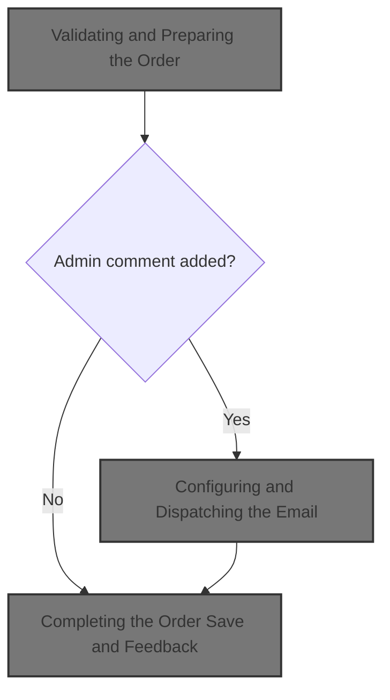

This document describes the flow for saving an order in the admin order management system. Admin users submit orders with customer and billing details, which are validated and saved. If an admin comment is added, the customer receives an email notification with order information.



# Validating and Preparing the Order

This section is responsible for validating and preparing an order for saving, ensuring all required fields are present and correct, updating order status history, and notifying the customer via email if an admin comment is added.

| Category        | Rule Name                              | Description                                                                                                                                                                                                                                                                                                                                                                                                                                                                                                                                                                                                                                                                                                                                                                                                                                                                                                                                                                      |
| --------------- | -------------------------------------- | -------------------------------------------------------------------------------------------------------------------------------------------------------------------------------------------------------------------------------------------------------------------------------------------------------------------------------------------------------------------------------------------------------------------------------------------------------------------------------------------------------------------------------------------------------------------------------------------------------------------------------------------------------------------------------------------------------------------------------------------------------------------------------------------------------------------------------------------------------------------------------------------------------------------------------------------------------------------------------- |
| Data validation | Customer email validation              | The order must have a valid customer email address that matches the format: \[<SwmToken path="shopizer/sm-shop/src/main/java/com/salesmanager/web/admin/controller/orders/OrderControler.java" pos="214:11:19" line-data="		String email_regEx = &quot;\\b[A-Za-z0-9._%+-]+@[A-Za-z0-9.-]+\\.[A-Za-z]{2,4}\\b&quot;;">`A-Za-z0-9._`</SwmToken>%+-\]+@\[<SwmToken path="shopizer/sm-shop/src/main/java/com/salesmanager/web/admin/controller/orders/OrderControler.java" pos="214:11:17" line-data="		String email_regEx = &quot;\\b[A-Za-z0-9._%+-]+@[A-Za-z0-9.-]+\\.[A-Za-z]{2,4}\\b&quot;;">`A-Za-z0-9`</SwmToken>.-\]+.\[<SwmToken path="shopizer/sm-shop/src/main/java/com/salesmanager/web/admin/controller/orders/OrderControler.java" pos="214:35:39" line-data="		String email_regEx = &quot;\\b[A-Za-z0-9._%+-]+@[A-Za-z0-9.-]+\\.[A-Za-z]{2,4}\\b&quot;;">`A-Za-z`</SwmToken>\]{2,4}. If the email is missing or invalid, an error is raised and the order cannot be saved. |
| Data validation | Billing address completeness           | The order must include non-empty billing first name, last name, street address, city, and postal code. If any of these fields are missing, an error is raised and the order cannot be saved.                                                                                                                                                                                                                                                                                                                                                                                                                                                                                                                                                                                                                                                                                                                                                                                     |
| Data validation | Billing region requirement             | If the billing zone is not provided, the billing state must be specified. If both are missing, an error is raised and the order cannot be saved.                                                                                                                                                                                                                                                                                                                                                                                                                                                                                                                                                                                                                                                                                                                                                                                                                                 |
| Business logic  | Customer notification on admin comment | If the order history comment is provided by the admin, the customer must be notified via email. The email includes the order number, date ordered, status comments, and date updated.                                                                                                                                                                                                                                                                                                                                                                                                                                                                                                                                                                                                                                                                                                                                                                                            |
| Business logic  | Payment transaction availability       | If the order has payment transactions that are capturable or refundable (excluding MONEYORDER payment type), the corresponding transaction information must be made available in the view for further processing.                                                                                                                                                                                                                                                                                                                                                                                                                                                                                                                                                                                                                                                                                                                                                                |

<SwmSnippet path="/shopizer/sm-shop/src/main/java/com/salesmanager/web/admin/controller/orders/OrderControler.java" line="212">

---

In <SwmToken path="shopizer/sm-shop/src/main/java/com/salesmanager/web/admin/controller/orders/OrderControler.java" pos="212:5:5" line-data="	public String saveOrder(@Valid @ModelAttribute(&quot;order&quot;) com.salesmanager.web.admin.entity.orders.Order entityOrder, BindingResult result, Model model, HttpServletRequest request, Locale locale) throws Exception {">`saveOrder`</SwmToken>, we kick off the flow by validating order fields, setting up model attributes for the view, handling payment transactions, and updating order status history. If an admin adds a comment to the order history, we prep an email notification for the customer. That's why the next step is calling the email service—it's responsible for actually sending out that notification email.

```java
	public String saveOrder(@Valid @ModelAttribute("order") com.salesmanager.web.admin.entity.orders.Order entityOrder, BindingResult result, Model model, HttpServletRequest request, Locale locale) throws Exception {
		
		String email_regEx = "\\b[A-Za-z0-9._%+-]+@[A-Za-z0-9.-]+\\.[A-Za-z]{2,4}\\b";
		Pattern pattern = Pattern.compile(email_regEx);
		
		Language language = (Language)request.getAttribute("LANGUAGE");
		List<Country> countries = countryService.getCountries(language);
		model.addAttribute("countries", countries);
		
		MerchantStore store = (MerchantStore)request.getAttribute(Constants.ADMIN_STORE);
		
		//set the id if fails
		entityOrder.setId(entityOrder.getOrder().getId());
		
		model.addAttribute("order", entityOrder);
		
		Set<OrderProduct> orderProducts = new HashSet<OrderProduct>();
		Set<OrderTotal> orderTotal = new HashSet<OrderTotal>();
		Set<OrderStatusHistory> orderHistory = new HashSet<OrderStatusHistory>();
		
		Date date = new Date();
		if(!StringUtils.isBlank(entityOrder.getDatePurchased() ) ){
			try {
				date = DateUtil.getDate(entityOrder.getDatePurchased());
			} catch (Exception e) {
				ObjectError error = new ObjectError("datePurchased",messages.getMessage("message.invalid.date", locale));
				result.addError(error);
			}
			
		} else{
			date = null;
		}
		 

		if(!StringUtils.isBlank(entityOrder.getOrder().getCustomerEmailAddress() ) ){
			 java.util.regex.Matcher matcher = pattern.matcher(entityOrder.getOrder().getCustomerEmailAddress());
			 
			 if(!matcher.find()) {
				ObjectError error = new ObjectError("customerEmailAddress",messages.getMessage("Email.order.customerEmailAddress", locale));
				result.addError(error);
			 }
		}else{
			ObjectError error = new ObjectError("customerEmailAddress",messages.getMessage("NotEmpty.order.customerEmailAddress", locale));
			result.addError(error);
		}

		 
		if( StringUtils.isBlank(entityOrder.getOrder().getBilling().getFirstName() ) ){
			 ObjectError error = new ObjectError("billingFirstName", messages.getMessage("NotEmpty.order.billingFirstName", locale));
			 result.addError(error);
		}
		
		if( StringUtils.isBlank(entityOrder.getOrder().getBilling().getFirstName() ) ){
			 ObjectError error = new ObjectError("billingLastName", messages.getMessage("NotEmpty.order.billingLastName", locale));
			 result.addError(error);
		}
		 
		if( StringUtils.isBlank(entityOrder.getOrder().getBilling().getAddress() ) ){
			 ObjectError error = new ObjectError("billingAddress", messages.getMessage("NotEmpty.order.billingStreetAddress", locale));
			 result.addError(error);
		}
		 
		if( StringUtils.isBlank(entityOrder.getOrder().getBilling().getCity() ) ){
			 ObjectError error = new ObjectError("billingCity",messages.getMessage("NotEmpty.order.billingCity", locale));
			 result.addError(error);
		}
		 
		if( entityOrder.getOrder().getBilling().getZone()==null){
			if( StringUtils.isBlank(entityOrder.getOrder().getBilling().getState())){
				 ObjectError error = new ObjectError("billingState",messages.getMessage("NotEmpty.order.billingState", locale));
				 result.addError(error);
			}
		}
		 
		if( StringUtils.isBlank(entityOrder.getOrder().getBilling().getPostalCode() ) ){
			 ObjectError error = new ObjectError("billingPostalCode", messages.getMessage("NotEmpty.order.billingPostCode", locale));
			 result.addError(error);
		}
		
		com.salesmanager.core.business.order.model.Order newOrder = orderService.getById(entityOrder.getOrder().getId() );
		
		
		//get capturable
		if(newOrder.getPaymentType().name() != PaymentType.MONEYORDER.name()) {
			Transaction capturableTransaction = transactionService.getCapturableTransaction(newOrder);
			if(capturableTransaction!=null) {
				model.addAttribute("capturableTransaction",capturableTransaction);
			}
		}
		
		
		//get refundable
		if(newOrder.getPaymentType().name() != PaymentType.MONEYORDER.name()) {
			Transaction refundableTransaction = transactionService.getRefundableTransaction(newOrder);
			if(refundableTransaction!=null) {
					model.addAttribute("capturableTransaction",null);//remove capturable
					model.addAttribute("refundableTransaction",refundableTransaction);
			}
		}
	
	
		if (result.hasErrors()) {
			//  somehow we lose data, so reset Order detail info.
			entityOrder.getOrder().setOrderProducts( orderProducts);
			entityOrder.getOrder().setOrderTotal(orderTotal);
			entityOrder.getOrder().setOrderHistory(orderHistory);
			
			return ControllerConstants.Tiles.Order.ordersEdit;
		/*	"admin-orders-edit";  */
		}
		
		OrderStatusHistory orderStatusHistory = new OrderStatusHistory();		


		
		Country deliveryCountry = countryService.getByCode( entityOrder.getOrder().getDelivery().getCountry().getIsoCode()); 
		Country billingCountry  = countryService.getByCode( entityOrder.getOrder().getBilling().getCountry().getIsoCode()) ;
		Zone billingZone = null;
		Zone deliveryZone = null;
		if(entityOrder.getOrder().getBilling().getZone()!=null) {
			billingZone = zoneService.getByCode(entityOrder.getOrder().getBilling().getZone().getCode());
		}
		
		if(entityOrder.getOrder().getDelivery().getZone()!=null) {
			deliveryZone = zoneService.getByCode(entityOrder.getOrder().getDelivery().getZone().getCode());
		}

		newOrder.setCustomerEmailAddress(entityOrder.getOrder().getCustomerEmailAddress() );
		newOrder.setStatus(entityOrder.getOrder().getStatus() );		
		
		newOrder.setDatePurchased(date);
		newOrder.setLastModified( new Date() );
		
		if(!StringUtils.isBlank(entityOrder.getOrderHistoryComment() ) ) {
			orderStatusHistory.setComments( entityOrder.getOrderHistoryComment() );
			orderStatusHistory.setCustomerNotified(1);
			orderStatusHistory.setStatus(entityOrder.getOrder().getStatus());
			orderStatusHistory.setDateAdded(new Date() );
			orderStatusHistory.setOrder(newOrder);
			newOrder.getOrderHistory().add( orderStatusHistory );
			entityOrder.setOrderHistoryComment( "" );
		}		
		
		newOrder.setDelivery( entityOrder.getOrder().getDelivery() );
		newOrder.setBilling( entityOrder.getOrder().getBilling() );
		
		newOrder.getDelivery().setCountry(deliveryCountry );
		newOrder.getBilling().setCountry(billingCountry );	
		
		if(billingZone!=null) {
			newOrder.getBilling().setZone(billingZone);
		}
		
		if(deliveryZone!=null) {
			newOrder.getDelivery().setZone(deliveryZone);
		}
		
		orderService.saveOrUpdate(newOrder);
		entityOrder.setOrder(newOrder);
		entityOrder.setBilling(newOrder.getBilling());
		entityOrder.setDelivery(newOrder.getDelivery());
		model.addAttribute("order", entityOrder);
		
		Long customerId = newOrder.getCustomerId();
		
		if(customerId!=null && customerId>0) {
		
			try {
				
				Customer customer = customerService.getById(customerId);
				if(customer!=null) {
					model.addAttribute("customer",customer);
				}
				
				
			} catch(Exception e) {
				LOGGER.error("Error while getting customer for customerId " + customerId, e);
			}
		
		}

		List<OrderProductDownload> orderProductDownloads = orderProdctDownloadService.getByOrderId(newOrder.getId());
		if(CollectionUtils.isNotEmpty(orderProductDownloads)) {
			model.addAttribute("downloads",orderProductDownloads);
		}
		
		
		/** 
		 * send email if admin posted orderHistoryComment
		 * 
		 * **/
		
		if(StringUtils.isBlank(entityOrder.getOrderHistoryComment())) {
		
			try {
				
				Customer customer = customerService.getById(newOrder.getCustomerId());
				Language lang = store.getDefaultLanguage();
				if(customer!=null) {
					lang = customer.getDefaultLanguage();
				}
				
				Locale customerLocale = LocaleUtils.getLocale(lang);

				StringBuilder customerName = new StringBuilder();
				customerName.append(newOrder.getBilling().getFirstName()).append(" ").append(newOrder.getBilling().getLastName());
				
				
				Map<String, String> templateTokens = EmailUtils.createEmailObjectsMap(request.getContextPath(), store, messages, customerLocale);
				templateTokens.put(EmailConstants.EMAIL_CUSTOMER_NAME, customerName.toString());
				templateTokens.put(EmailConstants.EMAIL_TEXT_ORDER_NUMBER, messages.getMessage("email.order.confirmation", new String[]{String.valueOf(newOrder.getId())}, customerLocale));
				templateTokens.put(EmailConstants.EMAIL_TEXT_DATE_ORDERED, messages.getMessage("email.order.ordered", new String[]{entityOrder.getDatePurchased()}, customerLocale));
				templateTokens.put(EmailConstants.EMAIL_TEXT_STATUS_COMMENTS, messages.getMessage("email.order.comments", new String[]{entityOrder.getOrderHistoryComment()}, customerLocale));
				templateTokens.put(EmailConstants.EMAIL_TEXT_DATE_UPDATED, messages.getMessage("email.order.updated", new String[]{DateUtils.formatDate(new Date())}, customerLocale));

				
				Email email = new Email();
				email.setFrom(store.getStorename());
				email.setFromEmail(store.getStoreEmailAddress());
				email.setSubject(messages.getMessage("email.order.status.title",new String[]{String.valueOf(newOrder.getId())},customerLocale));
				email.setTo(entityOrder.getOrder().getCustomerEmailAddress());
				email.setTemplateName(ORDER_STATUS_TMPL);
				email.setTemplateTokens(templateTokens);
	
	
				
				emailService.sendHtmlEmail(store, email);
			
			} catch (Exception e) {
				LOGGER.error("Cannot send email to customer",e);
			}
			
		}
		
```

---

</SwmSnippet>

## Configuring and Dispatching the Email

This section is responsible for configuring the email sender with the merchant store's specific settings and dispatching HTML emails to recipients. It ensures that each email is sent using the correct store configuration.

| Category        | Rule Name                          | Description                                                                                                                                                                          |
| --------------- | ---------------------------------- | ------------------------------------------------------------------------------------------------------------------------------------------------------------------------------------ |
| Data validation | HTML formatting enforcement        | All outgoing emails must be formatted as HTML before dispatch, ensuring consistent presentation and support for rich content.                                                        |
| Business logic  | Store-specific email configuration | The email sender must use the email configuration associated with the merchant store to send emails. No email should be sent using a default or incorrect configuration.             |
| Business logic  | Sender setup requirement           | The sender must be set up with the retrieved email configuration before any email is dispatched, ensuring that all settings (such as SMTP server, authentication, etc.) are applied. |

<SwmSnippet path="/shopizer/sm-core/src/main/java/com/salesmanager/core/business/system/service/EmailServiceImpl.java" line="25">

---

<SwmToken path="shopizer/sm-core/src/main/java/com/salesmanager/core/business/system/service/EmailServiceImpl.java" pos="25:5:5" line-data="	public void sendHtmlEmail(MerchantStore store, Email email) throws ServiceException, Exception {">`sendHtmlEmail`</SwmToken> grabs the store's email config, sets up the sender, and hands off the email to the sender for delivery. We call <SwmToken path="shopizer/sm-core/src/main/java/com/salesmanager/core/modules/email/HtmlEmailSenderImpl.java" pos="83:5:5" line-data="				freemarkerMailConfiguration.setClassForTemplateLoading(HtmlEmailSenderImpl.class, &quot;/&quot;);">`HtmlEmailSenderImpl`</SwmToken> next because that's where the actual email formatting and sending happens.

```java
	public void sendHtmlEmail(MerchantStore store, Email email) throws ServiceException, Exception {

		EmailConfig emailConfig = getEmailConfiguration(store);
		
		sender.setEmailConfig(emailConfig);
		sender.send(email);
	}
```

---

</SwmSnippet>

## Building and Sending the Email Message

This section is responsible for constructing and sending an email message, ensuring both text and HTML versions are generated from templates and that the correct sender, recipient, and subject are used. It also ensures that email configuration settings are applied if available.

| Category        | Rule Name                       | Description                                                                                                                              |
| --------------- | ------------------------------- | ---------------------------------------------------------------------------------------------------------------------------------------- |
| Data validation | Recipient Address Enforcement   | The email must be sent to the recipient address specified in the Email object.                                                           |
| Data validation | Subject Consistency             | The subject of the email must match the subject specified in the Email object.                                                           |
| Data validation | Sender Identity Enforcement     | The sender's name and email address must match those specified in the Email object.                                                      |
| Business logic  | Dual Format Email Generation    | Both text and HTML versions of the email must be generated using the specified template and template tokens.                             |
| Business logic  | Email Configuration Application | If email configuration data is available, it must be used to set the protocol, host, port, username, and password for sending the email. |

<SwmSnippet path="/shopizer/sm-core/src/main/java/com/salesmanager/core/modules/email/HtmlEmailSenderImpl.java" line="40">

---

In <SwmToken path="shopizer/sm-core/src/main/java/com/salesmanager/core/modules/email/HtmlEmailSenderImpl.java" pos="40:5:5" line-data="	public void send(Email email)">`send`</SwmToken>, we set up the email addresses, process the templates for both text and HTML, and build the MIME message. Next, we might need to call OrderServiceImpl if we need to fetch or update order data for the email or for logging.

```java
	public void send(Email email)
			throws Exception {
		
		final String eml = email.getFrom();
		final String from = email.getFromEmail();
		final String to = email.getTo();
		final String subject = email.getSubject();
		final String tmpl = email.getTemplateName();
		final Map<String,String> templateTokens = email.getTemplateTokens();

		MimeMessagePreparator preparator = new MimeMessagePreparator() {
			public void prepare(MimeMessage mimeMessage)
					throws MessagingException, IOException {
				
				JavaMailSenderImpl impl = (JavaMailSenderImpl)mailSender;
				// if email configuration is present in Database, use the same
				if(emailConfig != null) {
					impl.setProtocol(emailConfig.getProtocol());
					impl.setHost(emailConfig.getHost());
					impl.setPort(Integer.parseInt(emailConfig.getPort()));
					impl.setUsername(emailConfig.getUsername());
					impl.setPassword(emailConfig.getPassword());
					
					Properties prop = new Properties();
					prop.put("mail.smtp.auth", emailConfig.isSmtpAuth());
					prop.put("mail.smtp.starttls.enable", emailConfig.isStarttls());
					impl.setJavaMailProperties(prop);
				}
				
				mimeMessage.setRecipient(Message.RecipientType.TO, new InternetAddress(to));

				InternetAddress inetAddress = new InternetAddress();

				inetAddress.setPersonal(eml);
				inetAddress.setAddress(from);

				mimeMessage.setFrom(inetAddress);
				mimeMessage.setSubject(subject);

				Multipart mp = new MimeMultipart("alternative");

				// Create a "text" Multipart message
				BodyPart textPart = new MimeBodyPart();
				freemarkerMailConfiguration.setClassForTemplateLoading(HtmlEmailSenderImpl.class, "/");
				Template textTemplate = freemarkerMailConfiguration.getTemplate(new StringBuilder(TEMPLATE_PATH).append("").append("/").append(tmpl).toString());
				final StringWriter textWriter = new StringWriter();
				try {
					textTemplate.process(templateTokens, textWriter);
				} catch (TemplateException e) {
					throw new MailPreparationException(
							"Can't generate text mail", e);
				}
				textPart.setDataHandler(new javax.activation.DataHandler(
						new javax.activation.DataSource() {
							public InputStream getInputStream()
									throws IOException {
								//return new StringBufferInputStream(textWriter
								//		.toString());
								return new ByteArrayInputStream(textWriter
										.toString().getBytes(CHARSET));
							}

							public OutputStream getOutputStream()
									throws IOException {
								throw new IOException("Read-only data");
							}

							public String getContentType() {
								return "text/plain";
							}

							public String getName() {
								return "main";
							}
						}));
				mp.addBodyPart(textPart);

				// Create a "HTML" Multipart message
				Multipart htmlContent = new MimeMultipart("related");
				BodyPart htmlPage = new MimeBodyPart();
				freemarkerMailConfiguration.setClassForTemplateLoading(HtmlEmailSenderImpl.class, "/");
				Template htmlTemplate = freemarkerMailConfiguration.getTemplate(new StringBuilder(TEMPLATE_PATH).append("").append("/").append(tmpl).toString());
				final StringWriter htmlWriter = new StringWriter();
				try {
					htmlTemplate.process(templateTokens, htmlWriter);
				} catch (TemplateException e) {
					throw new MailPreparationException(
							"Can't generate HTML mail", e);
				}
```

---

</SwmSnippet>

### Processing Order Data for Email

This section is responsible for processing order data to prepare and format the information that will be included in customer-facing emails, such as order confirmations and shipping notifications. The main product role is to ensure that all relevant order details are accurately represented and communicated to the customer via email.

| Category        | Rule Name                    | Description                                                                                                                                          |
| --------------- | ---------------------------- | ---------------------------------------------------------------------------------------------------------------------------------------------------- |
| Data validation | Order Data Validation        | Order data must be validated to ensure that all prices are positive numbers and quantities are greater than zero before including them in the email. |
| Business logic  | Order Confirmation Content   | All order confirmation emails must include the order number, customer name, itemized product list, total price, and estimated delivery date.         |
| Business logic  | Promotional Discount Display | If the order contains any promotional discounts, the email must clearly display the discount amount and the adjusted total price.                    |
| Business logic  | Multiple Shipments Handling  | For orders with multiple shipments, the email must list each shipment separately with its respective tracking number and estimated delivery date.    |

See <SwmLink doc-title="Order Processing Flow">[Order Processing Flow](.swm%5Corder-processing-flow.ltjtzy88.sw.md)</SwmLink>

### Finalizing and Delivering the Email

<SwmSnippet path="/shopizer/sm-core/src/main/java/com/salesmanager/core/modules/email/HtmlEmailSenderImpl.java" line="129">

---

We just came back from OrderServiceImpl, so any order data we needed is now available. In <SwmToken path="shopizer/sm-core/src/main/java/com/salesmanager/core/modules/email/HtmlEmailSenderImpl.java" pos="168:3:3" line-data="		mailSender.send(preparator);">`send`</SwmToken>, we finish building the email with that data, set up the multipart message, and send it out to the customer.

```java
				htmlPage.setDataHandler(new javax.activation.DataHandler(
						new javax.activation.DataSource() {
							public InputStream getInputStream()
									throws IOException {
								//return new StringBufferInputStream(htmlWriter
								//		.toString());
								return new ByteArrayInputStream(textWriter
										.toString().getBytes(CHARSET));
							}

							public OutputStream getOutputStream()
									throws IOException {
								throw new IOException("Read-only data");
							}

							public String getContentType() {
								return "text/html";
							}

							public String getName() {
								return "main";
							}
						}));
				htmlContent.addBodyPart(htmlPage);
				BodyPart htmlPart = new MimeBodyPart();
				htmlPart.setContent(htmlContent);
				mp.addBodyPart(htmlPart);

				mimeMessage.setContent(mp);

				// if(attachment!=null) {
				// MimeMessageHelper messageHelper = new
				// MimeMessageHelper(mimeMessage, true);
				// messageHelper.addAttachment(attachmentFileName, attachment);
				// }

			}
		};

		mailSender.send(preparator);
	}
```

---

</SwmSnippet>

## Completing the Order Save and Feedback

<SwmSnippet path="/shopizer/sm-shop/src/main/java/com/salesmanager/web/admin/controller/orders/OrderControler.java" line="447">

---

We just got back from <SwmToken path="shopizer/sm-core/src/main/java/com/salesmanager/core/business/system/service/EmailServiceImpl.java" pos="16:4:4" line-data="public class EmailServiceImpl implements EmailService {">`EmailServiceImpl`</SwmToken>, so the notification email is sent. In <SwmToken path="shopizer/sm-shop/src/main/java/com/salesmanager/web/admin/controller/orders/OrderControler.java" pos="212:5:5" line-data="	public String saveOrder(@Valid @ModelAttribute(&quot;order&quot;) com.salesmanager.web.admin.entity.orders.Order entityOrder, BindingResult result, Model model, HttpServletRequest request, Locale locale) throws Exception {">`saveOrder`</SwmToken>, we set the success flag in the model so the UI can show confirmation to the user, then return the edit view.

```java
		model.addAttribute("success","success");

		
		return  ControllerConstants.Tiles.Order.ordersEdit;
	    /*	"admin-orders-edit";  */
	}
```

---

</SwmSnippet>

&nbsp;

*This is an auto-generated document by Swimm 🌊 and has not yet been verified by a human*

<SwmMeta version="3.0.0" repo-id="Z2l0aHViJTNBJTNBU2hvcGl6ZXIlM0ElM0F1bWFsaW5nYXN3YW1p" repo-name="Shopizer"><sup>Powered by [Swimm](https://app.swimm.io/)</sup></SwmMeta>
