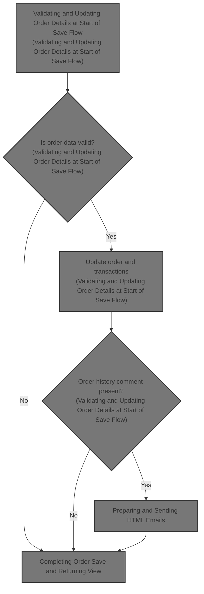
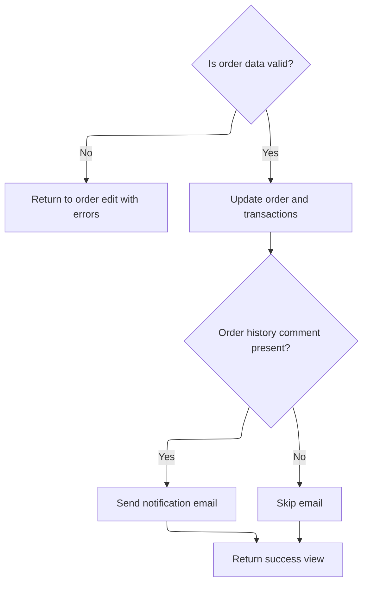

This document explains the flow of saving and updating order details within the order management process. It validates and updates order and transaction details, manages order status history including comments, sends notification emails if comments are added, and returns a success view.



# Validating and Updating Order Details at Start of Save Flow



This section handles the validation and updating of order details at the start of the save order flow. It ensures order data integrity, updates order and transaction details, manages order status history, and triggers notification emails if comments are added.

| Category        | Rule Name                          | Description                                                                                                                            |
| --------------- | ---------------------------------- | -------------------------------------------------------------------------------------------------------------------------------------- |
| Data validation | Valid customer email               | The order must have a valid customer email address matching the specified email regex pattern.                                         |
| Data validation | Complete billing information       | Billing information must include non-empty first name, last name, street address, city, postal code, and either a valid zone or state. |
| Data validation | Valid order date                   | If the order date is provided, it must be a valid date format; otherwise, it can be null.                                              |
| Business logic  | Transaction status identification  | For orders not paid by money order, capturable and refundable transactions are identified and presented to the user.                   |
| Business logic  | Order history comment notification | When an order history comment is added, it is saved with the order status history and triggers a notification email to the customer.   |
| Business logic  | No notification without comment    | If no order history comment is present, no notification email is sent to the customer.                                                 |
| Business logic  | Order update on validation success | Order details including billing, delivery, status, and timestamps are updated and saved upon successful validation.                    |

<SwmSnippet path="/shopizer/sm-shop/src/main/java/com/salesmanager/web/admin/controller/orders/OrderControler.java" line="212">

---

Here we start the <SwmToken path="shopizer/sm-shop/src/main/java/com/salesmanager/web/admin/controller/orders/OrderControler.java" pos="212:5:5" line-data="	public String saveOrder(@Valid @ModelAttribute(&quot;order&quot;) com.salesmanager.web.admin.entity.orders.Order entityOrder, BindingResult result, Model model, HttpServletRequest request, Locale locale) throws Exception {">`saveOrder`</SwmToken> flow by validating the order's email and billing info, checking payment transactions, updating order details and status history, and preparing data for the view. It also sets up for sending notification emails if comments are added, which is why EmailServiceImpl.sendHtmlEmail is called next.

```java
	public String saveOrder(@Valid @ModelAttribute("order") com.salesmanager.web.admin.entity.orders.Order entityOrder, BindingResult result, Model model, HttpServletRequest request, Locale locale) throws Exception {
		
		String email_regEx = "\\b[A-Za-z0-9._%+-]+@[A-Za-z0-9.-]+\\.[A-Za-z]{2,4}\\b";
		Pattern pattern = Pattern.compile(email_regEx);
		
		Language language = (Language)request.getAttribute("LANGUAGE");
		List<Country> countries = countryService.getCountries(language);
		model.addAttribute("countries", countries);
		
		MerchantStore store = (MerchantStore)request.getAttribute(Constants.ADMIN_STORE);
		
		//set the id if fails
		entityOrder.setId(entityOrder.getOrder().getId());
		
		model.addAttribute("order", entityOrder);
		
		Set<OrderProduct> orderProducts = new HashSet<OrderProduct>();
		Set<OrderTotal> orderTotal = new HashSet<OrderTotal>();
		Set<OrderStatusHistory> orderHistory = new HashSet<OrderStatusHistory>();
		
		Date date = new Date();
		if(!StringUtils.isBlank(entityOrder.getDatePurchased() ) ){
			try {
				date = DateUtil.getDate(entityOrder.getDatePurchased());
			} catch (Exception e) {
				ObjectError error = new ObjectError("datePurchased",messages.getMessage("message.invalid.date", locale));
				result.addError(error);
			}
			
		} else{
			date = null;
		}
		 

		if(!StringUtils.isBlank(entityOrder.getOrder().getCustomerEmailAddress() ) ){
			 java.util.regex.Matcher matcher = pattern.matcher(entityOrder.getOrder().getCustomerEmailAddress());
			 
			 if(!matcher.find()) {
				ObjectError error = new ObjectError("customerEmailAddress",messages.getMessage("Email.order.customerEmailAddress", locale));
				result.addError(error);
			 }
		}else{
			ObjectError error = new ObjectError("customerEmailAddress",messages.getMessage("NotEmpty.order.customerEmailAddress", locale));
			result.addError(error);
		}

		 
		if( StringUtils.isBlank(entityOrder.getOrder().getBilling().getFirstName() ) ){
			 ObjectError error = new ObjectError("billingFirstName", messages.getMessage("NotEmpty.order.billingFirstName", locale));
			 result.addError(error);
		}
		
		if( StringUtils.isBlank(entityOrder.getOrder().getBilling().getFirstName() ) ){
			 ObjectError error = new ObjectError("billingLastName", messages.getMessage("NotEmpty.order.billingLastName", locale));
			 result.addError(error);
		}
		 
		if( StringUtils.isBlank(entityOrder.getOrder().getBilling().getAddress() ) ){
			 ObjectError error = new ObjectError("billingAddress", messages.getMessage("NotEmpty.order.billingStreetAddress", locale));
			 result.addError(error);
		}
		 
		if( StringUtils.isBlank(entityOrder.getOrder().getBilling().getCity() ) ){
			 ObjectError error = new ObjectError("billingCity",messages.getMessage("NotEmpty.order.billingCity", locale));
			 result.addError(error);
		}
		 
		if( entityOrder.getOrder().getBilling().getZone()==null){
			if( StringUtils.isBlank(entityOrder.getOrder().getBilling().getState())){
				 ObjectError error = new ObjectError("billingState",messages.getMessage("NotEmpty.order.billingState", locale));
				 result.addError(error);
			}
		}
		 
		if( StringUtils.isBlank(entityOrder.getOrder().getBilling().getPostalCode() ) ){
			 ObjectError error = new ObjectError("billingPostalCode", messages.getMessage("NotEmpty.order.billingPostCode", locale));
			 result.addError(error);
		}
		
		com.salesmanager.core.business.order.model.Order newOrder = orderService.getById(entityOrder.getOrder().getId() );
		
		
		//get capturable
		if(newOrder.getPaymentType().name() != PaymentType.MONEYORDER.name()) {
			Transaction capturableTransaction = transactionService.getCapturableTransaction(newOrder);
			if(capturableTransaction!=null) {
				model.addAttribute("capturableTransaction",capturableTransaction);
			}
		}
		
		
		//get refundable
		if(newOrder.getPaymentType().name() != PaymentType.MONEYORDER.name()) {
			Transaction refundableTransaction = transactionService.getRefundableTransaction(newOrder);
			if(refundableTransaction!=null) {
					model.addAttribute("capturableTransaction",null);//remove capturable
					model.addAttribute("refundableTransaction",refundableTransaction);
			}
		}
	
	
		if (result.hasErrors()) {
			//  somehow we lose data, so reset Order detail info.
			entityOrder.getOrder().setOrderProducts( orderProducts);
			entityOrder.getOrder().setOrderTotal(orderTotal);
			entityOrder.getOrder().setOrderHistory(orderHistory);
			
			return ControllerConstants.Tiles.Order.ordersEdit;
		/*	"admin-orders-edit";  */
		}
		
		OrderStatusHistory orderStatusHistory = new OrderStatusHistory();		


		
		Country deliveryCountry = countryService.getByCode( entityOrder.getOrder().getDelivery().getCountry().getIsoCode()); 
		Country billingCountry  = countryService.getByCode( entityOrder.getOrder().getBilling().getCountry().getIsoCode()) ;
		Zone billingZone = null;
		Zone deliveryZone = null;
		if(entityOrder.getOrder().getBilling().getZone()!=null) {
			billingZone = zoneService.getByCode(entityOrder.getOrder().getBilling().getZone().getCode());
		}
		
		if(entityOrder.getOrder().getDelivery().getZone()!=null) {
			deliveryZone = zoneService.getByCode(entityOrder.getOrder().getDelivery().getZone().getCode());
		}

		newOrder.setCustomerEmailAddress(entityOrder.getOrder().getCustomerEmailAddress() );
		newOrder.setStatus(entityOrder.getOrder().getStatus() );		
		
		newOrder.setDatePurchased(date);
		newOrder.setLastModified( new Date() );
		
		if(!StringUtils.isBlank(entityOrder.getOrderHistoryComment() ) ) {
			orderStatusHistory.setComments( entityOrder.getOrderHistoryComment() );
			orderStatusHistory.setCustomerNotified(1);
			orderStatusHistory.setStatus(entityOrder.getOrder().getStatus());
			orderStatusHistory.setDateAdded(new Date() );
			orderStatusHistory.setOrder(newOrder);
			newOrder.getOrderHistory().add( orderStatusHistory );
			entityOrder.setOrderHistoryComment( "" );
		}		
		
		newOrder.setDelivery( entityOrder.getOrder().getDelivery() );
		newOrder.setBilling( entityOrder.getOrder().getBilling() );
		
		newOrder.getDelivery().setCountry(deliveryCountry );
		newOrder.getBilling().setCountry(billingCountry );	
		
		if(billingZone!=null) {
			newOrder.getBilling().setZone(billingZone);
		}
		
		if(deliveryZone!=null) {
			newOrder.getDelivery().setZone(deliveryZone);
		}
		
		orderService.saveOrUpdate(newOrder);
		entityOrder.setOrder(newOrder);
		entityOrder.setBilling(newOrder.getBilling());
		entityOrder.setDelivery(newOrder.getDelivery());
		model.addAttribute("order", entityOrder);
		
		Long customerId = newOrder.getCustomerId();
		
		if(customerId!=null && customerId>0) {
		
			try {
				
				Customer customer = customerService.getById(customerId);
				if(customer!=null) {
					model.addAttribute("customer",customer);
				}
				
				
			} catch(Exception e) {
				LOGGER.error("Error while getting customer for customerId " + customerId, e);
			}
		
		}

		List<OrderProductDownload> orderProductDownloads = orderProdctDownloadService.getByOrderId(newOrder.getId());
		if(CollectionUtils.isNotEmpty(orderProductDownloads)) {
			model.addAttribute("downloads",orderProductDownloads);
		}
		
		
		/** 
		 * send email if admin posted orderHistoryComment
		 * 
		 * **/
		
		if(StringUtils.isBlank(entityOrder.getOrderHistoryComment())) {
		
			try {
				
				Customer customer = customerService.getById(newOrder.getCustomerId());
				Language lang = store.getDefaultLanguage();
				if(customer!=null) {
					lang = customer.getDefaultLanguage();
				}
				
				Locale customerLocale = LocaleUtils.getLocale(lang);

				StringBuilder customerName = new StringBuilder();
				customerName.append(newOrder.getBilling().getFirstName()).append(" ").append(newOrder.getBilling().getLastName());
				
				
				Map<String, String> templateTokens = EmailUtils.createEmailObjectsMap(request.getContextPath(), store, messages, customerLocale);
				templateTokens.put(EmailConstants.EMAIL_CUSTOMER_NAME, customerName.toString());
				templateTokens.put(EmailConstants.EMAIL_TEXT_ORDER_NUMBER, messages.getMessage("email.order.confirmation", new String[]{String.valueOf(newOrder.getId())}, customerLocale));
				templateTokens.put(EmailConstants.EMAIL_TEXT_DATE_ORDERED, messages.getMessage("email.order.ordered", new String[]{entityOrder.getDatePurchased()}, customerLocale));
				templateTokens.put(EmailConstants.EMAIL_TEXT_STATUS_COMMENTS, messages.getMessage("email.order.comments", new String[]{entityOrder.getOrderHistoryComment()}, customerLocale));
				templateTokens.put(EmailConstants.EMAIL_TEXT_DATE_UPDATED, messages.getMessage("email.order.updated", new String[]{DateUtils.formatDate(new Date())}, customerLocale));

				
				Email email = new Email();
				email.setFrom(store.getStorename());
				email.setFromEmail(store.getStoreEmailAddress());
				email.setSubject(messages.getMessage("email.order.status.title",new String[]{String.valueOf(newOrder.getId())},customerLocale));
				email.setTo(entityOrder.getOrder().getCustomerEmailAddress());
				email.setTemplateName(ORDER_STATUS_TMPL);
				email.setTemplateTokens(templateTokens);
	
	
				
				emailService.sendHtmlEmail(store, email);
			
			} catch (Exception e) {
				LOGGER.error("Cannot send email to customer",e);
			}
			
		}
		
```

---

</SwmSnippet>

## Preparing and Sending HTML Emails

This section describes the process of preparing and sending HTML emails within the Shopizer platform, focusing on configuring the email settings for a store and sending the email through a sender service.

| Category       | Rule Name                          | Description                                                                                                       |
| -------------- | ---------------------------------- | ----------------------------------------------------------------------------------------------------------------- |
| Business logic | Store-specific email configuration | The system must retrieve the correct email configuration specific to the merchant store before sending any email. |
| Business logic | HTML email format                  | Emails must be sent in HTML format to support rich content and formatting.                                        |
| Business logic | Email sender configuration         | The email sender service must be configured with the store's email configuration before sending the email.        |

<SwmSnippet path="/shopizer/sm-core/src/main/java/com/salesmanager/core/business/system/service/EmailServiceImpl.java" line="25">

---

SendHtmlEmail gets the email config for the store, sets it on the sender, then calls <SwmToken path="shopizer/sm-core/src/main/java/com/salesmanager/core/business/system/service/EmailServiceImpl.java" pos="30:1:3" line-data="		sender.send(email);">`sender.send`</SwmToken> to actually send the email. Next, HtmlEmailSenderImpl.send handles the detailed email construction and delivery.

```java
	public void sendHtmlEmail(MerchantStore store, Email email) throws ServiceException, Exception {

		EmailConfig emailConfig = getEmailConfiguration(store);
		
		sender.setEmailConfig(emailConfig);
		sender.send(email);
	}
```

---

</SwmSnippet>

## Constructing and Configuring the Email Message

This section describes the process of constructing and configuring an email message for sending, including setting SMTP configuration, defining sender and recipient details, preparing the email subject, and processing templates for the email body in both text and HTML formats.

| Category        | Rule Name                | Description                                                                                                                                            |
| --------------- | ------------------------ | ------------------------------------------------------------------------------------------------------------------------------------------------------ |
| Data validation | Valid sender information | The email must have a valid sender address and a personal name associated with the sender.                                                             |
| Data validation | Valid recipient address  | The email must have a valid recipient address to ensure the message is delivered to the intended user.                                                 |
| Data validation | Email subject presence   | The email subject must be set and reflect the purpose of the email to inform the recipient appropriately.                                              |
| Business logic  | Multi-format email body  | The email body must be constructed using templates that support both plain text and HTML formats to ensure compatibility with different email clients. |

<SwmSnippet path="/shopizer/sm-core/src/main/java/com/salesmanager/core/modules/email/HtmlEmailSenderImpl.java" line="40">

---

In send we set SMTP config on the mail sender, set from/to/subject on the message, and prepare to process templates for the email body. Next, the function processes templates and sends the email.

```java
	public void send(Email email)
			throws Exception {
		
		final String eml = email.getFrom();
		final String from = email.getFromEmail();
		final String to = email.getTo();
		final String subject = email.getSubject();
		final String tmpl = email.getTemplateName();
		final Map<String,String> templateTokens = email.getTemplateTokens();

		MimeMessagePreparator preparator = new MimeMessagePreparator() {
			public void prepare(MimeMessage mimeMessage)
					throws MessagingException, IOException {
				
				JavaMailSenderImpl impl = (JavaMailSenderImpl)mailSender;
				// if email configuration is present in Database, use the same
				if(emailConfig != null) {
					impl.setProtocol(emailConfig.getProtocol());
					impl.setHost(emailConfig.getHost());
					impl.setPort(Integer.parseInt(emailConfig.getPort()));
					impl.setUsername(emailConfig.getUsername());
					impl.setPassword(emailConfig.getPassword());
					
					Properties prop = new Properties();
					prop.put("mail.smtp.auth", emailConfig.isSmtpAuth());
					prop.put("mail.smtp.starttls.enable", emailConfig.isStarttls());
					impl.setJavaMailProperties(prop);
				}
				
				mimeMessage.setRecipient(Message.RecipientType.TO, new InternetAddress(to));

				InternetAddress inetAddress = new InternetAddress();

				inetAddress.setPersonal(eml);
				inetAddress.setAddress(from);

				mimeMessage.setFrom(inetAddress);
				mimeMessage.setSubject(subject);

				Multipart mp = new MimeMultipart("alternative");

				// Create a "text" Multipart message
				BodyPart textPart = new MimeBodyPart();
				freemarkerMailConfiguration.setClassForTemplateLoading(HtmlEmailSenderImpl.class, "/");
				Template textTemplate = freemarkerMailConfiguration.getTemplate(new StringBuilder(TEMPLATE_PATH).append("").append("/").append(tmpl).toString());
				final StringWriter textWriter = new StringWriter();
				try {
					textTemplate.process(templateTokens, textWriter);
				} catch (TemplateException e) {
					throw new MailPreparationException(
							"Can't generate text mail", e);
				}
				textPart.setDataHandler(new javax.activation.DataHandler(
						new javax.activation.DataSource() {
							public InputStream getInputStream()
									throws IOException {
								//return new StringBufferInputStream(textWriter
								//		.toString());
								return new ByteArrayInputStream(textWriter
										.toString().getBytes(CHARSET));
							}

							public OutputStream getOutputStream()
									throws IOException {
								throw new IOException("Read-only data");
							}

							public String getContentType() {
								return "text/plain";
							}

							public String getName() {
								return "main";
							}
						}));
				mp.addBodyPart(textPart);

				// Create a "HTML" Multipart message
				Multipart htmlContent = new MimeMultipart("related");
				BodyPart htmlPage = new MimeBodyPart();
				freemarkerMailConfiguration.setClassForTemplateLoading(HtmlEmailSenderImpl.class, "/");
				Template htmlTemplate = freemarkerMailConfiguration.getTemplate(new StringBuilder(TEMPLATE_PATH).append("").append("/").append(tmpl).toString());
				final StringWriter htmlWriter = new StringWriter();
				try {
					htmlTemplate.process(templateTokens, htmlWriter);
				} catch (TemplateException e) {
					throw new MailPreparationException(
							"Can't generate HTML mail", e);
				}
```

---

</SwmSnippet>

### Processing Order Logic (Placeholder)

Processing Order Logic governs the business rules related to how orders are processed within the e-commerce platform.

| Category        | Rule Name              | Description                                                                                               |
| --------------- | ---------------------- | --------------------------------------------------------------------------------------------------------- |
| Data validation | Shipping Validation    | Shipping preferences must be validated to ensure they comply with available shipping methods and regions. |
| Business logic  | Valid Payment Required | An order must have a valid payment status before it can be processed.                                     |
| Business logic  | Inventory Reservation  | Inventory levels must be checked and reserved before confirming the order.                                |
| Business logic  | Order History Update   | Order processing must update customer order history and inventory records upon successful completion.     |

See <SwmLink doc-title="Order processing flow">[Order processing flow](.swm%5Corder-processing-flow.1cqhi0ra.sw.md)</SwmLink>

### Finalizing and Sending the Email After Order Processing

<SwmSnippet path="/shopizer/sm-core/src/main/java/com/salesmanager/core/modules/email/HtmlEmailSenderImpl.java" line="129">

---

It finalizes the email content with text and HTML parts and sends it.

```java
				htmlPage.setDataHandler(new javax.activation.DataHandler(
						new javax.activation.DataSource() {
							public InputStream getInputStream()
									throws IOException {
								//return new StringBufferInputStream(htmlWriter
								//		.toString());
								return new ByteArrayInputStream(textWriter
										.toString().getBytes(CHARSET));
							}

							public OutputStream getOutputStream()
									throws IOException {
								throw new IOException("Read-only data");
							}

							public String getContentType() {
								return "text/html";
							}

							public String getName() {
								return "main";
							}
						}));
				htmlContent.addBodyPart(htmlPage);
				BodyPart htmlPart = new MimeBodyPart();
				htmlPart.setContent(htmlContent);
				mp.addBodyPart(htmlPart);

				mimeMessage.setContent(mp);

				// if(attachment!=null) {
				// MimeMessageHelper messageHelper = new
				// MimeMessageHelper(mimeMessage, true);
				// messageHelper.addAttachment(attachmentFileName, attachment);
				// }

			}
		};

		mailSender.send(preparator);
	}
```

---

</SwmSnippet>

## Completing Order Save and Returning View

<SwmSnippet path="/shopizer/sm-shop/src/main/java/com/salesmanager/web/admin/controller/orders/OrderControler.java" line="447">

---

After sending the email, the function sets a success flag in the model and returns the edit view to finish the <SwmToken path="shopizer/sm-shop/src/main/java/com/salesmanager/web/admin/controller/orders/OrderControler.java" pos="212:5:5" line-data="	public String saveOrder(@Valid @ModelAttribute(&quot;order&quot;) com.salesmanager.web.admin.entity.orders.Order entityOrder, BindingResult result, Model model, HttpServletRequest request, Locale locale) throws Exception {">`saveOrder`</SwmToken> flow.

```java
		model.addAttribute("success","success");

		
		return  ControllerConstants.Tiles.Order.ordersEdit;
	    /*	"admin-orders-edit";  */
	}
```

---

</SwmSnippet>

&nbsp;

*This is an auto-generated document by Swimm 🌊 and has not yet been verified by a human*

<SwmMeta version="3.0.0" repo-id="Z2l0aHViJTNBJTNBU2hvcGl6ZXIlM0ElM0F1bWFsaW5nYXN3YW1p" repo-name="Shopizer"><sup>Powered by [Swimm](https://app.swimm.io/)</sup></SwmMeta>
