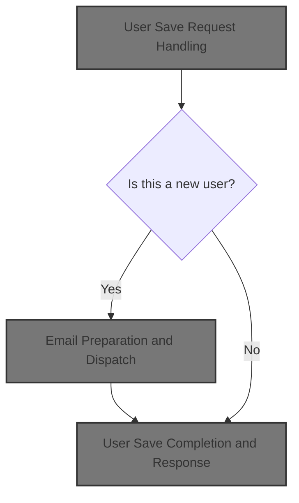
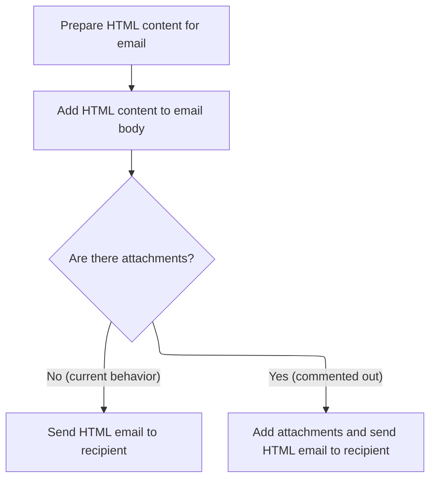

This document describes how user account data submitted via the admin interface is processed to save or update a user. The flow validates group assignments, ensures SUPERADMIN group retention, handles password encoding for new users, and sends a welcome email when a new account is created.



# User Save Request Handling

This section governs the business logic for saving or updating user accounts in the admin interface, ensuring correct group assignments, language settings, password handling, and onboarding communication.

| Category        | Rule Name                       | Description                                                                                                                                                                    |
| --------------- | ------------------------------- | ------------------------------------------------------------------------------------------------------------------------------------------------------------------------------ |
| Data validation | Valid Group Assignment          | When saving a user, all submitted group names must be converted to valid group IDs and assigned to the user. Only groups with valid IDs are considered for assignment.         |
| Data validation | User Edit Validation            | If the user being edited does not exist or the user ID does not match the record, redirect to the user display page to prevent unauthorized or invalid edits.                  |
| Business logic  | Super Admin Group Retention     | If a user is assigned to the SUPERADMIN group, this group cannot be removed during user updates. The SUPERADMIN group must always be retained for users who currently have it. |
| Business logic  | Password Encoding for New Users | For new users, the password must be encoded before saving. For existing users, the password remains unchanged unless explicitly updated.                                       |
| Business logic  | New User Welcome Email          | When a new user is created, a welcome email must be sent to the user's registered email address, containing their login credentials and relevant onboarding information.       |

<SwmSnippet path="/shopizer/sm-shop/src/main/java/com/salesmanager/web/admin/controller/user/UserController.java" line="472">

---

In <SwmToken path="shopizer/sm-shop/src/main/java/com/salesmanager/web/admin/controller/user/UserController.java" pos="472:5:5" line-data="	public String saveUser(@Valid @ModelAttribute(&quot;user&quot;) User user, BindingResult result, Model model, HttpServletRequest request, Locale locale) throws Exception {">`saveUser`</SwmToken>, we kick off the flow by setting up the admin menu, loading the merchant store, populating user objects, and resolving the user's language. We check if we're editing an existing user and fetch their current data if needed. Then, we parse submitted group names into IDs, prepping for group management. This sets up all the context and validation needed before any actual save or email logic happens.

```java
	public String saveUser(@Valid @ModelAttribute("user") User user, BindingResult result, Model model, HttpServletRequest request, Locale locale) throws Exception {


		setMenu(model,request);
		
		MerchantStore store = (MerchantStore)request.getAttribute(Constants.ADMIN_STORE);

		
		this.populateUserObjects(user, store, model, locale);
		
		Language language = user.getDefaultLanguage();
		
		Language l = languageService.getById(language.getId());
		
		user.setDefaultLanguage(l);
		
		Locale userLocale = LocaleUtils.getLocale(l);
		
		
		
		User dbUser = null;
		
		//edit mode, need to get original user important information
		if(user.getId()!=null) {
			dbUser = userService.getByUserName(user.getAdminName());
			if(dbUser==null) {
				return "redirect://admin/users/displayUser.html";
			}
		}

		List<Group> submitedGroups = user.getGroups();
		Set<Integer> ids = new HashSet<Integer>();
		for(Group group : submitedGroups) {
			ids.add(Integer.parseInt(group.getGroupName()));
		}
```

---

</SwmSnippet>

<SwmSnippet path="/shopizer/sm-shop/src/main/java/com/salesmanager/web/admin/controller/user/UserController.java" line="537">

---

Next in <SwmToken path="shopizer/sm-shop/src/main/java/com/salesmanager/web/admin/controller/user/UserController.java" pos="472:5:5" line-data="	public String saveUser(@Valid @ModelAttribute(&quot;user&quot;) User user, BindingResult result, Model model, HttpServletRequest request, Locale locale) throws Exception {">`saveUser`</SwmToken>, we check if the user is an existing super admin and make sure their SUPERADMIN group can't be removed. We fetch the user's current groups and explicitly retain SUPERADMIN if present, prepping for correct group assignment before saving.

```java
		Group superAdmin = null;
		
		if(user.getId()!=null && user.getId()>0) {
			if(user.getId().longValue()!=dbUser.getId().longValue()) {
				return "redirect://admin/users/displayUser.html";
			}
			
			List<Group> groups = dbUser.getGroups();
			//boolean removeSuperAdmin = true;
			for(Group group : groups) {
				//can't revoke super admin
				if(group.getGroupName().equals("SUPERADMIN")) {
					superAdmin = group;
				}
			}
```

---

</SwmSnippet>

<SwmSnippet path="/shopizer/sm-shop/src/main/java/com/salesmanager/web/admin/controller/user/UserController.java" line="562">

---

Here we finalize group assignments, validate input, handle password encoding (only for new users), and save the user. If it's a new user, we build the welcome email and call the email service to send it. This is where the flow branches to email delivery for onboarding.

```java
		if(superAdmin!=null) {
			ids.add(superAdmin.getId());
		}

		
		List<Group> newGroups = groupService.listGroupByIds(ids);

		//set actual user groups
		user.setGroups(newGroups);
		
		if (result.hasErrors()) {
			return ControllerConstants.Tiles.User.profile;
		}
		
		String decodedPassword = user.getAdminPassword();
		if(user.getId()!=null && user.getId()>0) {
			user.setAdminPassword(dbUser.getAdminPassword());
		} else {
			String encoded = passwordEncoder.encodePassword(user.getAdminPassword(),null);
			user.setAdminPassword(encoded);
		}
		
		
		if(user.getId()==null || user.getId().longValue()==0) {
			
			//save or update user
			userService.saveOrUpdate(user);
			
			try {

				//creation of a user, send an email
				String userName = user.getFirstName();
				if(StringUtils.isBlank(userName)) {
					userName = user.getAdminName();
				}
				String[] userNameArg = {userName};
				
				
				Map<String, String> templateTokens = EmailUtils.createEmailObjectsMap(request.getContextPath(), store, messages, userLocale);
				templateTokens.put(EmailConstants.EMAIL_NEW_USER_TEXT, messages.getMessage("email.greeting", userNameArg, userLocale));
				templateTokens.put(EmailConstants.EMAIL_USER_FIRSTNAME, user.getFirstName());
				templateTokens.put(EmailConstants.EMAIL_USER_LASTNAME, user.getLastName());
				templateTokens.put(EmailConstants.EMAIL_ADMIN_USERNAME_LABEL, messages.getMessage("label.generic.username",userLocale));
				templateTokens.put(EmailConstants.EMAIL_ADMIN_NAME, user.getAdminName());
				templateTokens.put(EmailConstants.EMAIL_TEXT_NEW_USER_CREATED, messages.getMessage("email.newuser.text",userLocale));
				templateTokens.put(EmailConstants.EMAIL_ADMIN_PASSWORD_LABEL, messages.getMessage("label.generic.password",userLocale));
				templateTokens.put(EmailConstants.EMAIL_ADMIN_PASSWORD, decodedPassword);
				templateTokens.put(EmailConstants.EMAIL_ADMIN_URL_LABEL, messages.getMessage("label.adminurl",userLocale));
				templateTokens.put(EmailConstants.EMAIL_ADMIN_URL, FilePathUtils.buildAdminUri(store, request));
	
				
				Email email = new Email();
				email.setFrom(store.getStorename());
				email.setFromEmail(store.getStoreEmailAddress());
				email.setSubject(messages.getMessage("email.newuser.title",userLocale));
				email.setTo(user.getAdminEmail());
				email.setTemplateName(NEW_USER_TMPL);
				email.setTemplateTokens(templateTokens);
	
	
				
				emailService.sendHtmlEmail(store, email);
			
			} catch (Exception e) {
				LOGGER.error("Cannot send email to user",e);
			}
			
		} else {
			//save or update user
			userService.saveOrUpdate(user);
		}

```

---

</SwmSnippet>

## Email Preparation and Dispatch

This section governs how Shopizer prepares and sends HTML emails, ensuring each email uses the correct store-specific configuration and is dispatched reliably.

| Category        | Rule Name                          | Description                                                                                                                    |
| --------------- | ---------------------------------- | ------------------------------------------------------------------------------------------------------------------------------ |
| Data validation | HTML format enforcement            | All outgoing emails must be sent in HTML format as specified by the section.                                                   |
| Business logic  | Store-specific email configuration | Each email sent must use the email configuration specific to the merchant store from which the email originates.               |
| Business logic  | Sender-based email dispatch        | HTML emails must be dispatched using the sender component, which is responsible for constructing and transporting the message. |

<SwmSnippet path="/shopizer/sm-core/src/main/java/com/salesmanager/core/business/system/service/EmailServiceImpl.java" line="25">

---

<SwmToken path="shopizer/sm-core/src/main/java/com/salesmanager/core/business/system/service/EmailServiceImpl.java" pos="25:5:5" line-data="	public void sendHtmlEmail(MerchantStore store, Email email) throws ServiceException, Exception {">`sendHtmlEmail`</SwmToken> loads the store's email config, sets it on the sender, and hands off the email object for actual delivery. This keeps config and sending logic separate, so next we jump into the sender for message construction and transport.

```java
	public void sendHtmlEmail(MerchantStore store, Email email) throws ServiceException, Exception {

		EmailConfig emailConfig = getEmailConfiguration(store);
		
		sender.setEmailConfig(emailConfig);
		sender.send(email);
	}
```

---

</SwmSnippet>

## Email Message Construction and Sending

This section is responsible for constructing email messages in both text and HTML formats using template data, configuring mail server settings, and ensuring the message is sent to the intended recipient.

| Category        | Rule Name                   | Description                                                                                                                      |
| --------------- | --------------------------- | -------------------------------------------------------------------------------------------------------------------------------- |
| Data validation | Valid sender and recipient  | The sender and recipient email addresses must be provided and valid for every email sent.                                        |
| Business logic  | Dual format email body      | Every email must include both a plain text and an HTML version of the message body, generated from the same template and tokens. |
| Business logic  | Database mail configuration | If email server configuration is present in the database, those settings must be used for sending the email.                     |
| Business logic  | Email subject assignment    | The subject line of the email must be set according to the value provided in the Email object.                                   |

<SwmSnippet path="/shopizer/sm-core/src/main/java/com/salesmanager/core/modules/email/HtmlEmailSenderImpl.java" line="40">

---

We generate both text and HTML email bodies, set up mail config, and build the MIME message for sending.

```java
	public void send(Email email)
			throws Exception {
		
		final String eml = email.getFrom();
		final String from = email.getFromEmail();
		final String to = email.getTo();
		final String subject = email.getSubject();
		final String tmpl = email.getTemplateName();
		final Map<String,String> templateTokens = email.getTemplateTokens();

		MimeMessagePreparator preparator = new MimeMessagePreparator() {
			public void prepare(MimeMessage mimeMessage)
					throws MessagingException, IOException {
				
				JavaMailSenderImpl impl = (JavaMailSenderImpl)mailSender;
				// if email configuration is present in Database, use the same
				if(emailConfig != null) {
					impl.setProtocol(emailConfig.getProtocol());
					impl.setHost(emailConfig.getHost());
					impl.setPort(Integer.parseInt(emailConfig.getPort()));
					impl.setUsername(emailConfig.getUsername());
					impl.setPassword(emailConfig.getPassword());
					
					Properties prop = new Properties();
					prop.put("mail.smtp.auth", emailConfig.isSmtpAuth());
					prop.put("mail.smtp.starttls.enable", emailConfig.isStarttls());
					impl.setJavaMailProperties(prop);
				}
				
				mimeMessage.setRecipient(Message.RecipientType.TO, new InternetAddress(to));

				InternetAddress inetAddress = new InternetAddress();

				inetAddress.setPersonal(eml);
				inetAddress.setAddress(from);

				mimeMessage.setFrom(inetAddress);
				mimeMessage.setSubject(subject);

				Multipart mp = new MimeMultipart("alternative");

				// Create a "text" Multipart message
				BodyPart textPart = new MimeBodyPart();
				freemarkerMailConfiguration.setClassForTemplateLoading(HtmlEmailSenderImpl.class, "/");
				Template textTemplate = freemarkerMailConfiguration.getTemplate(new StringBuilder(TEMPLATE_PATH).append("").append("/").append(tmpl).toString());
				final StringWriter textWriter = new StringWriter();
				try {
					textTemplate.process(templateTokens, textWriter);
				} catch (TemplateException e) {
					throw new MailPreparationException(
							"Can't generate text mail", e);
				}
				textPart.setDataHandler(new javax.activation.DataHandler(
						new javax.activation.DataSource() {
							public InputStream getInputStream()
									throws IOException {
								//return new StringBufferInputStream(textWriter
								//		.toString());
								return new ByteArrayInputStream(textWriter
										.toString().getBytes(CHARSET));
							}

							public OutputStream getOutputStream()
									throws IOException {
								throw new IOException("Read-only data");
							}

							public String getContentType() {
								return "text/plain";
							}

							public String getName() {
								return "main";
							}
						}));
				mp.addBodyPart(textPart);

				// Create a "HTML" Multipart message
				Multipart htmlContent = new MimeMultipart("related");
				BodyPart htmlPage = new MimeBodyPart();
				freemarkerMailConfiguration.setClassForTemplateLoading(HtmlEmailSenderImpl.class, "/");
				Template htmlTemplate = freemarkerMailConfiguration.getTemplate(new StringBuilder(TEMPLATE_PATH).append("").append("/").append(tmpl).toString());
				final StringWriter htmlWriter = new StringWriter();
				try {
					htmlTemplate.process(templateTokens, htmlWriter);
				} catch (TemplateException e) {
					throw new MailPreparationException(
							"Can't generate HTML mail", e);
				}
```

---

</SwmSnippet>

### Order Processing Integration

The Order Processing Integration section governs how orders are received, validated, and processed within Shopizer, ensuring that all business requirements for order handling are met and that integrations with external systems are properly managed. This section is critical for ensuring that customer orders are accurately captured, processed, and communicated to relevant subsystems or partners.

| Category        | Rule Name                     | Description                                                                                                                                       |
| --------------- | ----------------------------- | ------------------------------------------------------------------------------------------------------------------------------------------------- |
| Data validation | Order validation requirements | All incoming orders must contain a valid customer identifier and at least one purchasable item before processing can begin.                       |
| Data validation | Restricted item handling      | Orders containing restricted items (e.g., age-restricted products) must be flagged and require additional validation before integration proceeds. |
| Business logic  | High-value order approval     | Orders with a total value above $10,000 require manual approval before integration with fulfillment partners.                                     |
| Business logic  | Order traceability            | Orders must be assigned a unique order number upon successful processing to ensure traceability across all integrated systems.                    |

See <SwmLink doc-title="Order Processing Flow">[Order Processing Flow](.swm%5Corder-processing-flow.guqs9172.sw.md)</SwmLink>

### Finalizing and Sending the Email



<SwmSnippet path="/shopizer/sm-core/src/main/java/com/salesmanager/core/modules/email/HtmlEmailSenderImpl.java" line="129">

---

We wrap up the email construction and send the final message after any order-related updates.

```java
				htmlPage.setDataHandler(new javax.activation.DataHandler(
						new javax.activation.DataSource() {
							public InputStream getInputStream()
									throws IOException {
								//return new StringBufferInputStream(htmlWriter
								//		.toString());
								return new ByteArrayInputStream(textWriter
										.toString().getBytes(CHARSET));
							}

							public OutputStream getOutputStream()
									throws IOException {
								throw new IOException("Read-only data");
							}

							public String getContentType() {
								return "text/html";
							}

							public String getName() {
								return "main";
							}
						}));
				htmlContent.addBodyPart(htmlPage);
				BodyPart htmlPart = new MimeBodyPart();
				htmlPart.setContent(htmlContent);
				mp.addBodyPart(htmlPart);

				mimeMessage.setContent(mp);

				// if(attachment!=null) {
				// MimeMessageHelper messageHelper = new
				// MimeMessageHelper(mimeMessage, true);
				// messageHelper.addAttachment(attachmentFileName, attachment);
				// }

			}
		};

		mailSender.send(preparator);
	}
```

---

</SwmSnippet>

## User Save Completion and Response

<SwmSnippet path="/shopizer/sm-shop/src/main/java/com/salesmanager/web/admin/controller/user/UserController.java" line="634">

---

Back in <SwmToken path="shopizer/sm-shop/src/main/java/com/salesmanager/web/admin/controller/user/UserController.java" pos="472:5:5" line-data="	public String saveUser(@Valid @ModelAttribute(&quot;user&quot;) User user, BindingResult result, Model model, HttpServletRequest request, Locale locale) throws Exception {">`saveUser`</SwmToken> after returning from the email service, we mark the operation as successful and return the user profile view. The UI gets a success flag, but any email errors are just logged, not shown to the user.

```java
		model.addAttribute("success","success");
		return ControllerConstants.Tiles.User.profile;
	}
```

---

</SwmSnippet>

&nbsp;

*This is an auto-generated document by Swimm 🌊 and has not yet been verified by a human*

<SwmMeta version="3.0.0" repo-id="Z2l0aHViJTNBJTNBU2hvcGl6ZXIlM0ElM0F1bWFsaW5nYXN3YW1p" repo-name="Shopizer"><sup>Powered by [Swimm](https://app.swimm.io/)</sup></SwmMeta>
