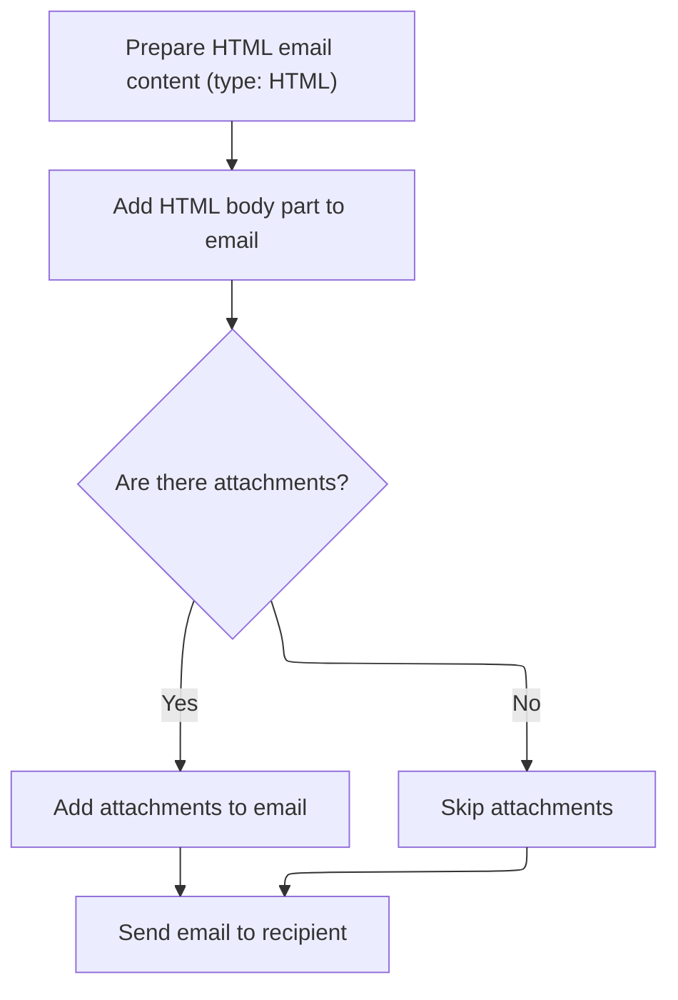

This document outlines the process for saving or updating a merchant store's details via the admin interface. The flow validates the submitted information, updates the store and related entities, sends a notification email if a new store is created or the store code changes, and refreshes the admin view with the latest data.

# Handling Store Save and Validation

<SwmSnippet path="/shopizer/sm-shop/src/main/java/com/salesmanager/web/admin/controller/merchant/MerchantStoreController.java" line="220">

---

In <SwmToken path="shopizer/sm-shop/src/main/java/com/salesmanager/web/admin/controller/merchant/MerchantStoreController.java" pos="220:5:5" line-data="	public String saveMerchantStore(@Valid @ModelAttribute(&quot;store&quot;) MerchantStore store, BindingResult result, Model model, HttpServletRequest request, HttpServletResponse response, Locale locale) throws Exception {">`saveMerchantStore`</SwmToken>, we kick off by validating the store's business date, checking for unauthorized store edits, and prepping all the model attributes needed for the admin view (currencies, languages, countries, weights, sizes, zones). We also validate the zone info and start updating related entities using repository services. The function expects certain fields in the <SwmToken path="shopizer/sm-shop/src/main/java/com/salesmanager/web/admin/controller/merchant/MerchantStoreController.java" pos="220:18:18" line-data="	public String saveMerchantStore(@Valid @ModelAttribute(&quot;store&quot;) MerchantStore store, BindingResult result, Model model, HttpServletRequest request, HttpServletResponse response, Locale locale) throws Exception {">`MerchantStore`</SwmToken> to be set and valid, and relies on session/request attributes and Shopizer-specific services throughout.

```java
	public String saveMerchantStore(@Valid @ModelAttribute("store") MerchantStore store, BindingResult result, Model model, HttpServletRequest request, HttpServletResponse response, Locale locale) throws Exception {
		
		setMenu(model,request);
		MerchantStore sessionStore = (MerchantStore)request.getAttribute(Constants.ADMIN_STORE);

		if(store.getId()!=null) {
			if(store.getId().intValue() != sessionStore.getId().intValue()) {
				return "redirect:/admin/store/store.html";
			}
		}
		
		Date date = new Date();
		if(!StringUtils.isBlank(store.getDateBusinessSince())) {
			try {
				date = DateUtil.getDate(store.getDateBusinessSince());
				store.setInBusinessSince(date);
			} catch (Exception e) {
				ObjectError error = new ObjectError("dateBusinessSince",messages.getMessage("message.invalid.date", locale));
				result.addError(error);
			}
		}
		
		List<Currency> currencies = currencyService.list();
		
		
		Language language = (Language)request.getAttribute("LANGUAGE");
		List<Language> languages = languageService.getLanguages();
		
		//get countries
		List<Country> countries = countryService.getCountries(language);
		
		List<Weight> weights = new ArrayList<Weight>();
		weights.add(new Weight("LB",messages.getMessage("label.generic.weightunit.LB", locale)));
		weights.add(new Weight("KG",messages.getMessage("label.generic.weightunit.KG", locale)));
		
		List<Size> sizes = new ArrayList<Size>();
		sizes.add(new Size("CM",messages.getMessage("label.generic.sizeunit.CM", locale)));
		sizes.add(new Size("IN",messages.getMessage("label.generic.sizeunit.IN", locale)));
		
		model.addAttribute("weights",weights);
		model.addAttribute("sizes",sizes);
		
		model.addAttribute("countries", countries);
		model.addAttribute("languages",languages);
		model.addAttribute("currencies",currencies);
		
		
		Country c = store.getCountry();
		List<Zone> zonesList = zoneService.getZones(c, language);
		
		if((zonesList==null || zonesList.size()==0) && StringUtils.isBlank(store.getStorestateprovince())) {
			
			ObjectError error = new ObjectError("zone.code",messages.getMessage("merchant.zone.invalid", locale));
			result.addError(error);
			
		}

		if (result.hasErrors()) {
			return "admin-store";
		}
		
		//get country
		Country country = store.getCountry();
		country = countryService.getByCode(country.getIsoCode());
		Zone zone = store.getZone();
		if(zone!=null) {
			zone = zoneService.getByCode(zone.getCode());
		}
		Currency currency = store.getCurrency();
		currency = currencyService.getById(currency.getId());

		List<Language> supportedLanguages = store.getLanguages();
		List<Language> supportedLanguagesList = new ArrayList<Language>();
		Map<String,Language> languagesMap = languageService.getLanguagesMap();
		for(Language lang : supportedLanguages) {
			
			Language l = languagesMap.get(lang.getCode());
			if(l!=null) {
				supportedLanguagesList.add(l);
			}
			
		}
```

---

</SwmSnippet>

<SwmSnippet path="/shopizer/sm-shop/src/main/java/com/salesmanager/web/admin/controller/merchant/MerchantStoreController.java" line="303">

---

Here we finish updating the store's fields with fresh entities from the database, save the store, and if the store code changed, we build and send a notification email using localized templates and tokens. This step relies on valid <SwmToken path="shopizer/sm-shop/src/main/java/com/salesmanager/web/admin/controller/merchant/MerchantStoreController.java" pos="220:18:18" line-data="	public String saveMerchantStore(@Valid @ModelAttribute(&quot;store&quot;) MerchantStore store, BindingResult result, Model model, HttpServletRequest request, HttpServletResponse response, Locale locale) throws Exception {">`MerchantStore`</SwmToken> fields and uses Shopizer's email service to notify about new store creation.

```java
		Language defaultLanguage = store.getDefaultLanguage();
		defaultLanguage = languageService.getById(defaultLanguage.getId());
		if(defaultLanguage!=null) {
			store.setDefaultLanguage(defaultLanguage);
		}
		
		Locale storeLocale = LocaleUtils.getLocale(defaultLanguage);
		
		store.setStoreTemplate(sessionStore.getStoreTemplate());
		store.setCountry(country);
		store.setZone(zone);
		store.setCurrency(currency);
		store.setDefaultLanguage(defaultLanguage);
		store.setLanguages(supportedLanguagesList);
		store.setLanguages(supportedLanguagesList);

		
		merchantStoreService.saveOrUpdate(store);
		
		if(!store.getCode().equals(sessionStore.getCode())) {//create store
			//send email
			
			try {


				Map<String, String> templateTokens = EmailUtils.createEmailObjectsMap(request.getContextPath(), store, messages, storeLocale);
				templateTokens.put(EmailConstants.EMAIL_NEW_STORE_TEXT, messages.getMessage("email.newstore.text", storeLocale));
				templateTokens.put(EmailConstants.EMAIL_STORE_NAME, messages.getMessage("email.newstore.name",new String[]{store.getStorename()},storeLocale));
				templateTokens.put(EmailConstants.EMAIL_ADMIN_STORE_INFO_LABEL, messages.getMessage("email.newstore.info",storeLocale));

				templateTokens.put(EmailConstants.EMAIL_ADMIN_URL_LABEL, messages.getMessage("label.adminurl",storeLocale));
				templateTokens.put(EmailConstants.EMAIL_ADMIN_URL, FilePathUtils.buildAdminUri(store, request));
	
				
				Email email = new Email();
				email.setFrom(store.getStorename());
				email.setFromEmail(store.getStoreEmailAddress());
				email.setSubject(messages.getMessage("email.newstore.title",storeLocale));
				email.setTo(store.getStoreEmailAddress());
				email.setTemplateName(NEW_STORE_TMPL);
				email.setTemplateTokens(templateTokens);
	
	
				
				emailService.sendHtmlEmail(store, email);
			
			} catch (Exception e) {
				LOGGER.error("Cannot send email to user",e);
			}
			
		}

```

---

</SwmSnippet>

## Preparing and Dispatching Email

<SwmSnippet path="/shopizer/sm-core/src/main/java/com/salesmanager/core/business/system/service/EmailServiceImpl.java" line="25">

---

<SwmToken path="shopizer/sm-core/src/main/java/com/salesmanager/core/business/system/service/EmailServiceImpl.java" pos="25:5:5" line-data="	public void sendHtmlEmail(MerchantStore store, Email email) throws ServiceException, Exception {">`sendHtmlEmail`</SwmToken> grabs the email config for the store, sets up the sender with those settings, and hands off the actual sending to <SwmToken path="shopizer/sm-core/src/main/java/com/salesmanager/core/modules/email/HtmlEmailSenderImpl.java" pos="83:5:5" line-data="				freemarkerMailConfiguration.setClassForTemplateLoading(HtmlEmailSenderImpl.class, &quot;/&quot;);">`HtmlEmailSenderImpl`</SwmToken>. This lets each store use its own SMTP setup and keeps the sending logic separate.

```java
	public void sendHtmlEmail(MerchantStore store, Email email) throws ServiceException, Exception {

		EmailConfig emailConfig = getEmailConfiguration(store);
		
		sender.setEmailConfig(emailConfig);
		sender.send(email);
	}
```

---

</SwmSnippet>

## Building and Sending MIME Email

<SwmSnippet path="/shopizer/sm-core/src/main/java/com/salesmanager/core/modules/email/HtmlEmailSenderImpl.java" line="40">

---

In <SwmToken path="shopizer/sm-core/src/main/java/com/salesmanager/core/modules/email/HtmlEmailSenderImpl.java" pos="40:5:5" line-data="	public void send(Email email)">`send`</SwmToken>, we set up the mail sender with config from the database, build a MIME message with both plain text and HTML parts using FreeMarker templates, and prep all the email fields from the Email object. Next, we need to call OrderServiceImpl to handle any order-related logic that might affect email content or attachments.

```java
	public void send(Email email)
			throws Exception {
		
		final String eml = email.getFrom();
		final String from = email.getFromEmail();
		final String to = email.getTo();
		final String subject = email.getSubject();
		final String tmpl = email.getTemplateName();
		final Map<String,String> templateTokens = email.getTemplateTokens();

		MimeMessagePreparator preparator = new MimeMessagePreparator() {
			public void prepare(MimeMessage mimeMessage)
					throws MessagingException, IOException {
				
				JavaMailSenderImpl impl = (JavaMailSenderImpl)mailSender;
				// if email configuration is present in Database, use the same
				if(emailConfig != null) {
					impl.setProtocol(emailConfig.getProtocol());
					impl.setHost(emailConfig.getHost());
					impl.setPort(Integer.parseInt(emailConfig.getPort()));
					impl.setUsername(emailConfig.getUsername());
					impl.setPassword(emailConfig.getPassword());
					
					Properties prop = new Properties();
					prop.put("mail.smtp.auth", emailConfig.isSmtpAuth());
					prop.put("mail.smtp.starttls.enable", emailConfig.isStarttls());
					impl.setJavaMailProperties(prop);
				}
				
				mimeMessage.setRecipient(Message.RecipientType.TO, new InternetAddress(to));

				InternetAddress inetAddress = new InternetAddress();

				inetAddress.setPersonal(eml);
				inetAddress.setAddress(from);

				mimeMessage.setFrom(inetAddress);
				mimeMessage.setSubject(subject);

				Multipart mp = new MimeMultipart("alternative");

				// Create a "text" Multipart message
				BodyPart textPart = new MimeBodyPart();
				freemarkerMailConfiguration.setClassForTemplateLoading(HtmlEmailSenderImpl.class, "/");
				Template textTemplate = freemarkerMailConfiguration.getTemplate(new StringBuilder(TEMPLATE_PATH).append("").append("/").append(tmpl).toString());
				final StringWriter textWriter = new StringWriter();
				try {
					textTemplate.process(templateTokens, textWriter);
				} catch (TemplateException e) {
					throw new MailPreparationException(
							"Can't generate text mail", e);
				}
				textPart.setDataHandler(new javax.activation.DataHandler(
						new javax.activation.DataSource() {
							public InputStream getInputStream()
									throws IOException {
								//return new StringBufferInputStream(textWriter
								//		.toString());
								return new ByteArrayInputStream(textWriter
										.toString().getBytes(CHARSET));
							}

							public OutputStream getOutputStream()
									throws IOException {
								throw new IOException("Read-only data");
							}

							public String getContentType() {
								return "text/plain";
							}

							public String getName() {
								return "main";
							}
						}));
				mp.addBodyPart(textPart);

				// Create a "HTML" Multipart message
				Multipart htmlContent = new MimeMultipart("related");
				BodyPart htmlPage = new MimeBodyPart();
				freemarkerMailConfiguration.setClassForTemplateLoading(HtmlEmailSenderImpl.class, "/");
				Template htmlTemplate = freemarkerMailConfiguration.getTemplate(new StringBuilder(TEMPLATE_PATH).append("").append("/").append(tmpl).toString());
				final StringWriter htmlWriter = new StringWriter();
				try {
					htmlTemplate.process(templateTokens, htmlWriter);
				} catch (TemplateException e) {
					throw new MailPreparationException(
							"Can't generate HTML mail", e);
				}
```

---

</SwmSnippet>

### Processing Order-Related Email Logic

See <SwmLink doc-title="Order Processing Flow">[Order Processing Flow](.swm%5Corder-processing-flow.7sbcosbj.sw.md)</SwmLink>

### Finalizing and Sending the Email



<SwmSnippet path="/shopizer/sm-core/src/main/java/com/salesmanager/core/modules/email/HtmlEmailSenderImpl.java" line="129">

---

Back in `HtmlEmailSenderImpl.send`, we finalize the MIME message with both text and HTML, then send it out, making sure any order-related changes are included.

```java
				htmlPage.setDataHandler(new javax.activation.DataHandler(
						new javax.activation.DataSource() {
							public InputStream getInputStream()
									throws IOException {
								//return new StringBufferInputStream(htmlWriter
								//		.toString());
								return new ByteArrayInputStream(textWriter
										.toString().getBytes(CHARSET));
							}

							public OutputStream getOutputStream()
									throws IOException {
								throw new IOException("Read-only data");
							}

							public String getContentType() {
								return "text/html";
							}

							public String getName() {
								return "main";
							}
						}));
				htmlContent.addBodyPart(htmlPage);
				BodyPart htmlPart = new MimeBodyPart();
				htmlPart.setContent(htmlContent);
				mp.addBodyPart(htmlPart);

				mimeMessage.setContent(mp);

				// if(attachment!=null) {
				// MimeMessageHelper messageHelper = new
				// MimeMessageHelper(mimeMessage, true);
				// messageHelper.addAttachment(attachmentFileName, attachment);
				// }

			}
		};

		mailSender.send(preparator);
	}
```

---

</SwmSnippet>

## Updating Session and Returning View

<SwmSnippet path="/shopizer/sm-shop/src/main/java/com/salesmanager/web/admin/controller/merchant/MerchantStoreController.java" line="355">

---

Back in <SwmToken path="shopizer/sm-shop/src/main/java/com/salesmanager/web/admin/controller/merchant/MerchantStoreController.java" pos="220:5:5" line-data="	public String saveMerchantStore(@Valid @ModelAttribute(&quot;store&quot;) MerchantStore store, BindingResult result, Model model, HttpServletRequest request, HttpServletResponse response, Locale locale) throws Exception {">`saveMerchantStore`</SwmToken>, after sending the notification email, we refresh the session store from the database, update the session attribute, and set success feedback for the view. This keeps the user's session in sync with the latest store data and returns the admin view.

```java
		sessionStore = merchantStoreService.getMerchantStore(sessionStore.getCode());
		
		
		//update session store
		request.getSession().setAttribute(Constants.ADMIN_STORE, sessionStore);


		model.addAttribute("success","success");
		model.addAttribute("store", store);

		
		return "admin-store";
	}
```

---

</SwmSnippet>

&nbsp;

*This is an auto-generated document by Swimm 🌊 and has not yet been verified by a human*

<SwmMeta version="3.0.0" repo-id="Z2l0aHViJTNBJTNBU2hvcGl6ZXIlM0ElM0F1bWFsaW5nYXN3YW1p" repo-name="Shopizer"><sup>Powered by [Swimm](https://app.swimm.io/)</sup></SwmMeta>
