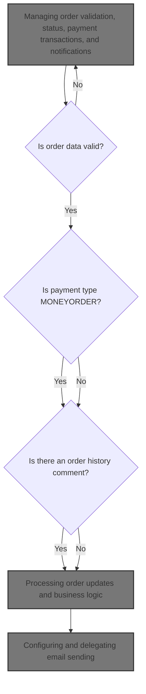
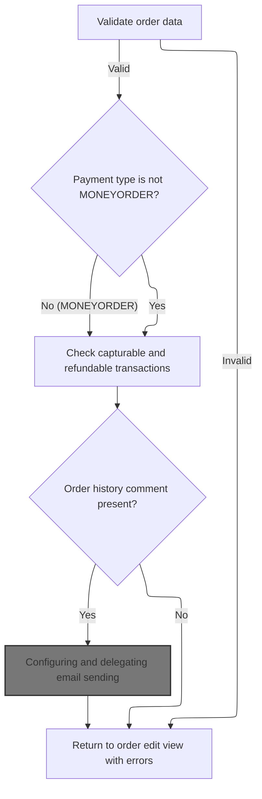

This document describes the flow of saving an order, including validating order data, managing payment transactions, updating order status history, and sending notification emails to customers. The flow receives an order with customer and billing details as input and outputs the updated order saved in the system. It ensures the order data is valid, checks payment transaction states, updates order history if comments are added, and sends notification emails to keep customers informed about their order status.



# Managing order validation, status, payment transactions, and notifications



This section manages order validation, status updates, payment transaction checks, and notification emails in the e-commerce platform.

| Category        | Rule Name                                | Description                                                                                                                         |
| --------------- | ---------------------------------------- | ----------------------------------------------------------------------------------------------------------------------------------- |
| Data validation | Email format validation                  | Customer email address must be present and conform to a valid email format.                                                         |
| Data validation | Mandatory billing fields                 | Billing first name, last name, address, city, postal code, and state (if zone is not specified) must not be empty.                  |
| Data validation | Order date validation                    | Order purchase date must be a valid date or null if not provided.                                                                   |
| Business logic  | Payment type transaction checks          | If payment type is not MONEYORDER, check for capturable and refundable transactions and update the model accordingly.               |
| Business logic  | Order status history comment             | If an order history comment is present, add it to the order status history with customer notified flag set and update order status. |
| Business logic  | Send notification email on status update | Send an email notification to the customer when an order history comment is added, including order details and status comments.     |

<SwmSnippet path="/shopizer/sm-shop/src/main/java/com/salesmanager/web/admin/controller/orders/OrderControler.java" line="212">

---

In <SwmToken path="shopizer/sm-shop/src/main/java/com/salesmanager/web/admin/controller/orders/OrderControler.java" pos="212:5:5" line-data="	public String saveOrder(@Valid @ModelAttribute(&quot;order&quot;) com.salesmanager.web.admin.entity.orders.Order entityOrder, BindingResult result, Model model, HttpServletRequest request, Locale locale) throws Exception {">`saveOrder`</SwmToken> we start by validating the order's fields like email and billing info, then prepare the model with countries and store data. We check payment transactions to see if captures or refunds are possible, and set up order status history if comments exist. Calling <SwmToken path="shopizer/sm-core/src/main/java/com/salesmanager/core/business/system/service/EmailServiceImpl.java" pos="16:4:4" line-data="public class EmailServiceImpl implements EmailService {">`EmailServiceImpl`</SwmToken> next lets us send notification emails to customers about order status changes, tying the data updates to communication.

```java
	public String saveOrder(@Valid @ModelAttribute("order") com.salesmanager.web.admin.entity.orders.Order entityOrder, BindingResult result, Model model, HttpServletRequest request, Locale locale) throws Exception {
		
		String email_regEx = "\\b[A-Za-z0-9._%+-]+@[A-Za-z0-9.-]+\\.[A-Za-z]{2,4}\\b";
		Pattern pattern = Pattern.compile(email_regEx);
		
		Language language = (Language)request.getAttribute("LANGUAGE");
		List<Country> countries = countryService.getCountries(language);
		model.addAttribute("countries", countries);
		
		MerchantStore store = (MerchantStore)request.getAttribute(Constants.ADMIN_STORE);
		
		//set the id if fails
		entityOrder.setId(entityOrder.getOrder().getId());
		
		model.addAttribute("order", entityOrder);
		
		Set<OrderProduct> orderProducts = new HashSet<OrderProduct>();
		Set<OrderTotal> orderTotal = new HashSet<OrderTotal>();
		Set<OrderStatusHistory> orderHistory = new HashSet<OrderStatusHistory>();
		
		Date date = new Date();
		if(!StringUtils.isBlank(entityOrder.getDatePurchased() ) ){
			try {
				date = DateUtil.getDate(entityOrder.getDatePurchased());
			} catch (Exception e) {
				ObjectError error = new ObjectError("datePurchased",messages.getMessage("message.invalid.date", locale));
				result.addError(error);
			}
			
		} else{
			date = null;
		}
		 

		if(!StringUtils.isBlank(entityOrder.getOrder().getCustomerEmailAddress() ) ){
			 java.util.regex.Matcher matcher = pattern.matcher(entityOrder.getOrder().getCustomerEmailAddress());
			 
			 if(!matcher.find()) {
				ObjectError error = new ObjectError("customerEmailAddress",messages.getMessage("Email.order.customerEmailAddress", locale));
				result.addError(error);
			 }
		}else{
			ObjectError error = new ObjectError("customerEmailAddress",messages.getMessage("NotEmpty.order.customerEmailAddress", locale));
			result.addError(error);
		}

		 
		if( StringUtils.isBlank(entityOrder.getOrder().getBilling().getFirstName() ) ){
			 ObjectError error = new ObjectError("billingFirstName", messages.getMessage("NotEmpty.order.billingFirstName", locale));
			 result.addError(error);
		}
		
		if( StringUtils.isBlank(entityOrder.getOrder().getBilling().getFirstName() ) ){
			 ObjectError error = new ObjectError("billingLastName", messages.getMessage("NotEmpty.order.billingLastName", locale));
			 result.addError(error);
		}
		 
		if( StringUtils.isBlank(entityOrder.getOrder().getBilling().getAddress() ) ){
			 ObjectError error = new ObjectError("billingAddress", messages.getMessage("NotEmpty.order.billingStreetAddress", locale));
			 result.addError(error);
		}
		 
		if( StringUtils.isBlank(entityOrder.getOrder().getBilling().getCity() ) ){
			 ObjectError error = new ObjectError("billingCity",messages.getMessage("NotEmpty.order.billingCity", locale));
			 result.addError(error);
		}
		 
		if( entityOrder.getOrder().getBilling().getZone()==null){
			if( StringUtils.isBlank(entityOrder.getOrder().getBilling().getState())){
				 ObjectError error = new ObjectError("billingState",messages.getMessage("NotEmpty.order.billingState", locale));
				 result.addError(error);
			}
		}
		 
		if( StringUtils.isBlank(entityOrder.getOrder().getBilling().getPostalCode() ) ){
			 ObjectError error = new ObjectError("billingPostalCode", messages.getMessage("NotEmpty.order.billingPostCode", locale));
			 result.addError(error);
		}
		
		com.salesmanager.core.business.order.model.Order newOrder = orderService.getById(entityOrder.getOrder().getId() );
		
		
		//get capturable
		if(newOrder.getPaymentType().name() != PaymentType.MONEYORDER.name()) {
			Transaction capturableTransaction = transactionService.getCapturableTransaction(newOrder);
			if(capturableTransaction!=null) {
				model.addAttribute("capturableTransaction",capturableTransaction);
			}
		}
		
		
		//get refundable
		if(newOrder.getPaymentType().name() != PaymentType.MONEYORDER.name()) {
			Transaction refundableTransaction = transactionService.getRefundableTransaction(newOrder);
			if(refundableTransaction!=null) {
					model.addAttribute("capturableTransaction",null);//remove capturable
					model.addAttribute("refundableTransaction",refundableTransaction);
			}
		}
	
	
		if (result.hasErrors()) {
			//  somehow we lose data, so reset Order detail info.
			entityOrder.getOrder().setOrderProducts( orderProducts);
			entityOrder.getOrder().setOrderTotal(orderTotal);
			entityOrder.getOrder().setOrderHistory(orderHistory);
			
			return ControllerConstants.Tiles.Order.ordersEdit;
		/*	"admin-orders-edit";  */
		}
		
		OrderStatusHistory orderStatusHistory = new OrderStatusHistory();		


		
		Country deliveryCountry = countryService.getByCode( entityOrder.getOrder().getDelivery().getCountry().getIsoCode()); 
		Country billingCountry  = countryService.getByCode( entityOrder.getOrder().getBilling().getCountry().getIsoCode()) ;
		Zone billingZone = null;
		Zone deliveryZone = null;
		if(entityOrder.getOrder().getBilling().getZone()!=null) {
			billingZone = zoneService.getByCode(entityOrder.getOrder().getBilling().getZone().getCode());
		}
		
		if(entityOrder.getOrder().getDelivery().getZone()!=null) {
			deliveryZone = zoneService.getByCode(entityOrder.getOrder().getDelivery().getZone().getCode());
		}

		newOrder.setCustomerEmailAddress(entityOrder.getOrder().getCustomerEmailAddress() );
		newOrder.setStatus(entityOrder.getOrder().getStatus() );		
		
		newOrder.setDatePurchased(date);
		newOrder.setLastModified( new Date() );
		
		if(!StringUtils.isBlank(entityOrder.getOrderHistoryComment() ) ) {
			orderStatusHistory.setComments( entityOrder.getOrderHistoryComment() );
			orderStatusHistory.setCustomerNotified(1);
			orderStatusHistory.setStatus(entityOrder.getOrder().getStatus());
			orderStatusHistory.setDateAdded(new Date() );
			orderStatusHistory.setOrder(newOrder);
			newOrder.getOrderHistory().add( orderStatusHistory );
			entityOrder.setOrderHistoryComment( "" );
		}		
		
		newOrder.setDelivery( entityOrder.getOrder().getDelivery() );
		newOrder.setBilling( entityOrder.getOrder().getBilling() );
		
		newOrder.getDelivery().setCountry(deliveryCountry );
		newOrder.getBilling().setCountry(billingCountry );	
		
		if(billingZone!=null) {
			newOrder.getBilling().setZone(billingZone);
		}
		
		if(deliveryZone!=null) {
			newOrder.getDelivery().setZone(deliveryZone);
		}
		
		orderService.saveOrUpdate(newOrder);
		entityOrder.setOrder(newOrder);
		entityOrder.setBilling(newOrder.getBilling());
		entityOrder.setDelivery(newOrder.getDelivery());
		model.addAttribute("order", entityOrder);
		
		Long customerId = newOrder.getCustomerId();
		
		if(customerId!=null && customerId>0) {
		
			try {
				
				Customer customer = customerService.getById(customerId);
				if(customer!=null) {
					model.addAttribute("customer",customer);
				}
				
				
			} catch(Exception e) {
				LOGGER.error("Error while getting customer for customerId " + customerId, e);
			}
		
		}

		List<OrderProductDownload> orderProductDownloads = orderProdctDownloadService.getByOrderId(newOrder.getId());
		if(CollectionUtils.isNotEmpty(orderProductDownloads)) {
			model.addAttribute("downloads",orderProductDownloads);
		}
		
		
		/** 
		 * send email if admin posted orderHistoryComment
		 * 
		 * **/
		
		if(StringUtils.isBlank(entityOrder.getOrderHistoryComment())) {
		
			try {
				
				Customer customer = customerService.getById(newOrder.getCustomerId());
				Language lang = store.getDefaultLanguage();
				if(customer!=null) {
					lang = customer.getDefaultLanguage();
				}
				
				Locale customerLocale = LocaleUtils.getLocale(lang);

				StringBuilder customerName = new StringBuilder();
				customerName.append(newOrder.getBilling().getFirstName()).append(" ").append(newOrder.getBilling().getLastName());
				
				
				Map<String, String> templateTokens = EmailUtils.createEmailObjectsMap(request.getContextPath(), store, messages, customerLocale);
				templateTokens.put(EmailConstants.EMAIL_CUSTOMER_NAME, customerName.toString());
				templateTokens.put(EmailConstants.EMAIL_TEXT_ORDER_NUMBER, messages.getMessage("email.order.confirmation", new String[]{String.valueOf(newOrder.getId())}, customerLocale));
				templateTokens.put(EmailConstants.EMAIL_TEXT_DATE_ORDERED, messages.getMessage("email.order.ordered", new String[]{entityOrder.getDatePurchased()}, customerLocale));
				templateTokens.put(EmailConstants.EMAIL_TEXT_STATUS_COMMENTS, messages.getMessage("email.order.comments", new String[]{entityOrder.getOrderHistoryComment()}, customerLocale));
				templateTokens.put(EmailConstants.EMAIL_TEXT_DATE_UPDATED, messages.getMessage("email.order.updated", new String[]{DateUtils.formatDate(new Date())}, customerLocale));

				
				Email email = new Email();
				email.setFrom(store.getStorename());
				email.setFromEmail(store.getStoreEmailAddress());
				email.setSubject(messages.getMessage("email.order.status.title",new String[]{String.valueOf(newOrder.getId())},customerLocale));
				email.setTo(entityOrder.getOrder().getCustomerEmailAddress());
				email.setTemplateName(ORDER_STATUS_TMPL);
				email.setTemplateTokens(templateTokens);
	
	
				
				emailService.sendHtmlEmail(store, email);
			
			} catch (Exception e) {
				LOGGER.error("Cannot send email to customer",e);
			}
			
		}
		
```

---

</SwmSnippet>

## Configuring and delegating email sending

This section handles the configuration and delegation of email sending within the Shopizer platform, ensuring that email settings are applied correctly before sending emails.

| Category        | Rule Name                             | Description                                                                                                                                                                      |
| --------------- | ------------------------------------- | -------------------------------------------------------------------------------------------------------------------------------------------------------------------------------- |
| Data validation | Validate email configuration presence | If the email configuration for a store is missing or invalid, the email sending process should not proceed to avoid sending emails with incorrect or missing sender information. |
| Business logic  | Store-specific email configuration    | Emails must be sent using the specific email configuration associated with the store to ensure correct sender details and SMTP settings.                                         |
| Business logic  | Separation of content and delivery    | Email content creation and email sending must be handled separately to maintain clear responsibility boundaries and allow flexible email content management.                     |

<SwmSnippet path="/shopizer/sm-core/src/main/java/com/salesmanager/core/business/system/service/EmailServiceImpl.java" line="25">

---

<SwmToken path="shopizer/sm-core/src/main/java/com/salesmanager/core/business/system/service/EmailServiceImpl.java" pos="25:5:5" line-data="	public void sendHtmlEmail(MerchantStore store, Email email) throws ServiceException, Exception {">`sendHtmlEmail`</SwmToken> gets the email config for the store, sets it on the sender, and then calls the sender's send method to actually send the email. This keeps config handling separate from email content creation and delivery.

```java
	public void sendHtmlEmail(MerchantStore store, Email email) throws ServiceException, Exception {

		EmailConfig emailConfig = getEmailConfiguration(store);
		
		sender.setEmailConfig(emailConfig);
		sender.send(email);
	}
```

---

</SwmSnippet>

## Generating and sending templated multipart emails

This section handles generating and sending templated multipart emails that include both text and HTML formats using FreeMarker templates and configurable email settings.

| Category        | Rule Name                          | Description                                                                                                                                                      |
| --------------- | ---------------------------------- | ---------------------------------------------------------------------------------------------------------------------------------------------------------------- |
| Data validation | Sender and recipient validation    | Emails must have valid sender and recipient addresses to ensure successful delivery.                                                                             |
| Business logic  | Email format support               | Emails must be sent as multipart messages containing both plain text and HTML parts to ensure compatibility with different email clients.                        |
| Business logic  | Template token processing          | Email content must be dynamically generated by processing template tokens to personalize and customize the message for each recipient.                           |
| Business logic  | Configurable email server settings | If email configuration is available, the email sender must use these settings for protocol, host, port, username, password, and security options to send emails. |

<SwmSnippet path="/shopizer/sm-core/src/main/java/com/salesmanager/core/modules/email/HtmlEmailSenderImpl.java" line="40">

---

In <SwmToken path="shopizer/sm-core/src/main/java/com/salesmanager/core/modules/email/HtmlEmailSenderImpl.java" pos="40:5:5" line-data="	public void send(Email email)">`send`</SwmToken> we first configure the mail sender using <SwmToken path="shopizer/sm-core/src/main/java/com/salesmanager/core/modules/email/HtmlEmailSenderImpl.java" pos="56:3:3" line-data="				if(emailConfig != null) {">`emailConfig`</SwmToken> if available, then load FreeMarker templates for both text and HTML email parts. We process the tokens to generate the content and start building a multipart email that supports both formats.

```java
	public void send(Email email)
			throws Exception {
		
		final String eml = email.getFrom();
		final String from = email.getFromEmail();
		final String to = email.getTo();
		final String subject = email.getSubject();
		final String tmpl = email.getTemplateName();
		final Map<String,String> templateTokens = email.getTemplateTokens();

		MimeMessagePreparator preparator = new MimeMessagePreparator() {
			public void prepare(MimeMessage mimeMessage)
					throws MessagingException, IOException {
				
				JavaMailSenderImpl impl = (JavaMailSenderImpl)mailSender;
				// if email configuration is present in Database, use the same
				if(emailConfig != null) {
					impl.setProtocol(emailConfig.getProtocol());
					impl.setHost(emailConfig.getHost());
					impl.setPort(Integer.parseInt(emailConfig.getPort()));
					impl.setUsername(emailConfig.getUsername());
					impl.setPassword(emailConfig.getPassword());
					
					Properties prop = new Properties();
					prop.put("mail.smtp.auth", emailConfig.isSmtpAuth());
					prop.put("mail.smtp.starttls.enable", emailConfig.isStarttls());
					impl.setJavaMailProperties(prop);
				}
				
				mimeMessage.setRecipient(Message.RecipientType.TO, new InternetAddress(to));

				InternetAddress inetAddress = new InternetAddress();

				inetAddress.setPersonal(eml);
				inetAddress.setAddress(from);

				mimeMessage.setFrom(inetAddress);
				mimeMessage.setSubject(subject);

				Multipart mp = new MimeMultipart("alternative");

				// Create a "text" Multipart message
				BodyPart textPart = new MimeBodyPart();
				freemarkerMailConfiguration.setClassForTemplateLoading(HtmlEmailSenderImpl.class, "/");
				Template textTemplate = freemarkerMailConfiguration.getTemplate(new StringBuilder(TEMPLATE_PATH).append("").append("/").append(tmpl).toString());
				final StringWriter textWriter = new StringWriter();
				try {
					textTemplate.process(templateTokens, textWriter);
				} catch (TemplateException e) {
					throw new MailPreparationException(
							"Can't generate text mail", e);
				}
				textPart.setDataHandler(new javax.activation.DataHandler(
						new javax.activation.DataSource() {
							public InputStream getInputStream()
									throws IOException {
								//return new StringBufferInputStream(textWriter
								//		.toString());
								return new ByteArrayInputStream(textWriter
										.toString().getBytes(CHARSET));
							}

							public OutputStream getOutputStream()
									throws IOException {
								throw new IOException("Read-only data");
							}

							public String getContentType() {
								return "text/plain";
							}

							public String getName() {
								return "main";
							}
						}));
				mp.addBodyPart(textPart);

				// Create a "HTML" Multipart message
				Multipart htmlContent = new MimeMultipart("related");
				BodyPart htmlPage = new MimeBodyPart();
				freemarkerMailConfiguration.setClassForTemplateLoading(HtmlEmailSenderImpl.class, "/");
				Template htmlTemplate = freemarkerMailConfiguration.getTemplate(new StringBuilder(TEMPLATE_PATH).append("").append("/").append(tmpl).toString());
				final StringWriter htmlWriter = new StringWriter();
				try {
					htmlTemplate.process(templateTokens, htmlWriter);
				} catch (TemplateException e) {
					throw new MailPreparationException(
							"Can't generate HTML mail", e);
				}
```

---

</SwmSnippet>

### Processing order updates and business logic

This section handles the processing of order updates and the associated business logic to ensure accurate order status management and related actions.

| Category        | Rule Name                               | Description                                                                                                                            |
| --------------- | --------------------------------------- | -------------------------------------------------------------------------------------------------------------------------------------- |
| Data validation | Valid order statuses                    | Order status can only be updated to predefined valid statuses such as Pending, Processing, Shipped, Delivered, Cancelled, or Returned. |
| Data validation | No updates on terminal orders           | An order cannot be updated if it is already in a terminal state such as Delivered or Cancelled.                                        |
| Business logic  | Payment confirmation before shipping    | An order cannot be marked as Shipped unless payment has been confirmed as Paid.                                                        |
| Business logic  | Inventory restoration on cancellation   | When an order is marked as Cancelled, inventory quantities for the ordered products must be restored to available stock.               |
| Business logic  | Customer notifications on status change | Notifications must be sent to customers when their order status changes to Shipped, Delivered, or Cancelled.                           |

See <SwmLink doc-title="Order processing and payment flow">[Order processing and payment flow](.swm%5Corder-processing-and-payment-flow.va6lwnkq.sw.md)</SwmLink>

### Completing multipart email construction and sending

<SwmSnippet path="/shopizer/sm-core/src/main/java/com/salesmanager/core/modules/email/HtmlEmailSenderImpl.java" line="129">

---

<SwmToken path="shopizer/sm-core/src/main/java/com/salesmanager/core/modules/email/HtmlEmailSenderImpl.java" pos="168:3:3" line-data="		mailSender.send(preparator);">`send`</SwmToken> completes the multipart email and sends it through the mail sender.

```java
				htmlPage.setDataHandler(new javax.activation.DataHandler(
						new javax.activation.DataSource() {
							public InputStream getInputStream()
									throws IOException {
								//return new StringBufferInputStream(htmlWriter
								//		.toString());
								return new ByteArrayInputStream(textWriter
										.toString().getBytes(CHARSET));
							}

							public OutputStream getOutputStream()
									throws IOException {
								throw new IOException("Read-only data");
							}

							public String getContentType() {
								return "text/html";
							}

							public String getName() {
								return "main";
							}
						}));
				htmlContent.addBodyPart(htmlPage);
				BodyPart htmlPart = new MimeBodyPart();
				htmlPart.setContent(htmlContent);
				mp.addBodyPart(htmlPart);

				mimeMessage.setContent(mp);

				// if(attachment!=null) {
				// MimeMessageHelper messageHelper = new
				// MimeMessageHelper(mimeMessage, true);
				// messageHelper.addAttachment(attachmentFileName, attachment);
				// }

			}
		};

		mailSender.send(preparator);
	}
```

---

</SwmSnippet>

## Finalizing order save and preparing success response

<SwmSnippet path="/shopizer/sm-shop/src/main/java/com/salesmanager/web/admin/controller/orders/OrderControler.java" line="447">

---

After sending the email, <SwmToken path="shopizer/sm-shop/src/main/java/com/salesmanager/web/admin/controller/orders/OrderControler.java" pos="212:5:5" line-data="	public String saveOrder(@Valid @ModelAttribute(&quot;order&quot;) com.salesmanager.web.admin.entity.orders.Order entityOrder, BindingResult result, Model model, HttpServletRequest request, Locale locale) throws Exception {">`saveOrder`</SwmToken> adds a 'success' flag to the model and returns the order edit view name, signaling the UI that the save was successful and the updated order data is ready for display.

```java
		model.addAttribute("success","success");

		
		return  ControllerConstants.Tiles.Order.ordersEdit;
	    /*	"admin-orders-edit";  */
	}
```

---

</SwmSnippet>

&nbsp;

*This is an auto-generated document by Swimm 🌊 and has not yet been verified by a human*

<SwmMeta version="3.0.0" repo-id="Z2l0aHViJTNBJTNBU2hvcGl6ZXIlM0ElM0F1bWFsaW5nYXN3YW1p" repo-name="Shopizer"><sup>Powered by [Swimm](https://app.swimm.io/)</sup></SwmMeta>
