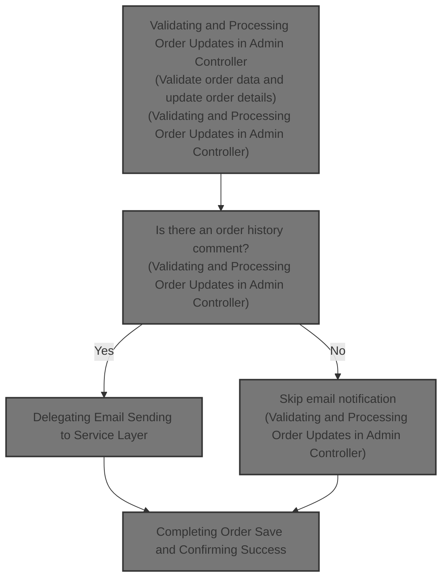
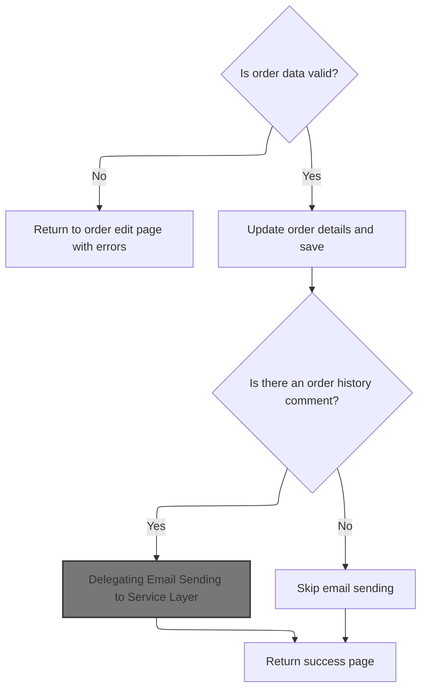

This document describes the flow of saving updated order information. It validates critical order fields, updates order details, manages order history comments, sends notification emails to customers if comments exist, and confirms the successful save of the order.



# Validating and Processing Order Updates in Admin Controller



This section handles validating and processing order updates in the admin controller, including validation of order data, updating order details, managing order history comments, and sending notification emails to customers.

| Category        | Rule Name                          | Description                                                                                                                                                           |
| --------------- | ---------------------------------- | --------------------------------------------------------------------------------------------------------------------------------------------------------------------- |
| Data validation | Order data validation              | Order updates must include valid customer email addresses and non-empty billing details such as first name, last name, address, city, state or zone, and postal code. |
| Business logic  | Order detail update                | When order data is valid, the system updates the order details including customer email, status, purchase date, billing and delivery addresses, and order history.    |
| Business logic  | Order history comment handling     | If an order history comment is provided, it must be added to the order history with a notification flag set, and the comment field cleared after saving.              |
| Business logic  | Email notification on order update | If an order history comment exists, the system must send an email notification to the customer with order status updates and comments.                                |
| Business logic  | Skip email if no comment           | If no order history comment is provided, the system must not send an email notification to the customer.                                                              |
| Business logic  | Payment transaction checks         | For orders not paid by money order, the system must identify capturable and refundable transactions and make them available for processing.                           |

<SwmSnippet path="/shopizer/sm-shop/src/main/java/com/salesmanager/web/admin/controller/orders/OrderControler.java" line="212">

---

In <SwmToken path="shopizer/sm-shop/src/main/java/com/salesmanager/web/admin/controller/orders/OrderControler.java" pos="212:5:5" line-data="	public String saveOrder(@Valid @ModelAttribute(&quot;order&quot;) com.salesmanager.web.admin.entity.orders.Order entityOrder, BindingResult result, Model model, HttpServletRequest request, Locale locale) throws Exception {">`saveOrder`</SwmToken> we start by validating the order's critical fields like email and billing details, setting model attributes for countries and order data, and handling payment transactions by checking capturable and refundable transactions. We also update order history if comments are provided and prepare to send notification emails. Calling <SwmToken path="shopizer/sm-core/src/main/java/com/salesmanager/core/business/system/service/EmailServiceImpl.java" pos="16:4:4" line-data="public class EmailServiceImpl implements EmailService {">`EmailServiceImpl`</SwmToken> next lets us send those emails to customers about order status updates.

```java
	public String saveOrder(@Valid @ModelAttribute("order") com.salesmanager.web.admin.entity.orders.Order entityOrder, BindingResult result, Model model, HttpServletRequest request, Locale locale) throws Exception {
		
		String email_regEx = "\\b[A-Za-z0-9._%+-]+@[A-Za-z0-9.-]+\\.[A-Za-z]{2,4}\\b";
		Pattern pattern = Pattern.compile(email_regEx);
		
		Language language = (Language)request.getAttribute("LANGUAGE");
		List<Country> countries = countryService.getCountries(language);
		model.addAttribute("countries", countries);
		
		MerchantStore store = (MerchantStore)request.getAttribute(Constants.ADMIN_STORE);
		
		//set the id if fails
		entityOrder.setId(entityOrder.getOrder().getId());
		
		model.addAttribute("order", entityOrder);
		
		Set<OrderProduct> orderProducts = new HashSet<OrderProduct>();
		Set<OrderTotal> orderTotal = new HashSet<OrderTotal>();
		Set<OrderStatusHistory> orderHistory = new HashSet<OrderStatusHistory>();
		
		Date date = new Date();
		if(!StringUtils.isBlank(entityOrder.getDatePurchased() ) ){
			try {
				date = DateUtil.getDate(entityOrder.getDatePurchased());
			} catch (Exception e) {
				ObjectError error = new ObjectError("datePurchased",messages.getMessage("message.invalid.date", locale));
				result.addError(error);
			}
			
		} else{
			date = null;
		}
		 

		if(!StringUtils.isBlank(entityOrder.getOrder().getCustomerEmailAddress() ) ){
			 java.util.regex.Matcher matcher = pattern.matcher(entityOrder.getOrder().getCustomerEmailAddress());
			 
			 if(!matcher.find()) {
				ObjectError error = new ObjectError("customerEmailAddress",messages.getMessage("Email.order.customerEmailAddress", locale));
				result.addError(error);
			 }
		}else{
			ObjectError error = new ObjectError("customerEmailAddress",messages.getMessage("NotEmpty.order.customerEmailAddress", locale));
			result.addError(error);
		}

		 
		if( StringUtils.isBlank(entityOrder.getOrder().getBilling().getFirstName() ) ){
			 ObjectError error = new ObjectError("billingFirstName", messages.getMessage("NotEmpty.order.billingFirstName", locale));
			 result.addError(error);
		}
		
		if( StringUtils.isBlank(entityOrder.getOrder().getBilling().getFirstName() ) ){
			 ObjectError error = new ObjectError("billingLastName", messages.getMessage("NotEmpty.order.billingLastName", locale));
			 result.addError(error);
		}
		 
		if( StringUtils.isBlank(entityOrder.getOrder().getBilling().getAddress() ) ){
			 ObjectError error = new ObjectError("billingAddress", messages.getMessage("NotEmpty.order.billingStreetAddress", locale));
			 result.addError(error);
		}
		 
		if( StringUtils.isBlank(entityOrder.getOrder().getBilling().getCity() ) ){
			 ObjectError error = new ObjectError("billingCity",messages.getMessage("NotEmpty.order.billingCity", locale));
			 result.addError(error);
		}
		 
		if( entityOrder.getOrder().getBilling().getZone()==null){
			if( StringUtils.isBlank(entityOrder.getOrder().getBilling().getState())){
				 ObjectError error = new ObjectError("billingState",messages.getMessage("NotEmpty.order.billingState", locale));
				 result.addError(error);
			}
		}
		 
		if( StringUtils.isBlank(entityOrder.getOrder().getBilling().getPostalCode() ) ){
			 ObjectError error = new ObjectError("billingPostalCode", messages.getMessage("NotEmpty.order.billingPostCode", locale));
			 result.addError(error);
		}
		
		com.salesmanager.core.business.order.model.Order newOrder = orderService.getById(entityOrder.getOrder().getId() );
		
		
		//get capturable
		if(newOrder.getPaymentType().name() != PaymentType.MONEYORDER.name()) {
			Transaction capturableTransaction = transactionService.getCapturableTransaction(newOrder);
			if(capturableTransaction!=null) {
				model.addAttribute("capturableTransaction",capturableTransaction);
			}
		}
		
		
		//get refundable
		if(newOrder.getPaymentType().name() != PaymentType.MONEYORDER.name()) {
			Transaction refundableTransaction = transactionService.getRefundableTransaction(newOrder);
			if(refundableTransaction!=null) {
					model.addAttribute("capturableTransaction",null);//remove capturable
					model.addAttribute("refundableTransaction",refundableTransaction);
			}
		}
	
	
		if (result.hasErrors()) {
			//  somehow we lose data, so reset Order detail info.
			entityOrder.getOrder().setOrderProducts( orderProducts);
			entityOrder.getOrder().setOrderTotal(orderTotal);
			entityOrder.getOrder().setOrderHistory(orderHistory);
			
			return ControllerConstants.Tiles.Order.ordersEdit;
		/*	"admin-orders-edit";  */
		}
		
		OrderStatusHistory orderStatusHistory = new OrderStatusHistory();		


		
		Country deliveryCountry = countryService.getByCode( entityOrder.getOrder().getDelivery().getCountry().getIsoCode()); 
		Country billingCountry  = countryService.getByCode( entityOrder.getOrder().getBilling().getCountry().getIsoCode()) ;
		Zone billingZone = null;
		Zone deliveryZone = null;
		if(entityOrder.getOrder().getBilling().getZone()!=null) {
			billingZone = zoneService.getByCode(entityOrder.getOrder().getBilling().getZone().getCode());
		}
		
		if(entityOrder.getOrder().getDelivery().getZone()!=null) {
			deliveryZone = zoneService.getByCode(entityOrder.getOrder().getDelivery().getZone().getCode());
		}

		newOrder.setCustomerEmailAddress(entityOrder.getOrder().getCustomerEmailAddress() );
		newOrder.setStatus(entityOrder.getOrder().getStatus() );		
		
		newOrder.setDatePurchased(date);
		newOrder.setLastModified( new Date() );
		
		if(!StringUtils.isBlank(entityOrder.getOrderHistoryComment() ) ) {
			orderStatusHistory.setComments( entityOrder.getOrderHistoryComment() );
			orderStatusHistory.setCustomerNotified(1);
			orderStatusHistory.setStatus(entityOrder.getOrder().getStatus());
			orderStatusHistory.setDateAdded(new Date() );
			orderStatusHistory.setOrder(newOrder);
			newOrder.getOrderHistory().add( orderStatusHistory );
			entityOrder.setOrderHistoryComment( "" );
		}		
		
		newOrder.setDelivery( entityOrder.getOrder().getDelivery() );
		newOrder.setBilling( entityOrder.getOrder().getBilling() );
		
		newOrder.getDelivery().setCountry(deliveryCountry );
		newOrder.getBilling().setCountry(billingCountry );	
		
		if(billingZone!=null) {
			newOrder.getBilling().setZone(billingZone);
		}
		
		if(deliveryZone!=null) {
			newOrder.getDelivery().setZone(deliveryZone);
		}
		
		orderService.saveOrUpdate(newOrder);
		entityOrder.setOrder(newOrder);
		entityOrder.setBilling(newOrder.getBilling());
		entityOrder.setDelivery(newOrder.getDelivery());
		model.addAttribute("order", entityOrder);
		
		Long customerId = newOrder.getCustomerId();
		
		if(customerId!=null && customerId>0) {
		
			try {
				
				Customer customer = customerService.getById(customerId);
				if(customer!=null) {
					model.addAttribute("customer",customer);
				}
				
				
			} catch(Exception e) {
				LOGGER.error("Error while getting customer for customerId " + customerId, e);
			}
		
		}

		List<OrderProductDownload> orderProductDownloads = orderProdctDownloadService.getByOrderId(newOrder.getId());
		if(CollectionUtils.isNotEmpty(orderProductDownloads)) {
			model.addAttribute("downloads",orderProductDownloads);
		}
		
		
		/** 
		 * send email if admin posted orderHistoryComment
		 * 
		 * **/
		
		if(StringUtils.isBlank(entityOrder.getOrderHistoryComment())) {
		
			try {
				
				Customer customer = customerService.getById(newOrder.getCustomerId());
				Language lang = store.getDefaultLanguage();
				if(customer!=null) {
					lang = customer.getDefaultLanguage();
				}
				
				Locale customerLocale = LocaleUtils.getLocale(lang);

				StringBuilder customerName = new StringBuilder();
				customerName.append(newOrder.getBilling().getFirstName()).append(" ").append(newOrder.getBilling().getLastName());
				
				
				Map<String, String> templateTokens = EmailUtils.createEmailObjectsMap(request.getContextPath(), store, messages, customerLocale);
				templateTokens.put(EmailConstants.EMAIL_CUSTOMER_NAME, customerName.toString());
				templateTokens.put(EmailConstants.EMAIL_TEXT_ORDER_NUMBER, messages.getMessage("email.order.confirmation", new String[]{String.valueOf(newOrder.getId())}, customerLocale));
				templateTokens.put(EmailConstants.EMAIL_TEXT_DATE_ORDERED, messages.getMessage("email.order.ordered", new String[]{entityOrder.getDatePurchased()}, customerLocale));
				templateTokens.put(EmailConstants.EMAIL_TEXT_STATUS_COMMENTS, messages.getMessage("email.order.comments", new String[]{entityOrder.getOrderHistoryComment()}, customerLocale));
				templateTokens.put(EmailConstants.EMAIL_TEXT_DATE_UPDATED, messages.getMessage("email.order.updated", new String[]{DateUtils.formatDate(new Date())}, customerLocale));

				
				Email email = new Email();
				email.setFrom(store.getStorename());
				email.setFromEmail(store.getStoreEmailAddress());
				email.setSubject(messages.getMessage("email.order.status.title",new String[]{String.valueOf(newOrder.getId())},customerLocale));
				email.setTo(entityOrder.getOrder().getCustomerEmailAddress());
				email.setTemplateName(ORDER_STATUS_TMPL);
				email.setTemplateTokens(templateTokens);
	
	
				
				emailService.sendHtmlEmail(store, email);
			
			} catch (Exception e) {
				LOGGER.error("Cannot send email to customer",e);
			}
			
		}
		
```

---

</SwmSnippet>

## Delegating Email Sending to Service Layer

This section describes the process of delegating email sending to the service layer in Shopizer, where the email configuration is set up for a specific store and then the email is sent using a sender component.

| Category       | Rule Name                          | Description                                                                                                                                                                                                                                                                                                                                                                |
| -------------- | ---------------------------------- | -------------------------------------------------------------------------------------------------------------------------------------------------------------------------------------------------------------------------------------------------------------------------------------------------------------------------------------------------------------------------- |
| Business logic | Store-specific email configuration | The email must be sent using the configuration specific to the <SwmToken path="shopizer/sm-shop/src/main/java/com/salesmanager/web/admin/controller/orders/OrderControler.java" pos="221:1:1" line-data="		MerchantStore store = (MerchantStore)request.getAttribute(Constants.ADMIN_STORE);">`MerchantStore`</SwmToken> to ensure correct sender details and SMTP settings. |
| Business logic | HTML email format                  | The email content must be sent as HTML to support rich formatting and branding in customer communications.                                                                                                                                                                                                                                                                 |

<SwmSnippet path="/shopizer/sm-core/src/main/java/com/salesmanager/core/business/system/service/EmailServiceImpl.java" line="25">

---

<SwmToken path="shopizer/sm-core/src/main/java/com/salesmanager/core/business/system/service/EmailServiceImpl.java" pos="25:5:5" line-data="	public void sendHtmlEmail(MerchantStore store, Email email) throws ServiceException, Exception {">`sendHtmlEmail`</SwmToken> sets up the email configuration for the store, then calls the sender component to actually send the email with those settings.

```java
	public void sendHtmlEmail(MerchantStore store, Email email) throws ServiceException, Exception {

		EmailConfig emailConfig = getEmailConfiguration(store);
		
		sender.setEmailConfig(emailConfig);
		sender.send(email);
	}
```

---

</SwmSnippet>

## Constructing and Sending Multipart HTML Emails

This section describes the process of constructing and sending multipart HTML emails, including dynamic mail sender configuration, generating plain text and HTML content from templates, and assembling the email structure.

| Category       | Rule Name                         | Description                                                                                                                                 |
| -------------- | --------------------------------- | ------------------------------------------------------------------------------------------------------------------------------------------- |
| Business logic | Multipart email content           | Every email must include both a plain text version and an HTML version of the content to ensure compatibility with different email clients. |
| Business logic | Template-based content generation | The email content must be generated using predefined templates and tokens to ensure consistent branding and personalized messaging.         |
| Business logic | Sender identification             | The sender's email address and personal name must be correctly set in the email header to ensure proper identification of the sender.       |

<SwmSnippet path="/shopizer/sm-core/src/main/java/com/salesmanager/core/modules/email/HtmlEmailSenderImpl.java" line="40">

---

In <SwmToken path="shopizer/sm-core/src/main/java/com/salesmanager/core/modules/email/HtmlEmailSenderImpl.java" pos="40:5:5" line-data="	public void send(Email email)">`send`</SwmToken> we first configure the mail sender dynamically if <SwmToken path="shopizer/sm-core/src/main/java/com/salesmanager/core/modules/email/HtmlEmailSenderImpl.java" pos="56:3:3" line-data="				if(emailConfig != null) {">`emailConfig`</SwmToken> is present, then generate both plain text and HTML email content using FreeMarker templates, and start building the multipart email structure.

```java
	public void send(Email email)
			throws Exception {
		
		final String eml = email.getFrom();
		final String from = email.getFromEmail();
		final String to = email.getTo();
		final String subject = email.getSubject();
		final String tmpl = email.getTemplateName();
		final Map<String,String> templateTokens = email.getTemplateTokens();

		MimeMessagePreparator preparator = new MimeMessagePreparator() {
			public void prepare(MimeMessage mimeMessage)
					throws MessagingException, IOException {
				
				JavaMailSenderImpl impl = (JavaMailSenderImpl)mailSender;
				// if email configuration is present in Database, use the same
				if(emailConfig != null) {
					impl.setProtocol(emailConfig.getProtocol());
					impl.setHost(emailConfig.getHost());
					impl.setPort(Integer.parseInt(emailConfig.getPort()));
					impl.setUsername(emailConfig.getUsername());
					impl.setPassword(emailConfig.getPassword());
					
					Properties prop = new Properties();
					prop.put("mail.smtp.auth", emailConfig.isSmtpAuth());
					prop.put("mail.smtp.starttls.enable", emailConfig.isStarttls());
					impl.setJavaMailProperties(prop);
				}
				
				mimeMessage.setRecipient(Message.RecipientType.TO, new InternetAddress(to));

				InternetAddress inetAddress = new InternetAddress();

				inetAddress.setPersonal(eml);
				inetAddress.setAddress(from);

				mimeMessage.setFrom(inetAddress);
				mimeMessage.setSubject(subject);

				Multipart mp = new MimeMultipart("alternative");

				// Create a "text" Multipart message
				BodyPart textPart = new MimeBodyPart();
				freemarkerMailConfiguration.setClassForTemplateLoading(HtmlEmailSenderImpl.class, "/");
				Template textTemplate = freemarkerMailConfiguration.getTemplate(new StringBuilder(TEMPLATE_PATH).append("").append("/").append(tmpl).toString());
				final StringWriter textWriter = new StringWriter();
				try {
					textTemplate.process(templateTokens, textWriter);
				} catch (TemplateException e) {
					throw new MailPreparationException(
							"Can't generate text mail", e);
				}
				textPart.setDataHandler(new javax.activation.DataHandler(
						new javax.activation.DataSource() {
							public InputStream getInputStream()
									throws IOException {
								//return new StringBufferInputStream(textWriter
								//		.toString());
								return new ByteArrayInputStream(textWriter
										.toString().getBytes(CHARSET));
							}

							public OutputStream getOutputStream()
									throws IOException {
								throw new IOException("Read-only data");
							}

							public String getContentType() {
								return "text/plain";
							}

							public String getName() {
								return "main";
							}
						}));
				mp.addBodyPart(textPart);

				// Create a "HTML" Multipart message
				Multipart htmlContent = new MimeMultipart("related");
				BodyPart htmlPage = new MimeBodyPart();
				freemarkerMailConfiguration.setClassForTemplateLoading(HtmlEmailSenderImpl.class, "/");
				Template htmlTemplate = freemarkerMailConfiguration.getTemplate(new StringBuilder(TEMPLATE_PATH).append("").append("/").append(tmpl).toString());
				final StringWriter htmlWriter = new StringWriter();
				try {
					htmlTemplate.process(templateTokens, htmlWriter);
				} catch (TemplateException e) {
					throw new MailPreparationException(
							"Can't generate HTML mail", e);
				}
```

---

</SwmSnippet>

### Order Processing Logic in Service Layer

The Order Processing Logic in the Service Layer manages the business rules and workflows for processing customer orders within the Shopizer e-commerce platform.

| Category        | Rule Name                 | Description                                                                                                            |
| --------------- | ------------------------- | ---------------------------------------------------------------------------------------------------------------------- |
| Data validation | Minimum order items       | An order must contain at least one item before it can be processed.                                                    |
| Business logic  | Order total calculation   | The total order amount must be calculated by summing the price of all items, including applicable taxes and discounts. |
| Business logic  | Credit card authorization | Orders with payment method set to credit card must be authorized before processing.                                    |
| Business logic  | Order identification      | Orders must be assigned a unique identifier upon successful processing for tracking and reference.                     |
| Business logic  | Order timestamping        | Orders must be timestamped with the date and time of processing to maintain accurate records.                          |

See <SwmLink doc-title="Order processing flow">[Order processing flow](.swm%5Corder-processing-flow.q6km9wfo.sw.md)</SwmLink>

### Finalizing Multipart Email and Sending It

<SwmSnippet path="/shopizer/sm-core/src/main/java/com/salesmanager/core/modules/email/HtmlEmailSenderImpl.java" line="129">

---

After returning from OrderServiceImpl.process, in <SwmToken path="shopizer/sm-core/src/main/java/com/salesmanager/core/modules/email/HtmlEmailSenderImpl.java" pos="168:3:3" line-data="		mailSender.send(preparator);">`send`</SwmToken> we finish building the multipart email by adding the HTML part as related content, then set the full multipart content on the message and send it.

```java
				htmlPage.setDataHandler(new javax.activation.DataHandler(
						new javax.activation.DataSource() {
							public InputStream getInputStream()
									throws IOException {
								//return new StringBufferInputStream(htmlWriter
								//		.toString());
								return new ByteArrayInputStream(textWriter
										.toString().getBytes(CHARSET));
							}

							public OutputStream getOutputStream()
									throws IOException {
								throw new IOException("Read-only data");
							}

							public String getContentType() {
								return "text/html";
							}

							public String getName() {
								return "main";
							}
						}));
				htmlContent.addBodyPart(htmlPage);
				BodyPart htmlPart = new MimeBodyPart();
				htmlPart.setContent(htmlContent);
				mp.addBodyPart(htmlPart);

				mimeMessage.setContent(mp);

				// if(attachment!=null) {
				// MimeMessageHelper messageHelper = new
				// MimeMessageHelper(mimeMessage, true);
				// messageHelper.addAttachment(attachmentFileName, attachment);
				// }

			}
		};

		mailSender.send(preparator);
	}
```

---

</SwmSnippet>

## Completing Order Save and Confirming Success

<SwmSnippet path="/shopizer/sm-shop/src/main/java/com/salesmanager/web/admin/controller/orders/OrderControler.java" line="447">

---

After returning from EmailServiceImpl.sendHtmlEmail, <SwmToken path="shopizer/sm-shop/src/main/java/com/salesmanager/web/admin/controller/orders/OrderControler.java" pos="212:5:5" line-data="	public String saveOrder(@Valid @ModelAttribute(&quot;order&quot;) com.salesmanager.web.admin.entity.orders.Order entityOrder, BindingResult result, Model model, HttpServletRequest request, Locale locale) throws Exception {">`saveOrder`</SwmToken> sets a success flag in the model and returns the order edit view to confirm the update.

```java
		model.addAttribute("success","success");

		
		return  ControllerConstants.Tiles.Order.ordersEdit;
	    /*	"admin-orders-edit";  */
	}
```

---

</SwmSnippet>

&nbsp;

*This is an auto-generated document by Swimm 🌊 and has not yet been verified by a human*

<SwmMeta version="3.0.0" repo-id="Z2l0aHViJTNBJTNBU2hvcGl6ZXIlM0ElM0F1bWFsaW5nYXN3YW1p" repo-name="Shopizer"><sup>Powered by [Swimm](https://app.swimm.io/)</sup></SwmMeta>
