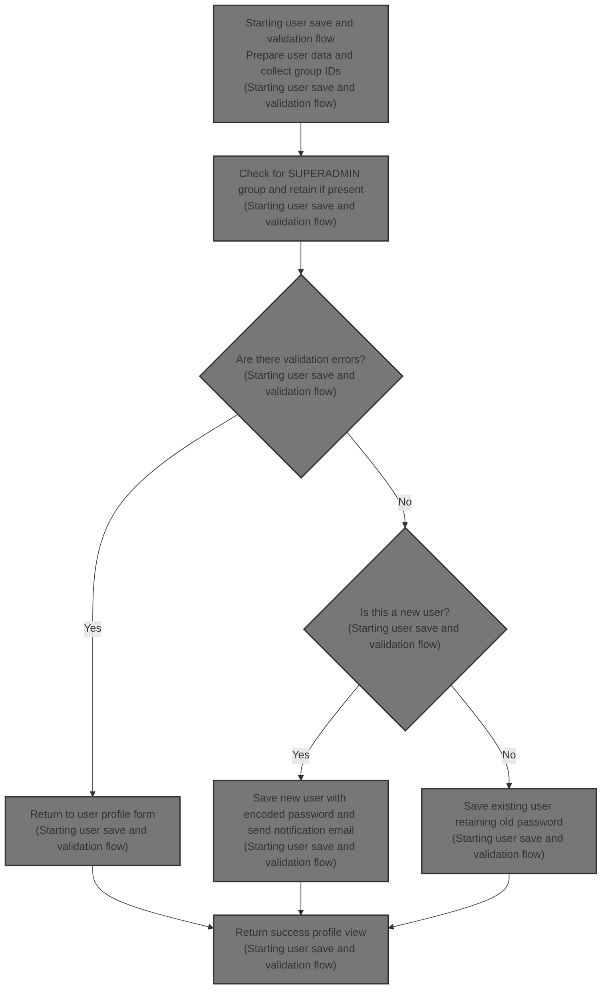

This document describes the process of saving a user profile within the admin interface. It covers collecting and validating user group assignments, preserving the SUPERADMIN group, handling passwords securely for new and existing users, and sending notification emails to new users. The flow receives user data as input and outputs a saved user profile with updated information and notifications.



# Starting user save and validation flow

```mermaid
%%{init: {"flowchart": {"defaultRenderer": "elk"}} }%%
flowchart TD
    node1["Prepare user and submitted groups"] --> subgraph loop1["For each submitted group: collect group IDs"]
        node2["Extract group ID"]
    end
    loop1 --> subgraph loop2["For each existing user group: check for SUPERADMIN"]
        node3["Detect SUPERADMIN group"]
    end
    loop2 --> node4{"Are there validation errors?"}
    node4 -->|"Yes"| node5["Return to user profile form"]
    node4 -->|"No"| node6{"Is this a new user?"}
    node6 -->|"Yes"| node7["Encode password and save new user"]
    node7 --> node8["Send notification email to new user"]
    node6 -->|"No"| node9["Retain old password and save existing user"]
    node8 --> node10["Return success profile view"]
    node9 --> node10
    node5 --> node10

    click node1 openCode "shopizer/sm-shop/src/main/java/com/salesmanager/web/admin/controller/user/UserController.java:472:506"
    click node2 openCode "shopizer/sm-shop/src/main/java/com/salesmanager/web/admin/controller/user/UserController.java:502:507"
    click node3 openCode "shopizer/sm-shop/src/main/java/com/salesmanager/web/admin/controller/user/UserController.java:537:552"
    click node4 openCode "shopizer/sm-shop/src/main/java/com/salesmanager/web/admin/controller/user/UserController.java:572:575"
    click node5 openCode "shopizer/sm-shop/src/main/java/com/salesmanager/web/admin/controller/user/UserController.java:572:575"
    click node6 openCode "shopizer/sm-shop/src/main/java/com/salesmanager/web/admin/controller/user/UserController.java:585:632"
    click node7 openCode "shopizer/sm-shop/src/main/java/com/salesmanager/web/admin/controller/user/UserController.java:577:582"
    click node8 openCode "shopizer/sm-core/src/main/java/com/salesmanager/core/business/system/service/EmailServiceImpl.java:25:50"
    click node9 openCode "shopizer/sm-shop/src/main/java/com/salesmanager/web/admin/controller/user/UserController.java:577:582"
    click node10 openCode "shopizer/sm-shop/src/main/java/com/salesmanager/web/admin/controller/user/UserController.java:634:637"

classDef HeadingStyle fill:#777777,stroke:#333,stroke-width:2px;

%% Swimm:
%% %%{init: {"flowchart": {"defaultRenderer": "elk"}} }%%
%% flowchart TD
%%     node1["Prepare user and submitted groups"] --> subgraph loop1["For each submitted group: collect group IDs"]
%%         node2["Extract group ID"]
%%     end
%%     loop1 --> subgraph loop2["For each existing user group: check for SUPERADMIN"]
%%         node3["Detect SUPERADMIN group"]
%%     end
%%     loop2 --> node4{"Are there validation errors?"}
%%     node4 -->|"Yes"| node5["Return to user profile form"]
%%     node4 -->|"No"| node6{"Is this a new user?"}
%%     node6 -->|"Yes"| node7["Encode password and save new user"]
%%     node7 --> node8["Send notification email to new user"]
%%     node6 -->|"No"| node9["Retain old password and save existing user"]
%%     node8 --> node10["Return success profile view"]
%%     node9 --> node10
%%     node5 --> node10
%% 
%%     click node1 openCode "<SwmPath>[shopizer/…/user/UserController.java](shopizer/sm-shop/src/main/java/com/salesmanager/web/admin/controller/user/UserController.java)</SwmPath>:472:506"
%%     click node2 openCode "<SwmPath>[shopizer/…/user/UserController.java](shopizer/sm-shop/src/main/java/com/salesmanager/web/admin/controller/user/UserController.java)</SwmPath>:502:507"
%%     click node3 openCode "<SwmPath>[shopizer/…/user/UserController.java](shopizer/sm-shop/src/main/java/com/salesmanager/web/admin/controller/user/UserController.java)</SwmPath>:537:552"
%%     click node4 openCode "<SwmPath>[shopizer/…/user/UserController.java](shopizer/sm-shop/src/main/java/com/salesmanager/web/admin/controller/user/UserController.java)</SwmPath>:572:575"
%%     click node5 openCode "<SwmPath>[shopizer/…/user/UserController.java](shopizer/sm-shop/src/main/java/com/salesmanager/web/admin/controller/user/UserController.java)</SwmPath>:572:575"
%%     click node6 openCode "<SwmPath>[shopizer/…/user/UserController.java](shopizer/sm-shop/src/main/java/com/salesmanager/web/admin/controller/user/UserController.java)</SwmPath>:585:632"
%%     click node7 openCode "<SwmPath>[shopizer/…/user/UserController.java](shopizer/sm-shop/src/main/java/com/salesmanager/web/admin/controller/user/UserController.java)</SwmPath>:577:582"
%%     click node8 openCode "<SwmPath>[shopizer/…/service/EmailServiceImpl.java](shopizer/sm-core/src/main/java/com/salesmanager/core/business/system/service/EmailServiceImpl.java)</SwmPath>:25:50"
%%     click node9 openCode "<SwmPath>[shopizer/…/user/UserController.java](shopizer/sm-shop/src/main/java/com/salesmanager/web/admin/controller/user/UserController.java)</SwmPath>:577:582"
%%     click node10 openCode "<SwmPath>[shopizer/…/user/UserController.java](shopizer/sm-shop/src/main/java/com/salesmanager/web/admin/controller/user/UserController.java)</SwmPath>:634:637"
%% 
%% classDef HeadingStyle fill:#777777,stroke:#333,stroke-width:2px;
```

This section handles the process of saving and validating user data, including group assignments, password encoding, and sending notification emails for new users.

| Category        | Rule Name                            | Description                                                                                                                                     |
| --------------- | ------------------------------------ | ----------------------------------------------------------------------------------------------------------------------------------------------- |
| Data validation | Validation Error Handling            | If there are validation errors in the user data, the system must return to the user profile form to allow corrections.                          |
| Data validation | Collect and Validate User Groups     | User group IDs must be collected and validated from submitted groups to ensure correct group assignments.                                       |
| Business logic  | Retain SUPERADMIN Group              | If the user belongs to the SUPERADMIN group, this group must always be retained to prevent loss of super admin rights.                          |
| Business logic  | Encode Password for New Users        | When creating a new user, the password must be encoded before saving to ensure security.                                                        |
| Business logic  | Retain Password for Existing Users   | For existing users, the original password must be retained and not changed during profile updates unless explicitly modified.                   |
| Business logic  | Send Notification Email to New Users | Upon successful creation of a new user, a notification email must be sent to the user's registered email address with relevant account details. |

<SwmSnippet path="/shopizer/sm-shop/src/main/java/com/salesmanager/web/admin/controller/user/UserController.java" line="472">

---

We start <SwmToken path="shopizer/sm-shop/src/main/java/com/salesmanager/web/admin/controller/user/UserController.java" pos="472:5:5" line-data="	public String saveUser(@Valid @ModelAttribute(&quot;user&quot;) User user, BindingResult result, Model model, HttpServletRequest request, Locale locale) throws Exception {">`saveUser`</SwmToken> by preparing user data, validating groups, and setting up for password and email handling.

```java
	public String saveUser(@Valid @ModelAttribute("user") User user, BindingResult result, Model model, HttpServletRequest request, Locale locale) throws Exception {


		setMenu(model,request);
		
		MerchantStore store = (MerchantStore)request.getAttribute(Constants.ADMIN_STORE);

		
		this.populateUserObjects(user, store, model, locale);
		
		Language language = user.getDefaultLanguage();
		
		Language l = languageService.getById(language.getId());
		
		user.setDefaultLanguage(l);
		
		Locale userLocale = LocaleUtils.getLocale(l);
		
		
		
		User dbUser = null;
		
		//edit mode, need to get original user important information
		if(user.getId()!=null) {
			dbUser = userService.getByUserName(user.getAdminName());
			if(dbUser==null) {
				return "redirect://admin/users/displayUser.html";
			}
		}

		List<Group> submitedGroups = user.getGroups();
		Set<Integer> ids = new HashSet<Integer>();
		for(Group group : submitedGroups) {
			ids.add(Integer.parseInt(group.getGroupName()));
		}
```

---

</SwmSnippet>

<SwmSnippet path="/shopizer/sm-shop/src/main/java/com/salesmanager/web/admin/controller/user/UserController.java" line="537">

---

Next in <SwmToken path="shopizer/sm-shop/src/main/java/com/salesmanager/web/admin/controller/user/UserController.java" pos="472:5:5" line-data="	public String saveUser(@Valid @ModelAttribute(&quot;user&quot;) User user, BindingResult result, Model model, HttpServletRequest request, Locale locale) throws Exception {">`saveUser`</SwmToken> we check if the user being edited belongs to the SUPERADMIN group. If yes, we keep that group assigned to prevent losing super admin rights.

```java
		Group superAdmin = null;
		
		if(user.getId()!=null && user.getId()>0) {
			if(user.getId().longValue()!=dbUser.getId().longValue()) {
				return "redirect://admin/users/displayUser.html";
			}
			
			List<Group> groups = dbUser.getGroups();
			//boolean removeSuperAdmin = true;
			for(Group group : groups) {
				//can't revoke super admin
				if(group.getGroupName().equals("SUPERADMIN")) {
					superAdmin = group;
				}
			}
```

---

</SwmSnippet>

<SwmSnippet path="/shopizer/sm-shop/src/main/java/com/salesmanager/web/admin/controller/user/UserController.java" line="562">

---

Here we finalize group assignments, encode passwords differently for new and existing users, save the user, and send a welcome email if it's a new user.

```java
		if(superAdmin!=null) {
			ids.add(superAdmin.getId());
		}

		
		List<Group> newGroups = groupService.listGroupByIds(ids);

		//set actual user groups
		user.setGroups(newGroups);
		
		if (result.hasErrors()) {
			return ControllerConstants.Tiles.User.profile;
		}
		
		String decodedPassword = user.getAdminPassword();
		if(user.getId()!=null && user.getId()>0) {
			user.setAdminPassword(dbUser.getAdminPassword());
		} else {
			String encoded = passwordEncoder.encodePassword(user.getAdminPassword(),null);
			user.setAdminPassword(encoded);
		}
		
		
		if(user.getId()==null || user.getId().longValue()==0) {
			
			//save or update user
			userService.saveOrUpdate(user);
			
			try {

				//creation of a user, send an email
				String userName = user.getFirstName();
				if(StringUtils.isBlank(userName)) {
					userName = user.getAdminName();
				}
				String[] userNameArg = {userName};
				
				
				Map<String, String> templateTokens = EmailUtils.createEmailObjectsMap(request.getContextPath(), store, messages, userLocale);
				templateTokens.put(EmailConstants.EMAIL_NEW_USER_TEXT, messages.getMessage("email.greeting", userNameArg, userLocale));
				templateTokens.put(EmailConstants.EMAIL_USER_FIRSTNAME, user.getFirstName());
				templateTokens.put(EmailConstants.EMAIL_USER_LASTNAME, user.getLastName());
				templateTokens.put(EmailConstants.EMAIL_ADMIN_USERNAME_LABEL, messages.getMessage("label.generic.username",userLocale));
				templateTokens.put(EmailConstants.EMAIL_ADMIN_NAME, user.getAdminName());
				templateTokens.put(EmailConstants.EMAIL_TEXT_NEW_USER_CREATED, messages.getMessage("email.newuser.text",userLocale));
				templateTokens.put(EmailConstants.EMAIL_ADMIN_PASSWORD_LABEL, messages.getMessage("label.generic.password",userLocale));
				templateTokens.put(EmailConstants.EMAIL_ADMIN_PASSWORD, decodedPassword);
				templateTokens.put(EmailConstants.EMAIL_ADMIN_URL_LABEL, messages.getMessage("label.adminurl",userLocale));
				templateTokens.put(EmailConstants.EMAIL_ADMIN_URL, FilePathUtils.buildAdminUri(store, request));
	
				
				Email email = new Email();
				email.setFrom(store.getStorename());
				email.setFromEmail(store.getStoreEmailAddress());
				email.setSubject(messages.getMessage("email.newuser.title",userLocale));
				email.setTo(user.getAdminEmail());
				email.setTemplateName(NEW_USER_TMPL);
				email.setTemplateTokens(templateTokens);
	
	
				
				emailService.sendHtmlEmail(store, email);
			
			} catch (Exception e) {
				LOGGER.error("Cannot send email to user",e);
			}
			
		} else {
			//save or update user
			userService.saveOrUpdate(user);
		}

```

---

</SwmSnippet>

## Configuring and delegating email sending

This section handles the configuration and delegation of email sending within the Shopizer platform, ensuring that emails are sent using the store-specific email settings.

| Category       | Rule Name                          | Description                                                                                                                 |
| -------------- | ---------------------------------- | --------------------------------------------------------------------------------------------------------------------------- |
| Business logic | Store-specific email configuration | Emails must be sent using the email configuration specific to the store to ensure correct sender details and SMTP settings. |

<SwmSnippet path="/shopizer/sm-core/src/main/java/com/salesmanager/core/business/system/service/EmailServiceImpl.java" line="25">

---

SendHtmlEmail fetches the store's email config, applies it to the sender, and calls <SwmToken path="shopizer/sm-core/src/main/java/com/salesmanager/core/business/system/service/EmailServiceImpl.java" pos="30:1:3" line-data="		sender.send(email);">`sender.send`</SwmToken> to handle the actual sending.

```java
	public void sendHtmlEmail(MerchantStore store, Email email) throws ServiceException, Exception {

		EmailConfig emailConfig = getEmailConfiguration(store);
		
		sender.setEmailConfig(emailConfig);
		sender.send(email);
	}
```

---

</SwmSnippet>

## Preparing multipart email content with templates

This section describes the process of preparing multipart email content using templates in Shopizer's email sending module.

| Category        | Rule Name                             | Description                                                                                                                     |
| --------------- | ------------------------------------- | ------------------------------------------------------------------------------------------------------------------------------- |
| Data validation | Email Recipient and Sender Validation | The email must have a valid recipient address and a properly formatted sender address with a personal name.                     |
| Business logic  | Multipart Email Composition           | The email must be composed as a multipart message containing both plain text and HTML parts to support different email clients. |
| Business logic  | Template Processing for Email Content | Email content must be generated by processing FreeMarker templates with provided tokens to dynamically insert content.          |

<SwmSnippet path="/shopizer/sm-core/src/main/java/com/salesmanager/core/modules/email/HtmlEmailSenderImpl.java" line="40">

---

In send we configure the mail sender dynamically, load and process FreeMarker templates for text and HTML parts, and build a multipart email ready to send.

```java
	public void send(Email email)
			throws Exception {
		
		final String eml = email.getFrom();
		final String from = email.getFromEmail();
		final String to = email.getTo();
		final String subject = email.getSubject();
		final String tmpl = email.getTemplateName();
		final Map<String,String> templateTokens = email.getTemplateTokens();

		MimeMessagePreparator preparator = new MimeMessagePreparator() {
			public void prepare(MimeMessage mimeMessage)
					throws MessagingException, IOException {
				
				JavaMailSenderImpl impl = (JavaMailSenderImpl)mailSender;
				// if email configuration is present in Database, use the same
				if(emailConfig != null) {
					impl.setProtocol(emailConfig.getProtocol());
					impl.setHost(emailConfig.getHost());
					impl.setPort(Integer.parseInt(emailConfig.getPort()));
					impl.setUsername(emailConfig.getUsername());
					impl.setPassword(emailConfig.getPassword());
					
					Properties prop = new Properties();
					prop.put("mail.smtp.auth", emailConfig.isSmtpAuth());
					prop.put("mail.smtp.starttls.enable", emailConfig.isStarttls());
					impl.setJavaMailProperties(prop);
				}
				
				mimeMessage.setRecipient(Message.RecipientType.TO, new InternetAddress(to));

				InternetAddress inetAddress = new InternetAddress();

				inetAddress.setPersonal(eml);
				inetAddress.setAddress(from);

				mimeMessage.setFrom(inetAddress);
				mimeMessage.setSubject(subject);

				Multipart mp = new MimeMultipart("alternative");

				// Create a "text" Multipart message
				BodyPart textPart = new MimeBodyPart();
				freemarkerMailConfiguration.setClassForTemplateLoading(HtmlEmailSenderImpl.class, "/");
				Template textTemplate = freemarkerMailConfiguration.getTemplate(new StringBuilder(TEMPLATE_PATH).append("").append("/").append(tmpl).toString());
				final StringWriter textWriter = new StringWriter();
				try {
					textTemplate.process(templateTokens, textWriter);
				} catch (TemplateException e) {
					throw new MailPreparationException(
							"Can't generate text mail", e);
				}
				textPart.setDataHandler(new javax.activation.DataHandler(
						new javax.activation.DataSource() {
							public InputStream getInputStream()
									throws IOException {
								//return new StringBufferInputStream(textWriter
								//		.toString());
								return new ByteArrayInputStream(textWriter
										.toString().getBytes(CHARSET));
							}

							public OutputStream getOutputStream()
									throws IOException {
								throw new IOException("Read-only data");
							}

							public String getContentType() {
								return "text/plain";
							}

							public String getName() {
								return "main";
							}
						}));
				mp.addBodyPart(textPart);

				// Create a "HTML" Multipart message
				Multipart htmlContent = new MimeMultipart("related");
				BodyPart htmlPage = new MimeBodyPart();
				freemarkerMailConfiguration.setClassForTemplateLoading(HtmlEmailSenderImpl.class, "/");
				Template htmlTemplate = freemarkerMailConfiguration.getTemplate(new StringBuilder(TEMPLATE_PATH).append("").append("/").append(tmpl).toString());
				final StringWriter htmlWriter = new StringWriter();
				try {
					htmlTemplate.process(templateTokens, htmlWriter);
				} catch (TemplateException e) {
					throw new MailPreparationException(
							"Can't generate HTML mail", e);
				}
```

---

</SwmSnippet>

### Order processing integration (contextual call)

The Order processing integration section manages the interaction between the e-commerce platform and external order processing systems to ensure seamless order fulfillment.

| Category        | Rule Name                            | Description                                                                                                                                    |
| --------------- | ------------------------------------ | ---------------------------------------------------------------------------------------------------------------------------------------------- |
| Data validation | Payment validation before forwarding | Only orders with valid payment confirmation should be forwarded to the external processing system to prevent processing of unpaid orders.      |
| Business logic  | Immediate order forwarding           | Orders must be sent to the external processing system immediately after confirmation to ensure timely fulfillment.                             |
| Business logic  | Order status synchronization         | Order status updates received from the external system must be synchronized with the internal order management system to maintain consistency. |

See <SwmLink doc-title="Order processing and payment flow">[Order processing and payment flow](.swm%5Corder-processing-and-payment-flow.babktzxw.sw.md)</SwmLink>

### Finalizing and sending the multipart email

<SwmSnippet path="/shopizer/sm-core/src/main/java/com/salesmanager/core/modules/email/HtmlEmailSenderImpl.java" line="129">

---

After returning from OrderServiceImpl.process, we finish building the multipart email with HTML content, set it on the message, and send it.

```java
				htmlPage.setDataHandler(new javax.activation.DataHandler(
						new javax.activation.DataSource() {
							public InputStream getInputStream()
									throws IOException {
								//return new StringBufferInputStream(htmlWriter
								//		.toString());
								return new ByteArrayInputStream(textWriter
										.toString().getBytes(CHARSET));
							}

							public OutputStream getOutputStream()
									throws IOException {
								throw new IOException("Read-only data");
							}

							public String getContentType() {
								return "text/html";
							}

							public String getName() {
								return "main";
							}
						}));
				htmlContent.addBodyPart(htmlPage);
				BodyPart htmlPart = new MimeBodyPart();
				htmlPart.setContent(htmlContent);
				mp.addBodyPart(htmlPart);

				mimeMessage.setContent(mp);

				// if(attachment!=null) {
				// MimeMessageHelper messageHelper = new
				// MimeMessageHelper(mimeMessage, true);
				// messageHelper.addAttachment(attachmentFileName, attachment);
				// }

			}
		};

		mailSender.send(preparator);
	}
```

---

</SwmSnippet>

## Completing user save with success response

<SwmSnippet path="/shopizer/sm-shop/src/main/java/com/salesmanager/web/admin/controller/user/UserController.java" line="634">

---

After sending the email, we mark the operation as successful in the model and return the user profile page.

```java
		model.addAttribute("success","success");
		return ControllerConstants.Tiles.User.profile;
	}
```

---

</SwmSnippet>

&nbsp;

*This is an auto-generated document by Swimm 🌊 and has not yet been verified by a human*

<SwmMeta version="3.0.0" repo-id="Z2l0aHViJTNBJTNBU2hvcGl6ZXIlM0ElM0F1bWFsaW5nYXN3YW1p" repo-name="Shopizer"><sup>Powered by [Swimm](https://app.swimm.io/)</sup></SwmMeta>
