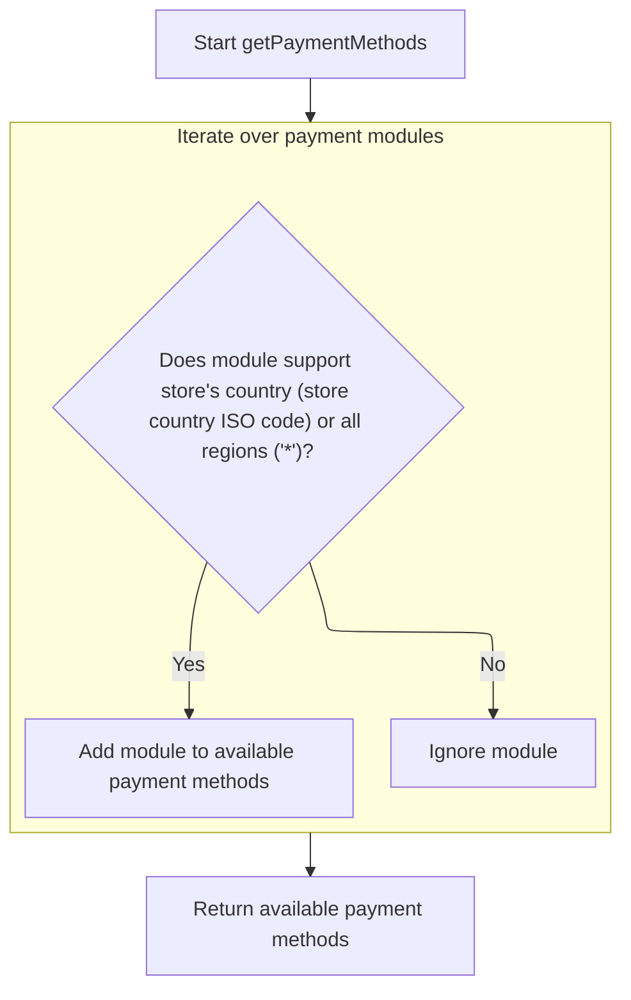

This document describes the flow of selecting payment methods available to a merchant store based on its geographic location. The flow receives the merchant store information as input and returns a list of payment methods filtered by the store's country or global availability.

# Selecting Payment Modules Based on Store Location

This section describes how the system selects payment modules based on the store's location by loading all payment modules with their region data and filtering them accordingly.

| Category       | Rule Name                        | Description                                                                                  |
| -------------- | -------------------------------- | -------------------------------------------------------------------------------------------- |
| Business logic | Location-based payment filtering | Only payment modules that support the store's geographic region are available for selection. |

<SwmSnippet path="/shopizer/sm-core/src/main/java/com/salesmanager/core/business/payments/service/PaymentServiceImpl.java" line="75">

---

We get all payment modules loaded with their region data so we can filter them by the store's location later.

```java
	public List<IntegrationModule> getPaymentMethods(MerchantStore store) throws ServiceException {
		
		List<IntegrationModule> modules =  moduleConfigurationService.getIntegrationModules(PAYMENT_MODULES);
```

---

</SwmSnippet>

## Loading and Preparing Integration Modules with Cache

```mermaid
%%{init: {"flowchart": {"defaultRenderer": "elk"}} }%%
flowchart TD
    node1["Start: Request integration modules for module"] --> node2{"Modules found in cache?"}
    click node1 openCode "shopizer/sm-core/src/main/java/com/salesmanager/core/business/system/service/ModuleConfigurationServiceImpl.java:50:51"
    node2 -->|"Yes"| node20["Return cached modules"]
    click node2 openCode "shopizer/sm-core/src/main/java/com/salesmanager/core/business/system/service/ModuleConfigurationServiceImpl.java:57:58"
    node2 -->|"No"| node4["Fetch modules from database"]
    click node4 openCode "shopizer/sm-core/src/main/java/com/salesmanager/core/business/system/service/ModuleConfigurationServiceImpl.java:59:60"
    node4 --> node5["For each module, parse and enrich"]
    click node5 openCode "shopizer/sm-core/src/main/java/com/salesmanager/core/business/system/service/ModuleConfigurationServiceImpl.java:61:126"

    subgraph loop1["For each integration module"]
        node5 --> node6{"Regions defined?"}
        click node6 openCode "shopizer/sm-core/src/main/java/com/salesmanager/core/business/system/service/ModuleConfigurationServiceImpl.java:63:65"
        node6 -->|"Yes"| node7["Parse regions JSON and convert to set"]
        click node7 openCode "shopizer/sm-core/src/main/java/com/salesmanager/core/business/system/service/ModuleConfigurationServiceImpl.java:65:70"
        node6 -->|"No"| node9
        node7 --> node9

        node9{"Config details defined?"}
        click node9 openCode "shopizer/sm-core/src/main/java/com/salesmanager/core/business/system/service/ModuleConfigurationServiceImpl.java:74:76"
        node9 -->|"Yes"| node10["Parse config details JSON and set map"]
        click node10 openCode "shopizer/sm-core/src/main/java/com/salesmanager/core/business/system/service/ModuleConfigurationServiceImpl.java:79:81"
        node9 -->|"No"| node12
        node10 --> node12

        node12{"Configuration defined?"}
        click node12 openCode "shopizer/sm-core/src/main/java/com/salesmanager/core/business/system/service/ModuleConfigurationServiceImpl.java:86:88"
        node12 -->|"Yes"| node13["Parse configuration JSON array"]
        click node13 openCode "shopizer/sm-core/src/main/java/com/salesmanager/core/business/system/service/ModuleConfigurationServiceImpl.java:91:118"
        node12 -->|"No"| node17

        subgraph loop2["For each configuration entry"]
            node13 --> node15["Create ModuleConfig object and set properties"]
            click node15 openCode "shopizer/sm-core/src/main/java/com/salesmanager/core/business/system/service/ModuleConfigurationServiceImpl.java:99:114"
            node15 --> node16["Add ModuleConfig to moduleConfigs map"]
            click node16 openCode "shopizer/sm-core/src/main/java/com/salesmanager/core/business/system/service/ModuleConfigurationServiceImpl.java:114:115"
            node16 --> node13
        end
        node13 --> node18["Set moduleConfigs on module"]
        click node18 openCode "shopizer/sm-core/src/main/java/com/salesmanager/core/business/system/service/ModuleConfigurationServiceImpl.java:120:121"
        node17 --> node18
        node18 --> node19["Next module"]
    end
    node19 --> node21["Put modules in cache"]
    click node19 openCode "shopizer/sm-core/src/main/java/com/salesmanager/core/business/system/service/ModuleConfigurationServiceImpl.java:126:127"
    node21 --> node20
    click node21 openCode "shopizer/sm-core/src/main/java/com/salesmanager/core/business/system/service/ModuleConfigurationServiceImpl.java:127:128"
    node20 --> node22["Return modules"]
    click node20 openCode "shopizer/sm-core/src/main/java/com/salesmanager/core/business/system/service/ModuleConfigurationServiceImpl.java:57:58"
    click node22 openCode "shopizer/sm-core/src/main/java/com/salesmanager/core/business/system/service/ModuleConfigurationServiceImpl.java:133:134"
classDef HeadingStyle fill:#777777,stroke:#333,stroke-width:2px;
```



This section handles loading integration modules by first attempting to retrieve them from cache, and if not found, fetching from the database, parsing JSON configuration data, enriching the modules, caching the result, and returning the prepared modules.

| Category       | Rule Name                     | Description                                                                                                                                                                 |
| -------------- | ----------------------------- | --------------------------------------------------------------------------------------------------------------------------------------------------------------------------- |
| Business logic | Cache first retrieval         | Integration modules must be retrieved from cache if available to optimize performance and reduce database load.                                                             |
| Business logic | Database fallback             | If integration modules are not found in cache, they must be fetched from the database to ensure the system has the latest module configurations.                            |
| Business logic | Region parsing                | If regions are defined for a module, the regions JSON must be parsed and converted into a set for filtering and usage in the system.                                        |
| Business logic | Config details parsing        | If configuration details are defined, the JSON string must be parsed into a map of key-value pairs for module configuration purposes.                                       |
| Business logic | Configuration entries parsing | If configuration entries are defined, each entry must be parsed from JSON into ModuleConfig objects with specific properties set, and stored in a map keyed by environment. |
| Business logic | Cache updated after fetch     | After fetching and preparing modules from the database, the fully parsed list must be cached for future requests to improve performance.                                    |

<SwmSnippet path="/shopizer/sm-core/src/main/java/com/salesmanager/core/business/system/service/ModuleConfigurationServiceImpl.java" line="50">

---

Here we try to get the modules from cache first. If they're not cached, we fetch them from the database. Then we parse JSON strings for regions, config details, and configurations into Java collections and objects. This prepares the modules for use later, like filtering by region. We cache the result for next time.

```java
	public List<IntegrationModule> getIntegrationModules(String module) {
		
		
		List<IntegrationModule> modules = null;
		try {
			
			//CacheUtils cacheUtils = CacheUtils.getInstance();
			modules = (List<IntegrationModule>) cache.getFromCache("INTEGRATION_M)" + module);
			if(modules==null) {
				modules = integrationModuleDao.getModulesConfiguration(module);
				//set json objects
				for(IntegrationModule mod : modules) {
					
					String regions = mod.getRegions();
					if(regions!=null) {
						Object objRegions=JSONValue.parse(regions); 
						JSONArray arrayRegions=(JSONArray)objRegions;
						Iterator i = arrayRegions.iterator();
						while(i.hasNext()) {
							mod.getRegionsSet().add((String)i.next());
						}
					}
					
					
					String details = mod.getConfigDetails();
					if(details!=null) {
						
						//Map objects = mapper.readValue(config, Map.class);

						Map<String,String> objDetails= (Map<String, String>) JSONValue.parse(details); 
						mod.setDetails(objDetails);

						
					}
					
					
					String configs = mod.getConfiguration();
					if(configs!=null) {
						
						//Map objects = mapper.readValue(config, Map.class);

						Object objConfigs=JSONValue.parse(configs); 
						JSONArray arrayConfigs=(JSONArray)objConfigs;
						
						Map<String,ModuleConfig> moduleConfigs = new HashMap<String,ModuleConfig>();
						
						Iterator i = arrayConfigs.iterator();
						while(i.hasNext()) {
							
							Map values = (Map)i.next();
							String env = (String)values.get("env");
		            		ModuleConfig config = new ModuleConfig();
		            		config.setScheme((String)values.get("scheme"));
		            		config.setHost((String)values.get("host"));
		            		config.setPort((String)values.get("port"));
		            		config.setUri((String)values.get("uri"));
		            		config.setEnv((String)values.get("env"));
		            		if((String)values.get("config1")!=null) {
		            			config.setConfig1((String)values.get("config1"));
		            		}
		            		if((String)values.get("config2")!=null) {
		            			config.setConfig1((String)values.get("config2"));
		            		}
		            		
		            		moduleConfigs.put(env, config);
		            		
		            		
							
						}
						
						mod.setModuleConfigs(moduleConfigs);
						

					}


				}
```

---

</SwmSnippet>

<SwmSnippet path="/shopizer/sm-core/src/main/java/com/salesmanager/core/business/system/service/ModuleConfigurationServiceImpl.java" line="127">

---

Finally we cache the fully parsed list of modules and return it. This means next time we get the modules ready to use without extra parsing or DB calls.

```java
				cache.putInCache(modules, "INTEGRATION_M)" + module);
			}

		} catch (Exception e) {
			LOGGER.error("getIntegrationModules()", e);
		}
		return modules;
		
		
	}
```

---

</SwmSnippet>

## Filtering Modules by Store Region and Wildcard Support



<SwmSnippet path="/shopizer/sm-core/src/main/java/com/salesmanager/core/business/payments/service/PaymentServiceImpl.java" line="78">

---

We get all payment modules loaded with their region data so we can filter them by the store's location later.

```java
		List<IntegrationModule> returnModules = new ArrayList<IntegrationModule>();
		
		for(IntegrationModule module : modules) {
			if(module.getRegionsSet().contains(store.getCountry().getIsoCode())
					|| module.getRegionsSet().contains("*")) {
				
				returnModules.add(module);
			}
		}
```

---

</SwmSnippet>

&nbsp;

*This is an auto-generated document by Swimm 🌊 and has not yet been verified by a human*

<SwmMeta version="3.0.0" repo-id="Z2l0aHViJTNBJTNBU2hvcGl6ZXIlM0ElM0F1bWFsaW5nYXN3YW1p" repo-name="Shopizer"><sup>Powered by [Swimm](https://app.swimm.io/)</sup></SwmMeta>
