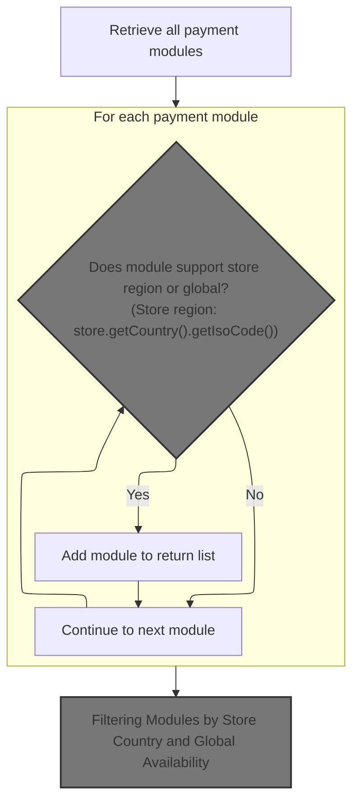
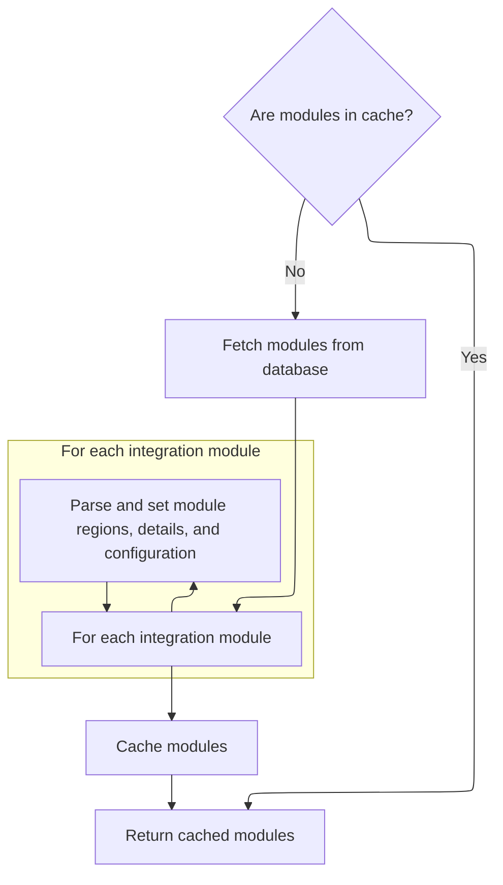
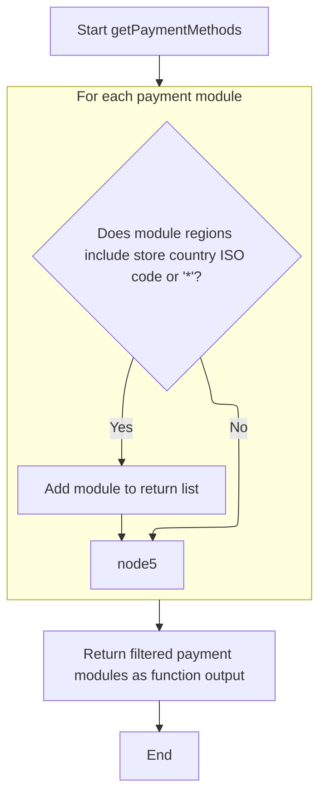

This document explains how payment methods are selected for a merchant store based on its location. It covers loading and caching payment module configurations and filtering them by regional support to provide a relevant list of payment options.

# Filtering Available Payment Modules by Store Region



This section describes the business logic for filtering available payment modules based on the store's region to ensure only relevant payment options are presented.

| Category       | Rule Name                      | Description                                                                                                                                             |
| -------------- | ------------------------------ | ------------------------------------------------------------------------------------------------------------------------------------------------------- |
| Business logic | Region-based payment filtering | Only payment modules that support the store's country region or are globally available should be included in the returned list of payment options.      |
| Business logic | Country ISO code usage         | The store's country region is identified using the store's country ISO code, which is used as the key for filtering payment modules.                    |
| Business logic | Exclude unsupported modules    | If a payment module does not support the store's country region or global availability, it must be excluded from the list of available payment methods. |

<SwmSnippet path="/shopizer/sm-core/src/main/java/com/salesmanager/core/business/payments/service/PaymentServiceImpl.java" line="75">

---

In `getPaymentMethods` we start by grabbing all payment modules from the moduleConfigurationService. We do this because we need the full list with region info to filter which modules apply to the store's country or globally. This sets us up to pick only relevant payment options.

```java
	public List<IntegrationModule> getPaymentMethods(MerchantStore store) throws ServiceException {
		
		List<IntegrationModule> modules =  moduleConfigurationService.getIntegrationModules(PAYMENT_MODULES);
```

---

</SwmSnippet>

## Loading and Parsing Payment Module Configurations with Caching



This section handles loading and parsing payment module configurations with caching to optimize performance and prepare modules for filtering.

| Category       | Rule Name                           | Description                                                                                                                           |
| -------------- | ----------------------------------- | ------------------------------------------------------------------------------------------------------------------------------------- |
| Business logic | Cache usage for modules             | If the requested payment modules are present in the cache, return them immediately without querying the database.                     |
| Business logic | Database fallback and parsing       | If the requested payment modules are not in the cache, fetch them from the database and parse their JSON fields into structured data. |
| Business logic | Region parsing                      | Parse the 'regions' JSON field into a set of region strings for each module to support region-based filtering.                        |
| Business logic | Configuration details parsing       | Parse the 'configDetails' JSON field into a map of key-value pairs to provide detailed configuration information for each module.     |
| Business logic | Environment-specific config parsing | Parse the 'configuration' JSON array into a map of environment-specific ModuleConfig objects for each module.                         |
| Business logic | Caching parsed modules              | Cache the fully parsed list of integration modules after loading from the database to optimize future access.                         |

<SwmSnippet path="/shopizer/sm-core/src/main/java/com/salesmanager/core/business/system/service/ModuleConfigurationServiceImpl.java" line="50">

---

In `getIntegrationModules` we first try to get the modules from cache using a fixed key. If cache misses, we load from the database. Then we parse JSON fields like 'regions' into sets and 'configuration' into maps to fully populate each module's data. This prepares the modules for filtering later.

```java
	public List<IntegrationModule> getIntegrationModules(String module) {
		
		
		List<IntegrationModule> modules = null;
		try {
			
			//CacheUtils cacheUtils = CacheUtils.getInstance();
			modules = (List<IntegrationModule>) cache.getFromCache("INTEGRATION_M)" + module);
			if(modules==null) {
				modules = integrationModuleDao.getModulesConfiguration(module);
				//set json objects
				for(IntegrationModule mod : modules) {
					
					String regions = mod.getRegions();
					if(regions!=null) {
						Object objRegions=JSONValue.parse(regions); 
						JSONArray arrayRegions=(JSONArray)objRegions;
						Iterator i = arrayRegions.iterator();
						while(i.hasNext()) {
							mod.getRegionsSet().add((String)i.next());
						}
					}
					
					
					String details = mod.getConfigDetails();
					if(details!=null) {
						
						//Map objects = mapper.readValue(config, Map.class);

						Map<String,String> objDetails= (Map<String, String>) JSONValue.parse(details); 
						mod.setDetails(objDetails);

						
					}
					
					
					String configs = mod.getConfiguration();
					if(configs!=null) {
						
						//Map objects = mapper.readValue(config, Map.class);

						Object objConfigs=JSONValue.parse(configs); 
						JSONArray arrayConfigs=(JSONArray)objConfigs;
						
						Map<String,ModuleConfig> moduleConfigs = new HashMap<String,ModuleConfig>();
						
						Iterator i = arrayConfigs.iterator();
						while(i.hasNext()) {
							
							Map values = (Map)i.next();
							String env = (String)values.get("env");
		            		ModuleConfig config = new ModuleConfig();
		            		config.setScheme((String)values.get("scheme"));
		            		config.setHost((String)values.get("host"));
		            		config.setPort((String)values.get("port"));
		            		config.setUri((String)values.get("uri"));
		            		config.setEnv((String)values.get("env"));
		            		if((String)values.get("config1")!=null) {
		            			config.setConfig1((String)values.get("config1"));
		            		}
		            		if((String)values.get("config2")!=null) {
		            			config.setConfig1((String)values.get("config2"));
		            		}
		            		
		            		moduleConfigs.put(env, config);
		            		
		            		
							
						}
						
						mod.setModuleConfigs(moduleConfigs);
						

					}


				}
```

---

</SwmSnippet>

<SwmSnippet path="/shopizer/sm-core/src/main/java/com/salesmanager/core/business/system/service/ModuleConfigurationServiceImpl.java" line="127">

---

After loading and parsing, we return the list of modules fully populated with region sets and config maps. We also cache this list so next calls are faster and don't hit the database or parsing again.

```java
				cache.putInCache(modules, "INTEGRATION_M)" + module);
			}

		} catch (Exception e) {
			LOGGER.error("getIntegrationModules()", e);
		}
		return modules;
		
		
	}
```

---

</SwmSnippet>

## Filtering Modules by Store Country and Global Availability



<SwmSnippet path="/shopizer/sm-core/src/main/java/com/salesmanager/core/business/payments/service/PaymentServiceImpl.java" line="78">

---

We pick modules available for the store's country or globally using '\*'.

```java
		List<IntegrationModule> returnModules = new ArrayList<IntegrationModule>();
		
		for(IntegrationModule module : modules) {
			if(module.getRegionsSet().contains(store.getCountry().getIsoCode())
					|| module.getRegionsSet().contains("*")) {
				
				returnModules.add(module);
			}
		}
```

---

</SwmSnippet>

&nbsp;

*This is an auto-generated document by Swimm 🌊 and has not yet been verified by a human*

<SwmMeta version="3.0.0" repo-id="Z2l0aHViJTNBJTNBU2hvcGl6ZXIlM0ElM0F1bWFsaW5nYXN3YW1p" repo-name="Shopizer"><sup>Powered by [Swimm](https://app.swimm.io/)</sup></SwmMeta>
