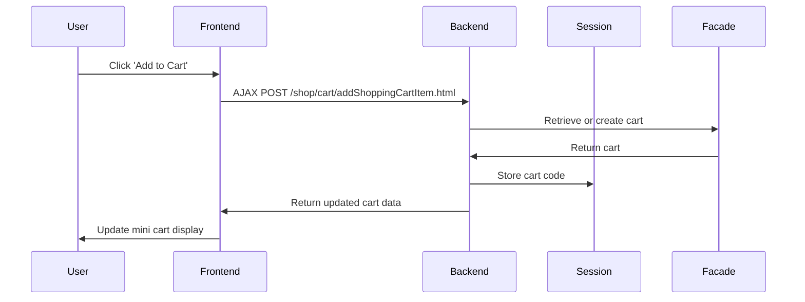

# Shopping Cart Overview

The shopping cart is a fundamental component in the Shopizer e-commerce platform that manages the collection of products a customer intends to purchase. It supports core functionalities such as adding items, viewing the cart contents, removing items, and calculating the total quantity and price of products.

# Mini Shopping Cart Interface

Shopizer provides a mini shopping cart accessible from the upper menu in the public shopping section. This interface offers users real-time interaction with their cart, allowing them to add products, view updated quantities and totals, and remove items without navigating away from the current page.

# Dynamic Add-to-Cart Functionality

The add-to-cart feature is implemented using JavaScript and AJAX, enabling asynchronous updates to the shopping cart. This design ensures a seamless user experience by updating the cart contents instantly without requiring a full page reload.

# Backend Cart Management

On the backend, the shopping cart data is managed through a facade layer that abstracts service operations such as retrieving, updating, and deleting the cart. When a cart is accessed, its unique identifier is stored in the user's session to maintain state across multiple requests, ensuring cart persistence during the user's visit.

# Shopping Cart API Endpoints

Shopizer exposes several RESTful endpoints to manage shopping cart operations. These endpoints facilitate adding, removing, updating, and retrieving cart items, supporting both synchronous and asynchronous interactions.

<SwmSnippet path="/shopizer/sm-shop/src/main/java/com/salesmanager/web/shop/controller/shoppingCart/ShoppingCartController.java" line="129">

---

The endpoint `/shop/cart/addShoppingCartItem.html` accepts POST requests containing shopping cart item data. It processes the addition of items to the cart and returns the updated cart information. This endpoint is designed for AJAX calls, enabling users to add products without page reloads.

```java
    @RequestMapping(value={"/addShoppingCartItem.html"}, method=RequestMethod.POST)
	public @ResponseBody
	ShoppingCartData addShoppingCartItem(@RequestBody final ShoppingCartItem item, final HttpServletRequest request, final HttpServletResponse response, final Locale locale) throws Exception {
```

---

</SwmSnippet>

<SwmSnippet path="/shopizer/sm-shop/src/main/java/com/salesmanager/web/shop/controller/shoppingCart/ShoppingCartController.java" line="228">

---

The GET endpoint `/shop/cart/shoppingCart.html` retrieves the current shopping cart for the user. It checks the session, cookies, or database to locate the cart and prepares the data for rendering in the user interface.

```java
    @RequestMapping( value = { "/shoppingCart.html" }, method = RequestMethod.GET )
    public String displayShoppingCart( final Model model, final HttpServletRequest request, final HttpServletResponse response, final Locale locale )
```

---

</SwmSnippet>

<SwmSnippet path="/shopizer/sm-shop/src/main/java/com/salesmanager/web/shop/controller/shoppingCart/ShoppingCartController.java" line="307">

---

The `/shop/cart/removeShoppingCartItem.html` endpoint supports both GET and POST methods to remove a specific item from the cart. It requires the line item ID as a parameter and updates the cart accordingly.

```java
	@RequestMapping(value={"/removeShoppingCartItem.html"},   method = { RequestMethod.GET, RequestMethod.POST })

	String removeShoppingCartItem(final Long lineItemId, final HttpServletRequest request, final HttpServletResponse response) throws Exception {
```

---

</SwmSnippet>

<SwmSnippet path="/shopizer/sm-shop/src/main/java/com/salesmanager/web/shop/controller/shoppingCart/ShoppingCartController.java" line="367">

---

To update the quantity of items in the cart, the POST endpoint `/shop/cart/updateShoppingCartItem.html` accepts an array of shopping cart items and returns the updated cart data after processing the changes.

```java
	@RequestMapping(value={"/updateShoppingCartItem.html"},  method = { RequestMethod.POST })
	public @ResponseBody String updateShoppingCartItem( @RequestBody final ShoppingCartItem[] shoppingCartItems, final HttpServletRequest request, final  HttpServletResponse response)  {
```

---

</SwmSnippet>

<SwmSnippet path="/shopizer/sm-shop/src/main/java/com/salesmanager/web/shop/controller/shoppingCart/MiniCartController.java" line="42">

---

The mini cart feature is supported by dedicated endpoints such as `/shop/cart/displayMiniCartByCode.html` and `/shop/cart/removeMiniShoppingCartItem.html`. These endpoints enable retrieving the mini cart by its unique code and removing items from it, respectively. They are optimized for AJAX usage to keep the mini cart display updated in real time without page reloads.

```java
	@RequestMapping(value={"/displayMiniCartByCode.html"},  method = { RequestMethod.GET, RequestMethod.POST })
	public @ResponseBody ShoppingCartData displayMiniCart(final String shoppingCartCode, HttpServletRequest request, Model model){
		
		try {
			MerchantStore merchantStore = (MerchantStore)request.getAttribute(Constants.MERCHANT_STORE);
		    Customer customer = getSessionAttribute(  Constants.CUSTOMER, request );
			ShoppingCartData cart =  shoppingCartFacade.getShoppingCartData(customer,merchantStore,shoppingCartCode);
			if(cart!=null) {
				request.getSession().setAttribute(Constants.SHOPPING_CART, cart.getCode());
			}
			if(cart==null) {
				request.getSession().removeAttribute(Constants.SHOPPING_CART);//make sure there is no cart here
			}
			return cart;
			
			
		} catch(Exception e) {
			LOG.error("Error while getting the shopping cart",e);
		}
		
		return null;

	}

	
	@RequestMapping(value={"/removeMiniShoppingCartItem.html"},   method = { RequestMethod.GET, RequestMethod.POST })
	public @ResponseBody ShoppingCartData removeShoppingCartItem(Long lineItemId, final String shoppingCartCode, HttpServletRequest request, Model model) throws Exception {
```

---

</SwmSnippet>

# Example Flow of Adding an Item to the Cart

When a user adds a product to the cart, the frontend JavaScript triggers an AJAX call to the add-to-cart endpoint. The backend facade retrieves the current cart or creates a new one if none exists, updates the cart with the new item, and saves the updated cart code in the user's session. This process ensures the cart remains persistent and synchronized with the user's actions.



&nbsp;

*This is an auto-generated document by Swimm 🌊 and has not yet been verified by a human*

<SwmMeta version="3.0.0" repo-id="Z2l0aHViJTNBJTNBU2hvcGl6ZXIlM0ElM0F1bWFsaW5nYXN3YW1p" repo-name="Shopizer"><sup>Powered by [Swimm](https://app.swimm.io/)</sup></SwmMeta>
