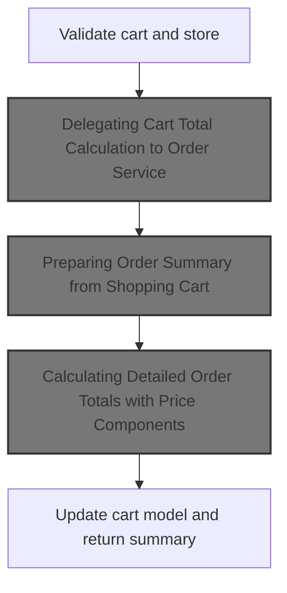
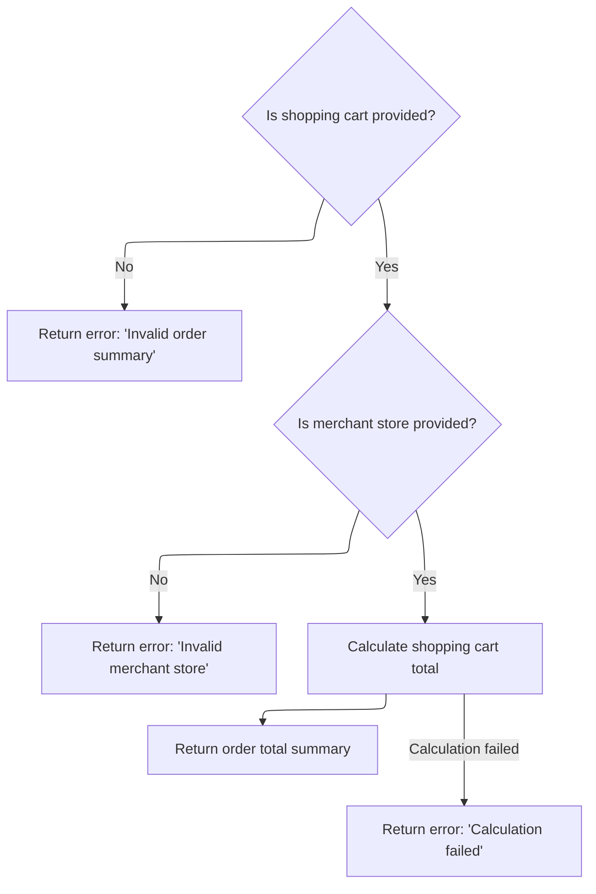

This document describes the process of calculating the total cost of a shopping cart. It receives the shopping cart and merchant store information as input and returns an order total summary with detailed pricing components. The calculation involves validating inputs, preparing an order summary from cart items, computing subtotals, shipping, handling fees, and taxes, and updating the cart with the results.

# Starting the Shopping Cart Total Calculation



This section handles the calculation of the shopping cart total by validating inputs and delegating the detailed total calculation to the order service.

| Category        | Rule Name              | Description                                                                                                                 |
| --------------- | ---------------------- | --------------------------------------------------------------------------------------------------------------------------- |
| Data validation | Cart Not Null          | The shopping cart must not be null before calculation.                                                                      |
| Data validation | Cart Has Line Items    | The shopping cart must contain line items before calculation.                                                               |
| Data validation | Valid Merchant Store   | The merchant store information must be provided and valid for the calculation.                                              |
| Business logic  | Accurate Order Summary | The output must be an OrderTotalSummary object that accurately reflects the detailed totals including all price components. |

<SwmSnippet path="/shopizer/sm-core/src/main/java/com/salesmanager/core/business/shoppingcart/service/ShoppingCartCalculationServiceImpl.java" line="95">

---

We validate inputs and then call orderService.calculateShoppingCartTotal to get the detailed totals, keeping responsibilities separated.

```java
    public OrderTotalSummary calculate( final ShoppingCart cartModel , final MerchantStore store, final Language language ) throws ServiceException
    {

        Validate.notNull(cartModel,"cart cannot be null");
        Validate.notNull(cartModel.getLineItems(),"Cart should have line items.");
        Validate.notNull(store,"MerchantStore cannot be null");
        OrderTotalSummary orderTotalSummary=orderService.calculateShoppingCartTotal( cartModel, store, language );
```

---

</SwmSnippet>

## Delegating Cart Total Calculation to Order Service



This section describes the delegation of shopping cart total calculation to the Order Service, including validation of inputs and error handling.

| Category        | Rule Name                    | Description                                                                                  |
| --------------- | ---------------------------- | -------------------------------------------------------------------------------------------- |
| Data validation | Shopping cart presence       | The shopping cart must be provided and cannot be null for the total calculation to proceed.  |
| Data validation | Merchant store presence      | The merchant store must be provided and cannot be null for the total calculation to proceed. |
| Business logic  | Total calculation delegation | The shopping cart total must be calculated using the order service's calculation method.     |

<SwmSnippet path="/shopizer/sm-core/src/main/java/com/salesmanager/core/business/order/service/OrderServiceImpl.java" line="423">

---

We delegate to caculateShoppingCart and handle exceptions uniformly.

```java
    public OrderTotalSummary calculateShoppingCartTotal(
                                                        final ShoppingCart shoppingCart, final MerchantStore store, final Language language)
                                                                        throws ServiceException {
        Validate.notNull(shoppingCart,"Order summary cannot be null");
        Validate.notNull(store,"MerchantStore cannot be null");

        try {
            return caculateShoppingCart(shoppingCart, null, store, language);
        } catch (Exception e) {
            LOGGER.error( "Error while calculating shopping cart total" +e );
            throw new ServiceException(e);
        }
    }
```

---

</SwmSnippet>

## Preparing Order Summary from Shopping Cart

This section prepares an OrderSummary from the ShoppingCart's line items to facilitate detailed order total calculations.

| Category       | Rule Name                  | Description                                                                                                                     |
| -------------- | -------------------------- | ------------------------------------------------------------------------------------------------------------------------------- |
| Business logic | Complete product inclusion | The OrderSummary must include all line items from the ShoppingCart to ensure accurate order total calculations.                 |
| Business logic | Format compatibility       | The OrderSummary must be prepared in a format compatible with the subsequent detailed order calculation process.                |
| Business logic | Context-aware calculation  | The calculation process must consider customer, store, and language context to apply relevant pricing, taxes, and localization. |

<SwmSnippet path="/shopizer/sm-core/src/main/java/com/salesmanager/core/business/order/service/OrderServiceImpl.java" line="363">

---

In caculateShoppingCart, we transform the shopping cart's line items into an OrderSummary object. This prepares the data in the format needed for caculateOrder, which does the detailed total calculations.

```java
    private OrderTotalSummary caculateShoppingCart( final ShoppingCart shoppingCart, final Customer customer, final MerchantStore store, final Language language) throws Exception {

        
    	
    	
    	
    	OrderSummary orderSummary = new OrderSummary();
    	
    	List<ShoppingCartItem> itemsSet = new ArrayList<ShoppingCartItem>(shoppingCart.getLineItems());
    	orderSummary.setProducts(itemsSet);
    	
    	
    	return this.caculateOrder(orderSummary, customer, store, language);

    }
```

---

</SwmSnippet>

## Calculating Detailed Order Totals with Price Components

```mermaid
%%{init: {"flowchart": {"defaultRenderer": "elk"}} }%%
flowchart TD
    node1["Start order calculation"] --> subgraph loop1["For each product in order"]
        node2["Calculate item subtotal and additional prices"]
        node2 --> node3["Add item subtotal to running subtotal"]
        node3 --> node2
    end
    subgraph afterLoop1
        node4["Set subtotal in summary and add to grand total"]
    end
    node3 --> node4
    node4 --> node5{"Is shipping free?"}
    node5 -->|"No"| node6["Add shipping cost to grand total"]
    node5 -->|"Yes"| node7["Add zero shipping cost"]
    node6 --> node8{"Are handling fees applicable?"}
    node7 --> node8
    node8 -->|"Yes"| node9["Add handling fees to grand total"]
    node8 -->|"No"| node10["Skip handling fees"]
    node9 --> node11["Calculate taxes"]
    node10 --> node11
    node11 --> subgraph loop2["For each tax item"]
        node12["Add tax to grand total"]
        node12 --> node11
    end
    subgraph afterLoop2
        node13["Set tax total in summary"]
        node14["Calculate and set grand total"]
        node15["Return order total summary"]
    end
    node11 --> node13
    node13 --> node14
    node14 --> node15

    click node1 openCode "shopizer/sm-core/src/main/java/com/salesmanager/core/business/order/service/OrderServiceImpl.java:166:168"
    click node2 openCode "shopizer/sm-core/src/main/java/com/salesmanager/core/business/order/service/OrderServiceImpl.java:184:188"
    click node3 openCode "shopizer/sm-core/src/main/java/com/salesmanager/core/business/order/service/OrderServiceImpl.java:188:188"
    click node4 openCode "shopizer/sm-core/src/main/java/com/salesmanager/core/business/order/service/OrderServiceImpl.java:228:229"
    click node5 openCode "shopizer/sm-core/src/main/java/com/salesmanager/core/business/order/service/OrderServiceImpl.java:260:266"
    click node6 openCode "shopizer/sm-core/src/main/java/com/salesmanager/core/business/order/service/OrderServiceImpl.java:261:262"
    click node7 openCode "shopizer/sm-core/src/main/java/com/salesmanager/core/business/order/service/OrderServiceImpl.java:264:265"
    click node8 openCode "shopizer/sm-core/src/main/java/com/salesmanager/core/business/order/service/OrderServiceImpl.java:269:283"
    click node9 openCode "shopizer/sm-core/src/main/java/com/salesmanager/core/business/order/service/OrderServiceImpl.java:271:281"
    click node10 openCode "shopizer/sm-core/src/main/java/com/salesmanager/core/business/order/service/OrderServiceImpl.java:283:284"
    click node11 openCode "shopizer/sm-core/src/main/java/com/salesmanager/core/business/order/service/OrderServiceImpl.java:287:309"
    click node12 openCode "shopizer/sm-core/src/main/java/com/salesmanager/core/business/order/service/OrderServiceImpl.java:303:303"
    click node13 openCode "shopizer/sm-core/src/main/java/com/salesmanager/core/business/order/service/OrderServiceImpl.java:310:312"
    click node14 openCode "shopizer/sm-core/src/main/java/com/salesmanager/core/business/order/service/OrderServiceImpl.java:315:323"
    click node15 openCode "shopizer/sm-core/src/main/java/com/salesmanager/core/business/order/service/OrderServiceImpl.java:326:327"
classDef HeadingStyle fill:#777777,stroke:#333,stroke-width:2px;
```

This section calculates detailed order totals by aggregating product subtotals, additional price components, shipping costs, handling fees, and taxes to produce a comprehensive order total summary.

| Category       | Rule Name                       | Description                                                                                                                                       |
| -------------- | ------------------------------- | ------------------------------------------------------------------------------------------------------------------------------------------------- |
| Business logic | Subtotal calculation            | Calculate the subtotal by summing the product of quantity and item price for each product in the order, including one-time additional prices.     |
| Business logic | Additional price components     | Include additional price components that are not default prices and add one-time price types to the subtotal while tracking others separately.    |
| Business logic | Shipping cost inclusion         | Add shipping cost to the grand total unless free shipping applies, in which case add zero shipping cost.                                          |
| Business logic | Handling fees application       | Add handling fees to the grand total only if handling fees are applicable and configured with a positive value.                                   |
| Business logic | Tax calculation and addition    | Calculate taxes for the order and add each tax item to the grand total and the order total summary.                                               |
| Business logic | Grand total computation         | Sum subtotal, shipping, handling fees, and taxes to compute the grand total for the order.                                                        |
| Business logic | Order total summary composition | Create and populate an OrderTotalSummary object with subtotal, tax total, grand total, and detailed order total entries for each price component. |

<SwmSnippet path="/shopizer/sm-core/src/main/java/com/salesmanager/core/business/order/service/OrderServiceImpl.java" line="166">

---

We calculate subtotal including one-time additional prices and track other price components separately.

```java
    private OrderTotalSummary caculateOrder(final OrderSummary summary, final Customer customer, final MerchantStore store, final Language language) throws Exception {

        OrderTotalSummary totalSummary = new OrderTotalSummary();
        List<OrderTotal> orderTotals = new ArrayList<OrderTotal>();
        Map<String,OrderTotal> otherPricesTotals = new HashMap<String,OrderTotal>();

        ShippingConfiguration shippingConfiguration = null;

        BigDecimal grandTotal = new BigDecimal(0);
        grandTotal.setScale(2, RoundingMode.HALF_UP);

        //price by item
        /**
         * qty * price
         * subtotal
         */
        BigDecimal subTotal = new BigDecimal(0);
        subTotal.setScale(2, RoundingMode.HALF_UP);
        for(ShoppingCartItem item : summary.getProducts()) {

            BigDecimal st = item.getItemPrice().multiply(new BigDecimal(item.getQuantity()));
            item.setSubTotal(st);
            subTotal = subTotal.add(st);
            //Other prices
            FinalPrice finalPrice = item.getFinalPrice();
            if(finalPrice!=null) {
                List<FinalPrice> otherPrices = finalPrice.getAdditionalPrices();
                if(otherPrices!=null) {
                    for(FinalPrice price : otherPrices) {
                        if(!price.isDefaultPrice()) {
                            OrderTotal itemSubTotal = otherPricesTotals.get(price.getProductPrice().getCode());

                            if(itemSubTotal==null) {
                                itemSubTotal = new OrderTotal();
                                itemSubTotal.setModule(Constants.OT_ITEM_PRICE_MODULE_CODE);
                                itemSubTotal.setText(Constants.OT_ITEM_PRICE_MODULE_CODE);
                                itemSubTotal.setTitle(Constants.OT_ITEM_PRICE_MODULE_CODE);
                                itemSubTotal.setOrderTotalCode(price.getProductPrice().getCode());
                                itemSubTotal.setOrderTotalType(OrderTotalType.PRODUCT);
                                itemSubTotal.setSortOrder(0);
                                otherPricesTotals.put(price.getProductPrice().getCode(), itemSubTotal);
                            }

                            BigDecimal orderTotalValue = itemSubTotal.getValue();
                            if(orderTotalValue==null) {
                                orderTotalValue = new BigDecimal(0);
                                orderTotalValue.setScale(2, RoundingMode.HALF_UP);
                            }

                            orderTotalValue = orderTotalValue.add(price.getFinalPrice());
                            itemSubTotal.setValue(orderTotalValue);
                            if(price.getProductPrice().getProductPriceType().name().equals(OrderValueType.ONE_TIME)) {
                                subTotal = subTotal.add(price.getFinalPrice());
                            }
                        }
                    }
                }
            }

        }
```

---

</SwmSnippet>

<SwmSnippet path="/shopizer/sm-core/src/main/java/com/salesmanager/core/business/order/service/OrderServiceImpl.java" line="228">

---

Continuing caculateOrder, we create OrderTotal entries for subtotal, shipping, and handling fees if applicable. We add shipping costs unless free shipping applies. Then we call taxService to get taxes, add each as an OrderTotal, and prepare to sum them into the grand total.

```java
        totalSummary.setSubTotal(subTotal);
        grandTotal=grandTotal.add(subTotal);

        OrderTotal orderTotalSubTotal = new OrderTotal();
        orderTotalSubTotal.setModule(Constants.OT_SUBTOTAL_MODULE_CODE);
        orderTotalSubTotal.setOrderTotalType(OrderTotalType.SUBTOTAL);
        orderTotalSubTotal.setOrderTotalCode("order.total.subtotal");
        orderTotalSubTotal.setTitle(Constants.OT_SUBTOTAL_MODULE_CODE);
        orderTotalSubTotal.setText("order.total.subtotal");
        orderTotalSubTotal.setSortOrder(5);
        orderTotalSubTotal.setValue(subTotal);

        //TODO autowire a list of post processing modules for price calculation - drools, custom modules
        //may affect the sub total

        orderTotals.add(orderTotalSubTotal);


        //shipping
        if(summary.getShippingSummary()!=null) {


	            OrderTotal shippingSubTotal = new OrderTotal();
	            shippingSubTotal.setModule(Constants.OT_SHIPPING_MODULE_CODE);
	            shippingSubTotal.setOrderTotalType(OrderTotalType.SHIPPING);
	            shippingSubTotal.setOrderTotalCode("order.total.shipping");
	            shippingSubTotal.setTitle(Constants.OT_SHIPPING_MODULE_CODE);
	            shippingSubTotal.setText("order.total.shipping");
	            shippingSubTotal.setSortOrder(10);
	
	            orderTotals.add(shippingSubTotal);

            if(!summary.getShippingSummary().isFreeShipping()) {
                shippingSubTotal.setValue(summary.getShippingSummary().getShipping());
                grandTotal=grandTotal.add(summary.getShippingSummary().getShipping());
            } else {
                shippingSubTotal.setValue(new BigDecimal(0));
                grandTotal=grandTotal.add(new BigDecimal(0));
            }

            //check handling fees
            shippingConfiguration = shippingService.getShippingConfiguration(store);
            if(summary.getShippingSummary().getHandling()!=null && summary.getShippingSummary().getHandling().doubleValue()>0) {
                if(shippingConfiguration.getHandlingFees()!=null && shippingConfiguration.getHandlingFees().doubleValue()>0) {
                    OrderTotal handlingubTotal = new OrderTotal();
                    handlingubTotal.setModule(Constants.OT_HANDLING_MODULE_CODE);
                    handlingubTotal.setOrderTotalType(OrderTotalType.HANDLING);
                    handlingubTotal.setOrderTotalCode("order.total.handling");
                    handlingubTotal.setTitle(Constants.OT_HANDLING_MODULE_CODE);
                    handlingubTotal.setText("order.total.handling");
                    handlingubTotal.setSortOrder(12);
                    handlingubTotal.setValue(summary.getShippingSummary().getHandling());
                    orderTotals.add(handlingubTotal);
                    grandTotal=grandTotal.add(summary.getShippingSummary().getHandling());
                }
            }
        }

        //tax
        List<TaxItem> taxes = taxService.calculateTax(summary, customer, store, language);
        if(taxes!=null && taxes.size()>0) {
        	BigDecimal totalTaxes = new BigDecimal(0);
        	totalTaxes.setScale(2, RoundingMode.HALF_UP);
            int taxCount = 20;
            for(TaxItem tax : taxes) {

                OrderTotal taxLine = new OrderTotal();
                taxLine.setModule(Constants.OT_TAX_MODULE_CODE);
                taxLine.setOrderTotalType(OrderTotalType.TAX);
                taxLine.setOrderTotalCode(tax.getLabel());
                taxLine.setSortOrder(taxCount);
                taxLine.setTitle(Constants.OT_TAX_MODULE_CODE);
                taxLine.setText(tax.getLabel());
                taxLine.setValue(tax.getItemPrice());

                totalTaxes = totalTaxes.add(tax.getItemPrice());
                orderTotals.add(taxLine);
                //grandTotal=grandTotal.add(tax.getItemPrice());

                taxCount ++;

            }
```

---

</SwmSnippet>

<SwmSnippet path="/shopizer/sm-core/src/main/java/com/salesmanager/core/business/order/service/OrderServiceImpl.java" line="310">

---

Finally in caculateOrder, we add the summed tax total to the grand total, create an OrderTotal for the grand total, add it to the list, and set all totals in the summary before returning it.

```java
            grandTotal = grandTotal.add(totalTaxes);
            totalSummary.setTaxTotal(totalTaxes);
        }

        // grand total
        OrderTotal orderTotal = new OrderTotal();
        orderTotal.setModule(Constants.OT_TOTAL_MODULE_CODE);
        orderTotal.setOrderTotalType(OrderTotalType.TOTAL);
        orderTotal.setOrderTotalCode("order.total.total");
        orderTotal.setTitle(Constants.OT_TOTAL_MODULE_CODE);
        orderTotal.setText("order.total.total");
        orderTotal.setSortOrder(300);
        orderTotal.setValue(grandTotal);
        orderTotals.add(orderTotal);

        totalSummary.setTotal(grandTotal);
        totalSummary.setTotals(orderTotals);
        return totalSummary;

    }
```

---

</SwmSnippet>

## Finalizing Cart Update After Total Calculation

<SwmSnippet path="/shopizer/sm-core/src/main/java/com/salesmanager/core/business/shoppingcart/service/ShoppingCartCalculationServiceImpl.java" line="102">

---

After getting the totals from orderService, we call updateCartModel to sync the cart with the new totals, then return the summary. This keeps the cart data consistent with the calculated prices.

```java
        updateCartModel(cartModel);
        return orderTotalSummary;


    }
```

---

</SwmSnippet>

&nbsp;

*This is an auto-generated document by Swimm 🌊 and has not yet been verified by a human*

<SwmMeta version="3.0.0" repo-id="Z2l0aHViJTNBJTNBU2hvcGl6ZXIlM0ElM0F1bWFsaW5nYXN3YW1p" repo-name="Shopizer"><sup>Powered by [Swimm](https://app.swimm.io/)</sup></SwmMeta>
