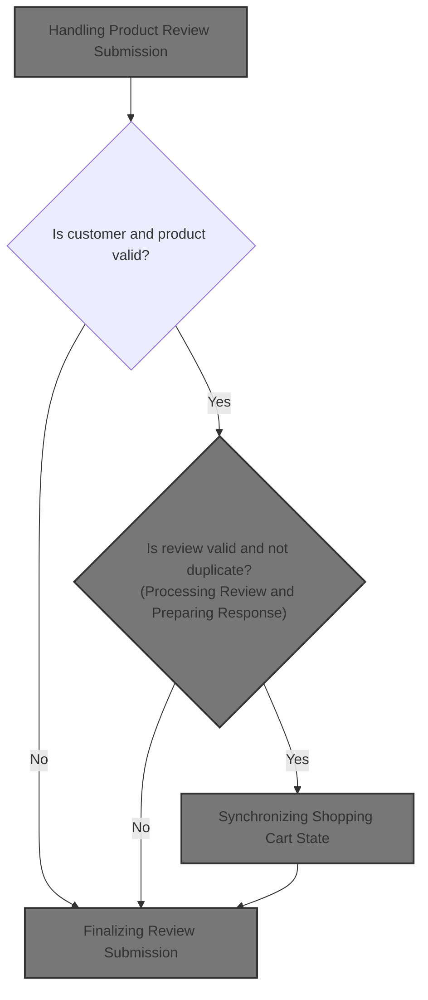
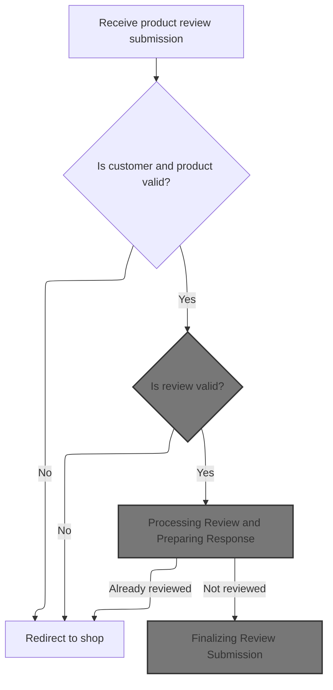
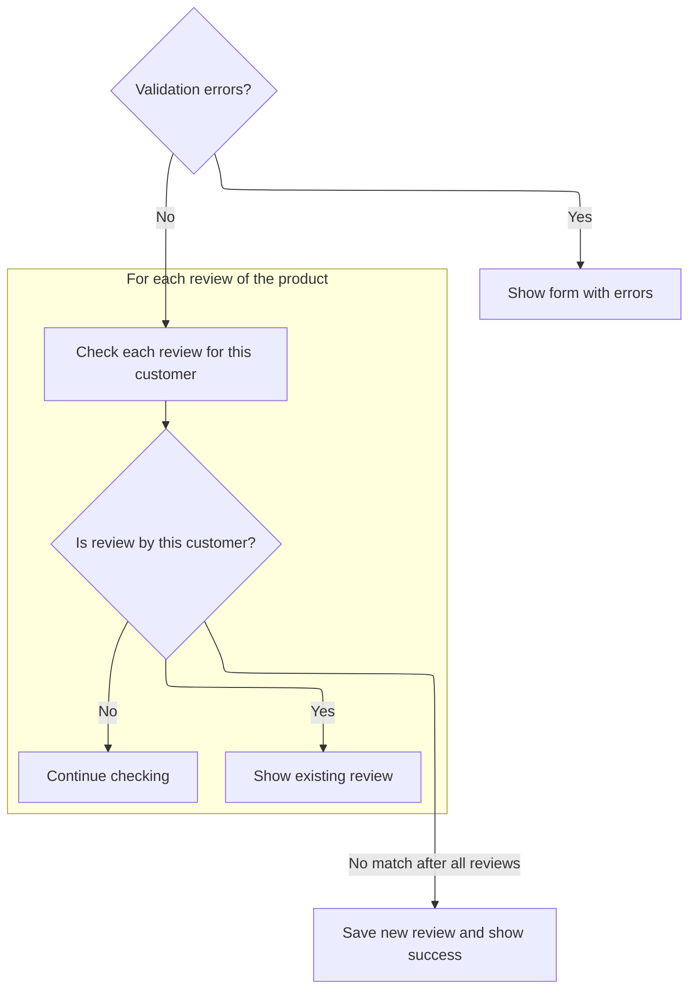

This document outlines how customers submit product reviews. The flow ensures only authenticated customers can review existing products, validates the review, prepares product data for display, checks for existing reviews, saves new reviews, and updates the shopping cart. This provides a seamless experience for capturing and displaying customer feedback.



# Handling Product Review Submission



This section governs the process of accepting, validating, and preparing a product review submission from a customer. It ensures only valid customers can submit reviews for existing products, and that the review contains the required information before proceeding.

| Category        | Rule Name                          | Description                                                                                                                                    |
| --------------- | ---------------------------------- | ---------------------------------------------------------------------------------------------------------------------------------------------- |
| Data validation | Authenticated Customer Requirement | A product review can only be submitted by a customer who is logged in and recognized by the system.                                            |
| Data validation | Valid Product Requirement          | A product review can only be submitted for a product that exists in the system.                                                                |
| Data validation | Review Description Mandatory       | A product review must include a non-empty description. If the description is missing or blank, the review is considered invalid.               |
| Business logic  | Prepare Product Data for Review    | When a valid review is submitted, the product data is prepared in a format suitable for display and further processing in the review workflow. |

<SwmSnippet path="/shopizer/sm-shop/src/main/java/com/salesmanager/web/shop/controller/customer/CustomerProductReviewController.java" line="142">

---

In <SwmToken path="shopizer/sm-shop/src/main/java/com/salesmanager/web/shop/controller/customer/CustomerProductReviewController.java" pos="142:5:5" line-data="	public String submitProductReview(@ModelAttribute(&quot;review&quot;) PersistableProductReview review, BindingResult bindingResult, Model model, HttpServletRequest request, HttpServletResponse response, Locale locale) throws Exception {">`submitProductReview`</SwmToken>, we start by validating the customer and product, and checking the review description. Then, we prepare a <SwmToken path="shopizer/sm-shop/src/main/java/com/salesmanager/web/shop/controller/customer/CustomerProductReviewController.java" pos="167:1:1" line-data="        ReadableProduct readableProduct = new ReadableProduct();">`ReadableProduct`</SwmToken> using <SwmToken path="shopizer/sm-shop/src/main/java/com/salesmanager/web/shop/controller/customer/CustomerProductReviewController.java" pos="168:1:1" line-data="        ReadableProductPopulator readableProductPopulator = new ReadableProductPopulator();">`ReadableProductPopulator`</SwmToken>, which converts the Product entity into a UI-friendly format. This sets up the product data needed for the next steps, including rendering the review form and handling review logic.

```java
	public String submitProductReview(@ModelAttribute("review") PersistableProductReview review, BindingResult bindingResult, Model model, HttpServletRequest request, HttpServletResponse response, Locale locale) throws Exception {
		

	    MerchantStore store = getSessionAttribute(Constants.MERCHANT_STORE, request);
	    Language language = getLanguage(request);
	    
        Customer customer =  customerFacade.getCustomerByUserName(request.getRemoteUser(), store);
        
        if(customer==null) {
        	return "redirect:" + Constants.SHOP_URI;
        }

	    
	    Product product = productService.getById(review.getProductId());
	    if(product==null) {
	    	return "redirect:" + Constants.SHOP_URI;
	    }
	    
	    if(StringUtils.isBlank(review.getDescription())) {
	    	FieldError error = new FieldError("description","description",messages.getMessage("NotEmpty.review.description", locale));
			bindingResult.addError(error);
	    }
	    

	    
        ReadableProduct readableProduct = new ReadableProduct();
        ReadableProductPopulator readableProductPopulator = new ReadableProductPopulator();
        readableProductPopulator.setPricingService(pricingService);
        readableProductPopulator.populate(product, readableProduct,  store, language);
```

---

</SwmSnippet>

## Populating Product Data for Display

```mermaid
%%{init: {"flowchart": {"defaultRenderer": "elk"}} }%%
flowchart TD
  node1["Start populating readable product"]
  click node1 openCode "shopizer/sm-shop/src/main/java/com/salesmanager/web/populator/catalog/ReadableProductPopulator.java:47:54"
  node1 --> node2["Set basic info: ID, availability, virtual, SKU"]
  click node2 openCode "shopizer/sm-shop/src/main/java/com/salesmanager/web/populator/catalog/ReadableProductPopulator.java:57:65"
  node2 --> node3{"Is rating and review info available?"}
  click node3 openCode "shopizer/sm-shop/src/main/java/com/salesmanager/web/populator/catalog/ReadableProductPopulator.java:59:67"
  node3 -->|"Yes"| node4["Set rating (rounded to 0.5) and review count"]
  click node4 openCode "shopizer/sm-shop/src/main/java/com/salesmanager/web/populator/catalog/ReadableProductPopulator.java:60:67"
  node3 -->|"No"| node5["Continue"]
  node4 --> node6{"Is description available?"}
  click node6 openCode "shopizer/sm-shop/src/main/java/com/salesmanager/web/populator/catalog/ReadableProductPopulator.java:68:81"
  node6 -->|"Yes"| node7["Set description, highlights, meta info"]
  click node7 openCode "shopizer/sm-shop/src/main/java/com/salesmanager/web/populator/catalog/ReadableProductPopulator.java:69:81"
  node6 -->|"No"| node8["Continue"]
  node7 --> node9{"Is manufacturer info available?"}
  click node9 openCode "shopizer/sm-shop/src/main/java/com/salesmanager/web/populator/catalog/ReadableProductPopulator.java:83:92"
  node9 -->|"Yes"| node10["Set manufacturer name and order"]
  click node10 openCode "shopizer/sm-shop/src/main/java/com/salesmanager/web/populator/catalog/ReadableProductPopulator.java:84:91"
  node9 -->|"No"| node11["Continue"]
  node10 --> node12{"Is main image available?"}
  click node12 openCode "shopizer/sm-shop/src/main/java/com/salesmanager/web/populator/catalog/ReadableProductPopulator.java:94:101"
  node12 -->|"Yes"| node13["Set main image"]
  click node13 openCode "shopizer/sm-shop/src/main/java/com/salesmanager/web/populator/catalog/ReadableProductPopulator.java:96:101"
  node12 -->|"No"| node14["Continue"]
  node13 --> node15{"Are additional images available?"}
  click node15 openCode "shopizer/sm-shop/src/main/java/com/salesmanager/web/populator/catalog/ReadableProductPopulator.java:104:117"
  node15 -->|"Yes"| loop2
  node15 -->|"No"| node16["Continue"]
  subgraph loop2["For each additional image"]
    loop2a["Create ReadableImage and add to image list"]
    click loop2a openCode "shopizer/sm-shop/src/main/java/com/salesmanager/web/populator/catalog/ReadableProductPopulator.java:107:114"
    loop2a --> loop2b["Set images on target"]
    click loop2b openCode "shopizer/sm-shop/src/main/java/com/salesmanager/web/populator/catalog/ReadableProductPopulator.java:115:116"
  end
  loop2 --> node16
  node16 --> node17["Calculate and set price"]
  click node17 openCode "shopizer/sm-shop/src/main/java/com/salesmanager/web/populator/catalog/ReadableProductPopulator.java:123:126"
  node17 --> node18{"Is product discounted?"}
  click node18 openCode "shopizer/sm-shop/src/main/java/com/salesmanager/web/populator/catalog/ReadableProductPopulator.java:128:131"
  node18 -->|"Yes"| node19["Set discounted flag and original price"]
  click node19 openCode "shopizer/sm-shop/src/main/java/com/salesmanager/web/populator/catalog/ReadableProductPopulator.java:129:131"
  node18 -->|"No"| node20["Continue"]
  node19 --> loop1
  node20 --> loop1
  subgraph loop1["For each product availability"]
    loop1a{"Is region ALL_REGIONS?"}
    click loop1a openCode "shopizer/sm-shop/src/main/java/com/salesmanager/web/populator/catalog/ReadableProductPopulator.java:135:139"
    loop1a -->|"Yes"| loop1b["Set quantity and order min/max"]
    click loop1b openCode "shopizer/sm-shop/src/main/java/com/salesmanager/web/populator/catalog/ReadableProductPopulator.java:136:138"
    loop1a -->|"No"| loop1c["Continue"]
  end
  loop1 --> node21["Done"]
  click node21 openCode "shopizer/sm-shop/src/main/java/com/salesmanager/web/populator/catalog/ReadableProductPopulator.java:145:148"
classDef HeadingStyle fill:#777777,stroke:#333,stroke-width:2px;

%% Swimm:
%% %%{init: {"flowchart": {"defaultRenderer": "elk"}} }%%
%% flowchart TD
%%   node1["Start populating readable product"]
%%   click node1 openCode "<SwmPath>[shopizer/…/catalog/ReadableProductPopulator.java](shopizer/sm-shop/src/main/java/com/salesmanager/web/populator/catalog/ReadableProductPopulator.java)</SwmPath>:47:54"
%%   node1 --> node2["Set basic info: ID, availability, virtual, SKU"]
%%   click node2 openCode "<SwmPath>[shopizer/…/catalog/ReadableProductPopulator.java](shopizer/sm-shop/src/main/java/com/salesmanager/web/populator/catalog/ReadableProductPopulator.java)</SwmPath>:57:65"
%%   node2 --> node3{"Is rating and review info available?"}
%%   click node3 openCode "<SwmPath>[shopizer/…/catalog/ReadableProductPopulator.java](shopizer/sm-shop/src/main/java/com/salesmanager/web/populator/catalog/ReadableProductPopulator.java)</SwmPath>:59:67"
%%   node3 -->|"Yes"| node4["Set rating (rounded to 0.5) and review count"]
%%   click node4 openCode "<SwmPath>[shopizer/…/catalog/ReadableProductPopulator.java](shopizer/sm-shop/src/main/java/com/salesmanager/web/populator/catalog/ReadableProductPopulator.java)</SwmPath>:60:67"
%%   node3 -->|"No"| node5["Continue"]
%%   node4 --> node6{"Is description available?"}
%%   click node6 openCode "<SwmPath>[shopizer/…/catalog/ReadableProductPopulator.java](shopizer/sm-shop/src/main/java/com/salesmanager/web/populator/catalog/ReadableProductPopulator.java)</SwmPath>:68:81"
%%   node6 -->|"Yes"| node7["Set description, highlights, meta info"]
%%   click node7 openCode "<SwmPath>[shopizer/…/catalog/ReadableProductPopulator.java](shopizer/sm-shop/src/main/java/com/salesmanager/web/populator/catalog/ReadableProductPopulator.java)</SwmPath>:69:81"
%%   node6 -->|"No"| node8["Continue"]
%%   node7 --> node9{"Is manufacturer info available?"}
%%   click node9 openCode "<SwmPath>[shopizer/…/catalog/ReadableProductPopulator.java](shopizer/sm-shop/src/main/java/com/salesmanager/web/populator/catalog/ReadableProductPopulator.java)</SwmPath>:83:92"
%%   node9 -->|"Yes"| node10["Set manufacturer name and order"]
%%   click node10 openCode "<SwmPath>[shopizer/…/catalog/ReadableProductPopulator.java](shopizer/sm-shop/src/main/java/com/salesmanager/web/populator/catalog/ReadableProductPopulator.java)</SwmPath>:84:91"
%%   node9 -->|"No"| node11["Continue"]
%%   node10 --> node12{"Is main image available?"}
%%   click node12 openCode "<SwmPath>[shopizer/…/catalog/ReadableProductPopulator.java](shopizer/sm-shop/src/main/java/com/salesmanager/web/populator/catalog/ReadableProductPopulator.java)</SwmPath>:94:101"
%%   node12 -->|"Yes"| node13["Set main image"]
%%   click node13 openCode "<SwmPath>[shopizer/…/catalog/ReadableProductPopulator.java](shopizer/sm-shop/src/main/java/com/salesmanager/web/populator/catalog/ReadableProductPopulator.java)</SwmPath>:96:101"
%%   node12 -->|"No"| node14["Continue"]
%%   node13 --> node15{"Are additional images available?"}
%%   click node15 openCode "<SwmPath>[shopizer/…/catalog/ReadableProductPopulator.java](shopizer/sm-shop/src/main/java/com/salesmanager/web/populator/catalog/ReadableProductPopulator.java)</SwmPath>:104:117"
%%   node15 -->|"Yes"| loop2
%%   node15 -->|"No"| node16["Continue"]
%%   subgraph loop2["For each additional image"]
%%     loop2a["Create <SwmToken path="shopizer/sm-shop/src/main/java/com/salesmanager/web/populator/catalog/ReadableProductPopulator.java" pos="96:1:1" line-data="				ReadableImage rimg = new ReadableImage();">`ReadableImage`</SwmToken> and add to image list"]
%%     click loop2a openCode "<SwmPath>[shopizer/…/catalog/ReadableProductPopulator.java](shopizer/sm-shop/src/main/java/com/salesmanager/web/populator/catalog/ReadableProductPopulator.java)</SwmPath>:107:114"
%%     loop2a --> loop2b["Set images on target"]
%%     click loop2b openCode "<SwmPath>[shopizer/…/catalog/ReadableProductPopulator.java](shopizer/sm-shop/src/main/java/com/salesmanager/web/populator/catalog/ReadableProductPopulator.java)</SwmPath>:115:116"
%%   end
%%   loop2 --> node16
%%   node16 --> node17["Calculate and set price"]
%%   click node17 openCode "<SwmPath>[shopizer/…/catalog/ReadableProductPopulator.java](shopizer/sm-shop/src/main/java/com/salesmanager/web/populator/catalog/ReadableProductPopulator.java)</SwmPath>:123:126"
%%   node17 --> node18{"Is product discounted?"}
%%   click node18 openCode "<SwmPath>[shopizer/…/catalog/ReadableProductPopulator.java](shopizer/sm-shop/src/main/java/com/salesmanager/web/populator/catalog/ReadableProductPopulator.java)</SwmPath>:128:131"
%%   node18 -->|"Yes"| node19["Set discounted flag and original price"]
%%   click node19 openCode "<SwmPath>[shopizer/…/catalog/ReadableProductPopulator.java](shopizer/sm-shop/src/main/java/com/salesmanager/web/populator/catalog/ReadableProductPopulator.java)</SwmPath>:129:131"
%%   node18 -->|"No"| node20["Continue"]
%%   node19 --> loop1
%%   node20 --> loop1
%%   subgraph loop1["For each product availability"]
%%     loop1a{"Is region <SwmToken path="shopizer/sm-shop/src/main/java/com/salesmanager/web/populator/catalog/ReadableProductPopulator.java" pos="135:13:13" line-data="				if(availability.getRegion().equals(Constants.ALL_REGIONS)) {//TODO REL 2.1 accept a region">`ALL_REGIONS`</SwmToken>?"}
%%     click loop1a openCode "<SwmPath>[shopizer/…/catalog/ReadableProductPopulator.java](shopizer/sm-shop/src/main/java/com/salesmanager/web/populator/catalog/ReadableProductPopulator.java)</SwmPath>:135:139"
%%     loop1a -->|"Yes"| loop1b["Set quantity and order min/max"]
%%     click loop1b openCode "<SwmPath>[shopizer/…/catalog/ReadableProductPopulator.java](shopizer/sm-shop/src/main/java/com/salesmanager/web/populator/catalog/ReadableProductPopulator.java)</SwmPath>:136:138"
%%     loop1a -->|"No"| loop1c["Continue"]
%%   end
%%   loop1 --> node21["Done"]
%%   click node21 openCode "<SwmPath>[shopizer/…/catalog/ReadableProductPopulator.java](shopizer/sm-shop/src/main/java/com/salesmanager/web/populator/catalog/ReadableProductPopulator.java)</SwmPath>:145:148"
%% classDef HeadingStyle fill:#777777,stroke:#333,stroke-width:2px;
```



This section is responsible for transforming a Product entity into a <SwmToken path="shopizer/sm-shop/src/main/java/com/salesmanager/web/shop/controller/customer/CustomerProductReviewController.java" pos="167:1:1" line-data="        ReadableProduct readableProduct = new ReadableProduct();">`ReadableProduct`</SwmToken>, ensuring all necessary product details are present and correctly formatted for display to end users. It ensures that the UI receives a complete and accurate representation of the product, including pricing, images, and availability.

| Category        | Rule Name                                    | Description                                                                                                                                                                                                                                                                                                                                                                                                         |
| --------------- | -------------------------------------------- | ------------------------------------------------------------------------------------------------------------------------------------------------------------------------------------------------------------------------------------------------------------------------------------------------------------------------------------------------------------------------------------------------------------------- |
| Data validation | Basic product info required                  | The product's unique identifier, availability status, and SKU must always be included in the display data.                                                                                                                                                                                                                                                                                                          |
| Data validation | Manufacturer info required if present        | If manufacturer information is available, the manufacturer's name and display order must be shown. Missing manufacturer descriptions will prevent product display.                                                                                                                                                                                                                                                  |
| Business logic  | Display product rating and reviews           | If product rating and review count are available, the rating must be rounded to the nearest 0.5 and both values must be displayed.                                                                                                                                                                                                                                                                                  |
| Business logic  | Product description and meta info            | If a product description is available, it must be displayed along with highlights and meta information. If meta title is missing, the product name must be used as the title.                                                                                                                                                                                                                                       |
| Business logic  | Product images display                       | If a main product image is available, it must be displayed. All additional images must also be included in the product's image gallery.                                                                                                                                                                                                                                                                             |
| Business logic  | Display pricing and discounts                | The product's final price must always be displayed. If the product is discounted, both the discounted price and the original price must be shown, and a discounted flag must be set.                                                                                                                                                                                                                                |
| Business logic  | Display product availability for all regions | For each product availability, if the region is <SwmToken path="shopizer/sm-shop/src/main/java/com/salesmanager/web/populator/catalog/ReadableProductPopulator.java" pos="135:13:13" line-data="				if(availability.getRegion().equals(Constants.ALL_REGIONS)) {//TODO REL 2.1 accept a region">`ALL_REGIONS`</SwmToken>, the product's quantity, minimum order quantity, and maximum order quantity must be displayed. |

<SwmSnippet path="/shopizer/sm-shop/src/main/java/com/salesmanager/web/populator/catalog/ReadableProductPopulator.java" line="47">

---

In <SwmToken path="shopizer/sm-shop/src/main/java/com/salesmanager/web/populator/catalog/ReadableProductPopulator.java" pos="47:5:5" line-data="	public ReadableProduct populate(Product source,">`populate`</SwmToken>, we copy product fields into <SwmToken path="shopizer/sm-shop/src/main/java/com/salesmanager/web/populator/catalog/ReadableProductPopulator.java" pos="47:3:3" line-data="	public ReadableProduct populate(Product source,">`ReadableProduct`</SwmToken>, including description, rating, and manufacturer info. The manufacturer description is fetched without checking for emptiness, so missing data here will break the flow. This sets up all the product details needed for UI rendering.

```java
	public ReadableProduct populate(Product source,
			ReadableProduct target, MerchantStore store, Language language)
			throws ConversionException {
		Validate.notNull(pricingService, "Requires to set PricingService");
		
		try {
			

			ProductDescription description = source.getProductDescription();
	
			target.setId(source.getId());
			target.setAvailable(source.isAvailable());
			if(source.getProductReviewAvg()!=null) {
				double avg = source.getProductReviewAvg().doubleValue();
				double rating = Math.round(avg * 2) / 2.0f;
				target.setRating(rating);
			}
			target.setProductVirtual(source.getProductVirtual());
			if(source.getProductReviewCount()!=null) {
				target.setRatingCount(source.getProductReviewCount().intValue());
			}
			if(description!=null) {
				com.salesmanager.web.entity.catalog.product.ProductDescription tragetDescription = new com.salesmanager.web.entity.catalog.product.ProductDescription();
				tragetDescription.setFriendlyUrl(description.getSeUrl());
				tragetDescription.setName(description.getName());
				if(!StringUtils.isBlank(description.getMetatagTitle())) {
					tragetDescription.setTitle(description.getMetatagTitle());
				} else {
					tragetDescription.setTitle(description.getName());
				}
				tragetDescription.setMetaDescription(description.getMetatagDescription());
				tragetDescription.setDescription(description.getDescription());
				tragetDescription.setHighlights(description.getProductHighlight());
				target.setDescription(tragetDescription);
			}
			
			if(source.getManufacturer()!=null) {
				ManufacturerDescription manufacturer = source.getManufacturer().getDescriptions().iterator().next(); 
				ReadableManufacturer manufacturerEntity = new ReadableManufacturer();
				com.salesmanager.web.entity.catalog.manufacturer.ManufacturerDescription d = new com.salesmanager.web.entity.catalog.manufacturer.ManufacturerDescription(); 
				d.setName(manufacturer.getName());
				manufacturerEntity.setDescription(d);
				manufacturerEntity.setId(manufacturer.getId());
				manufacturerEntity.setOrder(source.getManufacturer().getOrder());
				target.setManufacturer(manufacturerEntity);
			}
			
			ProductImage image = source.getProductImage();
			if(image!=null) {
				ReadableImage rimg = new ReadableImage();
				rimg.setImageName(image.getProductImage());
				String imagePath = ImageFilePathUtils.buildProductImageFilePath(store, source.getSku(), image.getProductImage());
				rimg.setImageUrl(imagePath);
				rimg.setId(image.getId());
				target.setImage(rimg);
				
				//other images
				Set<ProductImage> images = source.getImages();
				if(images!=null && images.size()>0) {
					List<ReadableImage> imageList = new ArrayList<ReadableImage>();
					for(ProductImage img : images) {
						ReadableImage prdImage = new ReadableImage();
						prdImage.setImageName(img.getProductImage());
						String imgPath = ImageFilePathUtils.buildProductImageFilePath(store, source.getSku(), img.getProductImage());
						prdImage.setImageUrl(imgPath);
						prdImage.setId(img.getId());
						imageList.add(prdImage);
					}
```

---

</SwmSnippet>

<SwmSnippet path="/shopizer/sm-shop/src/main/java/com/salesmanager/web/populator/catalog/ReadableProductPopulator.java" line="115">

---

Here we add images, prices, and quantities to <SwmToken path="shopizer/sm-shop/src/main/java/com/salesmanager/web/shop/controller/customer/CustomerProductReviewController.java" pos="167:1:1" line-data="        ReadableProduct readableProduct = new ReadableProduct();">`ReadableProduct`</SwmToken>, assuming availabilities are present. This finalizes the product data for display and ordering.

```java
					target
					.setImages(imageList);
				}
			}
	
			target.setSku(source.getSku());
			//target.setLanguage(language.getCode());
	
			FinalPrice price = pricingService.calculateProductPrice(source);

			target.setFinalPrice(pricingService.getDisplayAmount(price.getFinalPrice(), store));
			target.setPrice(price.getFinalPrice());
	
			if(price.isDiscounted()) {
				target.setDiscounted(true);
				target.setOriginalPrice(pricingService.getDisplayAmount(price.getOriginalPrice(), store));
			}
			
			//availability
			for(ProductAvailability availability : source.getAvailabilities()) {
				if(availability.getRegion().equals(Constants.ALL_REGIONS)) {//TODO REL 2.1 accept a region
					target.setQuantity(availability.getProductQuantity());
					target.setQuantityOrderMaximum(availability.getProductQuantityOrderMax());
					target.setQuantityOrderMinimum(availability.getProductQuantityOrderMin());
				}
			}
```

---

</SwmSnippet>

<SwmSnippet path="/shopizer/sm-shop/src/main/java/com/salesmanager/web/populator/catalog/ReadableProductPopulator.java" line="145">

---

Finally, we return the populated <SwmToken path="shopizer/sm-shop/src/main/java/com/salesmanager/web/shop/controller/customer/CustomerProductReviewController.java" pos="167:1:1" line-data="        ReadableProduct readableProduct = new ReadableProduct();">`ReadableProduct`</SwmToken>, or throw a <SwmToken path="shopizer/sm-shop/src/main/java/com/salesmanager/web/populator/catalog/ReadableProductPopulator.java" pos="146:5:5" line-data="			throw new ConversionException(e);">`ConversionException`</SwmToken> if anything fails. This hands off the display-ready product to the controller.

```java
		} catch (Exception e) {
			throw new ConversionException(e);
		}
	}
```

---

</SwmSnippet>

## Processing Review and Preparing Response



<SwmSnippet path="/shopizer/sm-shop/src/main/java/com/salesmanager/web/shop/controller/customer/CustomerProductReviewController.java" line="171">

---

Back in `CustomerProductReviewController.submitProductReview`, we use the populated <SwmToken path="shopizer/sm-shop/src/main/java/com/salesmanager/web/shop/controller/customer/CustomerProductReviewController.java" pos="167:1:1" line-data="        ReadableProduct readableProduct = new ReadableProduct();">`ReadableProduct`</SwmToken> for the model, check for validation errors, and see if the customer already reviewed the product. If so, we show their review using <SwmToken path="shopizer/sm-shop/src/main/java/com/salesmanager/web/shop/controller/customer/CustomerProductReviewController.java" pos="190:1:1" line-data="				ReadableProductReviewPopulator reviewPopulator = new ReadableProductReviewPopulator();">`ReadableProductReviewPopulator`</SwmToken> and return early.

```java
        model.addAttribute("product", readableProduct);
	    

		/** template **/
		StringBuilder template = new StringBuilder().append(ControllerConstants.Tiles.Customer.review).append(".").append(store.getStoreTemplate());

        if ( bindingResult.hasErrors() )
        {

            return template.toString();

        }
		
        
        //check if customer has already evaluated the product
	    List<ProductReview> reviews = productReviewService.getByProduct(product);
	    
	    for(ProductReview r : reviews) {
	    	if(r.getCustomer().getId().longValue()==customer.getId().longValue()) {
				ReadableProductReviewPopulator reviewPopulator = new ReadableProductReviewPopulator();
				ReadableProductReview rev = new ReadableProductReview();
				reviewPopulator.populate(r, rev, store, language);
	    		
	    		model.addAttribute("customerReview", rev);
	    		return template.toString();
	    	}
	    }
```

---

</SwmSnippet>

<SwmSnippet path="/shopizer/sm-shop/src/main/java/com/salesmanager/web/shop/controller/customer/CustomerProductReviewController.java" line="200">

---

Here we handle creating and saving the new <SwmToken path="shopizer/sm-shop/src/main/java/com/salesmanager/web/shop/controller/customer/CustomerProductReviewController.java" pos="208:1:1" line-data="	    ProductReview productReview = populator.populate(review, store, language);">`ProductReview`</SwmToken>, update the model with review info, and prepare to call <SwmToken path="shopizer/sm-shop/src/main/java/com/salesmanager/web/populator/shoppingCart/ShoppingCartModelPopulator.java" pos="37:4:4" line-data="public class ShoppingCartModelPopulator">`ShoppingCartModelPopulator`</SwmToken> to sync the cart with any changes from the review process.

```java
	    PersistableProductReviewPopulator populator = new PersistableProductReviewPopulator();
	    populator.setCustomerService(customerService);
	    populator.setLanguageService(languageService);
	    populator.setProductService(productService);
	    
	    review.setDate(DateUtil.formatDate(new Date()));
	    review.setCustomerId(customer.getId());
	    
	    ProductReview productReview = populator.populate(review, store, language);
	    productReviewService.create(productReview);
        
        model.addAttribute("review", review);
        model.addAttribute("success", "success");
        
		ReadableProductReviewPopulator reviewPopulator = new ReadableProductReviewPopulator();
		ReadableProductReview rev = new ReadableProductReview();
		reviewPopulator.populate(productReview, rev, store, language);
		
```

---

</SwmSnippet>

## Synchronizing Shopping Cart State

```mermaid
%%{init: {"flowchart": {"defaultRenderer": "elk"}} }%%
flowchart TD
    node1["Start cart population"] --> node2{"Is cart id > 0 and code present?"}
    click node1 openCode "shopizer/sm-shop/src/main/java/com/salesmanager/web/populator/shoppingCart/ShoppingCartModelPopulator.java:85:86"
    node2 -->|"Yes"| node3["Fetch cart from system"]
    click node2 openCode "shopizer/sm-shop/src/main/java/com/salesmanager/web/populator/shoppingCart/ShoppingCartModelPopulator.java:91:94"
    node2 -->|"No"| node4["Create new cart in system"]
    click node4 openCode "shopizer/sm-shop/src/main/java/com/salesmanager/web/populator/shoppingCart/ShoppingCartModelPopulator.java:107:113"
    node3 --> node5["Associate cart with customer"]
    click node3 openCode "shopizer/sm-shop/src/main/java/com/salesmanager/web/populator/shoppingCart/ShoppingCartModelPopulator.java:98:101"
    node4 --> node5
    node5 --> node6["Process cart items"]
    click node5 openCode "shopizer/sm-shop/src/main/java/com/salesmanager/web/populator/shoppingCart/ShoppingCartModelPopulator.java:116:117"
    subgraph loop1["For each item in shopping cart"]
        node6 --> node7{"Does item exist in cart model?"}
        click node7 openCode "shopizer/sm-shop/src/main/java/com/salesmanager/web/populator/shoppingCart/ShoppingCartModelPopulator.java:128:130"
        node7 -->|"Yes"| node8["Update item quantity"]
        click node8 openCode "shopizer/sm-shop/src/main/java/com/salesmanager/web/populator/shoppingCart/ShoppingCartModelPopulator.java:132:132"
        node8 --> node9{"Does item have attributes?"}
        click node9 openCode "shopizer/sm-shop/src/main/java/com/salesmanager/web/populator/shoppingCart/ShoppingCartModelPopulator.java:139:140"
        node9 -->|"Yes"| node10["Update item attributes"]
        click node10 openCode "shopizer/sm-shop/src/main/java/com/salesmanager/web/populator/shoppingCart/ShoppingCartModelPopulator.java:141:152"
        node9 -->|"No"| node11["Remove all item attributes"]
        click node11 openCode "shopizer/sm-shop/src/main/java/com/salesmanager/web/populator/shoppingCart/ShoppingCartModelPopulator.java:156:157"
        node10 --> node12["Include item in cart"]
        node11 --> node12
        node7 -->|"No"| node13["Create new cart item"]
        click node13 openCode "shopizer/sm-shop/src/main/java/com/salesmanager/web/populator/shoppingCart/ShoppingCartModelPopulator.java:164:165"
        node13 --> node14["Add new item to cart"]
        click node14 openCode "shopizer/sm-shop/src/main/java/com/salesmanager/web/populator/shoppingCart/ShoppingCartModelPopulator.java:173:174"
        node14 --> node12
        node12 --> node15["Update cart in system"]
        click node15 openCode "shopizer/sm-shop/src/main/java/com/salesmanager/web/populator/shoppingCart/ShoppingCartModelPopulator.java:174:174"
    end
    node15 --> node16["Return updated cart model"]
    click node16 openCode "shopizer/sm-shop/src/main/java/com/salesmanager/web/populator/shoppingCart/ShoppingCartModelPopulator.java:187:188"
classDef HeadingStyle fill:#777777,stroke:#333,stroke-width:2px;

%% Swimm:
%% %%{init: {"flowchart": {"defaultRenderer": "elk"}} }%%
%% flowchart TD
%%     node1["Start cart population"] --> node2{"Is cart id > 0 and code present?"}
%%     click node1 openCode "<SwmPath>[shopizer/…/shoppingCart/ShoppingCartModelPopulator.java](shopizer/sm-shop/src/main/java/com/salesmanager/web/populator/shoppingCart/ShoppingCartModelPopulator.java)</SwmPath>:85:86"
%%     node2 -->|"Yes"| node3["Fetch cart from system"]
%%     click node2 openCode "<SwmPath>[shopizer/…/shoppingCart/ShoppingCartModelPopulator.java](shopizer/sm-shop/src/main/java/com/salesmanager/web/populator/shoppingCart/ShoppingCartModelPopulator.java)</SwmPath>:91:94"
%%     node2 -->|"No"| node4["Create new cart in system"]
%%     click node4 openCode "<SwmPath>[shopizer/…/shoppingCart/ShoppingCartModelPopulator.java](shopizer/sm-shop/src/main/java/com/salesmanager/web/populator/shoppingCart/ShoppingCartModelPopulator.java)</SwmPath>:107:113"
%%     node3 --> node5["Associate cart with customer"]
%%     click node3 openCode "<SwmPath>[shopizer/…/shoppingCart/ShoppingCartModelPopulator.java](shopizer/sm-shop/src/main/java/com/salesmanager/web/populator/shoppingCart/ShoppingCartModelPopulator.java)</SwmPath>:98:101"
%%     node4 --> node5
%%     node5 --> node6["Process cart items"]
%%     click node5 openCode "<SwmPath>[shopizer/…/shoppingCart/ShoppingCartModelPopulator.java](shopizer/sm-shop/src/main/java/com/salesmanager/web/populator/shoppingCart/ShoppingCartModelPopulator.java)</SwmPath>:116:117"
%%     subgraph loop1["For each item in shopping cart"]
%%         node6 --> node7{"Does item exist in cart model?"}
%%         click node7 openCode "<SwmPath>[shopizer/…/shoppingCart/ShoppingCartModelPopulator.java](shopizer/sm-shop/src/main/java/com/salesmanager/web/populator/shoppingCart/ShoppingCartModelPopulator.java)</SwmPath>:128:130"
%%         node7 -->|"Yes"| node8["Update item quantity"]
%%         click node8 openCode "<SwmPath>[shopizer/…/shoppingCart/ShoppingCartModelPopulator.java](shopizer/sm-shop/src/main/java/com/salesmanager/web/populator/shoppingCart/ShoppingCartModelPopulator.java)</SwmPath>:132:132"
%%         node8 --> node9{"Does item have attributes?"}
%%         click node9 openCode "<SwmPath>[shopizer/…/shoppingCart/ShoppingCartModelPopulator.java](shopizer/sm-shop/src/main/java/com/salesmanager/web/populator/shoppingCart/ShoppingCartModelPopulator.java)</SwmPath>:139:140"
%%         node9 -->|"Yes"| node10["Update item attributes"]
%%         click node10 openCode "<SwmPath>[shopizer/…/shoppingCart/ShoppingCartModelPopulator.java](shopizer/sm-shop/src/main/java/com/salesmanager/web/populator/shoppingCart/ShoppingCartModelPopulator.java)</SwmPath>:141:152"
%%         node9 -->|"No"| node11["Remove all item attributes"]
%%         click node11 openCode "<SwmPath>[shopizer/…/shoppingCart/ShoppingCartModelPopulator.java](shopizer/sm-shop/src/main/java/com/salesmanager/web/populator/shoppingCart/ShoppingCartModelPopulator.java)</SwmPath>:156:157"
%%         node10 --> node12["Include item in cart"]
%%         node11 --> node12
%%         node7 -->|"No"| node13["Create new cart item"]
%%         click node13 openCode "<SwmPath>[shopizer/…/shoppingCart/ShoppingCartModelPopulator.java](shopizer/sm-shop/src/main/java/com/salesmanager/web/populator/shoppingCart/ShoppingCartModelPopulator.java)</SwmPath>:164:165"
%%         node13 --> node14["Add new item to cart"]
%%         click node14 openCode "<SwmPath>[shopizer/…/shoppingCart/ShoppingCartModelPopulator.java](shopizer/sm-shop/src/main/java/com/salesmanager/web/populator/shoppingCart/ShoppingCartModelPopulator.java)</SwmPath>:173:174"
%%         node14 --> node12
%%         node12 --> node15["Update cart in system"]
%%         click node15 openCode "<SwmPath>[shopizer/…/shoppingCart/ShoppingCartModelPopulator.java](shopizer/sm-shop/src/main/java/com/salesmanager/web/populator/shoppingCart/ShoppingCartModelPopulator.java)</SwmPath>:174:174"
%%     end
%%     node15 --> node16["Return updated cart model"]
%%     click node16 openCode "<SwmPath>[shopizer/…/shoppingCart/ShoppingCartModelPopulator.java](shopizer/sm-shop/src/main/java/com/salesmanager/web/populator/shoppingCart/ShoppingCartModelPopulator.java)</SwmPath>:187:188"
%% classDef HeadingStyle fill:#777777,stroke:#333,stroke-width:2px;
```



This section governs the synchronization of the user's shopping cart state with the system's database. It ensures that the cart model accurately reflects the user's selections, including item quantities and attributes, and handles both existing and new carts and items.

| Category        | Rule Name                                  | Description                                                                                                                                                                                                                                                                         |
| --------------- | ------------------------------------------ | ----------------------------------------------------------------------------------------------------------------------------------------------------------------------------------------------------------------------------------------------------------------------------------- |
| Data validation | Valid Attribute Enforcement                | When creating a new cart item, only attributes that are linked to the product and valid for the merchant store must be added to the cart item.                                                                                                                                      |
| Data validation | Product Existence and Ownership Validation | If a product referenced in the incoming cart data does not exist or does not belong to the merchant store, the system must not add the item to the cart and must report an error.                                                                                                   |
| Business logic  | Cart Retrieval or Creation                 | If the incoming cart id is greater than 0 and a cart code is present, the system must attempt to fetch the cart from the database using the provided code. If no cart is found, a new cart must be created with the given code and associated with the merchant store and customer. |
| Business logic  | Cart Association                           | Each cart must be associated with the correct merchant store and, if available, the customer identified in the context.                                                                                                                                                             |
| Business logic  | Item Quantity Synchronization              | For each item in the incoming cart data, if the item exists in the cart model, its quantity must be updated to match the incoming value.                                                                                                                                            |
| Business logic  | Item Attribute Synchronization             | If an item in the cart has attributes, only those attributes that are present and valid in the incoming data must be retained and updated in the cart model. If no attributes are present, all attributes must be removed from the item.                                            |
| Business logic  | New Item Addition                          | If an item in the incoming cart data does not exist in the cart model, a new cart item must be created and added to the cart, provided the product exists and belongs to the merchant store.                                                                                        |

<SwmSnippet path="/shopizer/sm-shop/src/main/java/com/salesmanager/web/populator/shoppingCart/ShoppingCartModelPopulator.java" line="85">

---

In <SwmToken path="shopizer/sm-shop/src/main/java/com/salesmanager/web/populator/shoppingCart/ShoppingCartModelPopulator.java" pos="85:5:5" line-data="    public ShoppingCart populate(ShoppingCartData shoppingCart,ShoppingCart cartMdel,final MerchantStore store, Language language)">`populate`</SwmToken>, we either fetch or create the <SwmToken path="shopizer/sm-shop/src/main/java/com/salesmanager/web/populator/shoppingCart/ShoppingCartModelPopulator.java" pos="85:3:3" line-data="    public ShoppingCart populate(ShoppingCartData shoppingCart,ShoppingCart cartMdel,final MerchantStore store, Language language)">`ShoppingCart`</SwmToken> model in the database, then sync its line items with the incoming <SwmToken path="shopizer/sm-shop/src/main/java/com/salesmanager/web/populator/shoppingCart/ShoppingCartModelPopulator.java" pos="85:7:7" line-data="    public ShoppingCart populate(ShoppingCartData shoppingCart,ShoppingCart cartMdel,final MerchantStore store, Language language)">`ShoppingCartData`</SwmToken>. This includes updating quantities and attributes, or creating new items if needed. The customer dependency is assumed to be available in the context.

```java
    public ShoppingCart populate(ShoppingCartData shoppingCart,ShoppingCart cartMdel,final MerchantStore store, Language language)
    {


        // if id >0 get the original from the database, override products
       try{
        if ( shoppingCart.getId() > 0  && StringUtils.isNotBlank( shoppingCart.getCode()))
        {
            cartMdel = shoppingCartService.getByCode( shoppingCart.getCode(), store );
            if(cartMdel==null){
                cartMdel=new ShoppingCart();
                cartMdel.setShoppingCartCode( shoppingCart.getCode() );
                cartMdel.setMerchantStore( store );
                if ( customer != null )
                {
                    cartMdel.setCustomerId( customer.getId() );
                }
                shoppingCartService.create( cartMdel );
            }
        }
        else
        {
            cartMdel.setShoppingCartCode( shoppingCart.getCode() );
            cartMdel.setMerchantStore( store );
            if ( customer != null )
            {
                cartMdel.setCustomerId( customer.getId() );
            }
            shoppingCartService.create( cartMdel );
        }

        List<ShoppingCartItem> items = shoppingCart.getShoppingCartItems();
        Set<com.salesmanager.core.business.shoppingcart.model.ShoppingCartItem> newItems =
            new HashSet<com.salesmanager.core.business.shoppingcart.model.ShoppingCartItem>();
        if ( items != null && items.size() > 0 )
        {
            for ( ShoppingCartItem item : items )
            {

                Set<com.salesmanager.core.business.shoppingcart.model.ShoppingCartItem> cartItems = cartMdel.getLineItems();
                if ( cartItems != null && cartItems.size() > 0 )
                {

                    for ( com.salesmanager.core.business.shoppingcart.model.ShoppingCartItem dbItem : cartItems )
                    {
                        if ( dbItem.getId().longValue() == item.getId() )
                        {
                            dbItem.setQuantity( item.getQuantity() );
                            // compare attributes
                            Set<com.salesmanager.core.business.shoppingcart.model.ShoppingCartAttributeItem> attributes =
                                dbItem.getAttributes();
                            Set<com.salesmanager.core.business.shoppingcart.model.ShoppingCartAttributeItem> newAttributes =
                                new HashSet<com.salesmanager.core.business.shoppingcart.model.ShoppingCartAttributeItem>();
                            List<ShoppingCartAttribute> cartAttributes = item.getShoppingCartAttributes();
                            if ( !CollectionUtils.isEmpty( cartAttributes ) )
                            {
                                for ( ShoppingCartAttribute attribute : cartAttributes )
                                {
                                    for ( com.salesmanager.core.business.shoppingcart.model.ShoppingCartAttributeItem dbAttribute : attributes )
                                    {
                                        if ( dbAttribute.getId().longValue() == attribute.getId() )
                                        {
                                            newAttributes.add( dbAttribute );
                                        }
                                    }
                                }
                                
                                dbItem.setAttributes( newAttributes );
                            }
                            else
                            {
                                dbItem.removeAllAttributes();
                            }
                            newItems.add( dbItem );
                        }
                    }
```

---

</SwmSnippet>

<SwmSnippet path="/shopizer/sm-shop/src/main/java/com/salesmanager/web/populator/shoppingCart/ShoppingCartModelPopulator.java" line="163">

---

Here we handle cases where incoming cart items aren't present in the cart model, so we call <SwmToken path="shopizer/sm-shop/src/main/java/com/salesmanager/web/populator/shoppingCart/ShoppingCartModelPopulator.java" pos="165:1:1" line-data="                        createCartItem( cartMdel, item, store );">`createCartItem`</SwmToken> to build and add them. This keeps the cart in sync with the user's selections.

```java
                {// create new item
                    com.salesmanager.core.business.shoppingcart.model.ShoppingCartItem cartItem =
                        createCartItem( cartMdel, item, store );
```

---

</SwmSnippet>

<SwmSnippet path="/shopizer/sm-shop/src/main/java/com/salesmanager/web/populator/shoppingCart/ShoppingCartModelPopulator.java" line="191">

---

<SwmToken path="shopizer/sm-shop/src/main/java/com/salesmanager/web/populator/shoppingCart/ShoppingCartModelPopulator.java" pos="191:17:17" line-data="    private com.salesmanager.core.business.shoppingcart.model.ShoppingCartItem createCartItem( com.salesmanager.core.business.shoppingcart.model.ShoppingCart cart,">`createCartItem`</SwmToken> fetches the product, checks it belongs to the store, and builds a new <SwmToken path="shopizer/sm-shop/src/main/java/com/salesmanager/web/populator/shoppingCart/ShoppingCartModelPopulator.java" pos="191:15:15" line-data="    private com.salesmanager.core.business.shoppingcart.model.ShoppingCartItem createCartItem( com.salesmanager.core.business.shoppingcart.model.ShoppingCart cart,">`ShoppingCartItem`</SwmToken> with quantity, price, and valid attributes. Only attributes linked to the product are added, keeping the cart item consistent with store data.

```java
    private com.salesmanager.core.business.shoppingcart.model.ShoppingCartItem createCartItem( com.salesmanager.core.business.shoppingcart.model.ShoppingCart cart,
                                                                                               ShoppingCartItem shoppingCartItem,
                                                                                               MerchantStore store )
        throws Exception
    {

        Product product = productService.getById( shoppingCartItem.getProductId() );

        if ( product == null )
        {
            throw new Exception( "Item with id " + shoppingCartItem.getProductId() + " does not exist" );
        }

        if ( product.getMerchantStore().getId().intValue() != store.getId().intValue() )
        {
            throw new Exception( "Item with id " + shoppingCartItem.getProductId() + " does not belong to merchant "
                + store.getId() );
        }

        com.salesmanager.core.business.shoppingcart.model.ShoppingCartItem item =
            new com.salesmanager.core.business.shoppingcart.model.ShoppingCartItem( cart, product );
        item.setQuantity( shoppingCartItem.getQuantity() );
        item.setItemPrice( shoppingCartItem.getProductPrice() );
        item.setShoppingCart( cart );

        // attributes
        List<ShoppingCartAttribute> cartAttributes = shoppingCartItem.getShoppingCartAttributes();
        if ( !CollectionUtils.isEmpty( cartAttributes ) )
        {
            Set<com.salesmanager.core.business.shoppingcart.model.ShoppingCartAttributeItem> newAttributes =
                new HashSet<com.salesmanager.core.business.shoppingcart.model.ShoppingCartAttributeItem>();
            for ( ShoppingCartAttribute attribute : cartAttributes )
            {
                ProductAttribute productAttribute = productAttributeService.getById( attribute.getAttributeId() );
                if ( productAttribute != null
                    && productAttribute.getProduct().getId().longValue() == product.getId().longValue() )
                {
                    com.salesmanager.core.business.shoppingcart.model.ShoppingCartAttributeItem attributeItem =
                        new com.salesmanager.core.business.shoppingcart.model.ShoppingCartAttributeItem( item,
                                                                                                         productAttribute );
                    if ( attribute.getAttributeId() > 0 )
                    {
                        attributeItem.setId( attribute.getId() );
                    }
                    item.addAttributes( attributeItem );
                    //newAttributes.add( attributeItem );
                }

            }
```

---

</SwmSnippet>

<SwmSnippet path="/shopizer/sm-shop/src/main/java/com/salesmanager/web/populator/shoppingCart/ShoppingCartModelPopulator.java" line="166">

---

After returning from `ShoppingCartModelPopulator.populate`, we update the cart model with new items and attributes, making sure the database matches the user's cart state. Any errors are wrapped and thrown as <SwmToken path="shopizer/sm-shop/src/main/java/com/salesmanager/web/populator/shoppingCart/ShoppingCartModelPopulator.java" pos="180:5:5" line-data="           throw new ConversionException( &quot;Unable to create cart model&quot;, se ); ">`ConversionException`</SwmToken>.

```java
                    Set<com.salesmanager.core.business.shoppingcart.model.ShoppingCartItem> lineItems =
                        cartMdel.getLineItems();
                    if ( lineItems == null )
                    {
                        lineItems = new HashSet<com.salesmanager.core.business.shoppingcart.model.ShoppingCartItem>();
                        cartMdel.setLineItems( lineItems );
                    }
                    lineItems.add( cartItem );
                    shoppingCartService.update( cartMdel );
                }
            }// end for
        }// end if
       }catch(ServiceException se){
           LOG.error( "Error while converting cart data to cart model.."+se );
           throw new ConversionException( "Unable to create cart model", se ); 
       }
       catch (Exception ex){
           LOG.error( "Error while converting cart data to cart model.."+ex );
           throw new ConversionException( "Unable to create cart model", ex );  
       }

        return cartMdel;
    }
```

---

</SwmSnippet>

## Finalizing Review Submission

<SwmSnippet path="/shopizer/sm-shop/src/main/java/com/salesmanager/web/shop/controller/customer/CustomerProductReviewController.java" line="218">

---

After returning from <SwmToken path="shopizer/sm-shop/src/main/java/com/salesmanager/web/populator/shoppingCart/ShoppingCartModelPopulator.java" pos="37:4:4" line-data="public class ShoppingCartModelPopulator">`ShoppingCartModelPopulator`</SwmToken>, `CustomerProductReviewController.submitProductReview` adds the customer review to the model and returns the template string, wrapping up the review submission and response.

```java
        model.addAttribute("customerReview", rev);

		return template.toString();
		
	}
```

---

</SwmSnippet>

&nbsp;

*This is an auto-generated document by Swimm 🌊 and has not yet been verified by a human*

<SwmMeta version="3.0.0" repo-id="Z2l0aHViJTNBJTNBU2hvcGl6ZXIlM0ElM0F1bWFsaW5nYXN3YW1p" repo-name="Shopizer"><sup>Powered by [Swimm](https://app.swimm.io/)</sup></SwmMeta>
