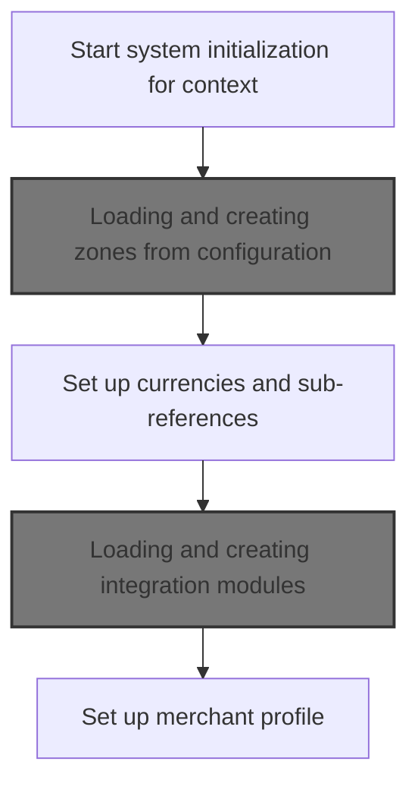
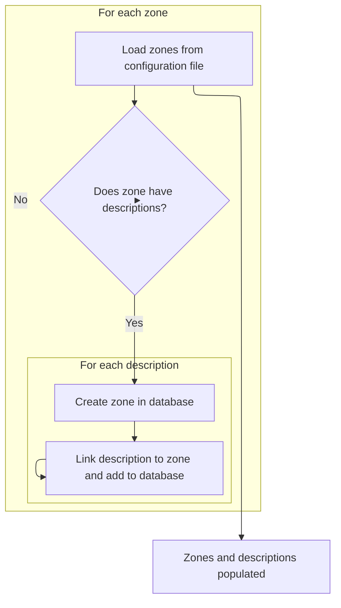
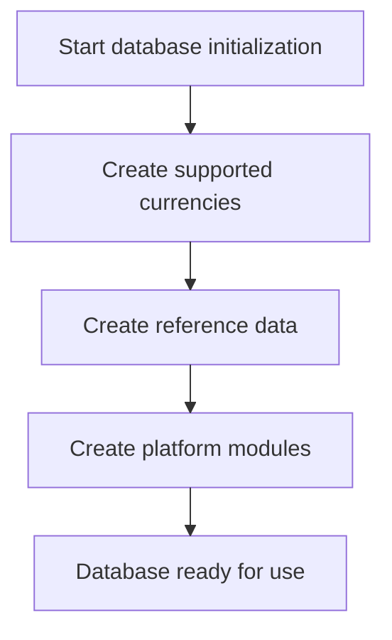

This document describes how the system is initialized to prepare all foundational data for business operations. The flow receives a context name and sets up zones, currencies, integration modules, and the merchant profile, ensuring the platform is ready for use.

# Starting the database initialization



<SwmSnippet path="/shopizer/sm-core/src/main/java/com/salesmanager/core/business/reference/init/service/InitializationDatabaseImpl.java" line="85">

---

In `populate`, we kick off the initialization by setting the context and loading languages and countries. Next, we call createZones to make sure all zone data is available before moving on, since zones are needed for region-based logic later in the flow.

```java
	public void populate(String contextName) throws ServiceException {
		this.name =  contextName;
		
		createLanguages();
		createCountries();
		createZones();
```

---

</SwmSnippet>

## Loading and creating zones from configuration



<SwmSnippet path="/shopizer/sm-core/src/main/java/com/salesmanager/core/business/reference/init/service/InitializationDatabaseImpl.java" line="149">

---

In `createZones`, we load zone data from a fixed JSON file, then for each zone, we check for descriptions. If there are any, we clear them out before creating the zone, then add each description one by one. This avoids persistence issues and keeps zone creation clean.

```java
	private void createZones() throws ServiceException {
		LOGGER.info(String.format("%s : Populating Zones ", name));
        try {

    		  Map<String,Zone> zonesMap = new HashMap<String,Zone>();
    		  zonesMap = zonesLoader.loadZones("reference/zoneconfig.json");
              
              for (Map.Entry<String, Zone> entry : zonesMap.entrySet()) {
            	    String key = entry.getKey();
            	    Zone value = entry.getValue();
            	    if(value.getDescriptions()==null) {
            	    	LOGGER.warn("This zone " + key + " has no descriptions");
            	    	continue;
            	    }
            	    
            	    List<ZoneDescription> zoneDescriptions = value.getDescriptions();
            	    value.setDescriptons(null);

            	    zoneService.create(value);
            	    
            	    for(ZoneDescription description : zoneDescriptions) {
            	    	description.setZone(value);
            	    	zoneService.addDescription(value, description);
            	    }
              }
```

---

</SwmSnippet>

<SwmSnippet path="/shopizer/sm-core/src/main/java/com/salesmanager/core/business/reference/init/service/InitializationDatabaseImpl.java" line="175">

---

If anything goes wrong in `createZones`, we throw a ServiceException and halt the flow. No zones are returned; it's all side effects via persistence.

```java
  		} catch (Exception e) {
  		    
  			throw new ServiceException(e);
  		}

	}
```

---

</SwmSnippet>

## Continuing initialization after zones



<SwmSnippet path="/shopizer/sm-core/src/main/java/com/salesmanager/core/business/reference/init/service/InitializationDatabaseImpl.java" line="91">

---

After zones, `populate` continues with currencies and sub-references, then calls createModules to make sure all integrations are ready for use.

```java
		createCurrencies();
		createSubReferences();
		createModules();
```

---

</SwmSnippet>

## Loading and creating integration modules

<SwmSnippet path="/shopizer/sm-core/src/main/java/com/salesmanager/core/business/reference/init/service/InitializationDatabaseImpl.java" line="232">

---

In `createModules`, we load integration modules from a fixed JSON file using IntegrationModulesLoader. This step pulls in all the module definitions needed for external integrations.

```java
	private void createModules() throws ServiceException {
		
		try {
			
			List<IntegrationModule> modules = modulesLoader.loadIntegrationModules("reference/integrationmodules.json");
            for (IntegrationModule entry : modules) {
        	    moduleConfigurationService.create(entry);
          }
			
			
```

---

</SwmSnippet>

### Parsing integration module configuration

See <SwmLink doc-title="Loading Integration Modules">[Loading Integration Modules](\.swm\loading-integration-modules.551jzv68.sw.md)</SwmLink>

### Handling errors after module loading

<SwmSnippet path="/shopizer/sm-core/src/main/java/com/salesmanager/core/business/reference/init/service/InitializationDatabaseImpl.java" line="242">

---

After loading modules with IntegrationModulesLoader, if anything goes wrong during creation, `createModules` throws an error and halts further setup.

```java
		} catch (Exception e) {
			throw new ServiceException(e);
		}
		
		
	}
```

---

</SwmSnippet>

## Finalizing initialization with merchant setup

<SwmSnippet path="/shopizer/sm-core/src/main/java/com/salesmanager/core/business/reference/init/service/InitializationDatabaseImpl.java" line="94">

---

After modules are set up, `populate` finishes by creating the merchant. This step relies on everything else being ready, since merchant data may reference zones or modules.

```java
		createMerchant();


	}
```

---

</SwmSnippet>

&nbsp;

*This is an auto-generated document by Swimm 🌊 and has not yet been verified by a human*

<SwmMeta version="3.0.0" repo-id="Z2l0aHViJTNBJTNBU2hvcGl6ZXIlM0ElM0F1bWFsaW5nYXN3YW1p" repo-name="Shopizer"><sup>Powered by [Swimm](https://app.swimm.io/)</sup></SwmMeta>
