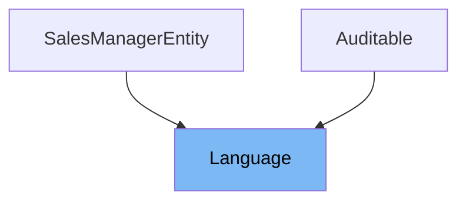

# Inheritance diagram

This diagram shows the inheritance tree of the class:



This document will cover the class Language. We will cover:

1. What is Language
2. Variables and functions

# What is Language

Language is a Java entity class in the Shopizer project representing a language used in the e-commerce platform. It is part of the core business reference model and is used to define language codes and their order for sorting. The class also supports auditing and is linked to merchant stores that use the language either as a default or among supported languages.

<SwmSnippet path="/shopizer/sm-core-model/src/main/java/com/salesmanager/core/business/reference/language/model/Language.java" line="59">

---

The constructor <SwmToken path="shopizer/sm-core-model/src/main/java/com/salesmanager/core/business/reference/language/model/Language.java" pos="59:3:5" line-data="	public Language() {">`Language()`</SwmToken> is a no-argument constructor that initializes a Language object without setting any properties explicitly.

```java
	public Language() {
	}
```

---

</SwmSnippet>

<SwmSnippet path="/shopizer/sm-core-model/src/main/java/com/salesmanager/core/business/reference/language/model/Language.java" line="62">

---

The constructor <SwmToken path="shopizer/sm-core-model/src/main/java/com/salesmanager/core/business/reference/language/model/Language.java" pos="62:3:8" line-data="	public Language(String code) {">`Language(String code)`</SwmToken> initializes a Language object and sets its language code using the provided string parameter. This allows quick creation of a Language instance with a specific code.

```java
	public Language(String code) {
		this.setCode(code);
	}
```

---

</SwmSnippet>

<SwmSnippet path="/shopizer/sm-core-model/src/main/java/com/salesmanager/core/business/reference/language/model/Language.java" line="66">

---

The function <SwmToken path="shopizer/sm-core-model/src/main/java/com/salesmanager/core/business/reference/language/model/Language.java" pos="67:5:7" line-data="	public Integer getId() {">`getId()`</SwmToken> returns the unique identifier of the Language entity. This ID is used as the primary key in the database and is of type Integer.

```java
	@Override
	public Integer getId() {
		return id;
	}
```

---

</SwmSnippet>

<SwmSnippet path="/shopizer/sm-core-model/src/main/java/com/salesmanager/core/business/reference/language/model/Language.java" line="70">

---

The function <SwmToken path="shopizer/sm-core-model/src/main/java/com/salesmanager/core/business/reference/language/model/Language.java" pos="72:5:10" line-data="	public void setId(Integer id) {">`setId(Integer id)`</SwmToken> sets the unique identifier of the Language entity. It assigns the provided Integer value to the id field.

```java
	
	@Override
	public void setId(Integer id) {
		this.id = id;
	}
```

---

</SwmSnippet>

<SwmSnippet path="/shopizer/sm-core-model/src/main/java/com/salesmanager/core/business/reference/language/model/Language.java" line="76">

---

The function <SwmToken path="shopizer/sm-core-model/src/main/java/com/salesmanager/core/business/reference/language/model/Language.java" pos="77:5:7" line-data="	public String getCode() {">`getCode()`</SwmToken> returns the language code string, which represents the language identifier such as 'en' for English or 'fr' for French. This code is mandatory and stored in the database.

```java

	public String getCode() {
		return code;
	}
```

---

</SwmSnippet>

<SwmSnippet path="/shopizer/sm-core-model/src/main/java/com/salesmanager/core/business/reference/language/model/Language.java" line="80">

---

The function <SwmToken path="shopizer/sm-core-model/src/main/java/com/salesmanager/core/business/reference/language/model/Language.java" pos="81:5:10" line-data="	public void setCode(String code) {">`setCode(String code)`</SwmToken> sets the language code string for the Language object. It assigns the provided string to the code field.

```java

	public void setCode(String code) {
		this.code = code;
	}
```

---

</SwmSnippet>

<SwmSnippet path="/shopizer/sm-core-model/src/main/java/com/salesmanager/core/business/reference/language/model/Language.java" line="85">

---

The function <SwmToken path="shopizer/sm-core-model/src/main/java/com/salesmanager/core/business/reference/language/model/Language.java" pos="85:5:7" line-data="	public Integer getSortOrder() {">`getSortOrder()`</SwmToken> returns an Integer representing the sort order of the language. This can be used to order languages in lists or UI elements.

```java
	public Integer getSortOrder() {
		return sortOrder;
	}
```

---

</SwmSnippet>

<SwmSnippet path="/shopizer/sm-core-model/src/main/java/com/salesmanager/core/business/reference/language/model/Language.java" line="88">

---

The function <SwmToken path="shopizer/sm-core-model/src/main/java/com/salesmanager/core/business/reference/language/model/Language.java" pos="89:5:10" line-data="	public void setSortOrder(Integer sortOrder) {">`setSortOrder(Integer sortOrder)`</SwmToken> sets the sort order value for the language. It assigns the provided Integer to the <SwmToken path="shopizer/sm-core-model/src/main/java/com/salesmanager/core/business/reference/language/model/Language.java" pos="89:9:9" line-data="	public void setSortOrder(Integer sortOrder) {">`sortOrder`</SwmToken> field.

```java

	public void setSortOrder(Integer sortOrder) {
		this.sortOrder = sortOrder;
	}
```

---

</SwmSnippet>

<SwmSnippet path="/shopizer/sm-core-model/src/main/java/com/salesmanager/core/business/reference/language/model/Language.java" line="93">

---

The function <SwmToken path="shopizer/sm-core-model/src/main/java/com/salesmanager/core/business/reference/language/model/Language.java" pos="94:5:7" line-data="	public AuditSection getAuditSection() {">`getAuditSection()`</SwmToken> returns the <SwmToken path="shopizer/sm-core-model/src/main/java/com/salesmanager/core/business/reference/language/model/Language.java" pos="94:3:3" line-data="	public AuditSection getAuditSection() {">`AuditSection`</SwmToken> object associated with the Language. This section contains audit information such as creation and modification timestamps.

```java
	@Override
	public AuditSection getAuditSection() {
		return auditSection;
	}
```

---

</SwmSnippet>

<SwmSnippet path="/shopizer/sm-core-model/src/main/java/com/salesmanager/core/business/reference/language/model/Language.java" line="97">

---

The function <SwmToken path="shopizer/sm-core-model/src/main/java/com/salesmanager/core/business/reference/language/model/Language.java" pos="99:5:10" line-data="	public void setAuditSection(AuditSection auditSection) {">`setAuditSection(AuditSection auditSection)`</SwmToken> sets the <SwmToken path="shopizer/sm-core-model/src/main/java/com/salesmanager/core/business/reference/language/model/Language.java" pos="99:7:7" line-data="	public void setAuditSection(AuditSection auditSection) {">`AuditSection`</SwmToken> for the Language entity. This allows updating audit metadata for the language.

```java
	
	@Override
	public void setAuditSection(AuditSection auditSection) {
		this.auditSection = auditSection;
	}
```

---

</SwmSnippet>

<SwmSnippet path="/shopizer/sm-core-model/src/main/java/com/salesmanager/core/business/reference/language/model/Language.java" line="103">

---

The function <SwmToken path="shopizer/sm-core-model/src/main/java/com/salesmanager/core/business/reference/language/model/Language.java" pos="104:5:10" line-data="	public boolean equals(Object obj) {">`equals(Object obj)`</SwmToken> overrides the default equality check to compare Language objects based on their unique identifier (id). It returns true if the other object is a Language instance with the same id.

```java
	@Override
	public boolean equals(Object obj) {
		if (null == obj)
			return false;
		if (!(obj instanceof Language)) {
			return false;
		} else {
			Language language = (Language) obj;
			return (this.id == language.getId());
		}
	}
```

---

</SwmSnippet>

# Usage

## User Default Language

The Language class is used in the User model to represent the user's default language preference. This is managed through a many-to-one relationship, allowing each user to have a specific default language associated with their profile.

## Locale Conversion

In utility classes like LocaleUtils, the Language class is used to convert language codes into Java Locale objects. This facilitates localization by enabling the application to adapt content and behavior based on the user's language.

## Session and Request Language Handling

Language instances are frequently retrieved from HTTP request attributes or session attributes to determine the current language context for a user session. This is evident in classes such as LanguageUtils and various web controllers and tags, where the Language object guides content rendering and processing.

## Product and Content Localization

The Language class is used when fetching product relationships and building breadcrumbs to ensure that content is presented in the appropriate language. This supports multi-language e-commerce experiences by tailoring product information and navigation elements to the user's language.

## Email and Notification Localization

In email utilities, the Language class is passed along with other parameters to send localized emails to customers. This ensures that communications such as order confirmations are delivered in the customer's preferred language.

&nbsp;

*This is an auto-generated document by Swimm 🌊 and has not yet been verified by a human*

<SwmMeta version="3.0.0" repo-id="Z2l0aHViJTNBJTNBU2hvcGl6ZXIlM0ElM0F1bWFsaW5nYXN3YW1p" repo-name="Shopizer"><sup>Powered by [Swimm](https://app.swimm.io/)</sup></SwmMeta>
