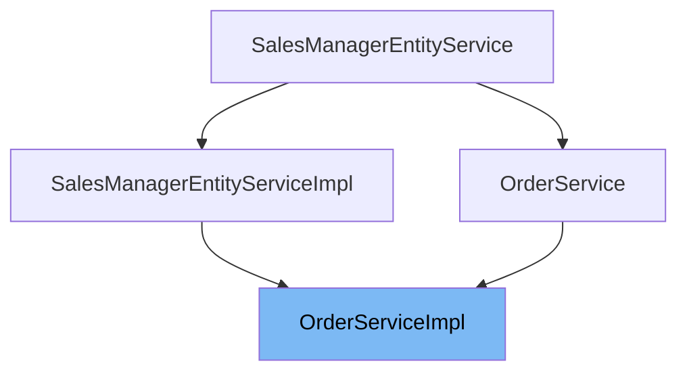

# Inheritance diagram

This diagram shows the inheritance tree of the class:



This document covers the <SwmToken path="shopizer/sm-core/src/main/java/com/salesmanager/core/business/order/service/OrderServiceImpl.java" pos="81:3:3" line-data="    public OrderServiceImpl(final OrderDao orderDao) {">`OrderServiceImpl`</SwmToken> class. We will cover:

1. What is <SwmToken path="shopizer/sm-core/src/main/java/com/salesmanager/core/business/order/service/OrderServiceImpl.java" pos="81:3:3" line-data="    public OrderServiceImpl(final OrderDao orderDao) {">`OrderServiceImpl`</SwmToken>
2. Variables and functions in <SwmToken path="shopizer/sm-core/src/main/java/com/salesmanager/core/business/order/service/OrderServiceImpl.java" pos="81:3:3" line-data="    public OrderServiceImpl(final OrderDao orderDao) {">`OrderServiceImpl`</SwmToken>

# What is <SwmToken path="shopizer/sm-core/src/main/java/com/salesmanager/core/business/order/service/OrderServiceImpl.java" pos="81:3:3" line-data="    public OrderServiceImpl(final OrderDao orderDao) {">`OrderServiceImpl`</SwmToken>

<SwmToken path="shopizer/sm-core/src/main/java/com/salesmanager/core/business/order/service/OrderServiceImpl.java" pos="81:3:3" line-data="    public OrderServiceImpl(final OrderDao orderDao) {">`OrderServiceImpl`</SwmToken> is a service class in the Shopizer e-commerce platform responsible for managing orders. It extends a generic entity service and implements the <SwmToken path="shopizer/sm-core/src/main/java/com/salesmanager/core/business/order/service/OrderServiceImpl.java" pos="56:18:18" line-data="public class OrderServiceImpl  extends SalesManagerEntityServiceImpl&lt;Long, Order&gt; implements OrderService {">`OrderService`</SwmToken> interface. This class handles core order operations such as processing orders, calculating order totals, managing order status history, generating invoices, and interacting with related services like payment, shipping, tax, and customer services. It acts as the main business logic layer for order-related functionalities.

<SwmSnippet path="/shopizer/sm-core/src/main/java/com/salesmanager/core/business/order/service/OrderServiceImpl.java" line="80">

---

The constructor function <SwmToken path="shopizer/sm-core/src/main/java/com/salesmanager/core/business/order/service/OrderServiceImpl.java" pos="81:3:3" line-data="    public OrderServiceImpl(final OrderDao orderDao) {">`OrderServiceImpl`</SwmToken> initializes the service with an <SwmToken path="shopizer/sm-core/src/main/java/com/salesmanager/core/business/order/service/OrderServiceImpl.java" pos="81:7:7" line-data="    public OrderServiceImpl(final OrderDao orderDao) {">`OrderDao`</SwmToken> instance, which it passes to its superclass and stores locally for order data access.

```java
    @Autowired
    public OrderServiceImpl(final OrderDao orderDao) {
        super(orderDao);
        this.orderDao = orderDao;
    }
```

---

</SwmSnippet>

<SwmSnippet path="/shopizer/sm-core/src/main/java/com/salesmanager/core/business/order/service/OrderServiceImpl.java" line="86">

---

The function <SwmToken path="shopizer/sm-core/src/main/java/com/salesmanager/core/business/order/service/OrderServiceImpl.java" pos="87:5:5" line-data="    public void addOrderStatusHistory(final Order order, final OrderStatusHistory history) throws ServiceException {">`addOrderStatusHistory`</SwmToken> adds a new status history entry to an order, sets the order reference in the history, and updates the order in the database.

```java
    @Override
    public void addOrderStatusHistory(final Order order, final OrderStatusHistory history) throws ServiceException {
        order.getOrderHistory().add(history);
        history.setOrder(order);
        update(order);
    }
```

---

</SwmSnippet>

<SwmSnippet path="/shopizer/sm-core/src/main/java/com/salesmanager/core/business/order/service/OrderServiceImpl.java" line="93">

---

The function <SwmToken path="shopizer/sm-core/src/main/java/com/salesmanager/core/business/order/service/OrderServiceImpl.java" pos="94:5:5" line-data="    public Order processOrder(Order order, Customer customer, List&lt;ShoppingCartItem&gt; items, OrderTotalSummary summary, Payment payment, MerchantStore store) throws ServiceException {">`processOrder`</SwmToken> (overload without transaction) processes an order by delegating to a private <SwmToken path="shopizer/sm-core/src/main/java/com/salesmanager/core/business/order/service/OrderServiceImpl.java" pos="96:5:5" line-data="    	return this.process(order, customer, items, summary, payment, null, store);">`process`</SwmToken> method, handling payment and order creation without a transaction object.

```java
    @Override
    public Order processOrder(Order order, Customer customer, List<ShoppingCartItem> items, OrderTotalSummary summary, Payment payment, MerchantStore store) throws ServiceException {
    	
    	return this.process(order, customer, items, summary, payment, null, store);
    }
```

---

</SwmSnippet>

<SwmSnippet path="/shopizer/sm-core/src/main/java/com/salesmanager/core/business/order/service/OrderServiceImpl.java" line="99">

---

The function <SwmToken path="shopizer/sm-core/src/main/java/com/salesmanager/core/business/order/service/OrderServiceImpl.java" pos="100:5:5" line-data="    public Order processOrder(Order order, Customer customer, List&lt;ShoppingCartItem&gt; items, OrderTotalSummary summary, Payment payment, Transaction transaction, MerchantStore store) throws ServiceException {">`processOrder`</SwmToken> (overload with transaction) processes an order including a transaction object, delegating to the private <SwmToken path="shopizer/sm-core/src/main/java/com/salesmanager/core/business/order/service/OrderServiceImpl.java" pos="102:5:5" line-data="    	return this.process(order, customer, items, summary, payment, transaction, store);">`process`</SwmToken> method to handle payment, order creation, and transaction persistence.

```java
    @Override
    public Order processOrder(Order order, Customer customer, List<ShoppingCartItem> items, OrderTotalSummary summary, Payment payment, Transaction transaction, MerchantStore store) throws ServiceException {
    	
    	return this.process(order, customer, items, summary, payment, transaction, store);
    }
```

---

</SwmSnippet>

<SwmSnippet path="/shopizer/sm-core/src/main/java/com/salesmanager/core/business/order/service/OrderServiceImpl.java" line="104">

---

The private function <SwmToken path="shopizer/sm-core/src/main/java/com/salesmanager/core/business/order/service/OrderServiceImpl.java" pos="105:5:5" line-data="    private Order process(Order order, Customer customer, List&lt;ShoppingCartItem&gt; items, OrderTotalSummary summary, Payment payment, Transaction transaction, MerchantStore store) throws ServiceException {">`process`</SwmToken> performs the core order processing logic: validating inputs, processing payment, initializing order status history if missing, creating the customer if new, saving the order, and persisting transactions related to the order and payment.

```java
    
    private Order process(Order order, Customer customer, List<ShoppingCartItem> items, OrderTotalSummary summary, Payment payment, Transaction transaction, MerchantStore store) throws ServiceException {
    	
    	
    	Validate.notNull(order, "Order cannot be null");
    	Validate.notNull(customer, "Customer cannot be null (even if anonymous order)");
    	Validate.notEmpty(items, "ShoppingCart items cannot be null");
    	Validate.notNull(payment, "Payment cannot be null");
    	Validate.notNull(store, "MerchantStore cannot be null");
    	Validate.notNull(summary, "Order total Summary cannot be null");
    	
    	//first process payment
    	Transaction processTransaction = paymentService.processPayment(customer, store, payment, items, order);
    	//transactionService.save(processTransaction);
    	
    	if(order.getOrderHistory()==null || order.getOrderHistory().size()==0 || order.getStatus()==null) {
    		OrderStatus status = order.getStatus();
    		if(status==null) {
    			status = OrderStatus.ORDERED;
    			order.setStatus(status);
    		}
    		Set<OrderStatusHistory> statusHistorySet = new HashSet<OrderStatusHistory>();
    		OrderStatusHistory statusHistory = new OrderStatusHistory();
    		statusHistory.setStatus(status);
    		statusHistory.setDateAdded(new Date());
    		statusHistory.setOrder(order);
    		statusHistorySet.add(statusHistory);
    		order.setOrderHistory(statusHistorySet);
    		
    	}
    	
    	if(customer.getId()==null || customer.getId()==0) {
    		customerService.create(customer);
    	}
    	
    	order.setCustomerId(customer.getId());
    	
    	this.create(order);

    	if(transaction!=null) {
    		transaction.setOrder(order);
    		if(transaction.getId()==null || transaction.getId()==0) {
    			transactionService.create(transaction);
    		} else {
    			transactionService.update(transaction);
    		}
    	}
    	
    	if(processTransaction!=null) {
    		processTransaction.setOrder(order);
    		if(processTransaction.getId()==null || processTransaction.getId()==0) {
    			transactionService.create(processTransaction);
    		} else {
    			transactionService.update(processTransaction);
    		}
    	}
    	
    	return order;
    	
    	
    }
```

---

</SwmSnippet>

<SwmSnippet path="/shopizer/sm-core/src/main/java/com/salesmanager/core/business/order/service/OrderServiceImpl.java" line="165">

---

The private function <SwmToken path="shopizer/sm-core/src/main/java/com/salesmanager/core/business/order/service/OrderServiceImpl.java" pos="166:5:5" line-data="    private OrderTotalSummary caculateOrder(final OrderSummary summary, final Customer customer, final MerchantStore store, final Language language) throws Exception {">`caculateOrder`</SwmToken> calculates the detailed order total summary including subtotals, shipping, handling fees, taxes, and grand total by iterating over shopping cart items and applying pricing rules.

```java

    private OrderTotalSummary caculateOrder(final OrderSummary summary, final Customer customer, final MerchantStore store, final Language language) throws Exception {

        OrderTotalSummary totalSummary = new OrderTotalSummary();
        List<OrderTotal> orderTotals = new ArrayList<OrderTotal>();
        Map<String,OrderTotal> otherPricesTotals = new HashMap<String,OrderTotal>();

        ShippingConfiguration shippingConfiguration = null;

        BigDecimal grandTotal = new BigDecimal(0);
        grandTotal.setScale(2, RoundingMode.HALF_UP);

        //price by item
        /**
         * qty * price
         * subtotal
         */
        BigDecimal subTotal = new BigDecimal(0);
        subTotal.setScale(2, RoundingMode.HALF_UP);
        for(ShoppingCartItem item : summary.getProducts()) {

            BigDecimal st = item.getItemPrice().multiply(new BigDecimal(item.getQuantity()));
            item.setSubTotal(st);
            subTotal = subTotal.add(st);
            //Other prices
            FinalPrice finalPrice = item.getFinalPrice();
            if(finalPrice!=null) {
                List<FinalPrice> otherPrices = finalPrice.getAdditionalPrices();
                if(otherPrices!=null) {
                    for(FinalPrice price : otherPrices) {
                        if(!price.isDefaultPrice()) {
                            OrderTotal itemSubTotal = otherPricesTotals.get(price.getProductPrice().getCode());

                            if(itemSubTotal==null) {
                                itemSubTotal = new OrderTotal();
                                itemSubTotal.setModule(Constants.OT_ITEM_PRICE_MODULE_CODE);
                                itemSubTotal.setText(Constants.OT_ITEM_PRICE_MODULE_CODE);
                                itemSubTotal.setTitle(Constants.OT_ITEM_PRICE_MODULE_CODE);
                                itemSubTotal.setOrderTotalCode(price.getProductPrice().getCode());
                                itemSubTotal.setOrderTotalType(OrderTotalType.PRODUCT);
                                itemSubTotal.setSortOrder(0);
                                otherPricesTotals.put(price.getProductPrice().getCode(), itemSubTotal);
                            }

                            BigDecimal orderTotalValue = itemSubTotal.getValue();
                            if(orderTotalValue==null) {
                                orderTotalValue = new BigDecimal(0);
                                orderTotalValue.setScale(2, RoundingMode.HALF_UP);
                            }

                            orderTotalValue = orderTotalValue.add(price.getFinalPrice());
                            itemSubTotal.setValue(orderTotalValue);
                            if(price.getProductPrice().getProductPriceType().name().equals(OrderValueType.ONE_TIME)) {
                                subTotal = subTotal.add(price.getFinalPrice());
                            }
                        }
                    }
                }
            }

        }


        totalSummary.setSubTotal(subTotal);
        grandTotal=grandTotal.add(subTotal);

        OrderTotal orderTotalSubTotal = new OrderTotal();
        orderTotalSubTotal.setModule(Constants.OT_SUBTOTAL_MODULE_CODE);
        orderTotalSubTotal.setOrderTotalType(OrderTotalType.SUBTOTAL);
        orderTotalSubTotal.setOrderTotalCode("order.total.subtotal");
        orderTotalSubTotal.setTitle(Constants.OT_SUBTOTAL_MODULE_CODE);
        orderTotalSubTotal.setText("order.total.subtotal");
        orderTotalSubTotal.setSortOrder(5);
        orderTotalSubTotal.setValue(subTotal);

        //TODO autowire a list of post processing modules for price calculation - drools, custom modules
        //may affect the sub total

        orderTotals.add(orderTotalSubTotal);


        //shipping
        if(summary.getShippingSummary()!=null) {


	            OrderTotal shippingSubTotal = new OrderTotal();
	            shippingSubTotal.setModule(Constants.OT_SHIPPING_MODULE_CODE);
	            shippingSubTotal.setOrderTotalType(OrderTotalType.SHIPPING);
	            shippingSubTotal.setOrderTotalCode("order.total.shipping");
	            shippingSubTotal.setTitle(Constants.OT_SHIPPING_MODULE_CODE);
	            shippingSubTotal.setText("order.total.shipping");
	            shippingSubTotal.setSortOrder(10);
	
	            orderTotals.add(shippingSubTotal);

            if(!summary.getShippingSummary().isFreeShipping()) {
                shippingSubTotal.setValue(summary.getShippingSummary().getShipping());
                grandTotal=grandTotal.add(summary.getShippingSummary().getShipping());
            } else {
                shippingSubTotal.setValue(new BigDecimal(0));
                grandTotal=grandTotal.add(new BigDecimal(0));
            }

            //check handling fees
            shippingConfiguration = shippingService.getShippingConfiguration(store);
            if(summary.getShippingSummary().getHandling()!=null && summary.getShippingSummary().getHandling().doubleValue()>0) {
                if(shippingConfiguration.getHandlingFees()!=null && shippingConfiguration.getHandlingFees().doubleValue()>0) {
                    OrderTotal handlingubTotal = new OrderTotal();
                    handlingubTotal.setModule(Constants.OT_HANDLING_MODULE_CODE);
                    handlingubTotal.setOrderTotalType(OrderTotalType.HANDLING);
                    handlingubTotal.setOrderTotalCode("order.total.handling");
                    handlingubTotal.setTitle(Constants.OT_HANDLING_MODULE_CODE);
                    handlingubTotal.setText("order.total.handling");
                    handlingubTotal.setSortOrder(12);
                    handlingubTotal.setValue(summary.getShippingSummary().getHandling());
                    orderTotals.add(handlingubTotal);
                    grandTotal=grandTotal.add(summary.getShippingSummary().getHandling());
                }
            }
        }

        //tax
        List<TaxItem> taxes = taxService.calculateTax(summary, customer, store, language);
        if(taxes!=null && taxes.size()>0) {
        	BigDecimal totalTaxes = new BigDecimal(0);
        	totalTaxes.setScale(2, RoundingMode.HALF_UP);
            int taxCount = 20;
            for(TaxItem tax : taxes) {

                OrderTotal taxLine = new OrderTotal();
                taxLine.setModule(Constants.OT_TAX_MODULE_CODE);
                taxLine.setOrderTotalType(OrderTotalType.TAX);
                taxLine.setOrderTotalCode(tax.getLabel());
                taxLine.setSortOrder(taxCount);
                taxLine.setTitle(Constants.OT_TAX_MODULE_CODE);
                taxLine.setText(tax.getLabel());
                taxLine.setValue(tax.getItemPrice());

                totalTaxes = totalTaxes.add(tax.getItemPrice());
                orderTotals.add(taxLine);
                //grandTotal=grandTotal.add(tax.getItemPrice());

                taxCount ++;

            }
            grandTotal = grandTotal.add(totalTaxes);
            totalSummary.setTaxTotal(totalTaxes);
        }

        // grand total
        OrderTotal orderTotal = new OrderTotal();
        orderTotal.setModule(Constants.OT_TOTAL_MODULE_CODE);
        orderTotal.setOrderTotalType(OrderTotalType.TOTAL);
        orderTotal.setOrderTotalCode("order.total.total");
        orderTotal.setTitle(Constants.OT_TOTAL_MODULE_CODE);
        orderTotal.setText("order.total.total");
        orderTotal.setSortOrder(300);
        orderTotal.setValue(grandTotal);
        orderTotals.add(orderTotal);

        totalSummary.setTotal(grandTotal);
        totalSummary.setTotals(orderTotals);
        return totalSummary;

    }
```

---

</SwmSnippet>

<SwmSnippet path="/shopizer/sm-core/src/main/java/com/salesmanager/core/business/order/service/OrderServiceImpl.java" line="332">

---

The public function <SwmToken path="shopizer/sm-core/src/main/java/com/salesmanager/core/business/order/service/OrderServiceImpl.java" pos="333:5:5" line-data="    public OrderTotalSummary caculateOrderTotal(final OrderSummary orderSummary, final Customer customer, final MerchantStore store, final Language language) throws ServiceException {">`caculateOrderTotal`</SwmToken> calculates the order total summary given an <SwmToken path="shopizer/sm-core/src/main/java/com/salesmanager/core/business/order/service/OrderServiceImpl.java" pos="333:9:9" line-data="    public OrderTotalSummary caculateOrderTotal(final OrderSummary orderSummary, final Customer customer, final MerchantStore store, final Language language) throws ServiceException {">`OrderSummary`</SwmToken>, Customer, <SwmToken path="shopizer/sm-core/src/main/java/com/salesmanager/core/business/order/service/OrderServiceImpl.java" pos="333:23:23" line-data="    public OrderTotalSummary caculateOrderTotal(final OrderSummary orderSummary, final Customer customer, final MerchantStore store, final Language language) throws ServiceException {">`MerchantStore`</SwmToken>, and Language, by calling the private <SwmToken path="shopizer/sm-core/src/main/java/com/salesmanager/core/business/order/service/OrderServiceImpl.java" pos="340:3:3" line-data="            return caculateOrder(orderSummary, customer, store, language);">`caculateOrder`</SwmToken> method and handling exceptions.

```java
    @Override
    public OrderTotalSummary caculateOrderTotal(final OrderSummary orderSummary, final Customer customer, final MerchantStore store, final Language language) throws ServiceException {
        Validate.notNull(orderSummary,"Order summary cannot be null");
        Validate.notNull(orderSummary.getProducts(),"Order summary.products cannot be null");
        Validate.notNull(store,"MerchantStore cannot be null");
        Validate.notNull(customer,"Customer cannot be null");

        try {
            return caculateOrder(orderSummary, customer, store, language);
        } catch (Exception e) {
            throw new ServiceException(e);
        }

    }
```

---

</SwmSnippet>

<SwmSnippet path="/shopizer/sm-core/src/main/java/com/salesmanager/core/business/order/service/OrderServiceImpl.java" line="349">

---

The public function <SwmToken path="shopizer/sm-core/src/main/java/com/salesmanager/core/business/order/service/OrderServiceImpl.java" pos="350:5:5" line-data="    public OrderTotalSummary caculateOrderTotal(final OrderSummary orderSummary, final MerchantStore store, final Language language) throws ServiceException {">`caculateOrderTotal`</SwmToken> overload calculates the order total summary without a customer, useful for guest or anonymous orders, by calling the private <SwmToken path="shopizer/sm-core/src/main/java/com/salesmanager/core/business/order/service/OrderServiceImpl.java" pos="356:3:3" line-data="            return caculateOrder(orderSummary, null, store, language);">`caculateOrder`</SwmToken> method.

```java
    @Override
    public OrderTotalSummary caculateOrderTotal(final OrderSummary orderSummary, final MerchantStore store, final Language language) throws ServiceException {
        Validate.notNull(orderSummary,"Order summary cannot be null");
        Validate.notNull(orderSummary.getProducts(),"Order summary.products cannot be null");
        Validate.notNull(store,"MerchantStore cannot be null");

        try {
            return caculateOrder(orderSummary, null, store, language);
        } catch (Exception e) {
            throw new ServiceException(e);
        }

    }
```

---

</SwmSnippet>

<SwmSnippet path="/shopizer/sm-core/src/main/java/com/salesmanager/core/business/order/service/OrderServiceImpl.java" line="363">

---

The private function <SwmToken path="shopizer/sm-core/src/main/java/com/salesmanager/core/business/order/service/OrderServiceImpl.java" pos="363:5:5" line-data="    private OrderTotalSummary caculateShoppingCart( final ShoppingCart shoppingCart, final Customer customer, final MerchantStore store, final Language language) throws Exception {">`caculateShoppingCart`</SwmToken> converts a <SwmToken path="shopizer/sm-core/src/main/java/com/salesmanager/core/business/order/service/OrderServiceImpl.java" pos="363:10:10" line-data="    private OrderTotalSummary caculateShoppingCart( final ShoppingCart shoppingCart, final Customer customer, final MerchantStore store, final Language language) throws Exception {">`ShoppingCart`</SwmToken> into an <SwmToken path="shopizer/sm-core/src/main/java/com/salesmanager/core/business/order/service/OrderServiceImpl.java" pos="369:1:1" line-data="    	OrderSummary orderSummary = new OrderSummary();">`OrderSummary`</SwmToken> and calculates the order total summary by calling <SwmToken path="shopizer/sm-core/src/main/java/com/salesmanager/core/business/order/service/OrderServiceImpl.java" pos="375:5:5" line-data="    	return this.caculateOrder(orderSummary, customer, store, language);">`caculateOrder`</SwmToken>.

```java
    private OrderTotalSummary caculateShoppingCart( final ShoppingCart shoppingCart, final Customer customer, final MerchantStore store, final Language language) throws Exception {

        
    	
    	
    	
    	OrderSummary orderSummary = new OrderSummary();
    	
    	List<ShoppingCartItem> itemsSet = new ArrayList<ShoppingCartItem>(shoppingCart.getLineItems());
    	orderSummary.setProducts(itemsSet);
    	
    	
    	return this.caculateOrder(orderSummary, customer, store, language);

    }
```

---

</SwmSnippet>

<SwmSnippet path="/shopizer/sm-core/src/main/java/com/salesmanager/core/business/order/service/OrderServiceImpl.java" line="392">

---

The public function <SwmToken path="shopizer/sm-core/src/main/java/com/salesmanager/core/business/order/service/OrderServiceImpl.java" pos="393:5:5" line-data="    public OrderTotalSummary calculateShoppingCartTotal(">`calculateShoppingCartTotal`</SwmToken> calculates the total for a shopping cart with a customer context, validating inputs and delegating to <SwmToken path="shopizer/sm-core/src/main/java/com/salesmanager/core/business/order/service/OrderServiceImpl.java" pos="400:3:3" line-data="            return caculateShoppingCart(shoppingCart, customer, store, language);">`caculateShoppingCart`</SwmToken> while handling exceptions.

```java
    @Override
    public OrderTotalSummary calculateShoppingCartTotal(
                                                        final ShoppingCart shoppingCart, final Customer customer, final MerchantStore store,
                                                        final Language language) throws ServiceException {
        Validate.notNull(shoppingCart,"Order summary cannot be null");
        Validate.notNull(customer,"Customery cannot be null");
        Validate.notNull(store,"MerchantStore cannot be null.");
        try {
            return caculateShoppingCart(shoppingCart, customer, store, language);
        } catch (Exception e) {
            LOGGER.error( "Error while calculating shopping cart total" +e );
            throw new ServiceException(e);
        }

    }
```

---

</SwmSnippet>

<SwmSnippet path="/shopizer/sm-core/src/main/java/com/salesmanager/core/business/order/service/OrderServiceImpl.java" line="422">

---

The public function <SwmToken path="shopizer/sm-core/src/main/java/com/salesmanager/core/business/order/service/OrderServiceImpl.java" pos="423:5:5" line-data="    public OrderTotalSummary calculateShoppingCartTotal(">`calculateShoppingCartTotal`</SwmToken> overload calculates the total for a shopping cart without a customer context, useful for anonymous users, by delegating to <SwmToken path="shopizer/sm-core/src/main/java/com/salesmanager/core/business/order/service/OrderServiceImpl.java" pos="430:3:3" line-data="            return caculateShoppingCart(shoppingCart, null, store, language);">`caculateShoppingCart`</SwmToken>.

```java
    @Override
    public OrderTotalSummary calculateShoppingCartTotal(
                                                        final ShoppingCart shoppingCart, final MerchantStore store, final Language language)
                                                                        throws ServiceException {
        Validate.notNull(shoppingCart,"Order summary cannot be null");
        Validate.notNull(store,"MerchantStore cannot be null");

        try {
            return caculateShoppingCart(shoppingCart, null, store, language);
        } catch (Exception e) {
            LOGGER.error( "Error while calculating shopping cart total" +e );
            throw new ServiceException(e);
        }
    }
```

---

</SwmSnippet>

<SwmSnippet path="/shopizer/sm-core/src/main/java/com/salesmanager/core/business/order/service/OrderServiceImpl.java" line="437">

---

The function <SwmToken path="shopizer/sm-core/src/main/java/com/salesmanager/core/business/order/service/OrderServiceImpl.java" pos="438:5:5" line-data="    public void delete(final Order order) throws ServiceException {">`delete`</SwmToken> deletes an order by calling the superclass delete method, removing the order from persistence.

```java
    @Override
    public void delete(final Order order) throws ServiceException {


        super.delete(order);
    }
```

---

</SwmSnippet>

<SwmSnippet path="/shopizer/sm-core/src/main/java/com/salesmanager/core/business/order/service/OrderServiceImpl.java" line="445">

---

The function <SwmToken path="shopizer/sm-core/src/main/java/com/salesmanager/core/business/order/service/OrderServiceImpl.java" pos="446:5:5" line-data="    public ByteArrayOutputStream generateInvoice(final MerchantStore store, final Order order, final Language language) throws ServiceException {">`generateInvoice`</SwmToken> generates an invoice PDF stream for a given order and store by delegating to the <SwmToken path="shopizer/sm-core/src/main/java/com/salesmanager/core/business/order/service/OrderServiceImpl.java" pos="52:12:12" line-data="import com.salesmanager.core.modules.order.InvoiceModule;">`InvoiceModule`</SwmToken>, validating that order products and totals exist.

```java
    @Override
    public ByteArrayOutputStream generateInvoice(final MerchantStore store, final Order order, final Language language) throws ServiceException {

        Validate.notNull(order.getOrderProducts(),"Order products cannot be null");
        Validate.notNull(order.getOrderTotal(),"Order totals cannot be null");

        try {
            ByteArrayOutputStream stream = invoiceModule.createInvoice(store, order, language);
            return stream;
        } catch(Exception e) {
            throw new ServiceException(e);
        }


    }
```

---

</SwmSnippet>

<SwmSnippet path="/shopizer/sm-core/src/main/java/com/salesmanager/core/business/order/service/OrderServiceImpl.java" line="462">

---

The function <SwmToken path="shopizer/sm-core/src/main/java/com/salesmanager/core/business/order/service/OrderServiceImpl.java" pos="463:5:5" line-data="    public Order getOrder(final Long orderId ) {">`getOrder`</SwmToken> retrieves an order by its ID using the inherited <SwmToken path="shopizer/sm-core/src/main/java/com/salesmanager/core/business/order/service/OrderServiceImpl.java" pos="464:3:3" line-data="        return getById(orderId);">`getById`</SwmToken> method.

```java
    @Override
    public Order getOrder(final Long orderId ) {
        return getById(orderId);
    }
```

---

</SwmSnippet>

<SwmSnippet path="/shopizer/sm-core/src/main/java/com/salesmanager/core/business/order/service/OrderServiceImpl.java" line="469">

---

The function <SwmToken path="shopizer/sm-core/src/main/java/com/salesmanager/core/business/order/service/OrderServiceImpl.java" pos="470:8:8" line-data="    public List&lt;Order&gt; listByStore(final MerchantStore merchantStore) {">`listByStore`</SwmToken> returns a list of orders for a given <SwmToken path="shopizer/sm-core/src/main/java/com/salesmanager/core/business/order/service/OrderServiceImpl.java" pos="470:12:12" line-data="    public List&lt;Order&gt; listByStore(final MerchantStore merchantStore) {">`MerchantStore`</SwmToken> by querying the <SwmToken path="shopizer/sm-core/src/main/java/com/salesmanager/core/business/order/service/OrderServiceImpl.java" pos="81:9:9" line-data="    public OrderServiceImpl(final OrderDao orderDao) {">`orderDao`</SwmToken> or using a field-based list method.

```java
    @Override
    public List<Order> listByStore(final MerchantStore merchantStore) {
        return listByField(Order_.merchant, merchantStore);
    }
```

---

</SwmSnippet>

<SwmSnippet path="/shopizer/sm-core/src/main/java/com/salesmanager/core/business/order/service/OrderServiceImpl.java" line="474">

---

The function <SwmToken path="shopizer/sm-core/src/main/java/com/salesmanager/core/business/order/service/OrderServiceImpl.java" pos="475:5:5" line-data="    public OrderList listByStore(final MerchantStore store, final OrderCriteria criteria) {">`listByStore`</SwmToken> overload returns an <SwmToken path="shopizer/sm-core/src/main/java/com/salesmanager/core/business/order/service/OrderServiceImpl.java" pos="475:3:3" line-data="    public OrderList listByStore(final MerchantStore store, final OrderCriteria criteria) {">`OrderList`</SwmToken> filtered by store and additional criteria by delegating to the <SwmToken path="shopizer/sm-core/src/main/java/com/salesmanager/core/business/order/service/OrderServiceImpl.java" pos="477:3:3" line-data="        return orderDao.listByStore(store, criteria);">`orderDao`</SwmToken>'s <SwmToken path="shopizer/sm-core/src/main/java/com/salesmanager/core/business/order/service/OrderServiceImpl.java" pos="475:5:5" line-data="    public OrderList listByStore(final MerchantStore store, final OrderCriteria criteria) {">`listByStore`</SwmToken> method.

```java
    @Override
    public OrderList listByStore(final MerchantStore store, final OrderCriteria criteria) {

        return orderDao.listByStore(store, criteria);
    }
```

---

</SwmSnippet>

<SwmSnippet path="/shopizer/sm-core/src/main/java/com/salesmanager/core/business/order/service/OrderServiceImpl.java" line="481">

---

The function <SwmToken path="shopizer/sm-core/src/main/java/com/salesmanager/core/business/order/service/OrderServiceImpl.java" pos="482:5:5" line-data="    public void saveOrUpdate(final Order order) throws ServiceException {">`saveOrUpdate`</SwmToken> saves a new order or updates an existing one by checking if the order ID exists and calling the appropriate superclass method, logging the action.

```java
    @Override
    public void saveOrUpdate(final Order order) throws ServiceException {

        if(order.getId()!=null && order.getId()>0) {
            LOGGER.debug("Updating Order");
            super.update(order);

        } else {
            LOGGER.debug("Creating Order");
            super.create(order);

        }
    }
```

---

</SwmSnippet>

<SwmSnippet path="/shopizer/sm-core/src/main/java/com/salesmanager/core/business/order/service/OrderServiceImpl.java" line="495">

---

The function <SwmToken path="shopizer/sm-core/src/main/java/com/salesmanager/core/business/order/service/OrderServiceImpl.java" pos="496:5:5" line-data="	public boolean hasDownloadFiles(Order order) throws ServiceException {">`hasDownloadFiles`</SwmToken> checks if an order contains any downloadable files by iterating over order products and their downloads, returning true if any are found.

```java
	@Override
	public boolean hasDownloadFiles(Order order) throws ServiceException {
		
		Validate.notNull(order,"Order cannot be null");
		Validate.notNull(order.getOrderProducts(),"Order products cannot be null");
		Validate.notEmpty(order.getOrderProducts(),"Order products cannot be empty");
		
		boolean hasDownloads = false;
		for(OrderProduct orderProduct : order.getOrderProducts()) {
			
			if(CollectionUtils.isNotEmpty(orderProduct.getDownloads())) {
				hasDownloads = true;
				break;
			}
		}
		
		return hasDownloads;
	}
```

---

</SwmSnippet>

# Usage

## <SwmToken path="shopizer/sm-core/src/main/java/com/salesmanager/core/business/order/service/OrderServiceImpl.java" pos="81:3:3" line-data="    public OrderServiceImpl(final OrderDao orderDao) {">`OrderServiceImpl`</SwmToken>

<SwmToken path="shopizer/sm-core/src/main/java/com/salesmanager/core/business/order/service/OrderServiceImpl.java" pos="81:3:3" line-data="    public OrderServiceImpl(final OrderDao orderDao) {">`OrderServiceImpl`</SwmToken> is annotated as a Spring service, indicating it is a managed component responsible for order-related business logic. It extends a generic entity service implementation and implements the <SwmToken path="shopizer/sm-core/src/main/java/com/salesmanager/core/business/order/service/OrderServiceImpl.java" pos="56:18:18" line-data="public class OrderServiceImpl  extends SalesManagerEntityServiceImpl&lt;Long, Order&gt; implements OrderService {">`OrderService`</SwmToken> interface, which suggests it provides concrete methods for managing orders.

The class uses dependency injection to obtain an instance of <SwmToken path="shopizer/sm-core/src/main/java/com/salesmanager/core/business/order/service/OrderServiceImpl.java" pos="81:7:7" line-data="    public OrderServiceImpl(final OrderDao orderDao) {">`OrderDao`</SwmToken>, which it passes to its superclass to handle data access operations related to orders. This design allows <SwmToken path="shopizer/sm-core/src/main/java/com/salesmanager/core/business/order/service/OrderServiceImpl.java" pos="81:3:3" line-data="    public OrderServiceImpl(final OrderDao orderDao) {">`OrderServiceImpl`</SwmToken> to focus on business logic while delegating persistence concerns to the DAO layer.

Additionally, <SwmToken path="shopizer/sm-core/src/main/java/com/salesmanager/core/business/order/service/OrderServiceImpl.java" pos="81:3:3" line-data="    public OrderServiceImpl(final OrderDao orderDao) {">`OrderServiceImpl`</SwmToken> injects an <SwmToken path="shopizer/sm-core/src/main/java/com/salesmanager/core/business/order/service/OrderServiceImpl.java" pos="52:12:12" line-data="import com.salesmanager.core.modules.order.InvoiceModule;">`InvoiceModule`</SwmToken>, which likely supports generating or managing invoices associated with orders, integrating invoicing functionality into the order service.

&nbsp;

*This is an auto-generated document by Swimm 🌊 and has not yet been verified by a human*

<SwmMeta version="3.0.0" repo-id="Z2l0aHViJTNBJTNBU2hvcGl6ZXIlM0ElM0F1bWFsaW5nYXN3YW1p" repo-name="Shopizer"><sup>Powered by [Swimm](https://app.swimm.io/)</sup></SwmMeta>
