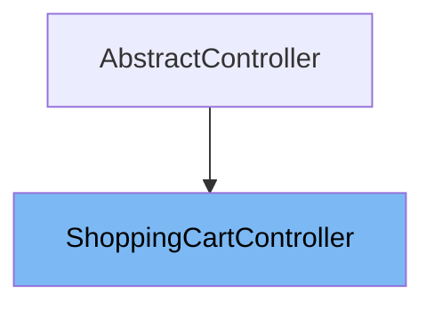

# Inheritance diagram

This diagram shows the inheritance tree of the class:



This document covers the <SwmToken path="shopizer/sm-shop/src/main/java/com/salesmanager/web/shop/controller/shoppingCart/ShoppingCartController.java" pos="91:4:4" line-data="public class ShoppingCartController extends AbstractController {">`ShoppingCartController`</SwmToken> class, focusing on:

1. What <SwmToken path="shopizer/sm-shop/src/main/java/com/salesmanager/web/shop/controller/shoppingCart/ShoppingCartController.java" pos="91:4:4" line-data="public class ShoppingCartController extends AbstractController {">`ShoppingCartController`</SwmToken> is and its role in the application
2. Variables and functions defined in <SwmToken path="shopizer/sm-shop/src/main/java/com/salesmanager/web/shop/controller/shoppingCart/ShoppingCartController.java" pos="91:4:4" line-data="public class ShoppingCartController extends AbstractController {">`ShoppingCartController`</SwmToken>, with explanations and code citations for each.

# What is <SwmToken path="shopizer/sm-shop/src/main/java/com/salesmanager/web/shop/controller/shoppingCart/ShoppingCartController.java" pos="91:4:4" line-data="public class ShoppingCartController extends AbstractController {">`ShoppingCartController`</SwmToken>

<SwmToken path="shopizer/sm-shop/src/main/java/com/salesmanager/web/shop/controller/shoppingCart/ShoppingCartController.java" pos="91:4:4" line-data="public class ShoppingCartController extends AbstractController {">`ShoppingCartController`</SwmToken> is a Spring MVC controller responsible for managing shopping cart operations in the web shop module. It handles HTTP requests related to adding, displaying, removing, and updating items in the shopping cart. The controller interacts with various services and facades to perform business logic and returns appropriate responses or views for the front-end. It supports both AJAX and standard web flows, enabling seamless cart management for both anonymous and logged-in users.

<SwmSnippet path="/shopizer/sm-shop/src/main/java/com/salesmanager/web/shop/controller/shoppingCart/ShoppingCartController.java" line="129">

---

The function <SwmToken path="shopizer/sm-shop/src/main/java/com/salesmanager/web/shop/controller/shoppingCart/ShoppingCartController.java" pos="129:9:9" line-data="    @RequestMapping(value={&quot;/addShoppingCartItem.html&quot;}, method=RequestMethod.POST)">`addShoppingCartItem`</SwmToken> handles POST requests to add an item to the shopping cart. It checks if a customer is logged in, retrieves or creates a shopping cart as needed, adds the item, and updates the session. The method returns the updated <SwmToken path="shopizer/sm-shop/src/main/java/com/salesmanager/web/shop/controller/shoppingCart/ShoppingCartController.java" pos="131:1:1" line-data="	ShoppingCartData addShoppingCartItem(@RequestBody final ShoppingCartItem item, final HttpServletRequest request, final HttpServletResponse response, final Locale locale) throws Exception {">`ShoppingCartData`</SwmToken> as a JSON response, supporting AJAX-driven cart updates.

```java
    @RequestMapping(value={"/addShoppingCartItem.html"}, method=RequestMethod.POST)
	public @ResponseBody
	ShoppingCartData addShoppingCartItem(@RequestBody final ShoppingCartItem item, final HttpServletRequest request, final HttpServletResponse response, final Locale locale) throws Exception {


		ShoppingCartData shoppingCart=null;


		//Look in the HttpSession to see if a customer is logged in
	    MerchantStore store = getSessionAttribute(Constants.MERCHANT_STORE, request);
	    Language language = (Language)request.getAttribute(Constants.LANGUAGE);
	    Customer customer = getSessionAttribute(  Constants.CUSTOMER, request );


		if(customer != null) {
			com.salesmanager.core.business.shoppingcart.model.ShoppingCart customerCart = shoppingCartService.getByCustomer(customer);
			if(customerCart!=null) {
				shoppingCart = shoppingCartFacade.getShoppingCartData( customerCart);


				//TODO if shoppingCart != null ?? merge
				//TODO maybe they have the same code
				//TODO what if codes are different (-- merge carts, keep the latest one, delete the oldest, switch codes --)
			}
		}

		
		if(shoppingCart==null && !StringUtils.isBlank(item.getCode())) {
			shoppingCart = shoppingCartFacade.getShoppingCartData(item.getCode(), store);
		}


		//if shoppingCart is null create a new one
		if(shoppingCart==null) {
			shoppingCart = new ShoppingCartData();
			String code = UUID.randomUUID().toString().replaceAll("-", "");
			shoppingCart.setCode(code);
		}

		shoppingCart=shoppingCartFacade.addItemsToShoppingCart( shoppingCart, item, store,language,customer );
		request.getSession().setAttribute(Constants.SHOPPING_CART, shoppingCart.getCode());


		/******************************************************/
		//TODO validate all of this

		//if a customer exists in http session
			//if a cart does not exist in httpsession
				//get cart from database
					//if a cart exist in the database add the item to the cart and put cart in httpsession and save to the database
					//else a cart does not exist in the database, create a new one, set the customer id, set the cart in the httpsession
			//else a cart exist in the httpsession, add item to httpsession cart and save to the database
		//else no customer in httpsession
			//if a cart does not exist in httpsession
				//create a new one, set the cart in the httpsession
			//else a cart exist in the httpsession, add item to httpsession cart and save to the database


		/**
		 * my concern is with the following :
		 * 	what if you add item in the shopping cart as an anonymous user
		 *  later on you log in to process with checkout but the system retrieves a previous shopping cart saved in the database for that customer
		 *  in that case we need to synchronize both carts and the original one (the one with the customer id) supercedes the current cart in session
		 *  the system will have to deal with the original one and remove the latest
		 */


		//**more implementation details
		//calculate the price of each item by using ProductPriceUtils in sm-core
		//for each product in the shopping cart get the product
		//invoke productPriceUtils.getFinalProductPrice
		//from FinalPrice get final price which is the calculated price given attributes and discounts
		//set each item price in ShoppingCartItem.price

		//add new item shoppingCartService.create

		//create JSON representation of the shopping cart

		//return the JSON structure in AjaxResponse

		

		//AjaxResponse resp = new AjaxResponse();
		//resp.setStatus(AjaxResponse.RESPONSE_STATUS_SUCCESS);
		return shoppingCart;

	}
```

---

</SwmSnippet>

<SwmSnippet path="/shopizer/sm-shop/src/main/java/com/salesmanager/web/shop/controller/shoppingCart/ShoppingCartController.java" line="228">

---

The function <SwmToken path="shopizer/sm-shop/src/main/java/com/salesmanager/web/shop/controller/shoppingCart/ShoppingCartController.java" pos="229:5:5" line-data="    public String displayShoppingCart( final Model model, final HttpServletRequest request, final HttpServletResponse response, final Locale locale )">`displayShoppingCart`</SwmToken> (first overload) handles GET requests to display the shopping cart page. It retrieves the cart code from the session, fetches the cart data, and populates the model for rendering the cart view. If no cart exists, it returns an empty cart template.

```java
    @RequestMapping( value = { "/shoppingCart.html" }, method = RequestMethod.GET )
    public String displayShoppingCart( final Model model, final HttpServletRequest request, final HttpServletResponse response, final Locale locale )
        throws Exception
    {

        LOG.info( "Starting to calculate shopping cart..." );
        
        
		//meta information
		PageInformation pageInformation = new PageInformation();
		pageInformation.setPageTitle(messages.getMessage("label.cart.placeorder", locale));
		request.setAttribute(Constants.REQUEST_PAGE_INFORMATION, pageInformation);
        
        
	    MerchantStore store = (MerchantStore) request.getAttribute(Constants.MERCHANT_STORE);
	    Customer customer = getSessionAttribute(  Constants.CUSTOMER, request );

        /** there must be a cart in the session **/
        String cartCode = (String)request.getSession().getAttribute(Constants.SHOPPING_CART);
        
        if(StringUtils.isBlank(cartCode)) {
        	//display empty cart
            StringBuilder template =
                    new StringBuilder().append( ControllerConstants.Tiles.ShoppingCart.shoppingCart ).append( "." ).append( store.getStoreTemplate() );
                return template.toString();
        }
                
        ShoppingCartData shoppingCart = shoppingCartFacade.getShoppingCartData(customer, store, cartCode);
        model.addAttribute( "cart", shoppingCart );

        /** template **/
        StringBuilder template =
            new StringBuilder().append( ControllerConstants.Tiles.ShoppingCart.shoppingCart ).append( "." ).append( store.getStoreTemplate() );
        return template.toString();

    }
```

---

</SwmSnippet>

<SwmSnippet path="/shopizer/sm-shop/src/main/java/com/salesmanager/web/shop/controller/shoppingCart/ShoppingCartController.java" line="266">

---

The function <SwmToken path="shopizer/sm-shop/src/main/java/com/salesmanager/web/shop/controller/shoppingCart/ShoppingCartController.java" pos="267:5:5" line-data="	public String displayShoppingCart(@ModelAttribute String shoppingCartCode, final Model model, HttpServletRequest request, final Locale locale) throws Exception{">`displayShoppingCart`</SwmToken> (second overload) handles GET requests to display a cart by its code. It retrieves the cart using the provided code, updates the session, and prepares the model for the cart view. If the code is missing or invalid, it redirects to the shop home.

```java
	@RequestMapping(value={"/shoppingCartByCode.html"},  method = { RequestMethod.GET })
	public String displayShoppingCart(@ModelAttribute String shoppingCartCode, final Model model, HttpServletRequest request, final Locale locale) throws Exception{

			MerchantStore merchantStore = (MerchantStore)request.getAttribute(Constants.MERCHANT_STORE);
			Customer customer = getSessionAttribute(  Constants.CUSTOMER, request );
			
			if(StringUtils.isBlank(shoppingCartCode)) {
				return "redirect:/shop";
			}
			
			ShoppingCartData cart =  shoppingCartFacade.getShoppingCartData(customer,merchantStore,shoppingCartCode);
			if(cart==null) {
				return "redirect:/shop";
			}
			
			
			//meta information
			PageInformation pageInformation = new PageInformation();
			pageInformation.setPageTitle(messages.getMessage("label.cart.placeorder", locale));
			request.setAttribute(Constants.REQUEST_PAGE_INFORMATION, pageInformation);
			request.getSession().setAttribute(Constants.SHOPPING_CART, cart.getCode());
	        model.addAttribute("cart", cart);

	        /** template **/
	        StringBuilder template =
	            new StringBuilder().append( ControllerConstants.Tiles.ShoppingCart.shoppingCart ).append( "." ).append( merchantStore.getStoreTemplate() );
	        return template.toString();
			


	}
```

---

</SwmSnippet>

<SwmSnippet path="/shopizer/sm-shop/src/main/java/com/salesmanager/web/shop/controller/shoppingCart/ShoppingCartController.java" line="307">

---

The function <SwmToken path="shopizer/sm-shop/src/main/java/com/salesmanager/web/shop/controller/shoppingCart/ShoppingCartController.java" pos="307:9:9" line-data="	@RequestMapping(value={&quot;/removeShoppingCartItem.html&quot;},   method = { RequestMethod.GET, RequestMethod.POST })">`removeShoppingCartItem`</SwmToken> handles GET and POST requests to remove an item from the shopping cart. It retrieves the cart from the session, removes the specified item, and updates or deletes the cart as needed. The method redirects to the cart page or shop home depending on the cart state.

```java
	@RequestMapping(value={"/removeShoppingCartItem.html"},   method = { RequestMethod.GET, RequestMethod.POST })

	String removeShoppingCartItem(final Long lineItemId, final HttpServletRequest request, final HttpServletResponse response) throws Exception {


		//Looks in the HttpSession to see if a customer is logged in

		//get any shopping cart for this user

		//** need to check if the item has property, similar items may exist but with different properties
		//String attributes = request.getParameter("attribute");//attributes id are sent as 1|2|5|
		//this will help with hte removal of the appropriate item

		//remove the item shoppingCartService.create

		//create JSON representation of the shopping cart

		//return the JSON structure in AjaxResponse

		//store the shopping cart in the http session

	    MerchantStore store = getSessionAttribute(Constants.MERCHANT_STORE, request);
	    Language language = (Language)request.getAttribute(Constants.LANGUAGE);
	    Customer customer = getSessionAttribute(  Constants.CUSTOMER, request );
        
        /** there must be a cart in the session **/
        String cartCode = (String)request.getSession().getAttribute(Constants.SHOPPING_CART);
        
        if(StringUtils.isBlank(cartCode)) {
        	return "redirect:/shop";
        }
                
        ShoppingCartData shoppingCart = shoppingCartFacade.getShoppingCartData(customer, store, cartCode);
                
		ShoppingCartData shoppingCartData=shoppingCartFacade.removeCartItem(lineItemId, shoppingCart.getCode(),store,language);

		
		if(CollectionUtils.isEmpty(shoppingCartData.getShoppingCartItems())) {
			shoppingCartFacade.deleteShoppingCart(shoppingCartData.getId(), store);
			return "redirect:/shop";
		}
		
		
		
		return Constants.REDIRECT_PREFIX + "/shop/shoppingCart.html";


	}
```

---

</SwmSnippet>

<SwmSnippet path="/shopizer/sm-shop/src/main/java/com/salesmanager/web/shop/controller/shoppingCart/ShoppingCartController.java" line="367">

---

The function <SwmToken path="shopizer/sm-shop/src/main/java/com/salesmanager/web/shop/controller/shoppingCart/ShoppingCartController.java" pos="367:9:9" line-data="	@RequestMapping(value={&quot;/updateShoppingCartItem.html&quot;},  method = { RequestMethod.POST })">`updateShoppingCartItem`</SwmToken> handles POST requests to update the quantity of items in the cart. It receives an array of <SwmToken path="shopizer/sm-shop/src/main/java/com/salesmanager/web/shop/controller/shoppingCart/ShoppingCartController.java" pos="368:16:16" line-data="	public @ResponseBody String updateShoppingCartItem( @RequestBody final ShoppingCartItem[] shoppingCartItems, final HttpServletRequest request, final  HttpServletResponse response)  {">`ShoppingCartItem`</SwmToken> objects, updates the cart items, and returns an <SwmToken path="shopizer/sm-shop/src/main/java/com/salesmanager/web/shop/controller/shoppingCart/ShoppingCartController.java" pos="370:1:1" line-data="		AjaxResponse ajaxResponse = new AjaxResponse();">`AjaxResponse`</SwmToken> indicating success or failure.

```java
	@RequestMapping(value={"/updateShoppingCartItem.html"},  method = { RequestMethod.POST })
	public @ResponseBody String updateShoppingCartItem( @RequestBody final ShoppingCartItem[] shoppingCartItems, final HttpServletRequest request, final  HttpServletResponse response)  {

		AjaxResponse ajaxResponse = new AjaxResponse();
		
		
		
	    MerchantStore store = getSessionAttribute(Constants.MERCHANT_STORE, request);
	    Language language = (Language)request.getAttribute(Constants.LANGUAGE);

        
        String cartCode = (String)request.getSession().getAttribute(Constants.SHOPPING_CART);
        
        if(StringUtils.isBlank(cartCode)) {
        	return "redirect:/shop";
        }
        
        try {
        	List<ShoppingCartItem> items = Arrays.asList(shoppingCartItems);
			ShoppingCartData shoppingCart = shoppingCartFacade.updateCartItems(items, store, language);
			ajaxResponse.setStatus(AjaxResponse.RESPONSE_STATUS_SUCCESS);

		} catch (Exception e) {
			LOG.error("Excption while updating cart" ,e);
			ajaxResponse.setStatus(AjaxResponse.RESPONSE_STATUS_FAIURE);
		}

        	return ajaxResponse.toJSONString();


	}
```

---

</SwmSnippet>

# Usage

## <SwmToken path="shopizer/sm-shop/src/main/java/com/salesmanager/web/shop/controller/shoppingCart/ShoppingCartController.java" pos="91:4:4" line-data="public class ShoppingCartController extends AbstractController {">`ShoppingCartController`</SwmToken>

<SwmToken path="shopizer/sm-shop/src/main/java/com/salesmanager/web/shop/controller/shoppingCart/ShoppingCartController.java" pos="91:4:4" line-data="public class ShoppingCartController extends AbstractController {">`ShoppingCartController`</SwmToken> is annotated as a Spring @Controller and mapped to handle requests under the path <SwmPath>[shopizer/…/common/cart/](shopizer/sm-shop/src/main/webapp/pages/shop/common/cart/)</SwmPath>. It extends <SwmToken path="shopizer/sm-shop/src/main/java/com/salesmanager/web/shop/controller/shoppingCart/ShoppingCartController.java" pos="37:12:12" line-data="import com.salesmanager.web.shop.controller.AbstractController;">`AbstractController`</SwmToken>, indicating it inherits common controller functionality. The class uses dependency injection to access the <SwmToken path="shopizer/sm-shop/src/main/java/com/salesmanager/web/shop/controller/shoppingCart/ShoppingCartController.java" pos="24:16:16" line-data="import com.salesmanager.core.business.catalog.product.service.ProductService;">`ProductService`</SwmToken>, which suggests it handles operations involving products within the shopping cart. Logging is enabled via a Logger instance to track runtime events or errors during shopping cart interactions.

&nbsp;

*This is an auto-generated document by Swimm 🌊 and has not yet been verified by a human*

<SwmMeta version="3.0.0" repo-id="Z2l0aHViJTNBJTNBU2hvcGl6ZXIlM0ElM0F1bWFsaW5nYXN3YW1p" repo-name="Shopizer"><sup>Powered by [Swimm](https://app.swimm.io/)</sup></SwmMeta>
