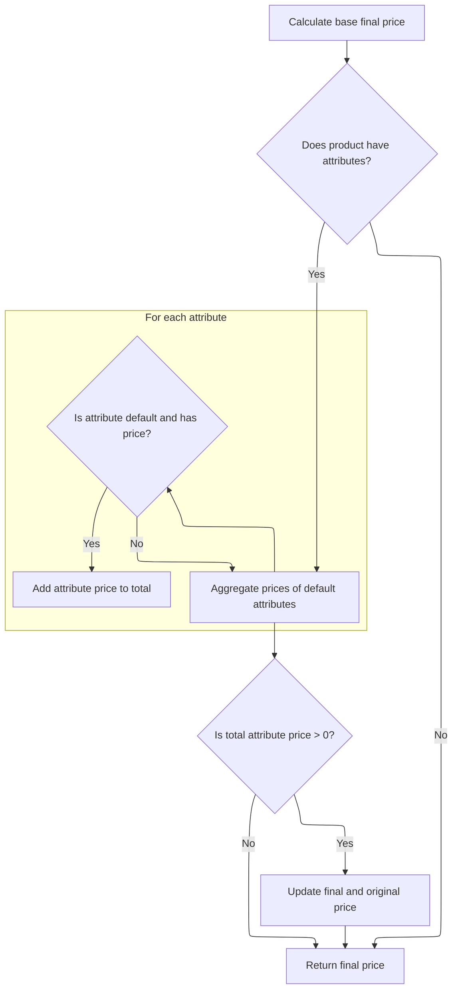
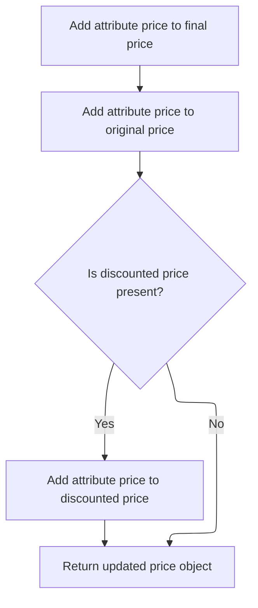

This document describes how users update item quantities in their shopping cart. The flow validates the update request, applies new quantities, recalculates prices, and returns the updated cart data.

# Updating Cart Item Quantities

This section governs the rules for updating the quantities of items in a user's shopping cart, ensuring that each update maintains cart integrity and accurate pricing.

| Category        | Rule Name                          | Description                                                                                                                                                  |
| --------------- | ---------------------------------- | ------------------------------------------------------------------------------------------------------------------------------------------------------------ |
| Data validation | Minimum cart item quantity         | Each cart item must have a quantity of at least one. If any item has a quantity less than one, the update is rejected and an error is raised.                |
| Data validation | Cart entry existence               | If an item to be updated does not exist in the cart, the update is rejected and an error is raised indicating an unknown entry.                              |
| Data validation | Non-empty cart item update request | The update operation must not proceed if the list of cart items to update is empty or null; an error is raised in such cases.                                |
| Business logic  | Cart item price recalculation      | After updating the quantity of a cart item, the item's price must be recalculated using the current product attributes and pricing rules to ensure accuracy. |

<SwmSnippet path="/shopizer/sm-shop/src/main/java/com/salesmanager/web/shop/controller/shoppingCart/facade/ShoppingCartFacadeImpl.java" line="404">

---

We validate and update each cart item's quantity, then recalculate its price using <SwmToken path="shopizer/sm-shop/src/main/java/com/salesmanager/web/shop/controller/shoppingCart/facade/ShoppingCartFacadeImpl.java" pos="37:10:10" line-data="import com.salesmanager.core.utils.ProductPriceUtils;">`ProductPriceUtils`</SwmToken> to keep pricing accurate.

```java
    public ShoppingCartData updateCartItems( final List<ShoppingCartItem> shoppingCartItems, final MerchantStore store, final Language language )
            throws Exception
        {
    	
    		Validate.notEmpty(shoppingCartItems,"shoppingCartItems null or empty");
    		ShoppingCart cartModel = null;
    		Set<com.salesmanager.core.business.shoppingcart.model.ShoppingCartItem> cartItems = new HashSet<com.salesmanager.core.business.shoppingcart.model.ShoppingCartItem>();
    		for(ShoppingCartItem item : shoppingCartItems) {
    			
    			if(item.getQuantity()<1) {
    				throw new CartModificationException( "Quantity must not be less than one" );
    			}
    			
    			if(cartModel==null) {
    				cartModel = getCartModel( item.getCode(), store );
    			}
    			
                com.salesmanager.core.business.shoppingcart.model.ShoppingCartItem entryToUpdate =
                        getEntryToUpdate( item.getId(), cartModel );

                if ( entryToUpdate == null ) {
                        throw new CartModificationException( "Unknown entry number." );
                }

                entryToUpdate.getProduct();

                LOG.info( "Updating cart entry quantity to" + item.getQuantity() );
                entryToUpdate.setQuantity( (int) item.getQuantity() );
                
                List<ProductAttribute> productAttributes = new ArrayList<ProductAttribute>();
                productAttributes.addAll( entryToUpdate.getProduct().getAttributes() );
                
                final FinalPrice finalPrice =
                        productPriceUtils.getFinalProductPrice( entryToUpdate.getProduct(), productAttributes );
                entryToUpdate.setItemPrice( finalPrice.getFinalPrice() );
                    

                cartItems.add(entryToUpdate);
    			
    			
    			
    			
    		}
    		
```

---

</SwmSnippet>

## Calculating Product Price with Attributes

```mermaid
%%{init: {"flowchart": {"defaultRenderer": "elk"}} }%%
flowchart TD
  node1["Selecting Default and Regional Prices"] --> node2{"Are there attributes with prices?"}
  
  node2 -->|"No"| node5["Return final price"]
  click node2 openCode "shopizer/sm-core/src/main/java/com/salesmanager/core/utils/ProductPriceUtils.java:93:93"
  node2 -->|"Yes"| loop1
  subgraph loop1["For each attribute with price > 0"]
    node3["Add attribute price to total attribute price"]
    click node3 openCode "shopizer/sm-core/src/main/java/com/salesmanager/core/utils/ProductPriceUtils.java:94:101"
  end
  loop1 --> node4["Calculating Product Price Without Attributes"]
  
  node4 --> node6{"Is there a discounted price?"}
  click node6 openCode "shopizer/sm-core/src/main/java/com/salesmanager/core/utils/ProductPriceUtils.java:113:113"
  node6 -->|"Yes"| node7["Add total attribute price to discounted price"]
  click node7 openCode "shopizer/sm-core/src/main/java/com/salesmanager/core/utils/ProductPriceUtils.java:114:116"
  node7 --> node5["Return final price"]
  node6 -->|"No"| node5
  click node5 openCode "shopizer/sm-core/src/main/java/com/salesmanager/core/utils/ProductPriceUtils.java:122:124"

classDef HeadingStyle fill:#777777,stroke:#333,stroke-width:2px;
click node1 goToHeading "Selecting Default and Regional Prices"
node1:::HeadingStyle
click node4 goToHeading "Calculating Product Price Without Attributes"
node4:::HeadingStyle

%% Swimm:
%% %%{init: {"flowchart": {"defaultRenderer": "elk"}} }%%
%% flowchart TD
%%   node1["Selecting Default and Regional Prices"] --> node2{"Are there attributes with prices?"}
%%   
%%   node2 -->|"No"| node5["Return final price"]
%%   click node2 openCode "<SwmPath>[shopizer/…/utils/ProductPriceUtils.java](shopizer/sm-core/src/main/java/com/salesmanager/core/utils/ProductPriceUtils.java)</SwmPath>:93:93"
%%   node2 -->|"Yes"| loop1
%%   subgraph loop1["For each attribute with price > 0"]
%%     node3["Add attribute price to total attribute price"]
%%     click node3 openCode "<SwmPath>[shopizer/…/utils/ProductPriceUtils.java](shopizer/sm-core/src/main/java/com/salesmanager/core/utils/ProductPriceUtils.java)</SwmPath>:94:101"
%%   end
%%   loop1 --> node4["Calculating Product Price Without Attributes"]
%%   
%%   node4 --> node6{"Is there a discounted price?"}
%%   click node6 openCode "<SwmPath>[shopizer/…/utils/ProductPriceUtils.java](shopizer/sm-core/src/main/java/com/salesmanager/core/utils/ProductPriceUtils.java)</SwmPath>:113:113"
%%   node6 -->|"Yes"| node7["Add total attribute price to discounted price"]
%%   click node7 openCode "<SwmPath>[shopizer/…/utils/ProductPriceUtils.java](shopizer/sm-core/src/main/java/com/salesmanager/core/utils/ProductPriceUtils.java)</SwmPath>:114:116"
%%   node7 --> node5["Return final price"]
%%   node6 -->|"No"| node5
%%   click node5 openCode "<SwmPath>[shopizer/…/utils/ProductPriceUtils.java](shopizer/sm-core/src/main/java/com/salesmanager/core/utils/ProductPriceUtils.java)</SwmPath>:122:124"
%% 
%% classDef HeadingStyle fill:#777777,stroke:#333,stroke-width:2px;
%% click node1 goToHeading "Selecting Default and Regional Prices"
%% node1:::HeadingStyle
%% click node4 goToHeading "Calculating Product Price Without Attributes"
%% node4:::HeadingStyle
```



This section governs how the final price of a product is calculated, including adjustments for product attributes and discounts. It ensures that all relevant price components are considered to provide an accurate total price to the customer.

| Category       | Rule Name                     | Description                                                                                                                                       |
| -------------- | ----------------------------- | ------------------------------------------------------------------------------------------------------------------------------------------------- |
| Business logic | Base price initialization     | The base price for a product must be determined before any attribute price adjustments are applied.                                               |
| Business logic | Attribute price aggregation   | If any product attribute has a price greater than zero, its price must be added to the total attribute price.                                     |
| Business logic | Discounted price adjustment   | If a discounted price is available for the product, the total attribute price must be added to the discounted price to determine the final price. |
| Business logic | Standard price calculation    | If no discounted price is available, the final price is the sum of the base price and the total attribute price.                                  |
| Business logic | No attribute price adjustment | If no attributes with a price greater than zero are present, the final price is determined solely by the base price or discounted price.          |

<SwmSnippet path="/shopizer/sm-core/src/main/java/com/salesmanager/core/utils/ProductPriceUtils.java" line="86">

---

In <SwmToken path="shopizer/sm-core/src/main/java/com/salesmanager/core/utils/ProductPriceUtils.java" pos="86:5:5" line-data="	public FinalPrice getFinalProductPrice(Product product, List&lt;ProductAttribute&gt; attributes) {">`getFinalProductPrice`</SwmToken>, we start by calculating the base price for the product. This sets up the initial price before we factor in any attribute-based adjustments, which come next.

```java
	public FinalPrice getFinalProductPrice(Product product, List<ProductAttribute> attributes) {


		FinalPrice finalPrice = calculateFinalPrice(product);
		
```

---

</SwmSnippet>

### Selecting Default and Regional Prices

```mermaid
%%{init: {"flowchart": {"defaultRenderer": "elk"}} }%%
flowchart TD
    node1["Start: Get product availabilities"]
    click node1 openCode "shopizer/sm-core/src/main/java/com/salesmanager/core/utils/ProductPriceUtils.java:506:507"
    
    subgraph loop1["For each availability"]
        node1 --> node2{"Is region ALL_REGIONS?"}
        click node2 openCode "shopizer/sm-core/src/main/java/com/salesmanager/core/utils/ProductPriceUtils.java:508:523"
        node2 -->|"Yes"| node3["For each price in availability"]
        node2 -->|"No"| node1
        
        subgraph loop2["For each price"]
            node3 --> node4{"Is price default?"}
            click node4 openCode "shopizer/sm-core/src/main/java/com/salesmanager/core/utils/ProductPriceUtils.java:510:520"
            node4 -->|"Yes"| node5["Set as final price"]
            click node5 openCode "shopizer/sm-core/src/main/java/com/salesmanager/core/utils/ProductPriceUtils.java:514:515"
            node4 -->|"No"| node6["Add to additional prices"]
            click node6 openCode "shopizer/sm-core/src/main/java/com/salesmanager/core/utils/ProductPriceUtils.java:516:520"
            node5 --> node3
            node6 --> node3
        end
    end
    node3 --> node7{"Is final price set?"}
    click node7 openCode "shopizer/sm-core/src/main/java/com/salesmanager/core/utils/ProductPriceUtils.java:526:532"
    node7 -->|"Yes"| node8["Attach additional prices to final price"]
    click node8 openCode "shopizer/sm-core/src/main/java/com/salesmanager/core/utils/ProductPriceUtils.java:527:528"
    node7 -->|"No"| node9{"Are there additional prices?"}
    click node9 openCode "shopizer/sm-core/src/main/java/com/salesmanager/core/utils/ProductPriceUtils.java:529:531"
    node9 -->|"Yes"| node10["Set first additional price as final price"]
    click node10 openCode "shopizer/sm-core/src/main/java/com/salesmanager/core/utils/ProductPriceUtils.java:530:531"
    node9 -->|"No"| node11["Return null"]
    click node11 openCode "shopizer/sm-core/src/main/java/com/salesmanager/core/utils/ProductPriceUtils.java:534:534"
    node8 --> node12["Return final price"]
    click node12 openCode "shopizer/sm-core/src/main/java/com/salesmanager/core/utils/ProductPriceUtils.java:534:534"
    node10 --> node12
    node11 --> node12

classDef HeadingStyle fill:#777777,stroke:#333,stroke-width:2px;

%% Swimm:
%% %%{init: {"flowchart": {"defaultRenderer": "elk"}} }%%
%% flowchart TD
%%     node1["Start: Get product availabilities"]
%%     click node1 openCode "<SwmPath>[shopizer/…/utils/ProductPriceUtils.java](shopizer/sm-core/src/main/java/com/salesmanager/core/utils/ProductPriceUtils.java)</SwmPath>:506:507"
%%     
%%     subgraph loop1["For each availability"]
%%         node1 --> node2{"Is region <SwmToken path="shopizer/sm-core/src/main/java/com/salesmanager/core/utils/ProductPriceUtils.java" pos="508:13:13" line-data="			if(availability.getRegion().equals(Constants.ALL_REGIONS)) {//TODO REL 2.1 accept a region">`ALL_REGIONS`</SwmToken>?"}
%%         click node2 openCode "<SwmPath>[shopizer/…/utils/ProductPriceUtils.java](shopizer/sm-core/src/main/java/com/salesmanager/core/utils/ProductPriceUtils.java)</SwmPath>:508:523"
%%         node2 -->|"Yes"| node3["For each price in availability"]
%%         node2 -->|"No"| node1
%%         
%%         subgraph loop2["For each price"]
%%             node3 --> node4{"Is price default?"}
%%             click node4 openCode "<SwmPath>[shopizer/…/utils/ProductPriceUtils.java](shopizer/sm-core/src/main/java/com/salesmanager/core/utils/ProductPriceUtils.java)</SwmPath>:510:520"
%%             node4 -->|"Yes"| node5["Set as final price"]
%%             click node5 openCode "<SwmPath>[shopizer/…/utils/ProductPriceUtils.java](shopizer/sm-core/src/main/java/com/salesmanager/core/utils/ProductPriceUtils.java)</SwmPath>:514:515"
%%             node4 -->|"No"| node6["Add to additional prices"]
%%             click node6 openCode "<SwmPath>[shopizer/…/utils/ProductPriceUtils.java](shopizer/sm-core/src/main/java/com/salesmanager/core/utils/ProductPriceUtils.java)</SwmPath>:516:520"
%%             node5 --> node3
%%             node6 --> node3
%%         end
%%     end
%%     node3 --> node7{"Is final price set?"}
%%     click node7 openCode "<SwmPath>[shopizer/…/utils/ProductPriceUtils.java](shopizer/sm-core/src/main/java/com/salesmanager/core/utils/ProductPriceUtils.java)</SwmPath>:526:532"
%%     node7 -->|"Yes"| node8["Attach additional prices to final price"]
%%     click node8 openCode "<SwmPath>[shopizer/…/utils/ProductPriceUtils.java](shopizer/sm-core/src/main/java/com/salesmanager/core/utils/ProductPriceUtils.java)</SwmPath>:527:528"
%%     node7 -->|"No"| node9{"Are there additional prices?"}
%%     click node9 openCode "<SwmPath>[shopizer/…/utils/ProductPriceUtils.java](shopizer/sm-core/src/main/java/com/salesmanager/core/utils/ProductPriceUtils.java)</SwmPath>:529:531"
%%     node9 -->|"Yes"| node10["Set first additional price as final price"]
%%     click node10 openCode "<SwmPath>[shopizer/…/utils/ProductPriceUtils.java](shopizer/sm-core/src/main/java/com/salesmanager/core/utils/ProductPriceUtils.java)</SwmPath>:530:531"
%%     node9 -->|"No"| node11["Return null"]
%%     click node11 openCode "<SwmPath>[shopizer/…/utils/ProductPriceUtils.java](shopizer/sm-core/src/main/java/com/salesmanager/core/utils/ProductPriceUtils.java)</SwmPath>:534:534"
%%     node8 --> node12["Return final price"]
%%     click node12 openCode "<SwmPath>[shopizer/…/utils/ProductPriceUtils.java](shopizer/sm-core/src/main/java/com/salesmanager/core/utils/ProductPriceUtils.java)</SwmPath>:534:534"
%%     node10 --> node12
%%     node11 --> node12
%% 
%% classDef HeadingStyle fill:#777777,stroke:#333,stroke-width:2px;
```



This section determines the main and alternate prices for a product, focusing on prices available for all regions. It ensures that the default price is prioritized, and alternate prices are provided for reference or selection.

| Category       | Rule Name                    | Description                                                                                                                                                                                                                                                                                                                                                         |
| -------------- | ---------------------------- | ------------------------------------------------------------------------------------------------------------------------------------------------------------------------------------------------------------------------------------------------------------------------------------------------------------------------------------------------------------------- |
| Business logic | Region Filtering             | Only prices from product availabilities marked for <SwmToken path="shopizer/sm-core/src/main/java/com/salesmanager/core/utils/ProductPriceUtils.java" pos="508:13:13" line-data="			if(availability.getRegion().equals(Constants.ALL_REGIONS)) {//TODO REL 2.1 accept a region">`ALL_REGIONS`</SwmToken> are considered when selecting the main and additional prices. |
| Business logic | Default Price Priority       | If a default price exists among <SwmToken path="shopizer/sm-core/src/main/java/com/salesmanager/core/utils/ProductPriceUtils.java" pos="508:13:13" line-data="			if(availability.getRegion().equals(Constants.ALL_REGIONS)) {//TODO REL 2.1 accept a region">`ALL_REGIONS`</SwmToken> prices, it is set as the main price for the product.                             |
| Business logic | Additional Prices Attachment | Any non-default prices for <SwmToken path="shopizer/sm-core/src/main/java/com/salesmanager/core/utils/ProductPriceUtils.java" pos="508:13:13" line-data="			if(availability.getRegion().equals(Constants.ALL_REGIONS)) {//TODO REL 2.1 accept a region">`ALL_REGIONS`</SwmToken> are collected and attached as additional prices to the main price.                    |

<SwmSnippet path="/shopizer/sm-core/src/main/java/com/salesmanager/core/utils/ProductPriceUtils.java" line="500">

---

In <SwmToken path="shopizer/sm-core/src/main/java/com/salesmanager/core/utils/ProductPriceUtils.java" pos="500:5:5" line-data="	private FinalPrice calculateFinalPrice(Product product) {">`calculateFinalPrice`</SwmToken>, we filter product availabilities to those marked for <SwmToken path="shopizer/sm-core/src/main/java/com/salesmanager/core/utils/ProductPriceUtils.java" pos="508:13:13" line-data="			if(availability.getRegion().equals(Constants.ALL_REGIONS)) {//TODO REL 2.1 accept a region">`ALL_REGIONS`</SwmToken>, then pick out the default price and collect any other prices. The default price becomes the main price, and others are attached for reference or alternate options.

```java
	private FinalPrice calculateFinalPrice(Product product) {

		FinalPrice finalPrice = null;;
		List<FinalPrice> otherPrices = null;
		

		Set<ProductAvailability> availabilities = product.getAvailabilities();
		for(ProductAvailability availability : availabilities) {
			if(availability.getRegion().equals(Constants.ALL_REGIONS)) {//TODO REL 2.1 accept a region
				Set<ProductPrice> prices = availability.getPrices();
				for(ProductPrice price : prices) {
					
					FinalPrice p = finalPrice(price);
					if(price.isDefaultPrice()) {
						finalPrice = p;
					} else {
						if(otherPrices==null) {
							otherPrices = new ArrayList<FinalPrice>();
						}
						otherPrices.add(p);
					}
				}
			}
		}
```

---

</SwmSnippet>

<SwmSnippet path="/shopizer/sm-core/src/main/java/com/salesmanager/core/utils/ProductPriceUtils.java" line="526">

---

After filtering and selecting, we return a <SwmToken path="shopizer/sm-shop/src/main/java/com/salesmanager/web/shop/controller/shoppingCart/facade/ShoppingCartFacadeImpl.java" pos="436:3:3" line-data="                final FinalPrice finalPrice =">`FinalPrice`</SwmToken> object with the default price as main, and any other prices for <SwmToken path="shopizer/sm-core/src/main/java/com/salesmanager/core/utils/ProductPriceUtils.java" pos="508:13:13" line-data="			if(availability.getRegion().equals(Constants.ALL_REGIONS)) {//TODO REL 2.1 accept a region">`ALL_REGIONS`</SwmToken> attached as additionalPrices. If no default, we fallback to the first other price.

```java
		if(finalPrice!=null) {
			finalPrice.setAdditionalPrices(otherPrices);
		} else {
			if(otherPrices!=null) {
				finalPrice = otherPrices.get(0);
			}
		}
		
		return finalPrice;
		
		
	}
```

---

</SwmSnippet>

### Adding Attribute Prices to Product Price

```mermaid
%%{init: {"flowchart": {"defaultRenderer": "elk"}} }%%
flowchart TD
  node1{"Are there product attributes?"}
  click node1 openCode "shopizer/sm-core/src/main/java/com/salesmanager/core/utils/ProductPriceUtils.java:93:94"
  node1 -->|"Yes"| loop1
  node1 -->|"No"| node5["Return base price"]
  click node5 openCode "shopizer/sm-core/src/main/java/com/salesmanager/core/utils/ProductPriceUtils.java:91:92"

  subgraph loop1["For each attribute"]
    node2{"Is attribute price > 0?"}
    click node2 openCode "shopizer/sm-core/src/main/java/com/salesmanager/core/utils/ProductPriceUtils.java:95:100"
    node2 -->|"Yes"| node3["Add attribute price to total"]
    click node3 openCode "shopizer/sm-core/src/main/java/com/salesmanager/core/utils/ProductPriceUtils.java:99:99"
    node2 -->|"No"| node2
  end
  loop1 --> node7{"Is total attribute price > 0?"}
  click node7 openCode "shopizer/sm-core/src/main/java/com/salesmanager/core/utils/ProductPriceUtils.java:103:103"
  node7 -->|"Yes"| node8["Add total attribute price to final price"]
  click node8 openCode "shopizer/sm-core/src/main/java/com/salesmanager/core/utils/ProductPriceUtils.java:104:104"
  node7 -->|"No"| node5
  node8 --> node5
classDef HeadingStyle fill:#777777,stroke:#333,stroke-width:2px;

%% Swimm:
%% %%{init: {"flowchart": {"defaultRenderer": "elk"}} }%%
%% flowchart TD
%%   node1{"Are there product attributes?"}
%%   click node1 openCode "<SwmPath>[shopizer/…/utils/ProductPriceUtils.java](shopizer/sm-core/src/main/java/com/salesmanager/core/utils/ProductPriceUtils.java)</SwmPath>:93:94"
%%   node1 -->|"Yes"| loop1
%%   node1 -->|"No"| node5["Return base price"]
%%   click node5 openCode "<SwmPath>[shopizer/…/utils/ProductPriceUtils.java](shopizer/sm-core/src/main/java/com/salesmanager/core/utils/ProductPriceUtils.java)</SwmPath>:91:92"
%% 
%%   subgraph loop1["For each attribute"]
%%     node2{"Is attribute price > 0?"}
%%     click node2 openCode "<SwmPath>[shopizer/…/utils/ProductPriceUtils.java](shopizer/sm-core/src/main/java/com/salesmanager/core/utils/ProductPriceUtils.java)</SwmPath>:95:100"
%%     node2 -->|"Yes"| node3["Add attribute price to total"]
%%     click node3 openCode "<SwmPath>[shopizer/…/utils/ProductPriceUtils.java](shopizer/sm-core/src/main/java/com/salesmanager/core/utils/ProductPriceUtils.java)</SwmPath>:99:99"
%%     node2 -->|"No"| node2
%%   end
%%   loop1 --> node7{"Is total attribute price > 0?"}
%%   click node7 openCode "<SwmPath>[shopizer/…/utils/ProductPriceUtils.java](shopizer/sm-core/src/main/java/com/salesmanager/core/utils/ProductPriceUtils.java)</SwmPath>:103:103"
%%   node7 -->|"Yes"| node8["Add total attribute price to final price"]
%%   click node8 openCode "<SwmPath>[shopizer/…/utils/ProductPriceUtils.java](shopizer/sm-core/src/main/java/com/salesmanager/core/utils/ProductPriceUtils.java)</SwmPath>:104:104"
%%   node7 -->|"No"| node5
%%   node8 --> node5
%% classDef HeadingStyle fill:#777777,stroke:#333,stroke-width:2px;
```



<SwmSnippet path="/shopizer/sm-core/src/main/java/com/salesmanager/core/utils/ProductPriceUtils.java" line="91">

---

We just got the base price from <SwmToken path="shopizer/sm-core/src/main/java/com/salesmanager/core/utils/ProductPriceUtils.java" pos="89:7:7" line-data="		FinalPrice finalPrice = calculateFinalPrice(product);">`calculateFinalPrice`</SwmToken>, and now we loop through product attributes, adding up any positive attribute prices to adjust the final price.

```java
		//attributes
		BigDecimal attributePrice = null;
		if(attributes!=null && attributes.size()>0) {
			for(ProductAttribute attribute : attributes) {
					if(attribute.getProductAttributePrice()!=null && attribute.getProductAttributePrice().doubleValue()>0) {
						if(attributePrice==null) {
							attributePrice = new BigDecimal(0);
						}
						attributePrice = attributePrice.add(attribute.getProductAttributePrice());
					}
			}
```

---

</SwmSnippet>

<SwmSnippet path="/shopizer/sm-core/src/main/java/com/salesmanager/core/utils/ProductPriceUtils.java" line="103">

---

We bump the price only if attributes actually add cost.

```java
			if(attributePrice!=null && attributePrice.doubleValue()>0) {
				BigDecimal fp = finalPrice.getFinalPrice();
```

---

</SwmSnippet>

### Calculating Product Price Without Attributes



This section determines the final price of a product by starting with its base price and adding the prices of any default attributes that are set for the product. The calculation ensures that only positive-priced default attributes are included in the final price, and updates both the final and original price fields accordingly.

| Category        | Rule Name                                    | Description                                                                                                          |
| --------------- | -------------------------------------------- | -------------------------------------------------------------------------------------------------------------------- |
| Data validation | Default attribute price inclusion            | Only default attributes with a positive price must be considered for price adjustment.                               |
| Business logic  | Base price as starting point                 | The base price of the product must be used as the starting point for all price calculations.                         |
| Business logic  | No attributes, no adjustment                 | If the product has no attributes, the final price must be equal to the base price.                                   |
| Business logic  | Attribute price aggregation                  | The sum of all positive-priced default attributes must be added to both the final and original price of the product. |
| Business logic  | No positive default attribute, no adjustment | If no default attributes with a positive price exist, the final price must remain unchanged from the base price.     |

<SwmSnippet path="/shopizer/sm-core/src/main/java/com/salesmanager/core/utils/ProductPriceUtils.java" line="136">

---

In <SwmToken path="shopizer/sm-core/src/main/java/com/salesmanager/core/utils/ProductPriceUtils.java" pos="136:5:5" line-data="	public FinalPrice getFinalPrice(Product product) {">`getFinalPrice`</SwmToken>, we recalculate the base price, then look for default attributes to add their prices to the final amount.

```java
	public FinalPrice getFinalPrice(Product product) {


		FinalPrice finalPrice = calculateFinalPrice(product);
		
```

---

</SwmSnippet>

<SwmSnippet path="/shopizer/sm-core/src/main/java/com/salesmanager/core/utils/ProductPriceUtils.java" line="142">

---

After getting the base price from <SwmToken path="shopizer/sm-core/src/main/java/com/salesmanager/core/utils/ProductPriceUtils.java" pos="89:7:7" line-data="		FinalPrice finalPrice = calculateFinalPrice(product);">`calculateFinalPrice`</SwmToken>, we loop through default attributes and add their prices to the final price if they're positive.

```java
		//attributes
		BigDecimal attributePrice = null;
		if(product.getAttributes()!=null && product.getAttributes().size()>0) {
			for(ProductAttribute attribute : product.getAttributes()) {
					if(attribute.getAttributeDefault()) {
						if(attribute.getProductAttributePrice()!=null && attribute.getProductAttributePrice().doubleValue()>0) {
							if(attributePrice==null) {
								attributePrice = new BigDecimal(0);
							}
							attributePrice = attributePrice.add(attribute.getProductAttributePrice());
						}
					}
			}
```

---

</SwmSnippet>

<SwmSnippet path="/shopizer/sm-core/src/main/java/com/salesmanager/core/utils/ProductPriceUtils.java" line="156">

---

After adjusting for attribute prices, we update the final, original, and discounted prices before returning the <SwmToken path="shopizer/sm-shop/src/main/java/com/salesmanager/web/shop/controller/shoppingCart/facade/ShoppingCartFacadeImpl.java" pos="436:3:3" line-data="                final FinalPrice finalPrice =">`FinalPrice`</SwmToken> object.

```java
			if(attributePrice!=null && attributePrice.doubleValue()>0) {
				BigDecimal fp = finalPrice.getFinalPrice();
				fp = fp.add(attributePrice);
				finalPrice.setFinalPrice(fp);
				
				BigDecimal op = finalPrice.getOriginalPrice();
				op = op.add(attributePrice);
				finalPrice.setOriginalPrice(op);
			}
		}

		return finalPrice;

	}
```

---

</SwmSnippet>

### Finalizing Price with Attribute Adjustments



<SwmSnippet path="/shopizer/sm-core/src/main/java/com/salesmanager/core/utils/ProductPriceUtils.java" line="105">

---

After returning from <SwmToken path="shopizer/sm-shop/src/main/java/com/salesmanager/web/shop/controller/shoppingCart/facade/ShoppingCartFacadeImpl.java" pos="438:8:8" line-data="                entryToUpdate.setItemPrice( finalPrice.getFinalPrice() );">`getFinalPrice`</SwmToken>, we bump all price fields by attribute costs, so the user sees the correct price everywhere.

```java
				fp = fp.add(attributePrice);
				finalPrice.setFinalPrice(fp);
				
				BigDecimal op = finalPrice.getOriginalPrice();
				op = op.add(attributePrice);
				finalPrice.setOriginalPrice(op);
				
				BigDecimal dp = finalPrice.getDiscountedPrice();
				if(dp!=null) {
					dp = dp.add(attributePrice);
					finalPrice.setDiscountedPrice(dp);
				}
				
			}
		}
		

		return finalPrice;

	}
```

---

</SwmSnippet>

## Saving Updated Cart and Returning Data

<SwmSnippet path="/shopizer/sm-shop/src/main/java/com/salesmanager/web/shop/controller/shoppingCart/facade/ShoppingCartFacadeImpl.java" line="448">

---

After returning from <SwmToken path="shopizer/sm-shop/src/main/java/com/salesmanager/web/shop/controller/shoppingCart/facade/ShoppingCartFacadeImpl.java" pos="37:10:10" line-data="import com.salesmanager.core.utils.ProductPriceUtils;">`ProductPriceUtils`</SwmToken>, we save the updated cart and use <SwmToken path="shopizer/sm-shop/src/main/java/com/salesmanager/web/shop/controller/shoppingCart/facade/ShoppingCartFacadeImpl.java" pos="451:1:1" line-data="            ShoppingCartDataPopulator shoppingCartDataPopulator = new ShoppingCartDataPopulator();">`ShoppingCartDataPopulator`</SwmToken> to build the response data, so the client gets the latest prices and quantities.

```java
    		cartModel.setLineItems(cartItems);
    		shoppingCartService.saveOrUpdate( cartModel );
            LOG.info( "Cart entry updated with desired quantity" );
            ShoppingCartDataPopulator shoppingCartDataPopulator = new ShoppingCartDataPopulator();
            shoppingCartDataPopulator.setShoppingCartCalculationService( shoppingCartCalculationService );
            shoppingCartDataPopulator.setPricingService( pricingService );
            return shoppingCartDataPopulator.populate( cartModel, store, language );

        }
```

---

</SwmSnippet>

&nbsp;

*This is an auto-generated document by Swimm 🌊 and has not yet been verified by a human*

<SwmMeta version="3.0.0" repo-id="Z2l0aHViJTNBJTNBU2hvcGl6ZXIlM0ElM0F1bWFsaW5nYXN3YW1p" repo-name="Shopizer"><sup>Powered by [Swimm](https://app.swimm.io/)</sup></SwmMeta>
