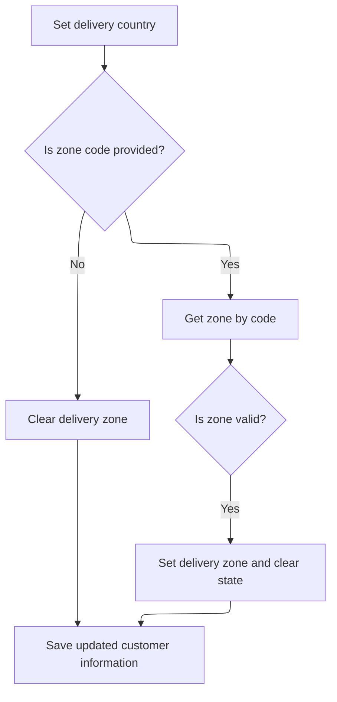

This document describes how customer address updates are validated and applied to either billing or shipping addresses, with the shopping cart synchronized to reflect these changes. The process ensures that country and zone information is correct and that the customer's profile and cart remain consistent.

# Updating Customer Address and Validating Country/Zone

This section ensures that customer address updates are accurate and consistent by validating country and zone information, updating the correct address type (billing or shipping), and synchronizing the shopping cart with the updated address.

| Category        | Rule Name                                 | Description                                                                                                                                                                     |
| --------------- | ----------------------------------------- | ------------------------------------------------------------------------------------------------------------------------------------------------------------------------------- |
| Data validation | Customer existence validation             | If the customer ID does not correspond to an existing customer, the update process must be stopped and an error indicating 'customer not found' must be raised.                 |
| Data validation | Country validation                        | The country code provided in the address must match a valid country in the system for the specified language; otherwise, the update must not proceed.                           |
| Data validation | Zone validation                           | If a zone code is provided in the address, it must correspond to a valid zone for the selected country; otherwise, an error must be raised indicating an unsupported zone code. |
| Business logic  | Address type update                       | The address update must be applied to the correct address type (billing or shipping) based on the address details provided.                                                     |
| Business logic  | Cart synchronization after address update | After a successful address update, the shopping cart must be synchronized to reflect the updated address information.                                                           |
| Business logic  | Clear zone when not provided              | If the zone code is not provided, the zone field in the address must be cleared to avoid storing outdated or incorrect zone information.                                        |

<SwmSnippet path="/shopizer/sm-shop/src/main/java/com/salesmanager/web/shop/controller/customer/facade/CustomerFacadeImpl.java" line="466">

---

We check if the address is billing or shipping, use the right populator, and validate <SwmPath>[shopizer/…/reference/zone/](shopizer/sm-core-model/src/main/java/com/salesmanager/core/business/reference/zone/)</SwmPath>. Next, we call <SwmToken path="shopizer/sm-shop/src/main/java/com/salesmanager/web/populator/shoppingCart/ShoppingCartModelPopulator.java" pos="37:4:4" line-data="public class ShoppingCartModelPopulator">`ShoppingCartModelPopulator`</SwmToken> to keep the cart in sync with the updated address.

```java
    public void updateAddress( Long userId, MerchantStore merchantStore, Address address, final Language language )
        throws Exception
    {
       
     Customer customerModel=customerService.getById( userId );
       Map<String, Country> countriesMap = countryService.getCountriesMap( language );
       Country country = countriesMap.get( address.getCountry() );
      
      if(customerModel ==null){
           LOG.error( "Customer with ID {} does not exists..", userId);
           throw new CustomerNotFoundException( "customer with given id does not exists" );
           
       }
       if(address.isBillingAddress()){
           LOG.info( "updating customer billing address..");
           PersistableCustomerBillingAddressPopulator billingAddressPopulator=new PersistableCustomerBillingAddressPopulator();
           customerModel= billingAddressPopulator.populate( address, customerModel, merchantStore, merchantStore.getDefaultLanguage() );
           customerModel.getBilling().setCountry( country );
           if(StringUtils.isNotBlank( address.getZone() )){
               Zone zone = zoneService.getByCode(address.getZone());
               if(zone==null) {
                  throw new ConversionException("Unsuported zone code " + address.getZone());
               }
                   customerModel.getBilling().setZone( zone );
                   customerModel.getBilling().setState(null);
               
           } else {
        	   customerModel.getBilling().setZone(null);
           }
          
       }
       else{
           LOG.info( "updating customer shipping address..");
           PersistableCustomerShippingAddressPopulator shippingAddressPopulator=new PersistableCustomerShippingAddressPopulator();
           customerModel= shippingAddressPopulator.populate( address, customerModel, merchantStore, merchantStore.getDefaultLanguage() );
```

---

</SwmSnippet>

## Populating and Syncing Shopping Cart Model

```mermaid
%%{init: {"flowchart": {"defaultRenderer": "elk"}} }%%
flowchart TD
    node1["Start cart population"] --> node2{"Is cart id > 0 and code present?"}
    click node1 openCode "shopizer/sm-shop/src/main/java/com/salesmanager/web/populator/shoppingCart/ShoppingCartModelPopulator.java:85:86"
    node2 -->|"Yes"| node3["Retrieve cart from database"]
    click node2 openCode "shopizer/sm-shop/src/main/java/com/salesmanager/web/populator/shoppingCart/ShoppingCartModelPopulator.java:91:92"
    node2 -->|"No"| node4["Create new cart"]
    click node3 openCode "shopizer/sm-shop/src/main/java/com/salesmanager/web/populator/shoppingCart/ShoppingCartModelPopulator.java:93:94"
    node3 --> node5{"Is cart found in database?"}
    click node5 openCode "shopizer/sm-shop/src/main/java/com/salesmanager/web/populator/shoppingCart/ShoppingCartModelPopulator.java:94:95"
    node5 -->|"Yes"| node6["Use existing cart"]
    node5 -->|"No"| node4
    click node4 openCode "shopizer/sm-shop/src/main/java/com/salesmanager/web/populator/shoppingCart/ShoppingCartModelPopulator.java:95:103"
    node4 --> node7{"Is there a customer?"}
    click node7 openCode "shopizer/sm-shop/src/main/java/com/salesmanager/web/populator/shoppingCart/ShoppingCartModelPopulator.java:98:99"
    node7 -->|"Yes"| node8["Link cart to customer"]
    node7 -->|"No"| node9["Save cart"]
    click node8 openCode "shopizer/sm-shop/src/main/java/com/salesmanager/web/populator/shoppingCart/ShoppingCartModelPopulator.java:100:101"
    node8 --> node9
    click node9 openCode "shopizer/sm-shop/src/main/java/com/salesmanager/web/populator/shoppingCart/ShoppingCartModelPopulator.java:102:103"
    node6 --> node10["Save cart"]
    click node10 openCode "shopizer/sm-shop/src/main/java/com/salesmanager/web/populator/shoppingCart/ShoppingCartModelPopulator.java:102:103"
    node9 --> node11{"Are there items in the cart?"}
    node10 --> node11
    click node11 openCode "shopizer/sm-shop/src/main/java/com/salesmanager/web/populator/shoppingCart/ShoppingCartModelPopulator.java:116:120"
    node11 -->|"Yes"| node12["Process cart items"]
    node11 -->|"No"| node13["Finish"]
    click node13 openCode "shopizer/sm-shop/src/main/java/com/salesmanager/web/populator/shoppingCart/ShoppingCartModelPopulator.java:187:188"
    
    subgraph loop1["For each item in cart"]
        node12 --> node14{"Does item exist in cart model?"}
        click node14 openCode "shopizer/sm-shop/src/main/java/com/salesmanager/web/populator/shoppingCart/ShoppingCartModelPopulator.java:125:126"
        node14 -->|"Existing item"| node15["Update quantity"]
        node14 -->|"New item"| node16["Create new item"]
        click node15 openCode "shopizer/sm-shop/src/main/java/com/salesmanager/web/populator/shoppingCart/ShoppingCartModelPopulator.java:132:132"
        node15 --> node19{"Does item have attributes?"}
        click node19 openCode "shopizer/sm-shop/src/main/java/com/salesmanager/web/populator/shoppingCart/ShoppingCartModelPopulator.java:139:140"
        node19 -->|"Has attributes"| node20["Update attributes"]
        node19 -->|"No attributes"| node21["Remove all attributes"]
        click node20 openCode "shopizer/sm-shop/src/main/java/com/salesmanager/web/populator/shoppingCart/ShoppingCartModelPopulator.java:141:152"
        click node21 openCode "shopizer/sm-shop/src/main/java/com/salesmanager/web/populator/shoppingCart/ShoppingCartModelPopulator.java:156:157"
        node20 --> node17["Add item to cart"]
        node21 --> node17
        click node16 openCode "shopizer/sm-shop/src/main/java/com/salesmanager/web/populator/shoppingCart/ShoppingCartModelPopulator.java:163:165"
        node16 --> node17
        click node17 openCode "shopizer/sm-shop/src/main/java/com/salesmanager/web/populator/shoppingCart/ShoppingCartModelPopulator.java:166:174"
        node17 --> node18["Save updated cart"]
        click node18 openCode "shopizer/sm-shop/src/main/java/com/salesmanager/web/populator/shoppingCart/ShoppingCartModelPopulator.java:174:174"
        node18 --> node12
    end
    node12 --> node13
classDef HeadingStyle fill:#777777,stroke:#333,stroke-width:2px;

%% Swimm:
%% %%{init: {"flowchart": {"defaultRenderer": "elk"}} }%%
%% flowchart TD
%%     node1["Start cart population"] --> node2{"Is cart id > 0 and code present?"}
%%     click node1 openCode "<SwmPath>[shopizer/…/shoppingCart/ShoppingCartModelPopulator.java](shopizer/sm-shop/src/main/java/com/salesmanager/web/populator/shoppingCart/ShoppingCartModelPopulator.java)</SwmPath>:85:86"
%%     node2 -->|"Yes"| node3["Retrieve cart from database"]
%%     click node2 openCode "<SwmPath>[shopizer/…/shoppingCart/ShoppingCartModelPopulator.java](shopizer/sm-shop/src/main/java/com/salesmanager/web/populator/shoppingCart/ShoppingCartModelPopulator.java)</SwmPath>:91:92"
%%     node2 -->|"No"| node4["Create new cart"]
%%     click node3 openCode "<SwmPath>[shopizer/…/shoppingCart/ShoppingCartModelPopulator.java](shopizer/sm-shop/src/main/java/com/salesmanager/web/populator/shoppingCart/ShoppingCartModelPopulator.java)</SwmPath>:93:94"
%%     node3 --> node5{"Is cart found in database?"}
%%     click node5 openCode "<SwmPath>[shopizer/…/shoppingCart/ShoppingCartModelPopulator.java](shopizer/sm-shop/src/main/java/com/salesmanager/web/populator/shoppingCart/ShoppingCartModelPopulator.java)</SwmPath>:94:95"
%%     node5 -->|"Yes"| node6["Use existing cart"]
%%     node5 -->|"No"| node4
%%     click node4 openCode "<SwmPath>[shopizer/…/shoppingCart/ShoppingCartModelPopulator.java](shopizer/sm-shop/src/main/java/com/salesmanager/web/populator/shoppingCart/ShoppingCartModelPopulator.java)</SwmPath>:95:103"
%%     node4 --> node7{"Is there a customer?"}
%%     click node7 openCode "<SwmPath>[shopizer/…/shoppingCart/ShoppingCartModelPopulator.java](shopizer/sm-shop/src/main/java/com/salesmanager/web/populator/shoppingCart/ShoppingCartModelPopulator.java)</SwmPath>:98:99"
%%     node7 -->|"Yes"| node8["Link cart to customer"]
%%     node7 -->|"No"| node9["Save cart"]
%%     click node8 openCode "<SwmPath>[shopizer/…/shoppingCart/ShoppingCartModelPopulator.java](shopizer/sm-shop/src/main/java/com/salesmanager/web/populator/shoppingCart/ShoppingCartModelPopulator.java)</SwmPath>:100:101"
%%     node8 --> node9
%%     click node9 openCode "<SwmPath>[shopizer/…/shoppingCart/ShoppingCartModelPopulator.java](shopizer/sm-shop/src/main/java/com/salesmanager/web/populator/shoppingCart/ShoppingCartModelPopulator.java)</SwmPath>:102:103"
%%     node6 --> node10["Save cart"]
%%     click node10 openCode "<SwmPath>[shopizer/…/shoppingCart/ShoppingCartModelPopulator.java](shopizer/sm-shop/src/main/java/com/salesmanager/web/populator/shoppingCart/ShoppingCartModelPopulator.java)</SwmPath>:102:103"
%%     node9 --> node11{"Are there items in the cart?"}
%%     node10 --> node11
%%     click node11 openCode "<SwmPath>[shopizer/…/shoppingCart/ShoppingCartModelPopulator.java](shopizer/sm-shop/src/main/java/com/salesmanager/web/populator/shoppingCart/ShoppingCartModelPopulator.java)</SwmPath>:116:120"
%%     node11 -->|"Yes"| node12["Process cart items"]
%%     node11 -->|"No"| node13["Finish"]
%%     click node13 openCode "<SwmPath>[shopizer/…/shoppingCart/ShoppingCartModelPopulator.java](shopizer/sm-shop/src/main/java/com/salesmanager/web/populator/shoppingCart/ShoppingCartModelPopulator.java)</SwmPath>:187:188"
%%     
%%     subgraph loop1["For each item in cart"]
%%         node12 --> node14{"Does item exist in cart model?"}
%%         click node14 openCode "<SwmPath>[shopizer/…/shoppingCart/ShoppingCartModelPopulator.java](shopizer/sm-shop/src/main/java/com/salesmanager/web/populator/shoppingCart/ShoppingCartModelPopulator.java)</SwmPath>:125:126"
%%         node14 -->|"Existing item"| node15["Update quantity"]
%%         node14 -->|"New item"| node16["Create new item"]
%%         click node15 openCode "<SwmPath>[shopizer/…/shoppingCart/ShoppingCartModelPopulator.java](shopizer/sm-shop/src/main/java/com/salesmanager/web/populator/shoppingCart/ShoppingCartModelPopulator.java)</SwmPath>:132:132"
%%         node15 --> node19{"Does item have attributes?"}
%%         click node19 openCode "<SwmPath>[shopizer/…/shoppingCart/ShoppingCartModelPopulator.java](shopizer/sm-shop/src/main/java/com/salesmanager/web/populator/shoppingCart/ShoppingCartModelPopulator.java)</SwmPath>:139:140"
%%         node19 -->|"Has attributes"| node20["Update attributes"]
%%         node19 -->|"No attributes"| node21["Remove all attributes"]
%%         click node20 openCode "<SwmPath>[shopizer/…/shoppingCart/ShoppingCartModelPopulator.java](shopizer/sm-shop/src/main/java/com/salesmanager/web/populator/shoppingCart/ShoppingCartModelPopulator.java)</SwmPath>:141:152"
%%         click node21 openCode "<SwmPath>[shopizer/…/shoppingCart/ShoppingCartModelPopulator.java](shopizer/sm-shop/src/main/java/com/salesmanager/web/populator/shoppingCart/ShoppingCartModelPopulator.java)</SwmPath>:156:157"
%%         node20 --> node17["Add item to cart"]
%%         node21 --> node17
%%         click node16 openCode "<SwmPath>[shopizer/…/shoppingCart/ShoppingCartModelPopulator.java](shopizer/sm-shop/src/main/java/com/salesmanager/web/populator/shoppingCart/ShoppingCartModelPopulator.java)</SwmPath>:163:165"
%%         node16 --> node17
%%         click node17 openCode "<SwmPath>[shopizer/…/shoppingCart/ShoppingCartModelPopulator.java](shopizer/sm-shop/src/main/java/com/salesmanager/web/populator/shoppingCart/ShoppingCartModelPopulator.java)</SwmPath>:166:174"
%%         node17 --> node18["Save updated cart"]
%%         click node18 openCode "<SwmPath>[shopizer/…/shoppingCart/ShoppingCartModelPopulator.java](shopizer/sm-shop/src/main/java/com/salesmanager/web/populator/shoppingCart/ShoppingCartModelPopulator.java)</SwmPath>:174:174"
%%         node18 --> node12
%%     end
%%     node12 --> node13
%% classDef HeadingStyle fill:#777777,stroke:#333,stroke-width:2px;
```



This section governs how the shopping cart model is populated and kept in sync with incoming cart data, ensuring the cart in the database matches the user's current selections, quantities, and product attributes.

| Category        | Rule Name                         | Description                                                                                                                                                                                             |
| --------------- | --------------------------------- | ------------------------------------------------------------------------------------------------------------------------------------------------------------------------------------------------------- |
| Data validation | Attribute Validation and Sync     | When updating item attributes, only attributes that match by attribute ID and belong to the correct product are retained. If no attributes are present, remove all attributes from the item.            |
| Data validation | Product Existence and Store Match | If a product referenced by a cart item does not exist or does not belong to the current merchant store, the item is not added and an error is raised.                                                   |
| Business logic  | Cart Retrieval or Creation        | If a cart ID is greater than 0 and a cart code is present, attempt to retrieve the cart from the database using the code. If not found, create a new cart with the provided code and store information. |
| Business logic  | Customer Association              | If a customer is associated with the cart, link the cart to the customer by setting the customer ID. Otherwise, save the cart without a customer link.                                                  |
| Business logic  | Item Syncing                      | For each item in the incoming cart data, if the item exists in the cart model (matched by item ID), update its quantity and attributes. If not, create a new cart item and add it to the cart.          |
| Business logic  | Cart Persistence                  | After all items are processed, the cart is persisted to the database to ensure the backend state matches the user's selections.                                                                         |

<SwmSnippet path="/shopizer/sm-shop/src/main/java/com/salesmanager/web/populator/shoppingCart/ShoppingCartModelPopulator.java" line="85">

---

In <SwmToken path="shopizer/sm-shop/src/main/java/com/salesmanager/web/populator/shoppingCart/ShoppingCartModelPopulator.java" pos="85:5:5" line-data="    public ShoppingCart populate(ShoppingCartData shoppingCart,ShoppingCart cartMdel,final MerchantStore store, Language language)">`populate`</SwmToken>, we check if the cart exists using id/code, fetch or create it, then loop through items to update quantities and attributes if they match by id. If not, we prep to create new items. This sets up the cart for further item creation and syncing.

```java
    public ShoppingCart populate(ShoppingCartData shoppingCart,ShoppingCart cartMdel,final MerchantStore store, Language language)
    {


        // if id >0 get the original from the database, override products
       try{
        if ( shoppingCart.getId() > 0  && StringUtils.isNotBlank( shoppingCart.getCode()))
        {
            cartMdel = shoppingCartService.getByCode( shoppingCart.getCode(), store );
            if(cartMdel==null){
                cartMdel=new ShoppingCart();
                cartMdel.setShoppingCartCode( shoppingCart.getCode() );
                cartMdel.setMerchantStore( store );
                if ( customer != null )
                {
                    cartMdel.setCustomerId( customer.getId() );
                }
                shoppingCartService.create( cartMdel );
            }
        }
        else
        {
            cartMdel.setShoppingCartCode( shoppingCart.getCode() );
            cartMdel.setMerchantStore( store );
            if ( customer != null )
            {
                cartMdel.setCustomerId( customer.getId() );
            }
            shoppingCartService.create( cartMdel );
        }

        List<ShoppingCartItem> items = shoppingCart.getShoppingCartItems();
        Set<com.salesmanager.core.business.shoppingcart.model.ShoppingCartItem> newItems =
            new HashSet<com.salesmanager.core.business.shoppingcart.model.ShoppingCartItem>();
        if ( items != null && items.size() > 0 )
        {
            for ( ShoppingCartItem item : items )
            {

                Set<com.salesmanager.core.business.shoppingcart.model.ShoppingCartItem> cartItems = cartMdel.getLineItems();
                if ( cartItems != null && cartItems.size() > 0 )
                {

                    for ( com.salesmanager.core.business.shoppingcart.model.ShoppingCartItem dbItem : cartItems )
                    {
                        if ( dbItem.getId().longValue() == item.getId() )
                        {
                            dbItem.setQuantity( item.getQuantity() );
                            // compare attributes
                            Set<com.salesmanager.core.business.shoppingcart.model.ShoppingCartAttributeItem> attributes =
                                dbItem.getAttributes();
                            Set<com.salesmanager.core.business.shoppingcart.model.ShoppingCartAttributeItem> newAttributes =
                                new HashSet<com.salesmanager.core.business.shoppingcart.model.ShoppingCartAttributeItem>();
                            List<ShoppingCartAttribute> cartAttributes = item.getShoppingCartAttributes();
                            if ( !CollectionUtils.isEmpty( cartAttributes ) )
                            {
                                for ( ShoppingCartAttribute attribute : cartAttributes )
                                {
                                    for ( com.salesmanager.core.business.shoppingcart.model.ShoppingCartAttributeItem dbAttribute : attributes )
                                    {
                                        if ( dbAttribute.getId().longValue() == attribute.getId() )
                                        {
                                            newAttributes.add( dbAttribute );
                                        }
                                    }
                                }
                                
                                dbItem.setAttributes( newAttributes );
                            }
                            else
                            {
                                dbItem.removeAllAttributes();
                            }
                            newItems.add( dbItem );
                        }
                    }
```

---

</SwmSnippet>

<SwmSnippet path="/shopizer/sm-shop/src/main/java/com/salesmanager/web/populator/shoppingCart/ShoppingCartModelPopulator.java" line="163">

---

If no matching item is found in the cart, we call <SwmToken path="shopizer/sm-shop/src/main/java/com/salesmanager/web/populator/shoppingCart/ShoppingCartModelPopulator.java" pos="165:1:1" line-data="                        createCartItem( cartMdel, item, store );">`createCartItem`</SwmToken> to build and link a new item to the cart. This keeps the cart model in sync with the incoming data.

```java
                {// create new item
                    com.salesmanager.core.business.shoppingcart.model.ShoppingCartItem cartItem =
                        createCartItem( cartMdel, item, store );
```

---

</SwmSnippet>

<SwmSnippet path="/shopizer/sm-shop/src/main/java/com/salesmanager/web/populator/shoppingCart/ShoppingCartModelPopulator.java" line="191">

---

We validate the product-store match, then copy attributes to the new cart item

```java
    private com.salesmanager.core.business.shoppingcart.model.ShoppingCartItem createCartItem( com.salesmanager.core.business.shoppingcart.model.ShoppingCart cart,
                                                                                               ShoppingCartItem shoppingCartItem,
                                                                                               MerchantStore store )
        throws Exception
    {

        Product product = productService.getById( shoppingCartItem.getProductId() );

        if ( product == null )
        {
            throw new Exception( "Item with id " + shoppingCartItem.getProductId() + " does not exist" );
        }

        if ( product.getMerchantStore().getId().intValue() != store.getId().intValue() )
        {
            throw new Exception( "Item with id " + shoppingCartItem.getProductId() + " does not belong to merchant "
                + store.getId() );
        }

        com.salesmanager.core.business.shoppingcart.model.ShoppingCartItem item =
            new com.salesmanager.core.business.shoppingcart.model.ShoppingCartItem( cart, product );
        item.setQuantity( shoppingCartItem.getQuantity() );
        item.setItemPrice( shoppingCartItem.getProductPrice() );
        item.setShoppingCart( cart );

        // attributes
        List<ShoppingCartAttribute> cartAttributes = shoppingCartItem.getShoppingCartAttributes();
        if ( !CollectionUtils.isEmpty( cartAttributes ) )
        {
            Set<com.salesmanager.core.business.shoppingcart.model.ShoppingCartAttributeItem> newAttributes =
                new HashSet<com.salesmanager.core.business.shoppingcart.model.ShoppingCartAttributeItem>();
            for ( ShoppingCartAttribute attribute : cartAttributes )
            {
                ProductAttribute productAttribute = productAttributeService.getById( attribute.getAttributeId() );
                if ( productAttribute != null
                    && productAttribute.getProduct().getId().longValue() == product.getId().longValue() )
                {
                    com.salesmanager.core.business.shoppingcart.model.ShoppingCartAttributeItem attributeItem =
                        new com.salesmanager.core.business.shoppingcart.model.ShoppingCartAttributeItem( item,
                                                                                                         productAttribute );
                    if ( attribute.getAttributeId() > 0 )
                    {
                        attributeItem.setId( attribute.getId() );
                    }
                    item.addAttributes( attributeItem );
                    //newAttributes.add( attributeItem );
                }

            }
```

---

</SwmSnippet>

<SwmSnippet path="/shopizer/sm-shop/src/main/java/com/salesmanager/web/populator/shoppingCart/ShoppingCartModelPopulator.java" line="166">

---

After populating, we add new items and persist the cart to keep everything in sync.

```java
                    Set<com.salesmanager.core.business.shoppingcart.model.ShoppingCartItem> lineItems =
                        cartMdel.getLineItems();
                    if ( lineItems == null )
                    {
                        lineItems = new HashSet<com.salesmanager.core.business.shoppingcart.model.ShoppingCartItem>();
                        cartMdel.setLineItems( lineItems );
                    }
                    lineItems.add( cartItem );
                    shoppingCartService.update( cartMdel );
                }
            }// end for
        }// end if
       }catch(ServiceException se){
           LOG.error( "Error while converting cart data to cart model.."+se );
           throw new ConversionException( "Unable to create cart model", se ); 
       }
       catch (Exception ex){
           LOG.error( "Error while converting cart data to cart model.."+ex );
           throw new ConversionException( "Unable to create cart model", ex );  
       }

        return cartMdel;
    }
```

---

</SwmSnippet>

## Finalizing Customer Address and Persisting Changes



<SwmSnippet path="/shopizer/sm-shop/src/main/java/com/salesmanager/web/shop/controller/customer/facade/CustomerFacadeImpl.java" line="501">

---

We just returned from <SwmToken path="shopizer/sm-shop/src/main/java/com/salesmanager/web/populator/shoppingCart/ShoppingCartModelPopulator.java" pos="37:4:4" line-data="public class ShoppingCartModelPopulator">`ShoppingCartModelPopulator`</SwmToken>, so here in CustomerFacadeImpl.updateAddress, we finish by setting the country and zone for the delivery address (if shipping), validate the zone, and persist the updated customer model. This locks in all address changes and keeps the customer data current.

```java
           customerModel.getDelivery().setCountry( country );
           if(StringUtils.isNotBlank( address.getZone() )){
               Zone zone = zoneService.getByCode(address.getZone());
               if(zone==null) {
                   throw new ConversionException("Unsuported zone code " + address.getZone());
               }

               customerModel.getDelivery().setZone( zone );
               customerModel.getDelivery().setState(null);
              
           } else {
        	   customerModel.getDelivery().setZone(null);
           }
           
       }
  
     
      // same update address with customer model
       this.customerService.saveOrUpdate( customerModel );
       
    }
```

---

</SwmSnippet>

&nbsp;

*This is an auto-generated document by Swimm 🌊 and has not yet been verified by a human*

<SwmMeta version="3.0.0" repo-id="Z2l0aHViJTNBJTNBU2hvcGl6ZXIlM0ElM0F1bWFsaW5nYXN3YW1p" repo-name="Shopizer"><sup>Powered by [Swimm](https://app.swimm.io/)</sup></SwmMeta>
