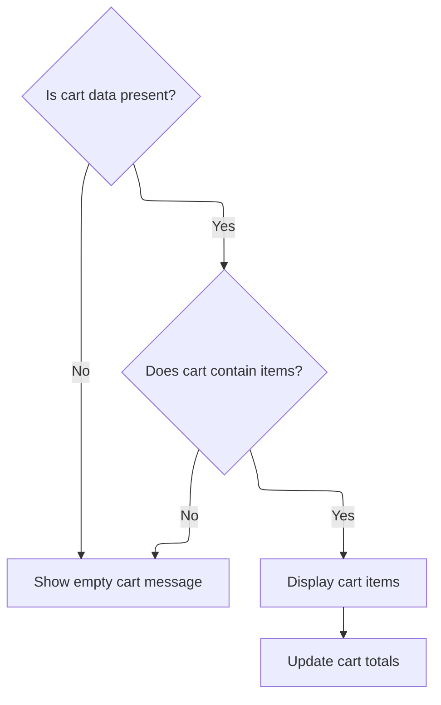

This document explains how the shopping cart UI is updated after receiving new cart data. When an AJAX request returns the latest cart information, the UI displays an empty cart message if there are no items, or renders the items and updates the totals if the cart contains products.

# Rendering and Updating the Shopping Cart UI



This section governs how the shopping cart UI is rendered and updated based on the current cart data, ensuring users see an accurate representation of their cart contents and totals.

| Category       | Rule Name                   | Description                                                                                                                                      |
| -------------- | --------------------------- | ------------------------------------------------------------------------------------------------------------------------------------------------ |
| Business logic | Empty Cart Display          | If the cart data is missing or null, the shopping cart UI must display an empty cart message to the user.                                        |
| Business logic | No Items Display            | If the cart contains no items, the shopping cart UI must display an empty cart message to the user.                                              |
| Business logic | Cart Items Rendering        | If the cart contains items, the shopping cart UI must render all items in the cart, showing relevant details for each item.                      |
| Business logic | Cart Totals Synchronization | Whenever the cart items are rendered, the cart totals must be updated to reflect the current contents of the cart.                               |
| Business logic | UI State Visibility         | The shopping cart UI must toggle the visibility of specific elements (such as cart message and cart contents) to reflect the current cart state. |

<SwmSnippet path="/shopizer/sm-shop/src/main/webapp/resources/js/shopping-cart.js" line="286">

---

In <SwmToken path="shopizer/sm-shop/src/main/webapp/resources/js/shopping-cart.js" pos="286:1:1" line-data="		 success: function(miniCart) {">`success`</SwmToken>, we validate the cart data and immediately call <SwmToken path="shopizer/sm-shop/src/main/webapp/resources/js/shopping-cart.js" pos="291:1:1" line-data="					 displayShoppigCartItems(miniCart,&#39;#shoppingcartProducts&#39;);">`displayShoppigCartItems`</SwmToken> to update the cart UI if there are items.

```javascript
		 success: function(miniCart) {
			 if(miniCart==null) {
				 emptyCartLabel();
			 } else {
				 if(miniCart.shoppingCartItems!=null) {
					 displayShoppigCartItems(miniCart,'#shoppingcartProducts');
```

---

</SwmSnippet>

<SwmSnippet path="/shopizer/sm-shop/src/main/webapp/resources/js/shopping-cart.js" line="331">

---

<SwmToken path="shopizer/sm-shop/src/main/webapp/resources/js/shopping-cart.js" pos="331:2:2" line-data="function displayShoppigCartItems(cart, div) {">`displayShoppigCartItems`</SwmToken> sets up the cart context path, compiles the Hogan template from the DOM, and renders the cart items into the target div. If there are no items, it shows the empty cart label and exits. It also toggles visibility of specific UI elements to reflect the cart state.

```javascript
function displayShoppigCartItems(cart, div) {
	
	 
	//set cart contextPath
	cart.contextPath=getContextPath(); 
	var template = Hogan.compile(document.getElementById("miniShoppingCartTemplate").innerHTML);
	
    
	 $(div).html('');
	 if(cart.shoppingCartItems==null) {
		 emptyCartLabel();
		 return;
	 }
	 
	 $('#cartMessage').hide();
	 $('#shoppingcart').show();

	 //call template defined in template directory
	 $(div).append(template.render(cart));


}
```

---

</SwmSnippet>

<SwmSnippet path="/shopizer/sm-shop/src/main/webapp/resources/js/shopping-cart.js" line="278">

---

Back in <SwmToken path="shopizer/sm-shop/src/main/webapp/resources/js/shopping-cart.js" pos="286:1:1" line-data="		 success: function(miniCart) {">`success`</SwmToken>, after returning from <SwmToken path="shopizer/sm-shop/src/main/webapp/resources/js/shopping-cart.js" pos="291:1:1" line-data="					 displayShoppigCartItems(miniCart,&#39;#shoppingcartProducts&#39;);">`displayShoppigCartItems`</SwmToken>, we update the cart totals with <SwmToken path="shopizer/sm-shop/src/main/webapp/resources/js/shopping-cart.js" pos="160:1:1" line-data="				 displayTotals(cart);">`displayTotals`</SwmToken>. This keeps the cart summary in sync with the rendered items. The next step involves AJAX logic from <SwmPath>[shopizer/…/bootstrap/jquery.js](shopizer/sm-shop/src/main/webapp/resources/js/bootstrap/jquery.js)</SwmPath> to handle data fetching and updates.

```javascript
				 if(miniCart.shoppingCartItems!=null) {
					 displayShoppigCartItems(miniCart,'#shoppingcartProducts');
					 displayTotals(miniCart);
				 } else {
					 emptyCartLabel();
				 }
			 }
		} 
```

---

</SwmSnippet>

# AJAX Request Lifecycle and Event Handling

```mermaid
%%{init: {"flowchart": {"defaultRenderer": "elk"}} }%%
flowchart TD
  node1["Receive input: URL or options"]
  click node1 openCode "shopizer/sm-shop/src/main/webapp/resources/js/bootstrap/jquery.js:7198:7204"
  node1 --> node2{"Is input a URL or options object?"}
  click node2 openCode "shopizer/sm-shop/src/main/webapp/resources/js/bootstrap/jquery.js:7201:7204"
  node2 -->|"Options object"| node3["Set options from input"]
  click node3 openCode "shopizer/sm-shop/src/main/webapp/resources/js/bootstrap/jquery.js:7202:7204"
  node2 -->|"URL"| node4["Set URL and options"]
  click node4 openCode "shopizer/sm-shop/src/main/webapp/resources/js/bootstrap/jquery.js:7202:7204"
  node3 --> node5["Setup request: URL, options"]
  node4 --> node5
  click node5 openCode "shopizer/sm-shop/src/main/webapp/resources/js/bootstrap/jquery.js:7205:7531"
  subgraph loop1["For each header in options.headers"]
    node5 --> node6["Set request header"]
    click node6 openCode "shopizer/sm-shop/src/main/webapp/resources/js/bootstrap/jquery.js:7527:7531"
  end
  subgraph loop2["For each callback type (success, error, complete)"]
    node6 --> node7["Attach callback"]
    click node7 openCode "shopizer/sm-shop/src/main/webapp/resources/js/bootstrap/jquery.js:7541:7543"
  end
  node7 --> node8{"Should request be aborted before sending?"}
  click node8 openCode "shopizer/sm-shop/src/main/webapp/resources/js/bootstrap/jquery.js:7533:7538"
  node8 -->|"Yes"| node9["Abort request"]
  click node9 openCode "shopizer/sm-shop/src/main/webapp/resources/js/bootstrap/jquery.js:7535:7536"
  node8 -->|"No"| node10{"Is there a valid transport?"}
  click node10 openCode "shopizer/sm-shop/src/main/webapp/resources/js/bootstrap/jquery.js:7545:7551"
  node10 -->|"No"| node11["Fail: No transport"]
  click node11 openCode "shopizer/sm-shop/src/main/webapp/resources/js/bootstrap/jquery.js:7550:7551"
  node10 -->|"Yes"| node12["Send request and trigger global events"]
  click node12 openCode "shopizer/sm-shop/src/main/webapp/resources/js/bootstrap/jquery.js:7552:7567"
  node12 --> node13{"Did request succeed?"}
  click node13 openCode "shopizer/sm-shop/src/main/webapp/resources/js/bootstrap/jquery.js:7334:7367"
  node13 -->|"Yes"| node14["Handle success and trigger global events"]
  click node14 openCode "shopizer/sm-shop/src/main/webapp/resources/js/bootstrap/jquery.js:7384:7396"
  node13 -->|"No"| node15["Handle error and trigger global events"]
  click node15 openCode "shopizer/sm-shop/src/main/webapp/resources/js/bootstrap/jquery.js:7387:7396"
  node14 --> node16["Trigger complete callbacks"]
  click node16 openCode "shopizer/sm-shop/src/main/webapp/resources/js/bootstrap/jquery.js:7400:7404"
  node15 --> node16
  node16 --> node17["Return jqXHR object"]
  click node17 openCode "shopizer/sm-shop/src/main/webapp/resources/js/bootstrap/jquery.js:7578:7579"

classDef HeadingStyle fill:#777777,stroke:#333,stroke-width:2px;

%% Swimm:
%% %%{init: {"flowchart": {"defaultRenderer": "elk"}} }%%
%% flowchart TD
%%   node1["Receive input: URL or options"]
%%   click node1 openCode "<SwmPath>[shopizer/…/bootstrap/jquery.js](shopizer/sm-shop/src/main/webapp/resources/js/bootstrap/jquery.js)</SwmPath>:7198:7204"
%%   node1 --> node2{"Is input a URL or options object?"}
%%   click node2 openCode "<SwmPath>[shopizer/…/bootstrap/jquery.js](shopizer/sm-shop/src/main/webapp/resources/js/bootstrap/jquery.js)</SwmPath>:7201:7204"
%%   node2 -->|"Options object"| node3["Set options from input"]
%%   click node3 openCode "<SwmPath>[shopizer/…/bootstrap/jquery.js](shopizer/sm-shop/src/main/webapp/resources/js/bootstrap/jquery.js)</SwmPath>:7202:7204"
%%   node2 -->|"URL"| node4["Set URL and options"]
%%   click node4 openCode "<SwmPath>[shopizer/…/bootstrap/jquery.js](shopizer/sm-shop/src/main/webapp/resources/js/bootstrap/jquery.js)</SwmPath>:7202:7204"
%%   node3 --> node5["Setup request: URL, options"]
%%   node4 --> node5
%%   click node5 openCode "<SwmPath>[shopizer/…/bootstrap/jquery.js](shopizer/sm-shop/src/main/webapp/resources/js/bootstrap/jquery.js)</SwmPath>:7205:7531"
%%   subgraph loop1["For each header in options.headers"]
%%     node5 --> node6["Set request header"]
%%     click node6 openCode "<SwmPath>[shopizer/…/bootstrap/jquery.js](shopizer/sm-shop/src/main/webapp/resources/js/bootstrap/jquery.js)</SwmPath>:7527:7531"
%%   end
%%   subgraph loop2["For each callback type (success, error, complete)"]
%%     node6 --> node7["Attach callback"]
%%     click node7 openCode "<SwmPath>[shopizer/…/bootstrap/jquery.js](shopizer/sm-shop/src/main/webapp/resources/js/bootstrap/jquery.js)</SwmPath>:7541:7543"
%%   end
%%   node7 --> node8{"Should request be aborted before sending?"}
%%   click node8 openCode "<SwmPath>[shopizer/…/bootstrap/jquery.js](shopizer/sm-shop/src/main/webapp/resources/js/bootstrap/jquery.js)</SwmPath>:7533:7538"
%%   node8 -->|"Yes"| node9["Abort request"]
%%   click node9 openCode "<SwmPath>[shopizer/…/bootstrap/jquery.js](shopizer/sm-shop/src/main/webapp/resources/js/bootstrap/jquery.js)</SwmPath>:7535:7536"
%%   node8 -->|"No"| node10{"Is there a valid transport?"}
%%   click node10 openCode "<SwmPath>[shopizer/…/bootstrap/jquery.js](shopizer/sm-shop/src/main/webapp/resources/js/bootstrap/jquery.js)</SwmPath>:7545:7551"
%%   node10 -->|"No"| node11["Fail: No transport"]
%%   click node11 openCode "<SwmPath>[shopizer/…/bootstrap/jquery.js](shopizer/sm-shop/src/main/webapp/resources/js/bootstrap/jquery.js)</SwmPath>:7550:7551"
%%   node10 -->|"Yes"| node12["Send request and trigger global events"]
%%   click node12 openCode "<SwmPath>[shopizer/…/bootstrap/jquery.js](shopizer/sm-shop/src/main/webapp/resources/js/bootstrap/jquery.js)</SwmPath>:7552:7567"
%%   node12 --> node13{"Did request succeed?"}
%%   click node13 openCode "<SwmPath>[shopizer/…/bootstrap/jquery.js](shopizer/sm-shop/src/main/webapp/resources/js/bootstrap/jquery.js)</SwmPath>:7334:7367"
%%   node13 -->|"Yes"| node14["Handle success and trigger global events"]
%%   click node14 openCode "<SwmPath>[shopizer/…/bootstrap/jquery.js](shopizer/sm-shop/src/main/webapp/resources/js/bootstrap/jquery.js)</SwmPath>:7384:7396"
%%   node13 -->|"No"| node15["Handle error and trigger global events"]
%%   click node15 openCode "<SwmPath>[shopizer/…/bootstrap/jquery.js](shopizer/sm-shop/src/main/webapp/resources/js/bootstrap/jquery.js)</SwmPath>:7387:7396"
%%   node14 --> node16["Trigger complete callbacks"]
%%   click node16 openCode "<SwmPath>[shopizer/…/bootstrap/jquery.js](shopizer/sm-shop/src/main/webapp/resources/js/bootstrap/jquery.js)</SwmPath>:7400:7404"
%%   node15 --> node16
%%   node16 --> node17["Return <SwmToken path="shopizer/sm-shop/src/main/webapp/resources/js/bootstrap/jquery.js" pos="7238:5:5" line-data="			// The jqXHR state">`jqXHR`</SwmToken> object"]
%%   click node17 openCode "<SwmPath>[shopizer/…/bootstrap/jquery.js](shopizer/sm-shop/src/main/webapp/resources/js/bootstrap/jquery.js)</SwmPath>:7578:7579"
%% 
%% classDef HeadingStyle fill:#777777,stroke:#333,stroke-width:<SwmToken path="shopizer/sm-shop/src/main/webapp/resources/js/bootstrap/jquery.js" pos="1470:10:10" line-data="		div.style.width = &quot;2px&quot;;">`2px`</SwmToken>;
```



This section governs the lifecycle of AJAX requests and event handling in Shopizer, ensuring requests are properly configured, executed, and managed, with appropriate callbacks and global events triggered throughout the process.

| Category        | Rule Name                 | Description                                                                                                                                                                                                                                                                                                                                                                                                                                                                                                                                                                                                                                                                                                                                                                                                                                                                                                                                                                                                                                                                                                                                                                                                                                                                                                                                                                                                                                                                   |
| --------------- | ------------------------- | ----------------------------------------------------------------------------------------------------------------------------------------------------------------------------------------------------------------------------------------------------------------------------------------------------------------------------------------------------------------------------------------------------------------------------------------------------------------------------------------------------------------------------------------------------------------------------------------------------------------------------------------------------------------------------------------------------------------------------------------------------------------------------------------------------------------------------------------------------------------------------------------------------------------------------------------------------------------------------------------------------------------------------------------------------------------------------------------------------------------------------------------------------------------------------------------------------------------------------------------------------------------------------------------------------------------------------------------------------------------------------------------------------------------------------------------------------------------------------- |
| Data validation | Transport Validation      | If no valid transport is available for the request, the request must fail with a 'No Transport' error.                                                                                                                                                                                                                                                                                                                                                                                                                                                                                                                                                                                                                                                                                                                                                                                                                                                                                                                                                                                                                                                                                                                                                                                                                                                                                                                                                                        |
| Business logic  | Header Enforcement        | All request headers specified in the options object must be set on the outgoing AJAX request.                                                                                                                                                                                                                                                                                                                                                                                                                                                                                                                                                                                                                                                                                                                                                                                                                                                                                                                                                                                                                                                                                                                                                                                                                                                                                                                                                                                 |
| Business logic  | Callback Attachment       | Callbacks for success, error, and complete events must be attached to the <SwmToken path="shopizer/sm-shop/src/main/webapp/resources/js/bootstrap/jquery.js" pos="7238:5:5" line-data="			// The jqXHR state">`jqXHR`</SwmToken> object if provided in the options.                                                                                                                                                                                                                                                                                                                                                                                                                                                                                                                                                                                                                                                                                                                                                                                                                                                                                                                                                                                                                                                                                                                                                                                                              |
| Business logic  | Global Event Triggering   | Global AJAX events (<SwmToken path="shopizer/sm-shop/src/main/webapp/resources/js/bootstrap/jquery.js" pos="7475:9:9" line-data="			jQuery.event.trigger( &quot;ajaxStart&quot; );">`ajaxStart`</SwmToken>, <SwmToken path="shopizer/sm-shop/src/main/webapp/resources/js/bootstrap/jquery.js" pos="7555:7:7" line-data="				globalEventContext.trigger( &quot;ajaxSend&quot;, [ jqXHR, s ] );">`ajaxSend`</SwmToken>, <SwmToken path="shopizer/sm-shop/src/main/webapp/resources/js/bootstrap/jquery.js" pos="7077:14:14" line-data="jQuery.each( &quot;ajaxStart ajaxStop ajaxComplete ajaxError ajaxSuccess ajaxSend&quot;.split( &quot; &quot; ), function( i, o ){">`ajaxSuccess`</SwmToken>, <SwmToken path="shopizer/sm-shop/src/main/webapp/resources/js/bootstrap/jquery.js" pos="7077:12:12" line-data="jQuery.each( &quot;ajaxStart ajaxStop ajaxComplete ajaxError ajaxSuccess ajaxSend&quot;.split( &quot; &quot; ), function( i, o ){">`ajaxError`</SwmToken>, <SwmToken path="shopizer/sm-shop/src/main/webapp/resources/js/bootstrap/jquery.js" pos="7403:7:7" line-data="				globalEventContext.trigger( &quot;ajaxComplete&quot;, [ jqXHR, s ] );">`ajaxComplete`</SwmToken>, <SwmToken path="shopizer/sm-shop/src/main/webapp/resources/js/bootstrap/jquery.js" pos="7406:9:9" line-data="					jQuery.event.trigger( &quot;ajaxStop&quot; );">`ajaxStop`</SwmToken>) must be triggered at appropriate stages of the request lifecycle if global event handling is enabled. |
| Business logic  | Response Outcome Handling | If the request is successful (status 200-299 or 304), the success callback must be triggered; otherwise, the error callback must be triggered.                                                                                                                                                                                                                                                                                                                                                                                                                                                                                                                                                                                                                                                                                                                                                                                                                                                                                                                                                                                                                                                                                                                                                                                                                                                                                                                                |

<SwmSnippet path="/shopizer/sm-shop/src/main/webapp/resources/js/bootstrap/jquery.js" line="7198">

---

In <SwmToken path="shopizer/sm-shop/src/main/webapp/resources/js/bootstrap/jquery.js" pos="7198:1:1" line-data="	ajax: function( url, options ) {">`ajax`</SwmToken>, we normalize arguments to support legacy and modern signatures, set up deferreds and callbacks for async handling, and prepare the <SwmToken path="shopizer/sm-shop/src/main/webapp/resources/js/bootstrap/jquery.js" pos="7238:5:5" line-data="			// The jqXHR state">`jqXHR`</SwmToken> object for chaining event handlers. This sets the stage for flexible AJAX requests and event-driven responses.

```javascript
	ajax: function( url, options ) {

		// If url is an object, simulate pre-1.5 signature
		if ( typeof url === "object" ) {
			options = url;
			url = undefined;
		}

		// Force options to be an object
		options = options || {};

		var // Create the final options object
			s = jQuery.ajaxSetup( {}, options ),
			// Callbacks context
			callbackContext = s.context || s,
			// Context for global events
			// It's the callbackContext if one was provided in the options
			// and if it's a DOM node or a jQuery collection
			globalEventContext = callbackContext !== s &&
				( callbackContext.nodeType || callbackContext instanceof jQuery ) ?
						jQuery( callbackContext ) : jQuery.event,
			// Deferreds
			deferred = jQuery.Deferred(),
			completeDeferred = jQuery.Callbacks( "once memory" ),
			// Status-dependent callbacks
			statusCode = s.statusCode || {},
			// ifModified key
			ifModifiedKey,
			// Headers (they are sent all at once)
			requestHeaders = {},
			requestHeadersNames = {},
			// Response headers
			responseHeadersString,
			responseHeaders,
			// transport
			transport,
			// timeout handle
			timeoutTimer,
			// Cross-domain detection vars
			parts,
			// The jqXHR state
			state = 0,
			// To know if global events are to be dispatched
			fireGlobals,
			// Loop variable
			i,
			// Fake xhr
			jqXHR = {

				readyState: 0,

				// Caches the header
				setRequestHeader: function( name, value ) {
					if ( !state ) {
						var lname = name.toLowerCase();
						name = requestHeadersNames[ lname ] = requestHeadersNames[ lname ] || name;
						requestHeaders[ name ] = value;
					}
					return this;
				},

				// Raw string
				getAllResponseHeaders: function() {
					return state === 2 ? responseHeadersString : null;
				},

				// Builds headers hashtable if needed
				getResponseHeader: function( key ) {
					var match;
					if ( state === 2 ) {
						if ( !responseHeaders ) {
							responseHeaders = {};
							while( ( match = rheaders.exec( responseHeadersString ) ) ) {
								responseHeaders[ match[1].toLowerCase() ] = match[ 2 ];
							}
```

---

</SwmSnippet>

<SwmSnippet path="/shopizer/sm-shop/src/main/webapp/resources/js/bootstrap/jquery.js" line="7274">

---

After setting up the <SwmToken path="shopizer/sm-shop/src/main/webapp/resources/js/bootstrap/jquery.js" pos="7317:14:14" line-data="			// (no matter how long the jqXHR object will be used)">`jqXHR`</SwmToken> object, the function defines the done callback to handle completion, success, and error states. It triggers global AJAX events as needed, updates the active request counter, and cleans up after the request finishes.

```javascript
						match = responseHeaders[ key.toLowerCase() ];
					}
					return match === undefined ? null : match;
				},

				// Overrides response content-type header
				overrideMimeType: function( type ) {
					if ( !state ) {
						s.mimeType = type;
					}
					return this;
				},

				// Cancel the request
				abort: function( statusText ) {
					statusText = statusText || "abort";
					if ( transport ) {
						transport.abort( statusText );
					}
					done( 0, statusText );
					return this;
				}
			};

		// Callback for when everything is done
		// It is defined here because jslint complains if it is declared
		// at the end of the function (which would be more logical and readable)
		function done( status, nativeStatusText, responses, headers ) {

			// Called once
			if ( state === 2 ) {
				return;
			}

			// State is "done" now
			state = 2;

			// Clear timeout if it exists
			if ( timeoutTimer ) {
				clearTimeout( timeoutTimer );
			}

			// Dereference transport for early garbage collection
			// (no matter how long the jqXHR object will be used)
			transport = undefined;

			// Cache response headers
			responseHeadersString = headers || "";

			// Set readyState
			jqXHR.readyState = status > 0 ? 4 : 0;

			var isSuccess,
				success,
				error,
				statusText = nativeStatusText,
				response = responses ? ajaxHandleResponses( s, jqXHR, responses ) : undefined,
				lastModified,
				etag;

			// If successful, handle type chaining
			if ( status >= 200 && status < 300 || status === 304 ) {

				// Set the If-Modified-Since and/or If-None-Match header, if in ifModified mode.
				if ( s.ifModified ) {

					if ( ( lastModified = jqXHR.getResponseHeader( "Last-Modified" ) ) ) {
						jQuery.lastModified[ ifModifiedKey ] = lastModified;
					}
					if ( ( etag = jqXHR.getResponseHeader( "Etag" ) ) ) {
						jQuery.etag[ ifModifiedKey ] = etag;
					}
				}

				// If not modified
				if ( status === 304 ) {

					statusText = "notmodified";
					isSuccess = true;

				// If we have data
				} else {

					try {
						success = ajaxConvert( s, response );
						statusText = "success";
						isSuccess = true;
					} catch(e) {
						// We have a parsererror
						statusText = "parsererror";
						error = e;
					}
				}
			} else {
				// We extract error from statusText
				// then normalize statusText and status for non-aborts
				error = statusText;
				if ( !statusText || status ) {
					statusText = "error";
					if ( status < 0 ) {
						status = 0;
					}
				}
			}

			// Set data for the fake xhr object
			jqXHR.status = status;
			jqXHR.statusText = "" + ( nativeStatusText || statusText );

			// Success/Error
			if ( isSuccess ) {
				deferred.resolveWith( callbackContext, [ success, statusText, jqXHR ] );
			} else {
				deferred.rejectWith( callbackContext, [ jqXHR, statusText, error ] );
			}

			// Status-dependent callbacks
			jqXHR.statusCode( statusCode );
			statusCode = undefined;

			if ( fireGlobals ) {
				globalEventContext.trigger( "ajax" + ( isSuccess ? "Success" : "Error" ),
						[ jqXHR, s, isSuccess ? success : error ] );
			}

			// Complete
			completeDeferred.fireWith( callbackContext, [ jqXHR, statusText ] );

			if ( fireGlobals ) {
				globalEventContext.trigger( "ajaxComplete", [ jqXHR, s ] );
				// Handle the global AJAX counter
				if ( !( --jQuery.active ) ) {
					jQuery.event.trigger( "ajaxStop" );
				}
			}
		}

		// Attach deferreds
		deferred.promise( jqXHR );
		jqXHR.success = jqXHR.done;
		jqXHR.error = jqXHR.fail;
		jqXHR.complete = completeDeferred.add;

		// Status-dependent callbacks
		jqXHR.statusCode = function( map ) {
			if ( map ) {
				var tmp;
				if ( state < 2 ) {
					for ( tmp in map ) {
						statusCode[ tmp ] = [ statusCode[tmp], map[tmp] ];
					}
```

---

</SwmSnippet>

<SwmSnippet path="/shopizer/sm-shop/src/main/webapp/resources/js/bootstrap/jquery.js" line="7426">

---

Here the function applies prefilters to modify the request and selects the appropriate transport for sending it. This enables custom logic and extensibility for different types of AJAX requests.

```javascript
					tmp = map[ jqXHR.status ];
					jqXHR.then( tmp, tmp );
				}
			}
			return this;
		};

		// Remove hash character (#7531: and string promotion)
		// Add protocol if not provided (#5866: IE7 issue with protocol-less urls)
		// We also use the url parameter if available
		s.url = ( ( url || s.url ) + "" ).replace( rhash, "" ).replace( rprotocol, ajaxLocParts[ 1 ] + "//" );

		// Extract dataTypes list
		s.dataTypes = jQuery.trim( s.dataType || "*" ).toLowerCase().split( rspacesAjax );

		// Determine if a cross-domain request is in order
		if ( s.crossDomain == null ) {
			parts = rurl.exec( s.url.toLowerCase() );
			s.crossDomain = !!( parts &&
				( parts[ 1 ] != ajaxLocParts[ 1 ] || parts[ 2 ] != ajaxLocParts[ 2 ] ||
					( parts[ 3 ] || ( parts[ 1 ] === "http:" ? 80 : 443 ) ) !=
						( ajaxLocParts[ 3 ] || ( ajaxLocParts[ 1 ] === "http:" ? 80 : 443 ) ) )
			);
		}

		// Convert data if not already a string
		if ( s.data && s.processData && typeof s.data !== "string" ) {
			s.data = jQuery.param( s.data, s.traditional );
		}

		// Apply prefilters
		inspectPrefiltersOrTransports( prefilters, s, options, jqXHR );

		// If request was aborted inside a prefiler, stop there
		if ( state === 2 ) {
			return false;
		}

		// We can fire global events as of now if asked to
		fireGlobals = s.global;

		// Uppercase the type
		s.type = s.type.toUpperCase();

		// Determine if request has content
		s.hasContent = !rnoContent.test( s.type );

		// Watch for a new set of requests
		if ( fireGlobals && jQuery.active++ === 0 ) {
			jQuery.event.trigger( "ajaxStart" );
		}

		// More options handling for requests with no content
		if ( !s.hasContent ) {

			// If data is available, append data to url
			if ( s.data ) {
				s.url += ( rquery.test( s.url ) ? "&" : "?" ) + s.data;
				// #9682: remove data so that it's not used in an eventual retry
				delete s.data;
			}

			// Get ifModifiedKey before adding the anti-cache parameter
			ifModifiedKey = s.url;

			// Add anti-cache in url if needed
			if ( s.cache === false ) {

				var ts = jQuery.now(),
					// try replacing _= if it is there
					ret = s.url.replace( rts, "$1_=" + ts );

				// if nothing was replaced, add timestamp to the end
				s.url = ret + ( ( ret === s.url ) ? ( rquery.test( s.url ) ? "&" : "?" ) + "_=" + ts : "" );
			}
		}

		// Set the correct header, if data is being sent
		if ( s.data && s.hasContent && s.contentType !== false || options.contentType ) {
			jqXHR.setRequestHeader( "Content-Type", s.contentType );
		}

		// Set the If-Modified-Since and/or If-None-Match header, if in ifModified mode.
		if ( s.ifModified ) {
			ifModifiedKey = ifModifiedKey || s.url;
			if ( jQuery.lastModified[ ifModifiedKey ] ) {
				jqXHR.setRequestHeader( "If-Modified-Since", jQuery.lastModified[ ifModifiedKey ] );
			}
			if ( jQuery.etag[ ifModifiedKey ] ) {
				jqXHR.setRequestHeader( "If-None-Match", jQuery.etag[ ifModifiedKey ] );
			}
		}

		// Set the Accepts header for the server, depending on the dataType
		jqXHR.setRequestHeader(
			"Accept",
			s.dataTypes[ 0 ] && s.accepts[ s.dataTypes[0] ] ?
				s.accepts[ s.dataTypes[0] ] + ( s.dataTypes[ 0 ] !== "*" ? ", " + allTypes + "; q=0.01" : "" ) :
				s.accepts[ "*" ]
		);

		// Check for headers option
		for ( i in s.headers ) {
			jqXHR.setRequestHeader( i, s.headers[ i ] );
		}
```

---

</SwmSnippet>

<SwmSnippet path="/shopizer/sm-shop/src/main/webapp/resources/js/bootstrap/jquery.js" line="7532">

---

Before sending the request, we run <SwmToken path="shopizer/sm-shop/src/main/webapp/resources/js/bootstrap/jquery.js" pos="7533:7:7" line-data="		if ( s.beforeSend &amp;&amp; ( s.beforeSend.call( callbackContext, jqXHR, s ) === false || state === 2 ) ) {">`beforeSend`</SwmToken> for custom logic and allow early abort. Then, we attach success, error, and complete handlers to the <SwmToken path="shopizer/sm-shop/src/main/webapp/resources/js/bootstrap/jquery.js" pos="7533:23:23" line-data="		if ( s.beforeSend &amp;&amp; ( s.beforeSend.call( callbackContext, jqXHR, s ) === false || state === 2 ) ) {">`jqXHR`</SwmToken> object for response management.

```javascript
		// Allow custom headers/mimetypes and early abort
		if ( s.beforeSend && ( s.beforeSend.call( callbackContext, jqXHR, s ) === false || state === 2 ) ) {
				// Abort if not done already
				jqXHR.abort();
				return false;

		}

		// Install callbacks on deferreds
		for ( i in { success: 1, error: 1, complete: 1 } ) {
			jqXHR[ i ]( s[ i ] );
		}
```

---

</SwmSnippet>

<SwmSnippet path="/shopizer/sm-shop/src/main/webapp/resources/js/bootstrap/jquery.js" line="7545">

---

Finally, the function sends the request using the chosen transport, manages timeouts and errors, and returns the <SwmToken path="shopizer/sm-shop/src/main/webapp/resources/js/bootstrap/jquery.js" pos="7546:17:17" line-data="		transport = inspectPrefiltersOrTransports( transports, s, options, jqXHR );">`jqXHR`</SwmToken> object for chaining and event handling.

```javascript
		// Get transport
		transport = inspectPrefiltersOrTransports( transports, s, options, jqXHR );

		// If no transport, we auto-abort
		if ( !transport ) {
			done( -1, "No Transport" );
		} else {
			jqXHR.readyState = 1;
			// Send global event
			if ( fireGlobals ) {
				globalEventContext.trigger( "ajaxSend", [ jqXHR, s ] );
			}
			// Timeout
			if ( s.async && s.timeout > 0 ) {
				timeoutTimer = setTimeout( function(){
					jqXHR.abort( "timeout" );
				}, s.timeout );
			}

			try {
				state = 1;
				transport.send( requestHeaders, done );
			} catch (e) {
				// Propagate exception as error if not done
				if ( state < 2 ) {
					done( -1, e );
				// Simply rethrow otherwise
				} else {
					throw e;
				}
			}
		}

		return jqXHR;
	},
```

---

</SwmSnippet>

&nbsp;

*This is an auto-generated document by Swimm 🌊 and has not yet been verified by a human*

<SwmMeta version="3.0.0" repo-id="Z2l0aHViJTNBJTNBU2hvcGl6ZXIlM0ElM0F1bWFsaW5nYXN3YW1p" repo-name="Shopizer"><sup>Powered by [Swimm](https://app.swimm.io/)</sup></SwmMeta>
