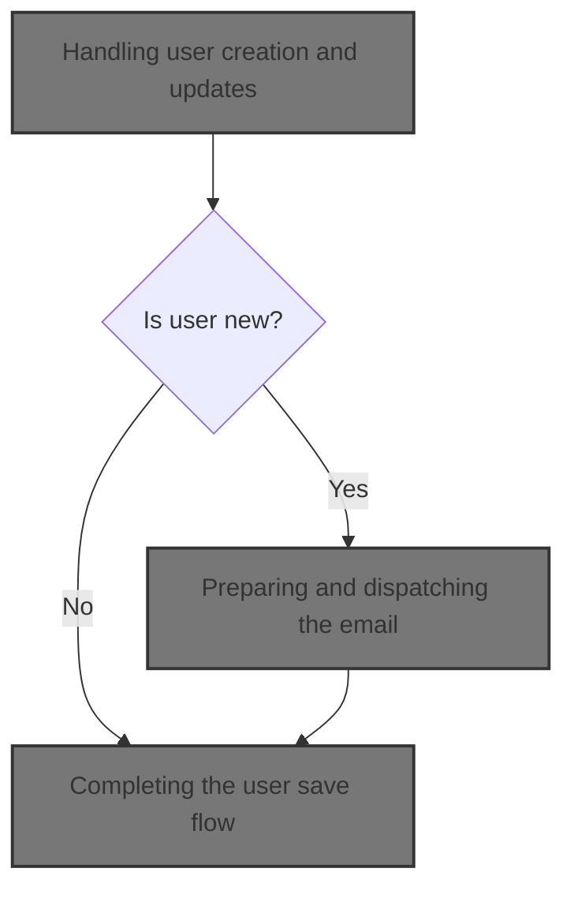

This document describes the flow for creating or updating user accounts through the admin interface. Administrators provide user details and group assignments, and the system ensures super admin rights are preserved. For new users, a welcome email is sent. The process ends by confirming success and showing the user profile.



# Handling user creation and updates

<SwmSnippet path="/shopizer/sm-shop/src/main/java/com/salesmanager/web/admin/controller/user/UserController.java" line="472">

---

In <SwmToken path="shopizer/sm-shop/src/main/java/com/salesmanager/web/admin/controller/user/UserController.java" pos="472:5:5" line-data="	public String saveUser(@Valid @ModelAttribute(&quot;user&quot;) User user, BindingResult result, Model model, HttpServletRequest request, Locale locale) throws Exception {">`saveUser`</SwmToken>, we kick off the flow by prepping the model and menu, grabbing the store and language, and pulling the original user if we're editing. We also parse the user's submitted groups, treating each group's groupName as an integer ID (not a name), which is a hidden assumption. This sets up the context for validation, group management, and later steps like password handling and email notification.

```java
	public String saveUser(@Valid @ModelAttribute("user") User user, BindingResult result, Model model, HttpServletRequest request, Locale locale) throws Exception {


		setMenu(model,request);
		
		MerchantStore store = (MerchantStore)request.getAttribute(Constants.ADMIN_STORE);

		
		this.populateUserObjects(user, store, model, locale);
		
		Language language = user.getDefaultLanguage();
		
		Language l = languageService.getById(language.getId());
		
		user.setDefaultLanguage(l);
		
		Locale userLocale = LocaleUtils.getLocale(l);
		
		
		
		User dbUser = null;
		
		//edit mode, need to get original user important information
		if(user.getId()!=null) {
			dbUser = userService.getByUserName(user.getAdminName());
			if(dbUser==null) {
				return "redirect://admin/users/displayUser.html";
			}
		}

		List<Group> submitedGroups = user.getGroups();
		Set<Integer> ids = new HashSet<Integer>();
		for(Group group : submitedGroups) {
			ids.add(Integer.parseInt(group.getGroupName()));
		}
```

---

</SwmSnippet>

<SwmSnippet path="/shopizer/sm-shop/src/main/java/com/salesmanager/web/admin/controller/user/UserController.java" line="537">

---

Next in <SwmToken path="shopizer/sm-shop/src/main/java/com/salesmanager/web/admin/controller/user/UserController.java" pos="472:5:5" line-data="	public String saveUser(@Valid @ModelAttribute(&quot;user&quot;) User user, BindingResult result, Model model, HttpServletRequest request, Locale locale) throws Exception {">`saveUser`</SwmToken>, we check if the user is being edited and scan their existing groups for SUPERADMIN. If found, we make sure to keep this group in the user's group list, so super admin rights can't be revoked by mistake or on purpose. This is a security safeguard before updating group assignments.

```java
		Group superAdmin = null;
		
		if(user.getId()!=null && user.getId()>0) {
			if(user.getId().longValue()!=dbUser.getId().longValue()) {
				return "redirect://admin/users/displayUser.html";
			}
			
			List<Group> groups = dbUser.getGroups();
			//boolean removeSuperAdmin = true;
			for(Group group : groups) {
				//can't revoke super admin
				if(group.getGroupName().equals("SUPERADMIN")) {
					superAdmin = group;
				}
			}
```

---

</SwmSnippet>

<SwmSnippet path="/shopizer/sm-shop/src/main/java/com/salesmanager/web/admin/controller/user/UserController.java" line="562">

---

After handling group assignments and validation, we encode the password if it's a new user, save or update the user, and—if it's a new user—build template tokens and call the email service to send a welcome email. This step is what links us to the email sending flow next.

```java
		if(superAdmin!=null) {
			ids.add(superAdmin.getId());
		}

		
		List<Group> newGroups = groupService.listGroupByIds(ids);

		//set actual user groups
		user.setGroups(newGroups);
		
		if (result.hasErrors()) {
			return ControllerConstants.Tiles.User.profile;
		}
		
		String decodedPassword = user.getAdminPassword();
		if(user.getId()!=null && user.getId()>0) {
			user.setAdminPassword(dbUser.getAdminPassword());
		} else {
			String encoded = passwordEncoder.encodePassword(user.getAdminPassword(),null);
			user.setAdminPassword(encoded);
		}
		
		
		if(user.getId()==null || user.getId().longValue()==0) {
			
			//save or update user
			userService.saveOrUpdate(user);
			
			try {

				//creation of a user, send an email
				String userName = user.getFirstName();
				if(StringUtils.isBlank(userName)) {
					userName = user.getAdminName();
				}
				String[] userNameArg = {userName};
				
				
				Map<String, String> templateTokens = EmailUtils.createEmailObjectsMap(request.getContextPath(), store, messages, userLocale);
				templateTokens.put(EmailConstants.EMAIL_NEW_USER_TEXT, messages.getMessage("email.greeting", userNameArg, userLocale));
				templateTokens.put(EmailConstants.EMAIL_USER_FIRSTNAME, user.getFirstName());
				templateTokens.put(EmailConstants.EMAIL_USER_LASTNAME, user.getLastName());
				templateTokens.put(EmailConstants.EMAIL_ADMIN_USERNAME_LABEL, messages.getMessage("label.generic.username",userLocale));
				templateTokens.put(EmailConstants.EMAIL_ADMIN_NAME, user.getAdminName());
				templateTokens.put(EmailConstants.EMAIL_TEXT_NEW_USER_CREATED, messages.getMessage("email.newuser.text",userLocale));
				templateTokens.put(EmailConstants.EMAIL_ADMIN_PASSWORD_LABEL, messages.getMessage("label.generic.password",userLocale));
				templateTokens.put(EmailConstants.EMAIL_ADMIN_PASSWORD, decodedPassword);
				templateTokens.put(EmailConstants.EMAIL_ADMIN_URL_LABEL, messages.getMessage("label.adminurl",userLocale));
				templateTokens.put(EmailConstants.EMAIL_ADMIN_URL, FilePathUtils.buildAdminUri(store, request));
	
				
				Email email = new Email();
				email.setFrom(store.getStorename());
				email.setFromEmail(store.getStoreEmailAddress());
				email.setSubject(messages.getMessage("email.newuser.title",userLocale));
				email.setTo(user.getAdminEmail());
				email.setTemplateName(NEW_USER_TMPL);
				email.setTemplateTokens(templateTokens);
	
	
				
				emailService.sendHtmlEmail(store, email);
			
			} catch (Exception e) {
				LOGGER.error("Cannot send email to user",e);
			}
			
		} else {
			//save or update user
			userService.saveOrUpdate(user);
		}

```

---

</SwmSnippet>

## Preparing and dispatching the email

<SwmSnippet path="/shopizer/sm-core/src/main/java/com/salesmanager/core/business/system/service/EmailServiceImpl.java" line="25">

---

<SwmToken path="shopizer/sm-core/src/main/java/com/salesmanager/core/business/system/service/EmailServiceImpl.java" pos="25:5:5" line-data="	public void sendHtmlEmail(MerchantStore store, Email email) throws ServiceException, Exception {">`sendHtmlEmail`</SwmToken> grabs the email config for the store, sets it on the sender, and hands off the email to the sender for actual delivery. This is where we jump into the HTML email sending logic next.

```java
	public void sendHtmlEmail(MerchantStore store, Email email) throws ServiceException, Exception {

		EmailConfig emailConfig = getEmailConfiguration(store);
		
		sender.setEmailConfig(emailConfig);
		sender.send(email);
	}
```

---

</SwmSnippet>

## Building and sending the email message

<SwmSnippet path="/shopizer/sm-core/src/main/java/com/salesmanager/core/modules/email/HtmlEmailSenderImpl.java" line="40">

---

We build the email using templates and tokens, prepping both text and HTML content for sending.

```java
	public void send(Email email)
			throws Exception {
		
		final String eml = email.getFrom();
		final String from = email.getFromEmail();
		final String to = email.getTo();
		final String subject = email.getSubject();
		final String tmpl = email.getTemplateName();
		final Map<String,String> templateTokens = email.getTemplateTokens();

		MimeMessagePreparator preparator = new MimeMessagePreparator() {
			public void prepare(MimeMessage mimeMessage)
					throws MessagingException, IOException {
				
				JavaMailSenderImpl impl = (JavaMailSenderImpl)mailSender;
				// if email configuration is present in Database, use the same
				if(emailConfig != null) {
					impl.setProtocol(emailConfig.getProtocol());
					impl.setHost(emailConfig.getHost());
					impl.setPort(Integer.parseInt(emailConfig.getPort()));
					impl.setUsername(emailConfig.getUsername());
					impl.setPassword(emailConfig.getPassword());
					
					Properties prop = new Properties();
					prop.put("mail.smtp.auth", emailConfig.isSmtpAuth());
					prop.put("mail.smtp.starttls.enable", emailConfig.isStarttls());
					impl.setJavaMailProperties(prop);
				}
				
				mimeMessage.setRecipient(Message.RecipientType.TO, new InternetAddress(to));

				InternetAddress inetAddress = new InternetAddress();

				inetAddress.setPersonal(eml);
				inetAddress.setAddress(from);

				mimeMessage.setFrom(inetAddress);
				mimeMessage.setSubject(subject);

				Multipart mp = new MimeMultipart("alternative");

				// Create a "text" Multipart message
				BodyPart textPart = new MimeBodyPart();
				freemarkerMailConfiguration.setClassForTemplateLoading(HtmlEmailSenderImpl.class, "/");
				Template textTemplate = freemarkerMailConfiguration.getTemplate(new StringBuilder(TEMPLATE_PATH).append("").append("/").append(tmpl).toString());
				final StringWriter textWriter = new StringWriter();
				try {
					textTemplate.process(templateTokens, textWriter);
				} catch (TemplateException e) {
					throw new MailPreparationException(
							"Can't generate text mail", e);
				}
				textPart.setDataHandler(new javax.activation.DataHandler(
						new javax.activation.DataSource() {
							public InputStream getInputStream()
									throws IOException {
								//return new StringBufferInputStream(textWriter
								//		.toString());
								return new ByteArrayInputStream(textWriter
										.toString().getBytes(CHARSET));
							}

							public OutputStream getOutputStream()
									throws IOException {
								throw new IOException("Read-only data");
							}

							public String getContentType() {
								return "text/plain";
							}

							public String getName() {
								return "main";
							}
						}));
				mp.addBodyPart(textPart);

				// Create a "HTML" Multipart message
				Multipart htmlContent = new MimeMultipart("related");
				BodyPart htmlPage = new MimeBodyPart();
				freemarkerMailConfiguration.setClassForTemplateLoading(HtmlEmailSenderImpl.class, "/");
				Template htmlTemplate = freemarkerMailConfiguration.getTemplate(new StringBuilder(TEMPLATE_PATH).append("").append("/").append(tmpl).toString());
				final StringWriter htmlWriter = new StringWriter();
				try {
					htmlTemplate.process(templateTokens, htmlWriter);
				} catch (TemplateException e) {
					throw new MailPreparationException(
							"Can't generate HTML mail", e);
				}
```

---

</SwmSnippet>

### Order-related business logic

See <SwmLink doc-title="Order Processing Flow">[Order Processing Flow](.swm%5Corder-processing-flow.g6yhj8it.sw.md)</SwmLink>

### Finalizing and sending the email

<SwmSnippet path="/shopizer/sm-core/src/main/java/com/salesmanager/core/modules/email/HtmlEmailSenderImpl.java" line="129">

---

We finalize the email content and send it out after handling any related business logic.

```java
				htmlPage.setDataHandler(new javax.activation.DataHandler(
						new javax.activation.DataSource() {
							public InputStream getInputStream()
									throws IOException {
								//return new StringBufferInputStream(htmlWriter
								//		.toString());
								return new ByteArrayInputStream(textWriter
										.toString().getBytes(CHARSET));
							}

							public OutputStream getOutputStream()
									throws IOException {
								throw new IOException("Read-only data");
							}

							public String getContentType() {
								return "text/html";
							}

							public String getName() {
								return "main";
							}
						}));
				htmlContent.addBodyPart(htmlPage);
				BodyPart htmlPart = new MimeBodyPart();
				htmlPart.setContent(htmlContent);
				mp.addBodyPart(htmlPart);

				mimeMessage.setContent(mp);

				// if(attachment!=null) {
				// MimeMessageHelper messageHelper = new
				// MimeMessageHelper(mimeMessage, true);
				// messageHelper.addAttachment(attachmentFileName, attachment);
				// }

			}
		};

		mailSender.send(preparator);
	}
```

---

</SwmSnippet>

## Completing the user save flow

<SwmSnippet path="/shopizer/sm-shop/src/main/java/com/salesmanager/web/admin/controller/user/UserController.java" line="634">

---

After returning from `EmailServiceImpl.sendHtmlEmail`, `UserController.saveUser` wraps up by adding a success flag to the model and returning the profile view. Any email errors are logged, but the user still sees success.

```java
		model.addAttribute("success","success");
		return ControllerConstants.Tiles.User.profile;
	}
```

---

</SwmSnippet>

&nbsp;

*This is an auto-generated document by Swimm 🌊 and has not yet been verified by a human*

<SwmMeta version="3.0.0" repo-id="Z2l0aHViJTNBJTNBU2hvcGl6ZXIlM0ElM0F1bWFsaW5nYXN3YW1p" repo-name="Shopizer"><sup>Powered by [Swimm](https://app.swimm.io/)</sup></SwmMeta>
