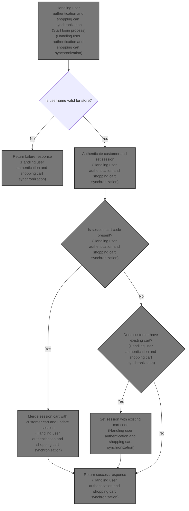

This document explains the flow of user authentication and shopping cart synchronization. It receives user credentials and session cart information, authenticates the user, and updates the session with the correct shopping cart code to maintain cart consistency across sessions.



# Handling user authentication and shopping cart synchronization

```mermaid
%%{init: {"flowchart": {"defaultRenderer": "elk"}} }%%
flowchart TD
    node1["Start login process"] --> node2{"Is username valid for store?"}
    click node1 openCode "shopizer/sm-shop/src/main/java/com/salesmanager/web/shop/controller/customer/CustomerLoginController.java:60:61"
    node2 -->|"No"| node3["Return failure response"]
    click node2 openCode "shopizer/sm-shop/src/main/java/com/salesmanager/web/shop/controller/customer/CustomerLoginController.java:74:78"
    node3 --> node13["Return failure response to client"]
    click node3 openCode "shopizer/sm-shop/src/main/java/com/salesmanager/web/shop/controller/customer/CustomerLoginController.java:76:78"
    node2 -->|"Yes"| node4["Authenticate customer"]
    click node4 openCode "shopizer/sm-shop/src/main/java/com/salesmanager/web/shop/controller/customer/CustomerLoginController.java:79:81"
    node4 --> node5["Set customer session"]
    click node5 openCode "shopizer/sm-shop/src/main/java/com/salesmanager/web/shop/controller/customer/CustomerLoginController.java:81:82"
    node5 --> node6{"Is session cart code present?"}
    click node6 openCode "shopizer/sm-shop/src/main/java/com/salesmanager/web/shop/controller/customer/CustomerLoginController.java:88:89"
    node6 -->|"Yes"| node7["Merge session cart with customer cart"]
    click node7 openCode "shopizer/sm-shop/src/main/java/com/salesmanager/web/shop/controller/customer/CustomerLoginController.java:90:96"
    node7 --> node8{"Is merged cart data valid?"}
    click node8 openCode "shopizer/sm-shop/src/main/java/com/salesmanager/web/shop/controller/customer/CustomerLoginController.java:93:97"
    node8 -->|"Yes"| node9["Update session with merged cart code"]
    click node9 openCode "shopizer/sm-shop/src/main/java/com/salesmanager/web/shop/controller/customer/CustomerLoginController.java:94:96"
    node8 -->|"No"| node10["Skip cart merge"]
    click node10 openCode "shopizer/sm-shop/src/main/java/com/salesmanager/web/shop/controller/customer/CustomerLoginController.java:97:105"
    node6 -->|"No"| node11{"Does customer have existing cart?"}
    click node11 openCode "shopizer/sm-shop/src/main/java/com/salesmanager/web/shop/controller/customer/CustomerLoginController.java:99:104"
    node11 -->|"Yes"| node12["Set session with existing cart code"]
    click node12 openCode "shopizer/sm-shop/src/main/java/com/salesmanager/web/shop/controller/customer/CustomerLoginController.java:101:103"
    node11 -->|"No"| node10
    node9 --> node13
    node10 --> node13
    node13["Return success response"]
    click node13 openCode "shopizer/sm-shop/src/main/java/com/salesmanager/web/shop/controller/customer/CustomerLoginController.java:118:119"
classDef HeadingStyle fill:#777777,stroke:#333,stroke-width:2px;

%% Swimm:
%% %%{init: {"flowchart": {"defaultRenderer": "elk"}} }%%
%% flowchart TD
%%     node1["Start login process"] --> node2{"Is username valid for store?"}
%%     click node1 openCode "<SwmPath>[shopizer/…/customer/CustomerLoginController.java](shopizer/sm-shop/src/main/java/com/salesmanager/web/shop/controller/customer/CustomerLoginController.java)</SwmPath>:60:61"
%%     node2 -->|"No"| node3["Return failure response"]
%%     click node2 openCode "<SwmPath>[shopizer/…/customer/CustomerLoginController.java](shopizer/sm-shop/src/main/java/com/salesmanager/web/shop/controller/customer/CustomerLoginController.java)</SwmPath>:74:78"
%%     node3 --> node13["Return failure response to client"]
%%     click node3 openCode "<SwmPath>[shopizer/…/customer/CustomerLoginController.java](shopizer/sm-shop/src/main/java/com/salesmanager/web/shop/controller/customer/CustomerLoginController.java)</SwmPath>:76:78"
%%     node2 -->|"Yes"| node4["Authenticate customer"]
%%     click node4 openCode "<SwmPath>[shopizer/…/customer/CustomerLoginController.java](shopizer/sm-shop/src/main/java/com/salesmanager/web/shop/controller/customer/CustomerLoginController.java)</SwmPath>:79:81"
%%     node4 --> node5["Set customer session"]
%%     click node5 openCode "<SwmPath>[shopizer/…/customer/CustomerLoginController.java](shopizer/sm-shop/src/main/java/com/salesmanager/web/shop/controller/customer/CustomerLoginController.java)</SwmPath>:81:82"
%%     node5 --> node6{"Is session cart code present?"}
%%     click node6 openCode "<SwmPath>[shopizer/…/customer/CustomerLoginController.java](shopizer/sm-shop/src/main/java/com/salesmanager/web/shop/controller/customer/CustomerLoginController.java)</SwmPath>:88:89"
%%     node6 -->|"Yes"| node7["Merge session cart with customer cart"]
%%     click node7 openCode "<SwmPath>[shopizer/…/customer/CustomerLoginController.java](shopizer/sm-shop/src/main/java/com/salesmanager/web/shop/controller/customer/CustomerLoginController.java)</SwmPath>:90:96"
%%     node7 --> node8{"Is merged cart data valid?"}
%%     click node8 openCode "<SwmPath>[shopizer/…/customer/CustomerLoginController.java](shopizer/sm-shop/src/main/java/com/salesmanager/web/shop/controller/customer/CustomerLoginController.java)</SwmPath>:93:97"
%%     node8 -->|"Yes"| node9["Update session with merged cart code"]
%%     click node9 openCode "<SwmPath>[shopizer/…/customer/CustomerLoginController.java](shopizer/sm-shop/src/main/java/com/salesmanager/web/shop/controller/customer/CustomerLoginController.java)</SwmPath>:94:96"
%%     node8 -->|"No"| node10["Skip cart merge"]
%%     click node10 openCode "<SwmPath>[shopizer/…/customer/CustomerLoginController.java](shopizer/sm-shop/src/main/java/com/salesmanager/web/shop/controller/customer/CustomerLoginController.java)</SwmPath>:97:105"
%%     node6 -->|"No"| node11{"Does customer have existing cart?"}
%%     click node11 openCode "<SwmPath>[shopizer/…/customer/CustomerLoginController.java](shopizer/sm-shop/src/main/java/com/salesmanager/web/shop/controller/customer/CustomerLoginController.java)</SwmPath>:99:104"
%%     node11 -->|"Yes"| node12["Set session with existing cart code"]
%%     click node12 openCode "<SwmPath>[shopizer/…/customer/CustomerLoginController.java](shopizer/sm-shop/src/main/java/com/salesmanager/web/shop/controller/customer/CustomerLoginController.java)</SwmPath>:101:103"
%%     node11 -->|"No"| node10
%%     node9 --> node13
%%     node10 --> node13
%%     node13["Return success response"]
%%     click node13 openCode "<SwmPath>[shopizer/…/customer/CustomerLoginController.java](shopizer/sm-shop/src/main/java/com/salesmanager/web/shop/controller/customer/CustomerLoginController.java)</SwmPath>:118:119"
%% classDef HeadingStyle fill:#777777,stroke:#333,stroke-width:2px;
```



This section handles user authentication and synchronizes the shopping cart between the session and the customer's stored cart to ensure consistency across sessions.

| Category        | Rule Name                          | Description                                                                                                                             |
| --------------- | ---------------------------------- | --------------------------------------------------------------------------------------------------------------------------------------- |
| Data validation | Store-specific username validation | The system must verify that the username belongs to the current store before proceeding with authentication.                            |
| Data validation | Customer authentication            | The system must authenticate the customer using the provided username and password.                                                     |
| Data validation | Merged cart validation             | The system must validate the merged cart data before updating the session with the new cart code.                                       |
| Business logic  | Session customer set               | Upon successful authentication, the system must set the customer information in the session to maintain the logged-in state.            |
| Business logic  | Session cart merge                 | If a shopping cart code exists in the session, the system must merge the session cart with the customer's stored cart.                  |
| Business logic  | Set existing customer cart         | If no session cart code exists, the system must check if the customer has an existing stored cart and set it in the session if present. |
| Business logic  | Success response on completion     | The system must return a success response if authentication and cart synchronization complete without exceptions.                       |

<SwmSnippet path="/shopizer/sm-shop/src/main/java/com/salesmanager/web/shop/controller/customer/CustomerLoginController.java" line="60">

---

<SwmToken path="shopizer/sm-shop/src/main/java/com/salesmanager/web/shop/controller/customer/CustomerLoginController.java" pos="60:8:8" line-data="	public @ResponseBody String logon(@ModelAttribute SecuredCustomer securedCustomer, HttpServletRequest request, HttpServletResponse response) throws Exception {">`logon`</SwmToken> starts the flow by authenticating the user and then syncing their shopping cart. It pulls store and language info from the request, checks the user against the store, and authenticates. After that, it merges any session cart with the customer's cart or sets the customer's cart in the session if none exists. This keeps the cart consistent across sessions.

```java
	public @ResponseBody String logon(@ModelAttribute SecuredCustomer securedCustomer, HttpServletRequest request, HttpServletResponse response) throws Exception {
		
        AjaxResponse jsonObject=new AjaxResponse();
        

        try {

        	LOG.debug("Authenticating user " + securedCustomer.getUserName());
        	
        	//user goes to shop filter first so store and language are set
        	MerchantStore store = (MerchantStore)request.getAttribute(Constants.MERCHANT_STORE);
        	Language language = (Language)request.getAttribute("LANGUAGE");

            //check if username is from the appropriate store
            Customer customerModel = customerFacade.getCustomerByUserName(securedCustomer.getUserName(), store);
            if(customerModel==null) {
            	jsonObject.setStatus(AjaxResponse.RESPONSE_STATUS_FAIURE);
            	return jsonObject.toJSONString();
            }
            customerFacade.authenticate(customerModel, securedCustomer.getUserName(), securedCustomer.getPassword());
            //set customer in the http session
            super.setSessionAttribute(Constants.CUSTOMER, customerModel, request);
            jsonObject.setStatus(AjaxResponse.RESPONSE_STATUS_SUCCESS);


            
            
            LOG.info( "Fetching and merging Shopping Cart data" );
            final String sessionShoppingCartCode= (String)request.getSession().getAttribute( Constants.SHOPPING_CART );
            if(!StringUtils.isBlank(sessionShoppingCartCode)) {
	            ShoppingCartData shoppingCartData= customerFacade.mergeCart( customerModel, sessionShoppingCartCode, store, language );
	
	
	            if(shoppingCartData !=null){
	                jsonObject.addEntry(Constants.SHOPPING_CART, shoppingCartData.getCode());
	                request.getSession().setAttribute(Constants.SHOPPING_CART, shoppingCartData.getCode());
	            }
            } else {

	            ShoppingCart cartModel = shoppingCartService.getByCustomer(customerModel);
	            if(cartModel!=null) {
	                jsonObject.addEntry( Constants.SHOPPING_CART, cartModel.getShoppingCartCode());
	                request.getSession().setAttribute(Constants.SHOPPING_CART, cartModel.getShoppingCartCode());
	            }
            
            }

            
            
            
            
        } catch (AuthenticationException ex) {
        	jsonObject.setStatus(AjaxResponse.RESPONSE_STATUS_FAIURE);
        } catch(Exception e) {
        	jsonObject.setStatus(AjaxResponse.RESPONSE_STATUS_FAIURE);
        }
		
        
        return jsonObject.toJSONString();
		
		
	}
```

---

</SwmSnippet>

&nbsp;

*This is an auto-generated document by Swimm 🌊 and has not yet been verified by a human*

<SwmMeta version="3.0.0" repo-id="Z2l0aHViJTNBJTNBU2hvcGl6ZXIlM0ElM0F1bWFsaW5nYXN3YW1p" repo-name="Shopizer"><sup>Powered by [Swimm](https://app.swimm.io/)</sup></SwmMeta>
