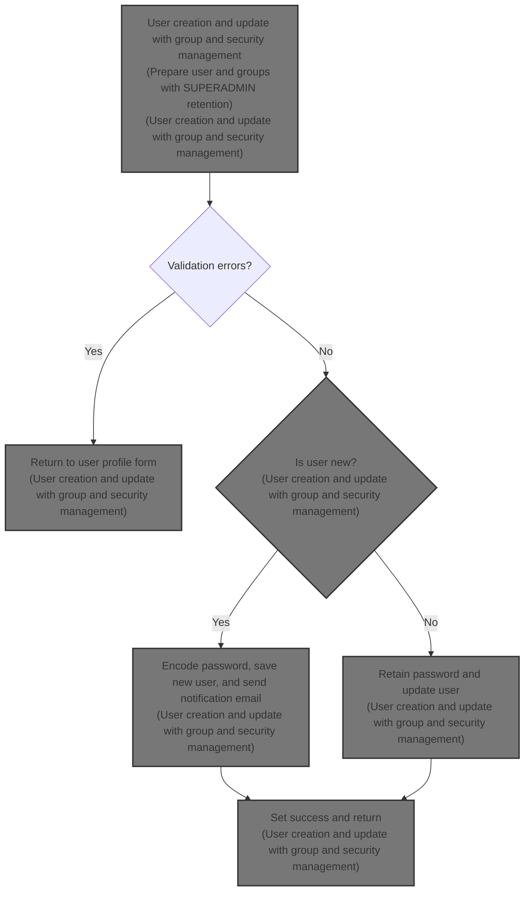
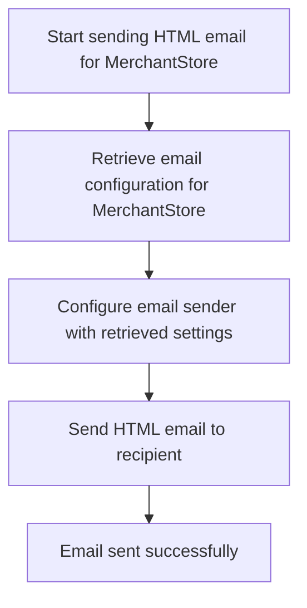

This document explains the flow of managing user creation and updates within the admin interface. It covers validating user data, assigning groups with special rules for the SUPERADMIN group, handling passwords securely, and sending notification emails to new users.



# User creation and update with group and security management

```mermaid
%%{init: {"flowchart": {"defaultRenderer": "elk"}} }%%
flowchart TD
    node1["Prepare user and groups"] --> node2{"Validation errors?"}
    node2 -->|"Yes"| node6["Return to user profile form"]
    node2 -->|"No"| subgraph loop1["For each submitted group"]
        node1a["Collect group IDs"]
        node1b["Check for SUPERADMIN group"]
        node1a --> node1b
        node1b --> node1a
    end
    loop1 --> node3{"Is user new?"}
    node3 -->|"Yes"| node4["Encode password and save new user"]
    node4 --> node5["Send notification email"]
    node3 -->|"No"| node7["Retain password and update user"]
    node5 --> node8["Set success and return"]
    node7 --> node8["Set success and return"]
    
    click node1 openCode "shopizer/sm-shop/src/main/java/com/salesmanager/web/admin/controller/user/UserController.java:472:506"
    
    click node1a openCode "shopizer/sm-shop/src/main/java/com/salesmanager/web/admin/controller/user/UserController.java:502:506"
    click node1b openCode "shopizer/sm-shop/src/main/java/com/salesmanager/web/admin/controller/user/UserController.java:537:551"
    click node3 openCode "shopizer/sm-shop/src/main/java/com/salesmanager/web/admin/controller/user/UserController.java:577:582"
    click node4 openCode "shopizer/sm-shop/src/main/java/com/salesmanager/web/admin/controller/user/UserController.java:577:582"
    click node5 openCode "shopizer/sm-core/src/main/java/com/salesmanager/core/business/system/service/EmailServiceImpl.java:25:50"
    click node7 openCode "shopizer/sm-shop/src/main/java/com/salesmanager/web/admin/controller/user/UserController.java:577:582"
    click node8 openCode "shopizer/sm-shop/src/main/java/com/salesmanager/web/admin/controller/user/UserController.java:634:636"
classDef HeadingStyle fill:#777777,stroke:#333,stroke-width:2px;
click node2 goToHeading "Configuring and delegating email sending"
node2:::HeadingStyle

%% Swimm:
%% %%{init: {"flowchart": {"defaultRenderer": "elk"}} }%%
%% flowchart TD
%%     node1["Prepare user and groups"] --> node2{"Validation errors?"}
%%     node2 -->|"Yes"| node6["Return to user profile form"]
%%     node2 -->|"No"| subgraph loop1["For each submitted group"]
%%         node1a["Collect group IDs"]
%%         node1b["Check for SUPERADMIN group"]
%%         node1a --> node1b
%%         node1b --> node1a
%%     end
%%     loop1 --> node3{"Is user new?"}
%%     node3 -->|"Yes"| node4["Encode password and save new user"]
%%     node4 --> node5["Send notification email"]
%%     node3 -->|"No"| node7["Retain password and update user"]
%%     node5 --> node8["Set success and return"]
%%     node7 --> node8["Set success and return"]
%%     
%%     click node1 openCode "<SwmPath>[shopizer/…/user/UserController.java](shopizer/sm-shop/src/main/java/com/salesmanager/web/admin/controller/user/UserController.java)</SwmPath>:472:506"
%%     
%%     click node1a openCode "<SwmPath>[shopizer/…/user/UserController.java](shopizer/sm-shop/src/main/java/com/salesmanager/web/admin/controller/user/UserController.java)</SwmPath>:502:506"
%%     click node1b openCode "<SwmPath>[shopizer/…/user/UserController.java](shopizer/sm-shop/src/main/java/com/salesmanager/web/admin/controller/user/UserController.java)</SwmPath>:537:551"
%%     click node3 openCode "<SwmPath>[shopizer/…/user/UserController.java](shopizer/sm-shop/src/main/java/com/salesmanager/web/admin/controller/user/UserController.java)</SwmPath>:577:582"
%%     click node4 openCode "<SwmPath>[shopizer/…/user/UserController.java](shopizer/sm-shop/src/main/java/com/salesmanager/web/admin/controller/user/UserController.java)</SwmPath>:577:582"
%%     click node5 openCode "<SwmPath>[shopizer/…/service/EmailServiceImpl.java](shopizer/sm-core/src/main/java/com/salesmanager/core/business/system/service/EmailServiceImpl.java)</SwmPath>:25:50"
%%     click node7 openCode "<SwmPath>[shopizer/…/user/UserController.java](shopizer/sm-shop/src/main/java/com/salesmanager/web/admin/controller/user/UserController.java)</SwmPath>:577:582"
%%     click node8 openCode "<SwmPath>[shopizer/…/user/UserController.java](shopizer/sm-shop/src/main/java/com/salesmanager/web/admin/controller/user/UserController.java)</SwmPath>:634:636"
%% classDef HeadingStyle fill:#777777,stroke:#333,stroke-width:2px;
%% click node2 goToHeading "Configuring and delegating email sending"
%% node2:::HeadingStyle
```

This section manages user creation and update processes including group assignment and security management, ensuring proper validation, password handling, and notification.

| Category        | Rule Name                             | Description                                                                                                                     |
| --------------- | ------------------------------------- | ------------------------------------------------------------------------------------------------------------------------------- |
| Data validation | User validation                       | User data must pass validation checks before any save or update operation is performed.                                         |
| Data validation | User ID consistency                   | When updating a user, the submitted user ID must match the existing database record to prevent unauthorized changes.            |
| Business logic  | Superadmin group protection           | The SUPERADMIN group cannot be removed from a user if they already belong to it.                                                |
| Business logic  | Group assignment                      | User groups must be assigned based on submitted group IDs, including any mandatory groups like SUPERADMIN.                      |
| Business logic  | Password encoding for new users       | Passwords for new users must be encoded before saving to ensure security.                                                       |
| Business logic  | Password retention for existing users | Existing users retain their current encoded password when updated, without re-encoding.                                         |
| Business logic  | New user notification                 | A notification email must be sent to new users upon successful creation, containing login credentials and relevant information. |

<SwmSnippet path="/shopizer/sm-shop/src/main/java/com/salesmanager/web/admin/controller/user/UserController.java" line="472">

---

In <SwmToken path="shopizer/sm-shop/src/main/java/com/salesmanager/web/admin/controller/user/UserController.java" pos="472:5:5" line-data="	public String saveUser(@Valid @ModelAttribute(&quot;user&quot;) User user, BindingResult result, Model model, HttpServletRequest request, Locale locale) throws Exception {">`saveUser`</SwmToken> we start by setting up the menu and populating user-related data. We then handle user groups by extracting their IDs and making sure the 'SUPERADMIN' group can't be removed if the user already has it. The function assumes certain fields in the User object are non-null and that group names can be parsed as IDs. This setup is more complex than just saving a user, as it also prepares data for validation and security.

```java
	public String saveUser(@Valid @ModelAttribute("user") User user, BindingResult result, Model model, HttpServletRequest request, Locale locale) throws Exception {


		setMenu(model,request);
		
		MerchantStore store = (MerchantStore)request.getAttribute(Constants.ADMIN_STORE);

		
		this.populateUserObjects(user, store, model, locale);
		
		Language language = user.getDefaultLanguage();
		
		Language l = languageService.getById(language.getId());
		
		user.setDefaultLanguage(l);
		
		Locale userLocale = LocaleUtils.getLocale(l);
		
		
		
		User dbUser = null;
		
		//edit mode, need to get original user important information
		if(user.getId()!=null) {
			dbUser = userService.getByUserName(user.getAdminName());
			if(dbUser==null) {
				return "redirect://admin/users/displayUser.html";
			}
		}

		List<Group> submitedGroups = user.getGroups();
		Set<Integer> ids = new HashSet<Integer>();
		for(Group group : submitedGroups) {
			ids.add(Integer.parseInt(group.getGroupName()));
		}
```

---

</SwmSnippet>

<SwmSnippet path="/shopizer/sm-shop/src/main/java/com/salesmanager/web/admin/controller/user/UserController.java" line="537">

---

Next we confirm the user ID matches the database and locate the 'SUPERADMIN' group to keep it in the user's groups.

```java
		Group superAdmin = null;
		
		if(user.getId()!=null && user.getId()>0) {
			if(user.getId().longValue()!=dbUser.getId().longValue()) {
				return "redirect://admin/users/displayUser.html";
			}
			
			List<Group> groups = dbUser.getGroups();
			//boolean removeSuperAdmin = true;
			for(Group group : groups) {
				//can't revoke super admin
				if(group.getGroupName().equals("SUPERADMIN")) {
					superAdmin = group;
				}
			}
```

---

</SwmSnippet>

<SwmSnippet path="/shopizer/sm-shop/src/main/java/com/salesmanager/web/admin/controller/user/UserController.java" line="562">

---

Here we add back the 'SUPERADMIN' group if found, convert group IDs to actual groups, and set them on the user. We handle password encoding differently for new and existing users. If it's a new user, we save them and send a welcome email using the email service. Otherwise, we just update the user.

```java
		if(superAdmin!=null) {
			ids.add(superAdmin.getId());
		}

		
		List<Group> newGroups = groupService.listGroupByIds(ids);

		//set actual user groups
		user.setGroups(newGroups);
		
		if (result.hasErrors()) {
			return ControllerConstants.Tiles.User.profile;
		}
		
		String decodedPassword = user.getAdminPassword();
		if(user.getId()!=null && user.getId()>0) {
			user.setAdminPassword(dbUser.getAdminPassword());
		} else {
			String encoded = passwordEncoder.encodePassword(user.getAdminPassword(),null);
			user.setAdminPassword(encoded);
		}
		
		
		if(user.getId()==null || user.getId().longValue()==0) {
			
			//save or update user
			userService.saveOrUpdate(user);
			
			try {

				//creation of a user, send an email
				String userName = user.getFirstName();
				if(StringUtils.isBlank(userName)) {
					userName = user.getAdminName();
				}
				String[] userNameArg = {userName};
				
				
				Map<String, String> templateTokens = EmailUtils.createEmailObjectsMap(request.getContextPath(), store, messages, userLocale);
				templateTokens.put(EmailConstants.EMAIL_NEW_USER_TEXT, messages.getMessage("email.greeting", userNameArg, userLocale));
				templateTokens.put(EmailConstants.EMAIL_USER_FIRSTNAME, user.getFirstName());
				templateTokens.put(EmailConstants.EMAIL_USER_LASTNAME, user.getLastName());
				templateTokens.put(EmailConstants.EMAIL_ADMIN_USERNAME_LABEL, messages.getMessage("label.generic.username",userLocale));
				templateTokens.put(EmailConstants.EMAIL_ADMIN_NAME, user.getAdminName());
				templateTokens.put(EmailConstants.EMAIL_TEXT_NEW_USER_CREATED, messages.getMessage("email.newuser.text",userLocale));
				templateTokens.put(EmailConstants.EMAIL_ADMIN_PASSWORD_LABEL, messages.getMessage("label.generic.password",userLocale));
				templateTokens.put(EmailConstants.EMAIL_ADMIN_PASSWORD, decodedPassword);
				templateTokens.put(EmailConstants.EMAIL_ADMIN_URL_LABEL, messages.getMessage("label.adminurl",userLocale));
				templateTokens.put(EmailConstants.EMAIL_ADMIN_URL, FilePathUtils.buildAdminUri(store, request));
	
				
				Email email = new Email();
				email.setFrom(store.getStorename());
				email.setFromEmail(store.getStoreEmailAddress());
				email.setSubject(messages.getMessage("email.newuser.title",userLocale));
				email.setTo(user.getAdminEmail());
				email.setTemplateName(NEW_USER_TMPL);
				email.setTemplateTokens(templateTokens);
	
	
				
				emailService.sendHtmlEmail(store, email);
			
			} catch (Exception e) {
				LOGGER.error("Cannot send email to user",e);
			}
			
		} else {
			//save or update user
			userService.saveOrUpdate(user);
		}

```

---

</SwmSnippet>

## Configuring and delegating email sending



This section describes the process of configuring and delegating the sending of HTML emails for a <SwmToken path="shopizer/sm-shop/src/main/java/com/salesmanager/web/admin/controller/user/UserController.java" pos="477:1:1" line-data="		MerchantStore store = (MerchantStore)request.getAttribute(Constants.ADMIN_STORE);">`MerchantStore`</SwmToken> in the Shopizer platform.

| Category       | Rule Name                          | Description                                                                                                                                                                                                                                                                                                                                              |
| -------------- | ---------------------------------- | -------------------------------------------------------------------------------------------------------------------------------------------------------------------------------------------------------------------------------------------------------------------------------------------------------------------------------------------------------- |
| Business logic | Store-specific email configuration | The system must retrieve the correct email configuration specific to the <SwmToken path="shopizer/sm-shop/src/main/java/com/salesmanager/web/admin/controller/user/UserController.java" pos="477:1:1" line-data="		MerchantStore store = (MerchantStore)request.getAttribute(Constants.ADMIN_STORE);">`MerchantStore`</SwmToken> before sending any email. |
| Business logic | Email sender configuration         | The email sender must be configured with the retrieved email configuration before dispatching the email.                                                                                                                                                                                                                                                 |
| Business logic | HTML email format enforcement      | Only HTML formatted emails are sent using this process to ensure consistent email presentation.                                                                                                                                                                                                                                                          |
| Business logic | Email send confirmation            | The system must confirm successful sending of the email after the send operation completes.                                                                                                                                                                                                                                                              |

<SwmSnippet path="/shopizer/sm-core/src/main/java/com/salesmanager/core/business/system/service/EmailServiceImpl.java" line="25">

---

In <SwmToken path="shopizer/sm-core/src/main/java/com/salesmanager/core/business/system/service/EmailServiceImpl.java" pos="25:5:5" line-data="	public void sendHtmlEmail(MerchantStore store, Email email) throws ServiceException, Exception {">`sendHtmlEmail`</SwmToken> we get the email config for the store, set it on the sender, then call the sender's send method to actually dispatch the email. This splits config setup from sending.

```java
	public void sendHtmlEmail(MerchantStore store, Email email) throws ServiceException, Exception {

		EmailConfig emailConfig = getEmailConfiguration(store);
		
		sender.setEmailConfig(emailConfig);
		sender.send(email);
	}
```

---

</SwmSnippet>

## Preparing and sending HTML emails with templates

This section describes the process of preparing and sending HTML emails using templates in the Shopizer platform. It involves extracting email details, loading and processing FreeMarker templates for both text and HTML content, and setting up a multipart email message before sending.

| Category       | Rule Name                 | Description                                                                                                                          |
| -------------- | ------------------------- | ------------------------------------------------------------------------------------------------------------------------------------ |
| Business logic | Multipart email content   | Emails must include both plain text and HTML versions of the content to ensure compatibility with different email clients.           |
| Business logic | Template token processing | Email templates must be processed with dynamic tokens to personalize the content for each recipient.                                 |
| Business logic | Sender identification     | The sender's email address and display name must be correctly set in the email header to ensure proper identification of the sender. |

<SwmSnippet path="/shopizer/sm-core/src/main/java/com/salesmanager/core/modules/email/HtmlEmailSenderImpl.java" line="40">

---

In <SwmToken path="shopizer/sm-core/src/main/java/com/salesmanager/core/modules/email/HtmlEmailSenderImpl.java" pos="40:5:5" line-data="	public void send(Email email)">`send`</SwmToken> we start by extracting email details and preparing a multipart message. We load FreeMarker templates for text and HTML, process them with tokens, and set them as parts of the email. This sets up the email content before sending.

```java
	public void send(Email email)
			throws Exception {
		
		final String eml = email.getFrom();
		final String from = email.getFromEmail();
		final String to = email.getTo();
		final String subject = email.getSubject();
		final String tmpl = email.getTemplateName();
		final Map<String,String> templateTokens = email.getTemplateTokens();

		MimeMessagePreparator preparator = new MimeMessagePreparator() {
			public void prepare(MimeMessage mimeMessage)
					throws MessagingException, IOException {
				
				JavaMailSenderImpl impl = (JavaMailSenderImpl)mailSender;
				// if email configuration is present in Database, use the same
				if(emailConfig != null) {
					impl.setProtocol(emailConfig.getProtocol());
					impl.setHost(emailConfig.getHost());
					impl.setPort(Integer.parseInt(emailConfig.getPort()));
					impl.setUsername(emailConfig.getUsername());
					impl.setPassword(emailConfig.getPassword());
					
					Properties prop = new Properties();
					prop.put("mail.smtp.auth", emailConfig.isSmtpAuth());
					prop.put("mail.smtp.starttls.enable", emailConfig.isStarttls());
					impl.setJavaMailProperties(prop);
				}
				
				mimeMessage.setRecipient(Message.RecipientType.TO, new InternetAddress(to));

				InternetAddress inetAddress = new InternetAddress();

				inetAddress.setPersonal(eml);
				inetAddress.setAddress(from);

				mimeMessage.setFrom(inetAddress);
				mimeMessage.setSubject(subject);

				Multipart mp = new MimeMultipart("alternative");

				// Create a "text" Multipart message
				BodyPart textPart = new MimeBodyPart();
				freemarkerMailConfiguration.setClassForTemplateLoading(HtmlEmailSenderImpl.class, "/");
				Template textTemplate = freemarkerMailConfiguration.getTemplate(new StringBuilder(TEMPLATE_PATH).append("").append("/").append(tmpl).toString());
				final StringWriter textWriter = new StringWriter();
				try {
					textTemplate.process(templateTokens, textWriter);
				} catch (TemplateException e) {
					throw new MailPreparationException(
							"Can't generate text mail", e);
				}
				textPart.setDataHandler(new javax.activation.DataHandler(
						new javax.activation.DataSource() {
							public InputStream getInputStream()
									throws IOException {
								//return new StringBufferInputStream(textWriter
								//		.toString());
								return new ByteArrayInputStream(textWriter
										.toString().getBytes(CHARSET));
							}

							public OutputStream getOutputStream()
									throws IOException {
								throw new IOException("Read-only data");
							}

							public String getContentType() {
								return "text/plain";
							}

							public String getName() {
								return "main";
							}
						}));
				mp.addBodyPart(textPart);

				// Create a "HTML" Multipart message
				Multipart htmlContent = new MimeMultipart("related");
				BodyPart htmlPage = new MimeBodyPart();
				freemarkerMailConfiguration.setClassForTemplateLoading(HtmlEmailSenderImpl.class, "/");
				Template htmlTemplate = freemarkerMailConfiguration.getTemplate(new StringBuilder(TEMPLATE_PATH).append("").append("/").append(tmpl).toString());
				final StringWriter htmlWriter = new StringWriter();
				try {
					htmlTemplate.process(templateTokens, htmlWriter);
				} catch (TemplateException e) {
					throw new MailPreparationException(
							"Can't generate HTML mail", e);
				}
```

---

</SwmSnippet>

### Order processing logic

Order processing logic manages the flow and rules for handling customer orders from initiation to completion.

| Category        | Rule Name                  | Description                                                                                               |
| --------------- | -------------------------- | --------------------------------------------------------------------------------------------------------- |
| Data validation | Minimum order items        | An order must contain at least one item to be processed.                                                  |
| Business logic  | Payment authorization      | Payment must be successfully authorized before the order status is updated to confirmed.                  |
| Business logic  | Stock availability check   | Orders with out-of-stock items must be flagged and cannot proceed to shipping until stock is replenished. |
| Business logic  | Shipping post-confirmation | Shipping instructions must be generated only after order confirmation and payment authorization.          |
| Technical step  | Unique order ID            | Orders must be assigned a unique identifier upon creation for tracking and reference.                     |

See <SwmLink doc-title="Order processing and payment flow">[Order processing and payment flow](.swm%5Corder-processing-and-payment-flow.gvx8t239.sw.md)</SwmLink>

### Finalizing and sending the email message

<SwmSnippet path="/shopizer/sm-core/src/main/java/com/salesmanager/core/modules/email/HtmlEmailSenderImpl.java" line="129">

---

This part finalizes the HTML email content and sends it after order processing.

```java
				htmlPage.setDataHandler(new javax.activation.DataHandler(
						new javax.activation.DataSource() {
							public InputStream getInputStream()
									throws IOException {
								//return new StringBufferInputStream(htmlWriter
								//		.toString());
								return new ByteArrayInputStream(textWriter
										.toString().getBytes(CHARSET));
							}

							public OutputStream getOutputStream()
									throws IOException {
								throw new IOException("Read-only data");
							}

							public String getContentType() {
								return "text/html";
							}

							public String getName() {
								return "main";
							}
						}));
				htmlContent.addBodyPart(htmlPage);
				BodyPart htmlPart = new MimeBodyPart();
				htmlPart.setContent(htmlContent);
				mp.addBodyPart(htmlPart);

				mimeMessage.setContent(mp);

				// if(attachment!=null) {
				// MimeMessageHelper messageHelper = new
				// MimeMessageHelper(mimeMessage, true);
				// messageHelper.addAttachment(attachmentFileName, attachment);
				// }

			}
		};

		mailSender.send(preparator);
	}
```

---

</SwmSnippet>

## Completing user save with success feedback

<SwmSnippet path="/shopizer/sm-shop/src/main/java/com/salesmanager/web/admin/controller/user/UserController.java" line="634">

---

After sending the email, this snippet adds a success flag to the model and returns the profile view to confirm the operation.

```java
		model.addAttribute("success","success");
		return ControllerConstants.Tiles.User.profile;
	}
```

---

</SwmSnippet>

&nbsp;

*This is an auto-generated document by Swimm 🌊 and has not yet been verified by a human*

<SwmMeta version="3.0.0" repo-id="Z2l0aHViJTNBJTNBU2hvcGl6ZXIlM0ElM0F1bWFsaW5nYXN3YW1p" repo-name="Shopizer"><sup>Powered by [Swimm](https://app.swimm.io/)</sup></SwmMeta>
