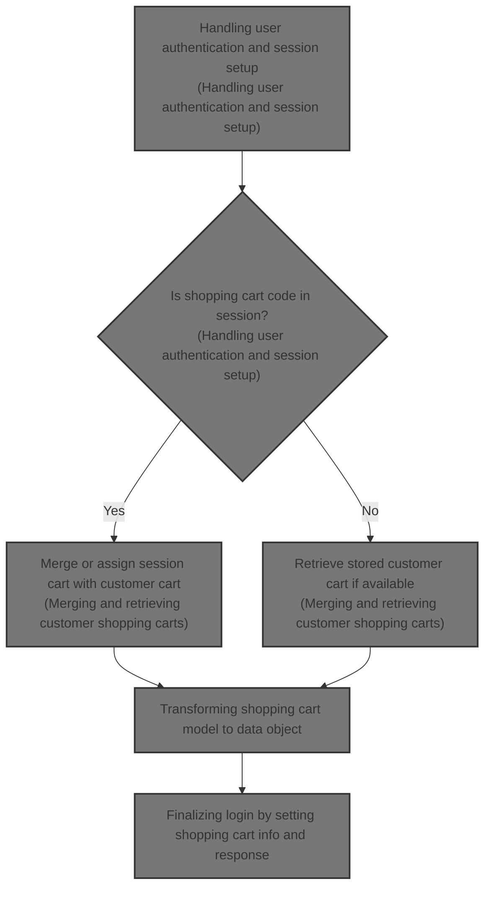
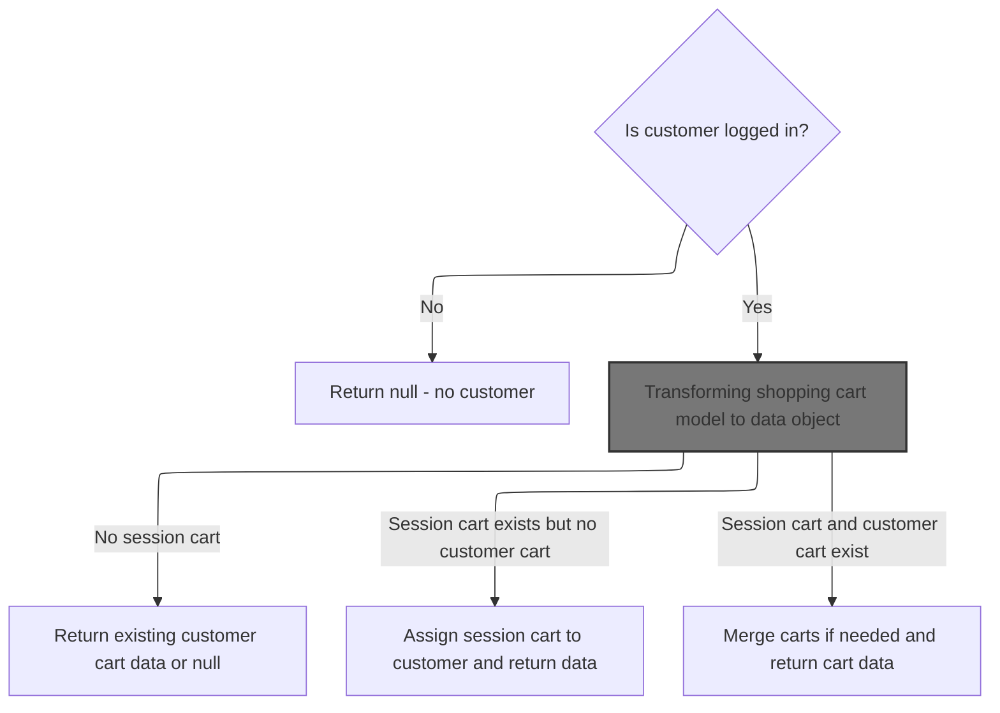
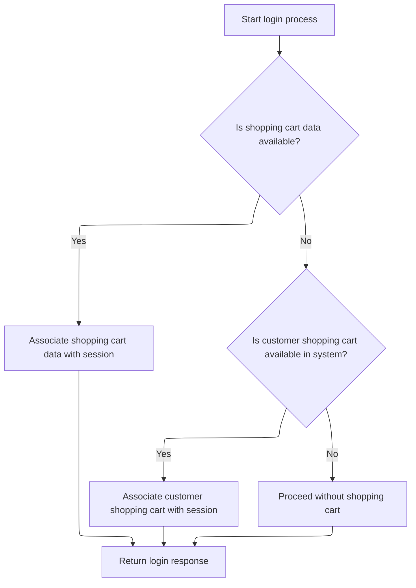

This document describes the flow of user authentication and session setup. When a user logs in, the system verifies their credentials and sets their customer information in the session. It manages the shopping cart by merging any existing session cart with the customer's stored cart or retrieving the stored cart if no session cart exists. The flow outputs the authentication status and the shopping cart information for the session.



# Handling user authentication and session setup

This section handles user authentication and session setup by verifying user credentials, setting the customer in the session, and managing the shopping cart by merging session cart data with stored cart data.

| Category       | Rule Name               | Description                                                                                                                            |
| -------------- | ----------------------- | -------------------------------------------------------------------------------------------------------------------------------------- |
| Business logic | User authentication     | Authenticate the user by verifying the username exists for the given store and the password matches the stored credentials.            |
| Business logic | Session customer setup  | Set the authenticated customer in the session to maintain user state across requests.                                                  |
| Business logic | Shopping cart merge     | If a shopping cart code exists in the session, merge the session cart with the customer's stored cart to preserve shopping selections. |
| Business logic | Shopping cart retrieval | If no session shopping cart code exists, retrieve the customer's stored shopping cart for session use.                                 |

<SwmSnippet path="/shopizer/sm-shop/src/main/java/com/salesmanager/web/shop/controller/customer/CustomerLoginController.java" line="60">

---

In <SwmToken path="shopizer/sm-shop/src/main/java/com/salesmanager/web/shop/controller/customer/CustomerLoginController.java" pos="60:8:8" line-data="	public @ResponseBody String logon(@ModelAttribute SecuredCustomer securedCustomer, HttpServletRequest request, HttpServletResponse response) throws Exception {">`logon`</SwmToken>, the function starts by getting the store and language from the request attributes, which are needed to find the customer and handle the cart. It authenticates the user, sets the customer in the session, then checks if there's a shopping cart code in the session. If there is, it calls <SwmToken path="shopizer/sm-shop/src/main/java/com/salesmanager/web/shop/controller/customer/CustomerLoginController.java" pos="90:8:8" line-data="	            ShoppingCartData shoppingCartData= customerFacade.mergeCart( customerModel, sessionShoppingCartCode, store, language );">`mergeCart`</SwmToken> to combine the session cart with the customer's stored cart, or just retrieves the stored cart if no session cart exists. Constants are used to keep session keys and response statuses consistent.

```java
	public @ResponseBody String logon(@ModelAttribute SecuredCustomer securedCustomer, HttpServletRequest request, HttpServletResponse response) throws Exception {
		
        AjaxResponse jsonObject=new AjaxResponse();
        

        try {

        	LOG.debug("Authenticating user " + securedCustomer.getUserName());
        	
        	//user goes to shop filter first so store and language are set
        	MerchantStore store = (MerchantStore)request.getAttribute(Constants.MERCHANT_STORE);
        	Language language = (Language)request.getAttribute("LANGUAGE");

            //check if username is from the appropriate store
            Customer customerModel = customerFacade.getCustomerByUserName(securedCustomer.getUserName(), store);
            if(customerModel==null) {
            	jsonObject.setStatus(AjaxResponse.RESPONSE_STATUS_FAIURE);
            	return jsonObject.toJSONString();
            }
            customerFacade.authenticate(customerModel, securedCustomer.getUserName(), securedCustomer.getPassword());
            //set customer in the http session
            super.setSessionAttribute(Constants.CUSTOMER, customerModel, request);
            jsonObject.setStatus(AjaxResponse.RESPONSE_STATUS_SUCCESS);


            
            
            LOG.info( "Fetching and merging Shopping Cart data" );
            final String sessionShoppingCartCode= (String)request.getSession().getAttribute( Constants.SHOPPING_CART );
            if(!StringUtils.isBlank(sessionShoppingCartCode)) {
	            ShoppingCartData shoppingCartData= customerFacade.mergeCart( customerModel, sessionShoppingCartCode, store, language );
	
	
```

---

</SwmSnippet>

## Merging and retrieving customer shopping carts



This section handles the merging and retrieval of customer shopping carts, ensuring that the correct cart data is returned based on the customer's login status and the existence of session and customer carts.

| Category        | Rule Name                               | Description                                                                                                                                                                                      |
| --------------- | --------------------------------------- | ------------------------------------------------------------------------------------------------------------------------------------------------------------------------------------------------ |
| Data validation | Customer login check                    | If the customer is not logged in, no shopping cart data is returned.                                                                                                                             |
| Data validation | Return null for cart ownership conflict | If the session cart belongs to a different customer than the logged-in user, no cart data is returned to prevent unauthorized access.                                                            |
| Business logic  | Assign session cart to customer         | If a session cart exists without an associated customer cart and the session cart does not belong to any customer, it is assigned to the logged-in customer.                                     |
| Business logic  | Merge carts when both exist             | If both a session cart and a customer cart exist, and the session cart does not belong to any customer or belongs to the logged-in customer but has a different cart code, the carts are merged. |
| Business logic  | Return existing customer cart           | If no session cart ID is provided but a customer cart exists, the existing customer cart data is returned.                                                                                       |

<SwmSnippet path="/shopizer/sm-shop/src/main/java/com/salesmanager/web/shop/controller/customer/facade/CustomerFacadeImpl.java" line="173">

---

<SwmToken path="shopizer/sm-shop/src/main/java/com/salesmanager/web/shop/controller/customer/facade/CustomerFacadeImpl.java" pos="173:5:5" line-data="    public ShoppingCartData mergeCart( final Customer customerModel, final String sessionShoppingCartId ,final MerchantStore store,final Language language)">`mergeCart`</SwmToken> assigns or merges carts based on ownership

```java
    public ShoppingCartData mergeCart( final Customer customerModel, final String sessionShoppingCartId ,final MerchantStore store,final Language language)
        throws Exception
    {

        LOG.debug( "Starting merge cart process" );
        if(customerModel != null){
            ShoppingCart customerCart = shoppingCartService.getByCustomer( customerModel );
            if(StringUtils.isNotBlank( sessionShoppingCartId )){
	            ShoppingCart sessionShoppingCart = shoppingCartService.getByCode( sessionShoppingCartId, store );
	            if(sessionShoppingCart != null){
	               if(customerCart == null){
	            	   if(sessionShoppingCart.getCustomerId()==null) {//saved shopping cart does not belong to a customer
		                   LOG.debug( "Not able to find any shoppingCart with current customer" );
		                   //give it to the customer
		                   sessionShoppingCart.setCustomerId( customerModel.getId() );
		                   shoppingCartService.saveOrUpdate( sessionShoppingCart );
		                   customerCart =shoppingCartService.getById( sessionShoppingCart.getId(), store );
		                   return populateShoppingCartData(customerCart,store,language);
	            	   } else {
	            		   return null;
	            	   }
	               }
	               else{
	                    if(sessionShoppingCart.getCustomerId()==null) {//saved shopping cart does not belong to a customer
	                    	//assign it to logged in user
	                    	LOG.debug( "Customer shopping cart as well session cart is available, merging carts" );
	                    	customerCart=shoppingCartService.mergeShoppingCarts( customerCart, sessionShoppingCart, store );
	                    	customerCart =shoppingCartService.getById( customerCart.getId(), store );
		                    return populateShoppingCartData(customerCart,store,language);
	                    } else {
	                    	if(sessionShoppingCart.getCustomerId().longValue()==customerModel.getId().longValue()) {
	                    		if(!customerCart.getShoppingCartCode().equals(sessionShoppingCart.getShoppingCartCode())) {
		                    		//merge carts
		                    		LOG.info( "Customer shopping cart as well session cart is available" );
		                    		customerCart=shoppingCartService.mergeShoppingCarts( customerCart, sessionShoppingCart, store );
		                    		customerCart =shoppingCartService.getById( customerCart.getId(), store );
		    	                    return populateShoppingCartData(customerCart,store,language);
	                    		} else {
	                    			return populateShoppingCartData(sessionShoppingCart,store,language);
	                    		}
	                    	} else {
	                    		//the saved cart belongs to another user
	                    		return null;
	                    	}
	                    }
	            	    
	                    
	              }
	            }
            }
            else{
                 if(customerCart !=null){
                     return populateShoppingCartData(customerCart,store,language);
                 }
                 return null;

            }
        }
```

---

</SwmSnippet>

### Transforming shopping cart model to data object

This section describes the transformation of the internal <SwmToken path="shopizer/sm-shop/src/main/java/com/salesmanager/web/shop/controller/customer/CustomerLoginController.java" pos="99:1:1" line-data="	            ShoppingCart cartModel = shoppingCartService.getByCustomer(customerModel);">`ShoppingCart`</SwmToken> model into a client-ready data object that includes pricing and calculations.

| Category       | Rule Name                    | Description                                                                                                                                          |
| -------------- | ---------------------------- | ---------------------------------------------------------------------------------------------------------------------------------------------------- |
| Business logic | Cart data transformation     | The shopping cart must be transformed into a data object that includes all relevant pricing and calculation details before being sent to the client. |
| Business logic | Accurate pricing calculation | The shopping cart data object must be prepared with pricing and calculation services to ensure all monetary values are accurate and up to date.      |

<SwmSnippet path="/shopizer/sm-shop/src/main/java/com/salesmanager/web/shop/controller/customer/facade/CustomerFacadeImpl.java" line="237">

---

<SwmToken path="shopizer/sm-shop/src/main/java/com/salesmanager/web/shop/controller/customer/facade/CustomerFacadeImpl.java" pos="237:5:5" line-data="    private ShoppingCartData populateShoppingCartData(final ShoppingCart cartModel , final MerchantStore store, final Language language){">`populateShoppingCartData`</SwmToken> uses <SwmToken path="shopizer/sm-shop/src/main/java/com/salesmanager/web/shop/controller/customer/facade/CustomerFacadeImpl.java" pos="239:1:1" line-data="        ShoppingCartDataPopulator shoppingCartDataPopulator = new ShoppingCartDataPopulator();">`ShoppingCartDataPopulator`</SwmToken> to convert the internal <SwmToken path="shopizer/sm-shop/src/main/java/com/salesmanager/web/shop/controller/customer/facade/CustomerFacadeImpl.java" pos="237:9:9" line-data="    private ShoppingCartData populateShoppingCartData(final ShoppingCart cartModel , final MerchantStore store, final Language language){">`ShoppingCart`</SwmToken> model into a data object that includes pricing and calculations. It catches conversion errors and logs them, returning null if conversion fails. This step prepares the cart data for client use.

```java
    private ShoppingCartData populateShoppingCartData(final ShoppingCart cartModel , final MerchantStore store, final Language language){

        ShoppingCartDataPopulator shoppingCartDataPopulator = new ShoppingCartDataPopulator();
        shoppingCartDataPopulator.setShoppingCartCalculationService( shoppingCartCalculationService );
        shoppingCartDataPopulator.setPricingService( pricingService );
        try
        {
            return shoppingCartDataPopulator.populate(  cartModel ,  store,  language);
        }
        catch ( ConversionException ce )
        {
           LOG.error( "Error in converting shopping cart to shopping cart data", ce );

        }
        return null;
    }
```

---

</SwmSnippet>

### Handling null returns and finalizing cart merge

This section handles the scenario where null values are returned during the cart merging process and ensures the cart merge operation is finalized correctly.

| Category       | Rule Name          | Description                                                                                                                     |
| -------------- | ------------------ | ------------------------------------------------------------------------------------------------------------------------------- |
| Business logic | Cart consolidation | The cart merge operation must finalize by consolidating all items from the source carts into a single cart without duplication. |

See <SwmLink doc-title="Populating Shopping Cart Data Flow">[Populating Shopping Cart Data Flow](.swm%5Cpopulating-shopping-cart-data-flow.8dnofwqy.sw.md)</SwmLink>

### Handling null returns and finalizing cart merge

<SwmSnippet path="/shopizer/sm-shop/src/main/java/com/salesmanager/web/shop/controller/customer/facade/CustomerFacadeImpl.java" line="231">

---

After trying to merge or find a cart, if none is found, the function logs an error and returns null. This signals the calling code that no cart is available for the customer.

```java
        LOG.info( "Seems some issue with system, unable to find any customer after successful authentication" );
        return null;

    }
```

---

</SwmSnippet>

## Finalizing login by setting shopping cart info and response



<SwmSnippet path="/shopizer/sm-shop/src/main/java/com/salesmanager/web/shop/controller/customer/CustomerLoginController.java" line="93">

---

After returning from <SwmToken path="shopizer/sm-shop/src/main/java/com/salesmanager/web/shop/controller/customer/CustomerLoginController.java" pos="90:8:8" line-data="	            ShoppingCartData shoppingCartData= customerFacade.mergeCart( customerModel, sessionShoppingCartCode, store, language );">`mergeCart`</SwmToken>, the function sets the shopping cart code in the session and JSON response if a cart exists. If no session cart was merged, it fetches the customer's cart and sets it. It also handles authentication and other exceptions by setting failure status, then returns the JSON string.

```java
	            if(shoppingCartData !=null){
	                jsonObject.addEntry(Constants.SHOPPING_CART, shoppingCartData.getCode());
	                request.getSession().setAttribute(Constants.SHOPPING_CART, shoppingCartData.getCode());
	            }
            } else {

	            ShoppingCart cartModel = shoppingCartService.getByCustomer(customerModel);
	            if(cartModel!=null) {
	                jsonObject.addEntry( Constants.SHOPPING_CART, cartModel.getShoppingCartCode());
	                request.getSession().setAttribute(Constants.SHOPPING_CART, cartModel.getShoppingCartCode());
	            }
            
            }

            
            
            
            
        } catch (AuthenticationException ex) {
        	jsonObject.setStatus(AjaxResponse.RESPONSE_STATUS_FAIURE);
        } catch(Exception e) {
        	jsonObject.setStatus(AjaxResponse.RESPONSE_STATUS_FAIURE);
        }
		
        
        return jsonObject.toJSONString();
		
		
	}
```

---

</SwmSnippet>

&nbsp;

*This is an auto-generated document by Swimm 🌊 and has not yet been verified by a human*

<SwmMeta version="3.0.0" repo-id="Z2l0aHViJTNBJTNBU2hvcGl6ZXIlM0ElM0F1bWFsaW5nYXN3YW1p" repo-name="Shopizer"><sup>Powered by [Swimm](https://app.swimm.io/)</sup></SwmMeta>
