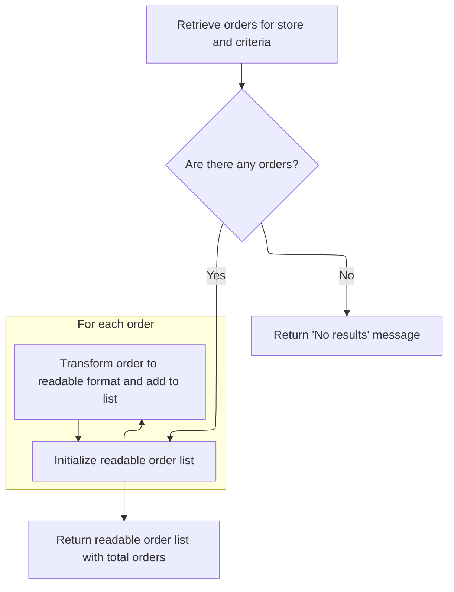

This document describes how customers can view a paginated, localized list of their orders for a specific store, with each order including detailed product information. The flow prepares retrieval criteria, fetches and converts orders, enriches them with product details, and returns the final list for client display.

# Preparing order criteria and delegating to detailed retrieval

This section is responsible for preparing order retrieval criteria based on incoming parameters and delegating the actual retrieval and formatting of orders to a reusable method. It ensures that only the relevant orders for a specific customer and store are fetched, and that the results are paginated and localized.

| Category        | Rule Name                      | Description                                                                                                   |
| --------------- | ------------------------------ | ------------------------------------------------------------------------------------------------------------- |
| Data validation | Pagination limit enforcement   | The number of orders returned in the list must not exceed the maximum count specified by the input parameter. |
| Business logic  | Customer order filtering       | Only orders belonging to the specified customer are included in the results.                                  |
| Business logic  | Pagination start index         | Orders are retrieved starting from the index specified by the start parameter, supporting paginated browsing. |
| Business logic  | Store-specific order retrieval | Orders are retrieved for the specified merchant store only, ensuring store-specific data segregation.         |
| Business logic  | Order list localization        | Order details are presented in the language specified by the input parameter, supporting localization.        |

<SwmSnippet path="/shopizer/sm-shop/src/main/java/com/salesmanager/web/shop/controller/order/facade/OrderFacadeImpl.java" line="747">

---

<SwmToken path="shopizer/sm-shop/src/main/java/com/salesmanager/web/shop/controller/order/facade/OrderFacadeImpl.java" pos="747:5:5" line-data="	public ReadableOrderList getReadableOrderList(MerchantStore store,">`getReadableOrderList`</SwmToken> starts the flow by packaging the incoming parameters into an <SwmToken path="shopizer/sm-shop/src/main/java/com/salesmanager/web/shop/controller/order/facade/OrderFacadeImpl.java" pos="750:1:1" line-data="		OrderCriteria criteria = new OrderCriteria();">`OrderCriteria`</SwmToken> object, which sets up pagination and customer filtering. It then hands off to the overloaded <SwmToken path="shopizer/sm-shop/src/main/java/com/salesmanager/web/shop/controller/order/facade/OrderFacadeImpl.java" pos="747:5:5" line-data="	public ReadableOrderList getReadableOrderList(MerchantStore store,">`getReadableOrderList`</SwmToken> method, which does the actual work of fetching and converting orders. This delegation keeps parameter handling clean and lets us reuse the detailed retrieval logic.

```java
	public ReadableOrderList getReadableOrderList(MerchantStore store,
			Customer customer, int start, int maxCount, Language language) throws Exception {
		
		OrderCriteria criteria = new OrderCriteria();
		criteria.setStartIndex(start);
		criteria.setMaxCount(maxCount);
		criteria.setCustomerId(customer.getId());

		return this.getReadableOrderList(criteria, store, language);
		
	}
```

---

</SwmSnippet>

# Fetching and converting orders for client consumption



This section is responsible for fetching orders based on store and criteria, converting them into a format suitable for client display, and handling cases where no orders are found.

| Category        | Rule Name                    | Description                                                                                                                                                                |
| --------------- | ---------------------------- | -------------------------------------------------------------------------------------------------------------------------------------------------------------------------- |
| Data validation | Order Count Accuracy         | The total number of orders returned must reflect the actual count of orders matching the criteria for the store.                                                           |
| Business logic  | No Orders Message            | If no orders are found for the given store and criteria, the response must indicate zero total orders and include a message stating 'No results for store code \[store\]'. |
| Business logic  | Order Conversion Requirement | Each order retrieved must be converted into a readable format suitable for client consumption before being included in the response.                                       |
| Business logic  | Order List Enrichment        | Before returning the final readable order list, additional enrichment or logic may be applied to the list to ensure completeness and business relevance.                   |

<SwmSnippet path="/shopizer/sm-shop/src/main/java/com/salesmanager/web/shop/controller/order/facade/OrderFacadeImpl.java" line="858">

---

We grab the orders, convert them for the client, and if there are none, we bail out with null. Otherwise, we hand off to another method for final tweaks.

```java
    private ReadableOrderList getReadableOrderList(OrderCriteria criteria, MerchantStore store, Language language) throws Exception {
		
		OrderList orderList = orderService.listByStore(store, criteria);
		
		ReadableOrderPopulator orderPopulator = new ReadableOrderPopulator();
		Locale locale = LocaleUtils.getLocale(language);
		orderPopulator.setLocale(locale);
		
		List<Order> orders = orderList.getOrders();
		ReadableOrderList returnList = new ReadableOrderList();
		
		if(CollectionUtils.isEmpty(orders)) {
			returnList.setTotal(0);
			returnList.setMessage("No results for store code " + store);
			return null;
		}

		List<ReadableOrder> readableOrders = new ArrayList<ReadableOrder>();
		for (Order order : orders) {
			ReadableOrder readableOrder = new ReadableOrder();
			orderPopulator.populate(order,readableOrder,store,language);
			readableOrders.add(readableOrder);
			
		}
```

---

</SwmSnippet>

<SwmSnippet path="/shopizer/sm-shop/src/main/java/com/salesmanager/web/shop/controller/order/facade/OrderFacadeImpl.java" line="883">

---

After building up the <SwmToken path="shopizer/sm-shop/src/main/java/com/salesmanager/web/shop/controller/order/facade/OrderFacadeImpl.java" pos="747:3:3" line-data="	public ReadableOrderList getReadableOrderList(MerchantStore store,">`ReadableOrderList`</SwmToken> and setting the total, we skip returning it and instead call <SwmToken path="shopizer/sm-shop/src/main/java/com/salesmanager/web/shop/controller/order/facade/OrderFacadeImpl.java" pos="884:5:5" line-data="		return this.populateOrderList(orderList, store, language);">`populateOrderList`</SwmToken>. This lets us apply any extra logic or enrichment before sending the result back, but it's not clear why we don't just use the list we already built.

```java
		returnList.setTotal(orderList.getTotalCount());
		return this.populateOrderList(orderList, store, language);
    	
    	
	}
```

---

</SwmSnippet>

# Finalizing and enriching the order list

This section is responsible for transforming a raw list of orders into a client-ready format, ensuring each order includes all associated products and relevant details, and handling cases where no orders are present.

| Category       | Rule Name                         | Description                                                                                                                                                            |
| -------------- | --------------------------------- | ---------------------------------------------------------------------------------------------------------------------------------------------------------------------- |
| Business logic | Order conversion and localization | Each order in the input list must be converted into a readable format suitable for client consumption, including localized information based on the provided language. |
| Business logic | Product breakdown enrichment      | Each readable order must include a complete breakdown of all products associated with the order, with detailed information for each product.                           |

<SwmSnippet path="/shopizer/sm-shop/src/main/java/com/salesmanager/web/shop/controller/order/facade/OrderFacadeImpl.java" line="798">

---

In <SwmToken path="shopizer/sm-shop/src/main/java/com/salesmanager/web/shop/controller/order/facade/OrderFacadeImpl.java" pos="798:5:5" line-data="     private ReadableOrderList populateOrderList(final OrderList orderList,final MerchantStore store, final Language language){">`populateOrderList`</SwmToken>, we loop through each order, convert it for client use, and then call <SwmToken path="shopizer/sm-shop/src/main/java/com/salesmanager/web/shop/controller/order/facade/OrderFacadeImpl.java" pos="818:1:1" line-data="                setOrderProductList(order,locale,store,language,readableOrder);">`setOrderProductList`</SwmToken> to attach the full product breakdown. This step is needed to make sure each order includes all its products and their details.

```java
     private ReadableOrderList populateOrderList(final OrderList orderList,final MerchantStore store, final Language language){
        List<Order> orders = orderList.getOrders();
        ReadableOrderList returnList = new ReadableOrderList();
        if(CollectionUtils.isEmpty( orders)){
            LOGGER.info( "Order list if empty..Returning empty list" );
            returnList.setTotal(0);
            returnList.setMessage("No results for store code " + store);
            return null;
        }
        
        ReadableOrderPopulator orderPopulator = new ReadableOrderPopulator();
        Locale locale = LocaleUtils.getLocale(language);
        orderPopulator.setLocale(locale);
        
        List<ReadableOrder> readableOrders = new ArrayList<ReadableOrder>();
        for (Order order : orders) {
            ReadableOrder readableOrder = new ReadableOrder();
            try
            {
                orderPopulator.populate(order,readableOrder,store,language);
                setOrderProductList(order,locale,store,language,readableOrder);
            }
            catch ( ConversionException ex )
            {
                LOGGER.error( "Error while converting order to order data", ex );
                
            }
            readableOrders.add(readableOrder);
            
        }
        
```

---

</SwmSnippet>

## Populating product details for each order

This section ensures that each product in an order is converted into a client-friendly format, with accurate localization and pricing, so customers can view their order details clearly.

| Category        | Rule Name                   | Description                                                                                                             |
| --------------- | --------------------------- | ----------------------------------------------------------------------------------------------------------------------- |
| Data validation | Complete product listing    | All products in the order must be included in the output list, with no omissions.                                       |
| Business logic  | Readable product conversion | Each product in an order must be converted into a readable format that is suitable for client display.                  |
| Business logic  | Product localization        | Product details must be localized according to the customer's locale and language settings.                             |
| Business logic  | Pricing accuracy            | Product pricing must reflect the current pricing rules and be displayed in the correct currency for the merchant store. |

<SwmSnippet path="/shopizer/sm-shop/src/main/java/com/salesmanager/web/shop/controller/order/facade/OrderFacadeImpl.java" line="835">

---

In <SwmToken path="shopizer/sm-shop/src/main/java/com/salesmanager/web/shop/controller/order/facade/OrderFacadeImpl.java" pos="835:5:5" line-data="    private void setOrderProductList(final Order order, final Locale locale,final MerchantStore store, final Language language , final ReadableOrder readableOrder) throws ConversionException{">`setOrderProductList`</SwmToken>, we loop through each product in the order and use a populator to convert it to a readable format, setting up localization and pricing services. This prepares each product for client display.

```java
    private void setOrderProductList(final Order order, final Locale locale,final MerchantStore store, final Language language , final ReadableOrder readableOrder) throws ConversionException{
        List<ReadableOrderProduct> orderProducts = new ArrayList<ReadableOrderProduct>();
        for(OrderProduct p : order.getOrderProducts()) {
            ReadableOrderProductPopulator orderProductPopulator = new ReadableOrderProductPopulator();
            orderProductPopulator.setLocale(locale);
            orderProductPopulator.setProductService(productService);
            orderProductPopulator.setPricingService(pricingService);
            ReadableOrderProduct orderProduct = new ReadableOrderProduct();
            orderProductPopulator.populate(p, orderProduct, store, language);
            
            //image
            
            //attributes
            


            orderProducts.add(orderProduct);
        }
        
```

---

</SwmSnippet>

### Converting internal product data for client use

```mermaid
%%{init: {"flowchart": {"defaultRenderer": "elk"}} }%%
flowchart TD
  node1["Start: Transform cart item to order product"]
  click node1 openCode "shopizer/sm-shop/src/main/java/com/salesmanager/web/populator/order/OrderProductPopulator.java:60:68"
  node1 --> node2{"Is product valid and belongs to store?"}
  click node2 openCode "shopizer/sm-shop/src/main/java/com/salesmanager/web/populator/order/OrderProductPopulator.java:69:76"
  node2 -->|"No"| nodeEnd["Fail: Invalid product"]
  click nodeEnd openCode "shopizer/sm-shop/src/main/java/com/salesmanager/web/populator/order/OrderProductPopulator.java:71:72"
  node2 -->|"Yes"| node3{"Is product digital?"}
  click node3 openCode "shopizer/sm-shop/src/main/java/com/salesmanager/web/populator/order/OrderProductPopulator.java:78:80"
  node3 -->|"Yes"| node4["Setup digital download"]
  click node4 openCode "shopizer/sm-shop/src/main/java/com/salesmanager/web/populator/order/OrderProductPopulator.java:81:87"
  node3 -->|"No"| node6["Transfer basic product info"]
  node4 --> node6
  click node6 openCode "shopizer/sm-shop/src/main/java/com/salesmanager/web/populator/order/OrderProductPopulator.java:89:93"
  node6 --> node7{"Is final price present?"}
  click node7 openCode "shopizer/sm-shop/src/main/java/com/salesmanager/web/populator/order/OrderProductPopulator.java:94:97"
  node7 -->|"No"| nodeEnd2["Fail: Missing final price"]
  click nodeEnd2 openCode "shopizer/sm-shop/src/main/java/com/salesmanager/web/populator/order/OrderProductPopulator.java:96:97"
  node7 -->|"Yes"| node8["Add default price"]
  click node8 openCode "shopizer/sm-shop/src/main/java/com/salesmanager/web/populator/order/OrderProductPopulator.java:99:103"
  node8 --> node9{"Are there additional prices?"}
  click node9 openCode "shopizer/sm-shop/src/main/java/com/salesmanager/web/populator/order/OrderProductPopulator.java:106:107"
  node9 -->|"No"| node12{"Are there attributes?"}
  node9 -->|"Yes"| loop1
  subgraph loop1["For each additional price"]
    node11["Add additional price"]
    click node11 openCode "shopizer/sm-shop/src/main/java/com/salesmanager/web/populator/order/OrderProductPopulator.java:108:112"
  end
  node12{"Are there attributes?"}
  click node12 openCode "shopizer/sm-shop/src/main/java/com/salesmanager/web/populator/order/OrderProductPopulator.java:119:144"
  node12 -->|"No"| node13["Finish: Return order product"]
  click node13 openCode "shopizer/sm-shop/src/main/java/com/salesmanager/web/populator/order/OrderProductPopulator.java:152:153"
  node12 -->|"Yes"| loop2
  subgraph loop2["For each attribute"]
    node14{"Is attribute valid for store?"}
    click node14 openCode "shopizer/sm-shop/src/main/java/com/salesmanager/web/populator/order/OrderProductPopulator.java:126:132"
    node14 -->|"Yes"| node15["Add attribute"]
    click node15 openCode "shopizer/sm-shop/src/main/java/com/salesmanager/web/populator/order/OrderProductPopulator.java:134:141"
    node14 -->|"No"| nodeEnd3["Fail: Invalid attribute"]
    click nodeEnd3 openCode "shopizer/sm-shop/src/main/java/com/salesmanager/web/populator/order/OrderProductPopulator.java:127:128"
  end
  loop2 --> node13
classDef HeadingStyle fill:#777777,stroke:#333,stroke-width:2px;

%% Swimm:
%% %%{init: {"flowchart": {"defaultRenderer": "elk"}} }%%
%% flowchart TD
%%   node1["Start: Transform cart item to order product"]
%%   click node1 openCode "<SwmPath>[shopizer/…/order/OrderProductPopulator.java](shopizer/sm-shop/src/main/java/com/salesmanager/web/populator/order/OrderProductPopulator.java)</SwmPath>:60:68"
%%   node1 --> node2{"Is product valid and belongs to store?"}
%%   click node2 openCode "<SwmPath>[shopizer/…/order/OrderProductPopulator.java](shopizer/sm-shop/src/main/java/com/salesmanager/web/populator/order/OrderProductPopulator.java)</SwmPath>:69:76"
%%   node2 -->|"No"| nodeEnd["Fail: Invalid product"]
%%   click nodeEnd openCode "<SwmPath>[shopizer/…/order/OrderProductPopulator.java](shopizer/sm-shop/src/main/java/com/salesmanager/web/populator/order/OrderProductPopulator.java)</SwmPath>:71:72"
%%   node2 -->|"Yes"| node3{"Is product digital?"}
%%   click node3 openCode "<SwmPath>[shopizer/…/order/OrderProductPopulator.java](shopizer/sm-shop/src/main/java/com/salesmanager/web/populator/order/OrderProductPopulator.java)</SwmPath>:78:80"
%%   node3 -->|"Yes"| node4["Setup digital download"]
%%   click node4 openCode "<SwmPath>[shopizer/…/order/OrderProductPopulator.java](shopizer/sm-shop/src/main/java/com/salesmanager/web/populator/order/OrderProductPopulator.java)</SwmPath>:81:87"
%%   node3 -->|"No"| node6["Transfer basic product info"]
%%   node4 --> node6
%%   click node6 openCode "<SwmPath>[shopizer/…/order/OrderProductPopulator.java](shopizer/sm-shop/src/main/java/com/salesmanager/web/populator/order/OrderProductPopulator.java)</SwmPath>:89:93"
%%   node6 --> node7{"Is final price present?"}
%%   click node7 openCode "<SwmPath>[shopizer/…/order/OrderProductPopulator.java](shopizer/sm-shop/src/main/java/com/salesmanager/web/populator/order/OrderProductPopulator.java)</SwmPath>:94:97"
%%   node7 -->|"No"| nodeEnd2["Fail: Missing final price"]
%%   click nodeEnd2 openCode "<SwmPath>[shopizer/…/order/OrderProductPopulator.java](shopizer/sm-shop/src/main/java/com/salesmanager/web/populator/order/OrderProductPopulator.java)</SwmPath>:96:97"
%%   node7 -->|"Yes"| node8["Add default price"]
%%   click node8 openCode "<SwmPath>[shopizer/…/order/OrderProductPopulator.java](shopizer/sm-shop/src/main/java/com/salesmanager/web/populator/order/OrderProductPopulator.java)</SwmPath>:99:103"
%%   node8 --> node9{"Are there additional prices?"}
%%   click node9 openCode "<SwmPath>[shopizer/…/order/OrderProductPopulator.java](shopizer/sm-shop/src/main/java/com/salesmanager/web/populator/order/OrderProductPopulator.java)</SwmPath>:106:107"
%%   node9 -->|"No"| node12{"Are there attributes?"}
%%   node9 -->|"Yes"| loop1
%%   subgraph loop1["For each additional price"]
%%     node11["Add additional price"]
%%     click node11 openCode "<SwmPath>[shopizer/…/order/OrderProductPopulator.java](shopizer/sm-shop/src/main/java/com/salesmanager/web/populator/order/OrderProductPopulator.java)</SwmPath>:108:112"
%%   end
%%   node12{"Are there attributes?"}
%%   click node12 openCode "<SwmPath>[shopizer/…/order/OrderProductPopulator.java](shopizer/sm-shop/src/main/java/com/salesmanager/web/populator/order/OrderProductPopulator.java)</SwmPath>:119:144"
%%   node12 -->|"No"| node13["Finish: Return order product"]
%%   click node13 openCode "<SwmPath>[shopizer/…/order/OrderProductPopulator.java](shopizer/sm-shop/src/main/java/com/salesmanager/web/populator/order/OrderProductPopulator.java)</SwmPath>:152:153"
%%   node12 -->|"Yes"| loop2
%%   subgraph loop2["For each attribute"]
%%     node14{"Is attribute valid for store?"}
%%     click node14 openCode "<SwmPath>[shopizer/…/order/OrderProductPopulator.java](shopizer/sm-shop/src/main/java/com/salesmanager/web/populator/order/OrderProductPopulator.java)</SwmPath>:126:132"
%%     node14 -->|"Yes"| node15["Add attribute"]
%%     click node15 openCode "<SwmPath>[shopizer/…/order/OrderProductPopulator.java](shopizer/sm-shop/src/main/java/com/salesmanager/web/populator/order/OrderProductPopulator.java)</SwmPath>:134:141"
%%     node14 -->|"No"| nodeEnd3["Fail: Invalid attribute"]
%%     click nodeEnd3 openCode "<SwmPath>[shopizer/…/order/OrderProductPopulator.java](shopizer/sm-shop/src/main/java/com/salesmanager/web/populator/order/OrderProductPopulator.java)</SwmPath>:127:128"
%%   end
%%   loop2 --> node13
%% classDef HeadingStyle fill:#777777,stroke:#333,stroke-width:2px;
```



This section governs the transformation of shopping cart items into order products, ensuring all necessary product, pricing, and attribute data is validated and correctly attached for client consumption.

| Category        | Rule Name                             | Description                                                                                                                                                                       |
| --------------- | ------------------------------------- | --------------------------------------------------------------------------------------------------------------------------------------------------------------------------------- |
| Data validation | Product existence and store ownership | A product must exist and belong to the merchant store before it can be converted for client use. If the product is missing or does not belong to the store, the conversion fails. |
| Data validation | Final price requirement               | The final price must be present for every order product. If missing, the conversion fails and the order product is not created.                                                   |
| Data validation | Attribute validation and attachment   | All product attributes must be validated for existence and store ownership before being attached to the order product. Invalid attributes cause the conversion to fail.           |
| Business logic  | Digital product download setup        | If the product is digital, digital download information must be attached to the order product, including filename, download count, and maximum download days.                     |
| Business logic  | Price attachment                      | The default price and any additional prices must be attached to the order product. All prices must be associated with the product and included in the output.                     |

<SwmSnippet path="/shopizer/sm-shop/src/main/java/com/salesmanager/web/populator/order/OrderProductPopulator.java" line="60">

---

In <SwmToken path="shopizer/sm-shop/src/main/java/com/salesmanager/web/populator/order/OrderProductPopulator.java" pos="60:5:5" line-data="	public OrderProduct populate(ShoppingCartItem source, OrderProduct target,">`populate`</SwmToken>, we validate required services, fetch the product, check if it's digital, and set up download info if needed. We then fill in basic product details, prices, and loop through attributes to attach them. The code assumes descriptions and attribute lists are always non-empty, which could be risky if upstream data is missing.

```java
	public OrderProduct populate(ShoppingCartItem source, OrderProduct target,
			MerchantStore store, Language language) throws ConversionException {
		
		Validate.notNull(productService,"productService must be set");
		Validate.notNull(digitalProductService,"digitalProductService must be set");
		Validate.notNull(productAttributeService,"productAttributeService must be set");

		
		try {
			Product modelProduct = productService.getById(source.getProductId());
			if(modelProduct==null) {
				throw new ConversionException("Cannot get product with id (productId) " + source.getProductId());
			}
			
			if(modelProduct.getMerchantStore().getId().intValue()!=store.getId().intValue()) {
				throw new ConversionException("Invalid product id " + source.getProductId());
			}

			DigitalProduct digitalProduct = digitalProductService.getByProduct(store, modelProduct);
			
			if(digitalProduct!=null) {
				OrderProductDownload orderProductDownload = new OrderProductDownload();	
				orderProductDownload.setOrderProductFilename(digitalProduct.getProductFileName());
				orderProductDownload.setOrderProduct(target);
				orderProductDownload.setDownloadCount(0);
				orderProductDownload.setMaxdays(ApplicationConstants.MAX_DOWNLOAD_DAYS);
				target.getDownloads().add(orderProductDownload);
			}

			target.setOneTimeCharge(source.getItemPrice());	
			target.setProductName(source.getProduct().getDescriptions().iterator().next().getName());
			target.setProductQuantity(source.getQuantity());
			target.setSku(source.getProduct().getSku());
			
			FinalPrice finalPrice = source.getFinalPrice();
			if(finalPrice==null) {
				throw new ConversionException("Object final price not populated in shoppingCartItem (source)");
			}
			//Default price
			OrderProductPrice orderProductPrice = orderProductPrice(finalPrice);
			orderProductPrice.setOrderProduct(target);
			
			Set<OrderProductPrice> prices = new HashSet<OrderProductPrice>();
			prices.add(orderProductPrice);

			//Other prices
			List<FinalPrice> otherPrices = finalPrice.getAdditionalPrices();
			if(otherPrices!=null) {
				for(FinalPrice otherPrice : otherPrices) {
					OrderProductPrice other = orderProductPrice(otherPrice);
					other.setOrderProduct(target);
					prices.add(other);
				}
```

---

</SwmSnippet>

<SwmSnippet path="/shopizer/sm-shop/src/main/java/com/salesmanager/web/populator/order/OrderProductPopulator.java" line="115">

---

Here we attach all attributes to the product, again assuming every attribute and description list has at least one item. If that's not true, things break, so upstream data needs to be solid.

```java
			target.setPrices(prices);
			
			//OrderProductAttribute
			Set<ShoppingCartAttributeItem> attributeItems = source.getAttributes();
			if(!CollectionUtils.isEmpty(attributeItems)) {
				Set<OrderProductAttribute> attributes = new HashSet<OrderProductAttribute>();
				for(ShoppingCartAttributeItem attribute : attributeItems) {
					OrderProductAttribute orderProductAttribute = new OrderProductAttribute();
					orderProductAttribute.setOrderProduct(target);
					Long id = attribute.getProductAttributeId();
					ProductAttribute attr = productAttributeService.getById(id);
					if(attr==null) {
						throw new ConversionException("Attribute id " + id + " does not exists");
					}
					
					if(attr.getProduct().getMerchantStore().getId().intValue()!=store.getId().intValue()) {
						throw new ConversionException("Attribute id " + id + " invalid for this store");
					}
					
					orderProductAttribute.setProductAttributeIsFree(attr.getProductAttributeIsFree());
					orderProductAttribute.setProductAttributeName(attr.getProductOption().getDescriptionsSettoList().get(0).getName());
					orderProductAttribute.setProductAttributeValueName(attr.getProductOptionValue().getDescriptionsSettoList().get(0).getName());
					orderProductAttribute.setProductAttributePrice(attr.getProductAttributePrice());
					orderProductAttribute.setProductAttributeWeight(attr.getProductAttributeWeight());
					orderProductAttribute.setProductOptionId(attr.getProductOption().getId());
					orderProductAttribute.setProductOptionValueId(attr.getProductOptionValue().getId());
					attributes.add(orderProductAttribute);
				}
```

---

</SwmSnippet>

<SwmSnippet path="/shopizer/sm-shop/src/main/java/com/salesmanager/web/populator/order/OrderProductPopulator.java" line="143">

---

After all the validation and data attachment, we return the fully populated <SwmToken path="shopizer/sm-shop/src/main/java/com/salesmanager/web/shop/controller/order/facade/OrderFacadeImpl.java" pos="837:3:3" line-data="        for(OrderProduct p : order.getOrderProducts()) {">`OrderProduct`</SwmToken>, ready for client use with all details included.

```java
				target.setOrderAttributes(attributes);
			}

			
		} catch (Exception e) {
			throw new ConversionException(e);
		}
		
		
		return target;
	}
```

---

</SwmSnippet>

### Attaching populated products to the order

<SwmSnippet path="/shopizer/sm-shop/src/main/java/com/salesmanager/web/shop/controller/order/facade/OrderFacadeImpl.java" line="854">

---

We just got back from the populator, so in OrderFacadeImpl.setOrderProductList, we attach the completed product list to the readable order. Now the order has all its products fully detailed.

```java
        readableOrder.setProducts(orderProducts);
    }
```

---

</SwmSnippet>

## Finalizing and returning the enriched order list

<SwmSnippet path="/shopizer/sm-shop/src/main/java/com/salesmanager/web/shop/controller/order/facade/OrderFacadeImpl.java" line="829">

---

We just finished <SwmToken path="shopizer/sm-shop/src/main/java/com/salesmanager/web/shop/controller/order/facade/OrderFacadeImpl.java" pos="818:1:1" line-data="                setOrderProductList(order,locale,store,language,readableOrder);">`setOrderProductList`</SwmToken>, so in OrderFacadeImpl.populateOrderList, we attach all the enriched orders to the return list and set the total count. This wraps up the flow and returns the final result.

```java
        returnList.setTotal(orderList.getTotalCount());
        returnList.setOrders( readableOrders );
        return returnList;
       
    }
```

---

</SwmSnippet>

&nbsp;

*This is an auto-generated document by Swimm 🌊 and has not yet been verified by a human*

<SwmMeta version="3.0.0" repo-id="Z2l0aHViJTNBJTNBU2hvcGl6ZXIlM0ElM0F1bWFsaW5nYXN3YW1p" repo-name="Shopizer"><sup>Powered by [Swimm](https://app.swimm.io/)</sup></SwmMeta>
